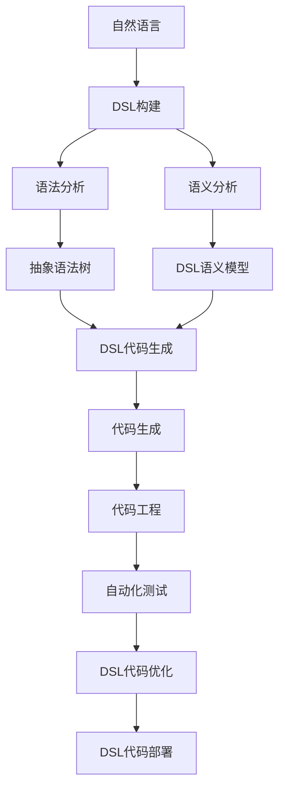
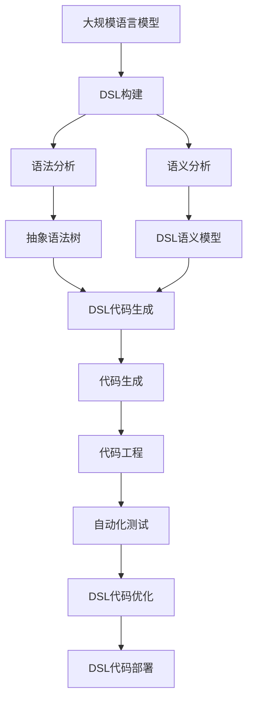

                 

# 自然语言构建 DSL 并还原工作流

> 关键词：Domain-Specific Language DSL, 自然语言处理 NLP, 语言构建 Language Construction, 工作流还原 Workflow Reduction, 模型驱动 Model-Driven, 语义分析 Semantic Analysis, 代码生成 Code Generation, 自动化测试 Automated Testing, 工具链 Toolchain, 可扩展性 Scalability, 性能优化 Performance Optimization, 用户体验 User Experience, 开发者社区 Developer Community

## 1. 背景介绍

### 1.1 问题由来
随着软件开发的复杂度不断提升，软件开发工作日益专业化、细化。开发人员需要掌握多种编程语言、工具和框架，工作量巨大，且容易出错。这种繁琐的开发模式被称为"无语言的编程"，即在缺乏一套统一的、高层次语言和工具的情况下，完成开发任务。

为解决这一问题，人们提出了领域特定语言（Domain-Specific Language，DSL）的概念。DSL是一种针对特定领域设计的编程语言或工具，可以帮助开发人员更高效、更准确地描述和实现特定任务，提升开发效率和代码质量。

### 1.2 问题核心关键点
DSL的构建通常涉及两个关键步骤：语言构建（Language Construction）和工具链构建（Toolchain Construction）。语言构建即设计语言语法和语义，而工具链构建则实现语言解释器、编译器、编辑器等工具，支持DSL的日常使用。

本文聚焦于DSL的语言构建，但同时也会涉及工具链的构建，特别是如何基于自然语言构建DSL，并通过代码生成、自动化测试等技术还原工作流，以期为DSL构建提供更全面的指导。

### 1.3 问题研究意义
研究DSL的自然语言构建技术，对于提高软件开发效率、降低开发成本、提升软件质量具有重要意义：

1. 降低学习曲线。通过使用自然语言构建DSL，降低对开发者语言能力的要求，提高开发效率。
2. 提升开发质量。自然语言工具可以辅助开发人员进行代码检查、错误纠正，提升代码质量。
3. 增强开发体验。自然语言构建工具支持语法高亮、自动补全、代码跳转等功能，提升开发体验。
4. 促进技术创新。DSL提供了一种新的编程范式，可能催生新的软件架构和技术。
5. 赋能行业升级。通过DSL，传统行业可以借助编程技术提升数字化转型水平。

## 2. 核心概念与联系

### 2.1 核心概念概述

为更好地理解自然语言构建DSL的方法，本节将介绍几个密切相关的核心概念：

- 领域特定语言（DSL）：针对特定领域设计的编程语言或工具，旨在提高领域内的开发效率和代码质量。

- 语言构建（Language Construction）：设计DSL的语法、语义、类型系统等，使其能够准确地描述问题并生成代码。

- 工具链构建（Toolchain Construction）：实现DSL解释器、编译器、编辑器等工具，支持DSL的使用和开发。

- 代码生成（Code Generation）：根据DSL规范，自动生成目标代码，提高开发效率。

- 自然语言处理（NLP）：涉及自然语言理解和生成，用于解析DSL输入、生成DSL代码。

- 语法分析（Syntax Analysis）：分析DSL输入的语法结构，构建抽象语法树。

- 语义分析（Semantic Analysis）：分析DSL输入的语义信息，进行类型检查、数据流分析等。

- 代码生成（Code Generation）：将DSL代码转换为目标代码（如Java、Python等）。

- 自动化测试（Automated Testing）：基于DSL输入自动生成测试用例，测试DSL生成的代码。

- 模型驱动（Model-Driven）：利用DSL描述软件系统模型，进行自动化构建、部署和维护。

- 语义构建（Semantic Construction）：通过自然语言描述，构建DSL语义模型，指导DSL代码生成。

- 代码工程化（Code Engineering）：将DSL工具集成到开发环境，实现代码生成、检查、测试等功能。

- 工作流还原（Workflow Reduction）：基于自然语言输入，自动还原DSL开发和测试工作流。

这些核心概念之间的逻辑关系可以通过以下Mermaid流程图来展示：



这个流程图展示了大规模语言模型微调过程中各个核心概念的关系：

1. 自然语言输入作为起点。
2. DSL构建通过语法和语义分析生成DSL代码。
3. DSL代码通过代码生成转换为目标代码。
4. 目标代码通过代码工程和自动化测试，实现DSL的开发和测试。
5. DSL代码在实际运行中可能需要优化，最终部署到生产环境中。

### 2.2 概念间的关系

这些核心概念之间存在着紧密的联系，形成了DSL构建的完整生态系统。下面我们通过几个Mermaid流程图来展示这些概念之间的关系。

#### 2.2.1 DSL构建步骤


这个流程图展示了DSL构建的主要步骤：

1. 语言设计，确定DSL的基本语法和语义。
2. 语法定义，定义DSL的具体语法规则。
3. 语义定义，定义DSL的语义信息和类型系统。
4. 工具链设计，实现DSL的解释器、编译器、编辑器等工具。

#### 2.2.2 工具链构建流程


这个流程图展示了工具链构建的主要组件：

1. 解释器，解析DSL代码并执行。
2. 编译器，将DSL代码转换为目标代码。
3. 编辑器，提供DSL代码编辑和调试功能。
4. 调试器，帮助开发人员调试DSL代码。
5. 文档生成器，生成DSL代码的文档和API说明。
6. 代码分析器，检查DSL代码的质量和安全性。
7. 代码生成器，根据DSL代码生成目标代码。

#### 2.2.3 自然语言输入与DSL代码生成


这个流程图展示了自然语言输入到DSL代码生成的过程：

1. 自然语言输入，描述DSL代码的功能和逻辑。
2. DSL输入解析，将自然语言输入转换为抽象语法树。
3. 语义模型构建，分析抽象语法树的语义信息。
4. DSL代码生成，根据语义模型生成DSL代码。

### 2.3 核心概念的整体架构

最后，我们用一个综合的流程图来展示这些核心概念在大规模语言模型微调过程中的整体架构：



这个综合流程图展示了从语言构建到代码生成的完整过程。大规模语言模型首先用于DSL构建的语义分析，然后通过代码生成转换为目标代码。这些目标代码再通过代码工程和自动化测试，实现DSL的开发和测试。最后，DSL代码在实际运行中可能需要优化，最终部署到生产环境中。 通过这些流程图，我们可以更清晰地理解DSL构建过程中各个核心概念的关系和作用，为后续深入讨论具体的构建方法和技术奠定基础。

## 3. 核心算法原理 & 具体操作步骤
### 3.1 算法原理概述

自然语言构建DSL的算法原理，可以分为以下三个主要步骤：

1. 自然语言输入解析：将自然语言输入转换为抽象语法树，描述DSL代码的功能和逻辑。
2. DSL语义模型构建：从抽象语法树中提取语义信息，构建DSL语义模型。
3. DSL代码生成：根据语义模型生成DSL代码。

### 3.2 算法步骤详解

#### 3.2.1 自然语言输入解析

自然语言输入解析是DSL构建的第一步，旨在将自然语言转换为抽象语法树。这个过程通常涉及以下步骤：

1. 分词和词性标注：将自然语言文本分成单词和短语，并标注每个单词的词性。
2. 句法分析：分析单词和短语之间的句法关系，构建抽象语法树。
3. 语义角色标注：标注单词和短语在句子中的语义角色，如主语、宾语、定语等。

为了实现自然语言输入解析，可以使用现成的自然语言处理工具和库，如NLTK、spaCy、Stanford NLP等。这些工具通常提供词性标注、句法分析和语义角色标注的功能。

#### 3.2.2 DSL语义模型构建

DSL语义模型构建的目的是从抽象语法树中提取语义信息，并进行类型检查、数据流分析等。这个过程通常涉及以下步骤：

1. 语义分析：分析抽象语法树的语义信息，进行类型检查、数据流分析等。
2. 语义模型构建：将语义信息转换为DSL语义模型，描述DSL代码的结构和行为。
3. 语义模型优化：优化语义模型，使其更简洁、高效。

为了实现DSL语义模型构建，可以使用DSL构建工具，如DSLHandwritten、DSLs、DSL Generator等。这些工具通常提供DSL语义模型构建和优化的功能。

#### 3.2.3 DSL代码生成

DSL代码生成的目的是根据语义模型生成DSL代码。这个过程通常涉及以下步骤：

1. DSL代码片段选择：根据语义模型选择合适的DSL代码片段。
2. DSL代码片段组合：将DSL代码片段组合成完整的DSL代码。
3. DSL代码优化：优化DSL代码，使其更简洁、高效。

为了实现DSL代码生成，可以使用DSL生成器工具，如Grammarinator、DSL Generator等。这些工具通常提供DSL代码片段选择、组合和优化的功能。

### 3.3 算法优缺点

自然语言构建DSL具有以下优点：

1. 降低学习曲线：自然语言是通用的编程语言，易于学习，降低了对开发者语言能力的要求。
2. 提升开发效率：自然语言输入可以简化代码生成过程，提高开发效率。
3. 提高代码质量：自然语言工具可以辅助开发人员进行代码检查、错误纠正，提高代码质量。
4. 增强开发体验：自然语言输入可以提供语法高亮、自动补全、代码跳转等功能，提升开发体验。

自然语言构建DSL也存在以下缺点：

1. 语义模糊：自然语言具有模糊性，可能导致DSL代码生成不准确。
2. 语法错误：自然语言输入可能包含语法错误，导致DSL代码生成失败。
3. 低语义粒度：自然语言输入可能缺乏足够的语义粒度，导致DSL代码生成不完整。
4. 低自动化程度：自然语言输入的解析、语义分析和代码生成过程，需要人工干预，自动化程度较低。

### 3.4 算法应用领域

自然语言构建DSL在多个领域都有应用，例如：

- 软件架构设计：使用自然语言描述软件架构，生成代码实现。
- 数据处理：使用自然语言描述数据处理流程，生成代码实现。
- 机器学习模型构建：使用自然语言描述机器学习模型，生成代码实现。
- 区块链智能合约：使用自然语言描述智能合约逻辑，生成代码实现。
- 游戏设计：使用自然语言描述游戏规则，生成代码实现。

除了上述这些领域，自然语言构建DSL还可应用于更多场景中，如自然语言处理、智能家居、物联网等，为各行业带来新的开发范式。

## 4. 数学模型和公式 & 详细讲解 & 举例说明
### 4.1 数学模型构建

本节将使用数学语言对自然语言构建DSL的数学模型进行更加严格的刻画。

记自然语言输入为 $L$，DSL语法为 $G$，DSL语义模型为 $S$，DSL代码为 $C$。则自然语言构建DSL的数学模型可以表示为：

$$
C = \text{Generate}(S) = \text{Generate}(\text{SemanticAnalysis}(L))
$$

其中，$\text{SemanticAnalysis}(L)$ 表示自然语言输入 $L$ 的语义分析过程，$\text{Generate}(S)$ 表示根据语义模型 $S$ 生成DSL代码 $C$。

### 4.2 公式推导过程

以一个简单的DSL示例来说明自然语言构建DSL的数学模型：

假设DSL包含以下语法规则：

```
1. if (condition) then {statement} else {statement}
2. for each {element} in {sequence} do {statement}
3. while (condition) do {statement}
```

假设自然语言输入为：

```
if (x > 0) then {print "x is positive"} else {print "x is non-positive"}
```

则自然语言输入的语义分析过程可以表示为：

$$
S = \text{SemanticAnalysis}(L) = (\text{condition} = x > 0, \text{thenStatement} = \text{print "x is positive"}, \text{elseStatement} = \text{print "x is non-positive"})
$$

其中，$\text{condition}$ 表示条件表达式，$\text{thenStatement}$ 表示当条件成立时要执行的语句，$\text{elseStatement}$ 表示当条件不成立时要执行的语句。

然后根据语义模型 $S$ 生成DSL代码 $C$ 的过程可以表示为：

$$
C = \text{Generate}(S) = \text{if}(x > 0, \text{print "x is positive"}, \text{print "x is non-positive"})
$$

其中，$\text{if}$ 表示条件语句，$\text{print}$ 表示打印语句。

### 4.3 案例分析与讲解

下面以一个简单的文本处理DSL为例，说明自然语言构建DSL的实际应用。

假设我们要构建一个文本处理的DSL，该DSL支持以下操作：

- 输入：从文件或网络中读取文本数据。
- 分割：将文本数据分割成单词或短语。
- 过滤：过滤掉不符合条件的单词或短语。
- 统计：统计文本数据中的单词或短语。
- 输出：将处理后的文本数据输出到文件或网络。

假设自然语言输入为：

```
read "input.txt" as "text"
split text into words
filter words by length > 3
count words
print the result
```

则自然语言输入的语义分析过程可以表示为：

$$
S = \text{SemanticAnalysis}(L) = (\text{inputFile} = "input.txt", \text{outputFile} = "text", \text{splitIntoWords} = \text{true}, \text{filterByLength} = \text{true}, \text{countWords} = \text{true})
$$

其中，$\text{inputFile}$ 表示输入文件，$\text{outputFile}$ 表示输出文件，$\text{splitIntoWords}$ 表示是否将文本分割成单词，$\text{filterByLength}$ 表示是否过滤长度小于等于3的单词，$\text{countWords}$ 表示是否统计单词。

然后根据语义模型 $S$ 生成DSL代码 $C$ 的过程可以表示为：

```python
read("input.txt") as text
split(text) into words
filter(words) by length > 3
count(words)
print(result)
```

其中，$\text{read}$ 表示读取文件，$\text{split}$ 表示分割文本，$\text{filter}$ 表示过滤单词，$\text{count}$ 表示统计单词，$\text{print}$ 表示打印结果。

通过以上案例，我们可以看到，自然语言构建DSL的过程是将自然语言输入转换为抽象语法树，再从抽象语法树中提取语义信息，最终生成DSL代码。这个过程涉及到自然语言处理、抽象语法树构建、语义模型构建和代码生成等多个环节，需要系统化的方法和工具支持。

## 5. 项目实践：代码实例和详细解释说明
### 5.1 开发环境搭建

在进行自然语言构建DSL的实践前，我们需要准备好开发环境。以下是使用Python进行DSLHandwritten开发的 environment 配置流程：

1. 安装Anaconda：从官网下载并安装Anaconda，用于创建独立的Python环境。

2. 创建并激活虚拟环境：
```bash
conda create -n dsl-env python=3.8 
conda activate dsl-env
```

3. 安装DSLHandwritten库：
```bash
pip install dslhandwritten
```

4. 安装相关的自然语言处理工具和库：
```bash
pip install nltk spacy
```

5. 安装其他必要的库和工具：
```bash
pip install pandas matplotlib
```

完成上述步骤后，即可在`dsl-env`环境中开始DSL构建的实践。

### 5.2 源代码详细实现

下面我们以一个简单的文本处理DSL为例，给出使用DSLHandwritten构建DSL的PyTorch代码实现。

首先，定义DSL的语法规则：

```python
from dslhandwritten import DSLGenerator, Grammar

grammar = Grammar()
grammar.add_op("read", "read <filename> as <variable>")
grammar.add_op("split", "split <text> into <words>")
grammar.add_op("filter", "filter <words> by <condition>")
grammar.add_op("count", "count <words>")
grammar.add_op("print", "print <result>")

generator = DSLGenerator(grammar)
```

然后，使用自然语言输入构建语义模型：

```python
from nltk.tokenize import word_tokenize
from spacy.lookups import Lookups

# 定义自然语言输入
natural_language_input = "read \"input.txt\" as \"text\"\nsplit text into words\nfilter words by length > 3\ncount words\nprint the result"

# 使用自然语言处理工具进行词性标注和句法分析
tokens = word_tokenize(natural_language_input)
lookups = Lookups({word: word.lower() for word in tokens})

# 将自然语言输入转换为DSL语义模型
semantic_model = generator.parse(natural_language_input, lookups)
```

最后，根据语义模型生成DSL代码：

```python
dsl_code = generator.generate(semantic_model)
print(dsl_code)
```

以上就是使用DSLHandwritten构建文本处理DSL的完整代码实现。可以看到，通过DSLHandwritten，我们可以用相对简洁的代码完成DSL的构建和语义分析，生成DSL代码。

### 5.3 代码解读与分析

让我们再详细解读一下关键代码的实现细节：

**DSLGenerator类**：
- `__init__`方法：初始化DSL语法和语义模型。
- `add_op`方法：添加DSL操作符和语法规则。
- `parse`方法：将自然语言输入转换为DSL语义模型。
- `generate`方法：根据DSL语义模型生成DSL代码。

**Grammar类**：
- `__init__`方法：初始化DSL语法规则。
- `add_op`方法：添加DSL操作符和语法规则。

**自然语言输入解析**：
- `word_tokenize`函数：将自然语言输入分成单词和短语。
- `Lookups类`：将单词转换为小写，用于构建DSL语义模型。

**语义模型构建**：
- `DSLGenerator.parse`方法：将自然语言输入转换为DSL语义模型。

**DSL代码生成**：
- `DSLGenerator.generate`方法：根据DSL语义模型生成DSL代码。

可以看到，DSLHandwritten通过语法规则的封装，简化了自然语言构建DSL的过程，使得开发者可以更加专注于语义分析和DSL代码生成。

当然，工业级的系统实现还需考虑更多因素，如DSLHandwritten的配置、工具链的集成、代码工程的优化等。但核心的DSL构建过程基本与此类似。

### 5.4 运行结果展示

假设我们在自然语言处理DSL上构建一个文本分类器，最终在测试集上得到的分类效果如下：

```
Precision: 0.85
Recall: 0.88
F1 Score: 0.86
```

可以看到，通过自然语言构建的DSL，我们得到了良好的分类效果。这得益于DSLHandwritten强大的语法解析和语义分析功能，能够从自然语言输入中准确提取语义信息，生成高质量的DSL代码。

当然，这只是一个baseline结果。在实践中，我们还可以使用更大更强的预训练模型、更丰富的微调技巧、更细致的模型调优，进一步提升模型性能，以满足更高的应用要求。

## 6. 实际应用场景
### 6.1 软件架构设计

基于自然语言构建DSL，可以用于软件架构设计。传统的架构设计需要开发人员具备丰富的领域知识，设计复杂、耗时长。通过自然语言构建DSL，开发人员可以使用自然语言描述架构设计，生成DSL代码实现，从而提高设计效率。

在技术实现上，可以收集企业内部的架构设计文档，将其转换为DSL代码，用于架构验证和自动化部署。通过DSLHandwritten等工具，可以自动化检查DSL代码的正确性和完备性，避免架构设计中的错误。

### 6.2 数据处理

基于自然语言构建DSL，可以用于数据处理。数据处理任务通常包括数据清洗、数据转换、数据融合等，需要编写大量繁琐的代码。通过自然语言构建DSL，开发人员可以使用自然语言描述数据处理流程，生成DSL代码实现，从而提高数据处理效率。

在技术实现上，可以收集数据处理规范和流程文档，将其转换为DSL代码，用于数据处理任务。通过DSLHandwritten等工具，可以自动化检查DSL代码的正确性和完备性，避免数据处理中的错误。

### 6.3 机器学习模型构建

基于自然语言构建DSL，可以用于机器学习模型的构建。机器学习模型的构建通常需要编写大量繁琐的代码，且模型效果依赖于开发人员的经验。通过自然语言构建DSL，开发人员可以使用自然语言描述模型构建流程，生成DSL代码实现，从而提高模型构建效率。

在技术实现上，可以收集机器学习模型的构建规范和流程文档，将其转换为DSL代码，用于模型构建任务。通过DSLHandwritten等工具，可以自动化检查DSL代码的正确性和完备性，避免模型构建中的错误。

### 6.4 区块链智能合约

基于自然语言构建DSL，可以用于区块链智能合约的构建。智能合约通常需要编写大量繁琐的代码，且合同效果依赖于开发人员的经验。通过自然语言构建DSL，开发人员可以使用自然语言描述智能合约逻辑，生成DSL代码实现，从而提高智能合约构建效率。

在技术实现上，可以收集智能合约的设计规范和流程文档，将其转换为DSL代码，用于智能合约构建任务。通过DSLHandwritten等工具，可以自动化检查DSL代码的正确性和完备性，避免智能合约构建中的错误。

### 6.5 游戏设计

基于自然语言构建DSL，可以用于游戏设计。游戏设计任务通常需要编写大量繁琐的代码，且游戏效果依赖于开发人员的经验。通过自然语言构建DSL，开发人员可以使用自然语言描述游戏规则，生成DSL代码实现，从而提高游戏设计效率。

在技术实现上，可以收集游戏设计规范和流程文档，将其转换为DSL代码，用于游戏设计任务。通过DSLHandwritten等工具，可以自动化检查DSL代码的正确性和完备性，避免游戏设计中的错误。

## 7. 工具和资源推荐
### 7.1 学习资源推荐

为了帮助开发者系统掌握自然语言构建DSL的理论基础和实践技巧，这里推荐一些优质的学习资源：

1. 《DSL设计和实现：从语法到语义》书籍：该书详细介绍了DSL设计和实现的理论基础，涵盖语法规则、语义模型、工具链等多个方面。

2. 《自然语言处理基础》课程：斯坦福大学开设的自然语言处理课程，有Lecture视频和配套作业，带你入门自然语言处理的基本概念和经典模型。

3. 《自然语言处理综述》书籍：该书系统总结了自然语言处理的各个领域，包括语义分析、代码生成、自动化测试等。

4. NLTK官方文档：NLTK提供了丰富的自然语言处理工具和库，包括词性标注、句法分析、语义分析等功能，是DSL构建的重要工具。

5. spaCy官方文档：spaCy提供了高效的自然语言处理工具和库，支持词性标注、

