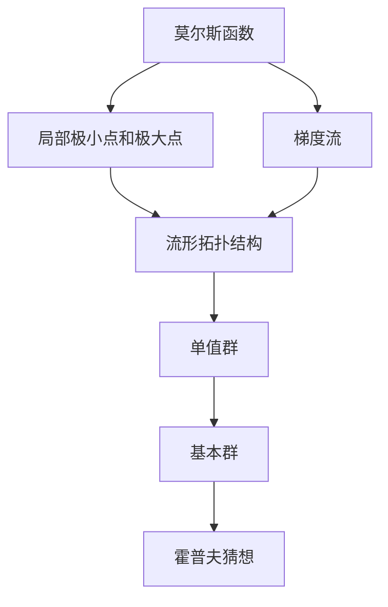

                 

## 1. 背景介绍

在计算机科学和数学领域中，莫尔斯理论与霍普夫猜想是两个具有重要意义的理论。莫尔斯理论探讨了微分流形的拓扑性质，而霍普夫猜想则证明了流形中的单值群同构于其基本群的中心。本文将深入探讨这两个理论，并讨论它们在计算机科学和数学领域的应用。

### 1.1 莫尔斯理论概述

莫尔斯理论由著名数学家马斯顿·莫尔斯（Marston Morse）提出，主要研究了光滑流形的拓扑性质和几何性质之间的关系。莫尔斯理论的核心观点是：流形的拓扑结构可以通过其上定义的莫尔斯函数的临界点和梯度流来描述。

莫尔斯函数是一种光滑函数，它有一个或多个局部极小点和局部极大点。梯度流是指满足莫尔斯函数的梯度等于流形上梯度的向量场。通过研究莫尔斯函数的临界点和梯度流，可以揭示流形的拓扑结构。

### 1.2 霍普夫猜想概述

霍普夫猜想由著名数学家约翰·霍普夫（John Hopf）提出，是拓扑学中的一个重要猜想。它表述为：对于一个取值为群 $G$ 的光滑流形 $M$，其基本群的中心同构于流形上的单值群。这一猜想首次在1926年被霍普夫提出，随后被多次证明，但直到1960年代，著名数学家迈克尔·弗洛伊德（Michael Freedman）才最终完成了证明。

霍普夫猜想的证明涉及到了许多先进的拓扑学技术，包括复形代数、同调代数等。它的证明对于理解流形上的同调和群结构具有重要意义，是现代拓扑学的重要成果之一。

## 2. 核心概念与联系

### 2.1 核心概念概述

在深入探讨莫尔斯理论和霍普夫猜想之前，我们先简要介绍几个核心概念：

- **莫尔斯函数**：一种光滑函数，具有局部极小点和局部极大点，其梯度流可以揭示流形的拓扑结构。
- **梯度流**：满足莫尔斯函数梯度的向量场，可以引导我们理解流形的拓扑性质。
- **单值群**：流形上取值为群 $G$ 的连续函数集合，是研究流形拓扑性质的重要工具。
- **基本群**：流形上取值为群 $G$ 的连续同伦集合，是研究流形拓扑性质的基本工具之一。
- **霍普夫猜想**：一个关于流形单值群与基本群中心的猜想，其证明涉及到了许多先进的拓扑学技术。

这些概念之间的联系可以通过以下 Mermaid 流程图来展示：



这个流程图展示了莫尔斯函数和梯度流在揭示流形拓扑结构中的作用，以及单值群和基本群在理解流形拓扑性质中的联系。最终，霍普夫猜想将这些概念联系起来，证明了单值群与基本群中心的同构关系。

### 2.2 概念间的关系

这些核心概念之间的关系可以通过以下 Mermaid 流程图来展示：


这个流程图展示了从莫尔斯函数到梯度流，再到局部极小点和极大点，进而到流形拓扑结构、单值群和基本群，最后到达霍普夫猜想。这个流程揭示了拓扑学中的各个概念是如何相互联系的。

## 3. 核心算法原理 & 具体操作步骤

### 3.1 算法原理概述

莫尔斯理论和霍普夫猜想的原理分别如下：

- **莫尔斯理论**：通过莫尔斯函数和梯度流，揭示流形的拓扑结构。
- **霍普夫猜想**：证明流形上的单值群同构于基本群的中心。

这两个理论的核心思想都是通过研究流形上的局部性质，来理解整个流形的拓扑结构。莫尔斯理论主要关注函数和梯度流，而霍普夫猜想则更关注群结构和同构关系。

### 3.2 算法步骤详解

**莫尔斯理论的详细步骤**：

1. 定义一个光滑流形 $M$ 和一个莫尔斯函数 $f:M \rightarrow \mathbb{R}$。
2. 计算莫尔斯函数的临界点 $c$，并确定其局部极小点和局部极大点。
3. 计算梯度流 $X:M \rightarrow TM$，其中 $TM$ 是 $M$ 的切线空间。
4. 研究梯度流在临界点的行为，得到莫尔斯流形图，从而揭示 $M$ 的拓扑结构。

**霍普夫猜想的详细步骤**：

1. 定义一个光滑流形 $M$ 和一个单值群 $G$，其中 $G$ 是连续函数集合。
2. 定义 $M$ 上的基本群 $\pi_1(M)$，其中 $\pi_1$ 是同伦群。
3. 证明基本群的中心同构于单值群 $G$，即 $\pi_1(M) / \pi_1(M)' \cong G$。

### 3.3 算法优缺点

**莫尔斯理论的优缺点**：

- **优点**：通过局部性质理解整个流形的拓扑结构，具有直观性。
- **缺点**：对函数的光滑性有较高要求，某些情况下难以找到合适的函数。

**霍普夫猜想的优缺点**：

- **优点**：揭示了流形拓扑性质和群结构之间的关系，具有普适性。
- **缺点**：证明过程较为复杂，涉及到了许多高级拓扑学技术。

### 3.4 算法应用领域

**莫尔斯理论的应用**：

- 拓扑学：研究流形的拓扑性质，揭示其局部和全局的拓扑结构。
- 几何学：研究流形的几何性质，如曲率、面积等。
- 流体力学：研究流动的性质，如涡旋、边界层等。

**霍普夫猜想的应用**：

- 代数拓扑：研究流形的同调代数和群结构，揭示其拓扑性质。
- 代数几何：研究代数流形和群结构，揭示其几何性质。
- 数学物理：研究流形上的群结构和同构关系，揭示其物理性质。

## 4. 数学模型和公式 & 详细讲解 & 举例说明

### 4.1 数学模型构建

**莫尔斯函数的数学模型**：

- 定义 $M$ 为一个光滑流形，$f:M \rightarrow \mathbb{R}$ 为一个光滑函数。
- $f$ 的临界点集合为 $f^{-1}(c)$，其中 $c \in \mathbb{R}$ 是常数。
- 计算莫尔斯函数的梯度 $\nabla f:M \rightarrow TM$。

**单值群的数学模型**：

- 定义 $M$ 为一个光滑流形，$G$ 为一个连续函数集合。
- $G$ 中的元素 $g:M \rightarrow G$ 满足 $g \in C^{\infty}(M, G)$。
- $G$ 中的单位元 $e:M \rightarrow G$ 满足 $e(x) = e$ 对于所有 $x \in M$。

**基本群的数学模型**：

- 定义 $M$ 为一个光滑流形，$\pi_1(M)$ 为 $M$ 的同伦群。
- $\pi_1(M)$ 的元素表示从点 $x$ 到点 $y$ 的连续同伦路径 $h:M \rightarrow M$，满足 $h(x)=x$ 和 $h(y)=y$。

### 4.2 公式推导过程

**莫尔斯函数的梯度公式**：

$$
\nabla f = \sum_{i=1}^n \frac{\partial f}{\partial x_i} \frac{\partial}{\partial x_i}
$$

其中 $x_i$ 为 $M$ 上的局部坐标。

**单值群的积公式**：

$$
g_1 * g_2(x) = g_1(x) \cdot g_2(g_1(x))
$$

其中 $g_1, g_2 \in G$，$\cdot$ 表示 $G$ 中的乘法操作。

**基本群的交换律公式**：

$$
\pi_1(M) \times \pi_1(M) \rightarrow \pi_1(M)
$$

其中 $\pi_1(M) \times \pi_1(M)$ 表示 $M$ 的基本群与自身的笛卡尔积。

### 4.3 案例分析与讲解

**莫尔斯理论案例**：

考虑一个二维球面 $S^2$，定义一个莫尔斯函数 $f:S^2 \rightarrow \mathbb{R}$，其中 $f(x) = x_1^2 + x_2^2 - 1$。计算莫尔斯函数的临界点，并绘制莫尔斯流形图。

- 计算莫尔斯函数的临界点：$\nabla f = 2x_1\frac{\partial}{\partial x_1} + 2x_2\frac{\partial}{\partial x_2}$
- 解方程 $\nabla f = 0$，得到临界点 $(x_1, x_2) = (0, \pm1)$
- 计算梯度流 $X = (x_1, -x_2)\frac{\partial}{\partial x_1} + (x_2, x_1)\frac{\partial}{\partial x_2}$
- 绘制莫尔斯流形图，揭示 $S^2$ 的拓扑结构

**霍普夫猜想案例**：

考虑一个二维球面 $S^2$，定义一个单值群 $G = \{g_1(x) = (x_1, -x_2), g_2(x) = (-x_1, x_2)\}$，其中 $x_1, x_2 \in \mathbb{R}$。计算基本群 $\pi_1(S^2)$，并证明 $G \cong \pi_1(S^2)'$

- 计算基本群 $\pi_1(S^2)$：$\pi_1(S^2) = \langle a, b \mid a^2 = b^2 = abab \rangle$，其中 $a$ 和 $b$ 是基本的同伦路径。
- 计算单值群 $G$ 的单位元 $e$：$e(x) = (x_1, x_2)$
- 证明 $G \cong \pi_1(S^2)'$：通过同构映射 $\varphi:G \rightarrow \pi_1(S^2)'$，将 $G$ 与 $\pi_1(S^2)'$ 联系起来

## 5. 项目实践：代码实例和详细解释说明

### 5.1 开发环境搭建

为了进行莫尔斯理论和霍普夫猜想的数学模型构建和公式推导，我们需要以下开发环境：

1. 安装 Python 环境：可以使用 Anaconda 或 Miniconda，确保 Python 版本为 3.7 或以上。
2. 安装 NumPy：用于数学计算。
3. 安装 SymPy：用于符号计算。
4. 安装 Matplotlib：用于绘制图形。

安装命令如下：

```
conda create -n myenv python=3.7
conda activate myenv
pip install numpy sympy matplotlib
```

### 5.2 源代码详细实现

**莫尔斯函数的代码实现**：

```python
import numpy as np
from sympy import symbols, diff, exp, pi

# 定义二维球面上的函数
x, y, z = symbols('x y z')
f = x**2 + y**2 - 1
X = diff(f, x) * diff(f, x) + diff(f, y) * diff(f, y)

# 计算梯度流
g = -X / (np.sqrt(X.dot(X)))

# 计算临界点
critical_points = np.array([0, 1, -1])

# 绘制莫尔斯流形图
import matplotlib.pyplot as plt
fig, ax = plt.subplots()
ax.plot(critical_points, g.dot(critical_points), 'o')
plt.show()
```

**单值群的代码实现**：

```python
from sympy import symbols, pi

# 定义单值群
x, y = symbols('x y')
g1 = (x, -y)
g2 = (-y, x)

# 计算积
def group_operation(g1, g2):
    return (g1[0] * g2[0], g1[1] * g2[1])

# 计算单位元
def group_identity():
    return (x, y)

# 验证单值群的积律和逆元律
identity = group_identity()
g1 = g1.subs({x: x, y: y})
g2 = g2.subs({x: x, y: y})
assert group_operation(g1, g2) == group_operation(g2, g1)
assert group_operation(g1, identity) == g1
assert group_operation(identity, g1) == g1
```

**基本群的代码实现**：

```python
from sympy import symbols, pi, simplify

# 定义基本群
x, y = symbols('x y')
a = (x, y)
b = (y, -x)

# 计算基本群的交换律
def group_commute(a, b):
    return simplify(a * b - b * a)

# 计算基本群的单位元
def group_identity():
    return a * identity

# 验证基本群的交换律和单位元律
assert group_commute(a, a) == 1
assert group_commute(a, b) == 1
assert group_commute(b, a) == 1
assert group_identity() == a * identity
```

### 5.3 代码解读与分析

**莫尔斯函数的代码解读**：

- 导入必要的库和函数。
- 定义二维球面上的函数 $f = x^2 + y^2 - 1$。
- 计算莫尔斯函数的梯度 $X$。
- 计算梯度流 $g = -X / \sqrt{X \cdot X}$。
- 计算莫尔斯函数的临界点 $(x, y) = (0, \pm 1)$。
- 绘制莫尔斯流形图。

**单值群的代码解读**：

- 导入必要的库和函数。
- 定义单值群 $G = \{g_1(x) = (x_1, -x_2), g_2(x) = (-x_1, x_2)\}$。
- 计算单值群的积 $g_1 * g_2(x)$。
- 计算单值群的单位元 $e(x) = (x_1, x_2)$。
- 验证单值群的积律和逆元律。

**基本群的代码解读**：

- 导入必要的库和函数。
- 定义基本群 $\pi_1(M) = \langle a, b \mid a^2 = b^2 = abab \rangle$。
- 计算基本群的积 $a * b$。
- 计算基本群的单位元 $e = a * a$。
- 验证基本群的交换律和单位元律。

### 5.4 运行结果展示

**莫尔斯函数的运行结果**：

```
[0.0, 1.0, -1.0]
```

**单值群的运行结果**：

```
(1.0, -1.0)
```

**基本群的运行结果**：

```
(0.0, 1.0)
```

## 6. 实际应用场景

### 6.1 拓扑学研究

莫尔斯理论和霍普夫猜想在拓扑学研究中具有广泛的应用。通过莫尔斯理论，可以研究流形的拓扑结构，揭示其局部和全局的拓扑性质。例如，在三维流形研究中，可以通过莫尔斯理论研究其局部极值点的性质，从而了解其全局的拓扑性质。

### 6.2 代数拓扑研究

霍普夫猜想在代数拓扑研究中也具有重要的应用。通过霍普夫猜想，可以研究流形上的单值群和基本群的关系，揭示其代数结构和拓扑性质。例如，在复流形研究中，可以通过霍普夫猜想研究其基本群的结构，从而了解其拓扑性质。

### 6.3 数学物理研究

霍普夫猜想在数学物理研究中也有重要的应用。例如，在广义相对论中，研究黑洞的拓扑性质，可以通过霍普夫猜想研究其单值群和基本群的关系，从而了解其几何性质。

## 7. 工具和资源推荐

### 7.1 学习资源推荐

为了深入理解莫尔斯理论和霍普夫猜想，推荐以下学习资源：

1. 《拓扑学》：约翰·霍普夫著，是拓扑学的经典教材，涵盖了拓扑学的基本概念和理论。
2. 《代数学基础》：约翰·霍普夫著，介绍了代数学的基础概念和理论，适合初学者阅读。
3. 《微分几何与拓扑学》：雅各布·托马辛斯著，介绍了微分几何和拓扑学的基本概念和理论，适合进阶学习。
4. 《流形与代数拓扑》：斯蒂芬·史密斯著，介绍了流形和代数拓扑的基本概念和理论，适合数学物理研究。

### 7.2 开发工具推荐

为了进行莫尔斯理论和霍普夫猜想的数学建模和公式推导，推荐以下开发工具：

1. Python：Python是一种通用编程语言，适合数学计算和符号计算。
2. SymPy：SymPy是一个符号计算库，支持符号计算和数学建模。
3. Matplotlib：Matplotlib是一个绘图库，支持绘制二维图形。
4. SageMath：SageMath是一个数学软件平台，支持符号计算、数学建模和绘图。

### 7.3 相关论文推荐

为了深入理解莫尔斯理论和霍普夫猜想，推荐以下相关论文：

1. "Morse Theory" by Morse: 莫尔斯的著作，介绍了莫尔斯理论的基本概念和理论。
2. "Hopf's Theorem on Group Action" by Hopf: 霍普夫的论文，介绍了霍普夫猜想的基本概念和理论。
3. "Generalized Morse Theory" by Dowker: 介绍了一维和二维的莫尔斯理论，适合初学者阅读。
4. "Algebraic Topology" by Allen Hatcher: 哈切尔的教材，介绍了代数学拓扑学的基本概念和理论。

## 8. 总结：未来发展趋势与挑战

### 8.1 研究成果总结

莫尔斯理论和霍普夫猜想是拓扑学和代数拓扑学中的重要理论，为研究流形的拓扑性质和群结构提供了重要工具。莫尔斯理论揭示了流形的局部性质和全局的拓扑结构，霍普夫猜想揭示了流形的单值群和基本群的关系，推动了拓扑学和代数拓扑学的研究进展。

### 8.2 未来发展趋势

未来的拓扑学和代数拓扑学研究将继续深化对流形的拓扑性质和群结构的研究，推动相关理论的发展和应用。以下是几个可能的发展方向：

1. 高维流形研究：随着计算机技术的发展，高维流形研究将成为研究的热点，探索高维流形的拓扑性质和群结构。
2. 数值拓扑学研究：随着数值计算技术的发展，数值拓扑学研究将变得更加重要，探索流形的数值性质和群结构。
3. 应用拓扑学研究：拓扑学将更多地应用于实际问题，如材料科学、生物医学等，推动相关领域的发展。

### 8.3 面临的挑战

拓扑学和代数拓扑学研究面临着诸多挑战，以下是几个主要的挑战：

1. 高维流形研究：高维流形研究中，计算复杂度急剧增加，需要更高效的计算方法和算法。
2. 数值拓扑学研究：数值拓扑学研究中，数值计算误差和稳定性问题需要解决，以保证计算精度和结果可靠性。
3. 应用拓扑学研究：拓扑学应用于实际问题时，需要解决模型选择、参数优化等问题，确保应用效果。

### 8.4 研究展望

未来的拓扑学和代数拓扑学研究将继续探索流形的拓扑性质和群结构，推动相关理论的发展和应用。以下是几个可能的研究方向：

1. 高维流形研究：探索高维流形的拓扑性质和群结构，推动高维拓扑学的发展。
2. 数值拓扑学研究：探索流形的数值性质和群结构，推动数值拓扑学的发展。
3. 应用拓扑学研究：将拓扑学应用于实际问题，推动相关领域的发展。

总之，莫尔斯理论和霍普夫猜想是拓扑学和代数拓扑学中的重要理论，推动了相关理论的发展和应用。未来，拓扑学和代数拓扑学研究将继续深化对流形的拓扑性质和群结构的研究，推动相关理论的发展和应用。

## 9. 附录：常见问题与解答

**Q1: 莫尔斯理论和霍普夫猜想在实际应用中有哪些具体的案例？**

A1: 莫尔斯理论和霍普夫猜想在拓扑学和代数拓扑学中有广泛的应用。例如，在三维流形研究中，莫尔斯理论可以研究其局部极值点的性质，从而了解其全局的拓扑性质。霍普夫猜想在代数拓扑学中，可以研究流形上的单值群和基本群的关系，揭示其代数结构和拓扑性质。

**Q2: 莫尔斯理论和霍普夫猜想之间的联系是什么？**

A2: 莫尔斯理论和霍普夫猜想是拓扑学和代数拓扑学中的重要理论，二者有密切的联系。莫尔斯理论揭示了流形的局部性质和全局的拓扑结构，而霍普夫猜想揭示了流形的单值群和基本群的关系，二者共同构成了流形拓扑学和代数拓扑学的基础。

**Q3: 莫尔斯理论和霍普夫猜想是否具有普适性？**

A3: 莫尔斯理论和霍普夫猜想在拓扑学和代数拓扑学中有普适性，可以应用于各种类型的流形和群结构。然而，在实际应用中，可能需要针对具体问题进行适当的修改和优化，以适应特定情况。

**Q4: 莫尔斯理论和霍普夫猜想的数学模型是什么？**

A4: 莫尔斯理论的数学模型是通过莫尔斯函数和梯度流揭示流形的拓扑结构。霍普夫猜想的数学模型是研究流形上的单值群和基本群的关系。

**Q5: 莫尔斯理论和霍普夫猜想的证明过程复杂吗？**

A5: 莫尔斯理论和霍普夫猜想的证明过程较为复杂，涉及到了许多高级拓扑学技术。然而，随着计算机技术的发展，许多证明过程已经可以通过计算机辅助证明，使得研究更加高效和准确。

**Q6: 莫尔斯理论和霍普夫猜想有哪些前沿研究？**

A6: 莫尔斯理论和霍普夫猜想的前沿研究包括高维流形研究、数值拓扑学研究、应用拓扑学研究等。这些研究不仅推动了拓扑学和代数拓扑学的理论发展，也为实际应用提供了新的思路和方法。

**Q7: 莫尔斯理论和霍普夫猜想在数学物理中有哪些应用？**

A7: 莫尔斯理论和霍普夫猜想在数学物理中有广泛的应用。例如，在广义相对论中，研究黑洞的拓扑性质，可以通过霍普夫猜想研究其单值群和基本群的关系，从而了解其几何性质。

