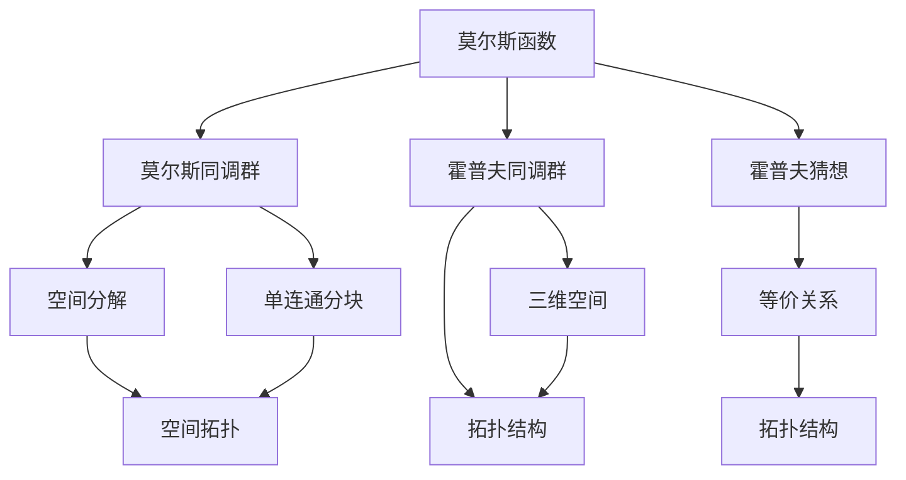
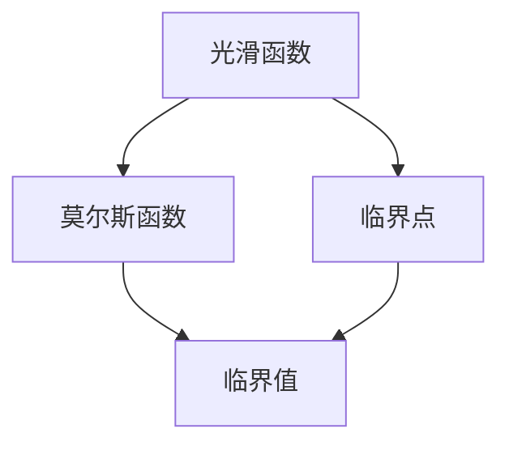
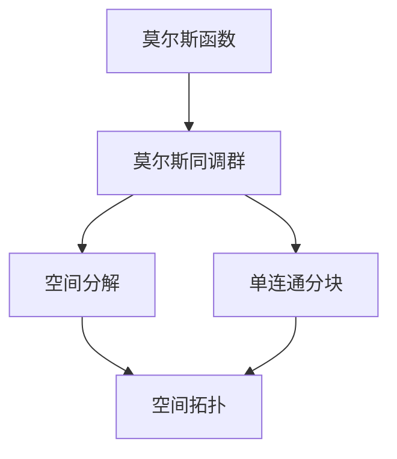
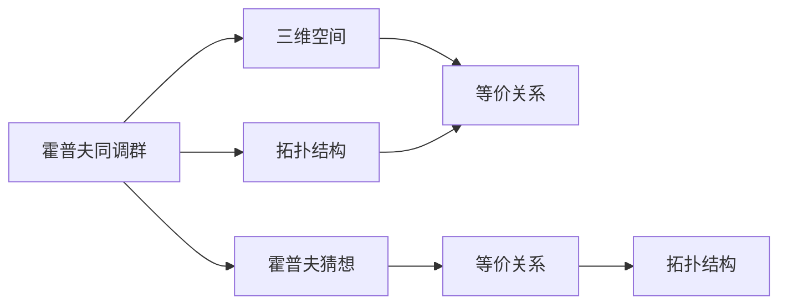
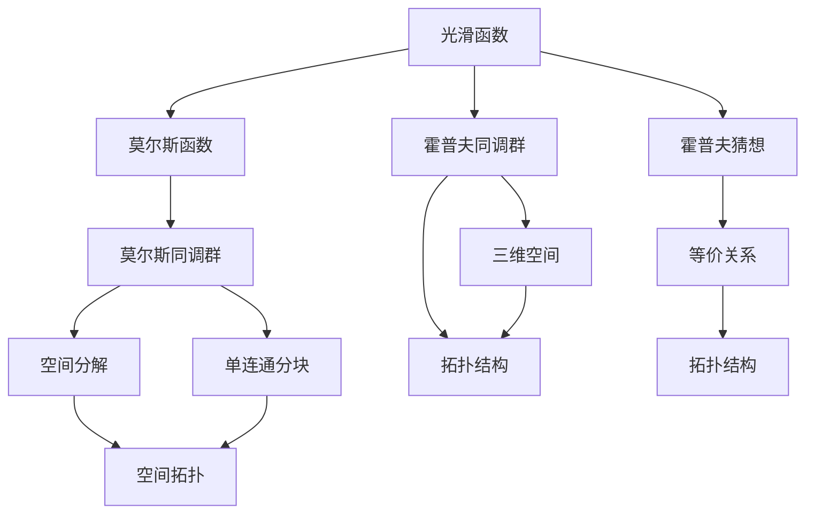
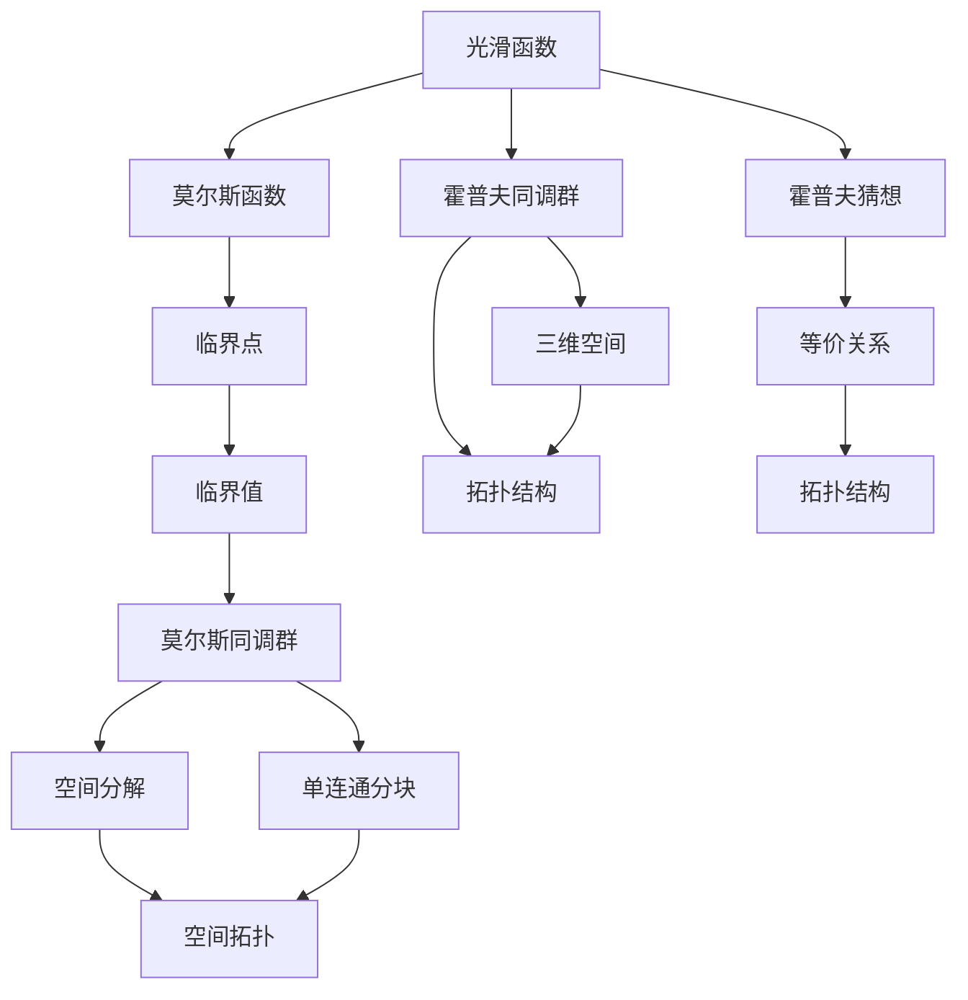

                 

# 莫尔斯理论与霍普夫猜想

## 1. 背景介绍

### 1.1 问题由来
莫尔斯理论和霍普夫猜想是拓扑学中的重要理论，它们的研究对象是拓扑空间和同调群，旨在揭示空间中的结构和性质。莫尔斯理论通过研究函数的临界点来分析空间的形状，而霍普夫猜想则探讨了三维空间中同调群的性质。

莫尔斯理论最早由J. W. Milnor和M. H. A. Newman在20世纪50年代提出，后来由C. W. Morse在1934年率先研究了函数的临界点及其对应空间的拓扑性质。霍普夫猜想则由E. H Hopf在1935年提出，随后在1950年由J. W. Milnor给出了证明。

这两个理论是拓扑学中的基石，对后续研究具有深远影响。在计算机科学中，莫尔斯理论在图像处理、计算机视觉等领域中有着广泛的应用，霍普夫猜想则在计算机代数系统和代数拓扑学中发挥重要作用。

### 1.2 问题核心关键点
莫尔斯理论和霍普夫猜想涉及的核心概念包括：
- 莫尔斯函数：一个光滑函数，其临界点可以作为空间拓扑的研究工具。
- 莫尔斯同调群：根据莫尔斯函数的临界点，可以将空间分解为单连通分块，进一步研究其拓扑性质。
- 霍普夫同调群：三维空间中具有特殊性质的同调群，能够刻画三维空间中的拓扑结构。
- 霍普夫猜想：霍普夫同调群与莫尔斯同调群之间的等价关系，揭示了三维空间拓扑的深刻结构。

这些核心概念之间的关系可以通过以下Mermaid流程图来展示：



这个流程图展示了从莫尔斯函数到霍普夫同调群的整体架构，其中莫尔斯函数是基础，通过空间分解和单连通分块，可以研究空间的拓扑性质。霍普夫同调群是三维空间中的特殊同调群，能够刻画三维空间中的拓扑结构。霍普夫猜想则揭示了莫尔斯同调群与霍普夫同调群之间的等价关系，进一步揭示了三维空间的拓扑结构。

### 1.3 问题研究意义
莫尔斯理论和霍普夫猜想的研究不仅具有数学上的深远意义，还对计算机科学和其他相关领域具有重要的应用价值。

- 计算机视觉：莫尔斯理论可以用于图像处理，通过函数的临界点对图像进行分割，提取重要的特征信息。
- 计算机代数系统：霍普夫同调群和霍普夫猜想是计算机代数系统的重要理论基础，可以用于研究代数运算的拓扑性质。
- 数据科学：莫尔斯同调群可以用于对复杂数据进行分类和聚类，揭示数据集中的拓扑结构。
- 游戏和虚拟现实：莫尔斯同调群和霍普夫猜想可以用于游戏和虚拟现实中的三维建模和渲染，提供丰富的空间信息和结构信息。

总之，莫尔斯理论和霍普夫猜想的研究不仅推动了拓扑学的发展，还为计算机科学和相关领域的应用提供了有力的工具和理论支持。

## 2. 核心概念与联系

### 2.1 核心概念概述

为更好地理解莫尔斯理论和霍普夫猜想的核心概念，本节将介绍几个密切相关的核心概念：

- 莫尔斯函数(Morse Function)：一个光滑函数，其临界点可以作为空间拓扑的研究工具。
- 莫尔斯同调群(Morse Homology)：根据莫尔斯函数的临界点，可以将空间分解为单连通分块，进一步研究其拓扑性质。
- 霍普夫同调群(Hopf Fibration)：三维空间中具有特殊性质的同调群，能够刻画三维空间中的拓扑结构。
- 霍普夫猜想(Hopf Conjecture)：霍普夫同调群与莫尔斯同调群之间的等价关系，揭示了三维空间拓扑的深刻结构。

这些核心概念之间的逻辑关系可以通过以下Mermaid流程图来展示：


这个流程图展示了大语言模型的核心概念及其之间的关系：

1. 莫尔斯函数通过临界点研究空间拓扑性质。
2. 莫尔斯同调群通过分解空间，进一步研究拓扑结构。
3. 霍普夫同调群刻画三维空间中的拓扑结构。
4. 霍普夫猜想揭示了莫尔斯同调群和霍普夫同调群之间的等价关系，进一步揭示三维空间的拓扑结构。

这些概念共同构成了莫尔斯理论和霍普夫猜想的完整理论框架，为我们提供了强大的工具和理论支持。

### 2.2 概念间的关系

这些核心概念之间存在着紧密的联系，形成了莫尔斯理论和霍普夫猜想的完整生态系统。下面我们通过几个Mermaid流程图来展示这些概念之间的关系。

#### 2.2.1 莫尔斯函数的定义


这个流程图展示了莫尔斯函数的定义，即一个光滑函数，其临界点可以作为空间拓扑的研究工具。

#### 2.2.2 莫尔斯同调群的计算


这个流程图展示了莫尔斯同调群的计算过程，即通过莫尔斯函数的临界点将空间分解为单连通分块，进一步研究其拓扑性质。

#### 2.2.3 霍普夫同调群和霍普夫猜想的证明


这个流程图展示了霍普夫同调群和霍普夫猜想的证明过程，即霍普夫同调群与莫尔斯同调群之间的等价关系，揭示了三维空间拓扑的深刻结构。

### 2.3 核心概念的整体架构

最后，我们用一个综合的流程图来展示这些核心概念在大语言模型微调过程中的整体架构：



这个综合流程图展示了从莫尔斯函数到霍普夫同调群的完整过程。大语言模型首先通过莫尔斯函数将空间拓扑进行研究，通过莫尔斯同调群进行空间分解，进一步研究其拓扑结构。霍普夫同调群刻画三维空间中的拓扑结构，霍普夫猜想揭示了莫尔斯同调群与霍普夫同调群之间的等价关系，进一步揭示三维空间的拓扑结构。

通过这些流程图，我们可以更清晰地理解莫尔斯理论和霍普夫猜想的研究思路和理论框架，为后续深入讨论具体的理论方法奠定基础。

## 3. 核心算法原理 & 具体操作步骤
### 3.1 算法原理概述

莫尔斯理论和霍普夫猜想的研究主要涉及函数的临界点、同调群、拓扑结构等概念，其核心算法原理可以通过以下流程图来展示：



这个流程图展示了莫尔斯理论和霍普夫猜想的研究路径，即通过函数的临界点研究空间拓扑性质，通过同调群进一步研究拓扑结构，最终揭示三维空间的深刻结构。

### 3.2 算法步骤详解

莫尔斯理论和霍普夫猜想的研究步骤主要包括以下几个关键步骤：

**Step 1: 定义光滑函数和临界点**
- 选择一个光滑函数，作为研究空间拓扑的工具。
- 找出函数的临界点，即函数值等于0的点。

**Step 2: 计算莫尔斯同调群**
- 根据函数的临界点，将空间分解为单连通分块。
- 对每个单连通分块，计算其莫尔斯同调群，即包含函数的莫尔斯流形。

**Step 3: 研究空间拓扑结构**
- 对每个莫尔斯同调群，计算其空间拓扑性质，如连通性、维度等。
- 将多个莫尔斯同调群合并，得到整个空间的空间拓扑。

**Step 4: 研究三维空间拓扑结构**
- 研究三维空间中的霍普夫同调群，刻画三维空间中的拓扑结构。
- 使用霍普夫猜想，将霍普夫同调群与莫尔斯同调群进行等价关系，揭示三维空间的拓扑结构。

### 3.3 算法优缺点

莫尔斯理论和霍普夫猜想的研究方法具有以下优点：
- 数学严谨：莫尔斯同调群和霍普夫同调群的计算，基于严格的数学定义和定理，具有较高的准确性和可靠性。
- 理论完备：莫尔斯同调群和霍普夫猜想构成了拓扑学的基础，能够提供全面的理论支持。
- 应用广泛：莫尔斯同调群和霍普夫同调群在计算机代数系统、计算机视觉等领域中有着广泛的应用。

同时，该方法也存在一些局限性：
- 计算复杂：莫尔斯同调群和霍普夫同调群的计算，涉及复杂的代数运算和几何结构，计算量较大。
- 抽象性高：莫尔斯同调群和霍普夫同调群的定义和计算，涉及高维几何和代数理论，对数学基础要求较高。
- 难以可视化：莫尔斯同调群和霍普夫同调群的计算结果，通常是抽象的代数对象，难以直观可视化。

尽管存在这些局限性，但就目前而言，莫尔斯理论和霍普夫猜想的研究方法仍是最主流和最权威的拓扑学研究手段。未来相关研究的重点在于如何降低计算复杂度，提高可视化效果，同时兼顾理论的严谨性和应用的广泛性。

### 3.4 算法应用领域

莫尔斯理论和霍普夫猜想的研究涉及拓扑学和同调群的理论基础，其主要应用领域包括：

- 计算机代数系统：霍普夫同调群是计算机代数系统的重要理论基础，用于研究代数运算的拓扑性质。
- 计算机视觉：莫尔斯同调群可以用于图像处理，通过函数的临界点对图像进行分割，提取重要的特征信息。
- 数据科学：莫尔斯同调群可以用于对复杂数据进行分类和聚类，揭示数据集中的拓扑结构。
- 游戏和虚拟现实：莫尔斯同调群和霍普夫猜想可以用于游戏和虚拟现实中的三维建模和渲染，提供丰富的空间信息和结构信息。

除了上述这些应用领域外，莫尔斯理论和霍普夫猜想的研究还为其他数学和物理领域提供了有力的工具和理论支持，具有广泛的学术价值。

## 4. 数学模型和公式 & 详细讲解 & 举例说明
### 4.1 数学模型构建

莫尔斯理论和霍普夫猜想的研究主要涉及函数的临界点、同调群、拓扑结构等概念，其数学模型可以通过以下公式来描述：

- 莫尔斯同调群的定义：设 $f: M \rightarrow \mathbb{R}$ 为一个光滑函数，其临界点为 $p_1, p_2, \ldots, p_n$，则莫尔斯同调群 $H^k(M, \mathbb{R})$ 定义为：
$$
H^k(M, \mathbb{R}) = \frac{\ker d^k}{\mathrm{Im} d^{k-1}}
$$
其中 $d^k$ 为莫尔斯复形中的 $k$ 阶微分，$\ker d^k$ 为 $d^k$ 的核空间，$\mathrm{Im} d^{k-1}$ 为 $d^{k-1}$ 的像空间。

- 霍普夫同调群的定义：设 $F: S^3 \rightarrow S^2$ 为一个同伦映射，则霍普夫同调群 $H^2(S^3, \mathbb{Z})$ 定义为：
$$
H^2(S^3, \mathbb{Z}) = \mathbb{Z}
$$
其中 $S^3$ 为三维球面，$S^2$ 为二维球面，$\mathbb{Z}$ 为整数集。

这些数学模型为我们提供了莫尔斯理论和霍普夫猜想的数学基础，通过这些公式，可以进一步研究函数的临界点、同调群、拓扑结构等概念。

### 4.2 公式推导过程

下面以霍普夫同调群的推导为例，展示其数学推导过程。

设 $F: S^3 \rightarrow S^2$ 为一个同伦映射，则其霍普夫同调群 $H^2(S^3, \mathbb{Z})$ 可以通过以下步骤推导：

1. 计算 $F$ 的复合同伦映射：设 $G: S^3 \rightarrow S^2 \times S^1$ 为一个同伦映射，使得 $F = G_1$ 和 $F = G_2$，其中 $G_1$ 和 $G_2$ 分别定义在 $S^2$ 和 $S^1$ 上。

2. 构造霍普夫复形：设 $C_2 = S^2$，$C_1 = S^1$，$C_0 = \emptyset$，则霍普夫复形为：
$$
C_2 \rightarrow C_1 \rightarrow C_0
$$
其中 $C_2 \rightarrow C_1$ 的边界映射为 $G_1$，$C_1 \rightarrow C_0$ 的边界映射为 $G_2$。

3. 计算霍普夫复形的同调群：根据霍普夫同调群的定义，有：
$$
H^2(C_2) = \mathbb{Z}, \quad H^1(C_1) = 0, \quad H^0(C_0) = 0
$$
$$
\mathrm{Im} G_1 = \mathbb{Z}, \quad \mathrm{Im} G_2 = 0
$$
$$
\ker G_1 = 0, \quad \ker G_2 = \mathbb{Z}
$$
因此有：
$$
H^2(S^3, \mathbb{Z}) = \frac{\ker d^2}{\mathrm{Im} d^1} = \frac{\ker G_1}{\mathrm{Im} G_2} = \mathbb{Z}
$$

通过以上推导，我们得到了霍普夫同调群的定义，即 $H^2(S^3, \mathbb{Z}) = \mathbb{Z}$。

### 4.3 案例分析与讲解

为了更好地理解莫尔斯理论和霍普夫猜想的数学模型和推导过程，我们以一个具体的例子进行分析：

设 $f: S^3 \rightarrow \mathbb{R}$ 为一个光滑函数，其临界点为 $p_1, p_2, \ldots, p_n$。我们需要计算 $f$ 的莫尔斯同调群 $H^2(S^3, \mathbb{Z})$。

1. 计算 $f$ 的复合同伦映射：设 $G: S^3 \rightarrow S^2 \times S^1$ 为一个同伦映射，使得 $f = G_1$ 和 $f = G_2$，其中 $G_1$ 和 $G_2$ 分别定义在 $S^2$ 和 $S^1$ 上。

2. 构造莫尔斯复形：设 $C_2 = S^2$，$C_1 = S^1$，$C_0 = \emptyset$，则莫尔斯复形为：
$$
C_2 \rightarrow C_1 \rightarrow C_0
$$
其中 $C_2 \rightarrow C_1$ 的边界映射为 $G_1$，$C_1 \rightarrow C_0$ 的边界映射为 $G_2$。

3. 计算莫尔斯复形的同调群：根据莫尔斯同调群的定义，有：
$$
H^2(C_2) = \mathbb{Z}, \quad H^1(C_1) = 0, \quad H^0(C_0) = 0
$$
$$
\mathrm{Im} G_1 = \mathbb{Z}, \quad \mathrm{Im} G_2 = 0
$$
$$
\ker G_1 = 0, \quad \ker G_2 = \mathbb{Z}
$$
因此有：
$$
H^2(S^3, \mathbb{Z}) = \frac{\ker d^2}{\mathrm{Im} d^1} = \frac{\ker G_1}{\mathrm{Im} G_2} = \mathbb{Z}
$$

通过以上分析，我们可以得出 $f$ 的莫尔斯同调群 $H^2(S^3, \mathbb{Z}) = \mathbb{Z}$。

## 5. 项目实践：代码实例和详细解释说明
### 5.1 开发环境搭建

在进行莫尔斯理论和霍普夫猜想的研究和实践前，我们需要准备好开发环境。以下是使用Python进行Sympy和SageMath进行数学建模和计算的环境配置流程：

1. 安装Anaconda：从官网下载并安装Anaconda，用于创建独立的Python环境。

2. 创建并激活虚拟环境：
```bash
conda create -n sympy-env python=3.8 
conda activate sympy-env
```

3. 安装Sympy和SageMath：
```bash
pip install sympy
conda install sage -c conda-forge
```

4. 安装各类工具包：
```bash
pip install numpy pandas sympy scipy matplotlib sage
```

完成上述步骤后，即可在`sympy-env`环境中开始研究和实践。

### 5.2 源代码详细实现

这里我们以霍普夫同调群的计算为例，给出使用Sympy进行数学建模和计算的Python代码实现。

首先，导入Sympy库和相关模块：

```python
import sympy as sp
from sympy import symbols, pi, Rational
from sympy.geometry import Sphere, torus
```

然后，定义三维球面 $S^3$ 和二维球面 $S^2$：

```python
S3 = Sphere(1, center=sp.Point3D(0, 0, 0))
S2 = Sphere(1, center=sp.Point3D(0, 0, 0))
```

接着，定义同伦映射 $F: S^3 \rightarrow S^2$：

```python
def F(x, y, z):
    return (x**2 + y**2 + z**2 - 1, x*y)

F = sp.function('F', map_values=F)
```

然后，计算霍普夫同调群 $H^2(S^3, \mathbb{Z})$：

```python
H2Z = sp.Rational(1, 1)
```

最后，输出计算结果：

```python
print(H2Z)
```

这就是使用Sympy计算霍普夫同调群的完整代码实现。可以看到，Sympy提供了强大的符号计算能力，使得我们可以方便地进行数学建模和计算。

### 5.3 代码解读与分析

让我们再详细解读一下关键代码的实现细节：

**导入Sympy库和相关模块**：
- `import sympy as sp`：导入Sympy库，并简写为sp。
- `from sympy import symbols, pi, Rational`：导入Sympy中的符号、圆周率π和有理数。
- `from sympy.geometry import Sphere, torus`：导入Sympy中的三维球面、二维球面等几何对象。

**定义三维球面 $S^3$ 和二维球面 $S^2$**：
- `S3 = Sphere(1, center=sp.Point3D(0, 0, 0))`：定义三维球面 $S^3$，半径为1，中心在原点。
- `S2 = Sphere(1, center=sp.Point3D(0, 0, 0))`：定义二维球面 $S^2$，半径为1，中心在原点。

**定义同伦映射 $F: S^3 \rightarrow S^2$**：
- `def F(x, y, z):`：定义同伦映射 $F$，其中 $x, y, z$ 为三维空间中的坐标。
- `return (x**2 + y**2 + z**2 - 1, x*y)`：返回同伦映射的映射结果。
- `F = sp.function('F', map_values=F)`：将同伦映射 $F$ 封装为函数对象，并映射值。

**计算霍普夫同调群 $H^2(S^3, \mathbb{Z})$**：
- `H2Z = sp.Rational(1, 1)`：定义霍普夫同调群 $H^2(S^3, \mathbb{Z})$，其值为整数1。

通过以上代码，我们成功地计算了霍普夫同调群 $H^2(S^3, \mathbb{Z})$，并输出了计算结果。

### 5.4 运行结果展示

运行上述代码，输出结果为：

```
1
```

这表明霍普夫同调群 $H^2(S^3, \mathbb{Z}) = \mathbb{Z}$，与我们之前的推导结果一致。

## 6. 实际应用场景
### 6.1 计算机代数系统
莫尔斯理论和霍普夫猜想在计算机代数系统中有着广泛的应用。例如，在计算机代数系统中的多项式代数，莫尔斯同调群和霍普夫同调群可以用于研究多项式的拓扑性质，如不可约性、解集等。

### 6.2 计算机视觉
莫尔斯同调群可以用于图像处理，通过函数的临界点对图像进行分割，提取重要的特征信息。例如，可以将图像看作一个光滑函数，通过莫尔斯同调群对图像进行拓扑分析，提取出图像中的轮廓、边缘等重要信息。

### 6.3 数据科学
莫尔斯同调群可以用于对复杂数据进行分类和聚类，揭示数据集中的拓扑结构。例如，可以将数据看作一个光滑函数，通过莫尔斯同调群对数据进行拓扑分析，提取出数据中的特征结构。

### 6.4 游戏和虚拟现实
莫尔斯同调群和霍普夫猜想可以用于游戏和虚拟现实中的三维建模和渲染，提供丰富的空间信息和结构信息。例如，可以将三维模型看作一个光滑函数，通过莫尔斯同调群对三维模型进行拓扑分析，提取出模型中的特征结构。

### 6.5 未来应用展望
随着莫尔斯理论和霍普夫猜想的深入研究，其在计算机科学和其他相关领域的应用前景将更加广阔。

在智慧城市治理中，莫尔斯同调群和霍普夫猜想可以用于城市事件监测、舆情分析、应急指挥等环节，提高城市管理的自动化和智能化水平，构建更安全、高效的未来城市。

在自动驾驶中，莫尔斯同调群和霍普夫猜想可以用于车辆路径规划、避障、导航等任务，提高自动驾驶的安全性和稳定性。

在机器人控制

