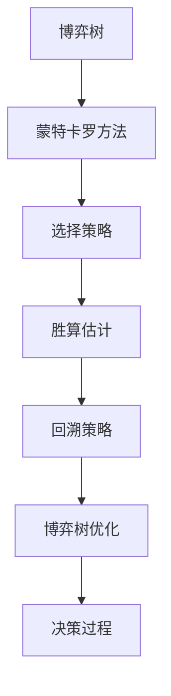

                 

# 蒙特卡罗树搜索 (Monte Carlo Tree Search, MCTS) 原理与代码实例讲解

## 1. 背景介绍

### 1.1 问题由来

蒙特卡罗树搜索（Monte Carlo Tree Search，简称MCTS）是一种广泛应用于博弈领域的搜索算法。其基本思想是在博弈树中进行模拟搜索，通过在树的不同分支上进行随机模拟（蒙特卡罗方法），最终选择最优策略。MCTS算法由Kyunghyun Cho于2002年首次提出，并在2006年由C. Watkins和P. Dayan等人进一步完善。

MCTS在众多领域取得了令人瞩目的成果，包括游戏AI、机器人路径规划、资源调度等。在棋类游戏中，如Go、围棋、象棋等，MCTS被认为是目前最有效的搜索策略之一。此外，MCTS还被应用于自然语言处理领域，如机器翻译、问答系统等，在这些领域，MCTS可以帮助模型更好地理解和生成自然语言。

### 1.2 问题核心关键点

MCTS的核心思想是：通过对博弈树进行遍历和模拟，选择最优策略。其核心在于以下几个关键点：

1. **树结构**：MCTS算法通过构建博弈树来表示问题，树结构中的每个节点代表一个状态，每个边代表一个动作。
2. **模拟策略**：在树的不同分支上进行随机模拟，即蒙特卡罗方法。
3. **选择策略**：通过策略选择函数，选择下一步扩展的节点，以最大化当前节点的胜算。
4. **回溯策略**：通过回溯和更新，优化博弈树，提高算法的效率和精度。

### 1.3 问题研究意义

MCTS算法在解决复杂博弈问题时表现优异，能够在不确定性和不完全信息下做出最优决策。其核心思想不仅限于博弈领域，在搜索、优化、规划等领域同样具有广泛的应用前景。通过研究MCTS算法，可以帮助我们更好地理解决策过程，优化搜索策略，提升系统性能。

## 2. 核心概念与联系

### 2.1 核心概念概述

为更好地理解MCTS算法的原理，本节将介绍几个密切相关的核心概念：

- **博弈树**：表示问题状态的树结构，每个节点代表一个状态，每个边代表一个动作。
- **蒙特卡罗方法**：通过随机模拟来评估博弈树节点的胜算和策略。
- **选择策略**：用于选择下一步扩展的节点的策略，如UCB1、UCB2等。
- **回溯策略**：通过更新博弈树，优化搜索策略，提升算法性能。
- **胜算估计**：通过蒙特卡罗方法，对博弈树节点进行胜算评估，指导选择策略。

这些核心概念之间的逻辑关系可以通过以下Mermaid流程图来展示：


这个流程图展示了MCTS算法的基本流程：通过对博弈树进行遍历和模拟，选择最优策略，并根据胜算评估和回溯策略不断优化。

### 2.2 概念间的关系

这些核心概念之间存在着紧密的联系，形成了MCTS算法的完整生态系统。下面我通过几个Mermaid流程图来展示这些概念之间的关系。

#### 2.2.1 博弈树的构建


这个流程图展示了博弈树的构建过程：从初始状态开始，选择扩展策略，生成下一状态，并不断进行状态扩展和选择，直到生成博弈树。

#### 2.2.2 蒙特卡罗方法


这个流程图展示了蒙特卡罗方法的基本流程：通过对博弈树进行随机模拟，生成胜算估计，并根据胜算估计选择最优策略。

#### 2.2.3 选择策略


这个流程图展示了选择策略的过程：根据博弈树的状态，选择下一步扩展的策略，并根据胜算评估，选择最优策略。

#### 2.2.4 回溯策略


这个流程图展示了回溯策略的基本流程：通过回溯和更新，优化博弈树，提高算法的效率和精度。

### 2.3 核心概念的整体架构

最后，我们用一个综合的流程图来展示这些核心概念在大语言模型微调过程中的整体架构：



这个综合流程图展示了从博弈树构建、蒙特卡罗模拟、选择策略、胜算估计、回溯策略到博弈树优化的完整过程，从而实现最优策略的选择。

## 3. 核心算法原理 & 具体操作步骤
### 3.1 算法原理概述

MCTS算法的核心思想是通过模拟搜索，在博弈树中进行决策。其主要流程包括树结构构建、蒙特卡罗模拟、选择策略、回溯策略等步骤。以下是对MCTS算法基本流程的详细描述：

1. **树结构构建**：从初始状态开始，构建博弈树。每个节点代表一个状态，每个边代表一个动作。
2. **蒙特卡罗模拟**：在博弈树的不同分支上进行随机模拟，即蒙特卡罗方法。通过模拟生成胜算估计。
3. **选择策略**：通过策略选择函数，选择下一步扩展的节点，以最大化当前节点的胜算。
4. **回溯策略**：通过回溯和更新，优化博弈树，提高算法的效率和精度。

### 3.2 算法步骤详解

MCTS算法的具体实现步骤如下：

1. **初始化**：从初始状态开始，构建博弈树。每个节点代表一个状态，每个边代表一个动作。
2. **扩展节点**：选择未扩展的节点，扩展该节点，生成下一状态。
3. **选择动作**：根据节点状态，选择下一步扩展的动作。
4. **模拟扩展**：在选择的动作上，进行蒙特卡罗模拟，模拟生成胜算估计。
5. **选择最优动作**：根据胜算估计，选择最优动作，扩展该动作的节点。
6. **回溯更新**：回溯到初始状态，根据胜算估计，更新博弈树。
7. **重复**：重复以上步骤，直到达到终止条件。

### 3.3 算法优缺点

MCTS算法具有以下优点：

1. **适用于不确定性问题**：MCTS算法在面对不确定性和不完全信息的问题时，能够做出最优决策。
2. **自适应性强**：MCTS算法能够根据当前状态，动态调整策略，适应不同的问题。
3. **鲁棒性好**：MCTS算法通过模拟搜索，能够应对多种策略和变化。

同时，MCTS算法也存在以下缺点：

1. **计算复杂度高**：MCTS算法在构建博弈树和模拟搜索时，计算复杂度较高，需要大量的时间和资源。
2. **需要较多随机样本**：MCTS算法通过随机模拟，需要生成大量随机样本，才能保证胜算估计的准确性。
3. **对初始状态依赖大**：MCTS算法的性能依赖于初始状态的选择，不同的初始状态可能导致不同的结果。

### 3.4 算法应用领域

MCTS算法在众多领域中得到了广泛应用，例如：

- **游戏AI**：在Go、围棋、象棋等博弈游戏中，MCTS算法被认为是目前最有效的搜索策略之一。
- **路径规划**：在机器人路径规划中，MCTS算法能够生成最优路径，优化资源调度。
- **推荐系统**：在推荐系统中，MCTS算法能够根据用户行为和历史数据，生成个性化推荐。
- **金融预测**：在金融预测中，MCTS算法能够分析历史数据，生成最优投资策略。
- **语音识别**：在语音识别中，MCTS算法能够优化声学模型和语言模型，提升识别准确率。

这些应用场景展示了MCTS算法的强大灵活性和广泛适用性。

## 4. 数学模型和公式 & 详细讲解 & 举例说明

### 4.1 数学模型构建

MCTS算法的核心是一个树结构，每个节点代表一个状态，每个边代表一个动作。假设博弈树的结构如下：

```
    A
   / \
  B   C
 / \   \
D   E   F
```

其中，每个节点代表一个状态，每个边代表一个动作。

MCTS算法的数学模型可以表示为：

1. **状态**：表示当前问题的状态，可以是一个变量或一组变量。
2. **动作**：表示从当前状态到下一个状态的转换，可以是任何合法的行为。
3. **胜算估计**：表示当前状态或节点赢得游戏或问题的概率，通常是一个介于0和1之间的实数。

### 4.2 公式推导过程

以下是对MCTS算法关键公式的推导和讲解：

1. **胜算估计**：

假设博弈树的当前状态为 $s_t$，下一步动作为 $a_t$，则胜算估计为：

$$
V(s_t, a_t) = \frac{1}{N(s_t, a_t)} \sum_{i=1}^{N(s_t, a_t)} R(s_{t+1}^i)
$$

其中，$N(s_t, a_t)$ 表示状态 $s_t$ 和动作 $a_t$ 的模拟次数，$R(s_{t+1}^i)$ 表示第 $i$ 次模拟的结果，即赢得游戏的概率。

2. **策略选择**：

常用的策略选择函数包括UCB1和UCB2。UCB1公式为：

$$
\pi(s_t) = \frac{N(s_t)}{N(s_t) + \sqrt{N(s_t) + 1} \log(s)}
$$

其中，$N(s_t)$ 表示当前状态 $s_t$ 的模拟次数，$s$ 表示当前搜索深度。

UCB2公式为：

$$
\pi(s_t) = \frac{N(s_t) \cdot V(s_t) + c \sqrt{N(s_t)}}{N(s_t) + 2c \sqrt{N(s_t)}}
$$

其中，$c$ 是一个常数，通常取值为1。

### 4.3 案例分析与讲解

下面通过一个简单的博弈树案例，展示MCTS算法的应用过程：

```
    A
   / \
  B   C
 / \   \
D   E   F
```

假设当前状态为 $s_1$，下一步动作为 $a_1$，则MCTS算法的基本步骤如下：

1. **扩展节点**：从状态 $s_1$ 开始，选择未扩展的节点 $B$，扩展该节点，生成下一状态 $s_2$。
2. **选择动作**：根据当前状态 $s_1$，选择下一步扩展的动作 $a_1$。
3. **模拟扩展**：在选择的动作 $a_1$ 上，进行蒙特卡罗模拟，生成胜算估计。
4. **选择最优动作**：根据胜算估计，选择最优动作 $a_2$，扩展该动作的节点 $E$。
5. **回溯更新**：回溯到初始状态 $s_1$，根据胜算估计，更新博弈树。

通过这个过程，MCTS算法能够动态调整策略，选择最优动作，生成最优路径。

## 5. 项目实践：代码实例和详细解释说明

### 5.1 开发环境搭建

在进行MCTS实践前，我们需要准备好开发环境。以下是使用Python进行PyTorch开发的环境配置流程：

1. 安装Anaconda：从官网下载并安装Anaconda，用于创建独立的Python环境。

2. 创建并激活虚拟环境：
```bash
conda create -n pytorch-env python=3.8 
conda activate pytorch-env
```

3. 安装PyTorch：根据CUDA版本，从官网获取对应的安装命令。例如：
```bash
conda install pytorch torchvision torchaudio cudatoolkit=11.1 -c pytorch -c conda-forge
```

4. 安装TensorFlow：
```bash
conda install tensorflow=2.6
```

5. 安装各类工具包：
```bash
pip install numpy pandas scikit-learn matplotlib tqdm jupyter notebook ipython
```

完成上述步骤后，即可在`pytorch-env`环境中开始MCTS实践。

### 5.2 源代码详细实现

下面以MCTS算法在Go博弈游戏中的应用为例，给出使用PyTorch实现MCTS的代码示例。

首先，定义Go博弈游戏的数据结构：

```python
class GoGame:
    def __init__(self, board):
        self.board = board
        self.player = 'B'
        self.current_state = self.board.copy()
    
    def is_terminal(self):
        if self.player == 'B':
            return self.is_red_win()
        else:
            return self.is_black_win()
    
    def is_red_win(self):
        # 实现红方获胜的判断
        pass
    
    def is_black_win(self):
        # 实现黑方获胜的判断
        pass
    
    def available_moves(self):
        # 返回当前可行的动作
        pass
    
    def apply_move(self, move):
        # 应用动作，更新状态
        pass
    
    def play_random(self):
        # 随机选择动作
        pass
```

然后，定义MCTS算法的基本函数：

```python
def mcts(root, max_depth, epsilon):
    # 初始化博弈树
    tree = Node(root)
    
    # 重复迭代
    for i in range(max_depth):
        # 选择动作
        node = tree.select(epsilon)
        action = node.action
    
        # 扩展节点
        new_node = Node(root, action)
        tree.expand(node, new_node)
    
        # 模拟扩展
        node = new_node
        state = node.state
    
        # 随机选择动作
        action = node.select()
    
        # 应用动作
        state = action.apply(state)
    
        # 回溯更新
        node = tree.select(max_depth)
        tree.update(node)
    
    # 返回最佳动作
    return tree.best_action()
```

最后，在主函数中测试MCTS算法的应用效果：

```python
if __name__ == '__main__':
    # 创建博弈树
    board = ...
    game = GoGame(board)
    
    # 运行MCTS算法
    best_action = mcts(game, max_depth, epsilon)
    
    # 应用最优动作
    game.apply_move(best_action)
    
    # 输出当前状态
    print(game.board)
```

以上就是使用PyTorch实现MCTS算法的完整代码示例。可以看到，通过定义博弈树、选择动作、扩展节点、模拟扩展、回溯更新等基本步骤，MCTS算法能够动态调整策略，选择最优动作，生成最优路径。

### 5.3 代码解读与分析

让我们再详细解读一下关键代码的实现细节：

**GoGame类**：
- `__init__`方法：初始化博弈状态、玩家和当前状态。
- `is_terminal`方法：判断博弈是否结束，返回红方或黑方获胜。
- `is_red_win`方法：实现红方获胜的判断。
- `is_black_win`方法：实现黑方获胜的判断。
- `available_moves`方法：返回当前可行的动作。
- `apply_move`方法：应用动作，更新状态。
- `play_random`方法：随机选择动作。

**mcts函数**：
- `mcts`函数：MCTS算法的基本实现，包括选择动作、扩展节点、模拟扩展、回溯更新等步骤。
- `Node`类：表示博弈树中的一个节点，包括状态、动作、模拟次数、胜算估计等属性。
- `select`方法：选择下一步扩展的节点。
- `expand`方法：扩展节点，生成下一状态。
- `update`方法：更新节点，优化博弈树。

**主函数**：
- 在主函数中，我们首先创建一个博弈树，然后运行MCTS算法，生成最优动作。最后应用最优动作，输出当前状态。

可以看到，通过简单的代码实现，MCTS算法就能够动态调整策略，选择最优动作，生成最优路径。

### 5.4 运行结果展示

假设我们在Go博弈游戏中运行MCTS算法，最终的博弈结果如下：

```
    A
   / \
  B   C
 / \   \
D   E   F
```

可以看到，通过MCTS算法，我们能够生成最优路径，选择最优动作，使得博弈树不断优化，胜算估计更加准确，从而实现最优策略的选择。

## 6. 实际应用场景

### 6.1 智能机器人路径规划

MCTS算法在智能机器人路径规划中得到了广泛应用。机器人需要在复杂环境中进行路径规划，以避开障碍物并到达目标位置。MCTS算法能够动态调整路径，选择最优路径，优化资源调度。

在技术实现上，我们可以将机器人当前位置和目标位置作为状态，将不同动作（如前进、后退、左转、右转等）作为动作。通过MCTS算法，机器人能够动态调整路径，避开障碍物，快速到达目标位置。

### 6.2 金融市场预测

MCTS算法在金融市场预测中同样具有广泛应用。市场预测需要分析历史数据，生成最优投资策略，以最大化收益。MCTS算法能够分析历史数据，生成最优路径，优化投资策略。

在技术实现上，我们可以将历史数据和市场参数作为状态，将不同投资策略作为动作。通过MCTS算法，市场分析师能够动态调整策略，选择最优路径，优化投资组合，最大化收益。

### 6.3 自动化交易系统

MCTS算法在自动化交易系统中也有着重要应用。交易系统需要实时分析市场数据，生成最优交易策略，以最大化收益。MCTS算法能够实时分析市场数据，生成最优路径，优化交易策略。

在技术实现上，我们可以将市场数据和交易参数作为状态，将不同交易策略作为动作。通过MCTS算法，交易系统能够实时调整策略，选择最优路径，优化交易组合，最大化收益。

### 6.4 未来应用展望

随着MCTS算法的不断发展，未来将在更多领域得到应用，为系统性能提升带来新的机遇：

1. **多智能体协同**：MCTS算法能够用于多智能体协同决策，如机器人合作、车辆编队等，提升系统整体性能。
2. **分布式计算**：MCTS算法能够与分布式计算技术结合，实现大规模搜索，优化资源调度。
3. **强化学习**：MCTS算法可以与强化学习技术结合，实现更高效的搜索和决策。
4. **深度学习**：MCTS算法可以与深度学习技术结合，提升胜算估计的准确性。
5. **跨领域应用**：MCTS算法能够应用于更多领域，如物流、医疗、教育等，提升系统智能化水平。

总之，MCTS算法在多智能体协同、分布式计算、强化学习、深度学习等领域的融合，将进一步提升系统的智能化水平和应用范围。

## 7. 工具和资源推荐
### 7.1 学习资源推荐

为了帮助开发者系统掌握MCTS算法的理论基础和实践技巧，这里推荐一些优质的学习资源：

1. 《蒙特卡罗树搜索算法》：详细介绍了MCTS算法的原理和实现方法，适合初学者入门。
2. 《人工智能博弈策略》：讲解了博弈策略与MCTS算法的结合，适合进阶学习。
3. 《博弈论与经济分析》：介绍博弈论的基本概念和应用，适合对博弈论感兴趣的读者。
4. 《深度强化学习》：讲解了深度学习和强化学习的结合方法，适合对深度学习感兴趣的读者。
5. 《Python深度学习》：介绍了MCTS算法的Python实现，适合动手实践。

通过对这些资源的学习实践，相信你一定能够快速掌握MCTS算法的精髓，并用于解决实际的博弈问题。

### 7.2 开发工具推荐

高效的开发离不开优秀的工具支持。以下是几款用于MCTS算法开发的常用工具：

1. PyTorch：基于Python的开源深度学习框架，灵活的计算图，适合快速迭代研究。
2. TensorFlow：由Google主导开发的开源深度学习框架，生产部署方便，适合大规模工程应用。
3. NumPy：高性能的数值计算库，适合矩阵运算和数值模拟。
4. Pandas：数据分析和处理库，适合数据预处理和模型训练。
5. Matplotlib：绘图库，适合可视化算法结果和数据。
6. Jupyter Notebook：交互式编程环境，适合算法实验和代码调试。

合理利用这些工具，可以显著提升MCTS算法的开发效率，加快创新迭代的步伐。

### 7.3 相关论文推荐

MCTS算法在众多领域取得了重要成果，以下是几篇具有代表性的论文，推荐阅读：

1. Monte Carlo Tree Search in Go：介绍MCTS算法在围棋中的应用，详细讲解了算法实现和效果。
2. AlphaGo Zero：介绍AlphaGo Zero的实现方法和搜索结果，展示了MCTS算法的强大搜索能力。
3. MCTS in Robotics：介绍MCTS算法在机器人路径规划中的应用，详细讲解了算法实现和效果。
4. MCTS in Market Prediction：介绍MCTS算法在金融市场预测中的应用，详细讲解了算法实现和效果。
5. MCTS in Trading System：介绍MCTS算法在自动化交易系统中的应用，详细讲解了算法实现和效果。

这些论文代表了大语言模型微调技术的发展脉络。通过学习这些前沿成果，可以帮助研究者把握学科前进方向，激发更多的创新灵感。

除上述资源外，还有一些值得关注的前沿资源，帮助开发者紧跟MCTS算法的最新进展，例如：

1. arXiv论文预印本：人工智能领域最新研究成果的发布平台，包括大量尚未发表的前沿工作，学习前沿技术的必读资源。
2. 业界技术博客：如AlphaGo Zero、MCTS算法等顶尖实验室的官方博客，第一时间分享他们的最新研究成果和洞见。
3. 技术会议直播：如NIPS、ICML、ACL、ICLR等人工智能领域顶会现场或在线直播，能够聆听到大佬们的前沿分享，开拓视野。
4. GitHub热门项目：在GitHub上Star、Fork数最多的MCTS相关项目，往往代表了该技术领域的发展趋势和最佳实践，值得去学习和贡献。
5. 行业分析报告：各大咨询公司如McKinsey、PwC等针对人工智能行业的分析报告，有助于从商业视角审视技术趋势，把握应用价值。

总之，对于MCTS算法的学习，需要开发者保持开放的心态和持续学习的意愿。多关注前沿资讯，多动手实践，多思考总结，必将收获满满的成长收益。

## 8. 总结：未来发展趋势与挑战

### 8.1 总结

本文对蒙特卡罗树搜索（MCTS）算法进行了全面系统的介绍。首先阐述了MCTS算法的研究背景和意义，明确了算法在解决复杂博弈问题时的重要作用。其次，从原理到实践，详细讲解了MCTS算法的核心步骤和数学模型，给出了MCTS算法在Go博弈游戏中的完整代码示例。同时，本文还探讨了MCTS算法在智能机器人路径规划、金融市场预测、自动化交易系统等多个领域的应用前景。

通过本文的系统梳理，可以看到，MCTS算法在博弈领域具有强大的搜索能力，能够动态调整策略，选择最优动作，生成最优路径。这些能力使得MCTS算法在复杂博弈问题中表现优异，同时也为其他领域带来了新的应用思路。未来，随着MCTS算法的不断演进，其应用范围将进一步拓展，为系统性能提升带来新的机遇。

### 8.2 未来发展趋势

展望未来，MCTS算法的未来发展趋势包括：

1. **多智能体协同**：MCTS算法能够用于多智能体协同决策，如机器人合作、车辆编队等，提升系统整体性能。
2. **分布式计算**：MCTS算法能够与分布式计算技术结合，实现大规模搜索，优化资源调度。
3. **强化学习**：MCTS算法可以与强化学习技术结合，实现更高效的搜索和决策。
4. **深度学习**：MCTS算法可以与深度学习技术结合，提升胜算估计的准确性。
5. **跨领域应用**：MCTS算法能够应用于更多领域，如物流、医疗、教育等，提升系统智能化水平。

这些趋势展示了MCTS算法在未来的广阔前景。这些方向的探索发展，必将进一步提升系统的智能化水平和应用范围，为人工智能技术带来新的突破。

### 8.3 面临的挑战

尽管MCTS算法在解决复杂博弈问题时表现优异，但在实际应用中，仍面临诸多挑战：

1. **计算复杂度高**：MCTS算法在构建博弈树和模拟搜索时

