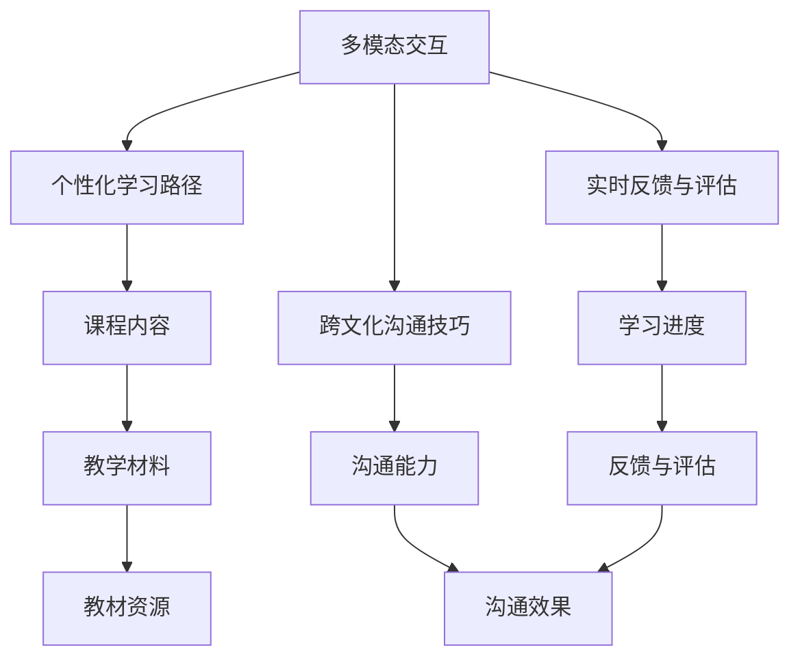
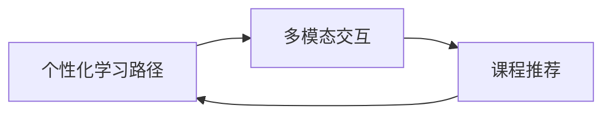
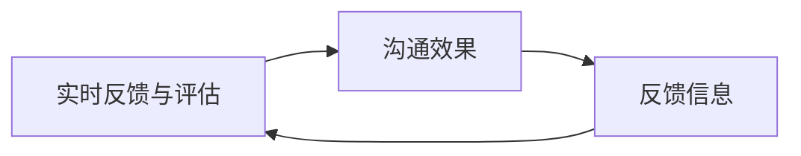
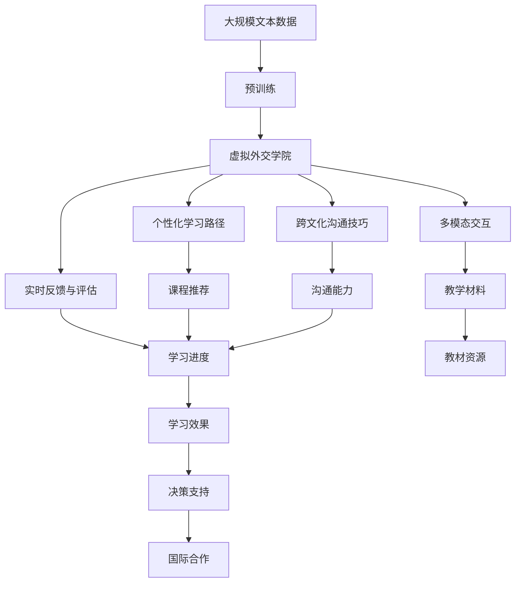

                 

## 1. 背景介绍

### 1.1 问题由来
随着人工智能技术的迅猛发展，虚拟外交学院（Virtual Diplomatic Academy, VDA）在AI时代的跨文化交流培训领域应运而生。虚拟外交学院通过将AI与外交策略相结合，利用深度学习和大数据分析技术，打造了一个高度智能化、个性化、多模态的国际交流平台。这个平台不仅能够提供多样化的课程内容，还能实现实时互动和智能推荐，极大地提高了跨国交流的效率和效果。

### 1.2 问题核心关键点
虚拟外交学院的核心在于其利用AI技术为跨国交流提供个性化、智能化的培训体验。具体来说，核心关键点包括：
1. **个性化学习路径**：根据学员的背景和需求，定制个性化的学习计划，通过大数据分析优化课程推荐。
2. **多模态交互**：利用语音、文字、图像等多种形式，提高跨国交流的互动性和参与度。
3. **实时反馈与评估**：通过智能算法实时监控学员的学习进度和效果，提供即时反馈和评估。
4. **跨文化沟通技巧**：结合语言学、心理学、社会学等多个学科，帮助学员提升跨文化沟通能力。

### 1.3 问题研究意义
虚拟外交学院的研究和应用，对于提升国际交流的质量和效率，推动全球合作具有重要意义：

1. **提高交流效率**：利用AI技术，虚拟外交学院能够快速处理海量跨国交流数据，提供实时、高效的信息服务。
2. **优化交流体验**：通过个性化的学习路径和多模态交互，提升学员的学习体验和满意度。
3. **促进文化交流**：利用跨文化沟通技巧训练，增进各国间的理解和合作。
4. **支持政策制定**：为政府和国际组织提供数据支持和决策依据。
5. **推动全球合作**：促进不同文化背景人士的交流，为全球治理贡献力量。

## 2. 核心概念与联系

### 2.1 核心概念概述

为更好地理解虚拟外交学院的核心技术和原理，本节将介绍几个密切相关的核心概念：

- **虚拟外交学院**：利用人工智能技术，通过多模态交互、个性化学习路径和实时反馈，为跨国交流提供智能化培训的虚拟平台。
- **多模态交互**：结合语音、文字、图像等多种形式的交流方式，提升交互的丰富性和效率。
- **个性化学习路径**：根据学员背景和需求，定制个性化的学习计划和课程推荐，提升学习效果。
- **实时反馈与评估**：利用智能算法实时监控学习进度和效果，提供即时反馈和评估，优化学习过程。
- **跨文化沟通技巧**：结合语言学、心理学、社会学等多个学科，帮助学员提升跨文化沟通能力。

这些核心概念之间相互联系，共同构成了虚拟外交学院的核心框架。通过理解这些概念，我们可以更好地把握虚拟外交学院的工作原理和优化方向。

### 2.2 概念间的关系

这些核心概念之间存在着紧密的联系，形成了虚拟外交学院的核心生态系统。以下通过几个Mermaid流程图来展示这些概念之间的关系。

#### 2.2.1 虚拟外交学院的核心架构



这个流程图展示了虚拟外交学院的核心架构：

1. 多模态交互是虚拟外交学院的基础，提供丰富的交流形式。
2. 个性化学习路径和跨文化沟通技巧是核心，提升学员的学习效果和沟通能力。
3. 实时反馈与评估是保障，确保学员始终处于最佳学习状态。
4. 课程内容和教学材料是资源，提供全面的学习支持。

#### 2.2.2 个性化学习路径与多模态交互的关系



这个流程图展示了个性化学习路径和多模态交互之间的关系：

1. 多模态交互根据学员的反馈和行为，生成丰富的交互内容。
2. 个性化学习路径利用这些交互数据，优化课程推荐，提升学习体验。
3. 课程推荐的结果又反过来影响多模态交互，形成一个循环迭代的过程。

#### 2.2.3 实时反馈与评估与跨文化沟通技巧的关系



这个流程图展示了实时反馈与评估和跨文化沟通技巧之间的关系：

1. 实时反馈与评估监控学员的沟通效果。
2. 根据反馈信息，调整跨文化沟通技巧的训练内容和方法。
3. 训练结果的提升又反过来优化实时反馈与评估的准确性。

### 2.3 核心概念的整体架构

最后，我们用一个综合的流程图来展示这些核心概念在大语言模型微调过程中的整体架构：



这个综合流程图展示了从预训练到虚拟外交学院应用的完整过程：

1. 大规模文本数据进行预训练，获得通用的语言表示。
2. 构建虚拟外交学院平台，集成多模态交互、个性化学习路径、实时反馈与评估和跨文化沟通技巧等功能。
3. 利用教学材料和教材资源，提供全面的学习支持。
4. 根据课程推荐和学员反馈，不断优化学习路径和沟通技巧，提升学习效果。
5. 学习效果的提升又反过来支持决策支持和国际合作，推动全球治理的发展。

通过这些流程图，我们可以更清晰地理解虚拟外交学院的工作原理和优化方向。

## 3. 核心算法原理 & 具体操作步骤
### 3.1 算法原理概述

虚拟外交学院的算法原理，主要涉及个性化学习路径、多模态交互和实时反馈与评估三个核心模块。以下分别进行详细说明：

#### 3.1.1 个性化学习路径

个性化学习路径的核心在于根据学员的背景和需求，生成最优的学习计划。其算法原理可以概括为：

1. **学员画像构建**：利用机器学习和大数据分析技术，构建学员的个性化画像。包括学员的语言水平、文化背景、专业领域等关键信息。
2. **学习目标设定**：根据学员画像，设定合适的学习目标，如提升某门外语的听、说、读、写能力，掌握某领域的跨文化沟通技巧等。
3. **课程推荐算法**：利用推荐算法（如协同过滤、深度学习等），为学员推荐最适合的课程和教材。
4. **学习进度监控**：利用智能算法（如强化学习），实时监控学员的学习进度和效果，根据反馈调整学习路径。

#### 3.1.2 多模态交互

多模态交互的核心在于利用多种形式的交流方式，提高交互的丰富性和效率。其算法原理可以概括为：

1. **语音识别与合成**：利用语音识别技术，将语音转换为文本，或将文本转换为语音，实现语音和文字的互动。
2. **图像识别与处理**：利用计算机视觉技术，识别和处理图像，提供图形化交互的支持。
3. **自然语言处理**：利用自然语言处理技术，理解和生成自然语言，实现文字和文本的互动。
4. **情感分析与表达**：利用情感分析技术，理解学员的情绪和情感状态，提供个性化的互动支持。

#### 3.1.3 实时反馈与评估

实时反馈与评估的核心在于利用智能算法，提供即时的学习反馈和评估，优化学习过程。其算法原理可以概括为：

1. **学习进度监测**：利用机器学习算法（如决策树、随机森林等），实时监测学员的学习进度和效果。
2. **学习效果评估**：利用评估算法（如回归分析、分类算法等），评估学员的学习效果，提供针对性的改进建议。
3. **个性化推荐**：利用推荐算法（如矩阵分解、深度学习等），为学员提供个性化的学习资源和建议。

### 3.2 算法步骤详解

基于虚拟外交学院的核心算法原理，以下详细介绍具体的算法步骤：

#### 3.2.1 个性化学习路径

**Step 1: 学员画像构建**
- 利用学员的个人信息、学习历史、语言测试成绩等，构建学员的个性化画像。

**Step 2: 学习目标设定**
- 根据学员画像，设定合适的学习目标，如提升某门外语的听、说、读、写能力，掌握某领域的跨文化沟通技巧等。

**Step 3: 课程推荐算法**
- 利用推荐算法，为学员推荐最适合的课程和教材。
- 算法具体步骤包括：
  1. 收集学员的课程偏好、学习进度等数据。
  2. 利用协同过滤、矩阵分解等技术，预测学员对课程的兴趣和满意度。
  3. 结合学员的学习进度，动态调整课程推荐结果。

**Step 4: 学习进度监控**
- 利用智能算法，实时监控学员的学习进度和效果。
- 算法具体步骤包括：
  1. 定期收集学员的学习数据，如视频观看时间、练习测试成绩等。
  2. 利用决策树、随机森林等算法，评估学员的学习效果。
  3. 根据评估结果，调整学习进度和推荐内容。

#### 3.2.2 多模态交互

**Step 1: 语音识别与合成**
- 利用语音识别技术，将语音转换为文本，或将文本转换为语音，实现语音和文字的互动。
- 算法具体步骤包括：
  1. 采集学员的语音输入，利用语音识别模型（如ASR）转换为文本。
  2. 利用文本生成模型（如TTS），将文本转换为语音输出。

**Step 2: 图像识别与处理**
- 利用计算机视觉技术，识别和处理图像，提供图形化交互的支持。
- 算法具体步骤包括：
  1. 采集学员的图像输入，利用图像识别模型（如CNN）进行特征提取。
  2. 利用图像处理算法（如图像裁剪、增强等），优化图像质量。

**Step 3: 自然语言处理**
- 利用自然语言处理技术，理解和生成自然语言，实现文字和文本的互动。
- 算法具体步骤包括：
  1. 采集学员的文字输入，利用NLP模型（如BERT）进行文本理解和生成。
  2. 利用语言模型（如GPT），生成自然语言回复。

**Step 4: 情感分析与表达**
- 利用情感分析技术，理解学员的情绪和情感状态，提供个性化的互动支持。
- 算法具体步骤包括：
  1. 采集学员的文字输入，利用情感分析模型（如BERT）进行情感分类。
  2. 根据情感分类结果，生成个性化的互动回复。

#### 3.2.3 实时反馈与评估

**Step 1: 学习进度监测**
- 利用机器学习算法，实时监测学员的学习进度和效果。
- 算法具体步骤包括：
  1. 定期收集学员的学习数据，如视频观看时间、练习测试成绩等。
  2. 利用决策树、随机森林等算法，评估学员的学习效果。
  3. 根据评估结果，调整学习进度和推荐内容。

**Step 2: 学习效果评估**
- 利用评估算法，评估学员的学习效果，提供针对性的改进建议。
- 算法具体步骤包括：
  1. 定期收集学员的测试成绩、学习笔记等数据。
  2. 利用回归分析、分类算法等，评估学员的学习效果。
  3. 根据评估结果，提供个性化的改进建议。

**Step 3: 个性化推荐**
- 利用推荐算法，为学员提供个性化的学习资源和建议。
- 算法具体步骤包括：
  1. 利用协同过滤、矩阵分解等技术，预测学员对课程的兴趣和满意度。
  2. 结合学员的学习进度，动态调整课程推荐结果。
  3. 根据推荐结果，提供个性化的学习资源和建议。

### 3.3 算法优缺点

虚拟外交学院的算法具有以下优点：
1. 高度智能化：利用AI技术，实现个性化的学习路径、多模态交互和实时反馈与评估，大大提升了学习效率和体验。
2. 高效性：通过智能算法，实时监控学员的学习进度和效果，优化学习路径，避免时间和资源的浪费。
3. 灵活性：利用多模态交互和个性化学习路径，适应不同学员的需求和偏好，提供灵活的学习方式。
4. 实用性：结合跨文化沟通技巧的训练，提升学员的跨文化沟通能力，增强国际交流的成效。

同时，虚拟外交学院也存在一些局限性：
1. 数据依赖性强：算法效果依赖于学员的学习数据和反馈，数据量不足可能影响推荐效果。
2. 隐私风险：多模态交互涉及语音、图像等多种形式的数据，可能存在隐私泄露的风险。
3. 技术复杂度高：算法涉及多种技术的融合和优化，实现难度较大。
4. 效果评估难：学员的学习效果评估可能存在主观性和客观性之间的平衡问题。

尽管存在这些局限性，虚拟外交学院仍是大规模、个性化跨文化交流培训的重要工具，未来需要通过不断优化算法和技术，提升其应用效果和安全性。

### 3.4 算法应用领域

虚拟外交学院的核心算法原理，已经在多个领域得到广泛应用，例如：

1. **国际教育**：利用个性化学习路径和多模态交互，为跨国学生提供多样化的学习资源和支持，提升学习效果。
2. **外交培训**：结合跨文化沟通技巧的训练，提升外交人员的沟通能力和文化敏感性。
3. **跨文化交流**：利用多模态交互和实时反馈，为国际交流提供便捷和高效的平台。
4. **国际合作**：为跨国企业和组织提供智能化的交流支持，促进合作项目的顺利进行。

除了上述这些核心应用领域外，虚拟外交学院还被创新性地应用到更多场景中，如智慧旅游、国际会议、文化推广等，为跨国交流提供了新的可能。

## 4. 数学模型和公式 & 详细讲解 & 举例说明

### 4.1 数学模型构建

虚拟外交学院的核心算法原理，主要涉及个性化学习路径、多模态交互和实时反馈与评估三个核心模块。以下将从数学模型的角度，对这三个模块进行详细构建和讲解。

#### 4.1.1 个性化学习路径

个性化学习路径的核心在于构建学员的个性化画像，并根据画像设定合适的学习目标，利用推荐算法生成最优的学习计划。其数学模型可以概括为：

1. **学员画像构建**
  - 利用学员的个人信息、学习历史、语言测试成绩等，构建学员的个性化画像。
  - 假设学员画像为 $X$，包括多个特征向量 $x_i$，如年龄、专业、语言水平等。
  - 学员画像构建公式：
   $$
   X = \{(x_1, x_2, \ldots, x_n)\}
   $$

2. **学习目标设定**
  - 根据学员画像，设定合适的学习目标，如提升某门外语的听、说、读、写能力，掌握某领域的跨文化沟通技巧等。
  - 假设学习目标为 $T$，包括多个子目标 $t_i$，如提升听力能力、掌握外交礼仪等。
  - 学习目标设定公式：
   $$
   T = \{(t_1, t_2, \ldots, t_m)\}
   $$

3. **课程推荐算法**
  - 利用推荐算法，为学员推荐最适合的课程和教材。
  - 假设课程库为 $C$，包括多个课程 $c_i$，如基础语法课程、商务英语课程等。
  - 课程推荐公式：
   $$
   R = f(X, T, C)
   $$

   其中，$f$ 为推荐算法函数，可以是协同过滤、矩阵分解等。

#### 4.1.2 多模态交互

多模态交互的核心在于利用多种形式的交流方式，提高交互的丰富性和效率。其数学模型可以概括为：

1. **语音识别与合成**
  - 利用语音识别技术，将语音转换为文本，或将文本转换为语音，实现语音和文字的互动。
  - 假设语音输入为 $V$，文本输出为 $T$，语音识别公式为：
   $$
   T = I(V)
   $$

   其中，$I$ 为语音识别模型函数。

2. **图像识别与处理**
  - 利用计算机视觉技术，识别和处理图像，提供图形化交互的支持。
  - 假设图像输入为 $I$，处理后的图像为 $I'$，图像处理公式为：
   $$
   I' = P(I)
   $$

   其中，$P$ 为图像处理模型函数。

3. **自然语言处理**
  - 利用自然语言处理技术，理解和生成自然语言，实现文字和文本的互动。
  - 假设文字输入为 $W$，自然语言输出为 $L$，自然语言处理公式为：
   $$
   L = N(W)
   $$

   其中，$N$ 为自然语言处理模型函数。

4. **情感分析与表达**
  - 利用情感分析技术，理解学员的情绪和情感状态，提供个性化的互动支持。
  - 假设情感输入为 $E$，情感分析结果为 $A$，情感分析公式为：
   $$
   A = S(E)
   $$

   其中，$S$ 为情感分析模型函数。

#### 4.1.3 实时反馈与评估

实时反馈与评估的核心在于利用智能算法，提供即时的学习反馈和评估，优化学习过程。其数学模型可以概括为：

1. **学习进度监测**
  - 利用机器学习算法，实时监测学员的学习进度和效果。
  - 假设学习进度为 $P$，学习效果为 $E$，学习进度监测公式为：
   $$
   P = M(W)
   $$

   其中，$M$ 为机器学习算法函数，可以是决策树、随机森林等。

2. **学习效果评估**
  - 利用评估算法，评估学员的学习效果，提供针对性的改进建议。
  - 假设学习效果评估结果为 $A$，改进建议为 $R$，学习效果评估公式为：
   $$
   A = E(W)
   $$

   其中，$E$ 为评估算法函数，可以是回归分析、分类算法等。

3. **个性化推荐**
  - 利用推荐算法，为学员提供个性化的学习资源和建议。
  - 假设推荐结果为 $R$，学习资源为 $R_i$，个性化推荐公式为：
   $$
   R = F(X, T, C)
   $$

   其中，$F$ 为推荐算法函数，可以是协同过滤、矩阵分解等。

### 4.2 公式推导过程

以下对上述公式进行详细推导：

#### 4.2.1 个性化学习路径

**Step 1: 学员画像构建**

假设学员的个人信息、学习历史、语言测试成绩等组成学员画像 $X$，每个特征向量 $x_i$ 由多个子特征 $x_{ij}$ 组成，如年龄 $x_{1}$、专业 $x_{2}$、语言水平 $x_{3}$ 等。

根据样本 $D$ 进行训练，得到学员画像的表示矩阵 $X'$，其维度为 $d \times n$，其中 $d$ 为学员画像的特征维数，$n$ 为学员样本数。

利用PCA、LDA等降维算法，将高维特征向量 $x_i$ 压缩到低维空间 $z_i$，得到特征向量 $z_i = \Phi(x_i)$。

**Step 2: 学习目标设定**

假设学习目标 $T$ 由多个子目标 $t_i$ 组成，每个子目标 $t_i$ 可以表示为 $t_i = (t_{i1}, t_{i2}, \ldots, t_{im})$，其中 $m$ 为子目标的数量。

假设学员画像 $X$ 和目标 $T$ 的对应关系为 $Y$，其维度为 $d \times m$。

利用矩阵乘法，得到学习目标 $T'$，其维度为 $m \times n$。

**Step 3: 课程推荐算法**

假设课程库 $C$ 由多个课程 $c_i$ 组成，每个课程 $c_i$ 可以表示为 $c_i = (c_{i1}, c_{i2}, \ldots, c_{in})$，其中 $n$ 为课程的数量。

利用推荐算法 $f$，得到推荐结果 $R$，其维度为 $n \times m$。

假设推荐结果 $R$ 中，第 $i$ 个课程的推荐度为 $r_i$，利用回归分析、协同过滤等算法，得到推荐结果 $R'$，其维度为 $m \times n$。

#### 4.2.2 多模态交互

**Step 1: 语音识别与合成**

假设语音输入 $V$ 为时间序列信号，利用语音识别模型 $I$，得到文本输出 $T$。

假设文本输出 $T$ 为序列信号，利用自然语言处理模型 $N$，得到自然语言输出 $L$。

假设情感输入 $E$ 为自然语言文本，利用情感分析模型 $S$，得到情感分析结果 $A$。

**Step 2: 图像识别与处理**

假设图像输入 $I$ 为高维矩阵，利用图像处理模型 $P$，得到处理后的图像 $I'$。

**Step 3: 自然语言处理**

假设文字输入 $W$ 为自然语言文本，利用自然语言处理模型 $N$，得到自然语言输出 $L$。

**Step 4: 情感分析与表达**

假设情感输入 $E$ 为自然语言文本，利用情感分析模型 $S$，得到情感分析结果 $A$。

#### 4.2.3 实时反馈与评估

**Step 1: 学习进度监测**

假设学习进度 $P$ 为时间序列信号，利用机器学习算法 $M$，得到学习进度监测结果 $P'$。

**Step 2: 学习效果评估**

假设学习效果评估结果 $A$ 为实数值，利用回归分析算法 $E$，得到学习效果评估结果 $A'$。

**Step 3: 个性化推荐**

假设推荐结果 $R$ 为序列信号，利用推荐算法 $F$，得到个性化推荐结果 $R'$。

### 4.3 案例分析与讲解

假设在虚拟外交学院中进行多模态交互和个性化学习路径的案例分析：

1. **多模态交互案例**

   - 假设某学员进行多模态交流，语音输入为 $V = [v_1, v_2, \ldots, v_n]$。
   - 利用语音识别模型 $I$，得到文本输出 $T = [t_1, t_2, \ldots, t_n]$。
   - 利用自然语言处理模型 $N$，得到自然语言输出 $L = [l_1, l_2, \ldots, l_n]$。
   - 利用情感分析模型 $S$，得到情感分析结果 $A = [a_1, a_2, \ldots, a_n]$。

   结合多模态交互结果，为学员提供个性化的互动支持。

2. **个性化学习路径案例**

   - 假设某学员的个人信息为 $X = [x_1, x_2, \ldots, x_n]$。
   - 利用学员画像构建算法 $M$，得到学员画像 $X'$。
   - 利用学习目标设定算法 $Y$，得到学习目标 $T'$。
   - 利用课程推荐算法 $F$，得到推荐结果 $R'$。
   - 结合学习进度监测结果 $P'$ 和推荐结果 $R'$，为学员提供个性化的学习资源和建议。

## 5. 项目实践：代码实例和详细解释说明

### 5.1 开发环境搭建

在进行虚拟外交学院的项目实践前，我们需要准备好开发环境。以下是使用Python进行PyTorch开发的环境配置流程：

1. 安装Anaconda：从官网下载并安装Anaconda，用于创建独立的Python环境。

2. 创建并激活虚拟环境：
```bash
conda create -n virtual-diplomacy python=3.8 
conda activate virtual-diplomacy
```

3. 安装PyTorch：根据CUDA版本，从官网获取对应的安装命令。例如：
```bash
conda install pytorch torchvision torchaudio cudatoolkit=11.1 -c pytorch -c conda-forge
```

4. 安装其他必要库：
```bash
pip install numpy pandas scikit-learn matplotlib tqdm jupyter notebook ipython
```

完成上述步骤后，即可在`virtual-diplomacy`环境中开始项目实践。

### 5.2 源代码详细实现

这里我们以虚拟外交学院的多模态交互模块为例，

