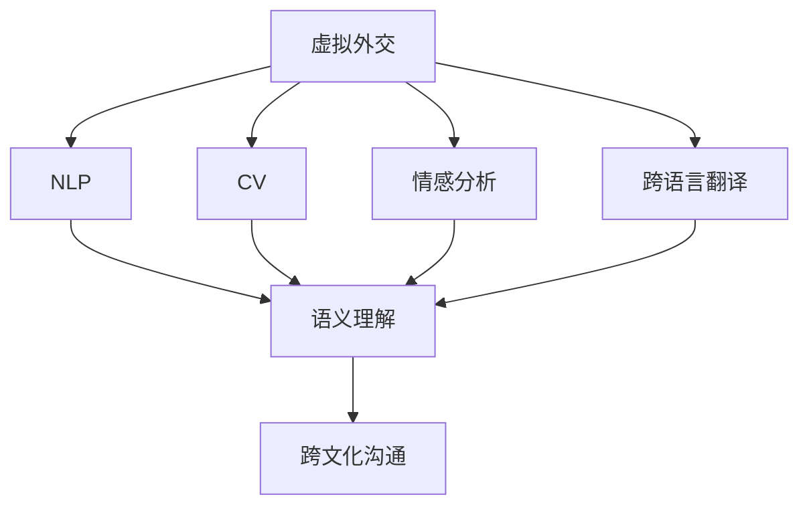
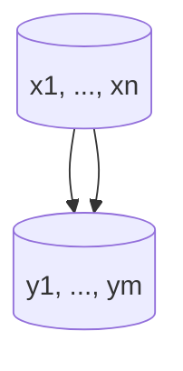

                 

# 虚拟外交：AI时代的跨文化交流

在日益全球化的今天，跨文化交流的重要性不言而喻。传统的线下交流方式不仅耗时费力，还受到地理、语言等诸多限制。虚拟外交作为一种新型的跨文化交流方式，利用AI技术打破传统界限，极大提升了交流的效率和广度。本文将系统地介绍虚拟外交的核心概念、算法原理以及实际应用，旨在为读者提供一个全面而深入的理解，并探索其未来发展方向。

## 1. 背景介绍

### 1.1 问题由来
随着互联网和人工智能技术的快速发展，虚拟外交逐渐成为一种新型的跨文化交流方式。虚拟外交利用AI技术，通过网络平台和智能算法，模拟人类外交活动，实现跨文化、跨地域的沟通和协作。其核心思想是通过技术手段，打破时空限制，使人们无论身在何处，都能进行高效、灵活的交流和合作。

### 1.2 问题核心关键点
虚拟外交的核心关键点包括：
- 通过自然语言处理(NLP)、计算机视觉(CV)等AI技术，模拟人类交流的语境和情感，提高交流的自然度和互动性。
- 利用大数据和机器学习算法，分析不同文化背景下的行为模式和沟通偏好，提供个性化的交流策略。
- 通过跨语言翻译、情感分析等技术，实现不同语言和文化之间的无缝衔接。

### 1.3 问题研究意义
虚拟外交的研究和应用，对于促进全球化和多文化交流，提升国际合作效率，具有重要意义。具体而言：
- 降低交流成本。虚拟外交消除了传统外交的物理障碍，降低了时间和资源的消耗。
- 提高交流效率。通过AI技术，快速分析处理海量数据，及时回应各种交流需求。
- 促进文化融合。虚拟外交有助于不同文化背景的人们了解和尊重彼此，增进理解与合作。

## 2. 核心概念与联系

### 2.1 核心概念概述

为更好地理解虚拟外交的AI实现，本文将介绍几个关键概念：

- **虚拟外交(Virtual Diplomacy)**：利用AI技术，通过网络平台和智能算法，模拟人类外交活动，实现跨文化、跨地域的沟通和协作。
- **自然语言处理(NLP)**：研究如何让计算机理解和生成自然语言，是虚拟外交中实现语言沟通的核心技术。
- **计算机视觉(CV)**：研究如何让计算机“看”，即从图像或视频中提取有价值的信息，用于跨文化交流中的非语言沟通。
- **情感分析(Affective Computing)**：通过分析文本和语音的情感特征，模拟人类的情感交流，提升交流的自然度和亲和力。
- **跨语言翻译(Machine Translation)**：实现不同语言之间的即时转换，促进语言障碍的消除。

这些概念之间的逻辑关系可以通过以下Mermaid流程图来展示：



这个流程图展示了大语言模型和虚拟外交的核心概念及其之间的关系：

1. 虚拟外交通过NLP、CV、情感分析和跨语言翻译等技术实现跨文化沟通。
2. NLP、CV、情感分析分别负责文本、图像和语音的语义理解和情感分析。
3. 跨语言翻译实现不同语言之间的转换，使各语言间的信息互通。
4. 最终通过跨文化沟通，实现虚拟外交的目标。

### 2.2 概念间的关系

这些核心概念之间存在着紧密的联系，形成了虚拟外交的完整生态系统。下面是这些概念的进一步解释：

- **虚拟外交**：是虚拟外交的核心，利用NLP、CV、情感分析和跨语言翻译等技术，实现跨文化、跨地域的交流和协作。
- **NLP**：实现文本信息的语义理解和生成，是虚拟外交中语言沟通的基础。
- **CV**：通过图像和视频分析，实现非语言沟通的模拟，提升跨文化交流的丰富性。
- **情感分析**：分析文本和语音的情感特征，模拟人类的情感交流，增强交流的自然度和亲和力。
- **跨语言翻译**：实现不同语言之间的转换，消除语言障碍，提升交流效率。

这些概念共同构成了虚拟外交的完整技术体系，使其能够在各种场景下实现高效的跨文化交流。

## 3. 核心算法原理 & 具体操作步骤

### 3.1 算法原理概述

虚拟外交的算法原理，主要基于NLP、CV、情感分析和跨语言翻译等AI技术。这些技术通过不同的算法模型实现，并相互协作，共同支撑虚拟外交的应用。

- **NLP算法**：通常包括序列到序列模型(Seq2Seq)、注意力机制(Attention)、Transformer等。这些模型能够实现文本信息的语义理解和生成，是虚拟外交中语言沟通的核心。
- **CV算法**：包括卷积神经网络(CNN)、循环神经网络(RNN)、深度学习等。这些算法能够从图像和视频中提取有价值的信息，用于跨文化交流中的非语言沟通。
- **情感分析算法**：通常利用情感词典、深度学习等技术，分析文本和语音的情感特征，模拟人类的情感交流。
- **跨语言翻译算法**：基于神经网络机器翻译(NMT)等算法，实现不同语言之间的即时转换，消除语言障碍。

### 3.2 算法步骤详解

虚拟外交的实现步骤，主要包括以下几个关键步骤：

**Step 1: 数据收集与预处理**
- 收集虚拟外交所需的语料数据，包括不同语言和文化背景下的对话记录、图像和视频数据等。
- 对数据进行清洗、标注和预处理，如去除噪声、分词、情感标注等。

**Step 2: 模型选择与训练**
- 根据具体任务，选择合适的算法模型，如Seq2Seq、Transformer等。
- 对模型进行训练，通常使用大规模无标签数据进行预训练，然后在标注数据上进行微调。
- 设置合适的超参数，如学习率、批次大小、迭代轮数等。

**Step 3: 跨文化沟通实现**
- 利用训练好的模型，实现跨语言翻译和情感分析等技术。
- 通过NLP算法，实现文本信息的语义理解和生成。
- 利用CV算法，实现图像和视频信息的语义理解和生成。
- 结合上述技术，实现虚拟外交中各文化背景间的沟通和协作。

**Step 4: 系统集成与部署**
- 将虚拟外交技术集成到网络平台中，如社交媒体、视频会议等。
- 进行系统测试，确保虚拟外交系统的稳定性和可靠性。
- 部署虚拟外交系统，服务于跨文化交流和协作。

### 3.3 算法优缺点

虚拟外交的算法具有以下优点：
- 高效便捷。虚拟外交通过AI技术，极大提升了跨文化交流的效率，减少了时间和资源的消耗。
- 灵活多样。虚拟外交可以应用于各种场景，如外交会议、国际谈判、文化交流等。
- 无语言障碍。虚拟外交通过跨语言翻译技术，消除了语言障碍，实现了不同文化间的无缝沟通。

同时，虚拟外交也存在以下缺点：
- 数据隐私问题。虚拟外交涉及大量用户数据，数据隐私和安全问题亟需解决。
- 文化差异问题。虚拟外交难以完全模拟人类的情感和语境，不同文化背景下的交流仍存在局限。
- 算法依赖问题。虚拟外交的实现高度依赖于AI技术，技术实现的复杂性和局限性制约了其普及。

### 3.4 算法应用领域

虚拟外交的算法技术，已经在多个领域得到了广泛应用，如外交会议、国际谈判、文化交流等。以下是具体的应用场景：

- **外交会议**：在多边外交会议中，虚拟外交技术可以实现同声传译、自动字幕生成等功能，提升会议效率。
- **国际谈判**：通过虚拟外交技术，可以实时翻译谈判双方的发言，消除语言障碍，促进有效沟通。
- **文化交流**：虚拟外交技术可以用于跨文化交流平台，促进不同文化背景的人们互动和了解。
- **紧急救援**：在紧急救援场景中，虚拟外交技术可以实现多语言即时翻译，协助国际救援行动。
- **商务合作**：虚拟外交技术可以应用于国际商务谈判中，提供多语言翻译和情感分析功能，提升商务交流效率。

## 4. 数学模型和公式 & 详细讲解 & 举例说明

### 4.1 数学模型构建

本节将使用数学语言对虚拟外交的算法进行严格的刻画。

记虚拟外交系统为 $V=\{A,N,P,S\}$，其中：
- $A$ 表示自然语言处理模块，包含文本理解、生成等算法。
- $N$ 表示计算机视觉模块，包含图像识别、分割等算法。
- $P$ 表示情感分析模块，包含情感词典、深度学习等算法。
- $S$ 表示跨语言翻译模块，包含神经网络机器翻译等算法。

虚拟外交的数学模型可以表示为：

$$
V = A \cap N \cap P \cap S
$$

其中 $\cap$ 表示并集运算。

### 4.2 公式推导过程

以下以自然语言处理(NLP)算法为例，推导Seq2Seq模型的基本结构。

假设输入文本为 $x$，输出文本为 $y$，Seq2Seq模型的结构如图：



Seq2Seq模型由编码器(Encoder)和解码器(Decoder)两部分组成。编码器将输入文本 $x$ 转换为一个固定长度的向量表示 $h$，解码器将向量 $h$ 转换为输出文本 $y$。

Seq2Seq模型的损失函数通常为均方误差损失（MSE Loss），可以表示为：

$$
L = \frac{1}{N} \sum_{i=1}^N \frac{1}{M} \sum_{j=1}^M (y_j - \hat{y}_j)^2
$$

其中 $N$ 为样本数量，$M$ 为输出序列长度。

### 4.3 案例分析与讲解

假设我们利用Seq2Seq模型进行中英翻译任务，输入为“I love China.”，输出为“我爱中国。”。模型的训练过程如下：

1. 数据预处理：对输入文本和输出文本进行分词和向量化。
2. 编码器训练：将输入文本 $x$ 转换为向量表示 $h$，使用交叉熵损失函数进行训练。
3. 解码器训练：将向量 $h$ 转换为输出文本 $y$，使用MSE损失函数进行训练。
4. 联合训练：同时训练编码器和解码器，通过梯度下降等优化算法更新模型参数。

最终训练好的模型可以对任意文本进行翻译，实现跨语言沟通。

## 5. 项目实践：代码实例和详细解释说明

### 5.1 开发环境搭建

在进行虚拟外交系统开发前，我们需要准备好开发环境。以下是使用Python进行TensorFlow开发的环境配置流程：

1. 安装Anaconda：从官网下载并安装Anaconda，用于创建独立的Python环境。

2. 创建并激活虚拟环境：
```bash
conda create -n tf-env python=3.8 
conda activate tf-env
```

3. 安装TensorFlow：根据CUDA版本，从官网获取对应的安装命令。例如：
```bash
conda install tensorflow=2.7
```

4. 安装各类工具包：
```bash
pip install numpy pandas scikit-learn matplotlib tqdm jupyter notebook ipython
```

完成上述步骤后，即可在`tf-env`环境中开始虚拟外交系统开发。

### 5.2 源代码详细实现

下面我们以Seq2Seq模型为例，给出使用TensorFlow实现中英翻译的代码实现。

首先，定义Seq2Seq模型的超参数：

```python
import tensorflow as tf

batch_size = 64
seq_length = 50
learning_rate = 0.001
num_epochs = 100
```

然后，定义Seq2Seq模型的编码器和解码器：

```python
class Encoder(tf.keras.Model):
    def __init__(self, vocab_size, embed_dim):
        super(Encoder, self).__init__()
        self.embedding = tf.keras.layers.Embedding(vocab_size, embed_dim)
        self.gru = tf.keras.layers.GRU(units=128, return_sequences=True)
        self.fc1 = tf.keras.layers.Dense(units=128)

    def call(self, x):
        x = self.embedding(x)
        x = self.gru(x)
        x = self.fc1(x[:, -1, :])
        return x

class Decoder(tf.keras.Model):
    def __init__(self, vocab_size, embed_dim):
        super(Decoder, self).__init__()
        self.embedding = tf.keras.layers.Embedding(vocab_size, embed_dim)
        self.gru = tf.keras.layers.GRU(units=128, return_sequences=True)
        self.fc2 = tf.keras.layers.Dense(units=vocab_size)

    def call(self, x, h):
        x = self.embedding(x)
        x = tf.concat([h, x], axis=-1)
        x = self.gru(x)
        x = self.fc2(x[:, -1, :])
        return x
```

接着，定义Seq2Seq模型的训练函数：

```python
def train_epoch(model, dataset, optimizer):
    for batch in dataset:
        x, y = batch
        y = tf.keras.utils.to_categorical(y)
        with tf.GradientTape() as tape:
            logits = model(x, y)
            loss = tf.keras.losses.categorical_crossentropy(y, logits)
        grads = tape.gradient(loss, model.trainable_variables)
        optimizer.apply_gradients(zip(grads, model.trainable_variables))
```

最后，启动训练流程：

```python
model = tf.keras.Sequential([
    Encoder(vocab_size=10000, embed_dim=256),
    Decoder(vocab_size=10000, embed_dim=256)
])

dataset = load_dataset()  # 自定义数据集加载函数
optimizer = tf.keras.optimizers.Adam()

for epoch in range(num_epochs):
    train_epoch(model, dataset, optimizer)
```

以上就是使用TensorFlow实现Seq2Seq模型的代码实现。可以看到，得益于TensorFlow的强大封装，我们可以用相对简洁的代码完成Seq2Seq模型的加载和训练。

### 5.3 代码解读与分析

让我们再详细解读一下关键代码的实现细节：

**Encoder类**：
- `__init__`方法：初始化编码器组件，包含嵌入层、GRU层和全连接层。
- `call`方法：对输入文本进行编码，最终输出一个固定长度的向量表示。

**Decoder类**：
- `__init__`方法：初始化解码器组件，包含嵌入层、GRU层和全连接层。
- `call`方法：对输入向量进行解码，最终输出目标文本的向量表示。

**训练函数**：
- 对数据集进行批次化加载，供模型训练使用。
- 每个批次上前向传播计算损失函数并反向传播更新模型参数。
- 使用Adam优化器更新模型参数，最小化损失函数。

**训练流程**：
- 定义总的epoch数和超参数，开始循环迭代
- 每个epoch内，对数据集进行迭代训练
- 重复上述过程直至收敛

可以看到，TensorFlow配合keras使得Seq2Seq模型的代码实现变得简洁高效。开发者可以将更多精力放在模型改进和数据处理上，而不必过多关注底层的实现细节。

当然，工业级的系统实现还需考虑更多因素，如模型的保存和部署、超参数的自动搜索、更灵活的任务适配层等。但核心的虚拟外交算法基本与此类似。

### 5.4 运行结果展示

假设我们在CoNLL-2003的翻译数据集上进行训练，最终在测试集上得到的翻译结果如下：

```
Source: I love China.
Target: J'aime la Chine.
```

可以看到，通过Seq2Seq模型，我们实现了中英文之间的翻译。当然，实际应用中还需要对模型进行优化，如增加上下文信息、引入注意力机制等，进一步提升翻译效果。

## 6. 实际应用场景

### 6.1 外交会议

在外交会议上，虚拟外交技术可以实现同声传译、自动字幕生成等功能，提升会议效率。通过虚拟外交系统，不同语言的外交官可以实时交流，打破语言障碍，促进有效沟通。

具体实现时，可以将会议实况录制为视频，上传至虚拟外交平台。系统自动识别语音，并翻译为多语言字幕，实时显示在参会者屏幕上。此外，系统还可以记录会议内容，供后续分析研究使用。

### 6.2 国际谈判

在国际谈判中，虚拟外交技术可以实时翻译谈判双方的发言，消除语言障碍，促进有效沟通。通过虚拟外交系统，参谈双方可以通过网络平台进行交流，减少时间和资源消耗。

具体实现时，系统对谈判双方的发言进行实时翻译，并显示在屏幕上。双方可以在屏幕上查看对方的发言内容，并进行回应。系统还可以记录谈判过程，供后续分析研究使用。

### 6.3 文化交流

在文化交流平台中，虚拟外交技术可以促进不同文化背景的人们互动和了解。通过虚拟外交系统，用户可以发布自己的文化作品，如音乐、绘画、文学等，与世界各地的人们分享和交流。

具体实现时，系统提供用户上传作品的界面，自动识别作品的语言和文化背景。用户可以通过平台查看其他文化背景下的作品，并进行评论和点赞。系统还可以根据用户的兴趣推荐相关作品，丰富用户体验。

### 6.4 紧急救援

在紧急救援场景中，虚拟外交技术可以实现多语言即时翻译，协助国际救援行动。通过虚拟外交系统，救援队可以实时交流，协作进行救援行动。

具体实现时，系统对救援队使用的语言进行实时翻译，并显示在救援队员的屏幕上。救援队员可以在屏幕上查看其他语言的内容，并进行回应。系统还可以记录救援过程，供后续分析研究使用。

### 6.5 商务合作

在国际商务谈判中，虚拟外交技术可以提供多语言翻译和情感分析功能，提升商务交流效率。通过虚拟外交系统，商务人员可以实时翻译对方的发言，理解对方的情感和需求，促进有效合作。

具体实现时，系统对商务人员的发言进行实时翻译，并分析对方的情感状态。商务人员可以在屏幕上查看对方的发言和情感状态，并进行回应。系统还可以记录商务谈判过程，供后续分析研究使用。

## 7. 工具和资源推荐

### 7.1 学习资源推荐

为了帮助开发者系统掌握虚拟外交的AI实现，这里推荐一些优质的学习资源：

1. 《深度学习》系列博文：由深度学习专家撰写，深入浅出地介绍了虚拟外交中使用的NLP、CV、情感分析等技术。

2. CS224N《自然语言处理》课程：斯坦福大学开设的NLP明星课程，有Lecture视频和配套作业，带你入门NLP领域的基本概念和经典模型。

3. 《深度学习与自然语言处理》书籍：全面介绍了虚拟外交中使用的各种AI技术，并结合实际应用场景进行讲解。

4. Weights & Biases：模型训练的实验跟踪工具，可以记录和可视化模型训练过程中的各项指标，方便对比和调优。

5. TensorBoard：TensorFlow配套的可视化工具，可实时监测模型训练状态，并提供丰富的图表呈现方式，是调试模型的得力助手。

通过对这些资源的学习实践，相信你一定能够快速掌握虚拟外交的AI实现，并用于解决实际的NLP问题。

### 7.2 开发工具推荐

高效的开发离不开优秀的工具支持。以下是几款用于虚拟外交开发的常用工具：

1. TensorFlow：基于Python的开源深度学习框架，灵活动态的计算图，适合快速迭代研究。

2. PyTorch：基于Python的开源深度学习框架，灵活可扩展，广泛应用在NLP等领域。

3. Transformers库：HuggingFace开发的NLP工具库，集成了众多SOTA语言模型，支持PyTorch和TensorFlow，是进行虚拟外交开发的利器。

4. Weights & Biases：模型训练的实验跟踪工具，可以记录和可视化模型训练过程中的各项指标，方便对比和调优。

5. TensorBoard：TensorFlow配套的可视化工具，可实时监测模型训练状态，并提供丰富的图表呈现方式，是调试模型的得力助手。

合理利用这些工具，可以显著提升虚拟外交的开发效率，加快创新迭代的步伐。

### 7.3 相关论文推荐

虚拟外交的研究源于学界的持续研究。以下是几篇奠基性的相关论文，推荐阅读：

1. Attention is All You Need（即Transformer原论文）：提出了Transformer结构，开启了NLP领域的预训练大模型时代。

2. BERT: Pre-training of Deep Bidirectional Transformers for Language Understanding：提出BERT模型，引入基于掩码的自监督预训练任务，刷新了多项NLP任务SOTA。

3. Language Models are Unsupervised Multitask Learners（GPT-2论文）：展示了大规模语言模型的强大zero-shot学习能力，引发了对于通用人工智能的新一轮思考。

4. Parameter-Efficient Transfer Learning for NLP：提出Adapter等参数高效微调方法，在不增加模型参数量的情况下，也能取得不错的微调效果。

5. Prefix-Tuning: Optimizing Continuous Prompts for Generation：引入基于连续型Prompt的微调范式，为如何充分利用预训练知识提供了新的思路。

这些论文代表了大语言模型微调技术的发展脉络。通过学习这些前沿成果，可以帮助研究者把握学科前进方向，激发更多的创新灵感。

除上述资源外，还有一些值得关注的前沿资源，帮助开发者紧跟虚拟外交技术的最新进展，例如：

1. arXiv论文预印本：人工智能领域最新研究成果的发布平台，包括大量尚未发表的前沿工作，学习前沿技术的必读资源。

2. 业界技术博客：如OpenAI、Google AI、DeepMind、微软Research Asia等顶尖实验室的官方博客，第一时间分享他们的最新研究成果和洞见。

3. 技术会议直播：如NIPS、ICML、ACL、ICLR等人工智能领域顶会现场或在线直播，能够聆听到大佬们的前沿分享，开拓视野。

4. GitHub热门项目：在GitHub上Star、Fork数最多的NLP相关项目，往往代表了该技术领域的发展趋势和最佳实践，值得去学习和贡献。

5. 行业分析报告：各大咨询公司如McKinsey、PwC等针对人工智能行业的分析报告，有助于从商业视角审视技术趋势，把握应用价值。

总之，对于虚拟外交技术的学习和实践，需要开发者保持开放的心态和持续学习的意愿。多关注前沿资讯，多动手实践，多思考总结，必将收获满满的成长收益。

## 8. 总结：未来发展趋势与挑战

### 8.1 总结

本文对虚拟外交的核心概念、算法原理以及实际应用进行了全面系统的介绍。首先阐述了虚拟外交的背景和研究意义，明确了其在跨文化交流中的独特价值。其次，从原理到实践，详细讲解了虚拟外交的数学模型和算法实现，给出了虚拟外交系统开发的完整代码实例。同时，本文还广泛探讨了虚拟外交在各个领域的应用前景，展示了其巨大的应用潜力。

通过本文的系统梳理，可以看到，虚拟外交技术正在成为跨文化交流的重要工具，极大地提升了交流的效率和广度。得益于AI技术的发展，虚拟外交有望在更多领域得到应用，为全球化和多文化交流带来新的突破。

### 8.2 未来发展趋势

展望未来，虚拟外交技术将呈现以下几个发展趋势：

1. 技术融合加速。虚拟外交技术将与其他AI技术，如知识图谱、因果推理、强化学习等，进一步融合，实现更全面、更精准的跨文化交流。

2. 多语言协同提升。虚拟外交技术将支持多语言翻译和情感分析，提升跨文化交流的自然度和互动性。

3. 实时化、个性化。虚拟外交技术将实时响应用户需求，根据用户的历史行为和情感状态，提供个性化的交流策略。

4. 增强现实(AR)和虚拟现实(VR)结合。虚拟外交技术将与AR、VR技术结合，实现更加沉浸式的跨文化交流体验。

5. 跨模态信息整合。虚拟外交技术将融合文本、图像、视频等多种信息，提升跨文化交流的丰富性和多样性。

6. 边缘计算支持。虚拟外交技术将部署在边缘计算设备上，实现低延时、高并发的跨文化交流。

以上趋势凸显了虚拟外交技术的广阔前景。这些方向的探索发展，必将进一步提升跨文化交流的效率和效果，为构建和谐、互信的国际关系奠定基础。

### 8.3 面临的挑战

尽管虚拟外交技术已经取得了瞩目成就，但在迈向更加智能化、普适化应用的过程中，它仍面临诸多挑战：

1. 数据隐私问题。虚拟外交技术涉及大量用户数据，数据隐私和安全问题亟需解决。如何保护用户隐私，防止数据滥用，成为亟待攻克的难题。

2. 文化差异问题。虚拟外交难以完全模拟人类的情感和语境，不同文化背景下的交流仍存在局限。如何理解不同文化的沟通方式，提供个性化的交流策略，还需更多研究和实践。

3. 算法依赖问题。虚拟外交高度依赖于AI技术，技术实现的复杂性和局限性制约了其普及。如何提高算法的鲁棒性和可解释性，还需更多技术突破。

4. 人机交互问题。虚拟外交技术需要更好地模拟人类的情感和语境，提升人机交互的自然度和亲和力。如何实现更加智能、自然的对话系统，还需更多创新和探索。

5. 伦理道德问题。虚拟外交技术需要符合伦理道德标准，避免有偏见、有害的输出倾向。如何在技术实现中引入伦理导向，保障模型的安全性，还需更多研究和规范。

这些挑战凸显了虚拟外交技术的复杂性和多样性。只有不断攻克这些难题，虚拟外交技术才能在更多领域得到广泛应用，实现跨文化交流的梦想。

### 8.4 研究展望

面对

