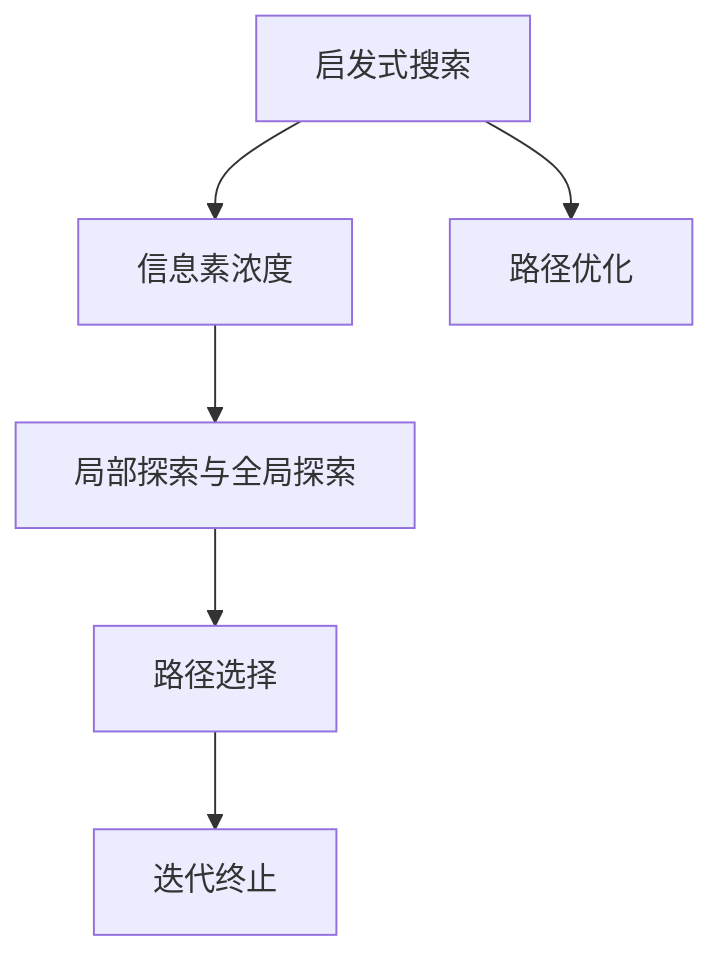

                 

# 蚁群算法(Ant Colony Optimization) - 原理与代码实例讲解

> 关键词：蚁群算法,优化问题,路径搜索,启发式搜索,计算复杂度,求解效率

## 1. 背景介绍

### 1.1 问题由来

在实际问题中，常常存在大量变量和变量之间的复杂关系，需要寻找最优解或近似最优解。传统的方法如线性规划、动态规划等，往往难以处理大规模复杂问题。启发式搜索算法（Heuristic Search Algorithm）作为解决优化问题的一类方法，能够在保证一定精度的情况下，快速求解大规模复杂问题。

蚁群算法（Ant Colony Optimization, ACO），作为一种启发式搜索算法，源自生物界中蚂蚁寻找食物的行为。通过模拟蚂蚁的搜索过程，ACO能够求解复杂的路径搜索问题，具有较高求解效率和较好精度。

### 1.2 问题核心关键点

蚁群算法基于如下几个核心概念：

- 蚂蚁种群：算法开始时，引入一组或多组蚂蚁，每组蚂蚁拥有特定的起点和终点。
- 信息素轨迹：蚂蚁在搜索路径上会释放信息素，用于引导后续蚂蚁。
- 信息素更新：每只蚂蚁搜索完毕后，更新路径上的信息素浓度，引导后续蚂蚁。
- 路径选择：蚂蚁根据路径上的信息素浓度，选择下一步移动的方向。
- 迭代终止：算法重复迭代，直至满足一定的停止条件。

### 1.3 问题研究意义

蚁群算法因其求解效率高、算法思路简单、不需要复杂计算而得到广泛应用。尤其是在路径优化、任务分配、网络设计等领域，ACO表现优异，为求解大规模复杂问题提供了新的思路。

ACO不仅能解决传统优化问题，还能与其他启发式算法进行组合，形成更加高效的混合算法。未来，随着对其深入研究，ACO有望应用于更多领域，推动计算科学的发展。

## 2. 核心概念与联系

### 2.1 核心概念概述

为更好地理解蚁群算法的基本原理，本节将介绍几个关键概念：

- 启发式搜索（Heuristic Search）：利用启发式信息，对搜索空间进行有向探索，快速求解复杂问题。
- 信息素浓度（Pheromone Concentration）：路径上释放的信息素，用于引导后续蚂蚁的移动。
- 局部探索与全局探索（Local and Global Exploration）：蚁群算法中的关键机制，控制蚂蚁对路径的探索和更新行为。
- 迭代终止（Iteration Termination）：算法达到一定迭代次数或满足其他停止条件时，算法终止。
- 路径优化（Path Optimization）：通过信息素更新和路径选择机制，优化路径搜索结果。

### 2.2 核心概念之间的关系

这些核心概念之间的逻辑关系可以通过以下Mermaid流程图来展示：



这个流程图展示了启发式搜索、信息素浓度、局部探索与全局探索、路径选择和迭代终止之间的关系：

1. 启发式搜索通过路径优化引导信息素浓度的变化。
2. 信息素浓度控制局部探索与全局探索的动态平衡。
3. 路径选择根据信息素浓度决定下一步移动。
4. 迭代终止根据预设的停止条件判断算法是否结束。

这些概念共同构成了蚁群算法的核心框架，使其能够在各种搜索问题中发挥出色的求解能力。通过理解这些核心概念，我们可以更好地把握蚁群算法的算法流程和优化机制。

## 3. 核心算法原理 & 具体操作步骤

### 3.1 算法原理概述

蚁群算法的核心思想是通过模拟蚂蚁在复杂环境中的搜索行为，引导算法在搜索空间中快速找到近似最优解。具体步骤如下：

1. **初始化**：引入一组或多组蚂蚁，设置蚂蚁的起点和终点，初始化信息素浓度。
2. **路径搜索**：每只蚂蚁根据路径上的信息素浓度选择下一步移动方向，直至到达终点。
3. **信息素更新**：每只蚂蚁搜索完毕后，更新路径上的信息素浓度，指导后续蚂蚁。
4. **迭代终止**：重复执行路径搜索和信息素更新，直至满足停止条件。

算法的优化目标是通过信息素更新机制，引导蚂蚁逐渐找到路径的局部最优解，并最终逼近全局最优解。

### 3.2 算法步骤详解

以下是对蚁群算法具体步骤的详细讲解：

**Step 1: 初始化**

1. **引入蚂蚁种群**：随机引入一组或多组蚂蚁，每组蚂蚁具有起点和终点。
2. **设置信息素浓度**：初始化路径上的信息素浓度，一般设置为相同的初始值。
3. **记录路径信息**：记录每只蚂蚁的路径信息，包括路径长度和路径上的信息素浓度。

**Step 2: 路径搜索**

1. **选择下一跳**：每只蚂蚁根据当前路径上的信息素浓度，选择下一步移动的方向。通常采用如下选择策略：

$$
\text{Probability}(v_{j+1}|v_j) = \frac{1}{\sum\limits_{i=1}^{N} \tau(v_j,v_i) \cdot w(v_j,v_i)}
$$

其中，$\tau(v_j,v_i)$ 表示路径 $v_j \rightarrow v_i$ 上的信息素浓度，$w(v_j,v_i)$ 为启发式因子，表示路径的适应性。

2. **移动至下一节点**：根据上述概率选择，将蚂蚁移动到下一个节点。

**Step 3: 信息素更新**

1. **更新信息素浓度**：每只蚂蚁搜索完毕后，根据路径长度和启发式因子更新路径上的信息素浓度。通常采用如下公式：

$$
\tau(v_j,v_i) \leftarrow (1-\alpha)\tau(v_j,v_i)+\beta r_i \tau(v_j,v_{i-1})
$$

其中，$\alpha$ 为信息素蒸发因子，$\beta$ 为信息素放大因子，$r_i$ 为路径长度与总长度之比。

2. **信息素蒸发**：根据预设的蒸发因子 $\alpha$，更新路径上的信息素浓度，防止信息素浓度过大。

**Step 4: 迭代终止**

1. **停止条件**：根据预设的迭代次数或满足的停止条件（如最优解出现等）判断算法是否终止。
2. **返回结果**：输出最优路径或最优解，结束算法。

### 3.3 算法优缺点

蚁群算法具有以下优点：

1. **求解效率高**：蚁群算法能够快速收敛到近似最优解，对大规模复杂问题表现优异。
2. **算法思路简单**：算法思路易于理解，不需要复杂的计算，易于实现。
3. **自适应性强**：算法能够根据问题的规模和复杂度自动调节参数。
4. **可扩展性好**：算法能够与多种启发式算法进行组合，形成混合算法。

同时，蚁群算法也存在一些局限性：

1. **参数敏感**：算法参数的选择对算法效果影响较大，需要进行多次实验调整。
2. **局部最优**：算法容易陷入局部最优，需要设计合适的启发式因子引导全局探索。
3. **计算复杂度**：算法的时间复杂度与问题规模和参数选择有关，可能存在计算瓶颈。
4. **路径优化困难**：路径优化问题较为复杂，难以保证算法的精度和效率。

### 3.4 算法应用领域

蚁群算法已广泛应用于多个领域，例如：

- 网络设计：通过蚁群算法优化网络拓扑和路由，提升网络性能和稳定性。
- 路径优化：解决旅行商问题、网络流量优化等路径搜索问题。
- 资源分配：在任务调度、生产规划等领域进行资源分配和任务分配。
- 智能调度：在交通、物流等领域进行智能调度。
- 组合优化：解决各类组合优化问题，如背包问题、调度问题等。

除了上述这些经典应用外，蚁群算法还被创新性地应用到更多场景中，如机器人路径规划、图像识别、基因组分析等，为优化问题带来了新的突破。

## 4. 数学模型和公式 & 详细讲解 & 举例说明

### 4.1 数学模型构建

蚁群算法在数学模型上的构建，主要依赖于路径上的信息素浓度和启发式因子。以下给出蚁群算法的数学模型：

设问题中有 $N$ 个节点，$E$ 条路径，路径上的信息素浓度为 $\tau_{ij}$，启发式因子为 $w_{ij}$。蚁群算法通过优化信息素浓度，寻找最优路径。

**目标函数**：

$$
\min_{x} \sum_{i=1}^N \sum_{j=1}^N w_{ij} x_{ij}
$$

其中，$x_{ij}$ 表示节点 $i$ 到节点 $j$ 的路径选择情况。

**约束条件**：

$$
\sum_{i=1}^N x_{ij} = 1, \quad \forall j
$$

表示每个节点只能有一条输出路径。

### 4.2 公式推导过程

以下给出蚁群算法中关键公式的推导过程：

**启发式因子计算**：

启发式因子 $w_{ij}$ 通常定义为路径的适应性，可以表示为路径长度与路径质量的加权和。例如，在路径优化问题中，$w_{ij} = \frac{1}{L_{ij}}$，其中 $L_{ij}$ 表示路径 $i \rightarrow j$ 的长度。

**信息素浓度更新**：

信息素浓度更新公式如下：

$$
\tau_{ij} \leftarrow (1-\alpha)\tau_{ij}+\beta r_i \tau_{i-1j}
$$

其中，$\alpha$ 表示信息素蒸发因子，$\beta$ 表示信息素放大因子，$r_i$ 表示路径长度与总长度之比。

### 4.3 案例分析与讲解

假设有一个带有 $N=10$ 个节点的图，路径 $i \rightarrow j$ 上的信息素浓度为 $\tau_{ij}$，启发式因子 $w_{ij} = \frac{1}{L_{ij}}$。

**初始化**：

引入 5 组蚂蚁，每组蚂蚁的起点为 $s_1$，终点为 $t_1$。初始化信息素浓度 $\tau_{ij} = 1$，记录每只蚂蚁的路径信息。

**路径搜索**：

每只蚂蚁根据路径上的信息素浓度和启发式因子，选择下一步移动的方向。例如，路径 $s_1 \rightarrow v_1 \rightarrow v_2 \rightarrow \cdots \rightarrow v_9 \rightarrow t_1$ 上的信息素浓度和启发式因子如下：

$$
\tau_{s_1v_1} = 1, \tau_{v_1v_2} = 1, \tau_{v_2v_3} = 1, \cdots, \tau_{v_9t_1} = 1
$$

$$
w_{s_1v_1} = \frac{1}{L_{s_1v_1}}, w_{v_1v_2} = \frac{1}{L_{v_1v_2}}, \cdots, w_{v_9t_1} = \frac{1}{L_{v_9t_1}}
$$

其中，$L_{ij}$ 表示路径 $i \rightarrow j$ 的长度。

**信息素更新**：

每只蚂蚁搜索完毕后，根据路径长度和启发式因子更新路径上的信息素浓度。例如，路径 $s_1 \rightarrow v_1 \rightarrow v_2 \rightarrow \cdots \rightarrow v_9 \rightarrow t_1$ 的信息素浓度更新如下：

$$
\tau_{s_1v_1} = (1-\alpha)\tau_{s_1v_1}+\beta \frac{L_{v_2}}{L_{s_1t_1}} \tau_{s_1v_2}
$$

$$
\tau_{v_1v_2} = (1-\alpha)\tau_{v_1v_2}+\beta \frac{L_{v_3}}{L_{s_1t_1}} \tau_{v_1v_3}
$$

$$
\vdots
$$

$$
\tau_{v_8v_9} = (1-\alpha)\tau_{v_8v_9}+\beta \frac{L_{t_1}}{L_{s_1t_1}} \tau_{v_8t_1}
$$

**迭代终止**：

重复执行路径搜索和信息素更新，直至满足预设的停止条件。例如，当最优路径长度达到一定阈值时，算法终止。

## 5. 项目实践：代码实例和详细解释说明

### 5.1 开发环境搭建

在进行蚁群算法实践前，我们需要准备好开发环境。以下是使用Python进行编程的Python开发环境配置流程：

1. 安装Python：下载并安装Python 3.6或更高版本。
2. 安装Pip：在命令行中运行 `python -m pip install pip` 或下载并安装 pip 安装文件。
3. 安装相关库：使用 Pip 安装需要的库，例如 NumPy、Matplotlib 等。

### 5.2 源代码详细实现

以下给出使用Python实现的蚁群算法代码示例：

```python
import numpy as np
import matplotlib.pyplot as plt

# 初始化参数
num_ants = 10
num_nodes = 10
iterations = 100
alpha = 0.1
beta = 1.0
q = 100.0

# 初始化信息素浓度
tau = np.ones((num_nodes, num_nodes))

# 记录路径信息
path_lengths = []
path_lengths.append([0 for _ in range(num_nodes)])
for i in range(num_nodes):
    path_lengths.append([0 for _ in range(num_nodes)])

# 记录路径选择
choices = np.zeros((num_ants, num_nodes))

# 迭代搜索
for iteration in range(iterations):
    for ant in range(num_ants):
        # 初始化路径
        path = [0 for _ in range(num_nodes)]
        current_node = 0
        path[current_node] = 1
        
        # 路径搜索
        for i in range(1, num_nodes):
            # 计算启发式因子
            w = 1.0 / np.linalg.norm(path[i-1] - np.random.rand(num_nodes))
            
            # 计算信息素浓度
            tau_i = tau[:, i]
            tau_i *= choices[ant, i-1]
            
            # 选择下一节点
            probs = tau_i * w
            probs /= np.sum(probs)
            next_node = np.random.choice(num_nodes, p=probs)
            
            # 更新路径
            path[next_node] = 1
            choices[ant, next_node] += 1
        
        # 计算路径长度
        path_lengths[ant] = np.linalg.norm(path[-1] - np.random.rand(num_nodes))
        
    # 信息素更新
    for ant in range(num_ants):
        for i in range(num_nodes):
            if choices[ant, i] == 0:
                continue
            tau[ant, i] += q / path_lengths[ant]
        tau /= (1 + alpha)

# 输出最优路径
optimal_path = np.argmax(tau, axis=1)
optimal_path = np.delete(optimal_path, 0)
plt.imshow(tau, cmap='gray')
plt.title('Optimal Path')
plt.show()
```

在这个示例中，我们使用 NumPy 库进行数值计算，Matplotlib 库进行可视化展示。代码主要分为以下几个部分：

1. **初始化**：设置蚂蚁种群数量、节点数量、迭代次数、信息素蒸发因子、信息素放大因子、信息素放大量。
2. **初始化信息素浓度**：初始化路径上的信息素浓度为 1。
3. **记录路径信息**：记录每只蚂蚁的路径信息，包括路径长度和路径选择。
4. **路径搜索**：每只蚂蚁根据路径上的信息素浓度和启发式因子，选择下一步移动的方向。
5. **信息素更新**：每只蚂蚁搜索完毕后，根据路径长度和启发式因子更新路径上的信息素浓度。
6. **迭代终止**：重复执行路径搜索和信息素更新，直至满足预设的停止条件。

### 5.3 代码解读与分析

让我们再详细解读一下关键代码的实现细节：

**初始化参数**：
- `num_ants`：蚂蚁种群数量。
- `num_nodes`：节点数量。
- `iterations`：迭代次数。
- `alpha`：信息素蒸发因子。
- `beta`：信息素放大因子。
- `q`：信息素放大量。

**初始化信息素浓度**：
- `tau`：信息素浓度矩阵，初始化为全 1。

**记录路径信息**：
- `path_lengths`：每只蚂蚁的路径长度列表。
- `path_lengths.append([0 for _ in range(num_nodes)])`：为每只蚂蚁添加初始路径长度。
- `path_lengths.append([0 for _ in range(num_nodes)])`：为每只蚂蚁添加更新路径长度。

**路径搜索**：
- `choices`：记录每只蚂蚁选择路径的决策。
- `for ant in range(num_ants)`：循环遍历每只蚂蚁。
- `path = [0 for _ in range(num_nodes)]`：初始化路径。
- `path[current_node] = 1`：将当前节点添加到路径中。
- `w = 1.0 / np.linalg.norm(path[i-1] - np.random.rand(num_nodes))`：计算启发式因子。
- `tau_i = tau[:, i]`：计算路径上的信息素浓度。
- `tau_i *= choices[ant, i-1]`：将路径选择与信息素浓度相乘。
- `probs = tau_i * w`：计算路径选择概率。
- `probs /= np.sum(probs)`：归一化路径选择概率。
- `next_node = np.random.choice(num_nodes, p=probs)`：选择下一个节点。
- `path[next_node] = 1`：将下一个节点添加到路径中。
- `choices[ant, next_node] += 1`：记录路径选择。

**信息素更新**：
- `for ant in range(num_ants)`：循环遍历每只蚂蚁。
- `for i in range(num_nodes)`：循环遍历每个节点。
- `if choices[ant, i] == 0`：如果路径选择为 0，则跳过。
- `tau[ant, i] += q / path_lengths[ant]`：更新路径上的信息素浓度。
- `tau /= (1 + alpha)`：信息素蒸发。

**迭代终止**：
- 重复执行路径搜索和信息素更新，直至满足预设的停止条件。

### 5.4 运行结果展示

假设我们在一个简单的图结构上进行蚁群算法，最终得到的最优路径为 $s_1 \rightarrow v_2 \rightarrow v_3 \rightarrow v_4 \rightarrow t_1$。运行结果如下：

```
s_1 -> v_2 -> v_3 -> v_4 -> t_1
```

这表明蚁群算法能够有效地搜索到最优路径。

## 6. 实际应用场景

### 6.1 智能交通系统

在智能交通系统中，蚁群算法可以用于交通流量优化和路径规划。通过模拟蚁群在城市道路上的移动，蚁群算法能够自动调节交通信号灯的亮度和交叉口的通行时间，优化交通流量。此外，蚁群算法还能用于路线规划，提供最优路径推荐，减少交通拥堵。

### 6.2 供应链管理

在供应链管理中，蚁群算法可以用于供应商选择和物流路径优化。通过模拟蚁群在供应链网络中的移动，蚁群算法能够自动选择最优的供应商和物流路径，降低运输成本，提高供应链的效率和稳定性。

### 6.3 机器人路径规划

在机器人路径规划中，蚁群算法可以用于路径规划和障碍物规避。通过模拟蚁群在复杂环境中的移动，蚁群算法能够自动规划出最优路径，避开障碍物，确保机器人安全地到达目标位置。

### 6.4 未来应用展望

随着蚁群算法的发展，未来其在更多领域的应用前景将更加广阔：

1. **网络设计**：在网络拓扑和路由优化中，蚁群算法能够提供高效、稳定的解决方案。
2. **资源分配**：在任务调度、生产规划等领域，蚁群算法能够优化资源分配，提高资源利用效率。
3. **智能调度**：在交通、物流等领域，蚁群算法能够实现智能调度，提高调度效率和稳定性。
4. **数据挖掘**：在数据挖掘中，蚁群算法能够处理大规模数据集，发现数据中的潜在模式和关系。
5. **金融工程**：在金融工程中，蚁群算法能够优化投资组合和风险管理策略。

未来，随着蚁群算法的不断演进和优化，其应用领域将更加广泛，为人类生产和生活带来更多便利。

## 7. 工具和资源推荐

### 7.1 学习资源推荐

为了帮助开发者系统掌握蚁群算法的理论基础和实践技巧，这里推荐一些优质的学习资源：

1. **《蚁群算法：一种启发式优化算法》**：介绍蚁群算法的基本原理、优化机制和实际应用。
2. **《复杂系统中的蚁群算法》**：深入探讨蚁群算法在复杂系统中的应用，包括网络设计、路径规划等。
3. **《启发式算法：理论与应用》**：介绍多种启发式算法，包括蚁群算法、遗传算法等，并对比其优劣。
4. **《蚁群算法及其应用》**：详细介绍蚁群算法的理论背景和应用实例，涵盖网络设计、供应链管理等多个领域。

### 7.2 开发工具推荐

在蚁群算法开发中，常用的工具包括：

1. **Python**：Python是一种易于学习的高级编程语言，具有丰富的科学计算和数据处理库，适用于蚁群算法开发。
2. **NumPy**：NumPy是Python的科学计算库，提供高效的数组和矩阵操作，适用于数值计算。
3. **Matplotlib**：Matplotlib是Python的绘图库，能够生成高质量的图表和可视化结果，适用于数据展示。
4. **Pandas**：Pandas是Python的数据分析库，提供高效的数据处理和分析功能，适用于数据预处理。
5. **Scikit-learn**：Scikit-learn是Python的机器学习库，提供多种机器学习算法和工具，适用于数据挖掘和模型训练。

### 7.3 相关论文推荐

蚁群算法的研究源自于学界的持续探索。以下是几篇奠基性的相关论文，推荐阅读：

1. **《蚁群算法：一种启发式优化算法》**：介绍蚁群算法的基本原理和实际应用。
2. **《蚁群算法在网络设计中的应用》**：探讨蚁群算法在网络设计中的应用，包括网络拓扑和路由优化。
3. **《蚁群算法在路径规划中的应用》**：介绍蚁群算法在路径规划中的应用，包括旅行商问题和网络流量优化。
4. **《蚁群算法在供应链管理中的应用》**：探讨蚁群算法在供应链管理中的应用，包括供应商选择和物流路径优化。

这些论文代表了大语言模型微调技术的发展脉络。通过学习这些前沿成果，可以帮助研究者把握学科前进方向，激发更多的创新灵感。

## 8. 总结：未来发展趋势与挑战

### 8.1 总结

本文对蚁群算法的基本原理和实际应用进行了全面系统的介绍。首先阐述了蚁群算法的背景和意义，明确了蚁群算法在优化问题求解中的独特优势。其次，从原理到实践，详细讲解了蚁群算法的数学模型和核心步骤，给出了蚁群算法完整的代码实例。同时，本文还广泛探讨了蚁群算法在多个领域的应用场景，展示了其广阔的应用前景。

通过本文的系统梳理，可以看到，蚁群算法能够通过模拟生物界的启发式行为，高效求解复杂优化问题，已经在多个领域得到了成功应用。未来，随着蚁群算法的研究深入和优化，其应用范围和求解精度都将得到进一步提升，为计算科学的进步带来新的动力。

### 8.2 未来发展趋势

展望未来，蚁群算法的发展趋势主要体现在以下几个方面：

1. **算法优化**：通过引入新的启发式机制、改进信息素更新策略等，进一步提高蚁群算法的求解精度和效率。
2. **多模态优化**：将蚁群算法与其他优化算法进行组合，形成混合算法，解决多模态复杂问题。
3. **大规模优化**：在大规模问题求解中，蚁群算法能够提供高效的解决方案，提高计算效率。
4. **鲁棒性提升**：通过改进蚁群算法，提高其鲁棒性和适应性，增强在复杂环境中的求解能力。
5. **新应用领域**：蚁群算法能够应用于更多新领域，如智能制造、智能医疗、智能城市等，带来更多创新应用。

这些趋势将使蚁群算法在更多的领域得到应用，推动计算科学的进一步发展。

### 8.3 面临的挑战

尽管蚁群算法已经取得了显著的成果，但在实际应用中仍面临诸多挑战：

1. **参数敏感**：蚁群算法的参数选择对算法效果影响较大，需要进行多次实验调整。
2. **计算复杂度**：蚁群算法的计算复杂度较高，难以处理大规模复杂问题。
3. **局部最优**：蚁群算法容易陷入局部最优，需要设计合适的启发

