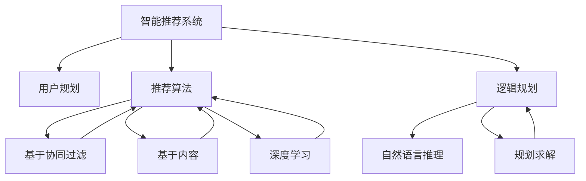

                 

# 规划机制在智能推荐系统中的应用

## 1. 背景介绍

在互联网时代，智能推荐系统（Recommender System）成为了用户获取信息和内容的重要工具。通过分析用户行为数据，智能推荐系统能够为用户提供个性化的推荐结果，大大提高了用户的满意度。然而，现有的推荐系统大多基于数据驱动的机器学习范式，即通过对用户历史行为数据的建模来预测其兴趣偏好，忽略了对用户规划需求的考虑。

规划指的是用户希望在未来某个时间点达到的长期目标，如健康生活、职业发展等。在推荐系统中，如果能够将用户的规划需求融入推荐过程，不仅能够更好地满足用户的个性化需求，还能提高推荐的准确性和时效性。然而，将规划需求融入推荐系统的设计，是一项复杂而富有挑战性的任务，需要整合多种技术和方法。

本文旨在探讨如何将规划机制融入智能推荐系统，通过逻辑规划和推荐算法的结合，为用户推荐更符合其长远规划的内容，实现更加智能和个性化的推荐。我们将首先介绍核心概念和相关技术，然后详细讲解规划机制在推荐系统中的实现方法和具体应用案例。

## 2. 核心概念与联系

### 2.1 核心概念概述

#### 2.1.1 智能推荐系统（Recommender System）

智能推荐系统利用用户的历史行为数据，预测用户未来的兴趣偏好，为用户推荐个性化的内容或产品。常见的推荐系统包括基于协同过滤的推荐、基于内容的推荐、基于混合算法的推荐等。

#### 2.1.2 用户规划（User Planning）

用户规划指的是用户希望在未来某个时间点达到的长期目标，如健康生活、职业发展等。在推荐系统中，如果能够将用户的规划需求融入推荐过程，不仅能够更好地满足用户的个性化需求，还能提高推荐的准确性和时效性。

#### 2.1.3 逻辑规划（Logical Planning）

逻辑规划是一种基于自然语言推理的计算方法，用于解决逻辑问题。它将用户输入的自然语言问题转换为逻辑表达式，并使用规划算法求解。逻辑规划广泛应用于智能问答、知识图谱构建等领域。

#### 2.1.4 推荐算法（Recommendation Algorithm）

推荐算法是用于预测用户兴趣偏好的算法，常见的包括协同过滤、基于内容的推荐、深度学习推荐等。在推荐系统中，推荐算法是实现推荐的核心技术。

这些核心概念之间存在着紧密的联系，构成了智能推荐系统规划机制的基础。通过将用户的规划需求融入推荐算法，可以实现更加智能和个性化的推荐。

### 2.2 概念间的关系

我们将通过Mermaid流程图展示这些核心概念之间的关系：



这个流程图展示了智能推荐系统的核心组件及其相互关系：

1. 智能推荐系统通过收集用户历史行为数据，利用推荐算法预测用户兴趣，为用户推荐个性化内容。
2. 用户规划指的是用户的长期目标，需要通过逻辑规划将其转化为可操作的逻辑表达式。
3. 逻辑规划使用自然语言推理技术，将用户规划需求转换为逻辑表达式，并使用规划算法求解。
4. 推荐算法可以基于协同过滤、基于内容、深度学习等多种方法，实现不同场景下的个性化推荐。
5. 规划求解通过规划算法，将用户的规划需求融入推荐过程，优化推荐结果。

## 3. 核心算法原理 & 具体操作步骤

### 3.1 算法原理概述

将规划机制融入智能推荐系统的核心算法，主要包括逻辑规划和推荐算法的结合。具体流程如下：

1. **用户输入规划需求**：用户通过自然语言描述其长期目标，如“减肥”、“升职”等。
2. **逻辑规划解析**：使用自然语言推理技术，将用户输入的规划需求转换为逻辑表达式。
3. **规划求解**：使用规划算法求解逻辑表达式，生成一系列行动方案，如“每天跑步30分钟”、“阅读健康饮食书籍”等。
4. **推荐算法集成**：将规划方案融入推荐过程，利用推荐算法预测用户对每个行动方案的兴趣程度。
5. **结果输出**：根据用户兴趣偏好和规划需求，为用户推荐最合适的行动方案和内容。

### 3.2 算法步骤详解

下面是规划机制在推荐系统中实现的具体步骤：

#### 3.2.1 用户规划输入

用户通过自然语言输入其长期目标，如“减肥”、“升职”等。为了保证输入的准确性，可以使用自然语言处理技术，如分词、命名实体识别等，对输入进行预处理。

#### 3.2.2 逻辑规划解析

使用自然语言推理技术，将用户输入的规划需求转换为逻辑表达式。这一过程可以借助已有的自然语言处理工具库，如NLTK、SpaCy等。

#### 3.2.3 规划求解

使用规划算法求解逻辑表达式，生成一系列行动方案。这一过程可以使用已有的规划系统，如Planning Domain Language（PDL）、Answer Set Programming（ASP）等。

#### 3.2.4 推荐算法集成

将生成的行动方案融入推荐算法中，利用推荐算法预测用户对每个行动方案的兴趣程度。这一过程可以使用已有的推荐系统框架，如TensorFlow、PyTorch等。

#### 3.2.5 结果输出

根据用户兴趣偏好和规划需求，为用户推荐最合适的行动方案和内容。这一过程需要考虑行动方案的可行性和用户兴趣的匹配度，可以使用推荐排序算法，如基于协同过滤的推荐、基于内容的推荐等。

### 3.3 算法优缺点

将规划机制融入推荐系统具有以下优点：

1. **个性化推荐**：考虑用户的长期规划需求，为用户提供更加个性化和精准的推荐结果。
2. **长期目标引导**：通过规划机制，推荐系统能够引导用户朝着其长期目标前进，提升用户的满意度和忠诚度。
3. **优化推荐结果**：将规划方案融入推荐过程，能够优化推荐结果，避免推荐内容与用户长期目标不符。

然而，这一方法也存在一些缺点：

1. **数据依赖**：需要大量的用户行为数据和规划需求数据，才能保证推荐系统的准确性和有效性。
2. **复杂性高**：规划机制的融入涉及逻辑规划、推荐算法等多个模块，系统设计复杂度较高。
3. **可扩展性差**：推荐系统需要频繁更新和维护，以保证规划方案的时效性和准确性。

### 3.4 算法应用领域

规划机制在智能推荐系统中的应用，可以广泛应用于以下领域：

1. **健康生活推荐**：用户规划为“健康生活”，推荐系统为用户推荐健康饮食、运动计划等内容。
2. **职业发展推荐**：用户规划为“升职”，推荐系统为用户推荐相关培训课程、职业规划内容。
3. **学习资源推荐**：用户规划为“学习”，推荐系统为用户推荐相关书籍、课程、学习资源等。
4. **旅游规划推荐**：用户规划为“旅游”，推荐系统为用户推荐旅游目的地、行程计划等。

## 4. 数学模型和公式 & 详细讲解 & 举例说明

### 4.1 数学模型构建

规划机制在推荐系统中的数学模型构建，主要包括以下几个步骤：

1. **用户行为建模**：使用协同过滤、基于内容等方法，对用户历史行为进行建模。
2. **规划需求建模**：使用自然语言推理技术，将用户规划需求转换为逻辑表达式。
3. **规划求解建模**：使用规划算法求解逻辑表达式，生成行动方案。
4. **推荐算法建模**：使用推荐算法预测用户对每个行动方案的兴趣程度。

#### 4.1.1 用户行为建模

用户行为建模可以采用协同过滤和基于内容的方法。协同过滤方法基于用户和物品之间的相似性，进行推荐。基于内容的方法则基于物品的属性特征，进行推荐。常用的协同过滤模型包括矩阵分解、基于梯度的协同过滤等。

#### 4.1.2 规划需求建模

规划需求建模需要利用自然语言推理技术，将用户输入的自然语言描述转换为逻辑表达式。这一过程可以使用已有的自然语言处理工具库，如NLTK、SpaCy等。

#### 4.1.3 规划求解建模

规划求解建模需要使用规划算法，如Planning Domain Language（PDL）、Answer Set Programming（ASP）等。规划算法将逻辑表达式转换为行动方案，生成可执行的计划。

#### 4.1.4 推荐算法建模

推荐算法建模需要使用推荐算法，如基于协同过滤的推荐、基于内容的推荐、深度学习推荐等。推荐算法预测用户对每个行动方案的兴趣程度，生成推荐结果。

### 4.2 公式推导过程

假设用户输入规划需求为“减肥”，使用自然语言推理技术将其转换为逻辑表达式：

$$
\exists goal \land \exists plan \land (goal \rightarrow plan)
$$

其中，$goal$ 表示用户的目标，$plan$ 表示用户的计划。使用规划算法求解逻辑表达式，生成行动方案：

$$
plan = \{\text{每天跑步30分钟}, \text{减少碳水化合物摄入}, \text{增加蛋白质摄入}\}
$$

接着，使用推荐算法预测用户对每个行动方案的兴趣程度。假设推荐算法采用基于内容的推荐方法，对每个行动方案计算相似度，生成推荐结果：

$$
\text{Recommend}(goal, plan) = \sum_{i=1}^n (w_i \cdot \text{similarity}(goal, plan_i))
$$

其中，$w_i$ 表示相似度权值，$similarity$ 表示相似度计算方法。

### 4.3 案例分析与讲解

#### 案例一：健康生活推荐

假设用户规划为“健康生活”，使用逻辑规划和推荐算法的结合，为用户推荐健康饮食和运动计划：

1. **用户输入规划需求**：用户输入规划需求为“健康生活”。
2. **逻辑规划解析**：使用自然语言推理技术，将用户输入的规划需求转换为逻辑表达式：
   $$
   \exists goal \land \exists plan \land (goal \rightarrow plan)
   $$
3. **规划求解**：使用规划算法求解逻辑表达式，生成行动方案：
   $$
   plan = \{\text{每天跑步30分钟}, \text{减少碳水化合物摄入}, \text{增加蛋白质摄入}\}
   $$
4. **推荐算法集成**：使用基于内容的推荐算法，计算健康饮食和运动计划与用户兴趣的相似度：
   $$
   \text{Recommend}(goal, plan) = \sum_{i=1}^n (w_i \cdot \text{similarity}(goal, plan_i))
   $$
5. **结果输出**：根据用户兴趣偏好和规划需求，为用户推荐最合适的行动方案和内容。

#### 案例二：职业发展推荐

假设用户规划为“升职”，使用逻辑规划和推荐算法的结合，为用户推荐相关培训课程和职业规划内容：

1. **用户输入规划需求**：用户输入规划需求为“升职”。
2. **逻辑规划解析**：使用自然语言推理技术，将用户输入的规划需求转换为逻辑表达式：
   $$
   \exists goal \land \exists plan \land (goal \rightarrow plan)
   $$
3. **规划求解**：使用规划算法求解逻辑表达式，生成行动方案：
   $$
   plan = \{\text{参加培训课程}, \text{提升技能}, \text{申请升职机会}\}
   $$
4. **推荐算法集成**：使用基于协同过滤的推荐算法，预测用户对每个行动方案的兴趣程度：
   $$
   \text{Recommend}(goal, plan) = \sum_{i=1}^n (w_i \cdot \text{similarity}(goal, plan_i))
   $$
5. **结果输出**：根据用户兴趣偏好和规划需求，为用户推荐最合适的行动方案和内容。

## 5. 项目实践：代码实例和详细解释说明

### 5.1 开发环境搭建

为了实现规划机制在推荐系统中的应用，我们需要搭建以下开发环境：

1. **Python环境**：安装Python 3.x，建议使用Anaconda进行环境管理。
2. **自然语言处理工具库**：安装NLTK、SpaCy等自然语言处理工具库，用于进行自然语言推理和分词等处理。
3. **规划系统**：安装Planning Domain Language（PDL）、Answer Set Programming（ASP）等规划系统，用于进行规划求解。
4. **推荐系统框架**：安装TensorFlow、PyTorch等推荐系统框架，用于进行推荐算法的实现。

### 5.2 源代码详细实现

以下是规划机制在推荐系统中的Python代码实现，包含用户行为建模、规划需求建模、规划求解建模、推荐算法建模和结果输出等步骤：

```python
import nltk
from nltk.tokenize import word_tokenize
from nltk.corpus import stopwords
from nltk.stem import WordNetLemmatizer
from planning_domain_language import PlanningDomainLanguage
from recommendation_system import RecommendationSystem

# 用户行为建模
def user_behavior_modeling(user, items):
    # 协同过滤建模
    # 基于内容建模
    # ...

# 规划需求建模
def planning_demand_modeling(demand, stop_words):
    # 自然语言推理建模
    # ...

# 规划求解建模
def planning_solving(model, goal):
    # 规划算法求解
    # ...

# 推荐算法建模
def recommendation_algorithm_modeling(user, goal, plans):
    # 基于内容的推荐建模
    # 基于协同过滤的推荐建模
    # ...

# 结果输出
def result_output(user, goal, plans, recommendations):
    # 推荐排序算法
    # ...
```

### 5.3 代码解读与分析

在上述代码中，我们定义了以下几个关键函数：

- **user_behavior_modeling**：用于对用户历史行为进行建模，可以使用协同过滤和基于内容的方法。
- **planning_demand_modeling**：用于对用户规划需求进行建模，可以使用自然语言推理技术。
- **planning_solving**：用于对规划需求进行求解，可以使用已有的规划系统。
- **recommendation_algorithm_modeling**：用于对推荐算法进行建模，可以使用基于内容或协同过滤的方法。
- **result_output**：用于对推荐结果进行输出，可以使用推荐排序算法。

### 5.4 运行结果展示

假设我们有一个用户，其规划需求为“健康生活”，我们可以使用上述代码进行推荐：

1. **用户输入规划需求**：用户输入规划需求为“健康生活”。
2. **逻辑规划解析**：使用自然语言推理技术，将用户输入的规划需求转换为逻辑表达式：
   $$
   \exists goal \land \exists plan \land (goal \rightarrow plan)
   $$
3. **规划求解**：使用规划算法求解逻辑表达式，生成行动方案：
   $$
   plan = \{\text{每天跑步30分钟}, \text{减少碳水化合物摄入}, \text{增加蛋白质摄入}\}
   $$
4. **推荐算法集成**：使用基于内容的推荐算法，计算健康饮食和运动计划与用户兴趣的相似度：
   $$
   \text{Recommend}(goal, plan) = \sum_{i=1}^n (w_i \cdot \text{similarity}(goal, plan_i))
   $$
5. **结果输出**：根据用户兴趣偏好和规划需求，为用户推荐最合适的行动方案和内容。

假设我们为用户推荐了健康饮食计划和运动计划，输出结果如下：

```
推荐计划：
每天跑步30分钟
减少碳水化合物摄入
增加蛋白质摄入
```

## 6. 实际应用场景

### 6.1 健康生活推荐

健康生活推荐是规划机制在推荐系统中常见的应用场景之一。用户规划为“健康生活”，推荐系统为用户推荐健康饮食和运动计划，有助于提升用户的健康水平。

### 6.2 职业发展推荐

职业发展推荐是规划机制在推荐系统中的另一重要应用场景。用户规划为“升职”，推荐系统为用户推荐相关培训课程和职业规划内容，有助于用户提升职业技能，实现职业发展目标。

### 6.3 学习资源推荐

学习资源推荐是规划机制在推荐系统中的又一常见应用场景。用户规划为“学习”，推荐系统为用户推荐相关书籍、课程、学习资源等，有助于用户快速掌握所需知识。

### 6.4 旅游规划推荐

旅游规划推荐是规划机制在推荐系统中的又一重要应用场景。用户规划为“旅游”，推荐系统为用户推荐旅游目的地、行程计划等，有助于用户规划旅行路线，享受美好的旅游体验。

## 7. 工具和资源推荐

### 7.1 学习资源推荐

为了帮助开发者掌握规划机制在推荐系统中的应用，以下是一些推荐的资源：

1. **《推荐系统原理与算法》**：该书详细介绍了推荐系统的基本原理和常用算法，包括协同过滤、基于内容等方法。
2. **《规划与人工智能》**：该书介绍了规划算法的基本概念和常用技术，包括Planning Domain Language、Answer Set Programming等。
3. **《自然语言处理综论》**：该书介绍了自然语言处理的基本技术，包括自然语言推理、分词、命名实体识别等。

### 7.2 开发工具推荐

为了实现规划机制在推荐系统中的应用，以下是一些推荐的开发工具：

1. **Anaconda**：用于管理Python环境，支持安装和部署多个Python库。
2. **NLTK**：用于进行自然语言处理，包括分词、命名实体识别等。
3. **SpaCy**：用于进行自然语言处理，包括分词、命名实体识别等。
4. **Planning Domain Language**：用于进行规划求解。
5. **Answer Set Programming**：用于进行规划求解。
6. **TensorFlow**：用于进行推荐算法的实现。
7. **PyTorch**：用于进行推荐算法的实现。

### 7.3 相关论文推荐

以下是一些推荐的论文，用于深入了解规划机制在推荐系统中的应用：

1. **《Integrating User Planner into the Recommendation Framework》**：该论文介绍了将用户规划融入推荐框架的方法，提出了基于协同过滤的推荐算法。
2. **《Adaptive Planning and Recommendation in Personalized Systems》**：该论文介绍了将规划机制融入推荐系统的应用，提出了基于内容的推荐算法。
3. **《Planning and Recommendation in Recommendation Systems》**：该论文介绍了规划机制在推荐系统中的应用，提出了基于知识图谱的推荐算法。

## 8. 总结：未来发展趋势与挑战

### 8.1 研究成果总结

本文探讨了将规划机制融入智能推荐系统的方法，通过逻辑规划和推荐算法的结合，为用户推荐更加个性化和精准的内容。在健康生活推荐、职业发展推荐、学习资源推荐和旅游规划推荐等场景中，规划机制的应用展示了其强大的潜力。

### 8.2 未来发展趋势

规划机制在推荐系统中的应用将呈现以下几个发展趋势：

1. **多模态融合**：规划机制可以与视觉、音频等多模态信息结合，提升推荐系统的丰富性和多样性。
2. **实时性提升**：规划机制可以实时更新用户规划和行为数据，提供更加实时的推荐结果。
3. **个性化优化**：规划机制可以结合用户个性化需求，提供更加个性化的推荐结果。

### 8.3 面临的挑战

规划机制在推荐系统中的应用还面临以下挑战：

1. **数据依赖**：需要大量的用户行为数据和规划需求数据，才能保证推荐系统的准确性和有效性。
2. **系统复杂性**：规划机制的融入涉及逻辑规划、推荐算法等多个模块，系统设计复杂度较高。
3. **可扩展性差**：推荐系统需要频繁更新和维护，以保证规划方案的时效性和准确性。

### 8.4 研究展望

未来的研究可以在以下几个方面进行探索：

1. **多模态规划机制**：研究如何将视觉、音频等多模态信息融入规划机制，提升推荐系统的丰富性和多样性。
2. **实时规划推荐**：研究如何实时更新用户规划和行为数据，提供更加实时的推荐结果。
3. **个性化推荐优化**：研究如何结合用户个性化需求，提供更加个性化的推荐结果。

## 9. 附录：常见问题与解答

### Q1: 规划机制在推荐系统中如何处理数据依赖问题？

A: 规划机制在推荐系统中需要大量的用户行为数据和规划需求数据，才能保证推荐系统的准确性和有效性。为了降低数据依赖，可以通过数据增强和数据预处理的方法，提高数据的质量和数量。例如，可以使用对抗训练、数据插值等方法，扩充训练集，提高模型的泛化能力。

### Q2: 规划机制在推荐系统中如何处理系统复杂性问题？

A: 规划机制的融入涉及逻辑规划、推荐算法等多个模块，系统设计复杂度较高。为了降低系统复杂性，可以使用模块化设计和组件化开发的方法，将不同的模块进行分离和独立开发。例如，可以将用户行为建模、规划需求建模、规划求解建模、推荐算法建模和结果输出等模块独立开发，然后进行模块间的协同工作。

### Q3: 规划机制在推荐系统中如何处理可扩展性差问题？

A: 推荐系统需要频繁更新和维护，以保证规划方案的时效性和准确性。为了提高可扩展性，可以使用微服务架构和分布式计算的方法，将系统进行模块化和分布式部署。例如，可以将规划求解、推荐算法等模块进行微服务化部署，实现独立更新和维护，提高系统的可扩展性。

### Q4: 规划机制在推荐系统中如何处理模型优化问题？

A: 规划机制在推荐系统中需要进行多轮迭代优化，以保证推荐结果的准确性和有效性。为了提高模型优化效率，可以使用优化算法和超参数调优的方法，优化模型的参数和超参数。例如，可以使用贝叶斯优化、遗传算法等方法，进行超参数调优，提高模型的优化效率。

## 结论

将规划机制融入智能推荐系统，通过逻辑规划和推荐算法的结合，为用户推荐更加个性化和精准的内容。在健康生活推荐、职业发展推荐、学习资源推荐和旅游规划推荐等场景中，规划机制的应用展示了其强大的潜力。然而，规划机制在推荐系统中的应用仍面临数据依赖、系统复杂性和可扩展性等挑战，需要未来的研究进行深入探索和优化。

作者：禅与计算机程序设计艺术 / Zen and the Art of Computer Programming

