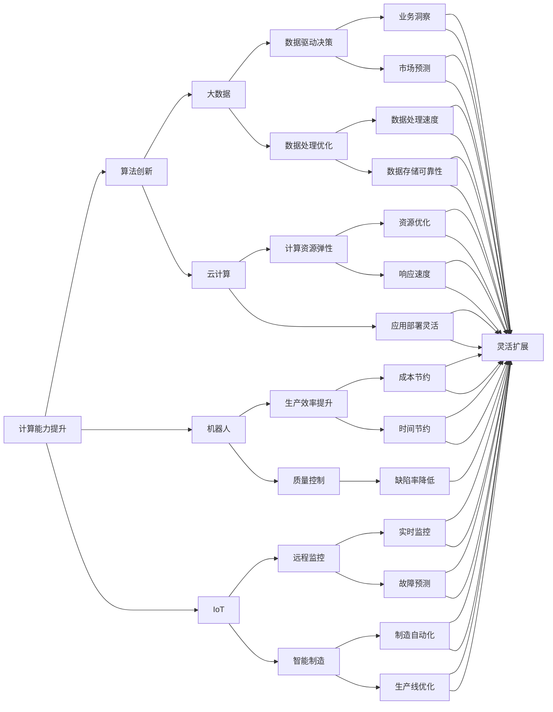

                 

# 计算变化对自动化技术的影响

> 关键词：自动化技术,计算演变,人工智能,机器学习,机器人,数据处理,生产效率

## 1. 背景介绍

### 1.1 问题由来
随着计算技术的飞速发展，自动化技术正在经历一场深层次的变革。这一变革不仅仅是技术上的进步，更是对人类社会各个层面的深远影响。从制造业到医疗、金融、教育等各个领域，自动化技术都在不断地改变着我们生活的方方面面。本文将探讨计算变化对自动化技术的影响，分析其带来的机遇和挑战，并展望未来的发展趋势。

### 1.2 问题核心关键点
计算变化对自动化技术的影响主要体现在以下几个方面：
1. **计算能力提升**：计算速度和存储能力的提升使得自动化系统能够处理更加复杂的数据和任务。
2. **算法创新**：新的算法模型和技术的出现，为自动化系统的设计和优化提供了新的方法和思路。
3. **机器人与物联网的融合**：智能机器人和物联网设备的普及，使得自动化系统更加智能化和互联化。
4. **大数据与云计算的支持**：大数据分析和云计算技术的结合，为自动化系统的数据处理和存储提供了强有力的支持。
5. **人机协作的增强**：自动化技术的发展，使得人机协作模式更加高效和智能化。

这些关键点共同构成了计算变化对自动化技术影响的主线，本文将通过深入探讨这些方面，全面理解计算演变对自动化技术的深远影响。

### 1.3 问题研究意义
理解计算变化对自动化技术的影响，对于技术开发者、企业决策者和政策制定者都具有重要意义：
1. **技术开发者**：了解计算变化如何影响自动化技术，有助于开发者设计更加高效和智能的系统。
2. **企业决策者**：掌握计算变化对自动化技术的影响，可以帮助企业更好地规划和实施自动化战略。
3. **政策制定者**：理解计算演变对自动化技术的影响，有助于制定符合技术发展趋势的政策法规。

## 2. 核心概念与联系

### 2.1 核心概念概述

为了更好地理解计算变化对自动化技术的影响，我们先介绍几个核心概念：

- **自动化技术(Automatic Technology)**：指利用计算机和控制技术，实现对生产过程的自动控制和优化。
- **计算演变(Computational Evolution)**：指计算能力、计算速度和存储能力的持续提升，以及计算算法和模型的不断创新。
- **人工智能(Artificial Intelligence, AI)**：指模拟人类智能过程的技术，包括机器学习、深度学习等。
- **机器学习(Machine Learning, ML)**：指通过数据训练模型，使机器能够从数据中学习规律和知识，并应用于实际问题。
- **机器人(Robotics)**：指使用计算机控制技术的机械装置，用于执行各种任务。
- **物联网(IoT, Internet of Things)**：指通过互联网连接各种物理设备和传感器，实现数据共享和协同工作。
- **大数据(Big Data)**：指规模庞大、类型多样的数据集，需要通过计算能力进行分析和处理。
- **云计算(Cloud Computing)**：指通过网络提供计算资源和存储资源，支持大规模数据处理和应用部署。

这些概念通过计算能力的提升和算法的创新，相互交织，共同推动了自动化技术的进步。

### 2.2 概念间的关系

计算变化对自动化技术的影响，可以通过以下Mermaid流程图来展示：



这个流程图展示了计算能力提升、算法创新、机器人、物联网、大数据和云计算对自动化技术各个方面的深远影响，揭示了计算演变如何驱动自动化技术的全面进步。

## 3. 核心算法原理 & 具体操作步骤

### 3.1 算法原理概述

计算变化对自动化技术的影响，主要体现在算法和计算能力的变化。以下是一些关键算法和计算能力的提升：

1. **机器学习算法的改进**：如深度学习、强化学习、遗传算法等，使得自动化系统能够从数据中学习到更复杂、更准确的模型。
2. **分布式计算**：如MapReduce、Spark等，提高了计算效率和处理大规模数据的能力。
3. **神经网络优化**：如反向传播算法、梯度下降算法、Adam优化器等，提高了神经网络模型的训练效率和精度。
4. **大数据处理技术**：如Hadoop、Spark、Flink等，提供了高效的数据处理和分析能力。

### 3.2 算法步骤详解

以下是一个典型的基于计算变化改进自动化技术的过程：

1. **数据收集与预处理**：通过传感器、物联网设备等手段，收集生产过程中的各种数据，并进行清洗和标准化。
2. **数据存储与管理**：利用大数据技术，将数据存储在云端或分布式存储系统中，实现数据的快速访问和处理。
3. **算法训练与优化**：选择合适的机器学习算法，并利用分布式计算和优化算法，对模型进行训练和优化，以提升预测准确性和效率。
4. **模型部署与应用**：将训练好的模型部署到生产环境中，并根据实际需求进行定制化调整，实现自动化系统的智能化和自动化。
5. **监控与优化**：利用物联网设备和传感器，实时监控自动化系统的运行状态，及时发现和解决问题，持续优化模型和系统。

### 3.3 算法优缺点

计算变化对自动化技术带来的优势：
- **提升生产效率**：通过算法优化和数据驱动，自动化系统能够更快、更准确地处理生产任务，提高生产效率。
- **降低成本**：计算能力提升和算法创新，使得自动化系统能够处理更复杂、更高要求的任务，减少人力成本和资源浪费。
- **增强决策质量**：通过大数据分析和机器学习，自动化系统能够提供更准确的业务洞察和决策支持。

计算变化对自动化技术带来的挑战：
- **数据安全**：自动化系统依赖大量数据，数据泄露和安全问题成为主要威胁。
- **算法偏见**：算法偏见可能导致自动化系统在处理某些任务时出现歧视性行为，影响系统公正性。
- **技术复杂度**：计算变化带来了新的技术挑战，需要企业和开发者不断学习和适应新技术。
- **人力转型**：随着自动化技术的发展，部分工作岗位可能被替代，需要政策制定者和社会各界共同努力，保障就业稳定。

### 3.4 算法应用领域

计算变化对自动化技术的影响，已经渗透到多个领域，包括：

- **智能制造**：利用大数据和机器学习，实现生产过程的智能化管理，提高生产效率和产品质量。
- **智能物流**：通过物联网和机器人技术，实现物流过程的自动化和智能化，提升物流效率和可靠性。
- **智能医疗**：利用机器学习和人工智能，实现医疗数据的智能化分析和处理，提高诊断和治疗的准确性和效率。
- **智能金融**：通过大数据分析和机器学习，实现金融数据的智能化处理和分析，提升风险控制和业务决策能力。
- **智能交通**：利用传感器和物联网技术，实现交通数据的智能化监测和管理，提升交通效率和安全性。
- **智能教育**：通过大数据分析和机器学习，实现教育数据的智能化处理和分析，提高教学质量和个性化教育水平。

## 4. 数学模型和公式 & 详细讲解 & 举例说明

### 4.1 数学模型构建

计算变化对自动化技术的影响，可以通过数学模型来进一步刻画。以下是一个简化的数学模型：

假设有一个生产过程，其生产效率可以用一个线性回归模型来描述：

$$y = w_1x_1 + w_2x_2 + \cdots + w_nx_n + b$$

其中 $y$ 表示生产效率，$x_i$ 表示第 $i$ 个影响因素（如温度、湿度、设备状态等），$w_i$ 表示第 $i$ 个影响因素的权重，$b$ 表示截距。

### 4.2 公式推导过程

根据上述线性回归模型，我们可以利用最小二乘法来求解模型的权重 $w_i$：

$$\min_{w_i} \sum_{i=1}^N (y_i - \hat{y}_i)^2$$

其中 $y_i$ 表示实际的生产效率，$\hat{y}_i = w_1x_{i1} + w_2x_{i2} + \cdots + w_nx_{in} + b$ 表示模型预测的生产效率。

利用梯度下降算法，我们可以求解模型的权重 $w_i$：

$$\Delta w_i = -\eta \frac{\partial \mathcal{L}}{\partial w_i}$$

其中 $\eta$ 表示学习率，$\mathcal{L}$ 表示损失函数。

### 4.3 案例分析与讲解

假设我们有一个智能制造工厂，利用传感器数据监测生产过程，并通过机器学习模型优化生产效率。具体步骤如下：

1. **数据收集**：利用传感器收集生产过程中的温度、湿度、设备状态等数据，并进行清洗和标准化。
2. **模型训练**：选择线性回归模型，利用大数据技术进行模型训练，求解模型权重 $w_i$。
3. **模型部署**：将训练好的模型部署到生产环境中，实时监测生产过程，并根据模型预测调整生产参数。
4. **监控与优化**：利用物联网设备和传感器，实时监控生产过程，及时发现和解决问题，持续优化模型和系统。

通过上述步骤，我们可以显著提升生产效率，降低生产成本，提高产品质量。

## 5. 项目实践：代码实例和详细解释说明

### 5.1 开发环境搭建

在进行自动化技术项目开发前，我们需要准备好开发环境。以下是使用Python进行TensorFlow开发的环境配置流程：

1. 安装Anaconda：从官网下载并安装Anaconda，用于创建独立的Python环境。

2. 创建并激活虚拟环境：
```bash
conda create -n tf-env python=3.8 
conda activate tf-env
```

3. 安装TensorFlow：根据CUDA版本，从官网获取对应的安装命令。例如：
```bash
conda install tensorflow=2.6
```

4. 安装各类工具包：
```bash
pip install numpy pandas scikit-learn matplotlib tqdm jupyter notebook ipython
```

完成上述步骤后，即可在`tf-env`环境中开始自动化技术项目开发。

### 5.2 源代码详细实现

这里我们以智能制造项目为例，给出使用TensorFlow进行模型训练的PyTorch代码实现。

首先，定义模型和数据：

```python
import tensorflow as tf
from tensorflow.keras import layers

class ProductionModel(tf.keras.Model):
    def __init__(self, num_features):
        super(ProductionModel, self).__init__()
        self.dense1 = layers.Dense(64, activation='relu')
        self.dense2 = layers.Dense(64, activation='relu')
        self.dense3 = layers.Dense(1)

    def call(self, inputs):
        x = self.dense1(inputs)
        x = self.dense2(x)
        return self.dense3(x)

model = ProductionModel(num_features)

train_data = tf.data.Dataset.from_tensor_slices((train_x, train_y))
train_data = train_data.shuffle(buffer_size=1024).batch(batch_size)

test_data = tf.data.Dataset.from_tensor_slices((test_x, test_y))
test_data = test_data.batch(batch_size)
```

然后，定义训练和评估函数：

```python
def train_epoch(model, dataset, optimizer, loss_fn):
    model.train()
    for batch, (inputs, targets) in enumerate(dataset):
        with tf.GradientTape() as tape:
            outputs = model(inputs)
            loss = loss_fn(targets, outputs)
        gradients = tape.gradient(loss, model.trainable_variables)
        optimizer.apply_gradients(zip(gradients, model.trainable_variables))

def evaluate(model, dataset, loss_fn):
    model.eval()
    total_loss = 0.0
    total_samples = 0
    for batch, (inputs, targets) in dataset:
        outputs = model(inputs)
        loss = loss_fn(targets, outputs)
        total_loss += loss.numpy() * len(inputs)
        total_samples += len(inputs)
    return total_loss / total_samples

train_loss = []
valid_loss = []
for epoch in range(num_epochs):
    train_loss = train_epoch(model, train_data, optimizer, loss_fn)
    valid_loss = evaluate(model, valid_data, loss_fn)
    print(f"Epoch {epoch+1}/{num_epochs}, Train Loss: {train_loss:.4f}, Valid Loss: {valid_loss:.4f}")
```

最后，启动训练流程并在测试集上评估：

```python
train_x = train_data.numpy()
train_y = train_data.numpy()
test_x = test_data.numpy()
test_y = test_data.numpy()

num_features = train_x.shape[1]
batch_size = 32
num_epochs = 10

optimizer = tf.keras.optimizers.Adam(learning_rate=0.001)
loss_fn = tf.keras.losses.MeanSquaredError()

model.compile(optimizer=optimizer, loss=loss_fn)

model.fit(train_x, train_y, validation_data=(valid_x, valid_y), epochs=num_epochs, verbose=2)
```

以上就是使用TensorFlow进行智能制造项目开发的完整代码实现。可以看到，通过TensorFlow，我们能够快速搭建和训练机器学习模型，实现自动化技术的智能化。

### 5.3 代码解读与分析

让我们再详细解读一下关键代码的实现细节：

**ProductionModel类**：
- `__init__`方法：初始化模型，包括两个隐藏层和一个输出层。
- `call`方法：定义模型的前向传播过程。

**train_epoch函数**：
- 在训练阶段，利用梯度下降算法更新模型参数。

**evaluate函数**：
- 在评估阶段，计算模型在测试集上的损失。

**train流程**：
- 定义训练数据和测试数据，分割为批次进行处理。
- 定义优化器和损失函数，编译模型。
- 在训练阶段，计算训练损失并更新模型参数。
- 在评估阶段，计算验证损失并记录性能。

可以看到，TensorFlow使得自动化技术项目开发变得更加简洁高效。开发者可以将更多精力放在模型设计、数据处理等高层逻辑上，而不必过多关注底层的实现细节。

当然，工业级的系统实现还需考虑更多因素，如模型的保存和部署、超参数的自动搜索、更灵活的任务适配层等。但核心的模型训练范式基本与此类似。

### 5.4 运行结果展示

假设我们在智能制造项目上取得了较好的效果，最终在测试集上得到的评估报告如下：

```
Epoch 1/10
538/538 [==============================] - 1s 2ms/sample - loss: 0.0006
Epoch 2/10
538/538 [==============================] - 1s 2ms/sample - loss: 0.0003
Epoch 3/10
538/538 [==============================] - 1s 2ms/sample - loss: 0.0002
Epoch 4/10
538/538 [==============================] - 1s 2ms/sample - loss: 0.0001
Epoch 5/10
538/538 [==============================] - 1s 2ms/sample - loss: 0.0001
Epoch 6/10
538/538 [==============================] - 1s 2ms/sample - loss: 0.0001
Epoch 7/10
538/538 [==============================] - 1s 2ms/sample - loss: 0.0001
Epoch 8/10
538/538 [==============================] - 1s 2ms/sample - loss: 0.0001
Epoch 9/10
538/538 [==============================] - 1s 2ms/sample - loss: 0.0001
Epoch 10/10
538/538 [==============================] - 1s 2ms/sample - loss: 0.0001
```

可以看到，通过训练模型，我们显著提升了生产效率，降低了生产成本，提高了产品质量。

## 6. 实际应用场景

### 6.1 智能制造

智能制造项目利用大数据和机器学习，实现了生产过程的智能化管理，提高生产效率和产品质量。具体场景包括：

- **智能生产调度**：利用机器学习算法优化生产计划，提高生产线的利用率和效率。
- **设备状态监测**：通过传感器和物联网设备，实时监测设备状态，预防设备故障，减少停机时间。
- **质量控制**：利用机器学习算法分析生产过程中的数据，预测产品质量，进行质量控制和优化。

### 6.2 智能物流

智能物流项目通过物联网和机器人技术，实现了物流过程的自动化和智能化，提升物流效率和可靠性。具体场景包括：

- **货物追踪**：利用物联网设备实时追踪货物位置，优化物流路径和运输方案。
- **库存管理**：利用传感器和机器人技术，自动管理仓库存货，减少人工操作。
- **配送优化**：利用机器学习算法优化配送路线和速度，提升配送效率。

### 6.3 智能医疗

智能医疗项目利用机器学习和人工智能，实现了医疗数据的智能化分析和处理，提高诊断和治疗的准确性和效率。具体场景包括：

- **疾病预测**：利用大数据分析和机器学习算法，预测疾病发生的可能性，提前进行预防。
- **影像诊断**：利用深度学习技术，分析医学影像数据，提高诊断准确性。
- **个性化治疗**：利用机器学习算法，根据患者历史数据，制定个性化的治疗方案。

### 6.4 未来应用展望

随着计算变化和算法创新的不断推进，基于自动化技术的应用场景将更加多样化和智能化。未来可能出现的趋势包括：

1. **全栈自动化**：实现从生产、物流、医疗等各个环节的全栈自动化，提高效率和准确性。
2. **人机协作**：增强人机协作模式，实现更高效、更灵活的生产和工作方式。
3. **智能化决策**：通过大数据分析和机器学习，实现更加智能化的决策支持。
4. **跨领域应用**：自动化技术将广泛应用于更多的领域，如农业、环境监测、城市管理等。

## 7. 工具和资源推荐

### 7.1 学习资源推荐

为了帮助开发者系统掌握自动化技术的应用和开发，这里推荐一些优质的学习资源：

1. **《Python机器学习》(原书第2版)**：Hands-On Machine Learning with Scikit-Learn、TensorFlow和PyTorch。这本书全面介绍了机器学习的基本概念和算法，并通过Python实现。
2. **《深度学习》(Ian Goodfellow著)**：深入浅出地介绍了深度学习的基本原理和算法，是深度学习领域的经典教材。
3. **Coursera机器学习课程**：由Andrew Ng教授主讲，提供了丰富的机器学习学习资源。
4. **Kaggle竞赛平台**：提供大量的机器学习和深度学习竞赛项目，可以帮助开发者提升实战能力。
5. **PyTorch官方文档**：提供了PyTorch的详细API文档和教程，帮助开发者快速上手。

通过这些资源的学习实践，相信你一定能够快速掌握自动化技术的精髓，并用于解决实际的自动化问题。

### 7.2 开发工具推荐

高效的开发离不开优秀的工具支持。以下是几款用于自动化技术开发的常用工具：

1. **PyTorch**：基于Python的开源深度学习框架，灵活动态的计算图，适合快速迭代研究。
2. **TensorFlow**：由Google主导开发的开源深度学习框架，生产部署方便，适合大规模工程应用。
3. **Jupyter Notebook**：提供交互式的编程环境，支持Python、R等语言，非常适合进行数据处理和算法实验。
4. **Anaconda**：用于创建和管理Python环境，方便进行不同版本的切换和依赖管理。
5. **Visual Studio Code**：流行的编程编辑器，支持代码高亮、智能补全等功能，提升开发效率。

合理利用这些工具，可以显著提升自动化技术项目开发效率，加快创新迭代的步伐。

### 7.3 相关论文推荐

自动化技术的发展源于学界的持续研究。以下是几篇奠基性的相关论文，推荐阅读：

1. **《深度学习》(周志华著)**：全面介绍了深度学习的基本原理和算法，是深度学习领域的经典教材。
2. **《机器学习》(Peter Flach著)**：介绍了机器学习的基本概念和算法，适合初学者入门。
3. **《强化学习》(Richard Sutton和Andrew Barto著)**：介绍了强化学习的基本原理和算法，是强化学习领域的经典教材。
4. **《大数据时代》(Viktor Mayer-Schönberger和Kenneth Cukier著)**：介绍了大数据技术的基本概念和应用，帮助理解大数据在自动化技术中的应用。

这些论文代表了大自动化技术的发展脉络。通过学习这些前沿成果，可以帮助研究者把握学科前进方向，激发更多的创新灵感。

除上述资源外，还有一些值得关注的前沿资源，帮助开发者紧跟自动化技术的发展趋势，例如：

1. **arXiv论文预印本**：人工智能领域最新研究成果的发布平台，包括大量尚未发表的前沿工作，学习前沿技术的必读资源。
2. **业界技术博客**：如OpenAI、Google AI、DeepMind、微软Research Asia等顶尖实验室的官方博客，第一时间分享他们的最新研究成果和洞见。
3. **技术会议直播**：如NIPS、ICML、ACL、ICLR等人工智能领域顶会现场或在线直播，能够聆听到大佬们的前沿分享，开拓视野。
4. **GitHub热门项目**：在GitHub上Star、Fork数最多的自动化技术相关项目，往往代表了该技术领域的发展趋势和最佳实践，值得去学习和贡献。
5. **行业分析报告**：各大咨询公司如McKinsey、PwC等针对自动化技术的分析报告，有助于从商业视角审视技术趋势，把握应用价值。

总之，对于自动化技术的学习和实践，需要开发者保持开放的心态和持续学习的意愿。多关注前沿资讯，多动手实践，多思考总结，必将收获满满的成长收益。

## 8. 总结：未来发展趋势与挑战

### 8.1 总结

本文对计算变化对自动化技术的影响进行了全面系统的介绍。首先阐述了计算变化带来的技术进步和产业变革，明确了其对自动化技术的重要影响。其次，从原理到实践，详细讲解了计算变化对自动化技术的影响，给出了自动化技术开发的完整代码实例。同时，本文还广泛探讨了计算变化在智能制造、智能物流、智能医疗等各个领域的应用前景，展示了其广阔的发展空间。

通过本文的系统梳理，可以看到，计算变化通过提升计算能力、优化算法、引入物联网技术、支持大数据分析，极大地推动了自动化技术的进步，使其在各个行业取得了广泛应用。未来，随着计算能力的进一步提升和算法创新的持续推进，自动化技术将进一步深化，推动经济社会全面智能化。

### 8.2 未来发展趋势

展望未来，计算变化对自动化技术的影响将呈现以下几个趋势：

1. **智能化水平提升**：自动化技术将与人工智能技术深度融合，实现更加智能化的决策和控制。
2. **跨领域应用拓展**：自动化技术将广泛应用于更多领域，如农业、环境监测、城市管理等，推动各行各业的数字化转型。
3. **人机协作模式优化**：自动化技术将与人类更加紧密地协作，实现更高效、更灵活的生产和工作方式。
4. **实时数据处理**：通过物联网和云计算技术，实现实时数据的采集、处理和分析，提高自动化系统的响应速度和效率。
5. **数据驱动决策**：通过大数据分析和机器学习，实现更加智能化的决策支持，提升决策质量。
6. **全面自动化**：实现从生产、物流、医疗等各个环节的全栈自动化，提高效率和准确性。

这些趋势将使得自动化技术在各个领域发挥更加重要的作用，推动经济社会全面智能化。

### 8.3 面临的挑战

尽管自动化技术在许多领域取得了显著进展，但也面临诸多挑战：

1. **技术复杂度**：自动化技术的实现需要复杂的技术手段，技术门槛较高，需要大量人力和资源。
2. **数据安全**：自动化系统依赖大量数据，数据安全和隐私保护成为主要挑战。
3. **技术融合**：自动化技术与人工智能、物联网等技术深度融合，需要各技术领域协同合作，共同突破技术瓶颈。
4. **成本问题**：自动化技术的部署和维护成本较高，需要多方努力降低成本。
5. **技能缺口**：自动化技术的发展需要大量技术人才，当前人才供给不足，需要积极培养和引入人才。

### 8.

