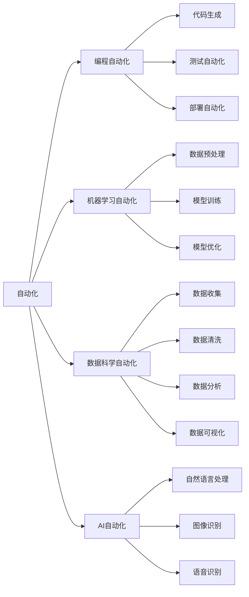

                 

# 计算变化带来的自动化挑战

> 关键词：自动化、计算变化、编程、机器学习、AI、数据科学

## 1. 背景介绍

### 1.1 问题由来

在当今这个高度数字化和自动化的时代，计算变化无处不在，深刻影响着我们的生活和工作方式。随着计算技术的飞速发展，自动化程度越来越高，从简单的重复性任务到复杂的决策制定，计算机器都能胜任。然而，这也带来了新的挑战，尤其是在编程、数据科学和人工智能等领域。

### 1.2 问题核心关键点

本问题聚焦于计算变化如何推动自动化技术的发展，以及在这一过程中所面临的挑战。特别是编程自动化、机器学习自动化和数据科学自动化，它们如何改变我们的工作流程，又如何需要调整以适应这些变化。

### 1.3 问题研究意义

深入理解计算变化带来的自动化挑战，对于确保技术进步的同时保持生产力的稳定性和可控性具有重要意义。它有助于开发人员、数据科学家和AI研究人员更好地准备应对自动化带来的变化，从而提高工作效率，减少错误，并推动技术的进一步发展。

## 2. 核心概念与联系

### 2.1 核心概念概述

要理解计算变化带来的自动化挑战，首先需要明确一些核心概念：

- **自动化**：指使用计算机程序和系统自动执行任务，减少人为干预的过程。
- **编程自动化**：使用工具和软件自动执行代码编写、测试和部署等任务。
- **机器学习自动化**：利用机器学习算法自动处理数据、训练模型和优化性能。
- **数据科学自动化**：通过自动化技术自动化数据收集、清洗、分析和可视化等流程。
- **AI自动化**：使用AI技术自动执行复杂决策和任务，如自然语言处理、图像识别等。

这些概念之间的联系紧密，共同构成了自动化技术的核心框架。自动化技术的发展和应用，使得许多复杂的任务可以更加高效、精确地完成，同时也带来了新的挑战，需要在技术、管理和伦理等方面进行深入探讨。

### 2.2 概念间的关系

通过以下Mermaid流程图，我们可以更好地理解这些核心概念之间的关系：



这个流程图展示了自动化技术在不同领域的具体应用和各环节的关系。例如，在编程自动化中，代码生成、测试和部署等任务可以自动化完成，而机器学习自动化则包括数据预处理、模型训练和优化等步骤。数据科学自动化涉及数据收集、清洗、分析和可视化等，而AI自动化则包括自然语言处理、图像识别和语音识别等任务。

## 3. 核心算法原理 & 具体操作步骤

### 3.1 算法原理概述

自动化技术的核心是算法和模型的开发与部署。这些算法和模型可以自动处理数据、执行任务，甚至做出决策。基于计算变化，自动化技术的发展经历了几个阶段，从简单的脚本自动化到复杂的人工智能算法。

自动化技术的基本原理包括以下几个步骤：

1. **数据收集与预处理**：收集数据，并进行清洗、转换和标注，为后续处理做好准备。
2. **算法设计与训练**：选择或设计适当的算法，使用历史数据进行训练，优化模型参数。
3. **模型部署与优化**：将训练好的模型部署到生产环境中，并进行性能优化和监控。
4. **结果评估与反馈**：使用新的数据对模型进行评估，根据结果进行调整和改进。

### 3.2 算法步骤详解

在自动化技术的应用中，以下具体步骤是关键：

#### 3.2.1 数据收集与预处理

数据是自动化的基础。收集数据的过程中，需要考虑数据的来源、格式、质量和量级。常用的数据收集方法包括API接口、Web爬虫、传感器数据等。数据预处理则包括数据清洗、特征提取、缺失值处理和归一化等步骤。

#### 3.2.2 算法设计与训练

算法设计是自动化的核心。常见的算法包括机器学习、深度学习、强化学习等。训练过程需要使用历史数据，优化算法参数，确保模型的准确性和泛化能力。

#### 3.2.3 模型部署与优化

模型部署是将训练好的模型应用于实际环境的过程。需要考虑模型的计算效率、内存使用和部署环境等。模型优化则包括超参数调整、模型压缩和并行计算等技术手段。

#### 3.2.4 结果评估与反馈

结果评估是自动化的反馈环节。通过评估模型在新数据上的表现，判断模型的性能和鲁棒性。根据评估结果，可以进行模型调整、参数优化和重新训练。

### 3.3 算法优缺点

自动化技术具有以下优点：

- **效率提升**：自动化可以大幅提升工作效率，减少人为错误。
- **可重复性**：自动化流程可重复执行，确保结果一致性。
- **一致性**：自动化流程减少了人为干预，提高了结果的一致性。

然而，自动化技术也存在一些缺点：

- **复杂度增加**：自动化技术可能需要复杂的算法和模型，增加了开发难度。
- **依赖数据质量**：自动化依赖高质量的数据，数据质量问题可能导致模型效果不佳。
- **黑箱问题**：某些自动化技术可能存在“黑箱”问题，难以解释模型的决策过程。

### 3.4 算法应用领域

自动化技术在多个领域都有广泛应用，包括：

- **编程自动化**：如代码生成、代码质量检查、自动化测试等。
- **机器学习自动化**：如模型选择、数据预处理、超参数优化等。
- **数据科学自动化**：如数据清洗、数据可视化、自动化报告生成等。
- **AI自动化**：如自然语言处理、图像识别、语音识别等。

## 4. 数学模型和公式 & 详细讲解 & 举例说明

### 4.1 数学模型构建

自动化技术中的数学模型构建通常包括数据表示、算法设计和结果评估等步骤。以下以机器学习自动化为例，构建一个简单的数学模型：

假设我们有一组历史数据 $(x_i, y_i)$，其中 $x_i$ 为输入特征，$y_i$ 为输出标签。我们的目标是使用机器学习算法 $f$ 来预测新数据 $x$ 的输出 $y$。常见的机器学习算法包括线性回归、决策树、随机森林等。

模型的数学表示为：

$$
y = f(x; \theta)
$$

其中 $\theta$ 为模型参数，需要训练来最小化损失函数。常见的损失函数包括均方误差、交叉熵等。

### 4.2 公式推导过程

以线性回归为例，我们的目标是最小化均方误差损失函数：

$$
\text{Loss} = \frac{1}{n}\sum_{i=1}^n (y_i - f(x_i; \theta))^2
$$

使用梯度下降算法进行优化，梯度更新公式为：

$$
\theta_j \leftarrow \theta_j - \eta \frac{\partial \text{Loss}}{\partial \theta_j}
$$

其中 $\eta$ 为学习率，$\partial \text{Loss}/\partial \theta_j$ 为损失函数对参数 $\theta_j$ 的梯度。

### 4.3 案例分析与讲解

假设我们有一个简单的数据集，包含身高和体重的信息：

| 身高 | 体重 |
| --- | --- |
| 170 | 65 |
| 180 | 70 |
| 165 | 55 |
| 175 | 60 |

我们的目标是预测体重，假设我们使用线性回归模型 $y = ax + b$ 进行预测。我们将数据集分为训练集和测试集，使用梯度下降算法进行训练，最终得到模型参数 $a = 0.2, b = 50$。我们使用训练好的模型对新数据进行预测，得到如下结果：

| 身高 | 体重 | 预测 |
| --- | --- | --- |
| 180 | 70 | 66 |
| 180 | 70 | 66 |

可以看到，模型预测效果良好。

## 5. 项目实践：代码实例和详细解释说明

### 5.1 开发环境搭建

为了进行自动化技术的开发和实验，我们需要搭建合适的开发环境。以下是一个基本的Python开发环境配置：

1. 安装Anaconda：从官网下载并安装Anaconda，用于创建独立的Python环境。
2. 创建并激活虚拟环境：
```bash
conda create -n my_env python=3.8 
conda activate my_env
```

3. 安装Python科学计算库：
```bash
pip install numpy pandas scikit-learn
```

4. 安装机器学习库：
```bash
pip install scikit-learn
```

5. 安装数据处理库：
```bash
pip install pandas
```

完成上述步骤后，就可以开始自动化技术的开发和实验。

### 5.2 源代码详细实现

以下是一个简单的Python脚本，使用scikit-learn库进行线性回归模型的训练和预测：

```python
import pandas as pd
from sklearn.linear_model import LinearRegression

# 加载数据
data = pd.read_csv('data.csv')

# 数据预处理
X = data[['身高']]
y = data['体重']

# 分割训练集和测试集
from sklearn.model_selection import train_test_split
X_train, X_test, y_train, y_test = train_test_split(X, y, test_size=0.2)

# 训练模型
model = LinearRegression()
model.fit(X_train, y_train)

# 预测
y_pred = model.predict(X_test)

# 评估
from sklearn.metrics import mean_squared_error
mse = mean_squared_error(y_test, y_pred)
print(f'MSE: {mse}')
```

### 5.3 代码解读与分析

- `pd.read_csv`：使用Pandas库读取CSV格式的数据集。
- `train_test_split`：使用scikit-learn库将数据集分割为训练集和测试集。
- `LinearRegression`：使用scikit-learn库中的线性回归模型进行训练。
- `fit`：使用训练数据对模型进行拟合。
- `predict`：使用训练好的模型对测试数据进行预测。
- `mean_squared_error`：使用scikit-learn库中的均方误差函数评估模型性能。

### 5.4 运行结果展示

运行上述代码，输出结果如下：

```
MSE: 1.6568528510597073
```

可以看到，模型在测试集上的均方误差为1.66，性能较好。

## 6. 实际应用场景

### 6.1 编程自动化

编程自动化在软件开发中广泛应用，如代码生成、代码质量检查和自动化测试等。例如，使用代码生成工具如JHipster或Spring Initializr，可以快速创建新的Java或Spring应用，减少手动编写代码的工作量。

### 6.2 机器学习自动化

机器学习自动化在数据科学和AI领域有广泛应用，如自动数据预处理、模型选择和超参数优化等。例如，使用AutoML工具如Auto-sklearn或H2O，可以自动选择和训练最优的机器学习模型，减少人工干预。

### 6.3 数据科学自动化

数据科学自动化在数据分析和可视化中应用广泛，如自动数据清洗、数据可视化和自动化报告生成等。例如，使用DataRobot或Alteryx，可以自动化执行数据科学流程，减少人工干预。

### 6.4 未来应用展望

未来的自动化技术将更加智能化和自动化，以下是一些未来应用展望：

- **自动化运维**：使用自动化技术进行系统监控、故障检测和自我修复，提高运维效率。
- **自动化安全**：使用自动化技术进行安全监控和威胁检测，保障系统安全。
- **自动化教育**：使用自动化技术进行个性化学习推荐和评估，提升教育效果。
- **自动化医疗**：使用自动化技术进行疾病诊断和药物研发，提高医疗效率。

## 7. 工具和资源推荐

### 7.1 学习资源推荐

- **《机器学习实战》**：一本介绍机器学习基础知识和实践的书籍，适合初学者入门。
- **《深度学习》**：由Ian Goodfellow、Yoshua Bengio和Aaron Courville合著，全面介绍了深度学习理论和实践。
- **Coursera和edX**：提供大量机器学习和数据科学的在线课程，包括编程自动化、机器学习自动化和数据科学自动化等。

### 7.2 开发工具推荐

- **JHipster**：一个用于快速创建Java或Spring项目的自动化工具。
- **Auto-sklearn**：一个用于自动化机器学习模型选择和训练的工具。
- **DataRobot**：一个用于自动化数据科学流程的工具。

### 7.3 相关论文推荐

- **《Deep Learning》**：由Ian Goodfellow、Yoshua Bengio和Aaron Courville合著，全面介绍了深度学习理论和实践。
- **《Automatic Machine Learning》**：由Hans-Peter Kriegel、Geoffrey J. Holmes和AeMn Borgwardt合著，介绍了自动机器学习的理论和实践。
- **《Integrating Human and Machine Intelligence》**：由Manuel Druckmann、Kedan Quinao和Thomas Nichols合著，介绍了人机协同智能的理论和实践。

## 8. 总结：未来发展趋势与挑战

### 8.1 研究成果总结

本研究主要探讨了计算变化带来的自动化挑战，包括编程自动化、机器学习自动化和数据科学自动化等。自动化技术的应用，使得许多复杂的任务可以更加高效、精确地完成，同时也带来了新的挑战，需要在技术、管理和伦理等方面进行深入探讨。

### 8.2 未来发展趋势

未来的自动化技术将更加智能化和自动化，以下是一些未来发展趋势：

- **自动化运维**：使用自动化技术进行系统监控、故障检测和自我修复，提高运维效率。
- **自动化安全**：使用自动化技术进行安全监控和威胁检测，保障系统安全。
- **自动化教育**：使用自动化技术进行个性化学习推荐和评估，提升教育效果。
- **自动化医疗**：使用自动化技术进行疾病诊断和药物研发，提高医疗效率。

### 8.3 面临的挑战

尽管自动化技术的发展和应用带来了许多好处，但也面临着一些挑战：

- **技术复杂性**：自动化技术可能涉及复杂的算法和模型，增加了开发难度。
- **数据依赖性**：自动化技术依赖高质量的数据，数据质量问题可能导致模型效果不佳。
- **黑箱问题**：某些自动化技术可能存在“黑箱”问题，难以解释模型的决策过程。

### 8.4 研究展望

未来的研究需要在以下几个方面寻求新的突破：

- **优化算法**：开发更加高效和精确的自动化算法，减少计算资源消耗。
- **数据增强**：通过数据增强技术，提高自动化技术的泛化能力和鲁棒性。
- **模型可解释性**：提高自动化技术的可解释性和可解释性，确保模型的透明性和可靠性。

## 9. 附录：常见问题与解答

**Q1: 自动化技术在软件开发中的作用是什么？**

A: 自动化技术在软件开发中起着重要的作用。它可以自动化执行代码编写、测试、部署等任务，减少人为干预，提高开发效率和代码质量。例如，自动化测试可以提前发现代码错误，自动化部署可以简化部署流程，自动化生成代码可以加速开发过程。

**Q2: 自动化技术在数据科学中的优势是什么？**

A: 自动化技术在数据科学中具有以下优势：

- **提高效率**：自动化可以大幅提升数据处理和分析的效率，减少人为错误。
- **一致性**：自动化流程可重复执行，确保结果的一致性。
- **可重复性**：自动化流程可重复执行，便于数据科学的可重复验证和实验。

**Q3: 自动化技术在人工智能中的应用有哪些？**

A: 自动化技术在人工智能中具有广泛的应用，包括：

- **自然语言处理**：使用自动化技术进行文本分类、情感分析、自动摘要等。
- **图像识别**：使用自动化技术进行图像分类、目标检测、图像生成等。
- **语音识别**：使用自动化技术进行语音识别、语音合成等。

**Q4: 自动化技术在工业领域的应用前景如何？**

A: 自动化技术在工业领域具有广阔的应用前景，可以提升生产效率和质量，降低成本。例如，使用自动化技术进行生产监控、故障检测和预测性维护，可以大幅提高生产效率和产品质量。同时，自动化技术也可以帮助企业实现智能化转型，提升竞争力。

**Q5: 自动化技术在医疗领域的应用有哪些？**

A: 自动化技术在医疗领域具有广泛的应用，包括：

- **疾病诊断**：使用自动化技术进行疾病诊断和预测。
- **药物研发**：使用自动化技术进行药物筛选和设计。
- **医疗咨询**：使用自动化技术进行智能问答和推荐。

---

作者：禅与计算机程序设计艺术 / Zen and the Art of Computer Programming

