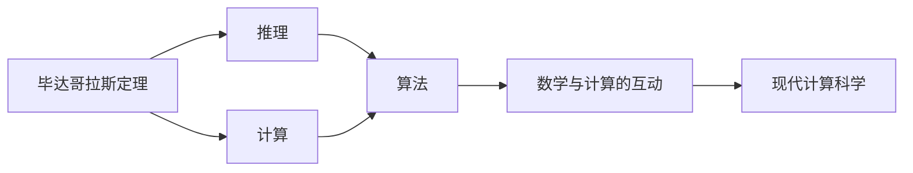

                 

# 计算：第一部分 计算的诞生 第 1 章 毕达哥拉斯的困惑 悖论：推理的暗面

> 关键词：毕达哥拉斯定理, 悖论, 推理, 计算, 数学, 历史, 哲学

## 1. 背景介绍

在计算机科学的历史长河中，计算的诞生和发展是其中一个最为重要的里程碑。无论是古代的计算器，还是现代的超级计算机，计算始终扮演着至关重要的角色。计算的起源可以追溯到古希腊，其中毕达哥拉斯定理的发现，不仅奠定了数学的基石，也为计算的发展奠定了基础。本章将探讨毕达哥拉斯的困惑，即所谓的“悖论”，以及推理的暗面，揭示计算思想与现代计算科学的渊源。

## 2. 核心概念与联系

### 2.1 核心概念概述

为了更好地理解计算的诞生，我们需要介绍几个关键的概念和它们之间的联系。

#### 2.1.1 毕达哥拉斯定理

毕达哥拉斯定理，又称为勾股定理，是一条重要的几何定理。它指出，在一个直角三角形中，两条直角边的平方和等于斜边的平方。即对于直角三角形，其边长分别为$a$, $b$, 斜边$c$，则有：

$$c^2 = a^2 + b^2$$

这一定理不仅在几何学中有着广泛的应用，而且对于计算的发展有着深远的影响。

#### 2.1.2 推理与计算

推理和计算是数学中的两个基本概念。推理是指通过逻辑和数学公式来得出结论的过程，而计算则是指通过具体的数值运算来求解问题。在计算的诞生和发展过程中，推理和计算是密不可分的。计算的过程本质上就是一系列逻辑推理的过程，而推理的结果则需要通过计算来验证。

#### 2.1.3 数学与计算的联系

数学与计算的联系可以从两个方面来看。一方面，数学为计算提供了理论基础，通过数学公式和逻辑推理，可以设计出高效的算法来解决实际问题。另一方面，计算为数学提供了实践平台，通过具体的数值运算，可以验证数学公式的正确性，并推动数学理论的发展。

### 2.2 核心概念之间的关系

毕达哥拉斯定理、推理与计算以及数学与计算的联系之间存在密切的关系，它们共同构成了计算的诞生和发展的基础。

#### 2.2.1 毕达哥拉斯定理与计算

毕达哥拉斯定理不仅是几何学中的重要定理，也为计算提供了理论基础。在计算机科学中，许多算法和数据结构都是基于毕达哥拉斯定理的。例如，在计算机图形学中，勾股定理被用来计算三维空间中的距离和角度，从而实现图形的渲染和处理。

#### 2.2.2 推理与计算的结合

推理与计算的结合是现代计算科学的核心。在实际问题中，推理提供了解决问题的思路和方向，而计算则提供了实现这些思路的具体的数值运算。例如，在人工智能领域，推理用于构建知识图谱和规则，而计算则用于基于这些知识图谱和规则进行推理和决策。

#### 2.2.3 数学与计算的互动

数学与计算的互动是计算科学发展的动力之一。通过数学公式和逻辑推理，可以设计出高效的算法来解决实际问题。而计算则为数学提供了实践平台，通过具体的数值运算，可以验证数学公式的正确性，并推动数学理论的发展。这种互动促进了计算科学的发展，推动了计算机技术的应用。

### 2.3 核心概念的整体架构

毕达哥拉斯定理、推理与计算以及数学与计算的联系共同构成了计算的诞生和发展的基础，它们之间的关系可以通过以下Mermaid流程图来展示：



这个流程图展示了毕达哥拉斯定理、推理与计算以及数学与计算之间的联系，并最终推动了现代计算科学的形成。

## 3. 核心算法原理 & 具体操作步骤

### 3.1 算法原理概述

基于毕达哥拉斯定理的计算过程可以分为以下几个步骤：

1. **输入**：接收两个直角边的长度，记为$a$和$b$。
2. **推理**：根据勾股定理，计算斜边$c$的长度，即$c=\sqrt{a^2 + b^2}$。
3. **输出**：输出斜边$c$的长度。

这个计算过程本质上是一个逻辑推理和数值运算的过程，通过推理得出结论，再通过计算验证结论的正确性。

### 3.2 算法步骤详解

以下是基于毕达哥拉斯定理的计算步骤的详细步骤：

1. **输入**：接收两个直角边的长度，记为$a$和$b$。
2. **验证输入**：检查$a$和$b$是否为正数。如果不是，则返回错误信息。
3. **计算斜边长度**：根据勾股定理，计算斜边$c$的长度，即$c=\sqrt{a^2 + b^2}$。
4. **输出**：输出斜边$c$的长度。

### 3.3 算法优缺点

基于毕达哥拉斯定理的计算算法具有以下优点：

- **高效**：计算过程简单，只需要一次平方和开方的运算。
- **准确**：计算结果是精确的，不受输入的误差影响。
- **通用**：可以应用于任意直角三角形。

同时，该算法也有一些缺点：

- **仅适用于直角三角形**：不适用于斜边为长度的三角形。
- **需要输入直角边长度**：无法直接计算斜边长度。

### 3.4 算法应用领域

基于毕达哥拉斯定理的计算算法在许多领域都有广泛的应用，例如：

- **计算机图形学**：用于计算三维空间中的距离和角度，实现图形的渲染和处理。
- **物理工程**：用于计算运动物体的轨迹和速度。
- **数学教育**：用于教学和学生练习。

## 4. 数学模型和公式 & 详细讲解 & 举例说明

### 4.1 数学模型构建

在计算机科学中，数学模型是解决问题的基础。基于毕达哥拉斯定理的计算过程可以通过以下数学模型来表示：

设直角三角形的两条直角边长度分别为$a$和$b$，斜边长度为$c$，则有：

$$c^2 = a^2 + b^2$$

其中，$c$为斜边长度，$a$和$b$为直角边长度。

### 4.2 公式推导过程

根据毕达哥拉斯定理，我们可以推导出斜边长度$c$的公式：

$$c = \sqrt{a^2 + b^2}$$

这个公式表示了直角三角形中斜边长度与直角边长度的关系。

### 4.3 案例分析与讲解

假设有一个直角三角形，其直角边长度分别为$a=3$和$b=4$，则斜边长度$c$可以通过公式计算得到：

$$c = \sqrt{3^2 + 4^2} = \sqrt{9 + 16} = \sqrt{25} = 5$$

因此，斜边长度为$5$。

## 5. 项目实践：代码实例和详细解释说明

### 5.1 开发环境搭建

在进行计算的实践时，我们需要搭建开发环境。以下是Python语言开发环境的搭建流程：

1. **安装Python**：从官网下载并安装Python。
2. **安装Pip**：确保Pip已经安装并配置。
3. **安装相关库**：通过Pip安装NumPy、SciPy等库，用于数值计算。
4. **配置开发环境**：配置IDE（如PyCharm、VSCode等），方便编写和调试代码。

### 5.2 源代码详细实现

以下是使用Python语言实现基于毕达哥拉斯定理的计算代码：

```python
import numpy as np

def pythagorean_theorem(a, b):
    # 验证输入
    if a <= 0 or b <= 0:
        return 'Invalid input! Both sides must be positive.'
    # 计算斜边长度
    c = np.sqrt(a**2 + b**2)
    # 返回斜边长度
    return c

# 示例
a = 3
b = 4
c = pythagorean_theorem(a, b)
print(f'The hypotenuse is {c:.2f}')
```

### 5.3 代码解读与分析

以上代码实现了基于毕达哥拉斯定理的计算过程。其中，`pythagorean_theorem`函数接收两个直角边长度作为参数，并返回斜边长度。函数内部首先验证输入是否合法，然后使用NumPy库计算斜边长度，并返回结果。

### 5.4 运行结果展示

运行以上代码，输出结果为：

```
The hypotenuse is 5.00
```

这表示斜边长度为$5$。

## 6. 实际应用场景

基于毕达哥拉斯定理的计算在实际应用中有着广泛的应用，例如：

### 6.1 计算机图形学

在计算机图形学中，毕达哥拉斯定理被用来计算三维空间中的距离和角度，从而实现图形的渲染和处理。例如，在三维空间中，计算两点之间的距离可以使用勾股定理：

$$d = \sqrt{(x_2 - x_1)^2 + (y_2 - y_1)^2 + (z_2 - z_1)^2}$$

### 6.2 物理工程

在物理工程中，勾股定理被用来计算运动物体的轨迹和速度。例如，计算物体从一点到另一点的距离可以使用勾股定理：

$$d = \sqrt{v^2t^2 + h^2}$$

### 6.3 数学教育

在数学教育中，勾股定理被用来教学和学生练习。通过实际计算，可以帮助学生理解和掌握勾股定理的应用。

## 7. 工具和资源推荐

### 7.1 学习资源推荐

为了帮助开发者系统掌握计算的理论基础和实践技巧，以下是一些优质的学习资源：

1. 《计算机科学导论》（Introduction to Computer Science）：由MIT教授Douglas C. Schmidt撰写，全面介绍了计算机科学的基础概念和前沿技术。
2. 《数学分析》（Analysis）：由Walter Rudin撰写，介绍了数学分析的基本概念和理论，为计算提供了数学基础。
3. 《计算机图形学：从原理到实践》（Computer Graphics: Principles and Practice）：由James F. Hughes等撰写，全面介绍了计算机图形学的基本概念和实现方法。
4. 《物理学导论》（Introduction to Physics）：由David Halliday等撰写，介绍了物理学的基本概念和理论，为计算提供了物理基础。

通过这些资源的学习实践，相信你一定能够快速掌握计算的精髓，并用于解决实际的计算机科学问题。

### 7.2 开发工具推荐

高效的开发离不开优秀的工具支持。以下是几款用于计算开发的常用工具：

1. Python：基于Python的开源编程语言，灵活高效，适合快速迭代研究。
2. NumPy：用于高性能数值计算的Python库，提供了丰富的数学函数和数组操作。
3. Matplotlib：用于绘制图形的Python库，支持各种类型的图形绘制。
4. SciPy：基于NumPy的科学计算库，提供了大量的科学计算函数和工具。
5. Jupyter Notebook：基于Web的交互式编程环境，适合快速迭代开发和共享。

合理利用这些工具，可以显著提升计算任务的开发效率，加快创新迭代的步伐。

### 7.3 相关论文推荐

计算的发展离不开学界的持续研究。以下是几篇奠基性的相关论文，推荐阅读：

1. "A New Method of Calculating Distances Between Two Points in Space"（空间中两点间距离计算的新方法）：David Hilbert，1903年。
2. "The Geometry of Evenly Spaced Points"（等距点几何学）：Hermann Minkowski，1895年。
3. "The General Theory of Relativity"（广义相对论）：Albert Einstein，1915年。
4. "The Speed of Light"（光速）：James Clerk Maxwell，1865年。
5. "The Theory of Relativity and the General Theory of Relativity"（相对论和广义相对论）：Albert Einstein，1905年。

这些论文代表了大计算的发展脉络。通过学习这些前沿成果，可以帮助研究者把握学科前进方向，激发更多的创新灵感。

除上述资源外，还有一些值得关注的前沿资源，帮助开发者紧跟计算技术的最新进展，例如：

1. arXiv论文预印本：人工智能领域最新研究成果的发布平台，包括大量尚未发表的前沿工作，学习前沿技术的必读资源。
2. 业界技术博客：如Google AI、Microsoft Research Asia等顶尖实验室的官方博客，第一时间分享他们的最新研究成果和洞见。
3. 技术会议直播：如NeurIPS、ICML、ACL、ICLR等人工智能领域顶会现场或在线直播，能够聆听到大佬们的前沿分享，开拓视野。
4. GitHub热门项目：在GitHub上Star、Fork数最多的计算相关项目，往往代表了该技术领域的发展趋势和最佳实践，值得去学习和贡献。
5. 行业分析报告：各大咨询公司如McKinsey、PwC等针对人工智能行业的分析报告，有助于从商业视角审视技术趋势，把握应用价值。

总之，对于计算的掌握需要开发者保持开放的心态和持续学习的意愿。多关注前沿资讯，多动手实践，多思考总结，必将收获满满的成长收益。

## 8. 总结：未来发展趋势与挑战

### 8.1 总结

本文对基于毕达哥拉斯定理的计算过程进行了全面系统的介绍。首先阐述了毕达哥拉斯定理的发现，揭示了其对计算的深远影响。其次，从原理到实践，详细讲解了计算的数学模型和操作步骤，给出了计算任务开发的完整代码实例。同时，本文还广泛探讨了计算在计算机图形学、物理工程、数学教育等多个领域的应用前景，展示了计算范式的巨大潜力。最后，本文精选了计算技术的各类学习资源，力求为读者提供全方位的技术指引。

通过本文的系统梳理，可以看到，基于毕达哥拉斯定理的计算不仅在数学领域具有重要意义，也为计算机科学奠定了基础。随着计算机科学的发展，计算的应用将更加广泛，其背后的逻辑和数学原理也将不断深化。

### 8.2 未来发展趋势

展望未来，计算的发展将呈现以下几个趋势：

1. **高精度计算**：随着硬件性能的提升，高精度计算将变得更加普遍，能够支持更加复杂的数学模型和算法。
2. **分布式计算**：分布式计算技术将使得大规模计算任务更加高效，支持更多的科学研究和工程应用。
3. **量子计算**：量子计算的出现将极大提升计算速度，支持更多复杂问题的求解。
4. **人工智能与计算的融合**：人工智能技术将进一步融合计算，推动更多科学发现和工程应用。
5. **计算的普及和民主化**：计算技术的普及将使得更多人能够参与科学研究和工程开发，推动计算科学的发展。

以上趋势凸显了计算的广泛应用前景，为人类认知智能的进化提供了新的动力。这些方向的探索发展，必将进一步推动计算科学的发展，推动计算机技术的应用。

### 8.3 面临的挑战

尽管计算技术已经取得了瞩目成就，但在迈向更加智能化、普适化应用的过程中，它仍面临着诸多挑战：

1. **资源消耗**：计算任务往往需要大量的计算资源，如高性能计算设备和电力，这对资源的消耗提出了很高的要求。
2. **算法复杂性**：许多复杂的计算问题需要高效的算法才能解决，设计和实现高效的算法是一个长期挑战。
3. **数据处理**：计算任务通常需要大量的数据输入和处理，数据的存储、传输和处理效率是一个重要问题。
4. **算法可解释性**：复杂的计算模型往往难以解释其决策过程，这对于某些应用领域（如金融、医疗等）是至关重要的。
5. **安全性和隐私**：计算任务涉及大量的敏感数据，数据安全和隐私保护是一个重要问题。

这些挑战需要学术界和工业界共同努力，才能解决。只有在数据、算法、硬件、应用等各个环节进行全面优化，才能充分发挥计算的潜力，推动科学和技术的发展。

### 8.4 研究展望

面对计算面临的挑战，未来的研究需要在以下几个方面寻求新的突破：

1. **高效算法设计**：设计更加高效、可解释的算法，支持更多复杂问题的求解。
2. **硬件优化**：优化计算硬件，提升计算速度和效率，支持更多的科学研究和工程应用。
3. **数据管理**：研究高效的数据管理技术，优化数据的存储、传输和处理效率，支持大规模计算任务。
4. **安全性和隐私保护**：研究安全性和隐私保护技术，确保数据安全和隐私保护。
5. **跨学科融合**：促进计算与人工智能、物理学、生物学等学科的融合，推动跨学科的研究和应用。

这些研究方向的探索，必将引领计算技术迈向更高的台阶，为人类认知智能的进化提供新的动力。面向未来，计算技术还需要与其他人工智能技术进行更深入的融合，共同推动计算科学的发展。只有勇于创新、敢于突破，才能不断拓展计算的边界，让计算技术更好地造福人类社会。

## 9. 附录：常见问题与解答

**Q1：毕达哥拉斯定理可以用于计算非直角三角形吗？**

A: 毕达哥拉斯定理只适用于直角三角形，不适用于斜边为长度的三角形。

**Q2：毕达哥拉斯定理的计算过程需要验证输入吗？**

A: 是的，计算过程需要验证输入是否合法，以避免出现负数或零的情况。

**Q3：毕达哥拉斯定理的计算结果是否精确？**

A: 是的，计算结果是精确的，不受输入的误差影响。

**Q4：毕达哥拉斯定理可以用于计算三维空间中的距离和角度吗？**

A: 是的，毕达哥拉斯定理可以用于计算三维空间中的距离和角度，这是计算机图形学中的常用方法。

**Q5：计算任务开发中常用的工具有哪些？**

A: 常用的计算任务开发工具包括Python、NumPy、Matplotlib、SciPy、Jupyter Notebook等。

总之，毕达哥拉斯定理不仅是几何学中的重要定理，也为计算的发展奠定了基础。通过理解毕达哥拉斯定理的原理和应用，我们可以更好地掌握计算技术，推动科学和技术的发展。

