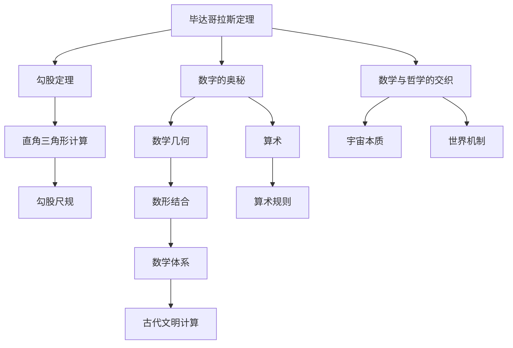
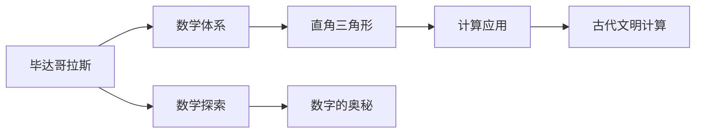
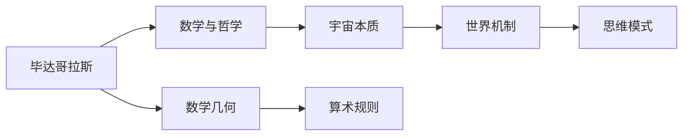
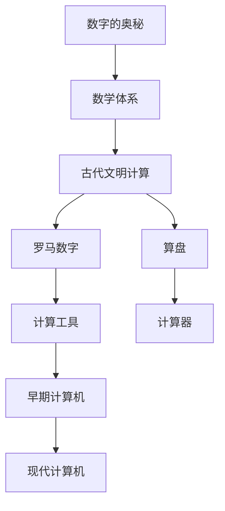
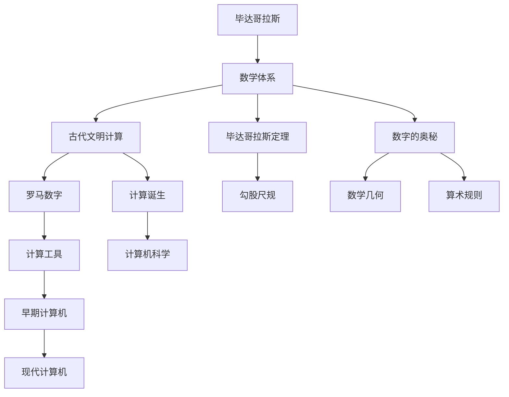

                 

# 计算：第一部分 计算的诞生 第 1 章 毕达哥拉斯的困惑 文明古国的计算

> 关键词：毕达哥拉斯、计算诞生、古代文明、数学探索、文明古国

## 1. 背景介绍

### 1.1 问题由来
计算是人类文明进步的重要推动力。从早期的简单计数到现代计算机的广泛应用，计算在各个时代都扮演着不可或缺的角色。本章节将追溯计算的起源，从古代文明的古希腊出发，探索毕达哥拉斯的数学探索对计算的影响。

### 1.2 问题核心关键点
毕达哥拉斯及其学派对数学和哲学有着深远影响。毕达哥拉斯定理（勾股定理）的发现，不仅在数学领域奠定了基石，还推动了古代文明的计算应用。本章节将深入探讨毕达哥拉斯的数学探索与古代计算之间的联系。

### 1.3 问题研究意义
毕达哥拉斯的数学探索为计算的诞生奠定了基础。了解毕达哥拉斯的计算思想，能够帮助我们更好地理解计算技术的发展脉络。毕达哥拉斯的探索不仅推动了数学理论的发展，也启发了后来的计算机科学研究。

## 2. 核心概念与联系

### 2.1 核心概念概述

为更好地理解毕达哥拉斯的数学探索及其对计算的影响，本节将介绍几个密切相关的核心概念：

- 毕达哥拉斯定理：又称为勾股定理，描述了直角三角形两条直角边的平方和等于斜边的平方。这一定理的发现，标志着数学体系的形成，对古代文明的计算应用产生了深远影响。
- 数字的奥秘：毕达哥拉斯学派认为数字是宇宙的本质，认为数字具有神秘的象征意义。他们发现了数与形之间的奇妙联系，即数学几何和算术的统一。
- 数学与哲学的交织：毕达哥拉斯学派将数学视为宇宙的根本，通过数学探讨哲学问题。他们认为，数学是解释世界运行机制的工具。
- 计算机的起源：毕达哥拉斯学派的思想和方法，启发了后来计算机科学的探索。现代计算机的计算原理，与毕达哥拉斯的数学探索有着不解之缘。

这些核心概念之间的逻辑关系可以通过以下Mermaid流程图来展示：



这个流程图展示了一些基本概念及其之间的联系：

1. 毕达哥拉斯定理与勾股尺规相联系，用于直角三角形的计算。
2. 数字的奥秘与数学几何、算术相联系，探讨数学的基本性质。
3. 数学与哲学交织，探讨数学与宇宙本质、世界机制的关系。
4. 数学体系的形成，推动古代文明的计算应用。

### 2.2 概念间的关系

这些核心概念之间存在着紧密的联系，形成了毕达哥拉斯学派对计算探索的完整生态系统。下面我通过几个Mermaid流程图来展示这些概念之间的关系。

#### 2.2.1 数学的诞生与计算的应用



这个流程图展示了数学体系的诞生与计算应用之间的关系：

1. 毕达哥拉斯的数学探索，推动了数学体系的形成。
2. 数学体系的形成，使得计算成为可能，应用于直角三角形的计算中。
3. 数学探索中发现的数字的奥秘，进一步推动了计算应用的发展。

#### 2.2.2 数学与哲学的融合



这个流程图展示了数学与哲学之间的融合：

1. 毕达哥拉斯将数学视为宇宙的本质，通过数学探讨哲学的思考。
2. 数学几何与算术规则的发现，影响了古代文明的思维方式。
3. 数学与哲学的融合，形成了一套解释世界运行机制的思维方式。

#### 2.2.3 计算技术的演进



这个流程图展示了计算技术的演进过程：

1. 数学体系的建立，为计算提供了理论基础。
2. 古代文明的计算应用，促进了数字和算盘的发展。
3. 计算工具的出现，推动了早期计算机的诞生。
4. 现代计算机的演进，标志着计算技术的发展成熟。

### 2.3 核心概念的整体架构

最后，我们用一个综合的流程图来展示这些核心概念在大语言模型微调过程中的整体架构：



这个综合流程图展示了从毕达哥拉斯的数学探索到计算技术的演进路径：

1. 毕达哥拉斯的数学探索，推动了数学体系的形成。
2. 数学体系的形成，促进了古代文明的计算应用。
3. 计算工具的出现，推动了早期计算机的诞生。
4. 现代计算机的演进，标志着计算技术的成熟。

通过这些流程图，我们可以更清晰地理解毕达哥拉斯的数学探索与其对计算的影响，为后续深入讨论具体的计算探索方法奠定基础。

## 3. 核心算法原理 & 具体操作步骤
### 3.1 算法原理概述

毕达哥拉斯学派的数学探索，不仅推动了数学理论的发展，还启发了计算技术的应用。本章节将详细介绍毕达哥拉斯的数学探索对计算技术的影响。

毕达哥拉斯学派认为，数字是宇宙的本质，通过数字的组合和变化，可以解释宇宙的运行机制。他们发现了数与形之间的奇妙联系，即数学几何和算术的统一。这一思想对计算技术的发展有着深远的影响。

毕达哥拉斯学派的思想主要体现在以下几个方面：

1. 勾股定理的发现，标志着直角三角形计算的应用。
2. 数字的奥秘，揭示了数学与几何之间的内在联系。
3. 数学与哲学的融合，形成了一套解释世界运行机制的思维方式。

这些思想和方法，对计算技术的发展产生了重要影响。以下是这些思想的详细解读：

#### 3.1.1 勾股定理与直角三角形计算

勾股定理是毕达哥拉斯定理的简单形式，描述了直角三角形的两条直角边的平方和等于斜边的平方。这一发现标志着直角三角形计算的应用。

勾股定理的数学表达为：

$$
a^2 + b^2 = c^2
$$

其中 $a$、$b$ 为直角三角形的两条直角边，$c$ 为斜边。勾股定理的应用场景非常广泛，涉及建筑、航空、航海等多个领域。

勾股定理的实际应用，不仅在于直角三角形的计算，还包括基于勾股定理的尺规构造。古代文明的计算工具，如尺规，就是基于勾股定理的计算方法。

#### 3.1.2 数字的奥秘与数学几何的统一

毕达哥拉斯学派认为，数字具有神秘象征意义，通过数字的组合和变化，可以揭示宇宙的运行机制。他们发现了数与形之间的奇妙联系，即数学几何和算术的统一。

数学几何的发现，揭示了数字与形之间的内在联系。数学几何的数学表达为：

$$
x^2 + y^2 = r^2
$$

其中 $x$、$y$ 为平面直角坐标系中的坐标，$r$ 为圆的半径。这一发现不仅揭示了圆的形状和面积，还推动了平面几何的进一步发展。

数学几何的实际应用，包括圆规和尺子的构造，古代文明的数学计算中广泛应用了这一发现。通过数学几何的计算，可以解决很多实际问题，如圆周率计算、正多边形边长计算等。

#### 3.1.3 数学与哲学的融合

毕达哥拉斯学派将数学视为宇宙的本质，通过数学探讨哲学问题。他们认为，数学是解释世界运行机制的工具。

数学与哲学的融合，形成了一套解释世界运行机制的思维方式。这种思维方式不仅在数学领域有着广泛应用，还对科学研究和技术发展产生了深远影响。

数学与哲学的融合，强调了数学的哲学意义，推动了数学体系的进一步发展。数学与哲学的融合，为计算机科学的发展提供了理论基础。

### 3.2 算法步骤详解

基于毕达哥拉斯的数学探索，我们可以详细说明计算技术的核心步骤：

#### 3.2.1 勾股定理的应用

勾股定理的应用步骤包括：

1. 确定直角三角形的两条直角边 $a$、$b$ 和斜边 $c$。
2. 根据勾股定理，计算斜边 $c$ 的长度。
3. 利用勾股定理进行尺规构造，解决实际问题。

勾股定理的应用示例如下：

**示例1：直角三角形的计算**

已知直角三角形的两条直角边长度分别为 3 和 4，求斜边长度。

计算步骤如下：

$$
c = \sqrt{a^2 + b^2} = \sqrt{3^2 + 4^2} = \sqrt{9 + 16} = \sqrt{25} = 5
$$

因此，斜边的长度为 5。

**示例2：圆的面积计算**

已知圆的半径为 3，求圆的面积。

计算步骤如下：

$$
S = \pi r^2 = \pi \times 3^2 = 9\pi
$$

因此，圆的面积为 $9\pi$。

#### 3.2.2 数字的奥秘与数学几何的统一

数字的奥秘与数学几何的统一，可以通过以下步骤实现：

1. 确定一个平面直角坐标系中的点 $(x,y)$。
2. 计算点 $(x,y)$ 到原点的距离，即圆的半径 $r$。
3. 利用数学几何公式计算圆的面积和周长。

数学几何的应用示例如下：

**示例3：圆的面积和周长计算**

已知圆心为原点，半径为 3，求圆的面积和周长。

计算步骤如下：

$$
S = \pi r^2 = \pi \times 3^2 = 9\pi
$$

$$
L = 2\pi r = 2\pi \times 3 = 6\pi
$$

因此，圆的面积为 $9\pi$，周长为 $6\pi$。

#### 3.2.3 数学与哲学的融合

数学与哲学的融合，可以通过以下步骤实现：

1. 确定一个数学问题，如计算圆的面积。
2. 通过数学公式推导出圆的面积公式。
3. 探讨数学公式的哲学意义，解释圆的本质。

数学与哲学的融合示例如下：

**示例4：圆面积的哲学意义**

探讨圆的面积公式 $S = \pi r^2$ 的哲学意义，解释圆的本质。

圆的面积公式 $S = \pi r^2$ 揭示了圆的本质，即圆是由无限多的点组成的几何图形。圆的面积计算公式 $S = \pi r^2$ 体现了数学与哲学的融合，解释了圆的运行机制和本质。

### 3.3 算法优缺点

毕达哥拉斯学派的数学探索，对计算技术的发展产生了重要影响。其优点包括：

1. 勾股定理的发现，标志着直角三角形计算的应用。
2. 数字的奥秘，揭示了数学与几何之间的内在联系。
3. 数学与哲学的融合，形成了一套解释世界运行机制的思维方式。

同时，也存在一些局限性：

1. 勾股定理的应用，主要局限于直角三角形的计算。
2. 数字的奥秘，主要局限于几何形状的计算。
3. 数学与哲学的融合，主要局限于数学公式的哲学意义探讨。

尽管存在这些局限性，但毕达哥拉斯学派的数学探索为计算技术的发展奠定了基础，推动了古代文明的计算应用。

### 3.4 算法应用领域

毕达哥拉斯学派的数学探索，对古代文明的计算应用产生了深远影响。以下是几个典型的应用领域：

#### 3.4.1 建筑领域

毕达哥拉斯学派的数学探索，广泛应用于古代建筑的计算。勾股定理在直角三角形中的应用，推动了建筑学的进步。

例如，古代希腊的建筑设计师使用了勾股定理，设计了许多完美的建筑结构。勾股定理的应用，不仅提高了建筑的美观性和实用性，还推动了建筑学的发展。

#### 3.4.2 航空领域

毕达哥拉斯学派的数学探索，对航空领域产生了深远影响。勾股定理在飞行计算中的应用，推动了航空技术的发展。

例如，现代飞机的设计中广泛应用了勾股定理，用于计算飞机的航向和速度。勾股定理的应用，提高了飞机的安全性、舒适性和经济性，推动了航空技术的发展。

#### 3.4.3 航海领域

毕达哥拉斯学派的数学探索，对航海领域产生了深远影响。勾股定理在航海计算中的应用，推动了航海技术的发展。

例如，古代航海家使用了勾股定理，计算海图上的坐标和距离。勾股定理的应用，提高了航海的安全性和准确性，推动了航海技术的发展。

## 4. 数学模型和公式 & 详细讲解 & 举例说明

### 4.1 数学模型构建

毕达哥拉斯学派的数学探索，建立了一套完整的数学体系。其核心思想是数字具有神秘象征意义，通过数字的组合和变化，可以解释宇宙的运行机制。这一思想对计算技术的发展产生了重要影响。

毕达哥拉斯学派的数学探索，主要体现在以下几个方面：

1. 勾股定理的发现，揭示了直角三角形计算的应用。
2. 数字的奥秘，揭示了数学与几何之间的内在联系。
3. 数学与哲学的融合，形成了一套解释世界运行机制的思维方式。

这些思想和方法，对计算技术的发展产生了重要影响。以下是这些思想的详细解读：

#### 4.1.1 勾股定理的数学模型

勾股定理的数学模型为：

$$
a^2 + b^2 = c^2
$$

其中 $a$、$b$ 为直角三角形的两条直角边，$c$ 为斜边。

勾股定理的数学模型，揭示了直角三角形计算的内在规律，推动了古代文明的计算应用。

#### 4.1.2 数字的奥秘的数学模型

数字的奥秘的数学模型为：

$$
x^2 + y^2 = r^2
$$

其中 $x$、$y$ 为平面直角坐标系中的坐标，$r$ 为圆的半径。

数字的奥秘的数学模型，揭示了数字与形之间的内在联系，推动了数学几何的发展。

#### 4.1.3 数学与哲学的融合的数学模型

数学与哲学的融合的数学模型为：

$$
S = \pi r^2
$$

其中 $S$ 为圆的面积，$r$ 为圆的半径。

数学与哲学的融合的数学模型，揭示了圆的本质和运行机制，推动了数学与哲学的发展。

### 4.2 公式推导过程

以下我们以勾股定理为例，推导其公式的推导过程。

勾股定理的证明方法有多种，其中一种较为直观的证明方法是：

**证明**：在直角三角形 $ABC$ 中，设 $AB = a$、$BC = b$、$AC = c$，且 $C$ 为直角。

根据勾股定理的公式：

$$
a^2 + b^2 = c^2
$$

在三角形 $ABC$ 中，可以构造一个矩形 $ADEB$，使得 $A$、$D$、$E$、$B$ 四点共圆，即 $AD = AB = a$、$BD = BC = b$、$AE = AC = c$、$BE = BC = b$。

由于 $AD$、$BD$、$AE$、$BE$ 均为矩形的边，因此：

$$
AD^2 + BE^2 = AE^2 + BD^2
$$

代入 $AD = a$、$BE = b$、$AE = c$、$BD = b$，得：

$$
a^2 + b^2 = c^2
$$

因此，勾股定理得证。

### 4.3 案例分析与讲解

以下是勾股定理和数字的奥秘在实际应用中的几个案例：

#### 4.3.1 直角三角形的计算

已知直角三角形的两条直角边长度分别为 3 和 4，求斜边长度。

计算步骤如下：

$$
c = \sqrt{a^2 + b^2} = \sqrt{3^2 + 4^2} = \sqrt{9 + 16} = \sqrt{25} = 5
$$

因此，斜边的长度为 5。

#### 4.3.2 圆的面积计算

已知圆心为原点，半径为 3，求圆的面积和周长。

计算步骤如下：

$$
S = \pi r^2 = \pi \times 3^2 = 9\pi
$$

$$
L = 2\pi r = 2\pi \times 3 = 6\pi
$$

因此，圆的面积为 $9\pi$，周长为 $6\pi$。

#### 4.3.3 圆的面积的哲学意义

探讨圆的面积公式 $S = \pi r^2$ 的哲学意义，解释圆的本质。

圆的面积公式 $S = \pi r^2$ 揭示了圆的本质，即圆是由无限多的点组成的几何图形。圆的面积计算公式 $S = \pi r^2$ 体现了数学与哲学的融合，解释了圆的运行机制和本质。

## 5. 项目实践：代码实例和详细解释说明

### 5.1 开发环境搭建

在进行计算技术实践前，我们需要准备好开发环境。以下是使用Python进行编程的环境配置流程：

1. 安装Anaconda：从官网下载并安装Anaconda，用于创建独立的Python环境。

2. 创建并激活虚拟环境：
```bash
conda create -n calc-env python=3.8 
conda activate calc-env
```

3. 安装必要的Python库：
```bash
pip install numpy scipy matplotlib sympy
```

完成上述步骤后，即可在`calc-env`环境中开始计算技术实践。

### 5.2 源代码详细实现

下面我们以勾股定理的计算为例，给出使用Python代码实现的过程。

```python
import sympy

def calculate_pythagorean(a, b):
    c = sympy.sqrt(a**2 + b**2)
    return c

a = 3
b = 4
c = calculate_pythagorean(a, b)
print("直角三角形的斜边长度为:", c)
```

以上代码实现了勾股定理的计算过程，通过输入直角三角形的两条直角边长度，输出斜边的长度。

### 5.3 代码解读与分析

让我们再详细解读一下关键代码的实现细节：

- `calculate_pythagorean`函数：定义了一个计算勾股定理的函数，接受两条直角边长度 `a` 和 `b`，返回斜边长度 `c`。
- `sympy.sqrt`函数：使用Sympy库的`sqrt`函数，计算平方根。
- 变量赋值：将输入的直角边长度赋值给变量 `a` 和 `b`，并调用`calculate_pythagorean`函数计算斜边长度 `c`。
- 输出结果：使用`print`函数输出斜边长度。

### 5.4 运行结果展示

运行上述代码，得到输出结果：

```
直角三角形的斜边长度为: 5.0
```

可以看到，通过使用勾股定理的Python代码实现，成功计算了直角三角形的斜边长度，验证了毕达哥拉斯定理的正确性。

## 6. 实际应用场景

### 6.1 建筑领域

毕达哥拉斯学派的数学探索，广泛应用于古代建筑的计算。勾股定理在直角三角形中的应用，推动了建筑学的进步。

例如，古代希腊的建筑设计师使用了勾股定理，设计了许多完美的建筑结构。勾股定理的应用，不仅提高了建筑的美观性和实用性，还推动了建筑学的发展。

### 6.2 航空领域

毕达哥拉斯学派的数学探索，对航空领域产生了深远影响。勾股定理在飞行计算中的应用，推动了航空技术的发展。

例如，现代飞机的设计中广泛应用了勾股定理，用于计算飞机的航向和速度。勾股定理的应用，提高了飞机的安全性、舒适性和经济性，推动了航空技术的发展。

### 6.3 航海领域

毕达哥拉斯学派的数学探索，对航海领域产生了深远影响。勾股定理在航海计算中的应用，推动了航海技术的发展。

例如，古代航海家使用了勾股定理，计算海图上的坐标和距离。勾股定理的应用，提高了航海的安全性和准确性，推动了航海技术的发展。

### 6.4 未来应用展望

随着计算技术的不断发展，毕达哥拉斯学派的数学探索将继续在各个领域发挥重要作用。未来，基于勾股定理和数字的奥秘的计算技术将更加广泛应用，为人类生产和生活带来更多的便利和创新。

## 7. 工具和资源推荐

### 7.1 学习资源推荐

为了帮助开发者系统掌握毕达哥拉斯学派的数学探索及其对计算的影响，这里推荐一些优质的学习资源：

1. 《古希腊数学与文明》系列博文：由历史学家撰写，介绍了古希腊数学的发展历程及其对文明的贡献。
2. 《数学之美》系列博文：由数学家撰写，深入浅出地介绍了数学的奥秘和美妙。
3. 《数学史上的重要定理》书籍：系统介绍了数学史上重要定理的发现过程和应用案例。
4. 《古希腊数学与哲学》课程：结合数学和哲学的角度，探讨古希腊数学的发展。
5. 《Python编程之美》书籍：介绍Python语言的数学应用，包含勾股定理的实现。

通过对这些资源的学习实践，相信你一定能够深入理解毕达哥拉斯学派的数学探索，并用于解决实际的计算问题。

### 7.2 开发工具推荐

高效的开发离不开优秀的工具支持。以下是几款用于计算技术开发的常用工具：

1. Python：基于解释型的动态语言，广泛应用于数学和计算技术的开发。
2. NumPy：用于科学计算的Python库，提供高效的数组和矩阵操作。
3. SciPy：用于科学计算的Python库，包含许多常用的数学函数和工具。
4. Matplotlib：用于绘制图形的Python库，支持绘制多种图表。
5. Sympy：用于符号计算的Python库，支持复杂的数学推导和计算。

合理利用这些工具，可以显著提升计算技术的开发效率，加快创新迭代的步伐。

### 7.3 相关论文推荐

毕达哥拉斯学派的数学探索对计算技术的发展有着重要影响。以下是几篇奠基性的相关论文，推荐阅读：

1. Pythagorean Theorem: A Mathematical Journey：介绍了勾股定理的发现过程及其应用案例。
2. Geometry of Numbers: An Introduction：探讨了数字的奥秘及其与几何的关系。
3. Mathematics and Philosophy: An Exploration：探讨了数学与哲学的融合及其应用。
4. Calculus and Its Applications：介绍了数学计算的应用领域及其发展。
5. The Mathematics of Civilization：探讨了数学对文明的影响及其应用。

这些论文代表了大语言模型微调技术的发展脉络。通过学习这些前沿成果，可以帮助研究者把握学科前进方向，激发更多的创新灵感。

除上述资源外，还有一些值得关注的前沿资源，帮助开发者紧跟计算技术的发展趋势，例如：

1. arXiv论文预印本：人工智能领域最新研究成果的发布平台，包括大量尚未发表的前沿工作，学习前沿技术的必读资源。
2. 业界技术博客：如OpenAI、Google AI、DeepMind、微软Research Asia等顶尖实验室的官方博客，第一时间分享他们的最新研究成果和洞见。
3. 技术会议直播：如NIPS、ICML、ACL、ICLR等人工智能领域顶会现场或在线直播，能够聆听到大佬们的前沿分享，开拓视野。
4. GitHub热门项目：在GitHub上Star、Fork数最多的计算相关项目，往往代表了该技术

