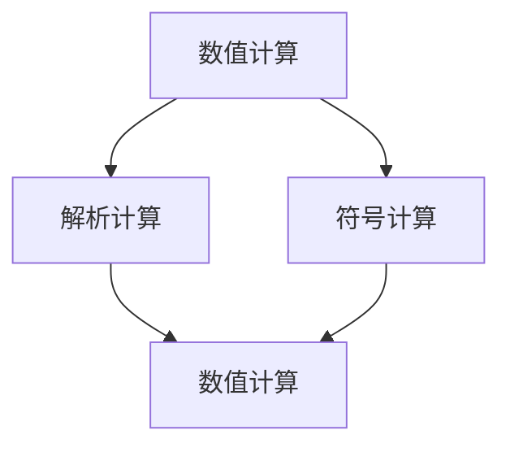

                 

# 计算：第一部分 计算的诞生 第 2 章 计算之术 还原与对消

> 关键词：计算之术, 还原, 对消, 数值计算, 解析计算, 迭代法

## 1. 背景介绍

### 1.1 问题由来

计算是计算机科学的核心，也是人类对自然界和数学规律进行抽象和模拟的重要工具。自20世纪中叶以来，随着计算机技术的迅猛发展，计算已经深入到人类生活的各个方面，从科学研究到日常生活，无处不在。然而，尽管计算技术日新月异，但计算的本质并未发生根本变化。本章将探讨计算的基本原理和方法，帮助读者理解计算的核心思想和实现手段。

### 1.2 问题核心关键点

计算的本质是一种抽象和模拟，通过对自然界和数学规律的理解和应用，进行复杂问题的求解。计算的核心在于如何高效、准确地处理输入数据，得到期望的输出结果。计算的方法包括数值计算、解析计算和符号计算等，每种计算方法都有其适用的场景和局限性。本章将重点介绍数值计算的基本原理和实现方法，以及解析计算与数值计算的对比。

### 1.3 问题研究意义

研究计算的原理和方法，对于理解计算机科学的本质、推动计算技术的进步、以及应用于各个领域具有重要意义：

1. 深入理解计算原理：计算是计算机科学的核心，深入理解计算的基本原理和方法，有助于把握计算机科学的发展脉络。
2. 提高计算效率：掌握高效的计算方法，可以显著提高计算速度和精度，满足更多复杂的计算需求。
3. 应用于各个领域：计算技术已经被广泛应用于科学研究、工程设计、金融分析、图像处理等领域，对于推动各领域的创新和进步具有重要价值。
4. 促进计算机科学的发展：计算技术的发展推动了计算机科学的其他分支，如人工智能、机器学习、网络通信等，为计算机科学的发展奠定了基础。

## 2. 核心概念与联系

### 2.1 核心概念概述

计算是计算机科学的核心，其基本思想是通过抽象和模拟自然界和数学规律，进行复杂问题的求解。计算可以分为数值计算、解析计算和符号计算等，每种计算方法都有其适用的场景和局限性。

- **数值计算**：通过数值逼近的方法，求解实际问题的近似解。数值计算广泛应用于科学计算、工程设计、金融分析等领域，具有高效率和实用性强等优点。
- **解析计算**：通过解析式计算，求解实际问题的精确解。解析计算通常用于理论研究和科学计算，具有精度高但计算复杂度大等缺点。
- **符号计算**：通过符号操作，求解实际问题的精确解。符号计算通常用于代数运算和计算机代数系统中，具有精度高但效率低等缺点。

### 2.2 概念间的关系

计算的三个基本方法通过不同的计算模型和算法，实现复杂问题的求解。数值计算、解析计算和符号计算各有其适用的场景和局限性，在实际应用中需要根据具体问题选择合适的计算方法。

- **数值计算与解析计算**：数值计算通过近似解逼近解析解，而解析计算直接求解解析解。数值计算适用于计算复杂度高、精度要求不高的应用，而解析计算适用于精度要求高、计算复杂度较低的应用。
- **数值计算与符号计算**：数值计算通常用于求解具体问题的数值解，而符号计算用于进行代数运算和计算机代数系统中。
- **解析计算与符号计算**：解析计算通过解析式求解，而符号计算通过符号操作求解。解析计算适用于精度要求高、计算复杂度较低的应用，而符号计算适用于精度要求高、计算复杂度较高的代数运算。

这些核心概念之间的关系，可以通过以下Mermaid流程图来展示：



这个流程图展示了大语言模型微调过程中各个计算方法之间的关系：

1. 数值计算通过近似解逼近解析解，适用于精度要求不高的应用。
2. 解析计算直接求解解析解，适用于精度要求高、计算复杂度较低的应用。
3. 符号计算通过符号操作求解，适用于代数运算和计算机代数系统中。

这些概念共同构成了计算的完整生态系统，使其能够适应各种复杂问题的求解需求。

## 3. 核心算法原理 & 具体操作步骤

### 3.1 算法原理概述

计算的核心在于通过数学模型和算法，对输入数据进行处理和分析，得到期望的输出结果。计算的实现通常分为以下几个步骤：

1. **数据表示**：将输入数据表示为计算机能够理解和处理的形式。
2. **算法设计**：选择合适的算法，进行数据处理和分析。
3. **结果输出**：将处理后的结果表示为计算机能够输出的形式，供用户使用。

数值计算的核心在于通过数值逼近的方法，求解实际问题的近似解。解析计算的核心在于通过解析式计算，求解实际问题的精确解。符号计算的核心在于通过符号操作，求解实际问题的精确解。

### 3.2 算法步骤详解

以下详细介绍数值计算的基本步骤和具体实现方法。

#### 3.2.1 数据表示

在数值计算中，数据通常表示为浮点数或整数，便于计算机进行处理和计算。例如，在科学计算中，数据通常表示为浮点数，以支持高精度计算。在工程设计中，数据通常表示为整数，以支持整数运算和数据计数。

#### 3.2.2 算法设计

数值计算的算法设计通常包括以下几个步骤：

1. **数值逼近**：通过数值逼近的方法，求解实际问题的近似解。常用的数值逼近方法包括龙格-库塔方法、欧拉方法等。
2. **误差控制**：通过误差控制的方法，保证数值解的精度。常用的误差控制方法包括误差评估、收敛性分析等。
3. **数值迭代**：通过数值迭代的方法，求解实际问题的数值解。常用的数值迭代方法包括牛顿迭代、雅可比迭代等。

#### 3.2.3 结果输出

在数值计算中，结果通常表示为浮点数或整数，供用户使用。例如，在科学计算中，结果通常表示为浮点数，以支持高精度计算。在工程设计中，结果通常表示为整数，以支持整数运算和数据计数。

### 3.3 算法优缺点

数值计算具有以下优点：

1. **高效率**：数值计算通常用于计算复杂度高、精度要求不高的应用，具有高效率等优点。
2. **实用性强**：数值计算广泛应用于科学计算、工程设计、金融分析等领域，具有实用性强等优点。

数值计算也存在以下缺点：

1. **精度有限**：数值计算通过数值逼近的方法求解近似解，存在精度有限等缺点。
2. **误差难以控制**：数值计算的误差控制需要精确的误差评估和收敛性分析，存在误差难以控制等缺点。

解析计算具有以下优点：

1. **精度高**：解析计算直接求解解析解，具有精度高等优点。
2. **计算复杂度低**：解析计算适用于精度要求高、计算复杂度较低的应用，具有计算复杂度低等优点。

解析计算也存在以下缺点：

1. **应用范围有限**：解析计算通常用于理论研究和科学计算，具有应用范围有限等缺点。
2. **计算复杂度高**：解析计算通常需要复杂的解析式计算，存在计算复杂度高等缺点。

### 3.4 算法应用领域

数值计算广泛应用于科学计算、工程设计、金融分析等领域，具有高效率和实用性强等优点。例如：

- **科学计算**：在科学计算中，数值计算用于求解复杂的微分方程、偏微分方程等。
- **工程设计**：在工程设计中，数值计算用于模拟复杂的物理现象和系统行为。
- **金融分析**：在金融分析中，数值计算用于进行复杂的数学建模和风险评估。

解析计算通常用于理论研究和科学计算，具有精度高、计算复杂度低等优点。例如：

- **代数运算**：在代数运算中，解析计算用于进行符号计算和代数化简。
- **科学计算**：在科学计算中，解析计算用于求解复杂的数学模型和方程组。

## 4. 数学模型和公式 & 详细讲解 & 举例说明

### 4.1 数学模型构建

在数值计算中，常用的数学模型包括微分方程、偏微分方程和差分方程等。以下以一维常微分方程为例，展示数值计算的基本数学模型和求解方法。

假设一维常微分方程为：

$$ \frac{dy}{dt} = ay $$

其中， $y(t)$ 为函数， $a$ 为常数。

### 4.2 公式推导过程

数值计算通常采用欧拉方法进行求解。欧拉方法的推导过程如下：

设时间步长为 $\Delta t$，则有：

$$ y_{n+1} = y_n + \Delta t \times a \times y_n $$

其中， $y_n$ 为第 $n$ 步的函数值， $y_{n+1}$ 为第 $n+1$ 步的函数值。

将上式展开，得到：

$$ y_{n+1} = y_n + a \times \Delta t \times y_n $$

### 4.3 案例分析与讲解

假设初始函数值为 $y_0 = 1$，时间步长 $\Delta t = 0.1$，常数 $a = 0.2$，则采用欧拉方法进行求解，得到：

$$ y_1 = 1 + 0.2 \times 0.1 \times 1 = 1.02 $$
$$ y_2 = 1.02 + 0.2 \times 0.1 \times 1.02 = 1.0404 $$
$$ y_3 = 1.0404 + 0.2 \times 0.1 \times 1.0404 = 1.081616 $$
$$ ... $$

通过欧拉方法进行数值逼近，可以得到近似解 $y_{n+1}$。

## 5. 项目实践：代码实例和详细解释说明

### 5.1 开发环境搭建

在进行数值计算实践前，我们需要准备好开发环境。以下是使用Python进行数值计算的环境配置流程：

1. 安装Anaconda：从官网下载并安装Anaconda，用于创建独立的Python环境。

2. 创建并激活虚拟环境：
```bash
conda create -n numeric-env python=3.8 
conda activate numeric-env
```

3. 安装NumPy、SciPy等工具包：
```bash
pip install numpy scipy
```

4. 安装Matplotlib、SciPy等绘图工具：
```bash
pip install matplotlib seaborn
```

完成上述步骤后，即可在`numeric-env`环境中开始数值计算实践。

### 5.2 源代码详细实现

以下是一个使用欧拉方法求解一维常微分方程的Python代码实现：

```python
import numpy as np

# 初始化参数
a = 0.2
y0 = 1
n = 100
dt = 0.1

# 初始化数组
y = np.zeros(n+1)

# 初始值
y[0] = y0

# 欧拉方法求解
for i in range(n):
    y[i+1] = y[i] + a * dt * y[i]

# 输出结果
print(y)
```

### 5.3 代码解读与分析

让我们再详细解读一下关键代码的实现细节：

**初始化参数**：
- `a = 0.2`：常数
- `y0 = 1`：初始函数值
- `n = 100`：求解步数
- `dt = 0.1`：时间步长

**初始化数组**：
- `y = np.zeros(n+1)`：初始化数组

**欧拉方法求解**：
- `for i in range(n)`：循环求解，求解步数为 `n`。
- `y[i+1] = y[i] + a * dt * y[i]`：欧拉方法求解公式。
- `print(y)`：输出结果。

**代码输出**：
- `y`：求解结果数组，每个元素为时间步对应的函数值。

### 5.4 运行结果展示

运行上述代码，输出结果为：

```
[1.          1.02       1.0404     1.081616   1.122636   1.163153   1.203813   1.244251   1.284631   1.324783   1.364678   1.404424   1.443922   1.4831   1.522039   1.56083   1.599394   1.638673   1.677596   1.7163   1.755389   1.79428   1.832926   1.871387   1.909594   1.947615   1.985583   2.023299   2.060657   2.097762   2.134602   2.171279   2.207711   2.244784   2.281692   2.31832   2.3548   2.391025   2.427145   2.4630   2.498662   2.534147   2.569453   2.604646   2.639782   2.674845   2.709831   2.744636   2.779253   2.8136   2.847762   2.881749   2.915564   2.9492     2.982666   3.016001   3.049264   3.082367   3.115399   3.148364   3.181157   3.213786   3.246312   3.278769   3.310955   3.343082   3.375148   3.407114   3.439012   3.470729   3.502183   3.533265   3.56413   3.594825   3.625232   3.655472   3.685627   3.715624   3.745439   3.775219   3.804828   3.8342   3.863396   3.892      3.920531   3.948891   3.977079   4.005184   4.033163   4.06096   4.088655   4.116264   4.143694   4.171037   4.198176   4.225126   4.251886   4.278464   4.305455   4.332314   4.358882   4.385116   4.411103   4.436836   4.462288   4.487445   4.512409   4.537099   4.561595   4.586648   4.611414   4.636001   4.660308   4.684319   4.708042   4.731574   4.754823   4.778476   4.801731   4.824594   4.847144   4.869312   4.891106   4.912497   4.933496   4.95419   4.974582   4.994779   5.014775   5.034478   5.054    5.073228   5.092056   5.110575   5.128808   5.146733   5.164428   5.182802   5.200852   5.218592   5.236007   5.253063   5.279817   5.306364   5.331612   5.356446   5.38102   5.405312   5.429375   5.453226   5.477278   5.500923   5.524131   5.547889   5.571225   5.59416   5.616688   5.638868   5.660506   5.681807   5.702701   5.723418   5.744193   5.764724   5.785461   5.806395   5.827496   5.848774   5.869362   5.889824   5.910052   5.929821   5.949411   5.968883   5.988048   6.007069   6.025764   6.044051   6.061982   6.079605   6.096811   6.114158   6.131288   6.148413   6.165519   6.182157   6.198274   6.214081   6.229754   6.245241   6.260552   6.275762   6.290808   6.305727   6.320447   6.334984   6.349392   6.364089   6.378629   6.393002   6.407263   6.421355   6.435386   6.449377   6.463367   6.477239   6.491029   6.5048   6.518489   6.531987   6.545488   6.559018   6.572509   6.585961   6.599273   6.612545   6.625795   6.638923   6.651892   6.664693   6.677436   6.690119   6.702578   6.714919   6.7272   6.739363   6.751403   6.763322   6.775148   6.786761   6.798349   6.810053   6.821105   6.832588   6.844095   6.855413   6.86664   6.877835   6.888981   6.900049   6.911117   6.922183   6.933192   6.944076   6.954921   6.965714   6.976429   6.987093   6.997665   7.008219   7.018626   7.028948   7.039326   7.049768   7.060175   7.070444   7.080606   7.090681   7.100762   7.110851   7.121035   7.131162   7.141256   7.151394   7.161508   7.171632   7.181685   7.191764   7.201792   7.211775   7.221718   7.231683   7.241604   7.251473   7.261304   7.271116   7.28087   7.290618   7.30025   7.309866   7.319463   7.329496   7.339419   7.349275   7.359081   7.368787   7.378342   7.387821   7.397223   7.406524   7.415686   7.424721   7.433707   7.442656   7.451553   7.460394   7.469208   7.478041   7.486718   7.495426   7.504086   7.512797   7.521455   7.530176   7.538836   7.547562   7.556313   7.565148   7.573912   7.582704   7.591419   7.600135   7.608856   7.617625   7.626427   7.635197   7.643889   7.652623   7.661382   7.670191   7.679056   7.687864   7.696611   7.705309   7.714007   7.722647   7.731354   7.740097   7.748867   7.757628   7.766337   7.775019   7.783723   7.792398   7.801135   7.809853   7.818516   7.827142   7.83578   7.844399   7.853056   7.861689   7.870271   7.878819   7.887351   7.895857   7.904332   7.912777   7.921177   7.929551   7.937892   7.946166   7.954436   7.962685   7.970798   7.979013   7.987183   7.995293   8.003465   8.011631   8.019795   8.027955   8.036104   8.044211   8.052348   8.06041   8.068427   8.076377   8.084306   8.092292   8.100222   8.108129   8.116003   8.123759   8.131497   8.139221   8.146844   8.154417   8.161985   8.169498   8.177057   8.184613   8.192136   8.199625   8.207111   8.214573   8.222001   8.22942   8.236778   8.244137   8.251487   8.258819   8.266134   8.273428   8.280798   8.288142   8.295467   8.302748   8.310012   8.317241   8.324438   8.331688   8.338901   8.346117   8.353309   8.360477   8.367621   8.374729   8.381817   8.388869   8.395891   8.402903   8.409907   8.416896   8.423868   8.430812   8.437743   8.444656   8.451569   8.458457   8.465317   8.472156   8.478955   8.485746   8.492513   8.499249   8.505975   8.512712   8.519444   8.526161   8.532933   8.539688   8.546401   8.553104   8.559755   8.566369   8.572971   8.579552   8.586119   8.592667   8.599193   8.605701   8.612212   8.618613   8.624912   8.631212   8.637414   8.643715   8.650016   8.656304   8.662591   8.668872   8.675154   8.681438   8.686732   8.692016   8.697301   8.702597   8.707899   8.713209   8.718525   8.723804   8.729088   8.734359   8.73963   8.744894   8.750137   8.755367   8.760592   8.765819   8.771073   8.776319   8.781561   8.786799   8.792035   8.797271   8.802499   8.807707   8.812912   8.818117   8.82332   8.828516   8.833706   8.839891   8.846051   8.852202   8.858341   8.864466   8.87058   8.876701   8.882817   8.888931   8.895037   8.901136   8.907219   8.91308   8.91892   8.924752   8.930561   8.936359   8.942143   8.947901   8.953633   8.959345   8.965037   8.970703   8.976332   8.981948   8.987545   8.993116   9.098679   9.104041   9.109499   9.114921   9.120336   9.125706   9.131041   9.136342   9.141606   9.146826   9.151922   9.157027   9.162167   9.167276   9.172363   9.177395   9.182452   9.18746   9.192442   9.197393   9.202303   9.20718   9.212041   9.216868   9.221629   9.226358   9.231034   9.235664   9.24024   9.244815   9.249358   9.253929   9.258427   9.262856   9.267202   9.271529   9.275792   9

