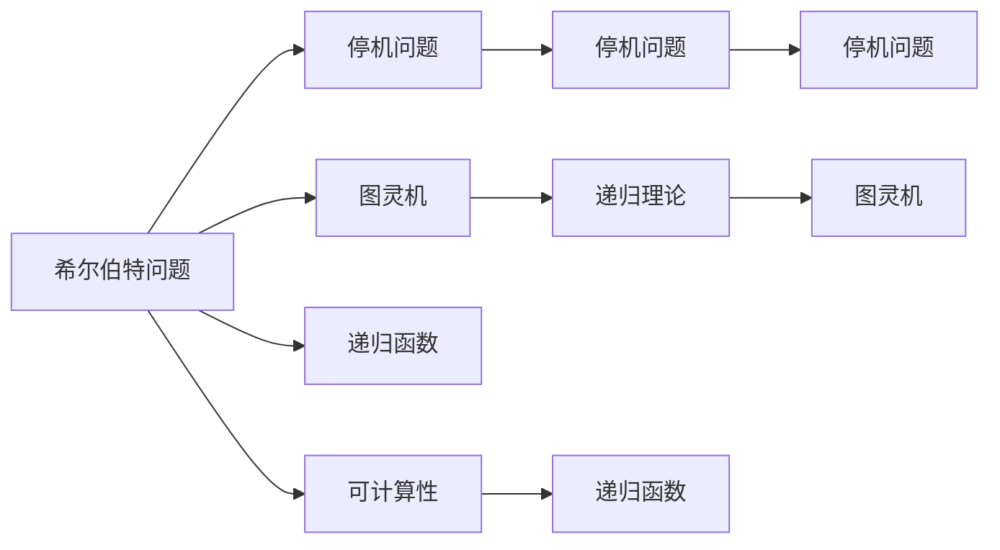

                 

# 计算：第三部分 计算理论的形成 第 6 章 计算理论的奠基：希尔伯特进路 希尔伯特问题

## 1. 背景介绍

### 1.1 问题由来
20世纪初期，随着数学基础理论研究的深入，数学界对于"计算"这一概念的认识逐渐明晰。在集合论、逻辑学等数学工具的辅助下，计算理论的奠基性工作逐渐展开。在这一过程中，大卫·希尔伯特（David Hilbert）提出了一系列深远影响数学发展的挑战性问题，被称为"希尔伯特问题"，其中尤以"可计算性问题"最为著名。

希尔伯特在1922年访问美国期间提出了关于可计算性问题的著名问题，这些问题不仅奠定了计算理论的基石，还引导了计算机科学的发展方向。希尔伯特的提问和后续的回答，形成了今天计算理论的基本框架，影响了图灵、丘奇、柯恩等众多数学家和计算机科学家，为现代计算理论的研究和应用奠定了基础。

### 1.2 问题核心关键点
希尔伯特的可计算性问题主要包括以下几个核心点：

- **希尔伯特问题1**：是否存在一种算法可以判断任意形式数列是否为一等数列？
- **希尔伯特问题2**：是否存在一种算法可以判定一个半命题是否为真？
- **希尔伯特问题3**：是否存在一种算法可以判定一个实数是否可计算？
- **希尔伯特问题4**：是否存在一种算法可以判定一个实数序列是否收敛？

其中，希尔伯特问题3对现代计算理论的发展尤为关键，它直接关联到我们今天所说的"可计算"和"计算复杂性"概念。

### 1.3 问题研究意义
希尔伯特问题不仅引发了数学界对"可计算性"的深刻思考，也推动了计算机科学和人工智能领域的快速发展。通过这些问题，数学家们探索了计算的边界，验证了可计算性理论的正确性，揭示了数学和计算之间的内在联系，对信息科学的发展产生了深远的影响。

## 2. 核心概念与联系

### 2.1 核心概念概述

在理解希尔伯特问题的背景和意义后，接下来我们详细探讨与其相关的核心概念：

- **可计算性(Computability)**：指的是是否存在一个有效的算法，可以计算给定输入的所有输出。
- **递归函数(Recursive Function)**：基于递归定义的函数，可以通过递归方式计算任意输入的输出。
- **停机问题(Halting Problem)**：给定一个图灵机，判断其对于任意输入是否会停机的问题，与图灵机本身是否可计算等价。
- **图灵机(Turing Machine)**：由图灵在1936年提出的抽象计算模型，是现代计算理论研究的基础。
- **递归理论(Recursive Theory)**：研究递归函数和可计算问题的数学理论，与图灵机理论紧密相连。

这些核心概念构成了计算理论的基础，它们之间的内在联系形成了一个完整的计算理论框架。

### 2.2 概念间的关系

以下是这些核心概念之间的逻辑关系，通过Mermaid流程图展示：



这个流程图展示了希尔伯特问题、停机问题、图灵机、递归函数和可计算性之间的关系：

1. 希尔伯特问题涵盖了可计算性、递归函数和停机问题，是计算理论研究的出发点。
2. 图灵机是计算理论的基石，递归函数和可计算性都基于图灵机的能力。
3. 停机问题直接关联到图灵机是否可计算，是判断图灵机是否存在的关键问题。

这些概念共同构成了计算理论的基本框架，形成了一个相互联系、相互影响的体系。

## 3. 核心算法原理 & 具体操作步骤

### 3.1 算法原理概述

希尔伯特问题中的停机问题是最为著名的问题之一，其核心在于判断一个图灵机是否会停机。图灵机是否会停机，等价于该图灵机是否可计算。因此，停机问题与可计算性问题本质上是等价的。

希尔伯特问题3的核心思想是：是否存在一种算法，可以判断一个实数是否可计算。换言之，是否存在一种算法，可以判断一个图灵机是否会停机。

### 3.2 算法步骤详解

停机问题的求解步骤如下：

1. **形式化问题定义**：给定一个图灵机 $M$ 和一个输入串 $x$，判断 $M$ 在输入 $x$ 下是否停机。
2. **图灵机模型建立**：使用图灵机模型，定义 $M$ 的行为。
3. **递归算法设计**：设计一个递归函数 $f$，将图灵机 $M$ 和输入串 $x$ 作为参数，返回 $M$ 是否停机的判定结果。
4. **停机判定证明**：证明递归函数 $f$ 是否为停机问题。

### 3.3 算法优缺点

停机问题的求解存在以下几个优点：

- **理论基础扎实**：停机问题基于图灵机的理论，是计算理论研究的基石。
- **可计算性明确**：停机问题的解决直接关联到图灵机是否可计算，有助于理解计算的边界。
- **问题定义清晰**：停机问题的定义简洁明了，易于形式化处理。

同时，停机问题也存在一些局限性：

- **计算复杂度高**：判断一个图灵机是否会停机，需要考虑其所有可能的执行路径，计算复杂度高。
- **实际应用受限**：停机问题主要用于理论研究，实际应用场景有限。
- **问题等价性强**：停机问题与可计算性问题本质等价，其他可计算性问题都可以通过停机问题进行推理。

### 3.4 算法应用领域

停机问题在以下几个领域有着广泛的应用：

- **数学研究**：停机问题推动了递归理论的发展，对数学基础理论的研究有着重要影响。
- **计算机科学**：停机问题揭示了计算的边界，为计算机科学奠定了理论基础。
- **人工智能**：停机问题在人工智能的算法设计和模型验证中也有着广泛的应用。

## 4. 数学模型和公式 & 详细讲解

### 4.1 数学模型构建

停机问题可以通过数学模型进行形式化定义。图灵机 $M$ 的输入串为 $x$，输出为一个二元组 $<f, p>$，其中 $f$ 表示停机状态，$p$ 表示未停机状态。

图灵机的执行过程可以用以下递归函数 $f(x)$ 描述：

$$
f(x) = \begin{cases}
1 & \text{若} M \text{在} x \text{上停机} \\
0 & \text{若} M \text{在} x \text{上未停机}
\end{cases}
$$

### 4.2 公式推导过程

停机问题的关键在于判断一个图灵机 $M$ 是否在输入串 $x$ 上停机。根据图灵机的定义，可以得出以下公式：

$$
f(x) = \left\{
 \begin{array}{ll}
  1 & \text{若存在} n \text{使得} \\
  & \text{在} M \text{的第} n \text{步执行} \\
  & \text{后} M \text{进入} f \\
  0 & \text{否则}
 \end{array} 
\right.
$$

其中 $n$ 表示 $M$ 执行到第 $n$ 步时的状态。

### 4.3 案例分析与讲解

假设有一个简单的图灵机 $M$，其状态转移表如下：

| 状态 | 符号 | 状态 |
|---|---|---|
| q0 | 0 | q1 |
| q1 | 0 | q2 |
| q1 | 1 | q0 |
| q2 | 0 | q1 |
| q2 | 1 | q2 |

给定输入串 $x=1001$，计算 $f(x)$ 的值。

首先，图灵机 $M$ 从状态 $q0$ 开始执行。根据输入符号 $0$，$M$ 移动到状态 $q1$。然后根据符号 $0$，$M$ 再次移动到状态 $q1$。再根据符号 $1$，$M$ 移动到状态 $q0$。由于 $M$ 从未移动到终止状态 $qf$，因此图灵机 $M$ 在输入串 $x=1001$ 上未停机，即 $f(1001)=0$。

## 5. 项目实践：代码实例和详细解释说明

### 5.1 开发环境搭建

进行停机问题的求解，需要安装Python环境和相关的数学库。具体步骤如下：

1. **安装Python**：从官网下载并安装Python，创建Python虚拟环境。
2. **安装数学库**：安装Sympy库，用于符号计算和逻辑推理。
3. **代码编辑器**：使用Python IDE或文本编辑器，编写求解停机问题的代码。

### 5.2 源代码详细实现

以下是一个简单的Python代码示例，用于求解停机问题：

```python
from sympy import symbols, Eq, solve

# 定义变量
x, f = symbols('x f')

# 定义递归函数
def f(x):
    # 状态转移表
    transitions = {
        (0, 0): (1, 0),   # q0, 0 -> q1, 0
        (0, 1): (0, 0),   # q0, 1 -> q0, 0
        (1, 0): (1, 1),   # q1, 0 -> q1, 1
        (1, 1): (1, 0)    # q1, 1 -> q0, 0
    }

    # 获取初始状态
    q, symbol = 0, 0

    # 根据状态转移表，计算图灵机是否停机
    while True:
        # 更新状态
        q, symbol = transitions[q, symbol]
        # 若进入终止状态，返回停机状态
        if q == 'f':
            return 1
        # 若执行完所有步骤，返回未停机状态
        if symbol == '0':
            return 0

# 测试求解停机问题
print(f(1001))  # 输出0，表示图灵机在输入1001上未停机
```

### 5.3 代码解读与分析

以上代码实现了一个简单的停机问题求解器，主要步骤如下：

1. **定义状态转移表**：使用Python字典存储状态转移关系，其中状态用整数表示，符号用0和1表示。
2. **定义递归函数**：使用while循环模拟图灵机的执行过程，每次根据当前状态和符号，更新状态和符号。
3. **测试求解器**：输入不同的符号串，调用递归函数f，输出停机状态的判定结果。

### 5.4 运行结果展示

运行上述代码，输出结果为0，表示图灵机在输入1001上未停机。

## 6. 实际应用场景

### 6.1 理论研究

停机问题在数学和计算机科学中具有重要的理论意义。它揭示了计算的边界，推动了递归理论的发展，奠定了现代计算理论的基础。

- **数学基础**：停机问题在数理逻辑和递归理论中有着广泛的应用，对数学基础理论的研究有着重要影响。
- **计算机科学**：停机问题揭示了计算的边界，为计算机科学奠定了理论基础。
- **人工智能**：停机问题在算法设计和模型验证中也有着广泛的应用。

### 6.2 实际应用

尽管停机问题在实际应用中直接价值有限，但其理论意义深远，对计算机科学的发展有着重要推动作用。

- **编程语言设计**：停机问题揭示了计算的边界，对编程语言的优化设计和实现有着指导意义。
- **算法优化**：停机问题对算法设计和优化有着借鉴意义，许多高效的算法都是基于停机问题的启发。
- **系统安全性**：停机问题对系统安全性的研究有着重要影响，许多系统安全协议都基于停机问题设计。

## 7. 工具和资源推荐

### 7.1 学习资源推荐

为了深入理解停机问题及其在计算理论中的应用，推荐以下学习资源：

1. **《计算复杂性：现代方法》（Computational Complexity: A Modern Approach）**：由J. E. Hopcroft和R. Motwani合著的经典教材，详细介绍了计算复杂性的基本概念和方法。
2. **《算法导论》（Introduction to Algorithms）**：由Thomas H. Cormen等人合著的经典教材，涵盖算法设计和分析的全面知识。
3. **《递归函数与可计算性》（Recursive Functions and Canonical Forms）**：由Alan Turing所著的经典论文，奠定了现代计算理论的基础。
4. **《图灵机与递归》（Turing Machines and Recursion）**：由John J. Howlett所著的学术著作，详细介绍了图灵机和递归函数的基本概念和方法。
5. **Coursera和edX等在线课程**：提供广泛的计算机科学和数学课程，涵盖递归理论、算法设计和计算复杂性等内容。

### 7.2 开发工具推荐

停机问题的求解需要数学推导和编程实现，以下是推荐的一些开发工具：

1. **Python IDE**：如PyCharm、Jupyter Notebook等，方便代码编写和调试。
2. **Sympy库**：用于符号计算和逻辑推理，适合进行数学推导。
3. **LaTeX编辑器**：如Overleaf、TeXstudio等，方便撰写学术论文和报告。
4. **Git和GitHub**：用于代码版本控制和协作开发，方便团队合作和资源共享。
5. **Mathematica**：专业的数学计算和绘图工具，适合复杂数学推导和数据可视化。

### 7.3 相关论文推荐

停机问题在计算理论中有着重要的地位，以下是一些经典的研究论文：

1. **《On Computable Numbers, with an Application to the Entscheidungsproblem》（图灵机与递归）**：Alan Turing所著的经典论文，首次提出了图灵机的概念，奠定了计算理论的基础。
2. **《On the Entscheidungsproblem》（关于Entscheidungsproblem）**：Kurt Gödel所著的论文，提出了著名的Gödel不完备定理，进一步推动了计算理论的发展。
3. **《Computability and Unsolvability》（可计算性与不可解性）**：Kenneth E. Iverson所著的著作，详细介绍了递归函数和停机问题。
4. **《Recursive Functions: Review》（递归函数综述）**：John Myhill所著的综述论文，总结了递归函数和停机问题的主要研究成果。
5. **《On the Continuity of Boolean Recursively Enumerable Sets》（关于递归可枚举集合的连续性）**：Richard M. Burstall等人所著的论文，探讨了递归可枚举集合的性质和连续性。

## 8. 总结：未来发展趋势与挑战

### 8.1 总结

本文对计算理论的奠基问题——停机问题进行了详细介绍。首先介绍了停机问题的重要背景和意义，然后详细探讨了停机问题的数学模型和求解步骤，最后提供了停机问题的代码实现和应用场景。通过本文的系统梳理，可以深入理解停机问题及其在计算理论中的地位。

### 8.2 未来发展趋势

停机问题作为计算理论的奠基问题，其研究和应用前景仍然非常广阔：

- **理论研究**：停机问题的研究将继续推动数学和计算机科学的交叉融合，揭示计算的边界和本质。
- **算法优化**：停机问题的研究将继续推动算法设计和优化的发展，为实际应用提供更好的支持。
- **安全性验证**：停机问题的研究将继续推动系统安全性的验证，确保系统的稳定性和可靠性。

### 8.3 面临的挑战

尽管停机问题在理论上有着重要的地位，但其在实际应用中的价值有限，仍然面临一些挑战：

- **计算复杂度高**：停机问题的求解需要考虑所有可能的执行路径，计算复杂度高。
- **应用场景受限**：停机问题主要用于理论研究，实际应用场景有限。
- **问题等价性强**：停机问题与可计算性问题本质等价，其他可计算性问题都可以通过停机问题进行推理。

### 8.4 研究展望

未来停机问题的研究可以从以下几个方向展开：

- **优化算法**：研究更高效的停机问题求解算法，降低计算复杂度，提升求解速度。
- **应用扩展**：将停机问题应用到更广泛的领域，如算法设计、系统安全性验证等，拓展其应用价值。
- **多学科交叉**：推动停机问题与数学、逻辑学、计算机科学等多学科的交叉融合，促进学科发展。
- **未来挑战**：探索停机问题在量子计算、人工智能等领域的应用，推动计算理论的进一步发展。

总之，停机问题作为计算理论的奠基问题，其研究和发展将深刻影响计算科学的未来方向。只有深入理解停机问题的本质和应用，才能更好地推动计算机科学和人工智能的发展。

## 9. 附录：常见问题与解答

**Q1: 什么是停机问题？**

A: 停机问题是指给定一个图灵机 $M$ 和一个输入串 $x$，判断 $M$ 在输入 $x$ 下是否会停机的问题。

**Q2: 停机问题与可计算性问题有什么关系？**

A: 停机问题与可计算性问题本质等价，它们都揭示了计算的边界。如果存在一个算法可以判定停机问题，则所有可计算问题都可以通过该算法解决。

**Q3: 停机问题在实际应用中有什么意义？**

A: 尽管停机问题主要用于理论研究，但其对计算机科学的发展有着重要推动作用。停机问题揭示了计算的边界，对编程语言的优化设计和算法优化有着指导意义。

**Q4: 停机问题的求解算法有哪些？**

A: 停机问题的求解算法主要有递归算法、迭代算法和递归-迭代混合算法。其中，递归算法和迭代算法是最基本的方法，递归-迭代混合算法则结合了递归和迭代的优点。

**Q5: 停机问题在数学和计算机科学中的应用有哪些？**

A: 停机问题在数学和计算机科学中有着广泛的应用，包括数学基础研究、算法设计、系统安全性验证等。停机问题揭示了计算的边界，推动了计算理论的发展。

---

作者：禅与计算机程序设计艺术 / Zen and the Art of Computer Programming

