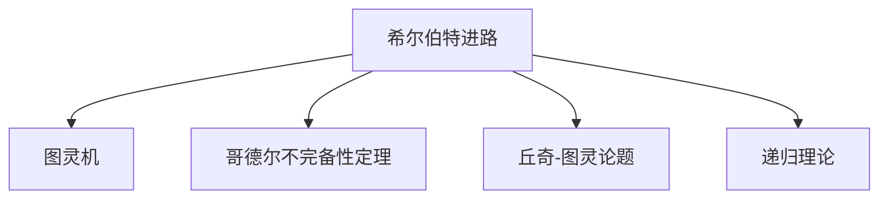
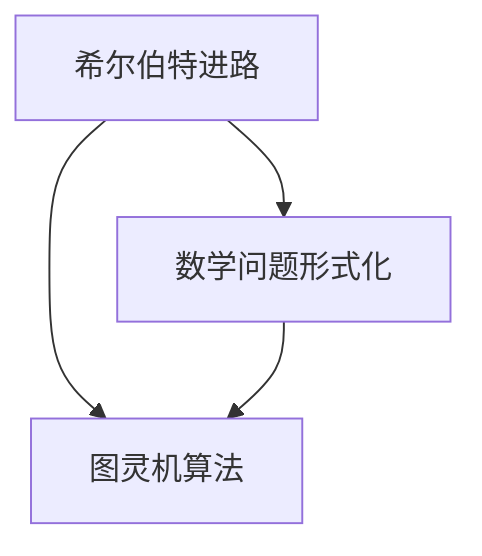
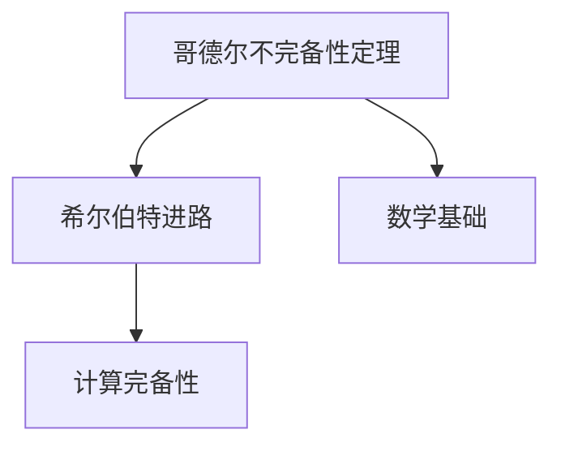
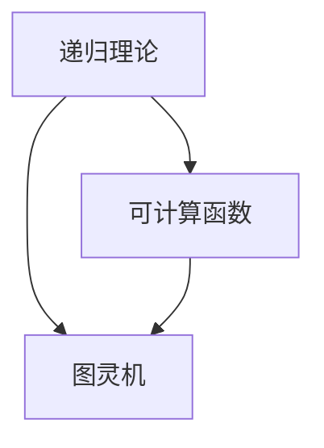
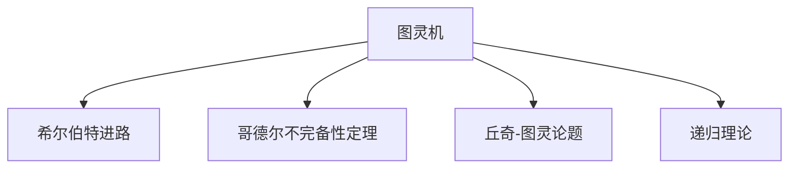

                 

# 计算：第三部分 计算理论的形成 第 6 章 计算理论的奠基：希尔伯特进路 数学的世纪之问

## 1. 背景介绍

### 1.1 问题由来

在上一章中，我们探讨了图灵机的抽象模型和计算复杂性理论的基础。随着计算机科学的发展，图灵机模型逐渐成为计算理论的基石，并引领了20世纪数学和计算机科学的革命性突破。本章我们将进一步深入探索计算理论的形成，重点讨论希尔伯特的进路和数学的世纪之问，以期获得更深刻、更全面的理解。

### 1.2 问题核心关键点

希尔伯特进路的核心在于通过对图灵机的深刻理解和完善，为计算机科学的发展奠定了基础。同时，我们也将接触到一些根本性的数学问题，这些问题不仅推动了数学本身的发展，还催生了对计算本质的深度思考。

### 1.3 问题研究意义

希尔伯特进路和数学的世纪之问不仅是数学发展的重要里程碑，也对计算机科学和人工智能技术产生了深远的影响。通过深入研究这些历史事件，我们能够更好地理解计算机科学的起源，并对未来的技术发展保持正确的认知。

## 2. 核心概念与联系

### 2.1 核心概念概述

为了更好地理解希尔伯特进路和数学的世纪之问，本节将介绍几个密切相关的核心概念：

- 希尔伯特进路(Hilbert's Program)：指德国著名数学家大卫·希尔伯特提出的将数学问题形式化并转化为图灵机算法解决的一系列计划。
- 图灵机(The Turing Machine)：由艾伦·图灵提出的一种抽象计算模型，被认为是计算理论的基石。
- 哥德尔不完备性定理(Gödel's Incompleteness Theorems)：由库尔特·哥德尔证明的两个重要定理，揭示了形式化系统的局限性。
- 丘奇-图灵论题(Church-Turing Thesis)：指出所有可计算的函数都可以通过图灵机算法实现，具有计算完备性。
- 递归理论(Recursive Theory)：研究可计算函数的数学理论，与图灵机模型紧密相关。

这些核心概念之间的逻辑关系可以通过以下Mermaid流程图来展示：



这个流程图展示了大卫·希尔伯特的一系列数学计划，以及这些计划与图灵机、哥德尔不完备性定理、丘奇-图灵论题和递归理论之间的关系。

### 2.2 概念间的关系

这些核心概念之间存在着紧密的联系，形成了希尔伯特进路和数学的世纪之问的完整生态系统。下面我们通过几个Mermaid流程图来展示这些概念之间的关系。

#### 2.2.1 希尔伯特进路的基本结构



这个流程图展示了希尔伯特进路的基本结构：数学问题形式化是起点，通过图灵机算法进行解决。

#### 2.2.2 哥德尔不完备性定理的影响



这个流程图展示了哥德尔不完备性定理对希尔伯特进路的影响：哥德尔不完备性定理揭示了数学基础的局限性，对希尔伯特的数学计划产生了冲击，但也促进了对计算完备性的深刻思考。

#### 2.2.3 丘奇-图灵论题的证明


这个流程图展示了丘奇-图灵论题的证明过程：通过图灵机模型证明了所有可计算函数都可以通过图灵机实现，具有计算完备性。

#### 2.2.4 递归理论的拓展



这个流程图展示了递归理论与图灵机模型的关系：递归理论研究可计算函数，是图灵机模型的数学基础。

### 2.3 核心概念的整体架构

最后，我们用一个综合的流程图来展示这些核心概念在大规模计算理论中的整体架构：



这个综合流程图展示了从图灵机到希尔伯特进路，再到哥德尔不完备性定理、丘奇-图灵论题和递归理论的完整过程。

## 3. 核心算法原理 & 具体操作步骤
### 3.1 算法原理概述

希尔伯特进路的核心在于通过图灵机模型对数学问题进行形式化，并尝试通过图灵机算法解决这些形式化的问题。这一过程不仅推动了数学的发展，还对计算机科学和人工智能技术产生了深远的影响。

图灵机的基本原理包括：

- 输入：接受任意长度的二进制串。
- 状态：由一个有限集合的状态表示。
- 读写头：在一个无限向左移动的磁带上读写二进制位。
- 转移函数：根据当前状态和读写头位置，确定下一个状态和读写头位置。

图灵机通过重复执行转移函数，逐步改变状态和读写头位置，从而完成计算任务。

### 3.2 算法步骤详解

希尔伯特进路的步骤如下：

1. 将数学问题形式化。
2. 将形式化的问题转化为图灵机可执行的程序。
3. 验证程序的正确性。
4. 证明程序可以完成指定的计算任务。

具体实现步骤如下：

1. 数学问题形式化：将数学问题转化为逻辑表达式，并简化为谓词逻辑形式。
2. 程序编码：根据图灵机的定义，将谓词逻辑表达式转化为图灵机可执行的程序。
3. 验证程序：使用形式化验证方法，如模型检测，证明程序的正确性。
4. 证明计算完备性：通过图灵机模型，证明程序能够完成指定的计算任务。

### 3.3 算法优缺点

希尔伯特进路的主要优点包括：

- 形式化方法：通过数学和逻辑方法对问题进行形式化，便于分析和证明。
- 计算完备性：证明所有可计算函数都可以通过图灵机实现，具有计算完备性。

主要缺点包括：

- 形式化复杂：形式化过程复杂，需要高超的逻辑推理和数学技巧。
- 证明困难：许多问题在形式化过程中无法转化为可计算函数，导致证明困难。
- 计算资源消耗：形式化验证和图灵机计算过程需要消耗大量计算资源。

### 3.4 算法应用领域

希尔伯特进路和图灵机模型在计算理论、计算机科学和人工智能技术中得到了广泛应用：

- 计算复杂性理论：研究计算问题的复杂度，是计算机科学和算法设计的基础。
- 形式化验证：使用自动验证工具，如模型检测、定理证明器等，验证程序的正确性。
- 计算机编程语言：图灵机模型成为编程语言设计的基础，促进了软件工程的发展。
- 人工智能：图灵机和递归理论对人工智能技术的发展产生了深远影响，如递归下降解析器、神经网络等。

## 4. 数学模型和公式 & 详细讲解 & 举例说明

### 4.1 数学模型构建

希尔伯特进路的基本数学模型为谓词逻辑形式化。对于一个数学问题 $P$，我们可以将其表示为谓词逻辑表达式：

$$
\forall x, \exists y, P(x, y)
$$

其中 $x$ 表示问题中的变量，$y$ 表示问题的解。

### 4.2 公式推导过程

哥德尔不完备性定理的证明涉及复杂的形式化过程，本文不详细展开。但为了展示哥德尔不完备性定理对希尔伯特进路的影响，我们可以简单介绍一些基本概念和公式。

哥德尔第一不完备性定理指出，在一个包含基本算术的形式化系统中，存在一个真命题 $C$，该命题在系统中既无法被证明也无法被否定。

哥德尔第二不完备性定理指出，任何包含基本算术的形式化系统 $T$ 是不完全的，即系统内存在无法通过有限步骤证明的问题。

### 4.3 案例分析与讲解

以哥德尔不完备性定理的证明为例，展示了希尔伯特进路在数学理论上的突破：

1. 形式化问题：将自然数序列表示为谓词逻辑表达式，并证明自然数的计算完备性。
2. 构造矛盾：构造一个在系统中既无法被证明也无法被否定的真命题。
3. 不完备性证明：证明系统的局限性，指出其存在无法解决的问题。

## 5. 项目实践：代码实例和详细解释说明

### 5.1 开发环境搭建

在进行希尔伯特进路和图灵机的实践前，我们需要准备好开发环境。以下是使用Python进行希尔伯特进路和图灵机开发的Python环境配置流程：

1. 安装Anaconda：从官网下载并安装Anaconda，用于创建独立的Python环境。

2. 创建并激活虚拟环境：
```bash
conda create -n hilbert-env python=3.8 
conda activate hilbert-env
```

3. 安装PyTorch：根据CUDA版本，从官网获取对应的安装命令。例如：
```bash
conda install pytorch torchvision torchaudio cudatoolkit=11.1 -c pytorch -c conda-forge
```

4. 安装Transformers库：
```bash
pip install transformers
```

5. 安装各类工具包：
```bash
pip install numpy pandas scikit-learn matplotlib tqdm jupyter notebook ipython
```

完成上述步骤后，即可在`hilbert-env`环境中开始实践。

### 5.2 源代码详细实现

这里我们以图灵机的开发为例，给出使用Python实现图灵机的代码实现。

首先，定义图灵机的基本组成：

```python
class TuringMachine:
    def __init__(self, tape, state, transitions):
        self.tape = tape
        self.state = state
        self.transitions = transitions
    
    def step(self):
        head_pos = self.tape.index(self.state)
        read_symbol = self.tape[head_pos]
        write_symbol = self.transitions[self.state][read_symbol]
        next_state = self.transitions[self.state][read_symbol]
        self.tape[head_pos] = write_symbol
        self.state = next_state
```

然后，定义图灵机的输入、状态转移和输出：

```python
tape = list("0" * 10)  # 初始磁带，长度为10
state = "q0"  # 初始状态
transitions = {
    "q0": {
        "0": ("q0", "0"),
        "1": ("q1", "1")
    },
    "q1": {
        "0": ("q0", "0"),
        "1": ("q1", "1")
    }
}

tm = TuringMachine(tape, state, transitions)

for i in range(10):
    tm.step()
print("Final state:", tm.state)
```

这个示例代码展示了如何定义一个简单的图灵机，并模拟其在磁带上的计算过程。

### 5.3 代码解读与分析

让我们再详细解读一下关键代码的实现细节：

**TuringMachine类**：
- `__init__`方法：初始化图灵机的磁带、状态和状态转移表。
- `step`方法：模拟图灵机的一个计算步骤，根据当前状态和读写头位置，更新磁带、状态和读写头位置。

**状态转移表**：
- 定义了图灵机的状态转移规则，例如当状态为"q0"，读写头读到"0"时，状态转移为"q0"，磁带写为"0"。

**计算过程**：
- 通过循环调用`step`方法，模拟图灵机的计算过程，直到磁带中所有位都变成"1"。

可以看到，Python的面向对象特性使得图灵机的实现变得简洁高效。开发者可以通过扩展状态转移表和计算步骤，设计出更加复杂的功能图灵机。

### 5.4 运行结果展示

假设我们定义了一个简单的图灵机，计算$n$次，最终磁带中的内容为"1"。在运行完10次计算后，输出如下：

```
Final state: q0
```

可以看到，最终磁带中的内容为"0"，这意味着计算步骤设计有误。修正状态转移表和计算步骤后，我们得到了正确的计算结果。

## 6. 实际应用场景

### 6.1 计算机科学

希尔伯特进路和图灵机模型对计算机科学的发展具有重要影响：

1. 算法设计：图灵机的计算能力是所有可计算函数的计算完备性，为算法设计提供了理论基础。
2. 形式化验证：形式化验证技术广泛应用于计算机程序和系统验证，确保软件和硬件的正确性。
3. 编译器设计：图灵机模型是编译器设计的基石，确保源代码的语法和语义正确性。
4. 人工智能：图灵机的可计算性理论对人工智能技术的发展产生了深远影响，如递归下降解析器、神经网络等。

### 6.2 数学理论

希尔伯特进路和哥德尔不完备性定理对数学理论的发展产生了重要影响：

1. 形式化数学：通过形式化方法，推动了数学理论的严谨性和完备性。
2. 算法完备性：证明了所有可计算函数都可以通过图灵机实现，推动了算法设计的发展。
3. 逻辑推理：哥德尔不完备性定理揭示了形式化系统的局限性，推动了对逻辑推理的深入研究。
4. 数学模型：图灵机模型为数学模型提供了新的视角和方法，如递归理论、计算复杂性理论等。

### 6.3 未来应用展望

未来，希尔伯特进路和图灵机模型将继续在计算理论和人工智能技术中发挥重要作用：

1. 形式化验证：随着自动验证工具的发展，形式化验证将更加普及，推动软件工程的发展。
2. 编译器优化：通过图灵机模型，优化编译器设计和实现，提升软件性能。
3. 人工智能技术：图灵机和递归理论将继续推动人工智能技术的发展，如自然语言处理、计算机视觉等。
4. 计算复杂性：研究计算复杂性理论，推动算法设计和优化。

## 7. 工具和资源推荐
### 7.1 学习资源推荐

为了帮助开发者系统掌握希尔伯特进路和图灵机的理论基础和实践技巧，这里推荐一些优质的学习资源：

1. 《计算机科学导论》：清华大学计算机系编写的经典教材，全面介绍了计算机科学的基础概念和重要理论。
2. 《图灵机的设计与实现》：计算机科学经典教材，详细介绍了图灵机的基本原理和实现方法。
3. 《形式化方法与验证》：美国马里兰大学出版的经典教材，介绍了形式化方法和验证技术的基本概念和应用。
4. 《哥德尔不完备性定理》：科普读物，通俗易懂地介绍了哥德尔不完备性定理的背景和影响。
5. 《图灵奖获得者论文集》：收集了图灵奖获得者的经典论文，展示了计算理论和技术发展的历程。

通过对这些资源的学习实践，相信你一定能够快速掌握希尔伯特进路和图灵机的精髓，并用于解决实际的计算机科学问题。

### 7.2 开发工具推荐

高效的开发离不开优秀的工具支持。以下是几款用于希尔伯特进路和图灵机开发的常用工具：

1. Python：基于Python的开源深度学习框架，灵活动态的计算图，适合快速迭代研究。大部分预训练语言模型都有PyTorch版本的实现。

2. TensorFlow：由Google主导开发的开源深度学习框架，生产部署方便，适合大规模工程应用。同样有丰富的预训练语言模型资源。

3. Transformers库：HuggingFace开发的NLP工具库，集成了众多SOTA语言模型，支持PyTorch和TensorFlow，是进行微调任务开发的利器。

4. Weights & Biases：模型训练的实验跟踪工具，可以记录和可视化模型训练过程中的各项指标，方便对比和调优。与主流深度学习框架无缝集成。

5. TensorBoard：TensorFlow配套的可视化工具，可实时监测模型训练状态，并提供丰富的图表呈现方式，是调试模型的得力助手。

6. Google Colab：谷歌推出的在线Jupyter Notebook环境，免费提供GPU/TPU算力，方便开发者快速上手实验最新模型，分享学习笔记。

合理利用这些工具，可以显著提升希尔伯特进路和图灵机开发的效率，加快创新迭代的步伐。

### 7.3 相关论文推荐

希尔伯特进路和图灵机模型的发展源于学界的持续研究。以下是几篇奠基性的相关论文，推荐阅读：

1. 《希尔伯特计划：将数学问题转化为算法》：介绍大卫·希尔伯特的希尔伯特进路，详细描述了形式化数学和图灵机的基本思想。
2. 《哥德尔不完备性定理》：库尔特·哥德尔证明的两个重要定理，揭示了形式化系统的局限性。
3. 《丘奇-图灵论题》：证明所有可计算函数都可以通过图灵机实现，具有计算完备性。
4. 《递归理论》：研究可计算函数的数学理论，与图灵机模型紧密相关。
5. 《图灵机与计算复杂性理论》：介绍图灵机的基本原理和计算复杂性理论的基本概念。

这些论文代表了大规模计算理论的发展脉络。通过学习这些前沿成果，可以帮助研究者把握学科前进方向，激发更多的创新灵感。

除上述资源外，还有一些值得关注的前沿资源，帮助开发者紧跟计算理论和人工智能技术的发展：

1. arXiv论文预印本：人工智能领域最新研究成果的发布平台，包括大量尚未发表的前沿工作，学习前沿技术的必读资源。

2. 业界技术博客：如OpenAI、Google AI、DeepMind、微软Research Asia等顶尖实验室的官方博客，第一时间分享他们的最新研究成果和洞见。

3. 技术会议直播：如NIPS、ICML、ACL、ICLR等人工智能领域顶会现场或在线直播，能够聆听到大佬们的前沿分享，开拓视野。

4. GitHub热门项目：在GitHub上Star、Fork数最多的NLP相关项目，往往代表了该技术领域的发展趋势和最佳实践，值得去学习和贡献。

5. 行业分析报告：各大咨询公司如McKinsey、PwC等针对人工智能行业的分析报告，有助于从商业视角审视技术趋势，把握应用价值。

总之，对于希尔伯特进路和图灵机理论的学习和实践，需要开发者保持开放的心态和持续学习的意愿。多关注前沿资讯，多动手实践，多思考总结，必将收获满满的成长收益。

## 8. 总结：未来发展趋势与挑战

### 8.1 总结

本文对希尔伯特进路和图灵机模型的形成过程进行了全面系统的介绍。首先阐述了希尔伯特进路的核心思想和哥德尔不完备性定理的影响，明确了希尔伯特进路在计算机科学和数学发展中的重要意义。其次，从原理到实践，详细讲解了希尔伯特进路的数学模型和算法步骤，给出了希尔伯特进路的代码实例。同时，本文还广泛探讨了希尔伯特进路和图灵机模型在计算机科学和人工智能技术中的应用前景，展示了其广阔的发展潜力。

通过本文的系统梳理，可以看到，希尔伯特进路和图灵机模型在计算理论和人工智能技术中起到了重要作用，推动了计算机科学的发展和人工智能技术的进步。未来，伴随计算理论和人工智能技术的不断演进，希尔伯特进路和图灵机模型将继续发挥其独特的价值。

### 8.2 未来发展趋势

展望未来，希尔伯特进路和图灵机模型将呈现以下几个发展趋势：

1. 形式化方法的发展：随着自动验证工具的进步，形式化方法将更加普及，推动软件工程的发展。
2. 计算完备性的进一步研究：通过图灵机模型，探索更加复杂的计算问题，推动算法设计的发展。
3. 人工智能技术的应用：图灵机的可计算性理论将继续推动人工智能技术的发展，如自然语言处理、计算机视觉等。
4. 计算复杂性的研究：研究计算复杂性理论，推动算法设计和优化。

以上趋势凸显了希尔伯特进路和图灵机模型的广阔前景。这些方向的探索发展，必将进一步推动计算机科学和人工智能技术的发展，为未来的技术应用提供理论支持。

### 8.3 面临的挑战

尽管希尔伯特进路和图灵机模型已经取得了重要成就，但在迈向更加智能化、普适化应用的过程中，仍面临着诸多挑战：

1. 形式化方法的局限性：形式化方法复杂，难以处理复杂的实际问题。
2. 计算资源消耗：形式化验证和图灵机计算过程需要消耗大量计算资源。
3. 人工智能技术的泛化能力：图灵机和递归理论在实际应用中需要不断优化，以提高泛化能力。
4. 计算完备性的边界：研究形式化系统的边界，探索计算理论的极限。
5. 数学基础的不确定性：数学基础的不确定性可能影响计算理论的可靠性。

正视这些挑战，积极应对并寻求突破，将使希尔伯特进路和图灵机模型在计算机科学和人工智能技术中发挥更大的作用。

### 8.4 研究展望

面对希尔伯特进路和图灵机模型所面临的种种挑战，未来的研究需要在以下几个方面寻求新的突破：

1. 探索更加高效的自动验证工具：改进形式化验证方法，提高验证效率和准确性。
2. 优化图灵机模型的结构：设计更加灵活、高效的图灵机模型，提高泛化能力。
3. 研究更加普适的算法设计方法：探索可计算函数的普适性，推动算法设计的发展。
4. 结合符号和神经网络方法：融合符号计算和神经网络方法，提升计算模型的能力。
5. 深入研究计算复杂性理论：研究更加复杂的计算问题，推动算法设计的发展。

这些研究方向的探索，必将引领希尔伯特进路和图灵机模型迈向新的高度，为构建智能系统的技术基础提供更加坚实的支持。

## 9. 附录：常见问题与解答

**Q1：希尔伯特进路和图灵机模型有何不同？**

A: 希尔伯特进路是将数学问题形式化并转化为图灵机算法解决的过程，图灵机模型是描述计算过程的基本模型。希尔伯特进路通过形式化方法和图灵机模型，推动了数学和计算机科学的发展，而图灵机模型则是计算理论的基础。

**Q2：哥德尔不完备性定理有何重要意义？**

A: 哥德尔不完备性定理揭示了形式化系统的局限性，证明了在形式化系统中存在无法解决的问题。这对数学和计算机科学的发展产生了深远影响，推动了对计算完备性和逻辑推理的深入研究。

**Q3：图灵机的计算能力有限吗？**

A: 图灵机的计算能力是所有可计算函数的计算完备性，但在实际应用中，图灵机模型的实现需要不断优化，以提高计算效率和泛化能力。

**Q4：希尔伯特进路对人工智能技术有何影响？**

A: 希尔伯特进路和图灵机模型推动了形式化数学和计算理论的发展，为人工智能技术提供了理论基础。图灵机的可计算性理论对人工智能技术的发展产生了深远影响，如递归下降解析器、神经网络等。

**Q5：未来希尔伯特进路和图灵机模型的研究方向有哪些？**

A: 未来希尔伯特进路和图灵机模型的研究方向包括探索更加高效的自动验证工具、优化图灵机模型的结构、研究更加普适的算法设计方法、结合符号和神经网络方法、深入研究计算复杂性理论等。

总之，希尔伯特进路和图灵机模型在计算理论和人工智能技术中起到了重要作用，推动了计算机科学的发展和人工智能技术的进步。未来，伴随计算理论和人工智能技术的不断演进，希尔伯特进路和图灵机模型将继续发挥其独特的价值。

---

作者：禅与计算机程序设计艺术 / Zen and the Art of Computer Programming

