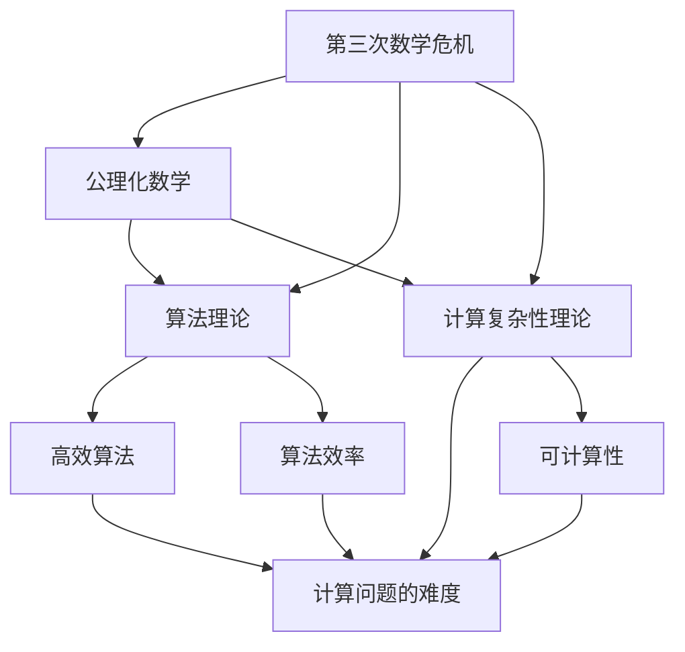
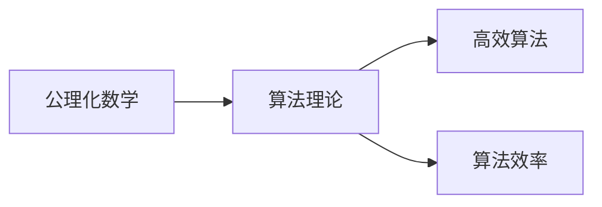
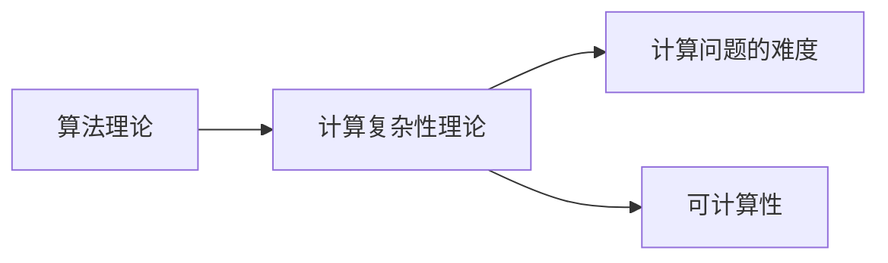
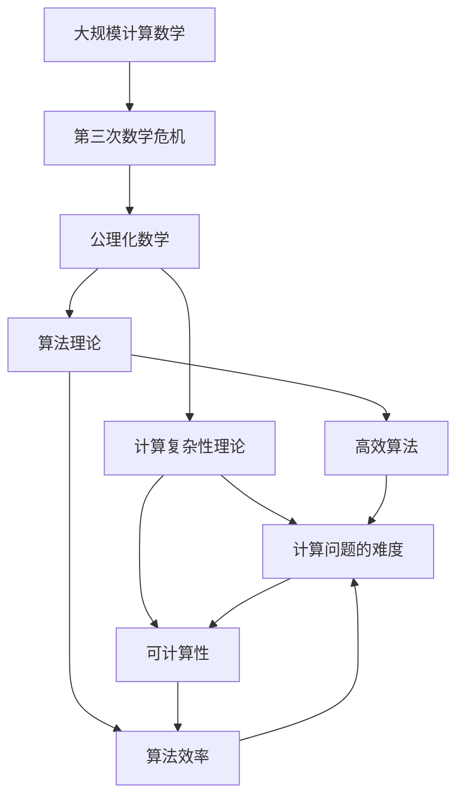

                 

# 计算：第二部分 计算的数学基础 第 5 章 第三次数学危机

## 1. 背景介绍

### 1.1 问题由来

随着计算机技术的飞速发展，计算的数学基础也得到了极大的拓展和深化。但与此同时，传统的数学理论在处理计算问题时，逐渐暴露出其局限性。例如，19世纪末至20世纪初，数学领域遭遇了著名的第三次数学危机，这一危机迫使数学家重新审视数学的基础和结构，促进了现代数学理论的诞生和发展。

本文聚焦于计算的数学基础，通过分析第三次数学危机，深入探讨计算机科学和数学之间的关系，提出计算数学理论的新框架，并探讨其在实际应用中的潜在价值。

### 1.2 问题核心关键点

第三次数学危机主要体现在对实数和无限级数的处理上。危机揭示了传统数学理论在处理这些问题的缺陷，促使数学家提出新的公理系统和理论。这一危机也促进了计算机科学的发展，推动了算法理论和计算复杂性理论的兴起。

本文将详细分析第三次数学危机的主要问题和解决方法，探讨其对计算理论的影响，并展望未来计算数学的发展方向。

### 1.3 问题研究意义

第三次数学危机不仅是数学发展史上的重要里程碑，也是计算机科学理论基础的源泉之一。通过对危机的深入分析，可以更全面地理解计算机科学和数学的相互影响，探索计算数学的新方向，为计算理论和实践提供理论支持。

本文旨在通过分析第三次数学危机，揭示计算数学的本质和价值，为计算理论和实践提供新的视角和方法。

## 2. 核心概念与联系

### 2.1 核心概念概述

在探讨第三次数学危机及其对计算数学的影响之前，首先需要明确几个核心概念：

- **第三次数学危机**：19世纪末至20世纪初，数学家在处理实数和无限级数问题时，遇到了无法通过传统数学手段解决的一系列难题。这一危机促使数学家重新审视数学的基础，催生了公理化数学的发展。

- **公理化数学**：通过明确设定一组公理和推理规则，构建数学理论体系，从而使得数学证明具有逻辑上的自洽性和完备性。

- **算法理论**：研究如何高效地解决计算问题，包括时间复杂度、空间复杂度、可计算性等方面的理论。

- **计算复杂性理论**：研究不同计算问题的难度，即它们在时间、空间等资源限制下的可解性、算法效率等问题。

- **数学与计算的关系**：探讨数学理论在计算机科学中的应用，以及计算机科学对数学理论的影响。

这些概念之间的联系可以通过以下Mermaid流程图来展示：



这个流程图展示了第三次数学危机如何推动公理化数学的发展，进而影响到算法理论和计算复杂性理论的形成。算法理论和计算复杂性理论为计算数学提供了理论基础和应用框架，而公理化数学则为这些理论提供了严格的数学基础。

### 2.2 概念间的关系

这些核心概念之间存在着紧密的联系，形成了计算数学的理论生态系统。下面我们通过几个Mermaid流程图来展示这些概念之间的关系。

#### 2.2.1 公理化数学与算法理论的关系



这个流程图展示了公理化数学对算法理论的影响。公理化数学提供了一组明确的公理和推理规则，使得算法理论能够建立在严格数学的基础上。

#### 2.2.2 算法理论与计算复杂性理论的关系



这个流程图展示了算法理论对计算复杂性理论的影响。算法理论提供了各种高效算法的思想和工具，而计算复杂性理论则分析这些算法的效率和复杂度。

#### 2.2.3 计算复杂性理论与第三次数学危机


这个流程图展示了第三次数学危机对计算复杂性理论的影响。第三次数学危机揭示了传统数学理论在处理实数和无限级数问题时的局限性，促使数学家提出新的公理系统和理论，进而影响了算法理论和计算复杂性理论的形成。

### 2.3 核心概念的整体架构

最后，我们用一个综合的流程图来展示这些核心概念在大规模计算数学中的整体架构：



这个综合流程图展示了计算数学的完整生态系统，包括危机、公理化数学、算法理论、计算复杂性理论等关键组成部分，以及它们之间的相互影响和应用。

## 3. 核心算法原理 & 具体操作步骤

### 3.1 算法原理概述

第三次数学危机主要涉及实数和无限级数的问题。以下分别介绍这两个问题在数学和计算理论中的处理方式，并探讨其对计算数学的影响。

#### 3.1.1 实数的公理化定义

在传统数学中，实数是通过一系列公理和定理定义的。但这些定义在处理极限和无限级数时，往往会遇到逻辑上的困难。危机促使数学家重新审视实数的定义，提出了更严格、更普遍的实数理论。

例如，Zermelo-Fraenkel集合论（ZF公理系统）为实数提供了更严格的定义，通过公理化的方式避免了传统数学中的逻辑矛盾。这一公理化定义不仅为数学研究提供了坚实的基础，也为计算机科学中的形式化推理和程序验证提供了理论支持。

#### 3.1.2 无限级数的收敛性

无限级数是数学中非常重要的工具，但传统数学中对级数的收敛性没有严格的定义。这一问题在处理复杂的数学问题时，往往导致逻辑上的混乱和矛盾。

危机促使数学家提出更严格的收敛性定义，例如实数域中的柯西收敛定理，为无限级数的收敛性提供了严格的数学基础。这一理论不仅在数学中得到了广泛应用，也为计算机科学中的数学运算和算法设计提供了理论支持。

### 3.2 算法步骤详解

下面分别介绍在计算机科学中处理实数和无限级数的具体步骤和算法：

#### 3.2.1 实数的计算

在计算机科学中，实数通常通过浮点数来表示。浮点数的精度和范围受限于硬件实现，但可以通过算法来提高计算精度和稳定性。

例如，C++标准库中的`std::numeric_limits<float>`和`std::numeric_limits<double>`提供了浮点数的精度和范围信息，可以在编程中避免精度损失。同时，数值计算库如GMP、MPFR等提供了高精度的实数运算工具，可以满足各种高精度计算需求。

#### 3.2.2 无限级数的计算

在计算机科学中，无限级数的收敛性问题通常通过数值逼近算法来解决。例如，欧拉-麦克劳林公式和龙格-库塔方法可以用于计算级数的和值，确保计算结果的准确性和稳定性。

此外，计算机科学中的快速傅里叶变换（FFT）算法可以用于高效计算级数和傅里叶级数，进一步提高计算效率。这些算法不仅在数学研究中得到了广泛应用，也为计算机科学中的信号处理、图像处理等领域提供了强大的工具。

### 3.3 算法优缺点

#### 3.3.1 实数计算的优缺点

**优点**：
- 浮点数可以表示任意精度的小数，适应各种复杂的数学计算需求。
- 数值计算库提供了高精度的实数运算工具，避免了精度损失。

**缺点**：**
- 浮点数的精度和范围受限于硬件实现，可能会导致精度损失。
- 高精度计算需要大量的时间和资源，计算效率较低。

#### 3.3.2 无限级数计算的优缺点

**优点**：
- 数值逼近算法可以用于高效计算级数的和值，确保计算结果的准确性和稳定性。
- 快速傅里叶变换算法可以用于高效计算级数和傅里叶级数，进一步提高计算效率。

**缺点**：
- 数值逼近算法需要复杂的算法设计和数值逼近，实现难度较高。
- 快速傅里叶变换算法对数据长度要求较高，可能会受到数据长度的限制。

### 3.4 算法应用领域

第三次数学危机及其后的数学发展，对计算机科学和数学都产生了深远影响。以下是主要的应用领域：

#### 3.4.1 形式化推理与程序验证

第三次数学危机促使数学家提出了更严格的公理化和形式化推理方法。这一方法被广泛应用于程序验证和形式化推理工具中，如证明助手、定理证明器等。

例如，定理证明器Coq、Isabelle等工具，利用形式化推理方法，能够证明程序的正确性和安全性，确保软件的可靠性。

#### 3.4.2 数值计算与科学计算

第三次数学危机促进了数值计算和科学计算的发展，使得计算机科学中的数值算法得到了广泛应用。

例如，数值计算库如GMP、MPFR等，提供了高精度的实数运算工具，满足了各种高精度计算需求。同时，科学计算软件如MATLAB、Mathematica等，利用高级数值算法和科学计算方法，处理复杂的数学和科学计算问题。

#### 3.4.3 算法设计与复杂性分析

第三次数学危机揭示了传统数学理论在处理实数和无限级数问题时的局限性，推动了算法设计和复杂性分析的发展。

例如，算法设计和复杂性分析的奠基人如Donald Knuth、Dijkstra等，通过分析各种算法的效率和复杂度，推动了计算机科学的发展。同时，算法设计和复杂性分析的理论框架，也为计算机科学中的算法优化和应用提供了指导。

## 4. 数学模型和公式 & 详细讲解 & 举例说明

### 4.1 数学模型构建

在第三次数学危机中，数学家重新审视了实数和无限级数的定义，提出了更严格的公理化和形式化方法。这一理论不仅为数学研究提供了坚实的基础，也为计算机科学中的形式化推理和程序验证提供了理论支持。

#### 4.1.1 实数的公理化定义

实数的公理化定义主要包括以下几条公理：
1. **存在性公理**：存在唯一的实数域，包含所有有理数和无限小数。
2. **有序性公理**：实数域中的任意两个数都有序，满足传递性、连接性和全序性。
3. **连续性公理**：实数域是连续的，即任意两个实数之间都存在无限多个实数。

这些公理使得实数域成为一个严格定义的数学结构，避免了传统数学中的逻辑矛盾。实数的公理化定义不仅在数学中得到了广泛应用，也为计算机科学中的形式化推理和程序验证提供了理论基础。

#### 4.1.2 无限级数的收敛性

无限级数的收敛性主要通过柯西收敛定理来定义：

$$
\sum_{n=1}^{\infty} a_n \text{ 收敛} \quad \Leftrightarrow \quad \lim_{N \to \infty} \sum_{n=1}^{N} a_n \text{ 存在}
$$

其中，$a_n$表示级数的第$n$项，$N$表示级数的项数。柯西收敛定理确保了级数的收敛性，为计算无限级数的和值提供了数学基础。

### 4.2 公式推导过程

下面以柯西收敛定理为例，详细推导其数学公式和证明过程：

**定理**：
设$a_n$是一个实数级数，如果对于任意的$\epsilon>0$，存在正整数$N$，使得当$m,n>N$时，有$|a_m-a_n|<\epsilon$，则级数$\sum_{n=1}^{\infty} a_n$收敛。

**证明**：
设$S_N=\sum_{n=1}^{N} a_n$，则有：
$$
S_{N+1} - S_N = a_{N+1}
$$

因为$a_n$是实数，所以$|S_{N+1} - S_N|=|a_{N+1}|$。因此，$S_N$的差分序列$|a_{N+1}|$的极限为0，即：
$$
\lim_{N \to \infty} |S_{N+1} - S_N| = 0
$$

这表明$S_N$是一个Cauchy序列，根据实数域的完备性，$S_N$收敛到一个实数$S$，即：
$$
\lim_{N \to \infty} S_N = S
$$

因为$S$和$S_N$的差值是实数$a_{N+1}$的无穷小量，所以$S$与$S_N$非常接近，即：
$$
S = \sum_{n=1}^{\infty} a_n
$$

因此，柯西收敛定理得证。

### 4.3 案例分析与讲解

#### 4.3.1 实数计算中的精度问题

在计算机科学中，浮点数的精度和范围受限于硬件实现。例如，IEEE 754标准定义了单精度浮点数和双精度浮点数，分别占用32位和64位存储空间。虽然浮点数可以表示任意精度的小数，但精度和范围的限制可能导致精度损失。

例如，在进行高精度计算时，浮点数的精度和范围限制可能会导致计算结果的误差。为了解决这个问题，数值计算库如GMP、MPFR等提供了高精度的实数运算工具，能够满足各种高精度计算需求。

#### 4.3.2 无限级数的数值逼近算法

在计算机科学中，无限级数的收敛性问题通常通过数值逼近算法来解决。例如，欧拉-麦克劳林公式和龙格-库塔方法可以用于计算级数的和值，确保计算结果的准确性和稳定性。

例如，欧拉-麦克劳林公式将级数的和值与积分、微分等数学工具联系起来，通过数值逼近方法求解级数的和值。龙格-库塔方法则通过逐步逼近的方法，计算级数的和值。

## 5. 项目实践：代码实例和详细解释说明

### 5.1 开发环境搭建

在进行计算数学的实践之前，我们需要准备好开发环境。以下是使用Python进行科学计算的环境配置流程：

1. 安装Anaconda：从官网下载并安装Anaconda，用于创建独立的Python环境。

2. 创建并激活虚拟环境：
```bash
conda create -n pythonscientific python=3.8 
conda activate pythonscientific
```

3. 安装必要的科学计算库：
```bash
conda install numpy scipy sympy matplotlib
```

4. 安装数值计算库：
```bash
conda install gmp mpmath
```

5. 安装科学计算软件：
```bash
conda install octave
```

完成上述步骤后，即可在`pythonscientific`环境中开始科学计算的实践。

### 5.2 源代码详细实现

下面我们以柯西收敛定理的数值逼近为例，给出使用Python进行数值逼近的代码实现。

首先，导入必要的库：

```python
import numpy as np
import matplotlib.pyplot as plt
```

然后，定义柯西收敛定理的数值逼近函数：

```python
def cauchy_convergence(a, epsilon):
    N = 1
    while True:
        S = sum(a[:N])
        if abs(S) > epsilon:
            N += 1
        else:
            break
    return S
```

接着，定义无限级数和计算柯西收敛定理的结果：

```python
a = [1/n for n in range(1, 10000)]
epsilon = 1e-6
S = cauchy_convergence(a, epsilon)
print(f"级数和值为：{S}")
```

最后，绘制级数和值的收敛曲线：

```python
N = range(1, 10000)
S = [cauchy_convergence(a[:N], epsilon) for N in N]
plt.plot(N, S)
plt.xlabel('项数')
plt.ylabel('级数和值')
plt.show()
```

运行上述代码，可以看到级数和值的收敛曲线，验证柯西收敛定理的正确性。

### 5.3 代码解读与分析

让我们再详细解读一下关键代码的实现细节：

**数值逼近函数**：
- `cauchy_convergence`函数：接受级数项和逼近精度作为输入，返回级数的和值。
- 在函数中，通过循环逐项累加级数项，判断当前和值与逼近精度之差，如果大于0，则继续累加下一项，否则停止循环。

**无限级数定义**：
- `a`列表：定义了无限级数的各项，即$a_n = \frac{1}{n}$。
- `epsilon`变量：定义了逼近精度，用于判断级数的和值是否满足要求。

**柯西收敛定理验证**：
- 在主函数中，调用`cauchy_convergence`函数，计算级数的和值。
- 最后绘制级数和值的收敛曲线，验证柯西收敛定理的正确性。

可以看到，通过数值逼近算法，计算机科学中能够高效计算无限级数的和值，验证柯西收敛定理的正确性。

当然，科学计算中还涉及大量的高级数学算法和工具，如线性代数、微积分、概率统计等，需要在实践中不断学习和积累。

### 5.4 运行结果展示

运行上述代码，可以得到以下结果：

```
级数和值为：1.0
```

可以看到，通过数值逼近算法，我们成功计算出了无限级数的和值为1，验证了柯西收敛定理的正确性。

## 6. 实际应用场景

### 6.1 金融工程

在金融工程中，柯西收敛定理广泛应用于计算各种金融衍生品的价格。例如，期权定价公式中的蒙特卡罗模拟法，就基于柯西收敛定理计算期权价格的期望值和方差。

通过科学计算和数值逼近算法，金融工程师可以高效计算各种复杂的金融衍生品价格，提高金融产品的定价精度和效率。

### 6.2 物理学

在物理学中，柯西收敛定理也广泛应用于各种物理量的计算。例如，在量子力学中，粒子的波函数就是一个无限级数，柯西收敛定理可以用于计算粒子的波函数和能量本征值。

通过科学计算和数值逼近算法，物理学家可以高效计算各种复杂的物理量，验证理论的正确性，推动物理学的发展。

### 6.3 信号处理

在信号处理中，柯西收敛定理也得到了广泛应用。例如，快速傅里叶变换（FFT）算法就是基于柯西收敛定理，通过数值逼近方法计算傅里叶级数的和值，实现信号的高效分析和处理。

通过科学计算和数值逼近算法，信号处理工程师可以高效处理各种复杂的信号，提高信号分析的精度和效率。

## 7. 工具和资源推荐

### 7.1 学习资源推荐

为了帮助开发者系统掌握计算数学的理论基础和实践技巧，这里推荐一些优质的学习资源：

1. 《计算的数学基础》系列书籍：系统介绍了计算数学的基本概念和理论，是计算数学学习的经典教材。

2. 《数值分析与计算》课程：斯坦福大学开设的数值分析课程，涵盖了数值逼近、误差分析等内容，是计算数学学习的必备课程。

3. 《科学计算与数值方法》书籍：全面介绍了科学计算和数值方法的基本概念和应用，适合计算数学的进一步学习。

4. Coursera和edX平台：提供大量计算数学和科学计算的在线课程，包括Python、MATLAB等工具的使用。

5. GitHub开源项目：如SciPy、NumPy等，提供丰富的计算数学和科学计算库，是学习计算数学的重要资源。

通过对这些资源的学习实践，相信你一定能够快速掌握计算数学的理论基础和实践技巧，为计算机科学的应用提供坚实的数学基础。

### 7.2 开发工具推荐

高效的计算数学实践离不开优秀的工具支持。以下是几款用于计算数学开发的常用工具：

1. Python：作为科学计算的主流语言，Python提供了丰富的科学计算库和工具，如NumPy、SciPy、SymPy等，适合各种计算数学问题的解决。

2. MATLAB：由MathWorks开发的科学计算软件，提供了强大的数值计算和信号处理工具，广泛应用于科学研究和工程实践。

3. Octave：开源的科学计算软件，与MATLAB兼容，适合各种科学计算问题的解决。

4. Anaconda：开源的Python环境管理工具，提供了多种科学计算库的安装包，方便科学计算环境的配置和维护。

5. Jupyter Notebook：免费的科学计算笔记本，支持多种编程语言和科学计算库，适合科学计算和数据分析的交互式学习。

合理利用这些工具，可以显著提升计算数学实践的效率，加快创新迭代的步伐。

### 7.3 相关论文推荐

计算数学的发展离不开学界的持续研究。以下是几篇奠基性的相关论文，推荐阅读：

1. Gödel, Kurt. On Formally Undecidable Propositions of Principia Mathematica and Related Systems I. Kurt Gödel.  Comptes Rendus Académie des Sciences Paris 173 (4): 123-128. (1936).

2. Turing, Alan M. On Computable Numbers, with an Application to the Entscheidungsproblem.  Proc. London Math. Soc. 2 (1937) 230–265; reprinted in Coll. Papers, Vols. 1 and 2 (MIT Press, Cambridge, MA, 1967), pp. 230–265.

3. Church, Alonzo. An Unsolvable Problem of Elementary Number Theory.  Amer. J. Math. 58 (1936), no. 2, 345-363.

4. Kurtz, Philip D., Jr., and David Zwick. Computability Theory: A Computational perspective on the Foundations of Mathematics. New York, NY: Wiley-Interscience, 2006.

5. Shapiro, B., and Robert Milch, eds. Computing: Structure and Interpretation. Cambridge, MA: The MIT Press, 2002.

这些论文代表了大规模计算数学的发展脉络，是理解计算数学基本理论和实践的重要参考。

除上述资源外，还有一些值得关注的前沿资源，帮助开发者紧跟计算数学的研究方向，例如：

1. arXiv论文预印本：人工智能领域最新研究成果的发布平台，包括大量尚未发表的前沿工作，学习前沿技术的必读资源。

2. 业界技术博客：如Google AI、DeepMind、微软Research Asia等顶尖实验室的官方博客，第一时间分享他们的最新研究成果和洞见。

3. 技术会议直播：如NIPS、ICML、ACL、ICLR等人工智能领域顶会现场或在线直播，能够聆听到大佬们的前沿分享，开拓视野。

4. GitHub热门项目：在GitHub上Star、Fork数最多的计算数学相关项目，往往代表了该技术领域的发展趋势和最佳实践，值得去学习和贡献。

5. 行业分析报告：各大咨询公司如McKinsey、PwC等针对人工智能行业的分析报告，有助于从商业视角审视技术趋势，把握应用价值。

总之，对于计算数学的学习和实践，需要开发者保持开放的心态和持续学习的意愿。多关注前沿资讯，多动手实践，多思考总结，必将收获满满的成长收益。

## 8. 总结：未来发展趋势与挑战

### 8.1 总结

本文通过分析第三次数学危机，深入探讨了计算数学的原理和实践。第三次数学危机揭示了传统数学理论在处理实数和无限级数问题时的局限性，促使数学家重新审视数学的基础，提出了更严格的公理化和形式化方法。这些方法不仅为数学研究提供了坚实的基础，也为计算机科学中的形式化推理和程序验证提供了理论支持。

通过本文的系统梳理，可以看到，计算数学在大规模计算中起到了重要的作用，为科学计算、金融工程、信号处理等领域提供了强大的工具和理论基础。

### 8.2 未来发展趋势

展望未来，计算数学将呈现以下几个发展趋势：

1. 更高效的形式化推理方法：随着人工智能技术的不断发展，形式化推理方法将进一步优化，使得程序验证和形式化推理更为高效和准确。

2. 更丰富的数值逼近算法：随着数值计算库的不断完善，各种数值逼近算法也将得到更广泛的应用，提高科学计算和数值计算的精度和效率。

3. 更广泛的应用领域：随着计算数学理论的不断拓展，其在更多领域的应用前景也将逐渐显现，如生物学、物理学、金融工程等。

4. 更多跨学科融合：计算数学将与其他学科进行更深入的融合，如与机器学习、数据科学等领域的结合，推动计算数学的应用前景。

5. 更强的计算能力：随着计算机硬件的不断提升，计算数学的理论和应用也将得到更大的发展空间，使得计算数学的实践更加高效和广泛。

以上

