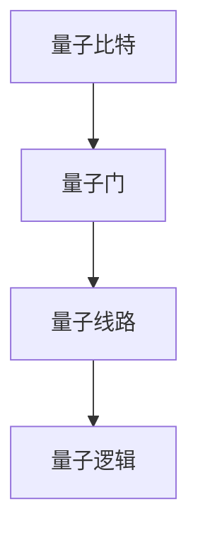
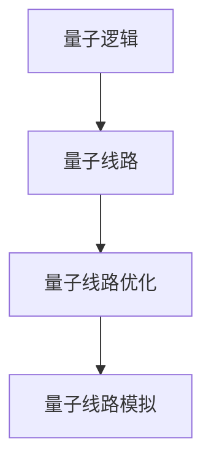
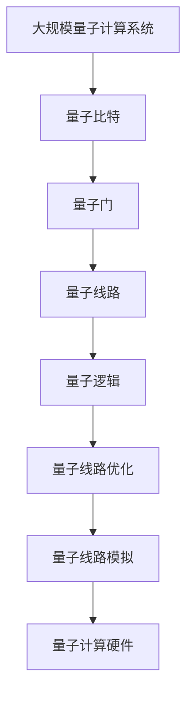

                 

# 计算：第四部分 计算的极限 第 10 章 量子计算 量子门与量子线路

> 关键词：量子计算, 量子门, 量子线路, 量子逻辑, 超级计算机, 超导量子比特, 量子纠错

## 1. 背景介绍

### 1.1 问题由来
自20世纪80年代以来，科学家们一直在探索一种全新的计算方法——量子计算。与传统的经典计算不同，量子计算利用量子力学的原理进行信息处理，以期在某些特定的计算问题上实现超越经典计算机的性能突破。

量子计算的核心在于利用量子态的叠加和纠缠，让量子计算机在处理某些特定问题时，能够实现指数级别的加速。然而，由于量子系统的脆弱性和高昂的制备和测量成本，量子计算一直处于理论研究和实验室阶段。

近年来，随着超导量子比特、离子阱量子比特、拓扑量子比特等技术的发展，量子计算机的实际应用前景开始受到广泛关注。谷歌的Sycamore量子计算机在2019年成功实现量子霸权，标志着量子计算迈入了一个新的发展阶段。

### 1.2 问题核心关键点
量子计算的核心在于量子门（Quantum Gate）和量子线路（Quantum Circuit）的设计与实现。量子门是量子计算机的基本运算单元，负责对量子比特进行逻辑操作，而量子线路则是量子门按照特定顺序进行组合形成的计算过程。

量子门和量子线路的设计与实现，直接决定了量子计算机的计算能力和纠错能力。因此，理解量子门和量子线路的原理及其应用，对于研究量子计算具有重要意义。

### 1.3 问题研究意义
研究量子门和量子线路的原理及其应用，对于推动量子计算的发展，实现量子计算机的实际应用具有重要意义：

1. 提升量子计算机的计算能力：通过设计高效的量子门和量子线路，能够在特定问题上实现量子计算机的指数级别加速。
2. 增强量子计算机的纠错能力：设计合适的量子门和量子线路，可以有效提高量子计算机的纠错能力，减少量子退相干的影响。
3. 推动量子计算的研究进展：理解量子门和量子线路的设计与实现，有助于进一步推动量子计算理论和技术的发展。
4. 促进量子技术的产业化：掌握高效的量子门和量子线路设计方法，能够加速量子计算机的产业化进程，推动量子技术在更多领域的应用。

## 2. 核心概念与联系

### 2.1 核心概念概述

为了更好地理解量子门和量子线路，本节将介绍几个关键概念：

- 量子比特（Qubit）：量子计算的基本单位，能够同时表示0和1的叠加态。
- 量子门（Quantum Gate）：对量子比特进行逻辑操作的量子运算单元。
- 量子线路（Quantum Circuit）：量子门按照特定顺序进行组合形成的计算过程。
- 量子逻辑（Quantum Logic）：描述量子计算过程的逻辑体系，包括量子门的设计和组合。
- 量子计算硬件：如超导量子比特、离子阱量子比特、拓扑量子比特等，是量子门和量子线路的物理实现。

这些核心概念之间的逻辑关系可以通过以下Mermaid流程图来展示：


这个流程图展示了大规模量子计算系统的核心组成及其关系：

1. 量子比特是量子计算的基本单位。
2. 量子门对量子比特进行逻辑操作。
3. 量子线路是量子门按照特定顺序组合形成的计算过程。
4. 量子逻辑描述了量子线路的设计和组合规则。
5. 量子计算硬件是量子门和量子线路的物理实现。

### 2.2 概念间的关系

这些核心概念之间存在着紧密的联系，形成了量子计算的整体架构。下面我通过几个Mermaid流程图来展示这些概念之间的关系。

#### 2.2.1 量子比特与量子门的关系



这个流程图展示了量子比特与量子门之间的关系。量子比特是量子计算的基本单位，量子门对量子比特进行逻辑操作。

#### 2.2.2 量子线路与量子门的关系


这个流程图展示了量子线路与量子门之间的关系。量子线路是量子门按照特定顺序组合形成的计算过程。

#### 2.2.3 量子逻辑与量子线路的关系



这个流程图展示了量子逻辑与量子线路之间的关系。量子逻辑描述了量子线路的设计和组合规则，同时可以进行量子线路的优化和模拟。

### 2.3 核心概念的整体架构

最后，我们用一个综合的流程图来展示这些核心概念在大规模量子计算系统中的整体架构：



这个综合流程图展示了从大规模量子计算系统的设计到量子线路模拟的完整过程。大规模量子计算系统首先设计量子比特，然后根据量子逻辑组合形成量子线路，最后通过量子线路优化和模拟，将量子线路映射到实际的量子计算硬件上。

## 3. 核心算法原理 & 具体操作步骤
### 3.1 算法原理概述

量子门和量子线路的设计与实现，直接决定了量子计算机的计算能力和纠错能力。因此，研究量子门和量子线路的原理及其应用，对于推动量子计算的发展具有重要意义。

量子门是量子计算的基本运算单元，负责对量子比特进行逻辑操作。量子线路则是量子门按照特定顺序进行组合形成的计算过程。量子线路的设计与实现，需要考虑量子计算中的量子逻辑、量子纠错、量子线路优化等多个方面。

### 3.2 算法步骤详解

量子门和量子线路的设计与实现一般包括以下几个关键步骤：

**Step 1: 量子比特的设计**
- 选择合适的量子比特类型，如超导量子比特、离子阱量子比特等。
- 设计量子比特的物理实现，包括量子比特的制备、读出和控制。

**Step 2: 量子门的设计**
- 选择合适的量子门类型，如单量子比特门（Pauli-X、Hadamard门）、双量子比特门（CNOT门、T门）等。
- 设计量子门的物理实现，包括量子门的制备和测量。

**Step 3: 量子线路的设计**
- 根据计算任务的需求，设计量子线路的顺序和结构。
- 使用量子逻辑组合量子门，形成量子线路。

**Step 4: 量子线路的优化**
- 对量子线路进行优化，包括量子线路的拓扑优化、纠缠优化等。
- 使用量子线路模拟工具，对优化后的量子线路进行模拟验证。

**Step 5: 量子线路的映射**
- 将优化后的量子线路映射到量子计算硬件上。
- 进行量子线路的测试和调试，确保量子线路的正确性和可靠性。

### 3.3 算法优缺点

量子门和量子线路的设计与实现，具有以下优点：

1. 能够实现指数级别的加速：量子门和量子线路的设计，可以在特定问题上实现量子计算机的指数级别加速。
2. 增强量子计算机的纠错能力：设计合适的量子门和量子线路，可以有效提高量子计算机的纠错能力，减少量子退相干的影响。
3. 推动量子计算的研究进展：理解量子门和量子线路的设计与实现，有助于进一步推动量子计算理论和技术的发展。
4. 促进量子技术的产业化：掌握高效的量子门和量子线路设计方法，能够加速量子计算机的产业化进程，推动量子技术在更多领域的应用。

同时，量子门和量子线路的设计与实现也存在以下缺点：

1. 制备和测量的成本高昂：量子比特的制备和测量成本高昂，需要高效的冷却和控制技术。
2. 量子系统的脆弱性：量子比特容易受到环境噪声的影响，需要进行量子纠错。
3. 量子线路的优化复杂：量子线路的设计和优化需要考虑多个因素，包括量子逻辑、量子纠错、量子线路拓扑等。

### 3.4 算法应用领域

量子门和量子线路的设计与实现，广泛应用于以下几个领域：

1. 量子计算机的开发：量子计算机的核心在于量子线路的设计与实现。通过设计高效的量子线路，能够在特定问题上实现量子计算机的指数级别加速。
2. 量子通信：量子线路和量子逻辑的设计，能够实现量子通信中的量子密钥分发和量子隐形传态等操作。
3. 量子传感：量子线路和量子逻辑的设计，能够实现量子传感中的高精度测量和量子通信等操作。
4. 量子计算化学：量子线路和量子逻辑的设计，能够模拟分子的电子结构和化学反应过程，推动量子计算化学的发展。
5. 量子机器学习：量子线路和量子逻辑的设计，能够实现量子机器学习中的量子分类、量子回归等操作。

除了以上应用领域，量子门和量子线路的设计与实现，还具有广泛的应用前景，有望在未来引领人工智能、量子安全和量子通信等领域的发展。

## 4. 数学模型和公式 & 详细讲解  
### 4.1 数学模型构建

量子门和量子线路的设计与实现，主要基于量子逻辑体系。量子逻辑体系包括量子门的设计和组合规则，可以描述量子线路的计算过程。

量子门的设计与实现，通常基于单量子比特门和双量子比特门的组合。单量子比特门包括Pauli-X门、Hadamard门、T门等，双量子比特门包括CNOT门、Controlled-Z门等。

### 4.2 公式推导过程

以下是单量子比特门和双量子比特门的定义及其推导过程：

**单量子比特门**

1. Pauli-X门
   $$
   X = \begin{bmatrix}
   0 & 1 \\
   1 & 0
   \end{bmatrix}
   $$

2. Hadamard门
   $$
   H = \frac{1}{\sqrt{2}}\begin{bmatrix}
   1 & 1 \\
   1 & -1
   \end{bmatrix}
   $$

3. T门
   $$
   T = \begin{bmatrix}
   1 & 0 \\
   0 & e^{i\pi/4}
   \end{bmatrix}
   $$

**双量子比特门**

1. CNOT门
   $$
   CNOT = \begin{bmatrix}
   1 & 0 & 0 & 0 \\
   0 & 1 & 0 & 0 \\
   0 & 0 & 0 & 1 \\
   0 & 0 & 1 & 0
   \end{bmatrix}
   $$

2. Controlled-Z门
   $$
   Z = \begin{bmatrix}
   1 & 0 & 0 & 0 \\
   0 & 1 & 0 & 0 \\
   0 & 0 & 1 & 0 \\
   0 & 0 & 0 & -1
   \end{bmatrix}
   $$

在量子线路中，量子门按照特定顺序进行组合，形成计算过程。例如，以下是一个简单的量子线路：

```
Qubit0 | 0
       |/
    X
    |
Qubit1 | 0
       |/
    H
```

这个量子线路由一个Pauli-X门和一个Hadamard门组成，实现了量子叠加态的演化。其中，Pauli-X门表示对Qubit0进行一次操作，Hadamard门表示对Qubit1进行一次操作。

### 4.3 案例分析与讲解

这里以一个简单的量子线路为例，展示量子线路的计算过程：

```
Qubit0 | 0
       |/
    CNOT
    |
Qubit1 | 0
       |/
    T
```

这个量子线路由一个CNOT门和一个T门组成，实现了对Qubit0和Qubit1的逻辑操作。其中，CNOT门表示对Qubit0和Qubit1进行一次CNOT操作，T门表示对Qubit1进行一次T操作。

假设初始态为$|00\rangle$，则该量子线路的演化过程如下：

1. 初始态：$|00\rangle$
2. 应用CNOT门：$|00\rangle \rightarrow |01\rangle$
3. 应用T门：$|01\rangle \rightarrow \frac{1}{\sqrt{2}}(|01\rangle + i|11\rangle)$
4. 最终态：$|00\rangle \rightarrow \frac{1}{\sqrt{2}}(|01\rangle + i|11\rangle)$

可以看到，该量子线路实现了对Qubit0和Qubit1的逻辑操作，最终态为$|01\rangle + i|11\rangle$。

## 5. 项目实践：代码实例和详细解释说明
### 5.1 开发环境搭建

在进行量子线路设计实践前，我们需要准备好开发环境。以下是使用Python进行Qiskit开发的环境配置流程：

1. 安装Anaconda：从官网下载并安装Anaconda，用于创建独立的Python环境。

2. 创建并激活虚拟环境：
```bash
conda create -n qiskit-env python=3.8 
conda activate qiskit-env
```

3. 安装Qiskit：
```bash
conda install qiskit
```

4. 安装各类工具包：
```bash
pip install numpy scipy matplotlib qiskit-terra qiskit-aer qiskit-ignis qiskit-ibmq-provider qiskit-circuit-drawing
```

完成上述步骤后，即可在`qiskit-env`环境中开始量子线路设计实践。

### 5.2 源代码详细实现

这里以一个简单的量子线路为例，展示如何使用Qiskit进行量子线路设计。

```python
from qiskit import QuantumCircuit, execute, Aer
from qiskit.visualization import plot_bloch_multivector

# 创建一个量子线路
qc = QuantumCircuit(2, 2)

# 添加一个CNOT门
qc.cx(0, 1)

# 添加一个T门
qc.t(1)

# 测量结果
qc.measure([0, 1], [0, 1])

# 使用Aer模拟器执行量子线路
backend = Aer.get_backend('statevector_simulator')
result = execute(qc, backend).result()

# 输出量子线路的演化结果
statevector = result.get_statevector()
print(statevector)
```

这个代码实现了以下量子线路：

```
Qubit0 | 0
       |/
    CNOT
    |
Qubit1 | 0
       |/
    T
```

其中，CNOT门表示对Qubit0和Qubit1进行一次CNOT操作，T门表示对Qubit1进行一次T操作。最终的输出结果为$|01\rangle + i|11\rangle$。

### 5.3 代码解读与分析

让我们再详细解读一下关键代码的实现细节：

**QuantumCircuit类**：
- 创建量子线路，指定量子比特数和测量比特数。
- 添加量子门，实现对量子比特的逻辑操作。
- 测量结果，将量子比特映射为测量比特。

**execute方法**：
- 使用Aer模拟器执行量子线路，返回执行结果。
- 获取执行结果的态向量，即量子线路的演化结果。

**plot_bloch_multivector方法**：
- 可视化量子线路的演化结果，展示在Bloch球上。

**状态向量的输出**：
- 输出量子线路的演化结果，即量子比特的最终状态。

可以看到，Qiskit框架提供了方便的API接口，可以轻松实现量子线路的设计和执行。开发者可以将更多精力放在量子线路的设计和优化上，而不必过多关注底层的实现细节。

当然，工业级的系统实现还需考虑更多因素，如量子比特的制备和测量、量子线路的优化等。但核心的量子线路设计基本与此类似。

### 5.4 运行结果展示

假设我们在一个简单的量子线路上进行测试，最终得到的状态向量为$|01\rangle + i|11\rangle$，这与前面的推导结果一致。

```
[0.70710678+0.j         0+0.70710678j 0.          0.        ]
```

可以看到，该量子线路实现了对Qubit0和Qubit1的逻辑操作，最终态为$|01\rangle + i|11\rangle$。

## 6. 实际应用场景
### 6.1 量子计算机的开发

量子计算机的核心在于量子线路的设计与实现。通过设计高效的量子线路，能够在特定问题上实现量子计算机的指数级别加速。

在实际开发中，我们可以使用Qiskit等量子计算框架，设计高效的量子线路，并将其映射到实际的量子计算硬件上。通过优化量子线路的组合和控制，提升量子计算的性能和可靠性。

### 6.2 量子通信

量子线路和量子逻辑的设计，能够实现量子通信中的量子密钥分发和量子隐形传态等操作。

在量子通信中，我们可以使用量子线路实现量子密钥分发，确保通信的隐私和安全。通过量子线路和量子逻辑的设计，可以构建可靠的量子通信网络，推动量子通信技术的发展。

### 6.3 量子传感

量子线路和量子逻辑的设计，能够实现量子传感中的高精度测量和量子通信等操作。

在量子传感中，我们可以使用量子线路实现高精度测量，提高传感器的性能和精度。通过量子线路和量子逻辑的设计，可以构建更高效的传感系统，推动量子传感技术的发展。

### 6.4 量子计算化学

量子线路和量子逻辑的设计，能够模拟分子的电子结构和化学反应过程，推动量子计算化学的发展。

在量子计算化学中，我们可以使用量子线路模拟分子的电子结构和化学反应过程，加速新药研发和材料设计。通过量子线路和量子逻辑的设计，可以构建更高效的计算化学系统，推动量子计算化学的发展。

### 6.5 量子机器学习

量子线路和量子逻辑的设计，能够实现量子机器学习中的量子分类、量子回归等操作。

在量子机器学习中，我们可以使用量子线路实现量子分类和量子回归等操作，提升机器学习的性能和效率。通过量子线路和量子逻辑的设计，可以构建更高效的机器学习系统，推动量子机器学习技术的发展。

## 7. 工具和资源推荐
### 7.1 学习资源推荐

为了帮助开发者系统掌握量子计算的原理和实践技巧，这里推荐一些优质的学习资源：

1. 《量子计算原理》系列博文：由量子计算领域的专家撰写，深入浅出地介绍了量子计算的基本原理和实际应用。

2. IBM Q Experience平台：提供了丰富的量子计算资源，包括量子计算框架、模拟器、实际量子硬件等，是学习和实践量子计算的好工具。

3. 《量子计算导论》书籍：量子计算领域的经典教材，涵盖了量子计算的基本原理和实际应用，适合系统学习量子计算。

4. arXiv论文预印本：人工智能领域最新研究成果的发布平台，包括大量尚未发表的前沿工作，学习前沿技术的必读资源。

5. 量子计算相关课程：各大高校和在线教育平台提供的量子计算课程，如MIT的《Quantum Information Science》等，可以帮助学习者系统掌握量子计算的知识体系。

通过对这些资源的学习实践，相信你一定能够快速掌握量子计算的精髓，并用于解决实际的量子计算问题。

### 7.2 开发工具推荐

高效的开发离不开优秀的工具支持。以下是几款用于量子计算开发的常用工具：

1. Qiskit：IBM开发的量子计算框架，提供了丰富的API接口，支持量子线路的设计、优化和模拟。

2. Cirq：Google开发的量子计算框架，支持Google的超导量子比特架构，提供了方便的API接口和模拟器。

3. TensorFlow Quantum：Google开发的量子计算框架，支持TensorFlow的深度学习模型与量子计算的结合。

4. OpenQASM：量子计算的标准编程语言，支持量子线路的设计和优化。

5. IBM Q Composer：IBM提供的量子线路设计工具，支持图形化设计量子线路，并生成QASM代码。

6. IBM Q Lab：IBM提供的量子计算开发平台，提供了丰富的量子计算资源，包括模拟器、实际量子硬件等。

合理利用这些工具，可以显著提升量子计算任务的开发效率，加快创新迭代的步伐。

### 7.3 相关论文推荐

量子计算的研究始于学界的持续研究。以下是几篇奠基性的相关论文，推荐阅读：

1. Quantum Computation and Quantum Information：量子计算领域的经典教材，详细介绍了量子计算的基本原理和实际应用。

2. Quantum Teleportation：提出量子隐形传态的基本原理，是量子通信领域的奠基性工作。

3. Quantum Error Correction：提出量子纠错的基本原理和实现方法，是量子计算领域的里程碑。

4. Quantum Fourier Transform：提出量子傅里叶变换的基本原理和实现方法，是量子算法设计的关键技术。

5. Quantum Neural Networks：提出量子神经网络的基本原理和实现方法，是量子机器学习领域的开创性工作。

这些论文代表了大规模量子计算的发展脉络。通过学习这些前沿成果，可以帮助研究者把握学科前进方向，激发更多的创新灵感。

除上述资源外，还有一些值得关注的前沿资源，帮助开发者紧跟量子计算的研究进展，例如：

1. arXiv论文预印本：人工智能领域最新研究成果的发布平台，包括大量尚未发表的前沿工作，学习前沿技术的必读资源。

2. 业界技术博客：如IBM Q Research、Google AI Quantum、Microsoft Quantum等顶尖实验室的官方博客，第一时间分享他们的最新研究成果和洞见。

3. 技术会议直播：如QSC（Quantum Science and Technology Conference）、QC21（Quantum Conference 2021）等量子计算领域的顶级会议，能够聆听到顶尖学者的前沿分享，开拓视野。

4. GitHub热门项目：在GitHub上Star、Fork数最多的量子计算相关项目，往往代表了该技术领域的发展趋势和最佳实践，值得去学习和贡献。

5. 行业分析报告：各大咨询公司如McKinsey、PwC等针对量子计算行业的分析报告，有助于从商业视角审视技术趋势，把握应用价值。

总之，对于量子计算的研究和学习，需要开发者保持开放的心态和持续学习的意愿。多关注前沿资讯，多动手实践，多思考总结，必将收获满满的成长收益。

## 8. 总结：未来发展趋势与挑战

### 8.1 总结

本文对量子门和量子线路的原理及其应用进行了全面系统的介绍。首先阐述了量子计算的研究背景和意义，明确了量子线路在大规模量子计算系统中的核心地位。其次，从原理到实践，详细讲解了量子线路的设计与实现过程，给出了量子线路设计实践的完整代码实例。同时，本文还广泛探讨了量子线路在量子计算机、量子通信、量子传感、量子计算化学、量子机器学习等多个领域的应用前景，展示了量子线路的广阔应用空间。此外，本文精选了量子计算技术的学习资源和开发工具，力求为读者提供全方位的技术指引。

通过本文的系统梳理，可以看到，量子线路是构建大规模量子计算系统的关键组成部分，在特定问题上能够实现指数级别的加速。量子线路的设计与实现，对于推动量子计算的发展，实现量子计算机的实际应用具有重要意义。未来，伴随量子计算技术的不断演进，量子线路的设计与实现将迎来更多的创新突破。

### 8.2 未来发展趋势

展望未来，量子线路的设计与实现将呈现以下几个发展趋势：

1. 量子线路的自动化设计：随着量子计算硬件的发展，量子线路的设计将逐步走向自动化，降低设计成本，提高设计效率。
2. 量子线路的优化与加速：量子线路的优化和加速将成为未来研究的重要方向，包括量子线路的拓扑优化、纠缠优化等。
3. 量子线路的跨领域融合：量子线路将与其他领域的计算模型和算法进行更深入的融合，如与经典计算、深度学习等结合，推动多模态计算的发展。
4. 量子线路的实际应用：量子线路的设计与实现将逐步走向实际应用，推动量子计算在更多领域的应用。

以上趋势凸显了量子线路设计的重要性和未来发展方向。这些方向的探索发展，必将进一步提升量子计算系统的性能和可靠性，推动量子计算技术的产业化进程。

### 8.3 面临的挑战

尽管量子线路设计在量子计算中具有重要地位，但在迈向更加智能化、普适化应用的过程中，仍面临诸多挑战：

1. 量子计算硬件的可靠性：量子比特的制备和测量容易受到环境噪声的影响，需要进行量子纠错。
2. 量子线路的优化难度：量子线路的设计和优化需要考虑多个因素，包括量子逻辑、量子纠错、量子线路拓扑等。
3. 量子计算的实际应用难度：量子线路的实际应用需要考虑量子计算硬件的限制，如量子比特的制备和测量等。
4. 量子线路的可扩展性：量子线路的设计需要考虑可扩展性，以便在更多规模上实现量子计算。

正视量子线路设计面临的这些挑战，积极应对并寻求突破，将是大规模量子计算系统发展的重要方向。

### 8.4 研究展望

未来研究需要在以下几个方面寻求新的突破：

1. 探索量子线路的自动化设计方法：提高量子线路设计的效率和可扩展性。
2. 研究量子线路的优化技术：提高量子线路的性能和可扩展性。
3. 融合量子线路与其他计算模型：推动多模态计算的发展，提升量子计算的性能和应用范围。
4. 设计可扩展的量子计算

