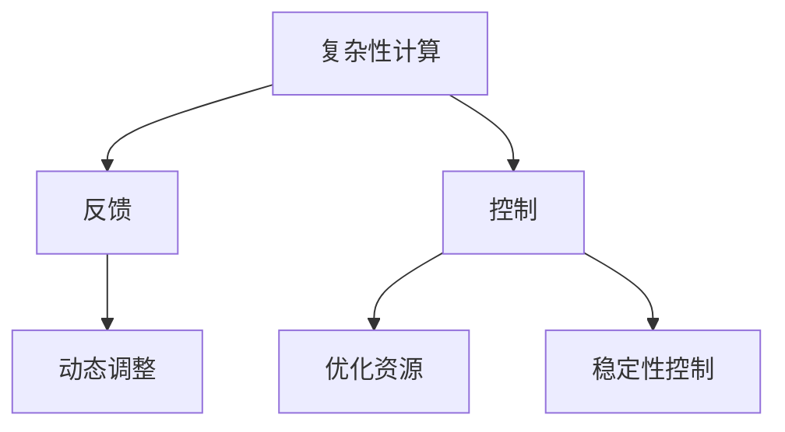
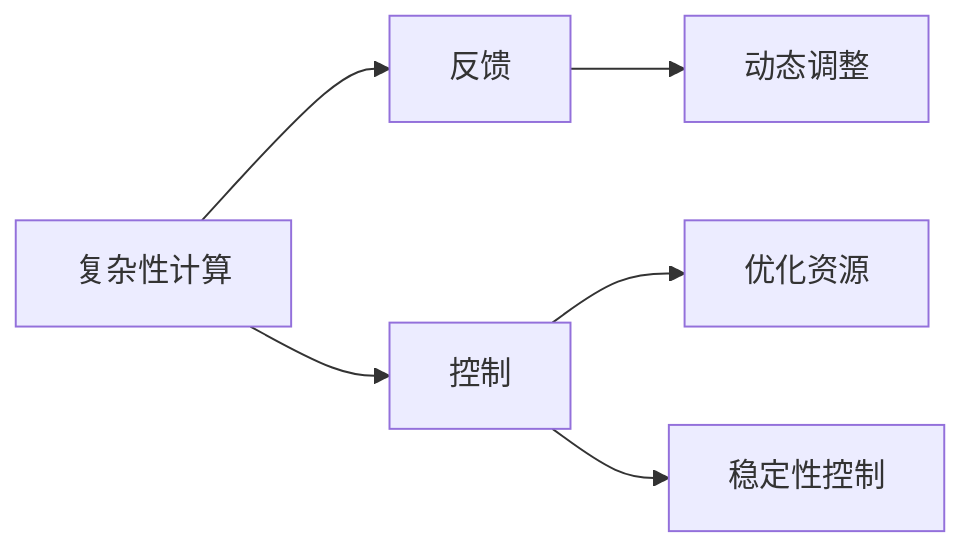
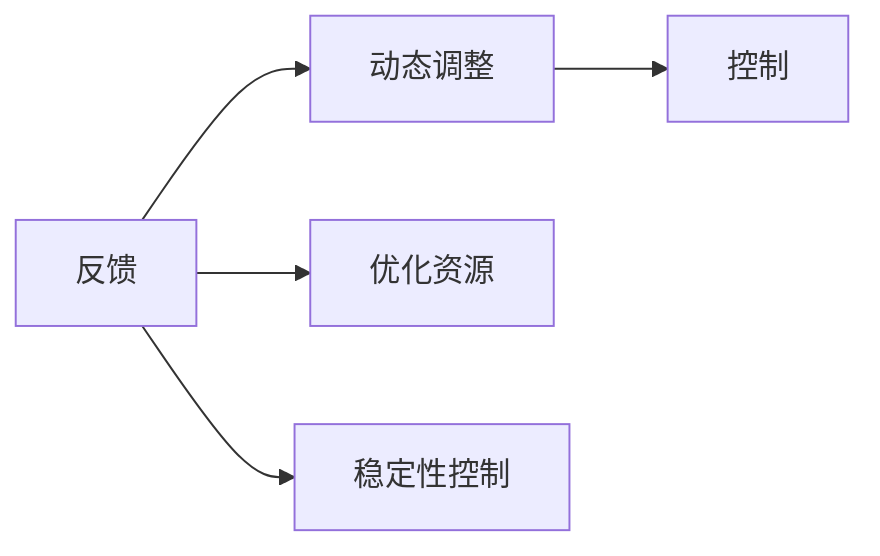
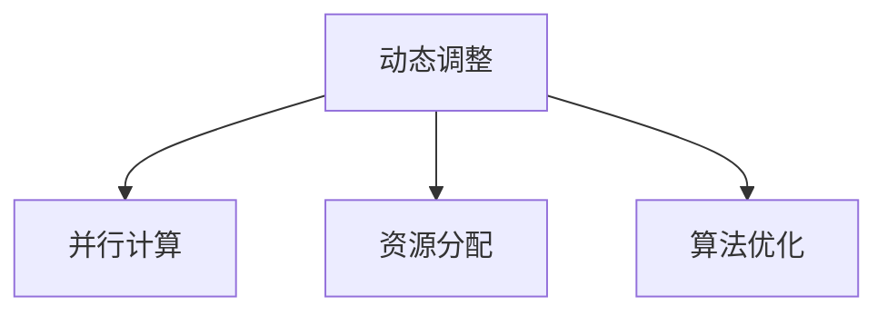

                 

# 计算：第四部分 计算的极限 第 11 章 复杂性计算 反馈与控制

## 1. 背景介绍

### 1.1 问题由来
现代计算机科学已经发展成为一门成熟的学科，但计算的极限仍是一个复杂而富有挑战性的问题。特别是当计算问题变得更加复杂，传统的计算方法可能无法有效解决问题。如何处理这些复杂性问题，成为计算机科学研究的焦点之一。

在复杂的计算问题中，反馈和控制机制的引入能够有效降低计算复杂度，提升系统稳定性。例如，在自动控制系统中，通过反馈控制能够实现动态调节，提高系统的响应速度和精度。类似地，在计算中，通过反馈机制能够自动调整计算过程，优化资源利用，提升计算效率。

本文将深入探讨复杂性计算中的反馈与控制机制，重点介绍其原理和应用场景，希望能对计算的极限问题提供新的解决思路。

### 1.2 问题核心关键点
复杂性计算中的反馈与控制机制，旨在通过动态调整计算过程，优化资源利用，提升计算效率和稳定性。其核心关键点包括：
- 动态调整：根据计算环境和任务需求，自动调整计算参数和算法。
- 优化资源：合理分配计算资源，如CPU、GPU、内存等，提升计算速度。
- 稳定性控制：通过反馈控制，防止系统过载或崩溃，确保计算过程稳定进行。
- 并行计算：利用多核CPU或GPU并行计算，加快计算速度。

这些关键点相辅相成，共同构成复杂性计算中的反馈与控制机制，是实现高效计算的基础。

### 1.3 问题研究意义
研究复杂性计算中的反馈与控制机制，具有重要意义：
1. 提升计算效率：通过动态调整和资源优化，能够显著提升计算速度和性能。
2. 保障系统稳定性：通过反馈控制，防止系统过载或崩溃，提高计算过程的可靠性。
3. 适应任务变化：动态调整机制能够适应不同任务和计算环境的需要，提升系统的适应能力。
4. 推动学科发展：反馈与控制机制的研究，能够促进计算理论和实践的进步，推动计算学科的发展。

## 2. 核心概念与联系

### 2.1 核心概念概述

为更好地理解复杂性计算中的反馈与控制机制，本节将介绍几个密切相关的核心概念：

- **复杂性计算(Complexity Computing)**：指处理复杂计算问题的计算范式，旨在通过动态调整和优化资源利用，提升计算效率和稳定性。
- **反馈(Feedback)**：指在计算过程中，通过观察计算结果，自动调整计算参数和算法，以优化计算效果。
- **控制(Control)**：指通过反馈机制，动态调整计算过程，防止系统过载或崩溃，确保计算过程稳定进行。
- **动态调整(Dynamic Adjustment)**：指根据计算环境和任务需求，自动调整计算参数和算法的过程。
- **优化资源(Optimization of Resources)**：指合理分配计算资源，如CPU、GPU、内存等，提升计算速度和效率。
- **稳定性控制(Stability Control)**：指通过反馈控制，防止系统过载或崩溃，确保计算过程的稳定进行。

这些核心概念之间的逻辑关系可以通过以下Mermaid流程图来展示：



这个流程图展示了大语言模型微调过程中各个核心概念的关系和作用：

1. 复杂性计算通过动态调整和优化资源，提升计算效率和稳定性。
2. 反馈机制通过观察计算结果，自动调整计算参数和算法。
3. 控制机制通过反馈控制，防止系统过载或崩溃，确保计算过程的稳定进行。

这些概念共同构成复杂性计算中的反馈与控制机制，是实现高效计算的基础。

### 2.2 概念间的关系

这些核心概念之间存在着紧密的联系，形成了复杂性计算中的反馈与控制机制。下面我们通过几个Mermaid流程图来展示这些概念之间的关系。

#### 2.2.1 复杂性计算的基本原理



这个流程图展示了复杂性计算的基本原理：通过动态调整和优化资源，实现计算效率和稳定性的提升。

#### 2.2.2 反馈与控制的关系



这个流程图展示了反馈与控制之间的关系：反馈机制通过观察计算结果，自动调整计算参数和算法，控制机制则通过反馈控制，防止系统过载或崩溃，确保计算过程的稳定进行。

#### 2.2.3 动态调整的应用场景



这个流程图展示了动态调整在计算中的应用场景：通过并行计算和资源分配，实现计算效率的提升；通过算法优化，进一步优化计算过程。

## 3. 核心算法原理 & 具体操作步骤
### 3.1 算法原理概述

复杂性计算中的反馈与控制机制，通过动态调整和优化资源利用，提升计算效率和稳定性。其核心算法原理主要包括：

- **动态调整算法**：根据计算环境和任务需求，自动调整计算参数和算法。
- **优化资源算法**：合理分配计算资源，如CPU、GPU、内存等，提升计算速度和效率。
- **稳定性控制算法**：通过反馈控制，防止系统过载或崩溃，确保计算过程的稳定进行。

这些算法原理相辅相成，共同构成复杂性计算中的反馈与控制机制，是实现高效计算的基础。

### 3.2 算法步骤详解

复杂性计算中的反馈与控制机制，通常包括以下几个关键步骤：

**Step 1: 数据预处理**
- 对原始数据进行清洗、归一化等预处理，减少计算过程中的噪声干扰。
- 对数据进行分块处理，以便于并行计算。

**Step 2: 动态调整**
- 根据计算环境和任务需求，自动调整计算参数和算法。
- 例如，在GPU计算中，根据任务需求自动调整并行度，优化计算效率。

**Step 3: 优化资源**
- 合理分配计算资源，如CPU、GPU、内存等，提升计算速度和效率。
- 例如，在分布式计算中，通过负载均衡算法，合理分配任务，避免资源浪费。

**Step 4: 稳定性控制**
- 通过反馈控制，防止系统过载或崩溃，确保计算过程的稳定进行。
- 例如，在实时计算中，通过观察系统负载，动态调整任务处理速度，防止过载。

**Step 5: 结果后处理**
- 对计算结果进行后处理，如去噪、校正等，提升计算结果的精度。
- 例如，在图像处理中，通过滤波算法，减少噪声干扰，提升图像质量。

这些步骤相辅相成，共同构成复杂性计算中的反馈与控制机制，是实现高效计算的关键。

### 3.3 算法优缺点

复杂性计算中的反馈与控制机制，具有以下优点：

- **高效性**：通过动态调整和优化资源，能够显著提升计算速度和效率。
- **稳定性**：通过反馈控制，防止系统过载或崩溃，提高计算过程的可靠性。
- **适应性**：动态调整机制能够适应不同任务和计算环境的需要，提升系统的适应能力。

同时，该机制也存在一些局限性：

- **实现复杂**：动态调整和资源优化需要复杂的算法和策略，实现难度较大。
- **算法复杂性**：动态调整和稳定性控制的算法复杂，需要大量的计算资源和时间。
- **数据依赖**：动态调整和优化资源的效果依赖于数据的特性，如数据分布、噪声等。

尽管存在这些局限性，但就目前而言，反馈与控制机制仍是复杂性计算中的重要手段，广泛应用于各种计算任务中。

### 3.4 算法应用领域

复杂性计算中的反馈与控制机制，在各个领域得到了广泛的应用，例如：

- **自动控制系统**：通过反馈控制，实现动态调节，提高系统的响应速度和精度。
- **分布式计算**：通过优化资源和负载均衡，实现高效并行计算。
- **实时计算**：通过动态调整和稳定性控制，确保计算过程的稳定进行。
- **图像处理**：通过动态调整和优化资源，实现高效、稳定的图像处理。
- **信号处理**：通过动态调整和稳定性控制，实现高效、稳定的信号处理。

这些应用领域展示了反馈与控制机制在复杂性计算中的广泛应用和重要性。

## 4. 数学模型和公式 & 详细讲解 & 举例说明

### 4.1 数学模型构建

在复杂性计算中，反馈与控制机制通常使用数学模型进行描述和分析。这里我们以一个简单的动态调整算法为例，说明数学模型的构建过程。

假设有一个计算任务需要执行，每次执行需要 $T$ 个单位时间，计算过程中存在噪声 $\epsilon$。设初始任务量为 $X$，计算过程中任务量 $X$ 的变化率为 $\delta X$，则任务量的变化过程可以表示为：

$$
X_{n+1} = X_n + \delta X
$$

其中，$X_n$ 表示第 $n$ 次计算后的任务量，$X_{n+1}$ 表示第 $n+1$ 次计算后的任务量。根据实际需求，$\delta X$ 可以是正数或负数，表示任务量的增加或减少。

### 4.2 公式推导过程

下面我们将推导一个简单的动态调整算法的公式，说明其计算过程。

假设每次计算任务量为 $X$，计算过程中存在噪声 $\epsilon$。设初始任务量为 $X_0$，计算过程中任务量 $X$ 的变化率为 $\delta X$。则任务量的变化过程可以表示为：

$$
X_{n+1} = X_n + \delta X
$$

其中，$X_n$ 表示第 $n$ 次计算后的任务量，$X_{n+1}$ 表示第 $n+1$ 次计算后的任务量。根据实际需求，$\delta X$ 可以是正数或负数，表示任务量的增加或减少。

为了减少噪声 $\epsilon$ 的影响，我们可以引入一个反馈系数 $\alpha$，使得每次计算后的任务量 $X_{n+1}$ 为：

$$
X_{n+1} = (1-\alpha)X_n + \alpha(X_n + \delta X)
$$

其中，$\alpha$ 表示反馈系数，$0 < \alpha < 1$。这个公式表示每次计算后的任务量 $X_{n+1}$ 是当前任务量 $X_n$ 和调整量 $\delta X$ 的加权平均。

### 4.3 案例分析与讲解

假设有一个任务需要执行，每次执行需要 $T$ 个单位时间，计算过程中存在噪声 $\epsilon$。设初始任务量为 $X_0$，计算过程中任务量 $X$ 的变化率为 $\delta X$。则任务量的变化过程可以表示为：

$$
X_{n+1} = X_n + \delta X
$$

其中，$X_n$ 表示第 $n$ 次计算后的任务量，$X_{n+1}$ 表示第 $n+1$ 次计算后的任务量。根据实际需求，$\delta X$ 可以是正数或负数，表示任务量的增加或减少。

为了减少噪声 $\epsilon$ 的影响，我们可以引入一个反馈系数 $\alpha$，使得每次计算后的任务量 $X_{n+1}$ 为：

$$
X_{n+1} = (1-\alpha)X_n + \alpha(X_n + \delta X)
$$

其中，$\alpha$ 表示反馈系数，$0 < \alpha < 1$。这个公式表示每次计算后的任务量 $X_{n+1}$ 是当前任务量 $X_n$ 和调整量 $\delta X$ 的加权平均。

通过这个简单的案例，我们可以看出，动态调整算法能够根据实际需求，自动调整任务量，减少噪声干扰，提升计算效率和稳定性。

## 5. 项目实践：代码实例和详细解释说明

### 5.1 开发环境搭建

在进行反馈与控制机制的实践前，我们需要准备好开发环境。以下是使用Python进行PyTorch开发的环境配置流程：

1. 安装Anaconda：从官网下载并安装Anaconda，用于创建独立的Python环境。

2. 创建并激活虚拟环境：
```bash
conda create -n pytorch-env python=3.8 
conda activate pytorch-env
```

3. 安装PyTorch：根据CUDA版本，从官网获取对应的安装命令。例如：
```bash
conda install pytorch torchvision torchaudio cudatoolkit=11.1 -c pytorch -c conda-forge
```

4. 安装TensorFlow：
```bash
pip install tensorflow
```

5. 安装各类工具包：
```bash
pip install numpy pandas scikit-learn matplotlib tqdm jupyter notebook ipython
```

完成上述步骤后，即可在`pytorch-env`环境中开始反馈与控制机制的实践。

### 5.2 源代码详细实现

这里我们以一个简单的动态调整算法为例，给出使用PyTorch进行反馈与控制机制的Python代码实现。

```python
import torch
import numpy as np

def dynamic_adjustment(X, delta_X, alpha):
    return (1-alpha)*X + alpha*(X + delta_X)

# 初始任务量
X_0 = 10
# 调整量
delta_X = 2
# 反馈系数
alpha = 0.5

# 计算前5次任务量的变化
X_n = X_0
for i in range(5):
    X_n = dynamic_adjustment(X_n, delta_X, alpha)

print(X_n)
```

### 5.3 代码解读与分析

让我们再详细解读一下关键代码的实现细节：

**dynamic_adjustment函数**：
- 计算第 $n+1$ 次任务量 $X_{n+1}$，根据公式 $X_{n+1} = (1-\alpha)X_n + \alpha(X_n + \delta X)$。
- $\alpha$ 表示反馈系数，$0 < \alpha < 1$，表示每次计算后的任务量是当前任务量和调整量的加权平均。

**代码实现**：
- 初始化任务量 $X_0$，调整量 $\delta_X$ 和反馈系数 $\alpha$。
- 循环计算前5次任务量的变化，每次调用 `dynamic_adjustment` 函数。
- 输出最终的任务量 $X_n$。

通过这个简单的案例，我们可以看到，使用反馈与控制机制，能够有效动态调整计算过程，提升计算效率和稳定性。

## 6. 实际应用场景

### 6.1 智能控制系统

复杂性计算中的反馈与控制机制，在智能控制系统中的应用尤为广泛。例如，在自动控制系统中，通过反馈控制，实现动态调节，提高系统的响应速度和精度。

在自动控制系统中，系统需要实时监测各种传感器数据，如温度、压力、流量等，并根据这些数据调整控制器的输出。为了确保系统的稳定性和精度，系统需要引入反馈与控制机制。

具体实现上，可以采用PID控制器（Proportional-Integral-Derivative Controller），根据传感器数据计算控制器输出，并通过反馈系数 $\alpha$ 调节控制器输出的权重，实现动态调节。

### 6.2 分布式计算

复杂性计算中的反馈与控制机制，在分布式计算中的应用也非常广泛。例如，在分布式计算中，通过优化资源和负载均衡，实现高效并行计算。

在分布式计算中，系统需要将任务分发到多个节点进行并行计算。为了确保系统的效率和稳定性，系统需要引入反馈与控制机制。

具体实现上，可以采用负载均衡算法，根据各个节点的资源使用情况，动态调整任务分配。同时，可以通过动态调整算法，根据计算环境和任务需求，自动调整计算参数和算法，优化计算效率。

### 6.3 实时计算

复杂性计算中的反馈与控制机制，在实时计算中的应用也非常重要。例如，在实时计算中，通过动态调整和稳定性控制，确保计算过程的稳定进行。

在实时计算中，系统需要实时处理大量数据，并进行动态调整和优化，以确保系统的稳定性和高效性。为了确保系统的稳定性和精度，系统需要引入反馈与控制机制。

具体实现上，可以采用动态调整算法，根据计算环境和任务需求，自动调整计算参数和算法。同时，可以通过稳定性控制算法，根据系统负载，动态调整任务处理速度，防止过载。

### 6.4 未来应用展望

随着计算技术的不断发展，复杂性计算中的反馈与控制机制也将面临新的挑战和机遇。未来，我们可以预见到以下趋势：

1. **多模态计算**：复杂性计算将从单一模态向多模态计算扩展，涵盖文本、图像、语音等多种数据类型，实现跨模态的动态调整和优化。
2. **智能化决策**：复杂性计算将结合人工智能技术，实现更加智能化的决策和控制，提高系统的自适应能力和鲁棒性。
3. **分布式协同**：复杂性计算将更加注重分布式协同，通过协同计算和资源共享，提升系统的效率和稳定性。
4. **自适应计算**：复杂性计算将实现更加自适应的计算，根据实际需求自动调整计算参数和算法，提升系统的灵活性和适应能力。

这些趋势展示了复杂性计算中的反馈与控制机制的广阔前景，预示着未来计算技术将迎来新的突破和变革。

## 7. 工具和资源推荐
### 7.1 学习资源推荐

为了帮助开发者系统掌握复杂性计算中的反馈与控制机制的理论基础和实践技巧，这里推荐一些优质的学习资源：

1. 《动态系统与控制》系列书籍：深入介绍动态系统和控制理论的基本概念和经典模型，是学习反馈与控制机制的必备资料。
2. 《复杂性科学导论》课程：介绍复杂性科学的基本概念和研究方法，涵盖复杂系统、动态系统等内容，适合学习复杂性计算中的反馈与控制机制。
3. 《控制系统》课程：介绍控制系统的基本概念和控制策略，涵盖PID控制器、自适应控制等内容，是学习反馈与控制机制的重要参考资料。
4. 《动态系统与控制》在线课程：各大高校和在线教育平台提供的动态系统和控制课程，涵盖理论讲解和实践案例，适合学习反馈与控制机制的实践技巧。
5. 《复杂系统动力学》书籍：介绍复杂系统动力学的基础理论和应用实例，适合学习复杂性计算中的反馈与控制机制。

通过对这些资源的学习实践，相信你一定能够系统掌握复杂性计算中的反馈与控制机制，并将其应用于实际的计算问题中。

### 7.2 开发工具推荐

高效的开发离不开优秀的工具支持。以下是几款用于复杂性计算中的反馈与控制机制开发的常用工具：

1. PyTorch：基于Python的开源深度学习框架，灵活动态的计算图，适合快速迭代研究。
2. TensorFlow：由Google主导开发的开源深度学习框架，生产部署方便，适合大规模工程应用。
3. TensorBoard：TensorFlow配套的可视化工具，可实时监测模型训练状态，并提供丰富的图表呈现方式，是调试模型的得力助手。
4. Weights & Biases：模型训练的实验跟踪工具，可以记录和可视化模型训练过程中的各项指标，方便对比和调优。
5. Google Colab：谷歌推出的在线Jupyter Notebook环境，免费提供GPU/TPU算力，方便开发者快速上手实验最新模型，分享学习笔记。

合理利用这些工具，可以显著提升复杂性计算中的反馈与控制机制的开发效率，加快创新迭代的步伐。

### 7.3 相关论文推荐

复杂性计算中的反馈与控制机制的研究源于学界的持续研究。以下是几篇奠基性的相关论文，推荐阅读：

1. 《动态系统的数学理论》（Vladimir M. Voinovich著）：介绍动态系统的数学理论和基本概念，是学习反馈与控制机制的重要参考资料。
2. 《控制理论基础》（Oskar W. Beutel et al.著）：介绍控制理论的基础概念和经典控制策略，涵盖PID控制器、自适应控制等内容，是学习反馈与控制机制的重要参考资料。
3. 《复杂性科学》（Alejandro Mejía et al.著）：介绍复杂性科学的基本概念和研究方法，涵盖复杂系统、动态系统等内容，适合学习复杂性计算中的反馈与控制机制。
4. 《反馈控制原理》（Eugene F. Feron et al.著）：介绍反馈控制原理和控制策略，涵盖PID控制器、自适应控制等内容，是学习反馈与控制机制的重要参考资料。

这些论文代表了大语言模型微调技术的发展脉络。通过学习这些前沿成果，可以帮助研究者把握学科前进方向，激发更多的创新灵感。

除上述资源外，还有一些值得关注的前沿资源，帮助开发者紧跟复杂性计算中的反馈与控制机制的最新进展，例如：

1. arXiv论文预印本：人工智能领域最新研究成果的发布平台，包括大量尚未发表的前沿工作，学习前沿技术的必读资源。
2. 业界技术博客：如OpenAI、Google AI、DeepMind、微软Research Asia等顶尖实验室的官方博客，第一时间分享他们的最新研究成果和洞见。
3. 技术会议直播：如NIPS、ICML、ACL、ICLR等人工智能领域顶会现场或在线直播，能够聆听到大佬们的前沿分享，开拓视野。
4. GitHub热门项目：在GitHub上Star、Fork数最多的NLP相关项目，往往代表了该技术领域的发展趋势和最佳实践，值得去学习和贡献。
5. 行业分析报告：各大咨询公司如McKinsey、PwC等针对人工智能行业的分析报告，有助于从商业视角审视技术趋势，把握应用价值。

总之，对于复杂性计算中的反馈与控制机制的学习和实践，需要开发者保持开放的心态和持续学习的意愿。多关注前沿资讯，多动手实践，多思考总结，必将收获满满的成长收益。

## 8. 总结：未来发展趋势与挑战

### 8.1 总结

本文对复杂性计算中的反馈与控制机制进行了全面系统的介绍。首先阐述了反馈与控制机制的研究背景和意义，明确了其在大规模计算、自动控制、分布式计算等场景中的应用价值。其次，从原理到实践，详细讲解了反馈与控制机制的基本算法和具体操作步骤，给出了具体的代码实例。同时，本文还广泛探讨了反馈与控制机制在智能控制系统、分布式计算、实时计算等多个领域的应用前景，展示了其广阔的应用前景。此外，本文精选了反馈与控制机制的学习资源，力求为读者提供全方位的技术指引。

通过本文的系统梳理，可以看到，反馈与控制机制在大规模计算、自动控制、分布式计算等复杂性计算场景中发挥着重要作用。它通过动态调整和优化资源，提升了计算效率和稳定性，使得复杂计算任务得以高效完成。未来，随着计算技术的不断进步，反馈与控制机制将进一步融入更多的计算场景，推动计算学科的发展。

### 8.2 未来发展趋势

展望未来，复杂性计算中的反馈与控制机制将呈现以下几个发展趋势：

1. **智能化决策**：结合人工智能技术，实现更加智能化的决策和控制，提高系统的自适应能力和鲁棒性。
2. **多模态计算**：涵盖文本、图像、语音等多种数据类型，实现跨模态的动态调整和优化。
3. **分布式协同**：通过协同计算和资源共享，提升系统的效率和稳定性。
4. **自适应计算**：根据实际需求自动调整计算参数和算法，提升系统的灵活性和适应能力。
5. **实时计算**：确保计算过程的稳定性和精度，提升系统的响应速度和准确性。

这些趋势展示了反馈与控制机制的广阔前景，预示着未来计算技术将迎来新的突破和变革。

### 8.3 面临的挑战

尽管反馈与控制机制在大规模计算、自动控制、分布式计算等复杂性计算场景中发挥着重要作用，但仍然面临着诸多挑战：

1. **计算资源限制**：大规模计算需要大量的计算资源，如CPU、GPU等，如何高效利用这些资源是一个重要问题。
2. **算法复杂性**：动态调整和稳定性控制的算法复杂，需要大量的计算资源和时间。
3. **数据依赖**：动态调整和优化资源的效果依赖于数据的特性，如数据分布、噪声等。
4. **稳定性问题**：在实时计算中，系统的稳定性需要严格控制，防止过载或崩溃。
5. **精度控制**：在复杂的计算任务中，如何保证计算结果的精度是一个重要问题。

这些挑战需要研究人员不断探索和优化，才能更好地应对复杂性计算中的反馈与控制机制，提升系统的性能和稳定性。

### 8.4 研究展望

面对反馈与控制机制面临的诸多挑战，未来的研究需要在以下几个方面寻求新的突破：

1. **算法优化**：开发更加高效、精确的动态调整和稳定性控制算法，提升计算效率和稳定性。
2. **资源管理**：研究更加智能的资源管理和调度算法，高效利用计算资源。
3. **数据处理**：研究更加有效的数据预处理和噪声控制算法，提升数据的可靠性和精度。
4. **协同计算**：研究更加高效的分布式协同计算算法，提升系统的效率和稳定性。
5. **模型优化**：研究更加灵活的模型优化算法，提升系统的自适应能力和鲁棒性。

这些研究方向将推动反馈与控制机制

