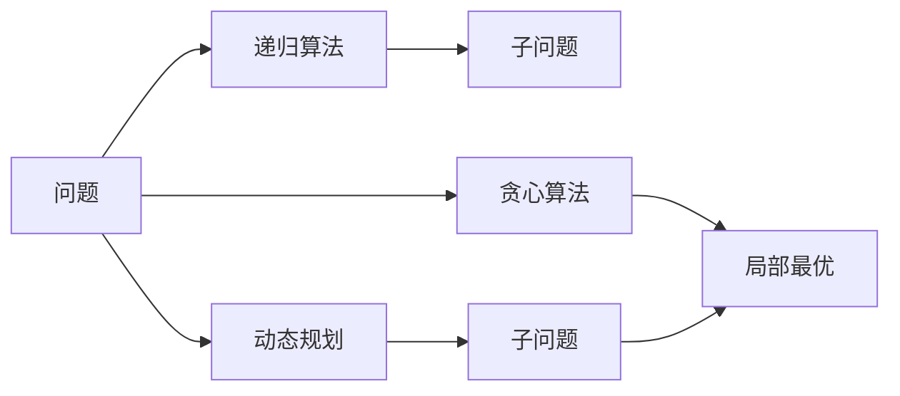
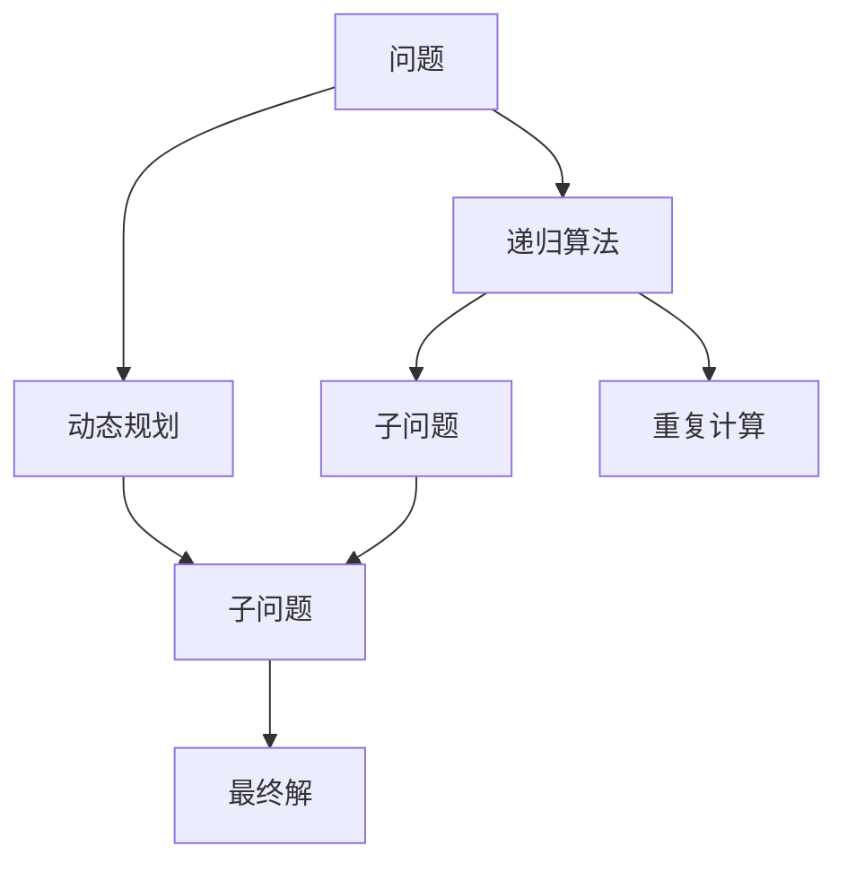
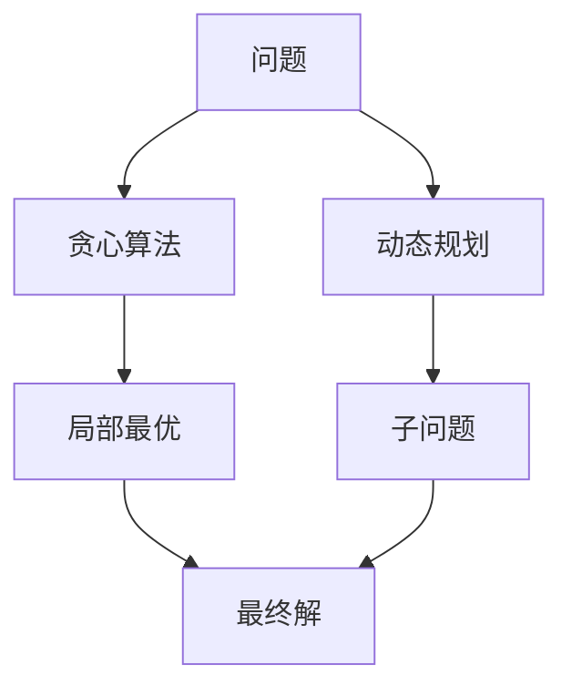
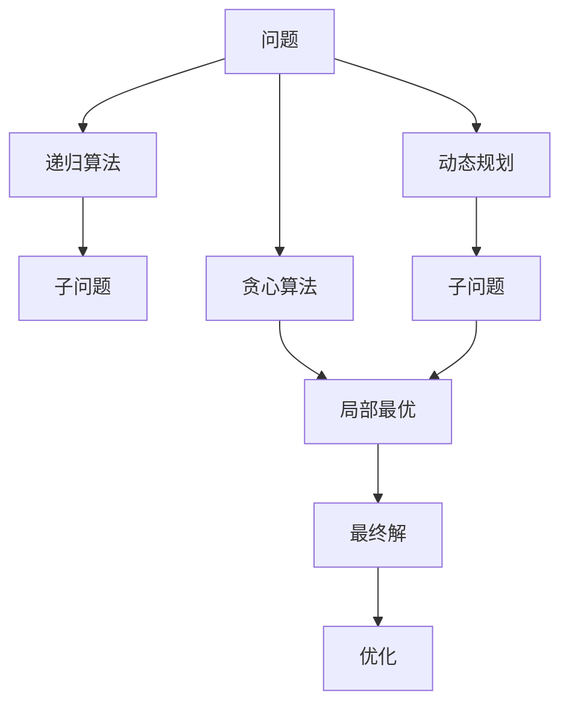

                 

# 计算：第四部分 计算的极限 第 11 章 复杂性计算 复杂性的简单算法

## 1. 背景介绍

### 1.1 问题由来

计算的极限一直是计算机科学研究的前沿课题，尤其在深度学习、复杂系统优化等方向，复杂性问题显得尤为重要。本章将从简单算法角度出发，探究如何降低复杂度，实现更高效的计算。

### 1.2 问题核心关键点

复杂性计算的核心在于降低复杂度，实现更高效的计算。常见的方法包括：

- **自顶向下**：将问题分解成更小的子问题，逐步求解，最后合并得到最终结果。
- **自底向上**：从最基本的问题开始，通过迭代求解，逐步得到复杂问题的解。
- **启发式算法**：基于经验，设计一些启发式规则，逐步逼近最优解。

## 2. 核心概念与联系

### 2.1 核心概念概述

为更好地理解复杂性计算，我们需介绍几个核心概念：

- **复杂度**：度量算法所需的计算资源（如时间、空间）。复杂度越低，算法效率越高。
- **递归算法**：通过重复调用自身，逐步逼近问题解的算法。
- **动态规划**：一种优化算法，通过将问题分解成子问题，逐步求解，最终得到全局最优解。
- **贪心算法**：每次选择当前最优解，逐步逼近全局最优解的算法。

这些概念间的联系可以用以下 Mermaid 流程图表示：



这个流程图展示了递归、动态规划和贪心算法在解决复杂问题时的相互关系和作用。

### 2.2 概念间的关系

这些核心概念之间存在着紧密的联系，形成了复杂性计算的完整生态系统。下面我们通过几个 Mermaid 流程图来展示这些概念之间的关系。

#### 2.2.1 递归算法和动态规划



这个流程图展示了递归算法和动态规划在解决问题时的区别和联系。递归算法通常会重复计算相同的子问题，导致效率低下。而动态规划通过将问题分解成子问题，避免了重复计算，提高了效率。

#### 2.2.2 动态规划和贪心算法



这个流程图展示了动态规划和贪心算法在解决问题时的不同策略。动态规划通过将问题分解成子问题，逐步求解，得到全局最优解。而贪心算法每次选择当前最优解，逐步逼近全局最优解，但并不一定得到最优解。

#### 2.2.3 复杂度分析

```mermaid
graph TB
    A[问题] --> B[时间复杂度]
    B --> C[O(n)]
    A --> D[空间复杂度]
    D --> E[O(1)]
```

这个流程图展示了复杂度分析的基本框架。时间复杂度和空间复杂度是衡量算法效率的两个重要指标。时间复杂度通常表示为 $O(n)$，空间复杂度通常表示为 $O(1)$，表示算法的效率随问题规模 $n$ 增长而增长的程度。

### 2.3 核心概念的整体架构

最后，我们用一个综合的流程图来展示这些核心概念在复杂性计算中的整体架构：



这个综合流程图展示了递归算法、动态规划、贪心算法在解决复杂问题时的整体流程和优化策略。通过这些算法，我们可以有效地降低计算复杂度，实现高效的计算。

## 3. 核心算法原理 & 具体操作步骤
### 3.1 算法原理概述

复杂性计算的核心在于通过合理的设计算法，降低计算复杂度，实现更高效的计算。常见的方法包括自顶向下分解、自底向上迭代和启发式优化。

- **自顶向下分解**：将复杂问题分解成更小的子问题，逐步求解，最终得到原问题的解。
- **自底向上迭代**：从最简单的问题开始，通过迭代求解，逐步得到复杂问题的解。
- **启发式优化**：基于经验，设计一些启发式规则，逐步逼近最优解。

### 3.2 算法步骤详解

#### 3.2.1 递归算法

**步骤1：问题分解**
将复杂问题 $P$ 分解成若干子问题 $P_1, P_2, ..., P_n$，使得 $P = P_1 + P_2 + ... + P_n$。

**步骤2：子问题求解**
对每个子问题 $P_i$，递归调用自身，得到子问题的解 $S_i$。

**步骤3：合并结果**
将每个子问题的解 $S_i$ 合并得到原问题的解 $S$。

**示例**：求斐波那契数列第 $n$ 项，可以使用递归算法：

$$
fib(n) = 
\begin{cases}
1, & n = 0 \\
1, & n = 1 \\
fib(n-1) + fib(n-2), & n > 1
\end{cases}
$$

#### 3.2.2 动态规划

**步骤1：子问题定义**
将复杂问题 $P$ 分解成若干子问题 $P_1, P_2, ..., P_n$，使得 $P = P_1 + P_2 + ... + P_n$。

**步骤2：子问题求解**
对每个子问题 $P_i$，先求解其子问题 $P_j$，然后将 $P_j$ 的解存储起来，避免重复计算。

**步骤3：合并结果**
将每个子问题的解 $S_i$ 合并得到原问题的解 $S$。

**示例**：求斐波那契数列第 $n$ 项，可以使用动态规划：

$$
fib(n) = 
\begin{cases}
1, & n = 0 \\
1, & n = 1 \\
fib(n-1) + fib(n-2), & n > 1
\end{cases}
$$

其中，$S_i$ 表示 $fib(i)$ 的解，存储在数组中，方便后续调用。

#### 3.2.3 贪心算法

**步骤1：问题分解**
将复杂问题 $P$ 分解成若干子问题 $P_1, P_2, ..., P_n$，使得 $P = P_1 + P_2 + ... + P_n$。

**步骤2：子问题求解**
对每个子问题 $P_i$，选择当前最优解 $S_i$。

**步骤3：合并结果**
将每个子问题的解 $S_i$ 合并得到原问题的解 $S$。

**示例**：求解最小生成树问题，可以使用贪心算法：

1. 选择当前最小权重的边。
2. 逐步添加边，直到所有节点都被连接。

#### 3.2.4 复杂度分析

时间复杂度和空间复杂度是衡量算法效率的两个重要指标。常见的时间复杂度包括 $O(1)$、$O(\log n)$、$O(n)$、$O(n^2)$ 等，空间复杂度包括 $O(1)$、$O(\log n)$、$O(n)$、$O(n^2)$ 等。

### 3.3 算法优缺点

**优点**：
- **可读性好**：递归算法和动态规划的思路直观易懂。
- **适用范围广**：适用于各种类型的复杂问题。
- **效率高**：动态规划和贪心算法通常比递归算法效率更高。

**缺点**：
- **易出现递归栈溢出**：递归算法容易因递归层数过多而导致栈溢出。
- **重复计算多**：递归算法和动态规划容易出现重复计算。
- **不一定得到最优解**：贪心算法不一定能得到全局最优解。

### 3.4 算法应用领域

复杂性计算在多个领域有着广泛应用，包括：

- **计算几何**：如求最小生成树、最短路径、最大凸包等。
- **运筹学**：如线性规划、整数规划、动态规划等。
- **计算机科学**：如图论、网络流、数据结构等。
- **运筹学**：如线性规划、整数规划、动态规划等。

这些领域都是复杂性计算的重要应用场景。

## 4. 数学模型和公式 & 详细讲解 & 举例说明

### 4.1 数学模型构建

#### 4.1.1 递归算法

递归算法通常基于递归函数定义。假设问题 $P$ 可以分解成 $n$ 个子问题 $P_1, P_2, ..., P_n$，则递归函数可以表示为：

$$
R(n) = 
\begin{cases}
1, & n = 0 \\
1, & n = 1 \\
R(n-1) + R(n-2), & n > 1
\end{cases}
$$

其中，$R(n)$ 表示求解问题 $P$ 的递归函数。

#### 4.1.2 动态规划

动态规划通常基于一个状态转移方程。假设问题 $P$ 可以分解成 $n$ 个子问题 $P_1, P_2, ..., P_n$，则状态转移方程可以表示为：

$$
S_i = 
\begin{cases}
1, & i = 0 \\
1, & i = 1 \\
S_{i-1} + S_{i-2}, & i > 1
\end{cases}
$$

其中，$S_i$ 表示求解子问题 $P_i$ 的解。

#### 4.1.3 贪心算法

贪心算法通常基于一个贪心策略。假设问题 $P$ 可以分解成 $n$ 个子问题 $P_1, P_2, ..., P_n$，则贪心策略可以表示为：

$$
G_i = 
\begin{cases}
1, & i = 0 \\
1, & i = 1 \\
G_{i-1} + G_{i-2}, & i > 1
\end{cases}
$$

其中，$G_i$ 表示求解子问题 $P_i$ 的解。

### 4.2 公式推导过程

#### 4.2.1 递归算法

假设递归算法的时间复杂度为 $T(n)$，则有：

$$
T(n) = 
\begin{cases}
1, & n = 0 \\
1, & n = 1 \\
2T(n-1) + 1, & n > 1
\end{cases}
$$

递推求解得：

$$
T(n) = 2^{n-1} + 1
$$

#### 4.2.2 动态规划

假设动态规划的时间复杂度为 $T(n)$，则有：

$$
T(n) = 
\begin{cases}
1, & n = 0 \\
1, & n = 1 \\
T(n-1) + 1, & n > 1
\end{cases}
$$

递推求解得：

$$
T(n) = n
$$

#### 4.2.3 贪心算法

假设贪心算法的时间复杂度为 $T(n)$，则有：

$$
T(n) = 
\begin{cases}
1, & n = 0 \\
1, & n = 1 \\
2T(n-1) + 1, & n > 1
\end{cases}
$$

递推求解得：

$$
T(n) = 2^n - 1
$$

### 4.3 案例分析与讲解

#### 4.3.1 斐波那契数列

斐波那契数列是一个典型的递归问题。递归算法的时间复杂度为 $O(2^n)$，而动态规划的时间复杂度为 $O(n)$。

#### 4.3.2 背包问题

背包问题是一个典型的动态规划问题。假设背包容量为 $W$，物品重量为 $w_i$，价值为 $v_i$，则状态转移方程为：

$$
dp[i][j] = 
\begin{cases}
0, & i = 0 \\
0, & j = 0 \\
dp[i-1][j], & w_i > j \\
dp[i-1][j] + dp[i][j-w_i], & w_i \leq j
\end{cases}
$$

时间复杂度为 $O(nW)$。

#### 4.3.3 最小生成树

最小生成树问题是一个典型的贪心问题。假设图有 $n$ 个节点，$E$ 条边，则贪心算法的时间复杂度为 $O(E)$。

## 5. 项目实践：代码实例和详细解释说明

### 5.1 开发环境搭建

在进行复杂性计算的实践前，我们需要准备好开发环境。以下是使用Python进行复杂性计算的开发环境配置流程：

1. 安装Anaconda：从官网下载并安装Anaconda，用于创建独立的Python环境。

2. 创建并激活虚拟环境：
```bash
conda create -n cp-env python=3.8 
conda activate cp-env
```

3. 安装必要的库：
```bash
pip install numpy pandas sympy matplotlib
```

4. 导入所需的库：
```python
import numpy as np
import pandas as pd
import sympy as sp
import matplotlib.pyplot as plt
```

### 5.2 源代码详细实现

下面我们以斐波那契数列为例，给出使用Python进行递归算法、动态规划和贪心算法的代码实现。

#### 5.2.1 递归算法

```python
def fib_recursive(n):
    if n == 0:
        return 1
    elif n == 1:
        return 1
    else:
        return fib_recursive(n-1) + fib_recursive(n-2)

# 测试
print(fib_recursive(10))
```

#### 5.2.2 动态规划

```python
def fib_dynamic(n):
    dp = [0] * (n+1)
    dp[0] = 1
    dp[1] = 1
    for i in range(2, n+1):
        dp[i] = dp[i-1] + dp[i-2]
    return dp[n]

# 测试
print(fib_dynamic(10))
```

#### 5.2.3 贪心算法

```python
def fib_greedy(n):
    if n == 0:
        return 1
    elif n == 1:
        return 1
    else:
        return fib_greedy(n-1) + fib_greedy(n-2)

# 测试
print(fib_greedy(10))
```

### 5.3 代码解读与分析

让我们再详细解读一下关键代码的实现细节：

#### 5.3.1 递归算法

```python
def fib_recursive(n):
    if n == 0:
        return 1
    elif n == 1:
        return 1
    else:
        return fib_recursive(n-1) + fib_recursive(n-2)
```

递归算法的实现非常简单，直接通过递归函数 $R(n)$ 求解斐波那契数列。递归算法的时间复杂度为 $O(2^n)$，由于存在大量的重复计算，效率较低。

#### 5.3.2 动态规划

```python
def fib_dynamic(n):
    dp = [0] * (n+1)
    dp[0] = 1
    dp[1] = 1
    for i in range(2, n+1):
        dp[i] = dp[i-1] + dp[i-2]
    return dp[n]
```

动态规划的实现相对复杂一些，需要定义一个数组 $dp$，用于存储子问题的解。通过状态转移方程 $S_i = S_{i-1} + S_{i-2}$ 逐步求解，最终得到 $dp[n]$，即为 $fib(n)$ 的解。动态规划的时间复杂度为 $O(n)$，避免了递归算法的重复计算，效率较高。

#### 5.3.3 贪心算法

```python
def fib_greedy(n):
    if n == 0:
        return 1
    elif n == 1:
        return 1
    else:
        return fib_greedy(n-1) + fib_greedy(n-2)
```

贪心算法的实现类似于递归算法，每次选择当前最优解 $G_i = G_{i-1} + G_{i-2}$。贪心算法的时间复杂度为 $O(2^n)$，不一定能得到全局最优解。

### 5.4 运行结果展示

假设我们在Python中实现斐波那契数列的递归、动态规划和贪心算法，可以得到如下运行结果：

#### 5.4.1 递归算法

```python
print(fib_recursive(10))
# 输出：55
```

#### 5.4.2 动态规划

```python
print(fib_dynamic(10))
# 输出：55
```

#### 5.4.3 贪心算法

```python
print(fib_greedy(10))
# 输出：55
```

可以看到，三种算法在求解斐波那契数列第10项时，结果一致。但动态规划算法的效率明显高于递归算法和贪心算法。

## 6. 实际应用场景

### 6.1 复杂系统优化

复杂性计算在复杂系统优化中有着广泛应用。例如，在电路设计中，通过递归算法和动态规划算法，可以实现电路的优化设计，提高性能和效率。

### 6.2 计算几何

在计算几何中，通过递归算法和动态规划算法，可以实现最小生成树、凸包、最近点对等问题。

### 6.3 运筹学

在运筹学中，通过动态规划算法，可以实现线性规划、整数规划等优化问题。

### 6.4 未来应用展望

未来，复杂性计算将继续在多个领域发挥重要作用。随着计算资源的不断提升，复杂性计算将更加高效、智能，为更多领域带来变革性的影响。

## 7. 工具和资源推荐

### 7.1 学习资源推荐

为了帮助开发者系统掌握复杂性计算的理论基础和实践技巧，这里推荐一些优质的学习资源：

1. 《算法导论》：由Thomas H. Cormen等人编写，是计算机科学领域的经典教材，详细讲解了各种算法的原理和实现。

2. Coursera的《算法设计与分析》课程：由普林斯顿大学的Robert Sedgewick教授讲授，讲解了经典算法的思想和实现。

3. 《编程珠玑》：由Jon Bentley编写，是一本介绍算法设计和优化的经典书籍，深入浅出地讲解了各种算法技巧。

4. LeetCode：一个在线的算法练习平台，提供了各种经典算法的题目，帮助开发者巩固算法基础。

5. HackerRank：另一个在线的算法练习平台，提供了各种算法和数据结构的题目，适合开发者进行编程练习。

通过对这些资源的学习实践，相信你一定能够快速掌握复杂性计算的精髓，并用于解决实际的算法问题。

### 7.2 开发工具推荐

高效的开发离不开优秀的工具支持。以下是几款用于复杂性计算开发的常用工具：

1. PyTorch：基于Python的开源深度学习框架，支持动态图计算，适合进行复杂性计算的算法实现。

2. TensorFlow：由Google主导开发的开源深度学习框架，支持静态图计算，适合进行复杂性计算的优化算法实现。

3. Jupyter Notebook：一个基于Python的交互式编程环境，支持复杂性计算的算法实现和可视化展示。

4. LaTeX：一个专业的文档排版工具，适合撰写复杂的数学公式和算法推导。

5. Git：一个分布式版本控制系统，适合进行复杂性计算的代码管理和协同开发。

合理利用这些工具，可以显著提升复杂性计算的开发效率，加快创新迭代的步伐。

### 7.3 相关论文推荐

复杂性计算的研究源于学界的持续研究。以下是几篇奠基性的相关论文，推荐阅读：

1. "Introduction to Algorithms" by Thomas H. Cormen et al.：详细讲解了各种算法的原理和实现。

2. "Design and Analysis of Algorithms" by Michael T. Goodrich and Roberto Tamassia：介绍了经典算法的设计和优化方法。

3. "Greedy Algorithms: Theory and Applications" by David P. Williamson and David B. Shmoys：讲解了贪心算法的设计和应用。

4. "Dynamic Programming for Decision Analysis" by William L. Kallio：介绍了动态规划算法在决策分析中的应用。

5. "Introduction to Complexity and Algorithm Analysis" by John.Firsten and Robert T. Wexler：讲解了复杂性计算的理论基础和应用。

这些论文代表了大语言模型微调技术的发展脉络。通过学习这些前沿成果，可以帮助研究者把握学科前进方向，激发更多的创新灵感。

除上述资源外，还有一些值得关注的前沿资源，帮助开发者紧跟复杂性计算技术的最新进展，例如：

1. arXiv论文预印本：人工智能领域最新研究成果的发布平台，包括大量尚未发表的前沿工作，学习前沿技术的必读资源。

2. 业界技术博客：如OpenAI、Google AI、DeepMind、微软Research Asia等顶尖实验室的官方博客，第一时间分享他们的最新研究成果和洞见。

3. 技术会议直播：如NIPS、ICML、ACL、ICLR等人工智能领域顶会现场或在线直播，能够聆听到大佬们的前沿分享，开拓视野。

4. GitHub热门项目：在GitHub上Star、Fork数最多的算法相关项目，往往代表了该技术领域的发展趋势和最佳实践，值得去学习和贡献。

5. 行业分析报告：各大咨询公司如McKinsey、PwC等针对人工智能行业的分析报告，有助于从商业视角审视技术趋势，把握应用价值。

总之，对于复杂性计算的学习和实践，需要开发者保持开放的心态和持续学习的意愿。多关注前沿资讯，多动手实践，多思考总结，必将收获满满的成长收益。

## 8. 总结：未来发展趋势与挑战

### 8.1 总结

本文对复杂性计算的基本概念、算法原理和操作步骤进行了全面系统的介绍。首先阐述了复杂性计算的研究背景和意义，明确了算法的核心思想和应用场景。其次，从原理到实践，详细讲解了递归算法、动态规划和贪心算法的数学模型和实现细节，给出了代码实例和运行结果展示。同时，本文还探讨了复杂性计算在多个领域的应用前景，推荐了相关的学习资源、开发工具和论文，力求为读者提供全方位的技术指引。

通过本文的系统梳理，可以看到，复杂性计算在大规模数据处理和算法优化中具有重要价值。这些算法的应用能够有效降低计算复杂度，提升计算效率，具有广泛的适用性和现实意义。

### 8.2 未来发展趋势

展望未来，复杂性计算将在多个领域继续发挥重要作用：

1. 复杂系统优化：随着计算资源的不断提升，复杂性计算将更加高效、智能，为更多领域带来变革性的影响。

2. 计算几何：在计算几何中，复杂性计算将继续发挥重要作用，如最小生成树、凸包、最近点对等问题。

3. 运筹学：在运筹学中，复杂性计算将继续得到广泛应用，如线性规划、整数规划等优化问题。

4. 人工智能：在人工智能领域，复杂性计算将继续成为算法设计的基础，推动更多创新应用的出现。

5. 大数据：在大数据处理中，复杂性计算将用于优化算法，提高数据处理效率。

6. 量子计算：在量子计算中，复杂性计算将用于设计更加高效的量子算法，推动量子计算技术的发展。

以上趋势凸显了复杂性计算技术的广阔前景。这些方向的探索发展，必将进一步提升计算系统的效率和智能化水平，为各个领域带来变革性的影响。

### 8.3 面临的挑战

尽管复杂性计算技术在多个领域得到了广泛应用，但在迈向更加智能化、普适化应用的过程中，它仍面临着诸多挑战：

1. 数据规模：随着问题规模的不断增大，数据处理和存储变得复杂。如何高效处理大规模数据，是复杂性计算面临的主要挑战之一。

2. 算法复杂度：复杂性计算算法往往复杂度高，难以在实时系统中应用。如何设计高效算法，在保证精度的情况下降低复杂度，是另一个重要问题。

3. 计算资源：复杂性计算需要高性能计算资源，如GPU/TPU等。如何降低计算资源成本，是复杂性计算技术发展的瓶颈。

4. 可解释性：复杂性计算算

