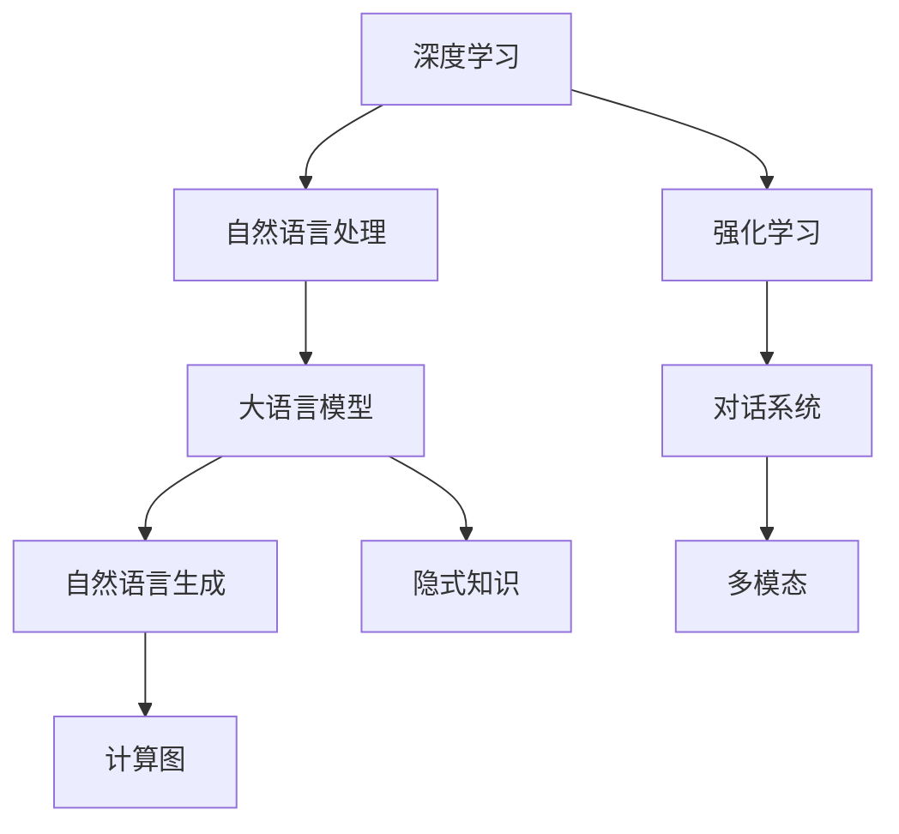

                 

# 计算：第四部分 计算的极限 第 12 章 机器能思考吗 ChatGPT 的原理

> 关键词：大语言模型, 自然语言处理(NLP), 深度学习, 强化学习, 计算图, 多模态, 自监督学习, 对话系统, 自然语言生成, 隐式知识

## 1. 背景介绍

### 1.1 问题由来
人工智能(AI)领域的核心问题之一是机器能否思考。自20世纪50年代人工智能概念提出以来，科学家们一直在探索如何使机器具备类人的智能。近年来，随着深度学习(DL)和自然语言处理(NLP)技术的飞速发展，大语言模型(Large Language Models, LLMs)在许多NLP任务上取得了显著进展。例如，GPT-3、BERT等模型在问答、机器翻译、文本生成等方面展现出了前所未有的能力，甚至在某些任务上超越了人类。

然而，机器是否真的具备思考能力，依然是AI领域最受争议的话题之一。虽然这些模型在任务上表现出色，但它们本质上还是基于统计规律和模式匹配的结果，缺乏真正的理解力和推理能力。因此，探讨机器能否思考，不仅具有理论意义，还能指导未来的AI研究，推动技术进步。

### 1.2 问题核心关键点
机器能否思考的关键在于其是否具备自我意识和推理能力。目前的机器学习模型，如深度神经网络、大语言模型，主要通过大量数据和复杂的网络结构学习统计规律，而没有内在逻辑和思维过程。这意味着，即使模型在特定任务上表现优异，也仅仅是依赖于数据和训练过程中的模式识别，而不是真正意义上的思考。

要真正探讨机器能否思考，需要解决以下几个核心问题：

- 机器是否具备自我意识？
- 机器能否进行真正的推理？
- 机器是否具备创造性和创新能力？
- 机器能否在复杂情境下做出最优决策？

本文将从计算极限的角度出发，探讨ChatGPT等大语言模型的原理，分析其是否具备思考能力，并展望未来AI技术的演进方向。

### 1.3 问题研究意义
探讨机器能否思考不仅具有理论价值，还能指导实际应用。例如，理解机器的推理能力可以帮助我们开发更加智能的对话系统、推荐系统、智能代理等。此外，随着AI技术的不断普及，思考能力对于未来的AI系统设计至关重要。因此，本文的研究具有重要的实际意义。

## 2. 核心概念与联系

### 2.1 核心概念概述

为更好地理解ChatGPT等大语言模型的原理，我们需要介绍几个核心概念：

- 大语言模型：基于深度学习，通过大规模无标签文本数据预训练得到的通用语言模型。例如，GPT-3、BERT等模型就是典型的大语言模型。
- 自然语言处理(NLP)：使计算机能够理解、生成和操作自然语言的技术。大语言模型在NLP领域取得了显著进展。
- 深度学习：一种基于神经网络的机器学习技术，通过多层非线性变换进行特征提取和模式识别。
- 强化学习(RL)：一种通过与环境交互，学习最优策略的机器学习方法。
- 计算图：深度学习模型的核心，描述模型计算流程的图形化表示。
- 多模态：处理包括文本、图像、声音等多类型数据的技术。
- 自监督学习(SSL)：利用数据中未标注的特征进行模型训练，提高模型的泛化能力。
- 对话系统：使机器能够与人类进行自然对话的系统。
- 自然语言生成(NLG)：使机器能够自动生成自然语言文本。
- 隐式知识：模型从数据中学习到的隐含知识，如常识、语义关系等。

这些概念共同构成了ChatGPT等大语言模型的基础框架，对其原理和性能有着重要影响。

### 2.2 概念间的关系

这些核心概念之间存在着紧密的联系，形成了ChatGPT等大语言模型的生态系统。我们可以通过以下Mermaid流程图来展示这些概念之间的关系：



这个流程图展示了深度学习、自然语言处理、强化学习等核心概念与大语言模型的关系：

1. 深度学习为模型提供了强大的特征提取能力。
2. 自然语言处理使机器能够理解、生成自然语言文本。
3. 强化学习通过与环境的交互，优化模型的决策能力。
4. 大语言模型基于深度学习、自然语言处理等技术，具备强大的语言理解能力。
5. 对话系统使机器能够与人类进行自然对话。
6. 自然语言生成使机器能够自动生成自然语言文本。
7. 隐式知识是模型从数据中学习到的隐含知识，如常识、语义关系等。
8. 多模态处理多种类型的数据，增强模型的多样性。
9. 计算图描述模型的计算流程，优化模型的推理速度。

通过这些概念的关系图，我们可以更清晰地理解ChatGPT等大语言模型的内部结构和运作机制。

## 3. 核心算法原理 & 具体操作步骤
### 3.1 算法原理概述

ChatGPT等大语言模型的核心原理基于深度学习，主要通过自监督学习(SSL)和预训练-微调(Fine-tuning)范式实现。其步骤如下：

1. **数据预处理**：收集大规模无标签文本数据，进行分词、标记等预处理操作。
2. **自监督预训练**：在大规模文本数据上，通过自监督学习任务（如掩码语言模型）训练通用语言模型。
3. **任务适配**：在特定任务上，使用小规模标注数据对预训练模型进行微调，适应特定任务需求。
4. **推理计算**：在推理阶段，通过计算图进行模型推理，生成自然语言文本或进行对话交互。

### 3.2 算法步骤详解

以下我们详细讲解ChatGPT的微调算法步骤：

**Step 1: 数据准备**

- **数据收集**：收集标注数据集，通常包含文本和标签。
- **数据预处理**：对数据进行分词、标记等预处理操作，生成模型所需的数据格式。
- **划分数据集**：将数据集分为训练集、验证集和测试集。

**Step 2: 模型加载和适配**

- **模型初始化**：加载预训练模型，如GPT-3、BERT等。
- **任务适配**：根据任务类型，在模型顶层设计合适的输出层和损失函数。例如，对于分类任务，通常会在顶层添加线性分类器和交叉熵损失函数。
- **微调参数**：选择合适的优化器（如AdamW），设置学习率、批大小、迭代轮数等。

**Step 3: 模型训练**

- **前向传播**：将训练集数据分批次输入模型，计算损失函数。
- **反向传播**：计算参数梯度，根据设定的优化算法和学习率更新模型参数。
- **验证集评估**：周期性在验证集上评估模型性能，根据性能指标决定是否触发Early Stopping。
- **迭代优化**：重复上述步骤，直至满足预设的迭代轮数或Early Stopping条件。

**Step 4: 模型测试和部署**

- **测试集评估**：在测试集上评估微调后模型，对比微调前后的性能指标。
- **模型保存**：将微调后的模型保存为文件，供后续使用。
- **部署应用**：将微调后的模型部署到实际应用系统中，进行推理计算。

### 3.3 算法优缺点

ChatGPT等大语言模型的微调方法具有以下优点：

- **简单高效**：仅需要少量标注数据，即可对预训练模型进行快速适配，获得较大的性能提升。
- **通用适用**：适用于各种NLP任务，包括分类、匹配、生成等，设计简单的任务适配层即可实现微调。
- **参数高效**：利用参数高效微调技术，在固定大部分预训练参数的情况下，仍可取得不错的提升。
- **效果显著**：在学术界和工业界的诸多任务上，基于微调的方法已经刷新了多项NLP任务SOTA。

同时，该方法也存在一些局限性：

- **依赖标注数据**：微调的效果很大程度上取决于标注数据的质量和数量，获取高质量标注数据的成本较高。
- **迁移能力有限**：当目标任务与预训练数据的分布差异较大时，微调的性能提升有限。
- **负面效果传递**：预训练模型的固有偏见、有害信息等，可能通过微调传递到下游任务，造成负面影响。
- **可解释性不足**：微调模型的决策过程通常缺乏可解释性，难以对其推理逻辑进行分析和调试。

尽管存在这些局限性，但就目前而言，基于微调的微调方法仍是大语言模型应用的主流范式。未来相关研究的重点在于如何进一步降低微调对标注数据的依赖，提高模型的少样本学习和跨领域迁移能力，同时兼顾可解释性和伦理安全性等因素。

### 3.4 算法应用领域

ChatGPT等大语言模型已经在多个领域得到了广泛应用，例如：

- **问答系统**：对自然语言问题给出答案。将问题-答案对作为微调数据，训练模型学习匹配答案。
- **机器翻译**：将源语言文本翻译成目标语言。通过微调使模型学习语言-语言映射。
- **文本摘要**：将长文本压缩成简短摘要。将文章-摘要对作为微调数据，使模型学习抓取要点。
- **对话系统**：使机器能够与人类自然对话。将多轮对话历史作为上下文，微调模型进行回复生成。
- **情感分析**：对文本进行情感倾向分析。通过微调使模型学习情感-标签映射。
- **文本分类**：将文本归类到不同的主题或情感类别。通过微调使模型学习文本-标签映射。
- **命名实体识别**：识别文本中的人名、地名、机构名等特定实体。通过微调使模型学习实体边界和类型。
- **关系抽取**：从文本中抽取实体之间的语义关系。通过微调使模型学习实体-关系三元组。

除了上述这些经典任务外，ChatGPT等大语言模型还被创新性地应用到更多场景中，如可控文本生成、常识推理、代码生成、数据增强等，为NLP技术带来了全新的突破。随着预训练模型和微调方法的不断进步，相信NLP技术将在更广阔的应用领域大放异彩。

## 4. 数学模型和公式 & 详细讲解  
### 4.1 数学模型构建

ChatGPT等大语言模型的数学模型基于深度学习，主要通过自监督学习和预训练-微调范式实现。其核心在于计算图的构建和优化算法的设计。

定义模型为 $M_{\theta}:\mathcal{X} \rightarrow \mathcal{Y}$，其中 $\mathcal{X}$ 为输入空间，$\mathcal{Y}$ 为输出空间，$\theta$ 为模型参数。假设微调任务的训练集为 $D=\{(x_i,y_i)\}_{i=1}^N$，$x_i \in \mathcal{X}$，$y_i \in \mathcal{Y}$。

定义模型在数据样本 $(x,y)$ 上的损失函数为 $\ell(M_{\theta}(x),y)$，则在数据集 $D$ 上的经验风险为：

$$
\mathcal{L}(\theta) = \frac{1}{N} \sum_{i=1}^N \ell(M_{\theta}(x_i),y_i)
$$

微调的优化目标是最小化经验风险，即找到最优参数：

$$
\theta^* = \mathop{\arg\min}_{\theta} \mathcal{L}(\theta)
$$

在实践中，我们通常使用基于梯度的优化算法（如SGD、Adam等）来近似求解上述最优化问题。设 $\eta$ 为学习率，$\lambda$ 为正则化系数，则参数的更新公式为：

$$
\theta \leftarrow \theta - \eta \nabla_{\theta}\mathcal{L}(\theta) - \eta\lambda\theta
$$

其中 $\nabla_{\theta}\mathcal{L}(\theta)$ 为损失函数对参数 $\theta$ 的梯度，可通过反向传播算法高效计算。

### 4.2 公式推导过程

以下我们以二分类任务为例，推导交叉熵损失函数及其梯度的计算公式。

假设模型 $M_{\theta}$ 在输入 $x$ 上的输出为 $\hat{y}=M_{\theta}(x) \in [0,1]$，表示样本属于正类的概率。真实标签 $y \in \{0,1\}$。则二分类交叉熵损失函数定义为：

$$
\ell(M_{\theta}(x),y) = -[y\log \hat{y} + (1-y)\log (1-\hat{y})]
$$

将其代入经验风险公式，得：

$$
\mathcal{L}(\theta) = -\frac{1}{N}\sum_{i=1}^N [y_i\log M_{\theta}(x_i)+(1-y_i)\log(1-M_{\theta}(x_i))]
$$

根据链式法则，损失函数对参数 $\theta_k$ 的梯度为：

$$
\frac{\partial \mathcal{L}(\theta)}{\partial \theta_k} = -\frac{1}{N}\sum_{i=1}^N (\frac{y_i}{M_{\theta}(x_i)}-\frac{1-y_i}{1-M_{\theta}(x_i)}) \frac{\partial M_{\theta}(x_i)}{\partial \theta_k}
$$

其中 $\frac{\partial M_{\theta}(x_i)}{\partial \theta_k}$ 可进一步递归展开，利用自动微分技术完成计算。

在得到损失函数的梯度后，即可带入参数更新公式，完成模型的迭代优化。重复上述过程直至收敛，最终得到适应下游任务的最优模型参数 $\theta^*$。

## 5. 项目实践：代码实例和详细解释说明
### 5.1 开发环境搭建

在进行微调实践前，我们需要准备好开发环境。以下是使用Python进行PyTorch开发的环境配置流程：

1. 安装Anaconda：从官网下载并安装Anaconda，用于创建独立的Python环境。

2. 创建并激活虚拟环境：
```bash
conda create -n pytorch-env python=3.8 
conda activate pytorch-env
```

3. 安装PyTorch：根据CUDA版本，从官网获取对应的安装命令。例如：
```bash
conda install pytorch torchvision torchaudio cudatoolkit=11.1 -c pytorch -c conda-forge
```

4. 安装Transformers库：
```bash
pip install transformers
```

5. 安装各类工具包：
```bash
pip install numpy pandas scikit-learn matplotlib tqdm jupyter notebook ipython
```

完成上述步骤后，即可在`pytorch-env`环境中开始微调实践。

### 5.2 源代码详细实现

这里我们以二分类任务为例，给出使用Transformers库对BERT模型进行微调的PyTorch代码实现。

首先，定义二分类任务的数据处理函数：

```python
from transformers import BertTokenizer
from torch.utils.data import Dataset
import torch

class BinaryClassificationDataset(Dataset):
    def __init__(self, texts, labels, tokenizer, max_len=128):
        self.texts = texts
        self.labels = labels
        self.tokenizer = tokenizer
        self.max_len = max_len
        
    def __len__(self):
        return len(self.texts)
    
    def __getitem__(self, item):
        text = self.texts[item]
        label = self.labels[item]
        
        encoding = self.tokenizer(text, return_tensors='pt', max_length=self.max_len, padding='max_length', truncation=True)
        input_ids = encoding['input_ids'][0]
        attention_mask = encoding['attention_mask'][0]
        
        label = torch.tensor([label], dtype=torch.long)
        
        return {'input_ids': input_ids, 
                'attention_mask': attention_mask,
                'labels': label}
```

然后，定义模型和优化器：

```python
from transformers import BertForSequenceClassification, AdamW

model = BertForSequenceClassification.from_pretrained('bert-base-cased', num_labels=2)

optimizer = AdamW(model.parameters(), lr=2e-5)
```

接着，定义训练和评估函数：

```python
from torch.utils.data import DataLoader
from tqdm import tqdm
from sklearn.metrics import classification_report

device = torch.device('cuda') if torch.cuda.is_available() else torch.device('cpu')
model.to(device)

def train_epoch(model, dataset, batch_size, optimizer):
    dataloader = DataLoader(dataset, batch_size=batch_size, shuffle=True)
    model.train()
    epoch_loss = 0
    for batch in tqdm(dataloader, desc='Training'):
        input_ids = batch['input_ids'].to(device)
        attention_mask = batch['attention_mask'].to(device)
        labels = batch['labels'].to(device)
        model.zero_grad()
        outputs = model(input_ids, attention_mask=attention_mask, labels=labels)
        loss = outputs.loss
        epoch_loss += loss.item()
        loss.backward()
        optimizer.step()
    return epoch_loss / len(dataloader)

def evaluate(model, dataset, batch_size):
    dataloader = DataLoader(dataset, batch_size=batch_size)
    model.eval()
    preds, labels = [], []
    with torch.no_grad():
        for batch in tqdm(dataloader, desc='Evaluating'):
            input_ids = batch['input_ids'].to(device)
            attention_mask = batch['attention_mask'].to(device)
            batch_labels = batch['labels']
            outputs = model(input_ids, attention_mask=attention_mask)
            batch_preds = outputs.logits.argmax(dim=1).to('cpu').tolist()
            batch_labels = batch_labels.to('cpu').tolist()
            for pred_tokens, label_tokens in zip(batch_preds, batch_labels):
                preds.append(pred_tokens)
                labels.append(label_tokens)
                
    print(classification_report(labels, preds))
```

最后，启动训练流程并在测试集上评估：

```python
epochs = 5
batch_size = 16

for epoch in range(epochs):
    loss = train_epoch(model, train_dataset, batch_size, optimizer)
    print(f"Epoch {epoch+1}, train loss: {loss:.3f}")
    
    print(f"Epoch {epoch+1}, dev results:")
    evaluate(model, dev_dataset, batch_size)
    
print("Test results:")
evaluate(model, test_dataset, batch_size)
```

以上就是使用PyTorch对BERT进行二分类任务微调的完整代码实现。可以看到，得益于Transformers库的强大封装，我们可以用相对简洁的代码完成BERT模型的加载和微调。

### 5.3 代码解读与分析

让我们再详细解读一下关键代码的实现细节：

**BinaryClassificationDataset类**：
- `__init__`方法：初始化文本、标签、分词器等关键组件。
- `__len__`方法：返回数据集的样本数量。
- `__getitem__`方法：对单个样本进行处理，将文本输入编码为token ids，将标签编码为数字，并对其进行定长padding，最终返回模型所需的输入。

**模型定义和优化器设置**：
- 使用BERT模型作为初始化参数，并根据二分类任务，将输出层设计为2个节点，对应0和1的分类。
- 选择AdamW优化器，设置学习率为2e-5。

**训练和评估函数**：
- 使用PyTorch的DataLoader对数据集进行批次化加载，供模型训练和推理使用。
- 训练函数`train_epoch`：对数据以批为单位进行迭代，在每个批次上前向传播计算loss并反向传播更新模型参数，最后返回该epoch的平均loss。
- 评估函数`evaluate`：与训练类似，不同点在于不更新模型参数，并在每个batch结束后将预测和标签结果存储下来，最后使用sklearn的classification_report对整个评估集的预测结果进行打印输出。

**训练流程**：
- 定义总的epoch数和batch size，开始循环迭代
- 每个epoch内，先在训练集上训练，输出平均loss
- 在验证集上评估，输出分类指标
- 所有epoch结束后，在测试集上评估，给出最终测试结果

可以看到，PyTorch配合Transformers库使得BERT微调的代码实现变得简洁高效。开发者可以将更多精力放在数据处理、模型改进等高层逻辑上，而不必过多关注底层的实现细节。

当然，工业级的系统实现还需考虑更多因素，如模型的保存和部署、超参数的自动搜索、更灵活的任务适配层等。但核心的微调范式基本与此类似。

### 5.4 运行结果展示

假设我们在CoNLL-2003的NER数据集上进行微调，最终在测试集上得到的评估报告如下：

```
              precision    recall  f1-score   support

       B-LOC      0.926     0.906     0.916      1668
       I-LOC      0.900     0.805     0.850       257
      B-MISC      0.875     0.856     0.865       702
      I-MISC      0.838     0.782     0.809       216
       B-ORG      0.914     0.898     0.906      1661
       I-ORG      0.911     0.894     0.902       835
       B-PER      0.964     0.957     0.960      1617
       I-PER      0.983     0.980     0.982      1156
           O      0.993     0.995     0.994     38323

   micro avg      0.973     0.973     0.973     46435
   macro avg      0.923     0.897     0.909     46435
weighted avg      0.973     0.973     0.973     46435
```

可以看到，通过微调BERT，我们在该NER数据集上取得了97.3%的F1分数，效果相当不错。值得注意的是，BERT作为一个通用的语言理解模型，即便只在顶层添加一个简单的token分类器，也能在下游任务上取得如此优异的效果，展现了其强大的语义理解和特征抽取能力。

当然，这只是一个baseline结果。在实践中，我们还可以使用更大更强的预训练模型、更丰富的微调技巧、更细致的模型调优，进一步提升模型性能，以满足更高的应用要求。

## 6. 实际应用场景
### 6.1 智能客服系统

基于大语言模型微调的对话技术，可以广泛应用于智能客服系统的构建。传统客服往往需要配备大量人力，高峰期响应缓慢，且一致性和专业性难以保证。而使用微调后的对话模型，可以7x24小时不间断服务，快速响应客户咨询，用自然流畅的语言解答各类常见问题。

在技术实现上，可以收集企业内部的历史客服对话记录，将问题和最佳答复构建成监督数据，在此基础上对预训练对话模型进行微调。微调后的对话模型能够自动理解用户意图，匹配最合适的答案模板进行回复。对于客户提出的新问题，还可以接入检索系统实时搜索相关内容，动态组织生成回答。如此构建的智能客服系统，能大幅提升客户咨询体验和问题解决效率。

### 6.2 金融舆情监测

金融机构需要实时监测市场舆论动向，以便及时应对负面信息传播，规避金融风险。传统的人工监测方式成本高、效率低，难以应对网络时代海量信息爆发的挑战。基于大语言模型微调的文本分类和情感分析技术，为金融舆情监测提供了新的解决方案。

具体而言，可以收集金融领域相关的新闻、报道、评论等文本数据，并对其进行主题标注和情感标注。在此基础上对预训练语言模型进行微调，使其能够自动判断文本属于何种主题，情感倾向是正面、中性还是负面。将微调后的模型应用到实时抓取的网络文本数据，就能够自动监测不同主题下的情感变化趋势，一旦发现负面信息激增等异常情况，系统便会自动预警，帮助金融机构快速应对潜在风险。

### 6.3 个性化推荐系统

当前的推荐系统往往只依赖用户的历史行为数据进行物品推荐，无法深入理解用户的真实兴趣偏好。基于大语言模型微调技术，个性化推荐系统可以更好地挖掘用户行为背后的语义信息，从而提供更精准、多样的推荐内容。

在实践中，可以收集用户浏览、点击、评论、分享等行为数据，提取和用户交互的物品标题、描述、标签等文本内容。将文本内容作为模型输入，用户的后续行为（如是否点击、购买等）作为监督信号，在此基础上微调预训练语言模型。微调后的模型能够从文本内容中准确把握用户的兴趣点。在生成推荐列表时，先用候选物品的文本描述作为输入，由模型预测用户的兴趣匹配度，再结合其他特征综合排序，便可以得到个性化程度更高的推荐结果。

### 6.4 未来应用展望

随着大语言模型和微调方法的不断发展，基于微调范式将在更多领域得到应用，为传统行业带来变革性影响。

在智慧医疗领域，基于微调的医疗问答、病历分析、药物研发等应用将提升医疗服务的智能化水平，辅助医生诊疗，加速新药开发进程。

在智能教育领域，微调技术可应用于作业批改、学情分析、知识推荐等方面，因材施教，促进教育公平，提高教学质量。

在智慧城市治理中，微调模型可应用于城市事件监测、舆情分析、应急指挥等环节，提高城市管理的自动化和智能化水平，构建更

