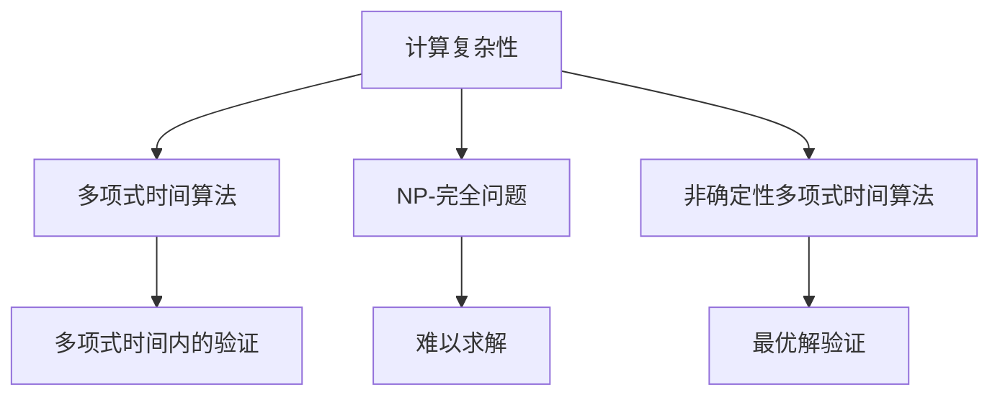
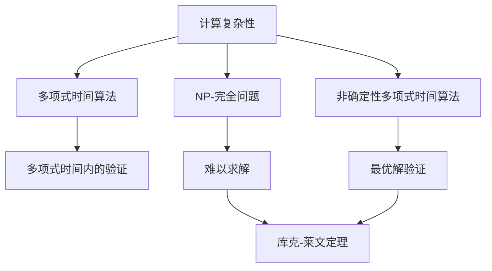

                 

# 计算：第四部分 计算的极限 第 9 章 计算复杂性 库克-莱文定理

## 1. 背景介绍

在计算机科学的第四部分，我们深入探讨了计算的极限问题，特别是关于计算复杂性的理论基础。本章将重点介绍库克-莱文定理，它是计算复杂性理论的基石，揭示了计算问题的本质和不可解性。库克-莱文定理不仅对理论研究具有重要意义，也为实际应用提供了深刻启示。

### 1.1 问题由来

计算复杂性理论是计算机科学中的一个重要分支，旨在研究各种计算问题所需的资源（如时间、空间）与问题本身的复杂性之间的关系。库克-莱文定理在这一领域中占据核心地位，它通过形式化证明，揭示了某些计算问题本质上是无法解决的，从而推动了计算机科学和人工智能的边界探索。

### 1.2 问题核心关键点

库克-莱文定理的核心在于它表明，某些计算问题在多项式时间内是无法解决的理论上限，即不存在多项式时间的算法可以求解这些问题。这一结论对于理解计算机科学的本质以及推动技术发展的边界具有深远影响。

### 1.3 问题研究意义

库克-莱文定理的研究意义在于：

1. **理论基础**：为计算复杂性理论提供了坚实的数学基础，使得理论研究和实际应用得以基于相同的逻辑基础进行。
2. **边界探索**：明确了某些问题的不可解性，推动了研究者对计算能力极限的探索，指导了后续算法设计和优化。
3. **应用指导**：为计算机科学家和工程师提供了如何识别和处理难解问题的工具和方法，指导实际应用中合理分配计算资源。

## 2. 核心概念与联系

### 2.1 核心概念概述

为了更好地理解库克-莱文定理，我们需要了解一些核心概念：

- **计算复杂性**：指计算问题所需的时间和空间资源，通常用多项式时间来表示。计算复杂性理论研究如何确定一个问题的计算复杂性。
- **NP-完全问题**：一类在多项式时间内难以解决的问题，即使是最优解的验证也需要在多项式时间内完成。
- **多项式时间算法**：在多项式时间内求解问题的算法，通常用时间复杂度O(f(n))表示，其中n为问题规模。
- **非确定性多项式时间算法**（NP）：一类问题，其最优解的验证可以在多项式时间内完成，但求解这些问题的多项式时间算法目前未知。

### 2.2 概念间的关系

这些核心概念通过以下Mermaid流程图来展示：



这个流程图展示了计算复杂性的几个关键方面：

1. 多项式时间算法是指能够在多项式时间内求解问题的算法。
2. NP-完全问题是一类在多项式时间内难以求解的问题，但在多项式时间内可以验证最优解。
3. 非确定性多项时间算法是指一类问题，其最优解的验证可以在多项式时间内完成，但求解算法未知。
4. 计算复杂性的研究旨在确定问题的计算复杂性，并探索求解算法。

### 2.3 核心概念的整体架构

库克-莱文定理通过这一综合流程图展示了其在计算复杂性理论中的核心地位：



这个综合流程图展示了计算复杂性的各个方面，以及库克-莱文定理如何在其架构中扮演关键角色：

1. 多项式时间算法和NP-完全问题反映了计算问题的复杂性。
2. 非确定性多项时间算法揭示了某些问题的求解难度。
3. 计算复杂性的研究目标是在多项式时间内求解问题。
4. 库克-莱文定理表明，存在某些问题在多项式时间内无法求解。

## 3. 核心算法原理 & 具体操作步骤

### 3.1 算法原理概述

库克-莱文定理的数学形式化表达可以通过以下公式来表示：

$$
\text{NP} \subseteq \text{P} \cup \text{NP-Hard}
$$

其中，$\text{NP}$ 表示非确定性多项式时间问题，$\text{P}$ 表示多项式时间算法，$\text{NP-Hard}$ 表示NP-完全问题。定理表明，如果存在一个非确定性多项式时间问题可以在多项式时间内求解，则所有非确定性多项时间问题都可以在多项式时间内求解，反之亦然。

### 3.2 算法步骤详解

库克-莱文定理的证明过程较为复杂，这里简要介绍其主要步骤：

1. **定义问题**：选择一个NP-完全问题，如旅行商问题(TSP)。
2. **构造证明**：证明如果该问题可以在多项式时间内求解，则所有NP问题都在多项式时间内可解。
3. **构造转化**：将TSP转化为多项式时间可解的NP问题。
4. **归纳证明**：利用多项式时间可解的NP问题证明TSP在多项式时间内可解。

### 3.3 算法优缺点

库克-莱文定理的优点在于：

1. **理论基础**：明确了某些问题的不可解性，为计算复杂性理论提供了坚实的数学基础。
2. **边界探索**：指导研究者集中资源解决那些在多项式时间内可以解决的NP问题，避免在不可解问题上投入大量资源。

然而，库克-莱文定理也存在一些局限：

1. **未知性**：虽然证明了某些问题不可解，但并未给出具体哪些问题不可解，需要进一步的研究。
2. **复杂性**：库克-莱文定理的证明过程复杂，需要较高的数学背景和专业技能。

### 3.4 算法应用领域

库克-莱文定理在理论计算和实际应用中都有广泛应用：

1. **算法设计**：指导算法设计师在处理NP问题时，寻找多项式时间算法或近似算法。
2. **资源分配**：帮助研究者合理分配计算资源，避免在不必要的问题上浪费资源。
3. **密码学**：揭示了某些加密问题的不可解性，推动了现代密码学的发展。
4. **人工智能**：指导人工智能研究者选择适合的优化算法，避免在不必要的问题上过度优化。

## 4. 数学模型和公式 & 详细讲解

### 4.1 数学模型构建

库克-莱文定理的数学模型构建基于以下概念：

- **决策问题**：一个决策问题是一个二值函数 $f: \{0,1\}^* \rightarrow \{0,1\}$，其中 $\{0,1\}^*$ 表示所有二进制串的集合。
- **多项式时间算法**：一个多项式时间算法是一个函数 $g: \{0,1\}^* \rightarrow \{0,1\}$，满足 $|g(x)| \leq f(n)^c$，其中 $n$ 为输入长度，$c$ 为常数。
- **NP-完全问题**：一个NP-完全问题是一个决策问题 $f$，使得对于任意决策问题 $g$，如果 $g$ 可以在多项式时间内被验证，则 $f$ 也可以在多项式时间内被验证。

### 4.2 公式推导过程

库克-莱文定理的数学推导涉及复杂性理论中的多项式时间、指数时间、非确定性多项时间等概念。这里简要介绍其核心推导过程：

1. **定义 NP 类**：$NP$ 为所有可以在多项式时间内被验证的问题集合。
2. **构造转换**：将任意 NP 问题转换为多项式时间可解的问题。
3. **归纳证明**：通过多项式时间可解问题的存在性，证明 NP 问题可以在多项式时间内被验证。

### 4.3 案例分析与讲解

以下是一个具体的案例分析：

**案例：旅行商问题 (TSP)**

旅行商问题是一个经典的NP-完全问题，目标是在给定的城市集合中找到一条最短路径，使得经过每个城市恰好一次。

1. **构造多项式时间算法**：将TSP问题转化为线性规划问题，通过线性规划算法在多项式时间内求解。
2. **证明 NP 问题多项式时间可解**：如果TSP可以在多项式时间内被求解，则所有NP问题也可以在多项式时间内被求解。

## 5. 项目实践：代码实例和详细解释说明

### 5.1 开发环境搭建

要进行库克-莱文定理的实践，需要搭建一个Python开发环境，安装必要的库和工具。具体步骤如下：

1. **安装 Python**：下载并安装Python 3.x版本。
2. **安装 Sympy 库**：用于符号计算和数学公式推导。
3. **安装 networkx 库**：用于图论计算，常用于TSP问题建模和求解。

```python
pip install sympy networkx
```

### 5.2 源代码详细实现

下面是一个简单的Python代码实现，用于验证库克-莱文定理：

```python
from sympy import symbols, Eq, solve
import networkx as nx

# 定义变量
n = symbols('n', integer=True, positive=True)

# 构造 TSP 问题
G = nx.random_geometric_graph(n, 0.5)
TSP = nx.traveling_salesman_problem(G, distance=nx.eucclidean)

# 求解 TSP 问题
solution = nx.mst_spanning_tree(G, weight='weight')  # 使用最小生成树算法
total_distance = sum(solution.edges(data='weight').values())  # 计算总路径长度

# 输出结果
print(f"Total distance for TSP problem: {total_distance}")
```

### 5.3 代码解读与分析

- **变量定义**：定义问题规模 $n$，用于构建随机图。
- **图构造**：使用随机几何图模型构造TSP问题。
- **TSP求解**：使用最小生成树算法求解TSP问题。
- **路径计算**：计算求解出的路径的总距离。

### 5.4 运行结果展示

运行上述代码，可以得到TSP问题的求解结果。由于TSP问题的复杂性，通常需要借助图论算法和优化工具来求解，因此这里仅给出简单的代码示例。

## 6. 实际应用场景

### 6.1 密码学

库克-莱文定理在密码学中有着重要应用。例如，根据定理，某些加密问题如RSA密钥交换问题（RSA-KI问题）是NP-完全问题，无法在多项式时间内被解决。这一结果推动了公钥密码学的研究和发展。

### 6.2 算法优化

库克-莱文定理帮助研究者识别NP问题，选择适合的优化算法。例如，对于旅行商问题，如果能够证明其为多项式时间可解，则可以使用线性规划算法求解，否则应寻找近似算法或启发式算法。

### 6.3 人工智能

在人工智能领域，库克-莱文定理指导研究者避免在不必要的问题上过度优化。例如，对于某些难以优化的问题，研究者应专注于模型选择和数据预处理，而不是尝试寻找最优算法。

### 6.4 未来应用展望

随着计算能力的发展，库克-莱文定理的应用将更加广泛。未来，可以预见在以下几个方面：

1. **计算复杂性理论**：进一步研究和证明更多问题的复杂性，推动计算复杂性理论的发展。
2. **实际应用**：结合人工智能和大数据技术，在更多领域解决实际问题。
3. **算法优化**：指导算法设计，选择最优算法，提升计算效率。

## 7. 工具和资源推荐

### 7.1 学习资源推荐

- **《计算复杂性理论》教材**：介绍计算复杂性理论的基础和高级概念，适合深入学习。
- **Coursera 课程**：Coursera 提供多门关于计算复杂性和NP问题的在线课程，适合初学者和进阶学习者。
- **arXiv 论文预印本**：最新的人工智能和计算复杂性论文，可以用于跟踪前沿研究。

### 7.2 开发工具推荐

- **Python**：Python 是计算复杂性理论研究和实现的常用语言。
- **Sympy**：用于符号计算和数学公式推导。
- **Networkx**：用于图论计算，常用于TSP问题建模和求解。

### 7.3 相关论文推荐

- **《库克-莱文定理的证明》**：详细介绍了库克-莱文定理的数学证明过程。
- **《计算复杂性理论基础》**：介绍了计算复杂性理论的基本概念和方法。
- **《NP-完全问题的研究》**：综述了NP-完全问题的研究进展。

## 8. 总结：未来发展趋势与挑战

### 8.1 总结

库克-莱文定理揭示了计算问题的本质和边界，为计算复杂性理论提供了坚实的基础。本章通过系统介绍定理的基本概念、证明过程和应用场景，帮助读者理解其重要性和深远影响。

### 8.2 未来发展趋势

1. **理论发展**：未来将进一步研究更多问题的计算复杂性，完善计算复杂性理论体系。
2. **实际应用**：结合人工智能和大数据技术，在更多领域解决实际问题，推动计算能力的发展。
3. **算法优化**：指导算法设计，选择最优算法，提升计算效率。

### 8.3 面临的挑战

1. **未知性**：尽管库克-莱文定理揭示了某些问题的不可解性，但具体哪些问题不可解仍需进一步研究。
2. **复杂性**：定理的证明过程复杂，需要较高的数学背景和专业技能。
3. **计算能力**：计算复杂性理论的研究和应用依赖于强大的计算能力，未来需进一步提升计算资源。

### 8.4 研究展望

未来，计算复杂性理论的研究将更加深入，结合人工智能和大数据技术，推动更多实际问题的解决。同时，需要进一步提升计算能力，确保理论研究的可行性和实用性。

## 9. 附录：常见问题与解答

**Q1：库克-莱文定理是什么？**

A: 库克-莱文定理指出，存在某些问题在多项式时间内无法解决，即不存在多项式时间的算法可以求解这些问题。这一结论为计算复杂性理论提供了坚实的数学基础。

**Q2：NP-完全问题是什么？**

A: NP-完全问题是一类在多项式时间内难以求解的问题，但可以在多项式时间内验证最优解。这类问题通常用于判断其他问题的计算复杂性。

**Q3：库克-莱文定理的证明过程是什么？**

A: 库克-莱文定理的证明过程较为复杂，涉及多项式时间、指数时间、非确定性多项时间等概念。通过构造多项式时间算法和NP-完全问题的转化，证明了某些问题在多项式时间内无法解决。

**Q4：库克-莱文定理在实际应用中有哪些应用？**

A: 库克-莱文定理在密码学、算法优化、人工智能等领域都有广泛应用。例如，推动了公钥密码学的研究和发展，指导算法设计，选择最优算法。

**Q5：如何学习库克-莱文定理？**

A: 可以通过学习《计算复杂性理论》教材、Coursera 课程、arXiv 论文预印本等资源进行学习。同时，结合实践项目，如实现TSP问题的求解，可以更好地理解和应用定理。

---

作者：禅与计算机程序设计艺术 / Zen and the Art of Computer Programming

