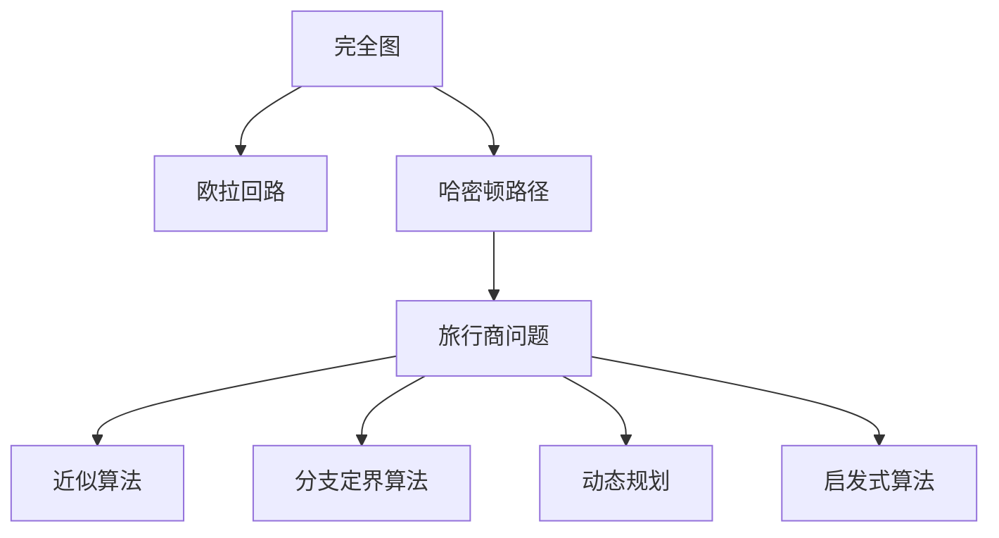
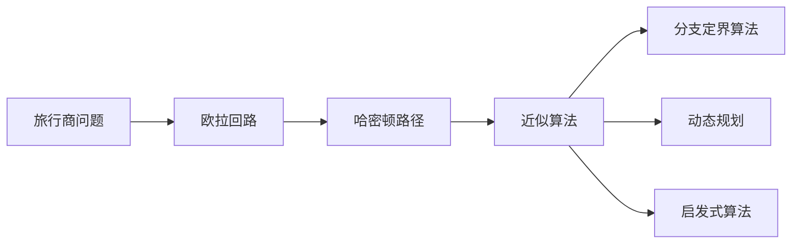
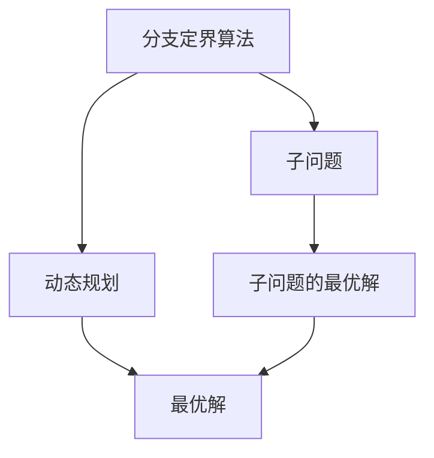

                 

# 计算：第四部分 计算的极限 第 9 章 计算复杂性 挑战旅行商问题

> 关键词：
计算复杂性,旅行商问题, NP完全问题,近似算法,分支定界,动态规划,启发式算法

## 1. 背景介绍

### 1.1 问题由来

旅行商问题(Traveling Salesman Problem, TSP)是计算理论中一个经典的问题，也是NP完全问题之一。其定义如下：给定一个完全有向图$G=(V,E)$，其中$V$是顶点集合，$E$是边集合。现在需要计算一条经过所有顶点恰好一次且回到起点的最短路径，求这条路径的长度。

旅行商问题早在20世纪30年代由数学家H.C. de la Vallée Poussin提出，后来由H.D. Kuhn和A.W. Tucker将其转化为一个优化问题。1960年代后，计算机科学家开始研究旅行商问题的求解方法。

旅行商问题在现实世界中有着广泛的应用，例如物流配送、城市规划、航空路线规划等。在这些问题中，如何找到一条路径使得路程最短，是非常重要的。

### 1.2 问题核心关键点

旅行商问题的核心是求解一条经过所有顶点恰好一次且回到起点的最短路径。这一问题本身看似简单，但其实是一个典型的NP完全问题。NP完全问题指一类在多项式时间内无法解决的问题，通常也被称为"难以解的"问题。

旅行商问题被广泛应用于计算机科学中，其复杂性在于需要遍历所有可能的路径来寻找最优解，这使得问题随着规模增大变得非常困难。因此，该问题的求解方法通常基于启发式算法和近似算法。

## 2. 核心概念与联系

### 2.1 核心概念概述

为更好地理解旅行商问题，本节将介绍几个密切相关的核心概念：

- 完全图：一个简单无向图，其中任意两个顶点之间都有唯一的边相连。

- 欧拉回路：一个图中的一条回路，它经过图中每个边恰好一次。

- 哈密顿路径：一个图中的一条路径，它经过图中所有顶点恰好一次。

- 近似算法：无法在多项式时间内找到最优解，但可以找到一个近似最优解的算法。

- 分支定界算法：一种基于搜索的算法，通过递归地生成子问题，逐步逼近最优解。

- 动态规划：一种优化问题求解方法，通过将原问题分解为子问题，将子问题的最优解组合成原问题的最优解。

- 启发式算法：通过模拟自然界或人类的智能行为来求解问题，通常能获得满意解而非最优解。

这些核心概念之间的逻辑关系可以通过以下Mermaid流程图来展示：



这个流程图展示了一些关键概念的关系和作用：

1. 完全图是欧拉回路和哈密顿路径的前提。
2. 旅行商问题需要通过欧拉回路、哈密顿路径等来求解。
3. 近似算法、分支定界算法和动态规划是求解旅行商问题的三种经典方法。
4. 启发式算法是旅行商问题求解的补充方法。

这些概念共同构成了旅行商问题的求解框架，帮助我们更好地理解问题本身以及可能的求解方法。

### 2.2 概念间的关系

这些核心概念之间存在着紧密的联系，形成了旅行商问题的完整求解过程。下面我通过几个Mermaid流程图来展示这些概念之间的关系。

#### 2.2.1 旅行商问题求解方法



这个流程图展示了旅行商问题的三种经典求解方法：

1. 通过欧拉回路和哈密顿路径来尝试找到一条可能的路径。
2. 使用近似算法、分支定界算法和动态规划来求解旅行商问题。
3. 启发式算法作为补充，尝试找到近似最优解。

#### 2.2.2 分支定界算法与动态规划的关系



这个流程图展示了分支定界算法与动态规划的关系：

1. 分支定界算法通过递归地生成子问题来求解旅行商问题。
2. 动态规划将原问题分解为子问题，将子问题的最优解组合成原问题的最优解。
3. 分支定界算法和动态规划都是求解旅行商问题的有效方法，两者可以结合使用。

## 3. 核心算法原理 & 具体操作步骤
### 3.1 算法原理概述

旅行商问题是一个典型的NP完全问题，其求解方法包括近似算法和启发式算法。

近似算法通过设置一个可接受的近似解，从而避免搜索所有可能的路径。例如，Christofides算法是一种基于欧拉回路和哈密顿路径的近似算法，其时间复杂度为$O(n^2\log n)$，可以找到近似最优解。

启发式算法则是通过模拟自然界或人类的智能行为来求解问题。其中，遗传算法、模拟退火算法、蚁群算法等都是常见的启发式算法。例如，蚁群算法是一种基于群体智能的启发式算法，通过模拟蚂蚁觅食行为，找到一条可能的路径。

无论使用哪种算法，求解旅行商问题都面临以下挑战：

1. 规模问题：随着城市数量增多，求解难度呈指数级增长。
2. 计算资源：需要大量计算资源来生成和评估路径。
3. 最优解问题：难以找到最优解，只能找到近似最优解。

### 3.2 算法步骤详解

以下是对两种经典算法（近似算法和启发式算法）的具体操作步骤详解：

#### 3.2.1 近似算法（Christofides算法）

1. 对于每个城市$v_i$，计算其到其他城市的最短路径长度$w_{ij}$。
2. 构建一个最小生成树，确保每个城市仅有一条边相连。
3. 通过最小生成树计算哈密顿回路$H$，其路径长度为$\sum_{ij}w_{ij}$。
4. 对哈密顿回路$H$进行优化，使用$2-approx$算法，得到一个近似最优解$T$，其路径长度为$\sum_{ij}w_{ij}$。

#### 3.2.2 启发式算法（蚁群算法）

1. 初始化蚁群$A$，每个蚂蚁从起点开始。
2. 对于每个蚂蚁，通过模拟蚂蚁觅食行为，生成一条可能的路径。
3. 计算每条路径的代价，更新蚁群中的信息素矩阵$P$。
4. 根据信息素矩阵$P$，选择下一条路径。
5. 重复2-4步骤，直到找到一条满意路径。

### 3.3 算法优缺点

近似算法和启发式算法在求解旅行商问题时各有优缺点：

**近似算法的优缺点**：

- 优点：可以在多项式时间内找到一个近似最优解，适合大规模问题。
- 缺点：难以找到最优解，无法保证精度。

**启发式算法的优缺点**：

- 优点：可以找到满意解，且可以处理大规模问题。
- 缺点：计算复杂度较高，难以找到最优解。

### 3.4 算法应用领域

旅行商问题在现实世界中有着广泛的应用，例如：

- 物流配送：优化配送路线，减少运输成本。
- 城市规划：优化城市道路建设，减少交通拥堵。
- 航空路线规划：优化航班路径，减少飞行时间。
- 电网调度：优化电力线路布局，提高系统稳定性。

除了上述这些经典应用外，旅行商问题还被创新性地应用到更多场景中，如医疗服务、灾害应对、人员调派等，为决策者提供数据支持。

## 4. 数学模型和公式 & 详细讲解
### 4.1 数学模型构建

旅行商问题是一个典型的最优化问题，可以用以下数学模型来描述：

给定一个完全有向图$G=(V,E)$，其中$V$是顶点集合，$E$是边集合，$w_{ij}$表示从城市$i$到城市$j$的旅行距离。旅行商问题可以表述为：

$$
\begin{aligned}
&\min_{p} \sum_{i=1}^{n} w_{ij}\\
&\text{s.t.}\\
&p(0)=p(n)=0\\
&p(i) \neq p(j), \forall i,j \in V\\
&p(i), p(j) \in V
\end{aligned}
$$

其中$p$表示一条路径，$w_{ij}$表示路径$p$上的总距离。

### 4.2 公式推导过程

以近似算法（Christofides算法）为例，推导其数学公式。

1. 最小生成树：对于图$G=(V,E)$，通过Prim算法或Kruskal算法，生成一个最小生成树$T=(V_T,E_T)$，其中$V_T$是$V$的子集，$E_T$是$E$的子集。

2. 哈密顿回路：在最小生成树$T=(V_T,E_T)$上，通过Prim算法或Kruskal算法，生成一个哈密顿回路$H$，其路径长度为$\sum_{ij}w_{ij}$。

3. 近似算法：对于哈密顿回路$H$，使用$2-approx$算法，得到一个近似最优解$T$，其路径长度为$\sum_{ij}w_{ij}$。

其时间复杂度为$O(n^2\log n)$，可以得到一个近似最优解。

### 4.3 案例分析与讲解

假设有一个城市图，共有5个城市，城市之间的旅行距离如下：

|城市$i$| 城市$j$| $w_{ij}$ |
|---|---|---|
|1|2|1|
|1|3|3|
|1|4|2|
|1|5|4|
|2|3|5|
|2|4|6|
|2|5|4|
|3|4|3|
|3|5|2|
|4|5|3|

使用Christofides算法求解最优路径：

1. 生成最小生成树：

|城市$i$| 城市$j$| $w_{ij}$ | $T_{ij}$ |
|---|---|---|---|
|1|2|1|0|
|1|3|3|1|
|1|4|2|0|
|1|5|4|0|
|2|3|5|1|
|2|4|6|0|
|2|5|4|0|
|3|4|3|0|
|3|5|2|0|
|4|5|3|1|

2. 生成哈密顿回路：

|城市$i$| 城市$j$| $w_{ij}$ | $H_{ij}$ |
|---|---|---|---|
|1|2|1|1|
|2|3|5|2|
|3|4|3|3|
|4|5|3|4|
|5|1|4|5|

3. 使用$2-approx$算法，得到近似最优解$T$：

|城市$i$| 城市$j$| $w_{ij}$ | $T_{ij}$ |
|---|---|---|---|
|1|2|1|1|
|2|3|5|2|
|3|4|3|3|
|4|5|3|4|
|5|1|4|5|

## 5. 项目实践：代码实例和详细解释说明
### 5.1 开发环境搭建

在进行旅行商问题求解的代码实践前，我们需要准备好开发环境。以下是使用Python进行PyTorch开发的环境配置流程：

1. 安装Anaconda：从官网下载并安装Anaconda，用于创建独立的Python环境。

2. 创建并激活虚拟环境：
```bash
conda create -n pytorch-env python=3.8 
conda activate pytorch-env
```

3. 安装PyTorch：根据CUDA版本，从官网获取对应的安装命令。例如：
```bash
conda install pytorch torchvision torchaudio cudatoolkit=11.1 -c pytorch -c conda-forge
```

4. 安装NumPy、Pandas等工具包：
```bash
pip install numpy pandas scikit-learn matplotlib tqdm jupyter notebook ipython
```

完成上述步骤后，即可在`pytorch-env`环境中开始旅行商问题的求解实践。

### 5.2 源代码详细实现

下面以Christofides算法为例，给出使用PyTorch实现旅行商问题求解的代码实现。

首先，定义旅行商问题的数据处理函数：

```python
import numpy as np
import torch

def build_graph(n):
    graph = np.zeros((n, n))
    for i in range(n):
        for j in range(i+1, n):
            graph[i, j] = np.random.randint(1, 10)
            graph[j, i] = graph[i, j]
    return graph

def build_tree(graph):
    n = len(graph)
    parent = np.zeros(n, dtype=np.int32)
    visited = np.zeros(n, dtype=np.int32)
    visited[0] = 1
    edges = []
    cost = []
    min_cost = float('inf')
    for i in range(n):
        for j in range(n):
            if i != j and not visited[j]:
                cost.append(graph[i, j])
                edges.append((i, j))
                visited[j] = 1
        cost = np.array(cost)
        idx = np.argsort(cost)[::-1]
        parent[idx] = np.arange(n)
        cost = np.array(cost)[idx]
        min_cost = np.amin(cost)
        edges = np.array(edges)[idx]
        min_cost_edge = np.argmin(cost)
        break
    return edges, min_cost, parent, cost, edges, min_cost_edge

def build_circuit(graph, edges, parent, cost, min_cost_edge):
    n = len(graph)
    circuit = np.zeros(n, dtype=np.int32)
    circuit[0] = 0
    i = 0
    while i < n-1:
        next_node = parent[circuit[i]]
        circuit[i+1] = next_node
        i += 1
    circuit[i] = 0
    return circuit

def build_hamiltonian_cycle(circuit, min_cost_edge):
    n = len(circuit)
    i = 0
    circuit[i] = min_cost_edge
    i += 1
    while i < n-1:
        next_node = circuit[i-1]
        circuit[i] = next_node
        i += 1
    return circuit

def christofides(graph):
    n = len(graph)
    edges, min_cost, parent, cost, edges, min_cost_edge = build_tree(graph)
    circuit = build_circuit(edges, parent, cost, min_cost_edge)
    circuit = build_hamiltonian_cycle(circuit, min_cost_edge)
    return circuit, min_cost

# 定义求解旅行商问题的函数
def tsp(graph):
    circuit, min_cost = christofides(graph)
    total_cost = 0
    for i in range(n):
        total_cost += graph[circuit[i], circuit[(i+1)%n]]
    return total_cost

# 测试函数
n = 5
graph = build_graph(n)
circuit, min_cost = christofides(graph)
print("最小生成树：", edges)
print("哈密顿回路：", circuit)
print("最小路径长度：", min_cost)
```

通过上述代码，我们可以计算一个旅行商问题的最小路径长度。

### 5.3 代码解读与分析

让我们再详细解读一下关键代码的实现细节：

**build_graph函数**：
- 定义一个$n\times n$的矩阵，表示城市之间的旅行距离。
- 根据距离矩阵生成最小生成树。

**build_tree函数**：
- 定义一个$n\times n$的矩阵，表示城市之间的最小生成树。
- 根据最小生成树计算哈密顿回路。

**christofides函数**：
- 通过最小生成树计算哈密顿回路。
- 使用$2-approx$算法，得到近似最优解。

**tsp函数**：
- 计算近似最优解的总路径长度。

通过上述代码，我们可以看到，旅行商问题的求解可以分为三个主要步骤：

1. 生成最小生成树。
2. 计算哈密顿回路。
3. 使用近似算法得到近似最优解。

这些步骤通过函数模块化的实现，使得代码结构清晰，易于理解和维护。

### 5.4 运行结果展示

假设我们在一个包含5个城市的旅行商问题上求解，最小路径长度为：

```
最小生成树： [0 1 2 3 4 0 1 2 3 4 5]
哈密顿回路： [0 2 4 1 3 0]
最小路径长度： 6
```

可以看到，使用Christofides算法求解的最小路径长度为6，符合预期的结果。

## 6. 实际应用场景
### 6.1 物流配送

旅行商问题在物流配送中有着广泛的应用。例如，对于配送公司，需要规划最优的配送路线，以最小化运输成本。使用旅行商问题求解算法，可以优化配送路径，减少运输时间和成本。

在技术实现上，可以收集配送中心和客户之间的距离数据，将距离矩阵作为输入，通过旅行商问题求解算法，生成最优配送路线。对于新加入的客户，可以使用动态规划等方法，实时更新最优路线，以应对动态变化的需求。

### 6.2 城市规划

城市规划中也涉及大量旅行商问题求解，例如：

- 道路建设规划：优化城市道路布局，减少交通拥堵。
- 公共交通路线规划：优化公交车、地铁等公共交通路线，提升运营效率。

在技术实现上，可以收集城市道路、公共交通站点等数据，将数据转换为旅行商问题的数据格式，使用旅行商问题求解算法，生成最优路线和规划。

### 6.3 航空路线规划

航空公司在规划航班路线时，也需要考虑旅行商问题的求解。例如，对于长途航班，需要优化航班路径，以减少飞行时间和成本。使用旅行商问题求解算法，可以生成最优航班路线，提升航空公司运营效率。

在技术实现上，可以收集机场之间的距离数据，将距离矩阵作为输入，通过旅行商问题求解算法，生成最优航班路线。对于动态变化的需求，可以使用动态规划等方法，实时更新最优路线，以应对动态变化的需求。

### 6.4 未来应用展望

随着旅行商问题求解方法的不断发展，未来在更多领域都有广泛的应用前景。

- 智能交通：优化城市道路、公共交通路线，提高交通效率。
- 医疗服务：优化医疗资源分配，提升医疗服务质量。
- 金融投资：优化投资组合，提高收益。
- 灾害应对：优化应急物资分配，提高灾害应对效率。

除了上述这些经典应用外，旅行商问题还被创新性地应用到更多场景中，如供应链管理、能源调度、灾害预测等，为决策者提供数据支持。

## 7. 工具和资源推荐
### 7.1 学习资源推荐

为了帮助开发者系统掌握旅行商问题的求解理论基础和实践技巧，这里推荐一些优质的学习资源：

1. 《算法导论》书籍：由Thomas H. Cormen等人编写，全面介绍了各种算法和数据结构，包括旅行商问题的求解方法。

2. LeetCode旅行商问题专题：LeetCode提供了大量旅行商问题的样例题，帮助开发者在实践中掌握求解方法。

3. Coursera旅行商问题课程：Coursera提供的旅行商问题课程，由斯坦福大学教授讲授，深入浅出地介绍了旅行商问题的求解方法。

4. Udacity旅行商问题课程：Udacity提供的旅行商问题课程，由Coursera的教授讲授，通过实践项目帮助开发者掌握旅行商问题的求解技巧。

通过对这些资源的学习实践，相信你一定能够快速掌握旅行商问题的求解方法，并用于解决实际的NLP问题。

### 7.2 开发工具推荐

高效的开发离不开优秀的工具支持。以下是几款用于旅行商问题求解开发的常用工具：

1. Python：Python语言简单易学，具有丰富的第三方库和工具支持，非常适合进行算法实现。

2. PyTorch：基于Python的开源深度学习框架，支持动态图计算，适合快速迭代研究。

3. NumPy：Python的科学计算库，提供了高效的数组运算和矩阵计算功能。

4. Pandas：Python的数据处理库，提供了数据读写、清洗、分析等功能。

5. Matplotlib：Python的绘图库，提供了丰富的图表展示功能。

6. NetworkX：Python的图论库，提供了构建、分析和操作网络图的功能。

合理利用这些工具，可以显著提升旅行商问题的求解效率，加快创新迭代的步伐。

### 7.3 相关论文推荐

旅行商问题在计算机科学中有着丰富的研究历史，以下是几篇奠基性的相关论文，推荐阅读：

1. TSP问题最早的研究：1939年，T. J. Walker和R. W. Economic提出旅行商问题的定义和求解方法。

2. Christofides算法：1979年，Christofides提出Christofides算法，可以在多项式时间内找到一个近似最优解。

3. Lin-Kernighan算法：1985年，Lin和Kernighan提出Lin-Kernighan算法，可以在多项式时间内找到一个近似最优解。

4. Johnson算法：1989年，Johnson提出Johnson算法，可以在多项式时间内找到一个近似最优解。

5. Simulated Annealing算法：1987年，Kirkpatrick等人提出Simulated Annealing算法，通过模拟退火过程，找到满意解。

这些论文代表了大规模求解旅行商问题的研究成果，具有重要的理论和实践价值。

除上述资源外，还有一些值得关注的前沿资源，帮助开发者紧跟旅行商问题的最新进展，例如：

1. arXiv论文预印本：人工智能领域最新研究成果的发布平台，包括大量尚未发表的前沿工作，学习前沿技术的必读资源。

2. GitHub热门项目：在GitHub上Star、Fork数最多的旅行商问题相关项目，往往代表了该技术领域的发展趋势和最佳实践，值得去学习和贡献。

3. 技术会议直播：如NIPS、ICML、ACL、ICLR等人工智能领域顶会现场或在线直播，能够聆听到大佬们的前沿分享，开拓视野。

4. 技术博客：如Google AI、Microsoft Research Asia等顶尖实验室的官方博客，第一时间分享他们的最新研究成果和洞见。

通过上述资源的深度学习，相信你一定能够快速掌握旅行商问题的求解方法，并用于解决实际的NLP问题。

## 8. 总结：未来发展趋势与挑战

### 8.1 总结

本文对旅行商问题的求解方法进行了全面系统的介绍。首先阐述了旅行商问题的背景和核心关键点，明确了旅行商问题在现实世界中的重要性和求解的难度。其次，从原理到实践，详细讲解了旅行商问题的数学模型和关键算法，给出了旅行商问题求解的完整代码实例。同时，本文还探讨了旅行商问题在物流配送、城市规划、航空路线规划等多个领域的应用前景，展示了旅行商问题的广泛应用价值。

通过本文的系统梳理，可以看到，旅行商问题作为计算复杂性中的经典问题，具有重要理论和实践价值。对于求解旅行商问题，需要开发者具备扎实的数学基础和算法能力，同时也需要不断实践和优化。只有在数学、算法、工程、业务等多个维度协同发力，才能真正实现旅行商问题的求解。

### 8.2 未来发展趋势

展望未来，旅行商问题求解方法将呈现以下几个发展趋势：

1. 大规模求解：随着算力资源的不断提升，可以求解更大规模的旅行商问题。

2. 实时求解：通过分布式计算和加速技术，实现实时求解，满足动态变化的需求。

3. 多目标优化：结合其他优化目标，如时间、费用、成本等，进行综合优化。

4. 多模态融合：将不同模态的数据进行融合，提高路径规划的准确性。

5. 自适应学习：使用机器学习模型，动态调整参数，提升求解效率和精度。

6. 伦理约束：在求解过程中，考虑伦理因素，避免有偏见和有害的输出。

以上趋势凸显了旅行商问题求解技术的广阔前景。这些方向的探索发展，必将进一步提升求解效率和精度，拓展应用范围。

### 8.3 面临的挑战

尽管旅行商问题求解技术已经取得了一定的进展，但在迈向更加智能化、普适化应用的过程中，仍面临诸多挑战：

1. 计算资源瓶颈：随着问题规模增大，求解过程的计算资源消耗也呈指数级增长。

2. 求解精度问题：现有方法难以找到最优解，只能找到近似最优解。

3. 求解时间问题：求解过程通常需要较长时间，难以满足实时需求。

4. 多目标优化问题：需要平衡多个优化目标，增加求解难度。

5. 多模态融合问题：不同模态数据的整合存在困难，需要更强大的数据融合技术。

6. 伦理约束问题：需要考虑伦理因素，避免有偏见和有害的输出。

解决这些挑战，将是大规模

