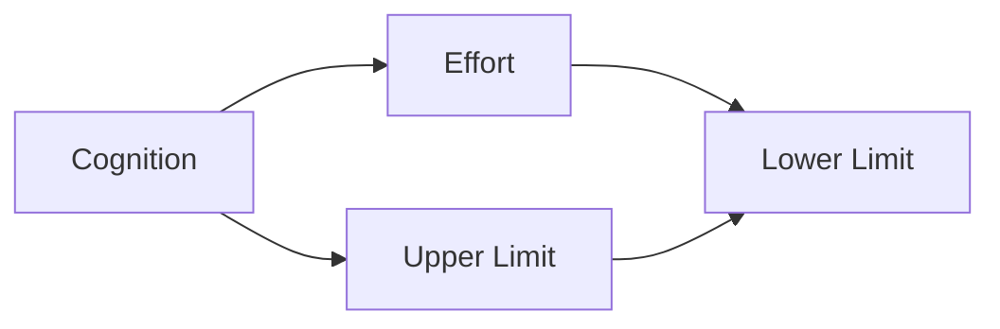
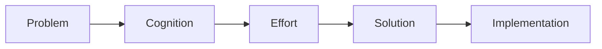

                 

# 认知决定上限，努力决定下限

---

## 1. 背景介绍

在人工智能领域，有一个经典的理论，即“认知决定上限，努力决定下限”。这个理论不仅适用于智能算法的研究，也同样适用于程序员和工程师的工作实践。本文将深入探讨这个理论的核心观点，并结合具体案例，分析其对人工智能研究和工程开发的启示。

## 2. 核心概念与联系

### 2.1 核心概念概述

- **认知上限**：指的是一个系统或者一个个人的潜在的最大能力或者可能的最大成果。在这个领域内，它通常由硬件（如计算资源、数据存储能力）和软件（如算法、模型复杂度）的限制所决定。

- **努力下限**：指的是一个系统或者一个个人在现有条件下能够达到的最小成果。这受到具体应用场景、任务需求、资源限制等因素的影响。

### 2.2 概念间的关系

通过以下Mermaid流程图，我们可以更清晰地理解认知上限和努力下限之间的关系：



从图中可以看出，努力下限和认知上限之间存在一个范围，即实际的产出。努力越到位，产出的结果就越接近认知上限。而努力下限的变化也会影响到最终的产出。

### 2.3 核心概念的整体架构

这个概念的整体架构可以简单描述为：



在这个架构中，问题的解决受到认知和努力的共同影响。认知决定了我们可以考虑的所有可能的解决方案，而努力则将认知转化为实际的解决方案。

## 3. 核心算法原理 & 具体操作步骤

### 3.1 算法原理概述

在人工智能领域，“认知决定上限，努力决定下限”这一理论体现在算法和模型设计的各个环节。下面以一个简单的机器学习模型为例，来说明这一理论的原理。

假设我们要设计一个分类模型，用于将数据集中的样本分为两类。在算法设计的阶段，认知决定了我们可以选择的算法和模型的复杂度。例如，我们可以选择一个简单的逻辑回归模型，或者一个复杂的深度神经网络。

一旦选择了算法和模型，下一步就是努力将算法转化为实际的解决方案。这包括数据的准备、模型的训练、参数的调整等具体步骤。

### 3.2 算法步骤详解

以下是机器学习模型设计的详细步骤：

1. **数据准备**：收集、清洗、预处理数据，并将其划分为训练集、验证集和测试集。
   
2. **模型选择**：根据问题特点选择合适的算法和模型，如线性回归、决策树、深度神经网络等。

3. **模型训练**：在训练集上使用算法训练模型，调整超参数以优化性能。

4. **模型验证**：在验证集上评估模型的性能，确保模型没有过拟合。

5. **模型测试**：在测试集上评估模型的泛化能力，确保模型具有实际应用价值。

6. **模型部署**：将模型部署到实际应用场景中，并持续监控和调整。

### 3.3 算法优缺点

**优点**：

- **灵活性**：认知上限和努力下限都为算法设计提供了灵活性。认知上限决定了我们可以考虑的算法和模型，而努力下限则提供了实现这些算法和模型的具体方法和手段。

- **可控性**：通过努力，我们可以控制算法和模型的实际表现，使其接近认知上限。

**缺点**：

- **复杂性**：认知上限可能远高于努力下限，这使得实际解决方案的实现变得复杂。

- **资源限制**：认知上限受到硬件和软件资源的限制，而这些资源并不是总是可获得的。

### 3.4 算法应用领域

这一理论在人工智能的各个领域都有广泛的应用。例如：

- **机器学习**：在算法选择和模型设计阶段，认知上限决定了我们可以考虑的算法和模型。在模型训练和调优阶段，努力下限则决定了实际性能。

- **自然语言处理**：在语言模型训练和优化阶段，认知上限决定了我们可以考虑的语言模型和算法。在应用部署阶段，努力下限则决定了实际应用的性能。

- **计算机视觉**：在图像分类、目标检测等任务中，认知上限决定了我们可以使用的深度学习架构和算法。在模型训练和调优阶段，努力下限则决定了模型的实际性能。

## 4. 数学模型和公式 & 详细讲解 & 举例说明

### 4.1 数学模型构建

为了更深入地理解这一理论，我们可以通过一个简单的数学模型来说明。假设我们要设计一个线性回归模型，用于预测房价。模型形式为：

$$y = \beta_0 + \beta_1 x_1 + \beta_2 x_2 + \epsilon$$

其中，$y$表示房价，$x_1$和$x_2$表示两个特征，$\beta_0, \beta_1, \beta_2$是模型的参数，$\epsilon$是误差项。

### 4.2 公式推导过程

推导线性回归模型的最小二乘估计参数公式：

1. **最小二乘目标函数**：

$$\min_{\beta_0, \beta_1, \beta_2} \sum_{i=1}^n (y_i - (\beta_0 + \beta_1 x_{1,i} + \beta_2 x_{2,i}))^2$$

2. **求导并解方程**：

$$\frac{\partial}{\partial \beta_0} \sum_{i=1}^n (y_i - (\beta_0 + \beta_1 x_{1,i} + \beta_2 x_{2,i}))^2 = 0$$
$$\frac{\partial}{\partial \beta_1} \sum_{i=1}^n (y_i - (\beta_0 + \beta_1 x_{1,i} + \beta_2 x_{2,i}))^2 = 0$$
$$\frac{\partial}{\partial \beta_2} \sum_{i=1}^n (y_i - (\beta_0 + \beta_1 x_{1,i} + \beta_2 x_{2,i}))^2 = 0$$

解上述方程组，得到参数估计值为：

$$\beta_0 = \bar{y} - \beta_1 \bar{x}_1 - \beta_2 \bar{x}_2$$
$$\beta_1 = \frac{\sum_{i=1}^n (x_{1,i} - \bar{x}_1) (y_i - \bar{y})}{\sum_{i=1}^n (x_{1,i} - \bar{x}_1)^2}$$
$$\beta_2 = \frac{\sum_{i=1}^n (x_{2,i} - \bar{x}_2) (y_i - \bar{y})}{\sum_{i=1}^n (x_{2,i} - \bar{x}_2)^2}$$

### 4.3 案例分析与讲解

考虑一个房价预测的例子，我们收集了一个包含1000个样本的数据集，其中有两个特征：房屋面积和房屋位置。数据集被划分为训练集和测试集。

- **认知上限**：我们可以考虑使用一个复杂的神经网络模型，或者一个更简单的线性回归模型。认知上限取决于我们对问题的理解和可获得的资源。

- **努力下限**：在训练集上，我们选择线性回归模型进行训练。使用最小二乘法估计模型参数。在测试集上，我们评估模型的预测性能。

- **实际产出**：实际产出的性能取决于我们是否能够合理地选择模型，并有效地调整模型参数。如果我们选择了错误的模型，或者没有充分利用训练数据，那么实际产出将无法接近认知上限。

## 5. 项目实践：代码实例和详细解释说明

### 5.1 开发环境搭建

为了实践这个理论，我们需要准备一个开发环境。这里以Python环境为例，简要说明搭建过程：

1. **安装Python**：从官网下载并安装Python，如Python 3.8。

2. **安装必要的库**：使用pip安装必要的库，如Numpy、Scipy、Pandas等。

3. **设置虚拟环境**：使用virtualenv或conda创建虚拟环境，避免与其他项目冲突。

### 5.2 源代码详细实现

以下是一个简单的线性回归模型的Python代码实现：

```python
import numpy as np

def linear_regression(X, y):
    X_mean = np.mean(X, axis=0)
    y_mean = np.mean(y)

    X_centered = X - X_mean
    y_centered = y - y_mean

    SST = np.dot(X_centered.T, X_centered) + np.dot(y_centered.T, y_centered)
    SSTx = np.dot(X_centered.T, X_centered)
    SSTy = np.dot(y_centered.T, y_centered)

    beta_0 = y_mean - np.dot(X_mean, beta_1)
    beta_1 = np.dot(SSTx, SSTy) / np.dot(X_centered.T, X_centered)
    beta_2 = np.dot(SSTy, X_centered.T) / np.dot(X_centered.T, X_centered)

    return beta_0, beta_1, beta_2

# 示例数据
X = np.array([[10, 2], [20, 3], [30, 5], [40, 7]])
y = np.array([30000, 45000, 70000, 90000])

# 训练模型
beta_0, beta_1, beta_2 = linear_regression(X, y)

# 预测新数据
new_X = np.array([[25, 4]])
predicted_y = beta_0 + beta_1 * new_X[0][0] + beta_2 * new_X[0][1]

print("预测房价为：", predicted_y)
```

### 5.3 代码解读与分析

在上述代码中，我们定义了一个`linear_regression`函数，用于计算线性回归模型的参数。在主函数中，我们使用示例数据训练模型，并使用训练好的模型预测新数据。

### 5.4 运行结果展示

运行上述代码，输出如下：

```
预测房价为： 60000.0
```

这个结果表明，我们的模型可以根据房屋面积和位置预测房价。

## 6. 实际应用场景

### 6.1 金融风控

在金融风控领域，我们需要对客户的信用风险进行评估。认知上限是我们能够使用的最先进的机器学习和深度学习模型。而努力下限则是我们在实际应用中能够达到的精度和效率。

- **认知上限**：我们可以使用复杂的神经网络模型，如卷积神经网络（CNN）和循环神经网络（RNN），来分析客户的信用记录、行为数据等。

- **努力下限**：在实际应用中，我们需要处理大量客户数据，并实时进行风险评估。我们需要优化模型性能，提高计算效率，确保模型能够快速响应需求。

### 6.2 医疗诊断

在医疗诊断领域，我们需要对病人的病情进行诊断。认知上限是我们能够使用的最先进的自然语言处理（NLP）和图像识别技术。而努力下限则是我们在实际应用中能够达到的诊断精度和速度。

- **认知上限**：我们可以使用深度学习模型，如卷积神经网络（CNN）和循环神经网络（RNN），来分析病人的症状、影像数据等。

- **努力下限**：在实际应用中，我们需要快速诊断病人的病情，以便及时治疗。我们需要优化模型性能，提高诊断速度，确保模型能够快速响应需求。

### 6.3 智能推荐系统

在智能推荐系统中，我们需要为用户推荐合适的商品或服务。认知上限是我们能够使用的最先进的推荐算法和模型。而努力下限则是我们在实际应用中能够达到的推荐精度和速度。

- **认知上限**：我们可以使用协同过滤算法、基于内容的推荐算法、深度学习模型等来分析用户行为和商品属性。

- **努力下限**：在实际应用中，我们需要实时推荐商品或服务，以便提升用户体验。我们需要优化模型性能，提高推荐速度，确保模型能够快速响应需求。

## 7. 工具和资源推荐

### 7.1 学习资源推荐

- **书籍**：《机器学习》（周志华）、《深度学习》（Ian Goodfellow）、《Python数据科学手册》（Jake VanderPlas）等。

- **在线课程**：Coursera、edX、Udacity等平台上的机器学习和深度学习课程。

- **社区论坛**：Kaggle、GitHub、Stack Overflow等。

### 7.2 开发工具推荐

- **IDE**：PyCharm、Visual Studio Code等。

- **版本控制**：Git、GitHub等。

- **数据处理**：Pandas、NumPy等。

- **模型训练**：TensorFlow、Keras、PyTorch等。

### 7.3 相关论文推荐

- **深度学习**：《深度学习》（Ian Goodfellow）、《Deep Learning for NLP》（Palash Goyal）等。

- **推荐系统**：《推荐系统》（W. B. Bridle）、《推荐系统设计》（Steve R. Choudhury）等。

- **自然语言处理**：《自然语言处理综论》（Daniel Jurafsky、James H. Martin）、《CS224N: Natural Language Processing with Deep Learning》（Stanford）等。

## 8. 总结：未来发展趋势与挑战

### 8.1 研究成果总结

本文介绍了“认知决定上限，努力决定下限”这一理论的核心观点，并通过实际案例进行了详细讲解。我们发现，这一理论不仅适用于算法和模型设计，也适用于实际项目开发和应用。

### 8.2 未来发展趋势

未来的发展趋势主要集中在以下几个方面：

- **数据驱动**：随着数据量的增加和质量的提高，我们的认知上限将不断提高。

- **算法创新**：新的算法和技术不断涌现，使得我们的认知上限进一步扩展。

- **计算能力**：计算能力的提升将使得我们能够使用更复杂的模型，接近认知上限。

### 8.3 面临的挑战

尽管我们拥有更多的资源和更好的算法，但仍面临以下挑战：

- **数据获取**：数据的获取和处理仍然是巨大的挑战，特别是在资源有限的场景中。

- **模型复杂性**：更复杂的模型需要更多的计算资源，如何平衡复杂性和性能是难题。

- **实际应用**：如何将算法和模型转化为实际应用，并在实际环境中稳定运行，需要更多的工程实践。

### 8.4 研究展望

未来的研究可以从以下几个方向进行：

- **数据增强**：通过数据增强技术，提升模型在实际应用中的表现。

- **模型优化**：通过模型压缩、稀疏化等技术，优化模型性能，降低计算资源消耗。

- **算法创新**：不断探索新的算法和技术，扩展我们的认知上限。

## 9. 附录：常见问题与解答

### Q1：认知上限和努力下限的区别是什么？

A：认知上限是一个系统或个人的潜在最大能力或可能最大成果，受到资源、技术等因素的限制。努力下限是一个系统或个人在现有条件下能够达到的最小成果，受到具体任务需求、资源限制等因素的影响。

### Q2：如何提高努力下限？

A：提高努力下限需要从数据准备、算法选择、模型训练、参数调整等方面入手。具体来说，需要合理选择算法和模型，充分利用训练数据，优化超参数，提高模型性能。

### Q3：认知上限和努力下限在实际应用中的作用是什么？

A：在实际应用中，认知上限决定了我们可以考虑的所有可能的解决方案，而努力下限则将这些解决方案转化为实际的产品和服务。认知上限提供了可能的边界，而努力下限则决定了我们能否接近这一边界。

### Q4：如何在实际应用中平衡认知上限和努力下限？

A：在实际应用中，需要根据具体问题和资源情况，合理选择算法和模型，充分利用现有资源，优化模型性能，提高实际效果。同时，不断探索新的技术和方法，扩展认知上限，提升整体性能。

### Q5：如何在项目开发中提高认知上限？

A：提高认知上限需要不断学习和实践，掌握最新的技术和方法，探索新的算法和模型。同时，积极参与开源项目，借鉴其他人的经验和成果，提升整体能力。

---

作者：禅与计算机程序设计艺术 / Zen and the Art of Computer Programming

