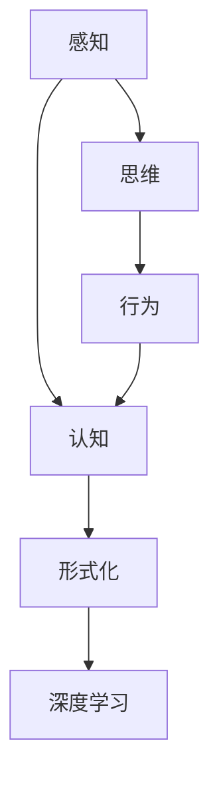
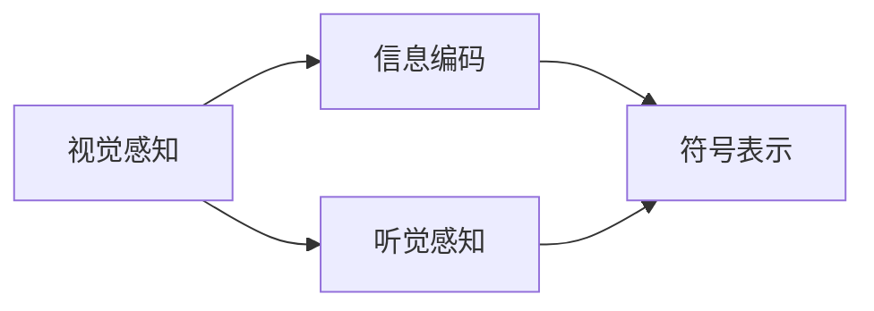
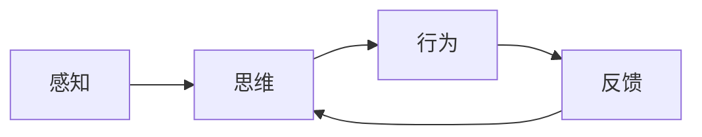
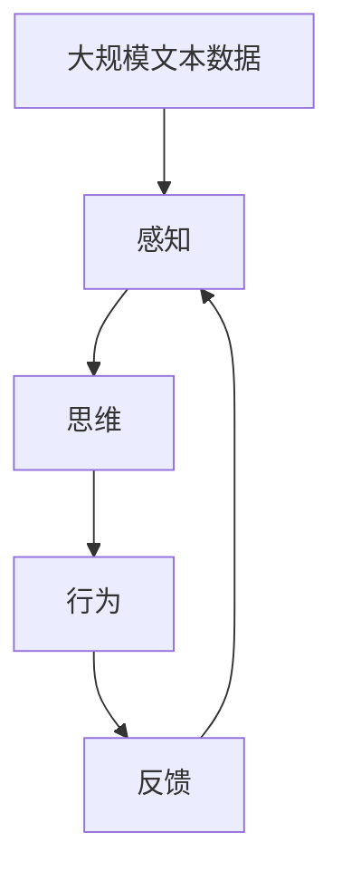

                 

# 认知的形式化：感知—思维—行为之间的协同性

> 关键词：认知,感知,思维,行为,协同,形式化,神经网络,深度学习

## 1. 背景介绍

### 1.1 问题由来
在当今信息爆炸的时代，人类面临的认知任务日益复杂和多元化。从感知输入到思维推理，再到行为决策，认知过程涉及多个层面和组件的协同工作。如何从形式化的角度理解认知过程，设计高效的人工智能系统，成为了一个亟待解决的难题。

认知科学作为一门跨学科的研究领域，旨在探索人类心智的运作机制，涵盖感知、思维、记忆、语言等诸多方面。随着深度学习技术的兴起，人工智能系统在认知任务上取得了显著进展。然而，如何有效地将认知科学原理融入到深度学习框架中，设计出符合人类认知规律的智能系统，仍然是一个重要的研究方向。

### 1.2 问题核心关键点
本文聚焦于将认知科学原理引入深度学习，通过形式化方法，探索感知—思维—行为之间的协同机制。具体而言，我们将探讨以下几个核心问题：

- **感知过程的形式化描述**：如何通过形式化方法，刻画感知过程中的信息处理机制，特别是视觉、听觉等感官的输入编码。
- **思维过程的形式化建模**：如何通过形式化方法，构建思维推理过程的模型，特别是逻辑推理、因果推断、关联提取等。
- **行为过程的形式化表征**：如何通过形式化方法，表达行为决策和执行过程，特别是目标导向的行为选择和优化。
- **感知—思维—行为的协同机制**：如何将感知、思维和行为三个层面的形式化模型进行协同，形成一个完整的认知系统。

### 1.3 问题研究意义
研究认知过程的形式化建模，对于设计高效、可解释、可靠的人工智能系统具有重要意义：

1. **提高系统性能**：通过形式化方法，可以更准确地描述认知过程，提高系统的预测和决策能力。
2. **增强系统可解释性**：形式化模型提供了系统行为的数学推导，有助于解释系统的决策逻辑。
3. **提升系统鲁棒性**：形式化建模能够识别和纠正系统中的错误和偏差，增强系统的鲁棒性。
4. **推动跨学科研究**：结合认知科学和深度学习的交叉研究，将有助于推动人工智能系统的理论发展和应用拓展。
5. **促进智能技术的普及**：可解释的认知系统更易被社会接受和应用，推动人工智能技术的普及和落地。

## 2. 核心概念与联系

### 2.1 核心概念概述

为更好地理解认知过程的形式化建模，本节将介绍几个密切相关的核心概念：

- **认知(Cognition)**：指人类或智能系统感知环境、处理信息、做出决策的整个心理过程。
- **感知(Perception)**：指感官接收外界信息并将其转换为可处理的形式。
- **思维(Thought)**：指通过符号操作、逻辑推理、记忆提取等心理活动，处理感知信息并生成决策。
- **行为(Action)**：指基于思维推理的结果，对外界环境进行响应和操作。
- **形式化(Formalization)**：指通过数学、逻辑等形式化方法，精确描述认知过程的各个组件和相互作用。

这些核心概念之间的逻辑关系可以通过以下Mermaid流程图来展示：



这个流程图展示了认知过程中各个组件之间的关系：

1. 感知过程是认知的起点，接收外界信息并转化为符号表示。
2. 思维过程通过符号操作和推理，处理感知信息并生成决策。
3. 行为过程基于决策结果，对外界环境进行操作。
4. 形式化方法用于描述认知过程的各个组件和相互作用，并在深度学习框架下实现。

### 2.2 概念间的关系

这些核心概念之间存在着紧密的联系，形成了认知过程的完整框架。下面我们通过几个Mermaid流程图来展示这些概念之间的关系。

#### 2.2.1 感知过程的形式化描述



这个流程图展示了视觉和听觉感知的形式化过程：

1. 视觉感知接收外界视觉信息，通过视网膜等感受器将其转换为神经信号。
2. 听觉感知接收外界声音信息，通过耳蜗等感受器将其转换为神经信号。
3. 神经信号经过编码，转换为符号表示，进入后续的思维过程。

#### 2.2.2 思维过程的形式化建模


这个流程图展示了思维过程的形式化建模：

1. 感知信息进入知识库，存储为符号表示。
2. 知识库中的符号根据推理规则进行操作和变换。
3. 推理结果作为思维输出，用于指导行为决策。

#### 2.2.3 行为过程的形式化表征


这个流程图展示了行为过程的形式化表征：

1. 思维输出作为行为策略，指导行为决策。
2. 行为策略转化为具体行动，执行对环境的响应。

#### 2.2.4 感知—思维—行为的协同机制



这个流程图展示了感知—思维—行为的协同机制：

1. 感知过程提供外界环境信息。
2. 思维过程处理感知信息并生成行为策略。
3. 行为过程执行决策并反馈结果，进一步调整思维过程。

### 2.3 核心概念的整体架构

最后，我们用一个综合的流程图来展示这些核心概念在大规模认知系统中的整体架构：



这个综合流程图展示了从感知到反馈的完整认知过程，强调了感知、思维和行为三个组件的协同作用。通过形式化方法，可以更精确地刻画认知过程的各个环节，从而设计出更加高效、可靠的人工智能系统。

## 3. 核心算法原理 & 具体操作步骤
### 3.1 算法原理概述

认知过程的形式化建模，本质上是通过数学和逻辑方法，精确描述认知组件和它们之间的相互作用。在大规模认知系统中，深度学习提供了强大的数据处理和符号操作能力，可以将形式化模型转化为可训练的神经网络。

形式化模型的构建通常包括以下步骤：

1. **定义符号和逻辑结构**：用数学符号和逻辑表达式，刻画认知组件和它们之间的相互作用。
2. **构建符号转换规则**：定义符号操作和逻辑推理的规则，描述认知过程的动态演化。
3. **映射到神经网络结构**：将符号转换规则转化为神经网络的连接和激活函数，构建深度学习模型。
4. **训练模型参数**：使用大量标注数据，通过优化算法训练模型参数，使其符合形式化模型。
5. **评估和迭代**：对训练好的模型进行评估和测试，不断优化模型参数和符号转换规则，提高系统性能。

### 3.2 算法步骤详解

#### 3.2.1 定义符号和逻辑结构

形式化模型的构建首先需要定义符号和逻辑结构，刻画认知过程的关键组件和相互作用。例如，对于视觉感知，可以定义像素点、色彩值等符号，表示视觉信息的离散形式。对于思维推理，可以定义命题、逻辑连接词、推理规则等符号，表示思维过程的形式化结构。

具体而言，形式化模型可以表示为：

$$
\phi(\mathcal{S}, \mathcal{R}, \mathcal{I})
$$

其中：
- $\mathcal{S}$ 表示符号集，如视觉像素、思维命题等。
- $\mathcal{R}$ 表示符号转换规则，如像素到色彩值的映射、逻辑推理规则等。
- $\mathcal{I}$ 表示输入信息，如视觉图像、思维推理结果等。

#### 3.2.2 构建符号转换规则

符号转换规则描述了符号之间的操作和变换，是认知过程的核心组成部分。符号转换规则可以包括数据预处理、特征提取、逻辑推理等步骤。

以视觉感知为例，符号转换规则可以表示为：

$$
\psi = \{\psi_1, \psi_2, \ldots, \psi_n\}
$$

其中 $\psi_i$ 表示第 $i$ 个转换规则，如像素到色彩值的映射、色彩到形状特征的提取等。

#### 3.2.3 映射到神经网络结构

符号转换规则可以映射到深度学习模型中的神经网络结构。例如，视觉感知过程可以映射到卷积神经网络(CNN)结构，通过卷积层、池化层等提取特征，生成符号表示。思维推理过程可以映射到递归神经网络(RNN)结构，通过循环连接和门控机制，处理符号操作和推理。

形式化模型的神经网络结构可以表示为：

$$
\mathcal{G} = (G, \mathcal{E})
$$

其中 $G$ 表示神经网络图，$\mathcal{E}$ 表示边的连接关系。

#### 3.2.4 训练模型参数

训练模型参数的过程，本质上是求解符号转换规则的最优解，使其能够最大化符合形式化模型的性能。可以使用深度学习框架中的优化算法，如梯度下降、Adam等，对模型参数进行迭代优化。

以视觉感知为例，训练过程可以表示为：

$$
\theta = \mathop{\arg\min}_{\theta} \mathcal{L}(\theta, D)
$$

其中 $\theta$ 表示模型参数，$\mathcal{L}$ 表示损失函数，$D$ 表示训练数据。

#### 3.2.5 评估和迭代

评估和迭代过程用于检验模型的性能，并不断优化模型参数和符号转换规则。可以使用测试集数据，评估模型的准确率、召回率、F1分数等指标，比较不同模型的性能。

以思维推理为例，评估过程可以表示为：

$$
\mathcal{P}(\phi) = \frac{1}{N}\sum_{i=1}^N \delta(P_i, \hat{P}_i)
$$

其中 $P_i$ 表示第 $i$ 个样本的真实推理结果，$\hat{P}_i$ 表示模型预测的推理结果，$\delta$ 表示误差函数，如均方误差等。

### 3.3 算法优缺点

认知过程的形式化建模具有以下优点：

1. **精确性**：形式化模型通过数学和逻辑方法描述认知过程，能够精确地刻画各组件和它们之间的相互作用。
2. **可解释性**：形式化模型提供了系统的数学推导，便于解释系统的决策逻辑。
3. **模块化**：形式化模型可以分解为多个子模块，每个子模块负责特定的认知任务，便于设计和调试。

但形式化建模也存在一些局限性：

1. **复杂性**：形式化模型需要定义符号和逻辑结构，构建符号转换规则，可能会增加系统的复杂性。
2. **数据需求**：形式化模型需要大量的标注数据进行训练，可能难以在小型数据集上取得良好效果。
3. **动态性**：形式化模型难以处理动态变化的环境，可能需要在训练过程中不断更新模型参数和符号转换规则。

### 3.4 算法应用领域

认知过程的形式化建模已经在多个领域得到应用，展示了其广泛的应用前景：

1. **视觉识别**：将视觉感知形式化建模，用于图像分类、目标检测、人脸识别等任务。
2. **自然语言处理**：将语言感知和思维推理形式化建模，用于机器翻译、文本生成、问答系统等任务。
3. **智能推荐**：将用户行为和产品特征形式化建模，用于个性化推荐系统。
4. **机器人控制**：将机器人感知和行为控制形式化建模，用于路径规划、避障决策等任务。
5. **智能监控**：将视频感知和行为监控形式化建模，用于异常检测、行为分析等任务。

## 4. 数学模型和公式 & 详细讲解  
### 4.1 数学模型构建

本节将使用数学语言对认知过程的形式化建模进行更加严格的刻画。

记认知过程的形式化模型为 $\phi$，定义符号集 $\mathcal{S}$、逻辑结构 $\mathcal{R}$ 和输入信息 $\mathcal{I}$。

### 4.2 公式推导过程

#### 4.2.1 视觉感知的数学模型

以视觉感知为例，可以定义视觉信息的符号集 $\mathcal{S} = \{p, c\}$，其中 $p$ 表示像素点，$c$ 表示色彩值。定义符号转换规则 $\psi = \{\psi_1, \psi_2, \ldots, \psi_n\}$，其中 $\psi_1: p \rightarrow c$ 表示像素到色彩值的映射，$\psi_2: c \rightarrow \text{shape}$ 表示色彩到形状特征的提取。

形式化模型的神经网络结构可以表示为：

$$
\mathcal{G} = (G, \mathcal{E})
$$

其中 $G$ 表示神经网络图，$\mathcal{E}$ 表示边的连接关系。以卷积神经网络为例，可以表示为：

$$
G = \{(Conv, Conv, Relu), (Pool, Pool, Relu), (FC, FC, Softmax)\}
$$

其中 $Conv$ 表示卷积层，$Pool$ 表示池化层，$FC$ 表示全连接层，$Relu$ 表示激活函数，$Softmax$ 表示输出层的激活函数。

训练过程可以表示为：

$$
\theta = \mathop{\arg\min}_{\theta} \mathcal{L}(\theta, D)
$$

其中 $\theta$ 表示模型参数，$\mathcal{L}$ 表示损失函数，$D$ 表示训练数据。

#### 4.2.2 思维推理的数学模型

以思维推理为例，可以定义命题的符号集 $\mathcal{S} = \{p_1, p_2, \ldots, p_n\}$，其中 $p_i$ 表示第 $i$ 个命题。定义逻辑连接词的符号集 $\mathcal{C} = \{\vee, \wedge, \neg\}$，其中 $\vee$ 表示逻辑或，$\wedge$ 表示逻辑与，$\neg$ 表示逻辑非。定义推理规则 $\psi = \{\psi_1, \psi_2, \ldots, \psi_m\}$，其中 $\psi_1: p_1 \vee p_2 \rightarrow p_3$ 表示逻辑或推理规则，$\psi_2: p_1 \wedge p_2 \rightarrow p_3$ 表示逻辑与推理规则。

形式化模型的神经网络结构可以表示为：

$$
\mathcal{G} = (G, \mathcal{E})
$$

其中 $G$ 表示神经网络图，$\mathcal{E}$ 表示边的连接关系。以递归神经网络为例，可以表示为：

$$
G = \{(LSTM, LSTM, Relu), (FC, FC, Softmax)\}
$$

其中 $LSTM$ 表示长短期记忆网络，$FC$ 表示全连接层，$Relu$ 表示激活函数，$Softmax$ 表示输出层的激活函数。

训练过程可以表示为：

$$
\theta = \mathop{\arg\min}_{\theta} \mathcal{L}(\theta, D)
$$

其中 $\theta$ 表示模型参数，$\mathcal{L}$ 表示损失函数，$D$ 表示训练数据。

#### 4.2.3 行为决策的数学模型

以行为决策为例，可以定义行为策略的符号集 $\mathcal{S} = \{a_1, a_2, \ldots, a_n\}$，其中 $a_i$ 表示第 $i$ 个行为策略。定义行为执行的符号集 $\mathcal{E} = \{e_1, e_2, \ldots, e_m\}$，其中 $e_i$ 表示第 $i$ 个行为执行。定义行为策略和行为执行的映射规则 $\psi = \{\psi_1, \psi_2, \ldots, \psi_n\}$，其中 $\psi_1: a_1 \rightarrow e_1$ 表示行为策略到行为执行的映射。

形式化模型的神经网络结构可以表示为：

$$
\mathcal{G} = (G, \mathcal{E})
$$

其中 $G$ 表示神经网络图，$\mathcal{E}$ 表示边的连接关系。以强化学习为例，可以表示为：

$$
G = \{(Q, Q, Relu), (DQN, DQN, Relu), (FC, FC, Softmax)\}
$$

其中 $Q$ 表示Q网络，$DQN$ 表示深度Q网络，$FC$ 表示全连接层，$Relu$ 表示激活函数，$Softmax$ 表示输出层的激活函数。

训练过程可以表示为：

$$
\theta = \mathop{\arg\min}_{\theta} \mathcal{L}(\theta, D)
$$

其中 $\theta$ 表示模型参数，$\mathcal{L}$ 表示损失函数，$D$ 表示训练数据。

### 4.3 案例分析与讲解

#### 4.3.1 视觉感知的案例分析

以物体检测任务为例，可以定义物体的位置和类别为符号集 $\mathcal{S} = \{p, c, o\}$，其中 $p$ 表示像素点，$c$ 表示色彩值，$o$ 表示物体类别。定义符号转换规则 $\psi = \{\psi_1, \psi_2, \ldots, \psi_n\}$，其中 $\psi_1: p \rightarrow c$ 表示像素到色彩值的映射，$\psi_2: c \rightarrow o$ 表示色彩到物体类别的映射。

使用卷积神经网络实现视觉感知过程，可以表示为：

$$
\mathcal{G} = (G, \mathcal{E})
$$

其中 $G$ 表示神经网络图，$\mathcal{E}$ 表示边的连接关系。以Faster R-CNN为例，可以表示为：

$$
G = \{(Conv, Conv, Relu), (RoI, RoI, Relu), (RoP, RoP, Relu), (FC, FC, Softmax)\}
$$

其中 $Conv$ 表示卷积层，$RoI$ 表示区域感兴趣池化层，$RoP$ 表示区域提议池化层，$FC$ 表示全连接层，$Relu$ 表示激活函数，$Softmax$ 表示输出层的激活函数。

训练过程可以表示为：

$$
\theta = \mathop{\arg\min}_{\theta} \mathcal{L}(\theta, D)
$$

其中 $\theta$ 表示模型参数，$\mathcal{L}$ 表示损失函数，$D$ 表示训练数据。

#### 4.3.2 思维推理的案例分析

以逻辑推理任务为例，可以定义命题的符号集 $\mathcal{S} = \{p_1, p_2, \ldots, p_n\}$，其中 $p_i$ 表示第 $i$ 个命题。定义逻辑连接词的符号集 $\mathcal{C} = \{\vee, \wedge, \neg\}$，其中 $\vee$ 表示逻辑或，$\wedge$ 表示逻辑与，$\neg$ 表示逻辑非。定义推理规则 $\psi = \{\psi_1, \psi_2, \ldots, \psi_m\}$，其中 $\psi_1: p_1 \vee p_2 \rightarrow p_3$ 表示逻辑或推理规则，$\psi_2: p_1 \wedge p_2 \rightarrow p_3$ 表示逻辑与推理规则。

使用递归神经网络实现思维推理过程，可以表示为：

$$
\mathcal{G} = (G, \mathcal{E})
$$

其中 $G$ 表示神经网络图，$\mathcal{E}$ 表示边的连接关系。以神经逻辑推理网络(NetL)为例，可以表示为：

$$
G = \{(LSTM, LSTM, Relu), (FC, FC, Softmax)\}
$$

其中 $LSTM$ 表示长短期记忆网络，$FC$ 表示全连接层，$Relu$ 表示激活函数，$Softmax$ 表示输出层的激活函数。

训练过程可以表示为：

$$
\theta = \mathop{\arg\min}_{\theta} \mathcal{L}(\theta, D)
$$

其中 $\theta$ 表示模型参数，$\mathcal{L}$ 表示损失函数，$D$ 表示训练数据。

#### 4.3.3 行为决策的案例分析

以机器人路径规划任务为例，可以定义行为策略的符号集 $\mathcal{S} = \{a_1, a_2, \ldots, a_n\}$，其中 $a_i$ 表示第 $i$ 个行为策略。定义行为执行的符号集 $\mathcal{E} = \{e_1, e_2, \ldots, e_m\}$，其中 $e_i$ 表示第 $i$ 个行为执行。定义行为策略和行为执行的映射规则 $\psi = \{\psi_1, \psi_2, \ldots, \psi_n\}$，其中 $\psi_1: a_1 \rightarrow e_1$ 表示行为策略到行为执行的映射。

使用强化学习实现行为决策过程，可以表示为：

$$
\mathcal{G} = (G, \mathcal{E})
$$

其中 $G$ 表示神经网络图，$\mathcal{E}$ 表示边的连接关系。以深度Q网络(DQN)为例，可以表示为：

$$
G = \{(Q, Q, Relu), (DQN, DQN, Relu), (FC, FC, Softmax)\}
$$

其中 $Q$ 表示Q网络，$DQN$ 表示深度Q网络，$FC$ 表示全连接层，$Relu$ 表示激活函数，$Softmax$ 表示输出层的激活函数。

训练过程可以表示为：

$$
\theta = \mathop{\arg\min}_{\theta} \mathcal{L}(\theta, D)
$$

其中 $\theta$ 表示模型参数，$\mathcal{L}$ 表示损失函数，$D$ 表示训练数据。

## 5. 项目实践：代码实例和详细解释说明
### 5.1 开发环境搭建

在进行认知过程的形式化建模和深度学习实践前，我们需要准备好开发环境。以下是使用Python进行PyTorch开发的环境配置流程：

1. 安装Anaconda：从官网下载并安装Anaconda，用于创建独立的Python环境。

2. 创建并激活虚拟环境：
```bash
conda create -n pytorch-env python=3.8 
conda activate pytorch-env
```

3. 安装PyTorch：根据CUDA版本，从官网获取对应的安装命令。例如：
```bash
conda install pytorch torchvision torchaudio cudatoolkit=11.1 -c pytorch -c conda-forge
```

4. 安装TensorFlow：
```bash
pip install tensorflow
```

5. 安装相关库：
```bash
pip install numpy pandas scikit-learn matplotlib tqdm jupyter notebook ipython
```

完成上述步骤后，即可在`pytorch-env`环境中开始认知过程的形式化建模和深度学习实践。

### 5.2 源代码详细实现

这里我们以视觉感知和思维推理为例，给出使用PyTorch进行深度学习的代码实现。

#### 5.2.1 视觉感知的代码实现

首先，定义视觉感知的数据处理函数：

```python
import torch
import torchvision.transforms as transforms
from torch.utils.data import Dataset, DataLoader
from torchvision.models import resnet18

class ImageDataset(Dataset):
    def __init__(self, data_dir, transform=None):
        self.imgs = list(os.path.join(data_dir, img_file) for img_file in os.listdir(data_dir))
        self.transform = transform
    
    def __len__(self):
        return len(self.imgs)
    
    def __getitem__(self, idx):
        img_path = self.imgs[idx]
        img = Image.open(img_path).convert('RGB')
        if self.transform is not None:
            img = self.transform(img)
        return img

transform = transforms.Compose([
    transforms.Resize(256),
    transforms.CenterCrop(224),
    transforms.ToTensor(),
    transforms.Normalize(mean=[0.485, 0.456, 0.406], std=[0.229, 0.224, 0.225])
])

train_dataset = ImageDataset(train_dir, transform=transform)
test_dataset = ImageDataset(test_dir, transform=transform)
```

然后，定义视觉感知的模型和优化器：

```python
model = resnet18(pretrained=False)
for param in model.parameters():
    param.requires_grad = False

num_ftrs = model.fc.in_features
model.fc = nn.Linear(num_ftrs, 2)


