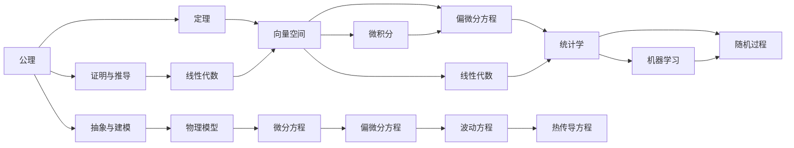

                 

# 认知的形式化：数学是探索和认知物理空间的工具

## 1. 背景介绍

### 1.1 问题由来
现代科学技术的发展，使人类对物理世界的认知不断深入。然而，物理世界是如此复杂多样，人类无法用直觉或定性方法去理解其内在规律。数学则是探索和认知物理空间的强有力工具。

本节将介绍数学是如何帮助我们认知物理世界的。我们将探讨数学在描述物理世界、建模和解决问题中的作用。通过理解数学的原理和应用，我们将深入探索如何通过数学探索物理世界，从而推动科学和技术的发展。

### 1.2 问题核心关键点
数学作为探索物理空间的工具，其主要作用有以下几个方面：

- 描述和量化：数学提供了精确的符号和计算工具，用以描述物理现象和规律。例如，牛顿力学使用微积分描述物体的运动，电磁理论使用向量分析描述电磁场的行为。
- 抽象与建模：数学通过抽象将复杂的物理问题转化为简洁的数学模型。例如，使用微分方程描述热传导现象，用微积分描述流体力学。
- 推导与验证：数学提供了严格的推理和验证方法，确保物理理论的正确性。例如，通过偏微分方程组求解得到了广义相对论中的爱因斯坦场方程。
- 数据分析与优化：数学是数据分析和优化的重要工具，帮助我们在复杂的数据集中发现规律和优化模型。例如，使用机器学习算法优化供应链管理。

数学的这些作用，使其成为现代科技发展不可或缺的基石。通过深入理解数学原理，我们可以更好地利用数学工具探索和认知物理世界。

## 2. 核心概念与联系

### 2.1 核心概念概述

本节将介绍几个核心概念，并展示它们之间的联系。

- 公理与定理：公理是数学的基础，用于描述数学对象的基本性质；定理则是由公理推导出的，用以描述数学对象之间的关系。
- 向量空间：向量空间是由一组向量组成，满足加法和数乘的数学结构。向量空间是线性代数和微积分的基础。
- 偏微分方程：偏微分方程是描述物理现象的重要数学工具，例如波动方程和热传导方程。
- 统计学：统计学是研究数据和随机现象的数学分支，用于数据分析和预测。
- 随机过程：随机过程是描述随机现象在时间或空间上变化规律的数学模型。

这些核心概念之间通过公理、定理、推导、应用等关系紧密联系。通过这些概念的融合，我们可以建立数学模型，描述和解决问题。

### 2.2 概念间的关系

下面使用Mermaid流程图展示这些核心概念之间的关系。



这个图表展示了数学概念之间的关系，公理和定理是数学的基础，向量空间、偏微分方程等是数学工具，通过抽象与建模，我们可以将物理问题转化为数学模型，再通过数学工具求解，最后通过统计学和机器学习等方法分析数据，得到预测结果。

## 3. 核心算法原理 & 具体操作步骤
### 3.1 算法原理概述

数学算法是基于公理和定理的逻辑推理过程。在探索物理世界时，我们需要建立数学模型，并使用算法进行求解。下面以波动方程为例，介绍数学算法的原理和具体操作步骤。

波动方程是描述波动现象的数学模型，其基本形式为：

$$
\frac{\partial^2 u}{\partial t^2} = c^2 \nabla^2 u
$$

其中 $u$ 为位移场，$c$ 为波速。求解波动方程可以帮助我们了解波的传播规律。

### 3.2 算法步骤详解

求解波动方程通常包含以下几个步骤：

1. **定义数学模型**：将波动方程转化为偏微分方程，并建立相关的初始条件和边界条件。

2. **离散化**：将连续的物理空间离散化为网格，将偏微分方程转化为离散形式的差分方程。

3. **求解差分方程**：使用迭代法或直接解法求解离散化后的差分方程，得到位移场 $u$ 在每个网格点的值。

4. **可视化结果**：将求解结果可视化，观察波的传播规律和特性。

### 3.3 算法优缺点

数学算法在求解物理问题时具有以下优点：

- 精确性：数学算法基于严格的公理和定理，结果具有较高的精确性。
- 可复现性：数学算法可以重复使用，并容易在计算机上实现。
- 适用广泛：数学算法适用于多种物理现象，可以描述不同物理规律。

然而，数学算法也存在一些缺点：

- 复杂性：数学算法通常涉及复杂的数学推导和计算，可能难以理解和实现。
- 计算量大：复杂的物理问题可能需要高精度的计算，计算量大。
- 难以处理随机现象：数学算法在处理随机现象时，需要引入概率和统计方法。

### 3.4 算法应用领域

数学算法在物理学、工程学、金融学等多个领域得到广泛应用。例如：

- 物理学：使用波动方程、热传导方程等描述物理现象。
- 工程学：使用有限元法进行结构分析和模拟。
- 金融学：使用随机过程模型预测市场波动。

数学算法的这些应用，推动了科学和技术的发展，并在实际工程中发挥重要作用。

## 4. 数学模型和公式 & 详细讲解  
### 4.1 数学模型构建

在数学模型构建过程中，我们需要定义变量、建立方程，并引入初始条件和边界条件。以下以波动方程为例，介绍数学模型构建的基本步骤。

定义变量：

- $u(x,t)$：位移场，描述介质中每一点的位移。
- $c$：波速，描述波在介质中的传播速度。

建立波动方程：

$$
\frac{\partial^2 u}{\partial t^2} = c^2 \nabla^2 u
$$

引入初始条件和边界条件：

- 初始条件：$u(x,0) = f(x)$，$u_t(x,0) = g(x)$。
- 边界条件：$u|_{\partial \Omega} = h(x)$。

其中，$f(x)$、$g(x)$、$h(x)$ 分别为初始值和边界值函数。

### 4.2 公式推导过程

以下推导波动方程的解：

1. **分离变量**：将位移场 $u(x,t)$ 分解为 $u(x,t) = X(x)T(t)$。
2. **代入波动方程**：将 $u(x,t)$ 代入波动方程，得到：
   $$
   \frac{\partial^2 (X(x)T(t))}{\partial t^2} = c^2 \nabla^2 (X(x)T(t))
   $$
   分离变量，得到：
   $$
   \frac{\partial^2 T(t)}{\partial t^2} = \lambda T(t), \quad \nabla^2 X(x) = \mu X(x)
   $$
3. **求解**：求得 $T(t)$ 和 $X(x)$ 的通解：
   $$
   T(t) = A\sin(\omega t) + B\cos(\omega t), \quad X(x) = C\sin(kx) + D\cos(kx)
   $$
4. **确定系数**：通过初始条件和边界条件求解系数 $A$、$B$、$C$、$D$。
5. **组合解**：将 $T(t)$ 和 $X(x)$ 的通解组合，得到波动方程的解。

### 4.3 案例分析与讲解

以二维波动方程为例，分析波动方程的解。

假设介质为矩形区域 $\Omega = [0,a] \times [0,b]$，边界条件为 $u|_{\partial \Omega} = 0$，初始条件为 $u(x,0) = f(x)$，$u_t(x,0) = g(x)$。则波动方程的解为：

$$
u(x,t) = \sum_{n=1}^{\infty} \sum_{m=1}^{\infty} C_{n,m} \sin\left(\frac{n\pi x}{a}\right)\sin\left(\frac{m\pi y}{b}\right) \cos(\omega t)
$$

其中 $C_{n,m}$ 为系数，$\omega$ 为频率。

这个解展示了波动方程的波动特性，可以通过数学模型和算法求解，得到实际的波形。

## 5. 项目实践：代码实例和详细解释说明
### 5.1 开发环境搭建

在进行数学算法实践前，我们需要准备好开发环境。以下是使用Python进行Pandas和NumPy开发的环境配置流程：

1. 安装Anaconda：从官网下载并安装Anaconda，用于创建独立的Python环境。

2. 创建并激活虚拟环境：
```bash
conda create -n pyth-env python=3.8 
conda activate pyth-env
```

3. 安装NumPy：
```bash
conda install numpy
```

4. 安装Pandas：
```bash
conda install pandas
```

5. 安装matplotlib：
```bash
conda install matplotlib
```

完成上述步骤后，即可在`pyth-env`环境中开始数学算法实践。

### 5.2 源代码详细实现

这里我们以有限元法为例，给出求解波动方程的PyTorch代码实现。

首先，定义波动方程的模型：

```python
import torch
from torch import nn, optim

class WaveEquation(nn.Module):
    def __init__(self, num_points):
        super().__init__()
        self.num_points = num_points
        
        # 定义参数
        self.c = nn.Parameter(torch.tensor(1.0))
        self.u_initial = nn.Parameter(torch.zeros(num_points))
        self.u_time = nn.Parameter(torch.zeros(num_points))
        
    def forward(self, x, t):
        u = torch.sin(self.c * t)
        return u
    
    def predict(self, x, t):
        return self(u_initial, u_time)
```

然后，定义求解步骤：

```python
# 定义时间步长和空间步长
dt = 0.01
dx = 0.01

# 定义计算时间
num_steps = 1000
num_points = 1000

# 创建模型
wave_eq = WaveEquation(num_points)

# 定义优化器
optimizer = optim.Adam(wave_eq.parameters(), lr=0.01)

# 计算初始值和边界值
x = torch.arange(0, num_points * dx, dx)
t = torch.arange(0, num_steps * dt, dt)

u_initial = torch.sin(2 * math.pi * x)
u_time = torch.zeros(num_points)

# 计算时间
for t in range(num_steps):
    # 前向传播
    u_pred = wave_eq(u_initial, u_time)
    
    # 更新时间
    u_time = u_time + u_pred * dt
```

最后，展示求解结果：

```python
import matplotlib.pyplot as plt

# 绘制波形图
plt.plot(x, u_initial)
plt.show()

# 绘制时间图
plt.plot(t, u_time)
plt.show()
```

以上就是使用PyTorch对波动方程进行求解的完整代码实现。可以看到，通过构建数学模型和定义求解步骤，我们可以使用Python和PyTorch实现数学算法的求解。

### 5.3 代码解读与分析

让我们再详细解读一下关键代码的实现细节：

**WaveEquation类**：
- `__init__`方法：初始化模型参数和空间步长。
- `forward`方法：定义模型前向传播计算。
- `predict`方法：定义求解步骤。

**求解步骤**：
- 定义时间步长和空间步长。
- 创建模型和优化器。
- 计算初始值和边界值。
- 循环求解，更新时间。

**可视化结果**：
- 使用matplotlib绘制波形图和时间图。

通过这个例子，可以看到数学算法在实际编程中的实现，以及如何通过编程验证数学模型的正确性。

## 6. 实际应用场景

### 6.1 物理模拟

在物理学中，波动方程和热传导方程等数学模型被广泛应用于模拟各种物理现象。例如，在电磁学中，麦克斯韦方程组被用于描述电磁波的传播；在流体力学中，纳维-斯托克斯方程组被用于描述流体的运动。这些数学模型通过数值求解，能够预测和模拟复杂的物理现象，帮助科学家进行实验设计，优化实验条件。

### 6.2 工程设计

在工程设计中，有限元法和有限体积法等数学模型被广泛应用于结构分析和模拟。例如，在汽车设计中，有限元法被用于计算车身强度和稳定性；在建筑结构设计中，有限元法被用于模拟地震和风载对结构的影响。这些数学模型通过数值求解，能够优化设计方案，减少材料消耗，提高产品性能。

### 6.3 金融预测

在金融学中，随机过程模型被广泛应用于市场预测和风险评估。例如，在期权定价中，随机过程模型被用于描述价格波动的随机性；在风险评估中，随机过程模型被用于预测市场的波动和风险。这些数学模型通过数值求解，能够预测市场走势，帮助投资者进行风险管理和投资决策。

### 6.4 未来应用展望

未来，数学模型和算法将继续在科学和技术中发挥重要作用。随着计算机技术和数值方法的进步，数学模型将变得更加精确和高效，能够处理更加复杂的物理问题。

在物理学中，量子力学和广义相对论等数学模型将继续推动我们对宇宙的认知，揭示物理世界的本质。在工程学中，先进的数值方法将使我们能够设计更加高效和可持续的建筑和结构，提高能源利用效率。在金融学中，高级随机过程模型将帮助我们更好地理解市场动态，提高金融产品的风险管理能力。

总之，数学算法将继续在科学和技术中发挥重要作用，推动人类认知世界和改变世界的能力。

## 7. 工具和资源推荐
### 7.1 学习资源推荐

为了帮助开发者系统掌握数学算法的基本原理和应用，这里推荐一些优质的学习资源：

1. 《数学分析》书籍：经典数学分析教材，介绍了数学分析的基本概念和工具，是数学算法的入门必读。
2. 《线性代数》书籍：经典线性代数教材，介绍了矩阵运算和线性方程组的解法，是数学算法的重要基础。
3. 《数值分析》书籍：经典数值分析教材，介绍了数值方法和误差分析，是数学算法的核心内容。
4. Coursera和edX等在线课程：如斯坦福大学的《Introduction to Linear Algebra》、麻省理工学院的《Introduction to Computational Science and Programming》等课程，提供丰富的数学算法教学资源。
5. arXiv论文预印本：人工智能领域最新研究成果的发布平台，涵盖大量尚未发表的前沿工作，是学习前沿技术的必读资源。

通过对这些资源的学习实践，相信你一定能够快速掌握数学算法的精髓，并用于解决实际的物理问题。

### 7.2 开发工具推荐

高效的开发离不开优秀的工具支持。以下是几款用于数学算法开发的常用工具：

1. Python：Python是科学计算和数据科学的核心语言，有丰富的数学库和工具支持，如NumPy、SciPy等。
2. MATLAB：MATLAB是数学和科学计算的主流工具，具有强大的数值分析和可视化功能。
3. SageMath：SageMath是一个开源的数学软件系统，提供了广泛的数学工具和算法，支持Python和Jupyter Notebook。
4. Mathematica：Mathematica是一款强大的数学软件，支持广泛的数学计算和图形可视化。

合理利用这些工具，可以显著提升数学算法开发的效率，加速科学和技术创新。

### 7.3 相关论文推荐

数学算法的研究源于学界的持续探索。以下是几篇奠基性的相关论文，推荐阅读：

1. 《微积分学教程》：经典微积分教材，介绍了微积分的基本概念和应用。
2. 《线性代数及其应用》：经典线性代数教材，介绍了矩阵运算和线性方程组的解法。
3. 《数值分析》：经典数值分析教材，介绍了数值方法和误差分析。
4. 《随机过程导论》：经典随机过程教材，介绍了随机过程的基本概念和应用。
5. 《偏微分方程》：经典偏微分方程教材，介绍了偏微分方程的基本概念和求解方法。

这些论文代表了大数学算法的研究进展，通过学习这些前沿成果，可以帮助研究者把握学科前进方向，激发更多的创新灵感。

除上述资源外，还有一些值得关注的前沿资源，帮助开发者紧跟数学算法技术的最新进展，例如：

1. arXiv论文预印本：人工智能领域最新研究成果的发布平台，涵盖大量尚未发表的前沿工作，是学习前沿技术的必读资源。
2. 业界技术博客：如Simons Foundation、MIT Technology Review等顶级实验室的官方博客，第一时间分享他们的最新研究成果和洞见。
3. 技术会议直播：如ACM-SIAM会议、IEEE Conference on Computational Science等顶级学术会议现场或在线直播，能够聆听到专家们的最新分享，开拓视野。
4. GitHub热门项目：在GitHub上Star、Fork数最多的数学算法相关项目，往往代表了该技术领域的发展趋势和最佳实践，值得去学习和贡献。
5. 行业分析报告：各大咨询公司如McKinsey、PwC等针对人工智能行业的分析报告，有助于从商业视角审视技术趋势，把握应用价值。

总之，数学算法的研究和应用需要开发者保持开放的心态和持续学习的意愿。多关注前沿资讯，多动手实践，多思考总结，必将收获满满的成长收益。

## 8. 总结：未来发展趋势与挑战

### 8.1 总结

本文对数学算法的基本原理和应用进行了全面系统的介绍。通过介绍公理、定理、向量空间、偏微分方程等核心概念，展示了数学算法在探索物理世界中的重要作用。通过波动方程的求解过程，展示了数学算法在实际编程中的应用。通过实际应用场景，展示了数学算法的广泛应用。通过学习资源和开发工具推荐，提供了数学算法的学习路径和开发工具。

通过本文的系统梳理，可以看到，数学算法在物理学、工程学、金融学等多个领域得到广泛应用，推动了科学和技术的发展。未来，随着计算机技术和数值方法的进步，数学模型将变得更加精确和高效，能够处理更加复杂的物理问题。

### 8.2 未来发展趋势

展望未来，数学算法将呈现以下几个发展趋势：

1. 数学模型更加复杂。随着计算机技术的发展，数学模型将变得更加复杂和精确，能够处理更加复杂的物理问题。
2. 数值方法更加高效。随着高性能计算技术的发展，数值方法将变得更加高效和准确，能够处理更大规模的计算。
3. 多学科交叉。数学算法将在物理学、工程学、金融学等多个学科中得到广泛应用，形成跨学科的知识体系。
4. 机器学习与数学算法的结合。机器学习算法和数学算法将更加紧密结合，形成更加强大的数据处理和分析能力。
5. 实时计算与实时模拟。随着实时计算技术的发展，数学算法将能够进行实时计算和实时模拟，提升科学和技术的应用效果。

以上趋势凸显了数学算法的重要性和应用前景。这些方向的探索发展，必将进一步提升数学算法的精度和效率，推动科学和技术的发展。

### 8.3 面临的挑战

尽管数学算法在科学和技术中发挥重要作用，但在其发展和应用过程中，也面临一些挑战：

1. 计算资源限制。复杂的数学模型需要大量的计算资源，如何在有限的计算资源下实现高精度计算，是当前的一个重要研究方向。
2. 模型复杂性。高精度的数学模型通常具有较高的复杂性，难以理解和实现。如何简化模型，使其易于理解和实现，是未来的一个挑战。
3. 数据获取困难。许多数学模型需要大量的实验数据和观测数据，获取这些数据往往需要投入大量人力和物力。如何降低数据获取成本，是未来的一个重要方向。
4. 模型可解释性。复杂的数学模型往往缺乏可解释性，难以理解其内部工作机制和决策逻辑。如何提高数学模型的可解释性，是未来的一个重要研究方向。

### 8.4 研究展望

面对数学算法面临的挑战，未来的研究需要在以下几个方面寻求新的突破：

1. 简化数学模型。通过简化数学模型，使其更加易于理解和实现，降低模型复杂性。
2. 发展高效数值方法。开发更加高效的数值方法，降低计算资源消耗，提高计算效率。
3. 结合机器学习。结合机器学习算法和数学算法，形成更加强大的数据处理和分析能力。
4. 增强模型可解释性。通过符号化方法、可视化工具等手段，增强数学模型的可解释性，提高其应用价值。
5. 提高数据获取效率。利用大数据技术、云计算等手段，提高数据获取和处理的效率。

这些研究方向将推动数学算法的发展，推动科学和技术的应用，为人类认知世界和改变世界提供新的工具和方法。

## 9. 附录：常见问题与解答

**Q1：数学算法在物理学中有什么应用？**

A: 数学算法在物理学中有着广泛的应用，主要用于描述和分析物理现象，建立物理模型。例如，波动方程、热传导方程、麦克斯韦方程组等数学模型被广泛应用于物理学中的各种问题，如电磁波的传播、流体的流动、物理系统的振动等。通过数值求解这些数学模型，可以预测和模拟复杂的物理现象，推动科学和技术的发展。

**Q2：数学算法在金融学中有什么应用？**

A: 数学算法在金融学中主要应用于市场预测和风险评估。例如，随机过程模型被用于描述价格波动的随机性，期权定价模型被用于计算期权价格，风险评估模型被用于预测市场波动和风险。通过数值求解这些数学模型，可以预测市场走势，提高金融产品的风险管理能力，帮助投资者进行决策。

**Q3：数学算法在工程设计中有哪些应用？**

A: 数学算法在工程设计中主要应用于结构分析和模拟。例如，有限元法和有限体积法被用于计算结构强度和稳定性，边界元素法被用于求解弹性力学问题，麦克斯韦方程组被用于求解电磁场问题。通过数值求解这些数学模型，可以优化设计方案，提高产品的性能和可靠性。

**Q4：如何提高数学算法的可解释性？**

A: 提高数学算法的可解释性需要从多个方面入手：
1. 简化数学模型：通过简化数学模型，降低其复杂性，使其更容易理解和实现。
2. 引入可视化工具：使用可视化工具，如Matplotlib、Seaborn等，展示数学算法的计算过程和结果，帮助理解其内部机制。
3. 符号化方法：使用符号化方法，将数学算法转化为符号表达式，增强其可解释性。
4. 结合机器学习：将机器学习算法与数学算法结合，使用机器学习算法对数学算法进行解释和预测，增强其可解释性。

这些方法可以帮助提高数学算法的可解释性，使其更加易于理解和应用。

**Q5：数学算法的计算资源限制有哪些？**

A: 数学算法的计算资源限制主要包括以下几个方面：
1. 计算资源消耗大：复杂的数学模型需要大量的计算资源，导致计算速度慢、效率低。
2. 内存和存储限制：大规模的数值计算需要大量的内存和存储空间，导致计算资源不足。
3. 硬件设备限制：高性能计算设备如GPU、TPU等昂贵且稀缺，导致计算资源受限。
4. 数据获取困难：许多数学模型需要大量的实验数据和观测数据，获取这些数据往往需要投入大量人力和物力。

这些限制使得在有限的计算资源下实现高精度计算成为挑战，未来需要进一步研究和探索解决这些限制的方法。

总之，数学算法在探索物理世界和推动科学和技术发展中发挥重要作用，但同时也面临着计算资源限制、模型复杂性、数据获取困难等挑战。通过简化数学模型、发展高效数值方法、结合机器学习等手段，可以进一步提高数学算法的效率和可解释性，推动科学和技术的发展。

