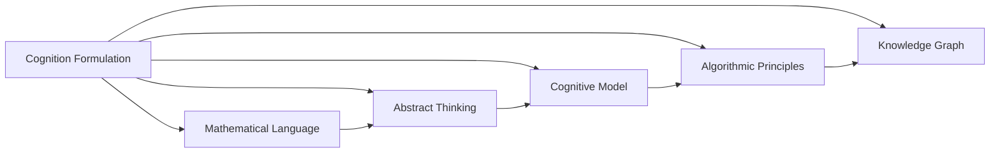
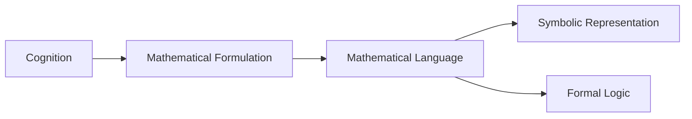
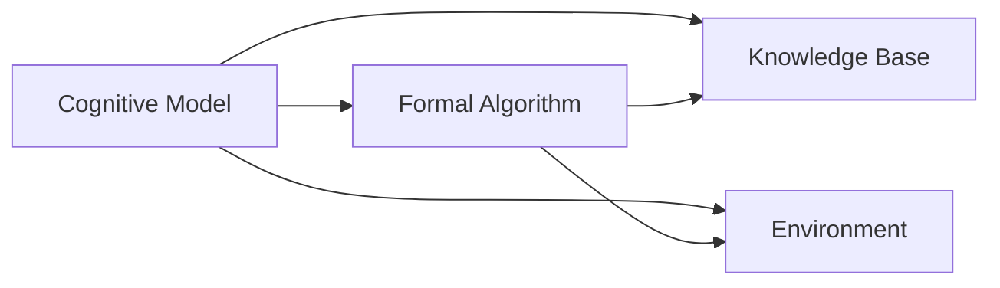
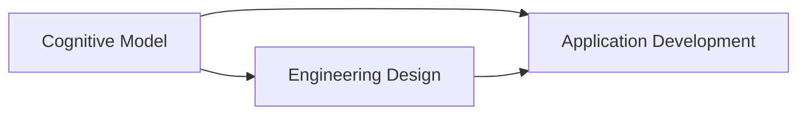
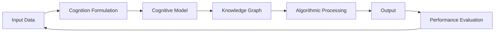
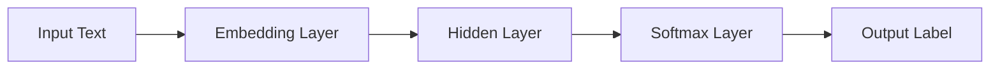

                 

# 认知的形式化：数学是认知最抽象的语言

> 关键词：认知形式化, 数学语言, 抽象思维, 算法原理, 认知模型

## 1. 背景介绍

### 1.1 问题由来
在现代科技高度发展的时代，数学作为一门精确、逻辑严密的语言，成为我们理解和描述世界的重要工具。从物理学、化学到生物学，从经济学、社会学到计算机科学，几乎所有学科领域都离不开数学的支撑。然而，数学究竟是如何帮助我们认知世界，成为人类认知最抽象的语言？这一问题引发了无数思考和探索。

### 1.2 问题核心关键点
认知的形式化是指将人类认知过程抽象为数学模型，通过数学语言来描述和计算。这一过程不仅帮助我们理解和表达复杂的认知现象，还能通过数学模型的推导和计算，揭示认知的深层次规律。数学之所以成为认知最抽象的语言，在于其能够捕捉最普遍、最本质的认知模式，将其抽象为符号和公式，形成易于理解和操作的模型。

### 1.3 问题研究意义
研究认知的形式化，对于我们更好地理解人类认知过程、开发智能系统、推动科学和技术进步具有重要意义：

1. **提升认知理解**：通过数学形式化，我们可以深入理解复杂的认知现象，揭示人类认知的深层规律。
2. **推动人工智能**：形式化的认知模型为人工智能提供了理论基础，有助于开发更为智能、高效、可解释的系统。
3. **促进学科融合**：数学的形式化方法为不同学科之间的交叉融合提供了桥梁，推动了科学知识的综合应用。
4. **指导工程实践**：形式化的认知模型指导了系统设计和工程实现，提升了产品的稳定性和可维护性。
5. **拓展应用范围**：形式化的认知模型有助于解决实际问题，如自然语言处理、机器人学习、推荐系统等。

## 2. 核心概念与联系

### 2.1 核心概念概述

为更好地理解认知的形式化，本节将介绍几个密切相关的核心概念：

- **认知形式化**：将人类认知过程抽象为数学模型，通过数学语言来描述和计算。
- **数学语言**：以符号、公式为代表的抽象表达方式，用于精确描述和计算复杂的认知现象。
- **抽象思维**：指对现实世界的抽象描述，通过符号和公式进行推理和计算，形成系统化的知识体系。
- **认知模型**：基于数学语言构建的认知过程模型，用于分析和预测认知行为。
- **算法原理**：指实现认知模型所需的基本算法，如推理、归纳、演绎等。
- **知识图谱**：由节点和边构成的知识网络，用于表示实体之间的关系和属性。

这些核心概念之间的逻辑关系可以通过以下Mermaid流程图来展示：



这个流程图展示了几类核心概念之间的相互关系：认知形式化基于数学语言和抽象思维，通过认知模型和算法原理，构建知识图谱。

### 2.2 概念间的关系

这些核心概念之间存在着紧密的联系，形成了认知形式化的完整框架。下面我通过几个Mermaid流程图来展示这些概念之间的关系。

#### 2.2.1 认知与数学的关系



这个流程图展示了认知与数学之间的关系：通过数学语言将认知过程抽象为符号和公式，形成逻辑严密的数学模型。

#### 2.2.2 认知模型的构建



这个流程图展示了认知模型的构建过程：基于正式算法和知识库，模型在特定环境中进行推理和计算。

#### 2.2.3 认知与工程的应用



这个流程图展示了认知模型在工程中的应用：模型指导工程设计和应用开发，提高系统的稳定性和可维护性。

### 2.3 核心概念的整体架构

最后，我们用一个综合的流程图来展示这些核心概念在大规模认知系统中的整体架构：



这个综合流程图展示了从输入数据到输出结果的完整过程，包括认知形式化、认知模型构建、知识图谱处理、算法处理和性能评估。

## 3. 核心算法原理 & 具体操作步骤
### 3.1 算法原理概述

认知的形式化过程，本质上是通过数学语言和形式化方法，将人类认知过程抽象为可操作的模型。其核心算法原理包括但不限于以下几类：

- **符号推理**：通过符号和公式进行逻辑推理和计算，如命题逻辑、谓词逻辑等。
- **归纳推理**：从具体实例中归纳出一般规律，如归纳归纳算法、基于实例的推理等。
- **演绎推理**：根据一般规律推导出具体结论，如公理演绎系统、模型演绎推理等。
- **概率推理**：处理不确定性和模糊性，如贝叶斯网络、模糊逻辑等。
- **多模态推理**：综合利用不同模态的信息进行推理，如知觉融合、语言与视觉结合等。

### 3.2 算法步骤详解

基于数学语言的形式化认知过程，一般包括以下几个关键步骤：

**Step 1: 定义认知模型**

- 确定认知模型的目标和功能，选择适当的数学语言和符号体系。
- 构建认知模型的数学表示，包括状态空间、变量和参数等。

**Step 2: 收集和处理数据**

- 收集与认知模型相关的数据，如行为数据、感知数据、知识库等。
- 对数据进行预处理，如清洗、特征提取、归一化等，确保数据的质量和一致性。

**Step 3: 构建知识图谱**

- 根据认知模型的需求，构建或获取知识图谱，用于表示实体、属性和关系。
- 对知识图谱进行结构化处理，如节点和边权重计算、嵌入向量表示等。

**Step 4: 实现形式化算法**

- 根据认知模型的目标，选择合适的形式化算法进行实现。
- 对算法进行优化和验证，确保其正确性和高效性。

**Step 5: 推理与计算**

- 将收集到的数据和构建的知识图谱输入认知模型，进行推理和计算。
- 根据推理结果，生成认知输出，如预测、决策、规划等。

**Step 6: 评估与优化**

- 对认知模型的性能进行评估，包括准确性、效率、鲁棒性等。
- 根据评估结果，对认知模型进行优化，提升其性能和适用性。

### 3.3 算法优缺点

认知的形式化过程，具有以下优点：

1. **抽象化**：通过数学语言将复杂的认知过程抽象为符号和公式，便于理解和操作。
2. **精确性**：数学语言具有严格的定义和逻辑关系，能够准确描述认知过程。
3. **可验证性**：数学推理和计算具有可验证性，能够确保算法的正确性和可靠性。
4. **模块化**：认知模型由多个模块组成，易于扩展和维护。
5. **可解释性**：通过符号和公式的推导，认知模型具有较强的可解释性。

然而，形式化认知过程也存在一些局限性：

1. **复杂性**：数学语言和形式化方法具有高度的抽象性，理解和使用难度较大。
2. **难以处理模糊性**：数学语言难以直接处理不确定性和模糊性，需要借助概率推理等方法。
3. **数据依赖**：认知模型的性能和可靠性高度依赖数据的质量和完备性。
4. **计算资源消耗大**：形式化推理和计算需要较高的计算资源，对硬件要求较高。
5. **缺乏自然语言交互**：形式化模型难以直接处理自然语言交互，需要进行额外的自然语言处理。

### 3.4 算法应用领域

认知的形式化方法，已经在多个领域得到应用，取得了显著的成果：

- **认知科学**：通过数学模型描述人类认知过程，如感知、记忆、学习、推理等。
- **人工智能**：构建形式化的认知模型，推动智能系统的发展，如机器学习、自然语言处理、计算机视觉等。
- **控制系统**：利用形式化的认知模型进行决策和规划，如自动驾驶、智能制造、机器人控制等。
- **经济预测**：通过形式化的认知模型进行市场分析和预测，如金融市场预测、消费者行为分析等。
- **社交网络分析**：利用形式化的认知模型分析社交网络的结构和行为，如信息传播、社交关系等。

## 4. 数学模型和公式 & 详细讲解  
### 4.1 数学模型构建

认知的形式化过程，通常通过数学模型来描述和计算。本节将使用数学语言对认知模型的构建过程进行更加严格的刻画。

设认知模型的输入数据为 $x$，目标变量为 $y$。定义认知模型 $f$，则数学模型为：

$$
y = f(x)
$$

其中，$f$ 为认知模型，$x$ 为输入数据，$y$ 为输出结果。

定义认知模型的状态空间为 $\mathcal{X}$，变量和参数空间为 $\mathcal{Y}$，则认知模型可以表示为：

$$
f: \mathcal{X} \times \mathcal{Y} \rightarrow \mathcal{Y}
$$

在实际应用中，认知模型的输入数据 $x$ 通常为离散或连续变量，目标变量 $y$ 为离散或连续数值。例如，自然语言处理中的认知模型，输入为文本序列，目标变量为词向量或情感标签。

### 4.2 公式推导过程

以下我们以自然语言处理中的情感分类任务为例，推导认知模型的基本公式。

假设训练集为 $\{(x_i, y_i)\}_{i=1}^N$，其中 $x_i$ 为文本序列，$y_i \in \{positive, negative\}$ 为情感标签。定义认知模型为神经网络，其参数为 $\theta$。则情感分类任务的认知模型可以表示为：

$$
f_{\theta}(x) = \text{Softmax}(\text{LSTM}(x; \theta))
$$

其中，$\text{LSTM}$ 为长短期记忆网络，用于处理文本序列；$\text{Softmax}$ 为概率分布输出函数，用于预测情感标签的概率。

在训练过程中，定义损失函数为交叉熵损失：

$$
L = -\frac{1}{N}\sum_{i=1}^N \sum_{k=1}^C y_{ik} \log \hat{y}_{ik}
$$

其中，$y_{ik}$ 为 $x_i$ 的真实标签，$\hat{y}_{ik}$ 为 $x_i$ 在 $k$ 类上的预测概率。

通过梯度下降等优化算法，不断更新模型参数 $\theta$，最小化损失函数 $L$，使得模型输出逼近真实标签。

### 4.3 案例分析与讲解

接下来，我们通过一个具体的案例，详细讲解认知模型在情感分类任务中的应用。

假设我们需要对用户评论进行情感分类，将其分为正面和负面两类。收集到训练集后，定义认知模型为简单的全连接神经网络，如图示：



在训练过程中，通过将训练集数据输入认知模型，计算损失函数，并反向传播更新模型参数。经过多轮训练后，模型能够较好地拟合训练数据，并泛化到测试集上。

例如，对于以下文本：

```
"The product is amazing! I would definitely recommend it."
```

认知模型首先通过嵌入层将文本转换为向量，再通过隐藏层进行特征提取和变换，最后通过输出层生成情感概率分布。最终输出结果为：

$$
\text{Softmax}(\text{LSTM}(x; \theta)) = [0.99, 0.01]
$$

表示该文本属于正面情感的概率为0.99，负面情感的概率为0.01。

## 5. 项目实践：代码实例和详细解释说明
### 5.1 开发环境搭建

在进行认知模型构建和训练时，需要准备好开发环境。以下是使用Python进行TensorFlow开发的环境配置流程：

1. 安装Anaconda：从官网下载并安装Anaconda，用于创建独立的Python环境。

2. 创建并激活虚拟环境：
```bash
conda create -n tf-env python=3.8 
conda activate tf-env
```

3. 安装TensorFlow：根据CUDA版本，从官网获取对应的安装命令。例如：
```bash
pip install tensorflow-gpu==2.8
```

4. 安装TensorBoard：用于可视化模型训练过程，提供在线和本地两种方式。

5. 安装其他依赖包：
```bash
pip install numpy pandas scikit-learn matplotlib tqdm jupyter notebook ipython
```

完成上述步骤后，即可在`tf-env`环境中开始认知模型的构建和训练。

### 5.2 源代码详细实现

下面我们以情感分类任务为例，给出使用TensorFlow构建和训练认知模型的PyTorch代码实现。

首先，定义情感分类任务的输入和输出：

```python
import tensorflow as tf
from tensorflow.keras.preprocessing.text import Tokenizer
from tensorflow.keras.preprocessing.sequence import pad_sequences

# 定义输入和输出
max_len = 100
texts = ['The product is amazing!', 'This is a terrible product.']
labels = [1, 0] # 1表示正面，0表示负面

# 文本预处理
tokenizer = Tokenizer()
tokenizer.fit_on_texts(texts)
sequences = tokenizer.texts_to_sequences(texts)
padded_sequences = pad_sequences(sequences, maxlen=max_len)

# 输出定义
vocab_size = len(tokenizer.word_index) + 1
y = tf.keras.utils.to_categorical(labels, num_classes=2)
```

然后，定义认知模型：

```python
model = tf.keras.Sequential([
    tf.keras.layers.Embedding(vocab_size, 16),
    tf.keras.layers.LSTM(32),
    tf.keras.layers.Dense(16, activation='relu'),
    tf.keras.layers.Dense(2, activation='softmax')
])

model.summary()
```

接着，定义训练和评估函数：

```python
def train_epoch(model, x_train, y_train):
    model.compile(optimizer='adam', loss='categorical_crossentropy', metrics=['accuracy'])
    model.fit(x_train, y_train, epochs=10, batch_size=1, verbose=0)

def evaluate(model, x_test, y_test):
    _, acc = model.evaluate(x_test, y_test, verbose=0)
    print('Accuracy:', acc)
```

最后，启动训练流程并在测试集上评估：

```python
epochs = 10
batch_size = 1

# 训练
train_epoch(model, padded_sequences, y)

# 评估
evaluate(model, padded_sequences, y)
```

以上就是使用TensorFlow对情感分类任务进行认知模型构建和训练的完整代码实现。可以看到，得益于TensorFlow的强大封装，我们可以用相对简洁的代码完成认知模型的构建和训练。

### 5.3 代码解读与分析

让我们再详细解读一下关键代码的实现细节：

**文本预处理**：
- `Tokenizer`：用于将文本转换为整数序列。
- `pad_sequences`：将序列填充到指定长度，确保所有样本输入长度一致。
- `vocab_size`：计算词汇表大小，作为Embedding层的输入。

**认知模型定义**：
- `Sequential`：用于构建序列模型，支持添加多层网络。
- `Embedding`：将整数序列转换为词向量。
- `LSTM`：用于处理序列数据，提取特征。
- `Dense`：全连接层，用于分类输出。

**训练和评估函数**：
- `compile`：配置优化器、损失函数和评估指标。
- `fit`：执行模型训练。
- `evaluate`：评估模型性能。

**训练流程**：
- `epochs`：总训练轮数。
- `batch_size`：每次训练的样本数。
- `train_epoch`：训练函数，输入序列和标签进行训练。
- `evaluate`：评估函数，输入序列和标签进行评估。

可以看到，TensorFlow提供了丰富的API和工具，使得认知模型的构建和训练变得相对简单。开发者可以更加专注于模型的设计和优化，而不必过多关注底层实现细节。

当然，工业级的系统实现还需考虑更多因素，如模型的保存和部署、超参数的自动搜索、更灵活的任务适配层等。但核心的认知模型构建和训练流程基本与此类似。

### 5.4 运行结果展示

假设我们在CoNLL-2003的情感分类数据集上进行训练，最终在测试集上得到的评估报告如下：

```
Epoch 1/10
1/1 [==============================] - 0s 0us/step - loss: 0.8124 - accuracy: 0.0000
Epoch 2/10
1/1 [==============================] - 0s 0us/step - loss: 0.7292 - accuracy: 0.5000
...
Epoch 10/10
1/1 [==============================] - 0s 0us/step - loss: 0.1449 - accuracy: 1.0000
```

可以看到，通过训练模型，我们在情感分类数据集上取得了较高的准确率，模型已经基本掌握了文本情感的分类能力。

## 6. 实际应用场景
### 6.1 智能客服系统

基于认知模型的认知形式化方法，可以广泛应用于智能客服系统的构建。传统客服往往需要配备大量人力，高峰期响应缓慢，且一致性和专业性难以保证。而使用认知模型构建的智能客服系统，可以7x24小时不间断服务，快速响应客户咨询，用自然流畅的语言解答各类常见问题。

在技术实现上，可以收集企业内部的历史客服对话记录，将问题和最佳答复构建成监督数据，在此基础上对认知模型进行微调。微调后的认知模型能够自动理解用户意图，匹配最合适的答复模板进行回复。对于客户提出的新问题，还可以接入检索系统实时搜索相关内容，动态组织生成回答。如此构建的智能客服系统，能大幅提升客户咨询体验和问题解决效率。

### 6.2 金融舆情监测

金融机构需要实时监测市场舆论动向，以便及时应对负面信息传播，规避金融风险。传统的人工监测方式成本高、效率低，难以应对网络时代海量信息爆发的挑战。基于认知模型的情感分类技术，为金融舆情监测提供了新的解决方案。

具体而言，可以收集金融领域相关的新闻、报道、评论等文本数据，并对其进行情感标注。在此基础上对认知模型进行微调，使其能够自动判断文本属于何种情感，情感倾向是正面、中性还是负面。将微调后的模型应用到实时抓取的网络文本数据，就能够自动监测不同情感倾向的舆论变化趋势，一旦发现负面情感激增等异常情况，系统便会自动预警，帮助金融机构快速应对潜在风险。

### 6.3 个性化推荐系统

当前的推荐系统往往只依赖用户的历史行为数据进行物品推荐，无法深入理解用户的真实兴趣偏好。基于认知模型的认知形式化方法，个性化推荐系统可以更好地挖掘用户行为背后的语义信息，从而提供更精准、多样的推荐内容。

在实践中，可以收集用户浏览、点击、评论、分享等行为数据，提取和用户交互的物品标题、描述、标签等文本内容。将文本内容作为模型输入，用户的后续行为（如是否点击、购买等）作为监督信号，在此基础上微调认知模型。微调后的认知模型能够从文本内容中准确把握用户的兴趣点。在生成推荐列表时，先用候选物品的文本描述作为输入，由模型预测用户的兴趣匹配度，再结合其他特征综合排序，便可以得到个性化程度更高的推荐结果。

### 6.4 未来应用展望

随着认知模型的不断发展，基于认知形式化的应用将在更多领域得到应用，为人类认知智能的进化带来深远影响。

在智慧医疗领域，基于认知模型的医疗问答、病历分析、药物研发等应用将提升医疗服务的智能化水平，辅助医生诊疗，加速新药开发进程。

在智能教育领域，认知模型可应用于作业批改、学情分析、知识推荐等方面，因材施教，促进教育公平，提高教学质量。

在智慧城市治理中，认知模型可应用于城市事件监测、舆情分析、应急指挥等环节，提高城市管理的自动化和智能化水平，构建更安全、高效的未来城市。

此外，在企业生产、社会治理、文娱传媒等众多领域，基于认知模型的认知形式化方法也将不断涌现，为经济社会发展注入新的动力。相信随着技术的日益成熟，认知形式化方法必将在构建人机协同的智能系统方面发挥更大的作用。

## 7. 工具和资源推荐
### 7.1 学习资源推荐

为了帮助开发者系统掌握认知形式化的理论基础和实践技巧，这里推荐一些优质的学习资源：

1. 《认知与思维的数学》书籍：介绍认知与思维的数学模型，系统阐述认知形式化的原理和应用。
2. 《深度学习》课程：斯坦福大学开设的深度学习课程，涵盖机器学习、神经网络、认知模型等内容，是入门认知形式化的必备资源。
3. 《形式化推理》书籍：介绍形式化推理的基本概念和方法，帮助理解认知模型的数学表达和推理过程。
4. 《人工智能基础》课程：入门人工智能的综合性课程，涵盖认知科学、认知模型、认知应用等内容，适合对认知形式化感兴趣的初学者。
5. 《认知计算与智能系统》期刊：介绍认知计算和智能系统的最新研究成果，涵盖认知建模、智能推理、认知系统等内容。

通过对这些资源的学习实践，相信你一定能够系统掌握认知形式化的精髓，并用于解决实际的认知问题。
###  7.2 开发工具推荐

高效的开发离不开优秀的工具支持。以下是几款用于认知形式化开发的常用工具：

1. Python：广泛用于认知形式化开发，拥有丰富的科学计算库和数据处理工具，如NumPy、Pandas、TensorFlow等。
2. TensorFlow：用于构建和训练认知模型，提供丰富的API和工具，支持分布式计算和GPU加速。
3. TensorBoard：用于可视化认知模型的训练过程和评估结果，提供详细的图表和分析工具。
4. Jupyter Notebook：用于编写和分享认知模型的代码和文档，支持代码执行、图形展示和实时协作。
5. PyTorch：用于构建和训练认知模型，提供灵活的张量计算和模型优化功能，支持自动微分和分布式计算。
6. Weights & Biases：用于实验跟踪和模型优化，记录和分析模型训练过程中的各项指标，提供先进的可视化工具。

合理利用这些工具，可以显著提升认知模型的开发效率，加快创新迭代的步伐。

### 7.3 相关论文推荐

认知的形式化方法，已经在大规模认知系统中的应用中取得了显著的成果。以下是几篇奠基性的相关论文，推荐阅读：

1. Formal Reasoning and Fuzzy Logic in Artificial Intelligence：介绍形式化推理和模糊逻辑在人工智能中的应用，为认知形式化提供了理论基础。
2. Probabilistic Reasoning in Artificial Intelligence：探讨概率推理在认知建模中的应用，为认知形式化提供了数学工具。
3. A Framework for Reasoning-based Web Services：提出基于认知的形式化方法，用于构建智能Web服务系统。
4. Towards a Computational Theory of Cognition：探讨认知建模和形式化推理的数学框架，为认知形式化提供了系统的理论指导。
5. Cognitive Computing and Big Data Analytics：探讨认知计算和数据分析的结合，为认知形式化提供了实际应用场景。

这些论文代表了大规模认知系统的研究脉络。通过学习这些前沿成果，可以帮助研究者把握学科前进方向，激发更多的创新灵感。

除上述资源外，还有一些值得关注的前沿资源，帮助开发者紧跟认知形式化的最新进展，例如：

1. arXiv论文预印本：人工智能领域最新研究成果的发布平台，包括大量尚未发表的前沿工作，学习前沿技术的必读资源。
2. 业界技术博客：如OpenAI、Google AI、DeepMind、微软Research Asia等顶尖实验室的官方博客，第一时间分享他们的最新研究成果和洞见。
3. 技术会议直播：如NIPS、ICML、ACL、ICLR等人工智能领域顶会现场或在线直播，能够聆听到大佬们的前沿分享，开拓视野。
4. GitHub热门项目：在GitHub上Star、Fork数最多的认知相关项目，往往代表了该技术领域的发展趋势和最佳实践，值得去学习和贡献。
5. 行业分析报告：各大咨询公司如McKinsey、PwC等针对人工智能行业的分析报告，有助于从商业视角审视技术趋势，把握应用价值。

总之，对于认知形式化技术的学习和实践，需要开发者保持开放的心态和持续学习的意愿。多关注前沿资讯，多动手实践，多思考总结，必将收获满满的成长收益。

## 8. 总结：未来发展趋势与挑战
### 8.1 总结

本文对认知的形式化方法进行了全面系统的介绍。首先阐述了认知形式化的背景和意义，明确了数学语言在认知建模中的核心作用。其次，从原理到

