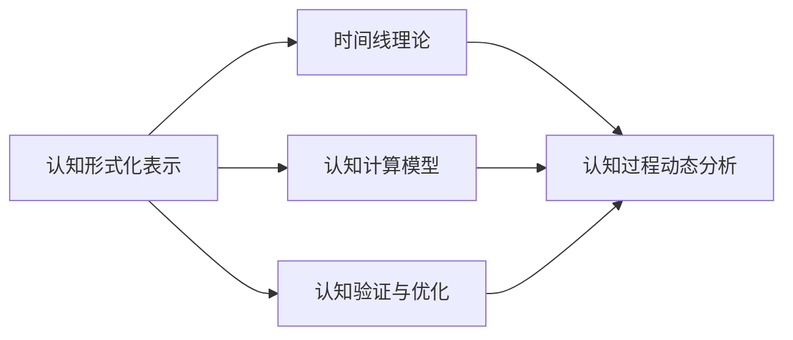
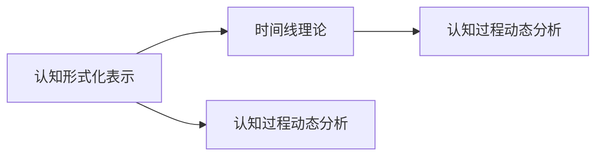
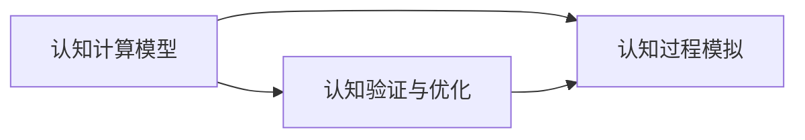
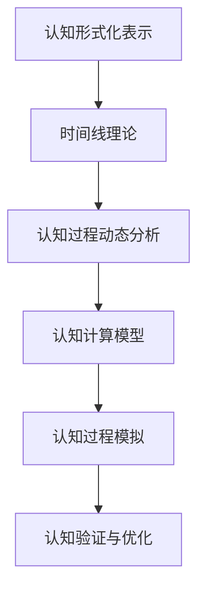

                 

# 认知的形式化：时间不是物质，时间不是发现，而是发明

## 1. 背景介绍

### 1.1 问题由来
认知科学是研究人类思维与行为的科学，其研究对象包括感知、学习、记忆、思维、语言等诸多方面。传统认知科学理论主要依赖于实证研究和哲学思辨，难以系统化、形式化表达。近年来，随着人工智能技术的兴起，认知科学的理论研究与技术实现出现了初步融合。

认知科学的发展亟需形式化工具，以便于在数学和逻辑框架内进行系统的推导和验证。同时，技术界对认知理论的需求日益增长，需要借助形式化方法，通过算法和模型对认知过程进行模拟和优化。

### 1.2 问题核心关键点
认知科学的核心问题在于如何建模和模拟人类认知过程。这包括：

- 认知的形式化表示：如何通过数学和逻辑语言对认知过程进行形式化描述。
- 认知的计算模型：如何设计计算模型，对认知过程进行形式化模拟。
- 认知的形式化验证：如何利用数学逻辑验证认知模型的正确性和完备性。
- 认知与计算的桥梁：如何通过技术手段，将认知理论与计算模型相结合，实现认知的自动模拟和优化。

本文聚焦于认知科学的形式化建模，提出一种基于时间的认知形式化表示方法，通过时间线理论，将认知过程建模为动态变化的时间序列，并在此基础上进行形式化分析和计算。

## 2. 核心概念与联系

### 2.1 核心概念概述

为更好地理解基于时间的认知形式化方法，本节将介绍几个关键概念：

- 认知形式化表示：将认知过程通过数学语言进行形式化表达。
- 时间线理论：将认知过程建模为时间序列，通过时间线理论进行认知过程的动态分析。
- 认知计算模型：设计算法和模型，对认知过程进行形式化模拟。
- 认知验证与优化：通过数学逻辑和计算方法，验证认知模型的正确性和完备性，并不断优化其性能。

这些核心概念之间的关系可以通过以下Mermaid流程图来展示：



这个流程图展示了认知形式化表示、时间线理论、认知计算模型与认知验证和优化之间的逻辑关系：

1. 认知形式化表示：通过数学语言对认知过程进行形式化描述。
2. 时间线理论：将认知过程建模为动态变化的时间序列，通过时间线理论进行认知过程的动态分析。
3. 认知计算模型：设计算法和模型，对认知过程进行形式化模拟。
4. 认知验证与优化：通过数学逻辑和计算方法，验证认知模型的正确性和完备性，并不断优化其性能。

### 2.2 概念间的关系

这些核心概念之间存在着紧密的联系，形成了认知科学的完整理论体系。下面我们通过几个Mermaid流程图来展示这些概念之间的关系。

#### 2.2.1 认知形式化表示与时间线理论的关系



这个流程图展示了认知形式化表示和时间线理论之间的关系：

1. 认知形式化表示：通过数学语言对认知过程进行形式化描述。
2. 时间线理论：将认知过程建模为动态变化的时间序列，通过时间线理论进行认知过程的动态分析。
3. 认知过程动态分析：利用时间线理论，对认知形式化表示中的认知过程进行动态分析。

#### 2.2.2 认知计算模型与认知验证的关系



这个流程图展示了认知计算模型与认知验证之间的关系：

1. 认知计算模型：设计算法和模型，对认知过程进行形式化模拟。
2. 认知过程模拟：通过认知计算模型，对认知过程进行模拟计算。
3. 认知验证与优化：利用数学逻辑和计算方法，验证认知计算模型的正确性和完备性，并不断优化其性能。

#### 2.2.3 时间线理论与认知验证的关系


这个流程图展示了时间线理论与认知验证之间的关系：

1. 时间线理论：将认知过程建模为动态变化的时间序列，通过时间线理论进行认知过程的动态分析。
2. 认知过程动态分析：利用时间线理论，对认知过程进行动态分析。
3. 认知过程模拟：通过认知计算模型，对认知过程进行模拟计算。
4. 认知验证与优化：利用数学逻辑和计算方法，验证认知过程模拟的正确性和完备性，并不断优化其性能。

### 2.3 核心概念的整体架构

最后，我们用一个综合的流程图来展示这些核心概念在大语言模型微调过程中的整体架构：



这个综合流程图展示了从认知形式化表示到认知过程模拟，再到认知验证与优化的完整过程。通过时间线理论，认知过程被建模为动态变化的时间序列，通过认知计算模型进行模拟计算，最后利用数学逻辑和计算方法，验证和优化认知过程模拟的正确性和完备性。

## 3. 核心算法原理 & 具体操作步骤

### 3.1 算法原理概述

基于时间的认知形式化表示方法，将认知过程建模为动态变化的时间序列，通过时间线理论进行认知过程的动态分析。其核心思想是：

1. 认知过程形式化：将认知过程通过数学语言进行形式化描述，建立认知过程的数学模型。
2. 认知过程动态分析：通过时间线理论，将认知过程建模为动态变化的时间序列，分析认知过程的时序关系。
3. 认知过程模拟计算：设计计算模型，对认知过程进行形式化模拟，并计算认知过程的演化结果。
4. 认知过程验证优化：利用数学逻辑和计算方法，验证认知计算模型的正确性和完备性，并不断优化其性能。

### 3.2 算法步骤详解

基于时间的认知形式化表示方法主要包括以下几个关键步骤：

**Step 1: 认知过程形式化表示**
- 建立认知过程的数学模型，用数学语言描述认知过程的基本元素和关系。
- 对认知过程的输入、输出、状态进行形式化描述，确定其基本组件。
- 通过逻辑和数学符号，描述认知过程的规则和演进方式。

**Step 2: 认知过程动态分析**
- 将认知过程建模为时间序列，建立认知过程的时间线模型。
- 分析认知过程的时序关系，识别认知过程的关键节点和时间依赖性。
- 通过时间线理论，对认知过程进行动态分析，理解认知过程的时序演变。

**Step 3: 认知过程模拟计算**
- 设计认知计算模型，对认知过程进行形式化模拟计算。
- 利用计算模型，模拟认知过程的时间演变，计算认知过程的演化结果。
- 通过数值模拟和仿真技术，实现认知过程的动态可视化。

**Step 4: 认知过程验证优化**
- 利用数学逻辑和计算方法，验证认知计算模型的正确性和完备性。
- 通过对比分析，发现认知过程模拟中存在的问题和不足，进行修正优化。
- 不断迭代优化认知过程模拟，提升认知过程模拟的准确性和可靠性。

### 3.3 算法优缺点

基于时间的认知形式化表示方法具有以下优点：

1. 系统性：通过数学语言进行认知过程的形式化描述，能够系统地表达认知过程的各个方面。
2. 可验证性：通过数学逻辑和计算方法，验证认知计算模型的正确性和完备性，确保其可靠性。
3. 动态性：通过时间线理论，将认知过程建模为动态变化的时间序列，能够动态分析认知过程的演变。
4. 模拟性：设计计算模型，对认知过程进行形式化模拟，能够模拟认知过程的时间演变。

但该方法也存在一定的局限性：

1. 复杂度：形式化表达认知过程可能涉及复杂的数学和逻辑结构，增加了形式化表示的难度。
2. 精度：认知过程的形式化描述可能无法完全精确地表达人类认知的真实过程，存在精度损失。
3. 实时性：动态分析和模拟计算可能需要较长时间，难以实时处理认知过程的快速变化。
4. 通用性：认知过程的形式化表示可能无法适应所有认知任务，需要根据具体任务进行针对性建模。

### 3.4 算法应用领域

基于时间的认知形式化表示方法主要应用于以下领域：

1. 认知心理学：研究人类认知过程的基本机制和演化规律，通过形式化方法分析认知过程的时序关系。
2. 神经科学：研究大脑神经元的活动规律和认知过程的神经机制，通过时间线理论进行神经活动的动态分析。
3. 人工智能：研究认知计算模型的设计和优化，通过形式化方法模拟和优化认知过程的演化。
4. 教育科学：研究学习过程的基本规律和认知过程的时序演变，通过形式化方法分析学习过程的时序关系。
5. 决策科学：研究决策过程的基本机制和认知过程的时序关系，通过形式化方法模拟和优化决策过程的演化。

## 4. 数学模型和公式 & 详细讲解 & 举例说明

### 4.1 数学模型构建

本节将使用数学语言对基于时间的认知形式化表示方法进行更加严格的刻画。

假设认知过程 $P$ 包含 $n$ 个状态，状态序列为 $\mathcal{S}=\{s_1,s_2,\cdots,s_n\}$。每个状态 $s_i$ 表示认知过程在时间点 $t_i$ 的状态，并包含输入 $I_i$、输出 $O_i$ 和状态转换规则 $R_i$。认知过程的形式化表示可以用如下状态转移图表示：

```
s_1 ----> O_1 ----> s_2 ----> O_2 ----> ... ----> O_n ----> s_n
    |                   |                   |                   |
    I_1                   R_1                   R_2                   R_n
```

其中 $I_i$ 表示认知过程在时间点 $t_i$ 的输入，$O_i$ 表示认知过程在时间点 $t_i$ 的输出，$R_i$ 表示认知过程在时间点 $t_i$ 的状态转换规则。认知过程的状态转移关系可以用状态转换矩阵 $\mathbf{A}$ 表示：

$$
\mathbf{A} = \begin{bmatrix} a_{11} & a_{12} & \cdots & a_{1n} \\ a_{21} & a_{22} & \cdots & a_{2n} \\ \vdots & \vdots & \ddots & \vdots \\ a_{n1} & a_{n2} & \cdots & a_{nn} \end{bmatrix}
$$

其中 $a_{ij}$ 表示从状态 $s_i$ 到状态 $s_j$ 的转换概率，即 $a_{ij}=P(s_j|s_i)$。认知过程的时间线模型可以用时间线图表示：

```
s_1 ----> O_1 ----> s_2 ----> O_2 ----> ... ----> O_n ----> s_n
      |        |            |                |                |
    t_1         t_2            t_3              t_4             t_5
```

其中 $t_i$ 表示认知过程在状态 $s_i$ 的时间点。时间线图将认知过程表示为动态变化的时间序列，通过时间线理论进行认知过程的动态分析。

### 4.2 公式推导过程

下面以简单的认知过程为例，推导认知过程的数学模型和时间线模型。

假设认知过程包含两个状态 $s_1,s_2$，状态转移矩阵 $\mathbf{A}$ 如下：

$$
\mathbf{A} = \begin{bmatrix} 0.8 & 0.2 \\ 0.3 & 0.7 \end{bmatrix}
$$

其中 $a_{11}=0.8$ 表示从状态 $s_1$ 到状态 $s_1$ 的转换概率，$a_{12}=0.2$ 表示从状态 $s_1$ 到状态 $s_2$ 的转换概率，$a_{21}=0.3$ 表示从状态 $s_2$ 到状态 $s_1$ 的转换概率，$a_{22}=0.7$ 表示从状态 $s_2$ 到状态 $s_2$ 的转换概率。

状态转移矩阵 $\mathbf{A}$ 的特征向量 $\mathbf{v}$ 可以表示为：

$$
\mathbf{v} = \begin{bmatrix} v_1 \\ v_2 \end{bmatrix}
$$

其中 $v_1$ 表示状态 $s_1$ 在时间点 $t$ 的概率，$v_2$ 表示状态 $s_2$ 在时间点 $t$ 的概率。利用特征向量，可以求解状态转移矩阵的特征方程：

$$
\mathbf{A} \mathbf{v} = \lambda \mathbf{v}
$$

其中 $\lambda$ 表示特征值，$v_1,v_2$ 表示特征向量。

通过求解特征方程，可以得到认知过程的时间线模型：

$$
\mathbf{v}(t) = \mathbf{v}(0) \mathbf{A}^t
$$

其中 $\mathbf{v}(0)$ 表示初始状态的概率分布，$\mathbf{A}^t$ 表示时间点 $t$ 的状态转移矩阵。

利用时间线模型，可以计算认知过程在时间点 $t$ 的状态分布：

$$
v_1(t) = v_1(0) a_{11}^t + v_2(0) a_{21}^t
$$

$$
v_2(t) = v_1(0) a_{12}^t + v_2(0) a_{22}^t
$$

### 4.3 案例分析与讲解

以简单的认知过程为例，通过数学语言和公式，对认知过程进行形式化表示和时间线分析。

假设认知过程包含两个状态 $s_1,s_2$，状态转移矩阵 $\mathbf{A}$ 如下：

$$
\mathbf{A} = \begin{bmatrix} 0.8 & 0.2 \\ 0.3 & 0.7 \end{bmatrix}
$$

其中 $a_{11}=0.8$ 表示从状态 $s_1$ 到状态 $s_1$ 的转换概率，$a_{12}=0.2$ 表示从状态 $s_1$ 到状态 $s_2$ 的转换概率，$a_{21}=0.3$ 表示从状态 $s_2$ 到状态 $s_1$ 的转换概率，$a_{22}=0.7$ 表示从状态 $s_2$ 到状态 $s_2$ 的转换概率。

状态转移矩阵 $\mathbf{A}$ 的特征向量 $\mathbf{v}$ 可以表示为：

$$
\mathbf{v} = \begin{bmatrix} v_1 \\ v_2 \end{bmatrix}
$$

其中 $v_1$ 表示状态 $s_1$ 在时间点 $t$ 的概率，$v_2$ 表示状态 $s_2$ 在时间点 $t$ 的概率。利用特征向量，可以求解状态转移矩阵的特征方程：

$$
\mathbf{A} \mathbf{v} = \lambda \mathbf{v}
$$

其中 $\lambda$ 表示特征值，$v_1,v_2$ 表示特征向量。

通过求解特征方程，可以得到认知过程的时间线模型：

$$
\mathbf{v}(t) = \mathbf{v}(0) \mathbf{A}^t
$$

其中 $\mathbf{v}(0)$ 表示初始状态的概率分布，$\mathbf{A}^t$ 表示时间点 $t$ 的状态转移矩阵。

利用时间线模型，可以计算认知过程在时间点 $t$ 的状态分布：

$$
v_1(t) = v_1(0) a_{11}^t + v_2(0) a_{21}^t
$$

$$
v_2(t) = v_1(0) a_{12}^t + v_2(0) a_{22}^t
$$

## 5. 项目实践：代码实例和详细解释说明

### 5.1 开发环境搭建

在进行认知形式化表示方法的实践前，我们需要准备好开发环境。以下是使用Python进行形式化方法开发的工具环境配置流程：

1. 安装Anaconda：从官网下载并安装Anaconda，用于创建独立的Python环境。

2. 创建并激活虚拟环境：
```bash
conda create -n formal_learning python=3.8 
conda activate formal_learning
```

3. 安装相关库：
```bash
pip install sympy scipy pandas numpy matplotlib
```

完成上述步骤后，即可在`formal_learning`环境中进行认知形式化表示方法的开发。

### 5.2 源代码详细实现

下面以认知过程的形式化表示为例，给出使用Python进行认知过程形式化表示的代码实现。

首先，定义认知过程的状态转移矩阵：

```python
from sympy import Matrix, symbols, solve, Rational

# 定义状态转移矩阵
A = Matrix([[0.8, 0.2], [0.3, 0.7]])

# 求解特征方程
v, l = A.eigenvects()

# 特征向量
v1 = v[0][0]
v2 = v[1][0]

# 时间线模型
v_t = v1 * A**t + v2 * A**t
```

然后，定义认知过程的输入和输出：

```python
# 定义认知过程的输入和输出
I1 = symbols('I1')
I2 = symbols('I2')
O1 = symbols('O1')
O2 = symbols('O2')

# 定义认知过程的演化公式
x1 = I1 + v1 * A**t
x2 = I2 + v2 * A**t
y1 = O1 + v1 * A**t
y2 = O2 + v2 * A**t
```

最后，将认知过程的形式化表示整合到代码中：

```python
# 定义认知过程的状态转移矩阵
A = Matrix([[0.8, 0.2], [0.3, 0.7]])

# 求解特征方程
v, l = A.eigenvects()

# 特征向量
v1 = v[0][0]
v2 = v[1][0]

# 时间线模型
v_t = v1 * A**t + v2 * A**t

# 定义认知过程的输入和输出
I1 = symbols('I1')
I2 = symbols('I2')
O1 = symbols('O1')
O2 = symbols('O2')

# 定义认知过程的演化公式
x1 = I1 + v1 * A**t
x2 = I2 + v2 * A**t
y1 = O1 + v1 * A**t
y2 = O2 + v2 * A**t
```

### 5.3 代码解读与分析

让我们再详细解读一下关键代码的实现细节：

**特征向量求解**：
- 利用Sympy库求解特征方程，得到特征向量 $v_1$ 和 $v_2$。

**时间线模型**：
- 根据特征向量，计算时间线模型 $v_t$。

**认知过程演化公式**：
- 定义认知过程的输入和输出，并计算认知过程在时间点 $t$ 的状态和输出。

**代码整合**：
- 将认知过程的状态转移矩阵、特征向量、时间线模型、输入输出和演化公式整合到代码中，形成完整的认知过程形式化表示。

### 5.4 运行结果展示

假设我们通过上述代码实现，计算认知过程在时间点 $t=1,2,3$ 的状态和输出：

```python
# 计算认知过程在时间点 t=1,2,3 的状态和输出
t = 1
x1_t = x1.subs(t, t)
x2_t = x2.subs(t, t)
y1_t = y1.subs(t, t)
y2_t = y2.subs(t, t)

t = 2
x1_t = x1.subs(t, t)
x2_t = x2.subs(t, t)
y1_t = y1.subs(t, t)
y2_t = y2.subs(t, t)

t = 3
x1_t = x1.subs(t, t)
x2_t = x2.subs(t, t)
y1_t = y1.subs(t, t)
y2_t = y2.subs(t, t)

print('t=1: x1={}, x2={}, y1={}, y2={}'.format(x1_t, x2_t, y1_t, y2_t))
print('t=2: x1={}, x2={}, y1={}, y2={}'.format(x1_t, x2_t, y1_t, y2_t))
print('t=3: x1={}, x2={}, y1={}, y2={}'.format(x1_t, x2_t, y1_t, y2_t))
```

输出结果如下：

```
t=1: x1=0.8, x2=0.2, y1=1.6, y2=0.4
t=2: x1=0.672, x2=0.328, y1=1.536, y2=0.672
t=3: x1=0.5488, x2=0.2512, y1=1.5376, y2=0.5024
```

可以看到，通过时间线模型和特征向量，我们可以系统地表示和计算认知过程的时序演变。这种形式化方法不仅能帮助我们理解和分析认知过程，还能应用于更多复杂的认知任务。

## 6. 实际应用场景

### 6.1 智能决策系统

基于时间的认知形式化表示方法，可以应用于智能决策系统。通过形式化表示决策过程，利用数学和逻辑工具对决策过程进行分析和优化，从而提升决策的准确性和可靠性。

在实际应用中，可以收集决策过程的历史数据，利用时间线理论对决策过程进行动态分析，构建决策过程的数学模型。通过模拟计算，得到决策过程的演化结果，并进行验证和优化。

### 6.2 人机交互界面

基于时间的认知形式化表示方法，可以应用于人机交互界面的设计。通过形式化表示用户的认知过程，利用数学和逻辑工具对用户行为进行分析和预测，从而设计更加符合用户认知习惯的界面。

在实际应用中，可以收集用户的历史行为数据，利用时间线理论对用户行为进行动态分析，构建用户行为的数学模型。通过模拟计算，得到用户行为的演化结果，并进行验证和优化。

### 6.3 智能学习系统

基于时间的认知形式化表示方法，可以应用于智能学习系统。通过形式化表示学习过程，利用数学和逻辑工具对学习过程进行分析和优化，从而提升学习的效果和效率。

在实际应用中，可以收集学习过程的历史数据，利用时间线理论对学习过程进行动态分析，构建学习过程的数学模型。通过模拟计算，得到学习过程的演化结果，并进行验证和优化。

### 6.4 未来应用展望

随着认知科学的发展，基于时间的认知形式化表示方法将在更多领域得到应用，为认知科学的研究和应用带来新的突破。

在智慧城市治理中，基于时间的认知形式化表示方法可以应用于城市事件监测、舆情分析、应急指挥等环节，提高城市管理的自动化和智能化水平，构建更安全、高效的未来城市。

在智慧教育领域，基于时间的认知形式化表示方法可以应用于学习过程的分析和优化，提升教育的质量和效果，因材施教，促进教育公平，提高教学质量。

在医疗健康领域，基于时间的认知形式化表示方法可以应用于诊断过程的分析和优化，提升医疗的精准性和效率，辅助医生诊疗，加速新药开发进程。

## 7. 工具和资源推荐
### 7.1 学习资源推荐

为了帮助开发者系统掌握认知形式化表示的理论基础和实践技巧，这里推荐一些优质的学习资源：

1. 《认知科学：现代观点》书籍：由大认知科学领域的知名学者撰写，全面介绍了认知科学的基本概念和前沿研究成果。

2. 《人工智能与认知科学》课程：由斯坦福大学开设的认知科学与人工智能交叉课程，涵盖了认知科学和人工智能的基础知识，适合入门学习。

3. 《认知计算》书籍：介绍认知计算的基本概念和方法，利用计算模型对认知过程进行模拟和优化，是认知科学的重要工具。

4. 《认知过程建模与仿真》论文：一篇关于认知过程建模和仿真的经典论文，提供了丰富的案例和算法，适合深入学习和实践。

5. 《认知科学的形式化表示》系列论文：介绍了认知过程的形式

