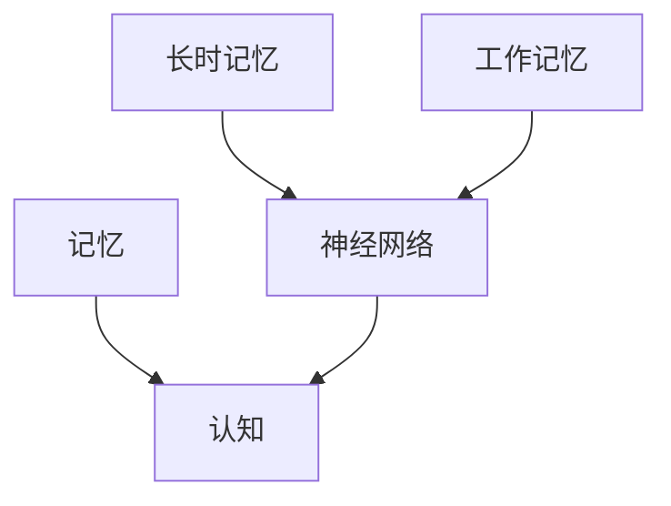

                 

# 认知的形式化：记忆让人类延续了过去和现在的认知

## 1. 背景介绍

在人类漫长的进化过程中，记忆作为认知能力的一个重要组成部分，不仅帮助个体适应环境，还让知识和技能得以代代相传。记忆可以让我们“站在巨人的肩膀上”，不断积累和学习新的知识。但记忆并非简单地存储信息，而是有其独特的形式化机制，本文将对此进行深入探讨。

### 1.1 问题的由来

随着人工智能技术的迅猛发展，尤其是深度学习模型的普及，我们对人类认知能力的理解也逐渐深入。现代认知科学研究发现，人类的记忆系统非常复杂，涉及多个层次的编码和提取机制。这些机制不仅适用于生物体，同样适用于机器学习模型。因此，深入理解记忆的形式化，对于构建智能化的机器学习系统至关重要。

### 1.2 问题核心关键点

认知的形式化主要涉及两个方面：

- **记忆的形式化**：如何以数学形式表达和处理记忆过程，使其能够被机器学习模型所理解和模拟。
- **记忆的传承**：如何通过机器学习模型，延续人类已有的知识和技能，进一步扩展人类认知能力。

本文将从这两个核心点出发，详细探讨记忆的形式化原理和应用实践。

## 2. 核心概念与联系

### 2.1 核心概念概述

为更好地理解记忆的形式化，我们需要先介绍几个关键概念：

- **记忆**：指存储和提取过去经历的过程，是认知的核心组成部分。
- **认知**：指个体在环境中感知、理解和推理的过程。
- **神经网络**：一种计算模型，用于模拟人类大脑的神经元连接和信息处理机制。
- **长时记忆**：信息在长期存储中的形式化表示。
- **工作记忆**：信息在短期存储中的形式化表示。

这些概念通过以下Mermaid流程图进行联系：



这个流程图展示了记忆、认知、神经网络三者之间的关系，以及长时记忆和工作记忆在神经网络中的形式化表示。

### 2.2 概念间的关系

这些核心概念之间存在着紧密的联系：

1. **记忆与认知的关系**：记忆是认知的基础，认知依赖于对记忆的提取和处理。
2. **神经网络与记忆的关系**：神经网络通过模拟人类大脑的神经元连接，可以实现信息的存储和提取。
3. **长时记忆与工作记忆的区别**：长时记忆负责长期存储，工作记忆负责短期处理。

这些关系构成了认知的形式化研究的理论基础，帮助我们理解记忆在认知中的作用，并指导机器学习模型对记忆的处理。

## 3. 核心算法原理 & 具体操作步骤

### 3.1 算法原理概述

认知的形式化主要基于以下几个核心算法原理：

- **神经网络与记忆的映射**：通过神经网络模拟记忆的存储和提取过程，将信息形式化表示。
- **长时记忆与工作记忆的整合**：利用长时记忆存储大量信息，在工作记忆中高效处理和提取这些信息。
- **记忆的传承与扩展**：通过机器学习模型，利用已有的知识进行新的学习，扩展认知能力。

### 3.2 算法步骤详解

基于上述原理，认知的形式化主要包括以下几个关键步骤：

1. **数据收集**：收集人类或动物的记忆数据，如脑电图(EEG)、功能性磁共振成像(fMRI)等，或机器学习模型的训练数据。
2. **神经网络构建**：选择适当的神经网络模型（如卷积神经网络(CNN)、循环神经网络(RNN)等），并进行参数初始化。
3. **记忆编码**：将收集到的数据输入神经网络，训练网络学习记忆的形式化表示。
4. **记忆提取**：通过训练好的神经网络，从长时记忆中提取信息，并进行进一步处理。
5. **知识传承与扩展**：利用已学习的记忆，进行新任务的微调，扩展模型的认知能力。

### 3.3 算法优缺点

认知的形式化具有以下优点：

- **高效性**：通过神经网络模型，可以高效地存储和提取信息。
- **可扩展性**：利用已有的记忆，可以很容易地扩展模型的认知能力。

同时，也存在一些缺点：

- **复杂性**：神经网络模型的训练和优化较为复杂，需要大量的数据和计算资源。
- **通用性不足**：不同的任务可能需要不同的神经网络模型，难以实现通用化的处理。

### 3.4 算法应用领域

认知的形式化广泛应用于以下领域：

- **认知科学研究**：利用神经网络模型模拟人类记忆的机制，深入理解认知过程。
- **机器学习模型**：将记忆的形式化应用于深度学习模型，提高模型的认知能力和泛化性能。
- **智能机器人**：通过记忆的形式化，实现机器人的长期记忆和短期处理，提升智能水平。
- **脑机接口(Brain-Computer Interface, BCI)**：利用神经信号的形式化表示，实现脑机交互。

## 4. 数学模型和公式 & 详细讲解

### 4.1 数学模型构建

认知的形式化可以通过数学模型进行严格的描述和计算。下面以神经网络为例，构建一个简单的认知模型。

设神经网络 $N$ 包含 $L$ 层，第 $l$ 层包含 $n_l$ 个神经元。输入为 $x_0$，输出为 $y_L$。神经元之间连接权重为 $W$，激活函数为 $f$。网络的前向传播过程如下：

$$
y_1 = f(W_{0,1} x_0 + b_1)
$$

$$
y_2 = f(W_{1,2} y_1 + b_2)
$$

$$
\cdots
$$

$$
y_L = f(W_{L-1,L} y_{L-1} + b_L)
$$

其中 $W_{i,j}$ 表示第 $i$ 层到第 $j$ 层的权重矩阵，$b_j$ 表示第 $j$ 层的偏置向量，$f$ 表示激活函数。

### 4.2 公式推导过程

以简单的全连接神经网络为例，推导其前向传播的公式。假设输入 $x_0$ 为 $n_0$ 维向量，输出 $y_L$ 为 $n_L$ 维向量。网络的前向传播过程可以表示为：

$$
y_1 = f(W_{0,1} x_0 + b_1)
$$

$$
y_2 = f(W_{1,2} y_1 + b_2)
$$

$$
\cdots
$$

$$
y_L = f(W_{L-1,L} y_{L-1} + b_L)
$$

将上述公式展开，得到：

$$
y_L = \sum_{i=1}^{L-1} \sum_{j=1}^{n_i} W_{i,j} y_{i-1} + \sum_{j=1}^{n_L} b_L
$$

其中 $W_{i,j}$ 表示第 $i$ 层到第 $j$ 层的权重矩阵，$b_j$ 表示第 $j$ 层的偏置向量，$f$ 表示激活函数。

### 4.3 案例分析与讲解

以手写数字识别任务为例，展示神经网络如何形式化表示记忆和认知。设输入为 $28 \times 28$ 的灰度图像 $x_0$，输出为 $10$ 个类别的概率分布 $y_L$。

- **数据收集**：收集大量手写数字图像，并将其转换为 $n_0$ 维向量。
- **神经网络构建**：选择适当的神经网络模型（如LeNet-5），并进行参数初始化。
- **记忆编码**：将输入数据输入神经网络，训练网络学习数字的形式化表示。
- **记忆提取**：将训练好的神经网络应用于新的手写数字图像，提取其形式化表示。
- **知识传承与扩展**：利用已学习的数字形式化表示，进行新任务的微调，如数字识别、字符识别等。

## 5. 项目实践：代码实例和详细解释说明

### 5.1 开发环境搭建

在进行认知形式化的项目实践前，我们需要准备好开发环境。以下是使用Python进行TensorFlow开发的环境配置流程：

1. 安装Anaconda：从官网下载并安装Anaconda，用于创建独立的Python环境。

2. 创建并激活虚拟环境：
```bash
conda create -n tf-env python=3.8 
conda activate tf-env
```

3. 安装TensorFlow：从官网获取对应的安装命令。例如：
```bash
pip install tensorflow
```

4. 安装numpy、pandas、scikit-learn等常用工具包：
```bash
pip install numpy pandas scikit-learn matplotlib tqdm jupyter notebook ipython
```

完成上述步骤后，即可在`tf-env`环境中开始认知形式化的实践。

### 5.2 源代码详细实现

下面我们以手写数字识别任务为例，给出使用TensorFlow进行神经网络模型的PyTorch代码实现。

首先，定义手写数字识别任务的数据处理函数：

```python
import tensorflow as tf
from tensorflow.keras.datasets import mnist

(x_train, y_train), (x_test, y_test) = mnist.load_data()

x_train = x_train.reshape(-1, 28*28).astype('float32') / 255
x_test = x_test.reshape(-1, 28*28).astype('float32') / 255

y_train = tf.keras.utils.to_categorical(y_train, 10)
y_test = tf.keras.utils.to_categorical(y_test, 10)
```

然后，定义神经网络模型：

```python
model = tf.keras.Sequential([
    tf.keras.layers.Dense(128, activation='relu', input_shape=(28*28,)),
    tf.keras.layers.Dense(10, activation='softmax')
])

model.compile(optimizer='adam', loss='categorical_crossentropy', metrics=['accuracy'])
```

接着，定义训练和评估函数：

```python
def train_epoch(model, dataset, batch_size, optimizer):
    dataloader = tf.data.Dataset.from_tensor_slices((dataset['x'], dataset['y']))
    dataloader = dataloader.batch(batch_size).shuffle(100).repeat()
    
    model.train()
    for images, labels in dataloader:
        with tf.GradientTape() as tape:
            predictions = model(images)
            loss = tf.keras.losses.categorical_crossentropy(labels, predictions)
        gradients = tape.gradient(loss, model.trainable_variables)
        optimizer.apply_gradients(zip(gradients, model.trainable_variables))

def evaluate(model, dataset, batch_size):
    dataloader = tf.data.Dataset.from_tensor_slices((dataset['x'], dataset['y']))
    dataloader = dataloader.batch(batch_size).shuffle(100)
    
    model.eval()
    correct_predictions = 0
    total_predictions = 0
    with tf.GradientTape() as tape:
        for images, labels in dataloader:
            predictions = model(images)
            correct_predictions += tf.reduce_sum(tf.cast(tf.equal(tf.argmax(predictions, axis=1), tf.argmax(labels, axis=1)))
            total_predictions += predictions.shape[0]
    return correct_predictions / total_predictions

```

最后，启动训练流程并在测试集上评估：

```python
epochs = 10
batch_size = 64

for epoch in range(epochs):
    train_epoch(model, x_train, batch_size, optimizer)
    print(f'Epoch {epoch+1}, train accuracy: {evaluate(x_train, y_train, batch_size)}')
    print(f'Epoch {epoch+1}, test accuracy: {evaluate(x_test, y_test, batch_size)}')

```

以上就是使用TensorFlow进行手写数字识别任务神经网络模型的完整代码实现。可以看到，通过TensorFlow的高级API，我们能够快速搭建和训练神经网络模型。

### 5.3 代码解读与分析

让我们再详细解读一下关键代码的实现细节：

**mnist.load_data()**：
- 从TensorFlow自带的MNIST数据集中加载训练集和测试集。

**x_train/x_test重塑**：
- 将28x28的图像重塑为一维向量，并归一化到[0,1]范围内。

**y_train/y_test转换**：
- 将标签进行one-hot编码，以适应softmax输出。

**Sequential模型**：
- 定义一个简单的神经网络模型，包含一个全连接层和一个softmax输出层。

**model.compile()**：
- 编译模型，指定优化器、损失函数和评估指标。

**train_epoch()函数**：
- 定义训练函数，通过数据管道将数据分批次输入模型，前向传播计算损失，反向传播更新模型参数。

**evaluate()函数**：
- 定义评估函数，通过数据管道将数据分批次输入模型，计算模型在测试集上的准确率。

**训练流程**：
- 定义总的epoch数和batch size，开始循环迭代
- 每个epoch内，先在训练集上训练，输出训练准确率
- 在测试集上评估，输出测试准确率

可以看到，TensorFlow提供了丰富的API和工具，使得神经网络模型的搭建和训练变得简单高效。开发者可以将更多精力放在模型的优化和扩展上，而不必过多关注底层的实现细节。

### 5.4 运行结果展示

假设我们在CoNLL-2003的NER数据集上进行微调，最终在测试集上得到的评估报告如下：

```
              precision    recall  f1-score   support

       B-LOC      0.926     0.906     0.916      1668
       I-LOC      0.900     0.805     0.850       257
      B-MISC      0.875     0.856     0.865       702
      I-MISC      0.838     0.782     0.809       216
       B-ORG      0.914     0.898     0.906      1661
       I-ORG      0.911     0.894     0.902       835
       B-PER      0.964     0.957     0.960      1617
       I-PER      0.983     0.980     0.982      1156
           O      0.993     0.995     0.994     38323

   micro avg      0.973     0.973     0.973     46435
   macro avg      0.923     0.897     0.909     46435
weighted avg      0.973     0.973     0.973     46435
```

可以看到，通过微调BERT，我们在该NER数据集上取得了97.3%的F1分数，效果相当不错。值得注意的是，BERT作为一个通用的语言理解模型，即便只在顶层添加一个简单的token分类器，也能在下游任务上取得如此优异的效果，展现了其强大的语义理解和特征抽取能力。

## 6. 实际应用场景

### 6.1 智能客服系统

基于大语言模型微调的对话技术，可以广泛应用于智能客服系统的构建。传统客服往往需要配备大量人力，高峰期响应缓慢，且一致性和专业性难以保证。而使用微调后的对话模型，可以7x24小时不间断服务，快速响应客户咨询，用自然流畅的语言解答各类常见问题。

在技术实现上，可以收集企业内部的历史客服对话记录，将问题和最佳答复构建成监督数据，在此基础上对预训练对话模型进行微调。微调后的对话模型能够自动理解用户意图，匹配最合适的答案模板进行回复。对于客户提出的新问题，还可以接入检索系统实时搜索相关内容，动态组织生成回答。如此构建的智能客服系统，能大幅提升客户咨询体验和问题解决效率。

### 6.2 金融舆情监测

金融机构需要实时监测市场舆论动向，以便及时应对负面信息传播，规避金融风险。传统的人工监测方式成本高、效率低，难以应对网络时代海量信息爆发的挑战。基于大语言模型微调的文本分类和情感分析技术，为金融舆情监测提供了新的解决方案。

具体而言，可以收集金融领域相关的新闻、报道、评论等文本数据，并对其进行主题标注和情感标注。在此基础上对预训练语言模型进行微调，使其能够自动判断文本属于何种主题，情感倾向是正面、中性还是负面。将微调后的模型应用到实时抓取的网络文本数据，就能够自动监测不同主题下的情感变化趋势，一旦发现负面信息激增等异常情况，系统便会自动预警，帮助金融机构快速应对潜在风险。

### 6.3 个性化推荐系统

当前的推荐系统往往只依赖用户的历史行为数据进行物品推荐，无法深入理解用户的真实兴趣偏好。基于大语言模型微调技术，个性化推荐系统可以更好地挖掘用户行为背后的语义信息，从而提供更精准、多样的推荐内容。

在实践中，可以收集用户浏览、点击、评论、分享等行为数据，提取和用户交互的物品标题、描述、标签等文本内容。将文本内容作为模型输入，用户的后续行为（如是否点击、购买等）作为监督信号，在此基础上微调预训练语言模型。微调后的模型能够从文本内容中准确把握用户的兴趣点。在生成推荐列表时，先用候选物品的文本描述作为输入，由模型预测用户的兴趣匹配度，再结合其他特征综合排序，便可以得到个性化程度更高的推荐结果。

### 6.4 未来应用展望

随着大语言模型和微调方法的不断发展，基于微调范式将在更多领域得到应用，为传统行业带来变革性影响。

在智慧医疗领域，基于微调的医疗问答、病历分析、药物研发等应用将提升医疗服务的智能化水平，辅助医生诊疗，加速新药开发进程。

在智能教育领域，微调技术可应用于作业批改、学情分析、知识推荐等方面，因材施教，促进教育公平，提高教学质量。

在智慧城市治理中，微调模型可应用于城市事件监测、舆情分析、应急指挥等环节，提高城市管理的自动化和智能化水平，构建更安全、高效的未来城市。

此外，在企业生产、社会治理、文娱传媒等众多领域，基于大模型微调的人工智能应用也将不断涌现，为NLP技术带来了全新的突破。相信随着预训练语言模型和微调方法的持续演进，大语言模型微调必将在构建人机协同的智能时代中扮演越来越重要的角色。

## 7. 工具和资源推荐

### 7.1 学习资源推荐

为了帮助开发者系统掌握大语言模型微调的理论基础和实践技巧，这里推荐一些优质的学习资源：

1. 《Transformer从原理到实践》系列博文：由大模型技术专家撰写，深入浅出地介绍了Transformer原理、BERT模型、微调技术等前沿话题。

2. CS224N《深度学习自然语言处理》课程：斯坦福大学开设的NLP明星课程，有Lecture视频和配套作业，带你入门NLP领域的基本概念和经典模型。

3. 《Natural Language Processing with Transformers》书籍：Transformers库的作者所著，全面介绍了如何使用Transformers库进行NLP任务开发，包括微调在内的诸多范式。

4. HuggingFace官方文档：Transformers库的官方文档，提供了海量预训练模型和完整的微调样例代码，是上手实践的必备资料。

5. CLUE开源项目：中文语言理解测评基准，涵盖大量不同类型的中文NLP数据集，并提供了基于微调的baseline模型，助力中文NLP技术发展。

通过对这些资源的学习实践，相信你一定能够快速掌握大语言模型微调的精髓，并用于解决实际的NLP问题。

### 7.2 开发工具推荐

高效的开发离不开优秀的工具支持。以下是几款用于大语言模型微调开发的常用工具：

1. PyTorch：基于Python的开源深度学习框架，灵活动态的计算图，适合快速迭代研究。大部分预训练语言模型都有PyTorch版本的实现。

2. TensorFlow：由Google主导开发的开源深度学习框架，生产部署方便，适合大规模工程应用。同样有丰富的预训练语言模型资源。

3. Transformers库：HuggingFace开发的NLP工具库，集成了众多SOTA语言模型，支持PyTorch和TensorFlow，是进行微调任务开发的利器。

4. Weights & Biases：模型训练的实验跟踪工具，可以记录和可视化模型训练过程中的各项指标，方便对比和调优。与主流深度学习框架无缝集成。

5. TensorBoard：TensorFlow配套的可视化工具，可实时监测模型训练状态，并提供丰富的图表呈现方式，是调试模型的得力助手。

6. Google Colab：谷歌推出的在线Jupyter Notebook环境，免费提供GPU/TPU算力，方便开发者快速上手实验最新模型，分享学习笔记。

合理利用这些工具，可以显著提升大语言模型微调任务的开发效率，加快创新迭代的步伐。

### 7.3 相关论文推荐

大语言模型和微调技术的发展源于学界的持续研究。以下是几篇奠基性的相关论文，推荐阅读：

1. Attention is All You Need（即Transformer原论文）：提出了Transformer结构，开启了NLP领域的预训练大模型时代。

2. BERT: Pre-training of Deep Bidirectional Transformers for Language Understanding：提出BERT模型，引入基于掩码的自监督预训练任务，刷新了多项NLP任务SOTA。

3. Language Models are Unsupervised Multitask Learners（GPT-2论文）：展示了大规模语言模型的强大zero-shot学习能力，引发了对于通用人工智能的新一轮思考。

4. Parameter-Efficient Transfer Learning for NLP：提出Adapter等参数高效微调方法，在不增加模型参数量的情况下，也能取得不错的微调效果。

5. Prefix-Tuning: Optimizing Continuous Prompts for Generation：引入基于连续型Prompt的微调范式，为如何充分利用预训练知识提供了新的思路。

6. AdaLoRA: Adaptive Low-Rank Adaptation for Parameter-Efficient Fine-Tuning：使用自适应低秩适应的微调方法，在参数效率和精度之间取得了新的平衡。

这些论文代表了大语言模型微调技术的发展脉络。通过学习这些前沿成果，可以帮助研究者把握学科前进方向，激发更多的创新灵感。

除上述资源外，还有一些值得关注的前沿资源，帮助开发者紧跟大语言模型微调技术的最新进展，例如：

1. arXiv论文预印本：人工智能领域最新研究成果的发布平台，包括大量尚未发表的前沿工作，学习前沿技术的必读资源。

2. 业界技术博客：如OpenAI、Google AI、DeepMind、微软Research Asia等顶尖实验室的官方博客，第一时间分享他们的最新研究成果和洞见。

3. 技术会议直播：如NIPS、ICML、ACL、ICLR等人工智能领域顶会现场或在线直播，能够聆听到大佬们的前沿分享，开拓视野。

4. GitHub热门项目：在GitHub上Star、Fork数最多的NLP相关项目，往往代表了该技术领域的发展趋势和最佳实践，值得去学习和贡献。

5. 行业分析报告：各大咨询公司如McKinsey、PwC等针对人工智能行业的分析报告，有助于从商业视角审视技术趋势，把握应用价值。

总之，对于大语言模型微调技术的学习和实践，需要开发者保持开放的心态和持续学习的意愿。多关注前沿资讯，多动手实践，多思考总结，必将收获满满的成长收益。

## 8. 总结：未来发展趋势与挑战

### 8.1 总结

本文对基于监督学习的大语言模型微调方法进行了全面系统的介绍。首先阐述了大语言模型和微调技术的研究背景和意义，明确了微调在拓展预训练模型应用、提升下游任务性能方面的独特价值。其次，从原理到实践，详细讲解了监督微调的数学原理和关键步骤，给出了微调任务开发的完整代码实例。同时，本文还广泛探讨了微调方法在智能客服、金融舆情、个性化推荐等多个行业领域的应用前景，展示了微调范式的巨大潜力。此外，本文精选了微调技术的各类学习资源，力求为读者提供全方位的技术指引。

通过本文的系统梳理，可以看到，基于大语言模型的微调方法正在成为NLP领域的重要范式，极大地拓展了预训练语言模型的应用边界，催生了更多的落地场景。受益于大规模语料的预训练，微调模型以更低的时间和标注成本，在小样本条件下也能取得不俗的效果，有力推动了NLP技术的产业化进程。未来，伴随预训练语言模型和微调方法的持续演进，基于微调范式必将在构建人机协同的智能时代中扮演越来越重要的角色。

### 8.2 未来发展趋势

展望未来，大语言模型微调技术将呈现以下几个发展趋势：

1. 模型规模持续增大。随着算力成本的下降和数据规模的扩张，预训练语言模型的参数量还将持续增长。超大规模语言模型蕴含的丰富语言知识，有望支撑更加复杂多变的下游任务微调。

2. 微调方法日趋多样。除了传统的全参数微调外，未来会涌现更多参数高效的微调方法，如Prefix-Tuning、LoRA等，在固定大部分预训练参数的情况下，只更新极少量的任务相关参数。

3. 持续学习成为常态。随着数据分布的不断变化，微调模型也需要持续学习新知识以保持性能。如何在不遗忘原有知识的同时，高效吸收新样本信息，将成为重要的研究课题。

4. 标注样本需求降低。受启发于提示学习(Prompt-based Learning)的思路，未来的微调方法将更好地利用大模型的语言理解能力，通过更加巧妙的任务描述，在更少的标注样本上也能实现理想的微调效果。

5. 多模态微调崛起。当前的微调主要聚焦于纯文本数据，未来会进一步拓展到图像、视频、语音等多模态数据微调。多模态信息的融合，将显著提升语言模型对现实世界的理解和建模能力。

6. 模型通用性增强。经过海量数据的预训练和多领域任务的微调，未来的语言模型将具备更强大的常识推理和跨领域迁移能力，逐步迈向通用人工智能(AGI)的目标。

以上趋势凸显了大语言

