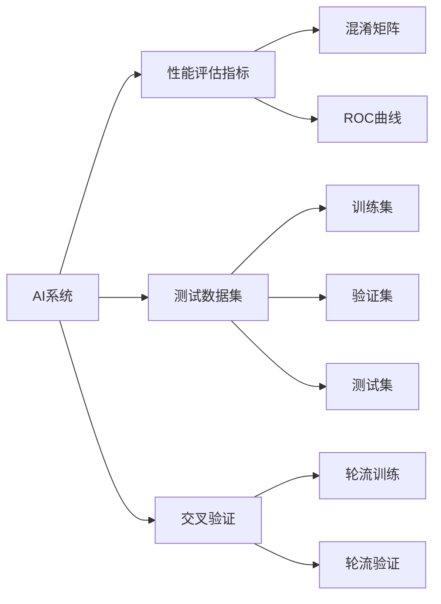
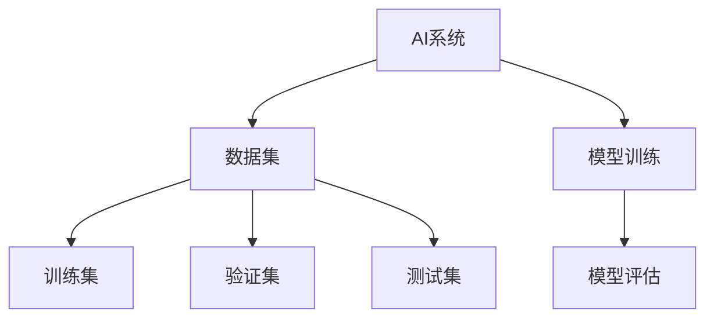
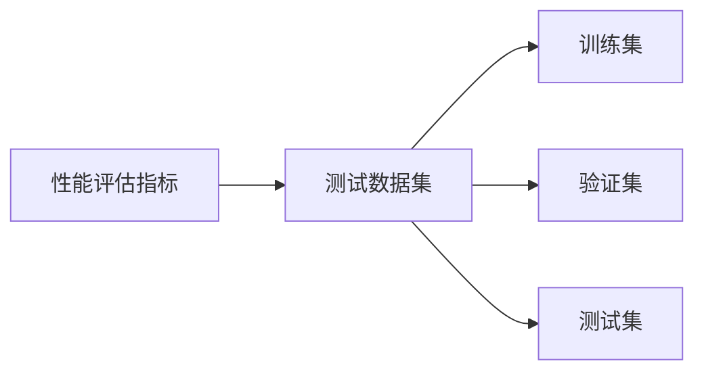
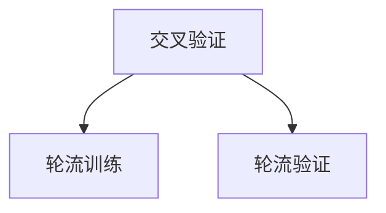
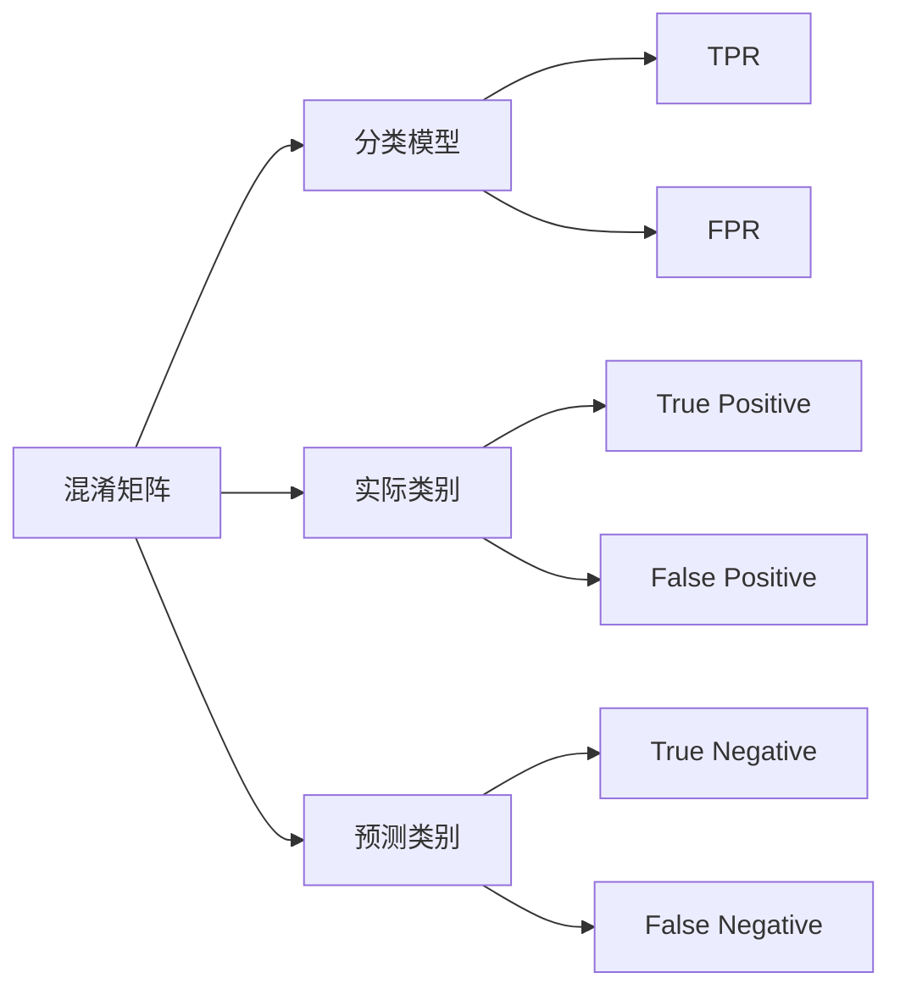
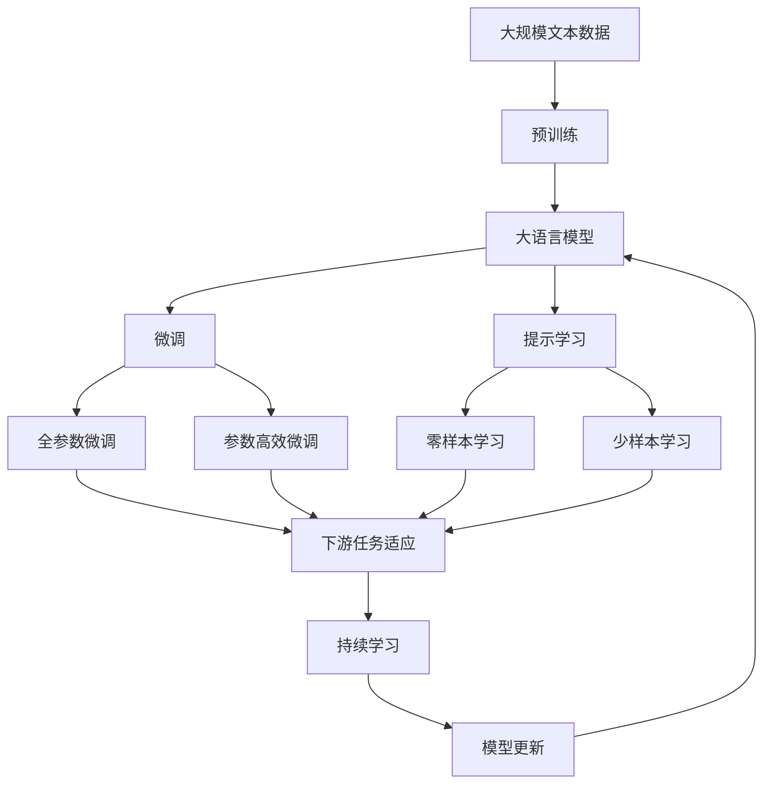

                 

## 1. 背景介绍

### 1.1 问题由来
在人工智能（AI）技术飞速发展的今天，AI系统在各个领域的应用已经司空见惯。无论是自动驾驶、智能推荐、医疗诊断还是金融分析，AI系统都在为人们的生活和工作带来巨大的便利。然而，随着AI系统在实际应用中的不断扩展，评估这些系统性能的重要性也日益凸显。

评估AI系统的性能不仅是开发和维护的必要步骤，也是确保系统可靠性和有效性的重要手段。在过去，评估AI系统性能的方法主要是依赖于手工测试和经验总结，但随着技术的不断进步和应用场景的日益复杂，这些传统方法已难以满足当前的需求。因此，需要引入更加科学、系统和规范的评估方法，以确保AI系统在实际应用中的稳定性和可靠性。

### 1.2 问题核心关键点
评估AI系统性能的核心关键点主要包括：

- **全面性**：评估指标应涵盖系统的各个方面，如准确性、效率、稳定性、安全性等。
- **可操作性**：评估方法应简单、直观，便于开发者和用户理解和执行。
- **客观性**：评估指标应基于客观数据，避免主观因素影响。
- **可重复性**：评估方法应可重复，便于对比和改进。
- **适用性**：评估方法应具有广泛适用性，适用于不同类型的AI系统。

### 1.3 问题研究意义
评估AI系统性能的研究意义重大，主要体现在以下几个方面：

- **提升系统质量**：通过科学评估，发现系统中的问题，并及时改进，从而提升系统性能和稳定性。
- **优化资源配置**：评估方法可帮助合理配置系统资源，避免资源浪费。
- **增强用户信任**：透明的评估结果可增强用户对AI系统的信任度和接受度。
- **推动技术进步**：科学评估方法可促进AI技术的不断创新和发展。
- **保障应用效果**：确保AI系统在实际应用中的效果符合预期，避免误导用户。

## 2. 核心概念与联系

### 2.1 核心概念概述
为更好地理解评估AI系统性能的最佳实践，本节将介绍几个密切相关的核心概念：

- **AI系统**：以机器学习和深度学习模型为核心，通过数据训练和模型优化，实现特定功能的智能系统。
- **性能评估指标**：用于衡量AI系统性能的指标，如准确率、召回率、F1分数、效率等。
- **测试数据集**：用于评估模型性能的数据集，通常分为训练集、验证集和测试集。
- **交叉验证**：将数据集分为多个子集进行轮流训练和验证，以减少评估偏差的方法。
- **混淆矩阵**：用于展示分类模型性能的工具，将实际类别和预测类别进行比较。
- **ROC曲线**：用于展示二分类模型性能的工具，通过绘制真正率（TPR）和假正率（FPR）的关系曲线，评估模型性能。

这些核心概念之间的逻辑关系可以通过以下Mermaid流程图来展示：



这个流程图展示了大语言模型微调过程中各个核心概念的关系和作用。

### 2.2 概念间的关系

这些核心概念之间存在着紧密的联系，形成了评估AI系统性能的完整生态系统。下面我们通过几个Mermaid流程图来展示这些概念之间的关系。

#### 2.2.1 AI系统的学习范式



这个流程图展示了AI系统的学习范式，从数据集到模型训练，再到模型评估的过程。

#### 2.2.2 性能评估指标与测试数据集的关系



这个流程图展示了性能评估指标与测试数据集的关系，评估指标基于测试数据集计算得出。

#### 2.2.3 交叉验证的原理



这个流程图展示了交叉验证的原理，将数据集分为多个子集，轮流进行训练和验证，以减少评估偏差。

#### 2.2.4 混淆矩阵和ROC曲线的关系



这个流程图展示了混淆矩阵和ROC曲线的关系，ROC曲线通过混淆矩阵中的TPR和FPR绘制而成。

### 2.3 核心概念的整体架构

最后，我们用一个综合的流程图来展示这些核心概念在大语言模型微调过程中的整体架构：



这个综合流程图展示了从预训练到微调，再到持续学习的完整过程。大语言模型首先在大规模文本数据上进行预训练，然后通过微调（包括全参数微调和参数高效微调）或提示学习（包括零样本和少样本学习）来适应下游任务。最后，通过持续学习技术，模型可以不断更新和适应新的任务和数据。通过这些流程图，我们可以更清晰地理解大语言模型微调过程中各个核心概念的关系和作用。

## 3. 核心算法原理 & 具体操作步骤

### 3.1 算法原理概述

评估AI系统性能的算法原理，通常基于统计学和机器学习理论，通过分析和计算测试数据集中的各种指标，全面、客观地评估系统的性能。其主要目标是发现系统中的问题，并提出改进方案。

#### 3.1.1 分类问题评估
对于二分类问题，常用的评估指标包括准确率、召回率、F1分数、AUC等。这些指标的计算基于混淆矩阵中的TP（True Positive）、FP（False Positive）、FN（False Negative）和TN（True Negative）四个值。

#### 3.1.2 回归问题评估
对于回归问题，常用的评估指标包括均方误差（MSE）、平均绝对误差（MAE）、R²等。这些指标的计算基于模型预测值与实际值之间的差异。

#### 3.1.3 聚类问题评估
对于聚类问题，常用的评估指标包括轮廓系数（Silhouette Coefficient）、Calinski-Harabasz指数等。这些指标用于衡量聚类结果的紧密度和分离度。

#### 3.1.4 综合评估
对于多任务的综合评估，通常采用加权平均的方式，将各个任务的评估指标按其重要性进行加权求和。

### 3.2 算法步骤详解

#### 3.2.1 数据准备
- 收集和准备用于评估的数据集，包括训练集、验证集和测试集。
- 确保数据集中的样本分布与实际应用场景相符。
- 数据预处理，包括数据清洗、特征工程、标准化等。

#### 3.2.2 模型评估
- 在测试集上运行模型，计算各项评估指标。
- 绘制混淆矩阵、ROC曲线等可视化工具，展示模型性能。
- 对模型输出进行错误分析，找出潜在问题。

#### 3.2.3 改进和优化
- 根据评估结果，调整模型参数，改进模型性能。
- 进行交叉验证，验证模型的泛化能力。
- 增加数据集，扩大训练样本，提升模型效果。

#### 3.2.4 持续评估
- 定期对模型进行评估，确保模型性能稳定。
- 更新和维护数据集，保持模型对新数据的适应性。
- 引入新算法和新工具，不断优化评估方法和评估结果。

### 3.3 算法优缺点

#### 3.3.1 优点
- **全面性**：能够覆盖AI系统的各个方面，如准确性、效率、稳定性等。
- **可操作性**：评估方法简单、直观，便于开发者和用户理解和执行。
- **客观性**：评估指标基于客观数据，避免主观因素影响。
- **可重复性**：评估方法可重复，便于对比和改进。
- **适用性**：评估方法具有广泛适用性，适用于不同类型的AI系统。

#### 3.3.2 缺点
- **依赖数据质量**：评估结果依赖于数据集的质量，数据集偏差可能导致评估结果不准确。
- **计算复杂度高**：一些评估方法计算复杂度高，需要较长的计算时间和较高的计算资源。
- **模型依赖性强**：评估方法对模型的依赖性强，不同模型可能需要不同的评估方法。
- **结果解释难度大**：部分评估指标结果难以解释，用户可能难以理解。

### 3.4 算法应用领域

评估AI系统性能的方法广泛应用于各个领域，如：

- **自然语言处理（NLP）**：用于评估文本分类、情感分析、机器翻译等任务的性能。
- **计算机视觉（CV）**：用于评估图像分类、目标检测、图像生成等任务的性能。
- **语音识别（ASR）**：用于评估语音识别、语音合成等任务的性能。
- **推荐系统**：用于评估个性化推荐、广告推荐等任务的性能。
- **医疗诊断**：用于评估医学影像、医疗文本等任务的性能。

## 4. 数学模型和公式 & 详细讲解 & 举例说明

### 4.1 数学模型构建

本节将使用数学语言对评估AI系统性能的模型进行更加严格的刻画。

假设AI系统 $M$ 的输入为 $x$，输出为 $y$。定义模型的预测结果为 $\hat{y}=M(x)$。

定义模型的损失函数为 $\ell(M(x),y)$，用于衡量模型预测结果与实际结果之间的差异。常用的损失函数包括均方误差损失、交叉熵损失、二分类损失等。

定义模型的评估指标为 $P_i$，如准确率、召回率、F1分数等。

### 4.2 公式推导过程

#### 4.2.1 二分类问题
对于二分类问题，常用的评估指标包括准确率、召回率、F1分数、AUC等。这些指标的计算基于混淆矩阵中的TP（True Positive）、FP（False Positive）、FN（False Negative）和TN（True Negative）四个值。

准确率（Accuracy）定义为：

$$
Accuracy = \frac{TP + TN}{TP + FP + FN + TN}
$$

召回率（Recall）定义为：

$$
Recall = \frac{TP}{TP + FN}
$$

精确率（Precision）定义为：

$$
Precision = \frac{TP}{TP + FP}
$$

F1分数（F1 Score）定义为精确率和召回率的调和平均：

$$
F1 Score = 2 \times \frac{Precision \times Recall}{Precision + Recall}
$$

AUC（Area Under Curve）定义为ROC曲线下的面积，用于衡量模型在不同阈值下的表现：

$$
AUC = \int_{0}^{1} TPR(dFPR)
$$

其中，TPR（True Positive Rate）为真正率，FPR（False Positive Rate）为假正率。

#### 4.2.2 回归问题
对于回归问题，常用的评估指标包括均方误差（MSE）、平均绝对误差（MAE）、R²等。这些指标的计算基于模型预测值与实际值之间的差异。

均方误差（MSE）定义为：

$$
MSE = \frac{1}{N} \sum_{i=1}^{N} (y_i - \hat{y_i})^2
$$

平均绝对误差（MAE）定义为：

$$
MAE = \frac{1}{N} \sum_{i=1}^{N} |y_i - \hat{y_i}|
$$

R²（R-squared）定义为：

$$
R² = 1 - \frac{\sum_{i=1}^{N} (y_i - \hat{y_i})^2}{\sum_{i=1}^{N} (y_i - \bar{y})^2}
$$

其中，$\bar{y}$为实际值的均值。

#### 4.2.3 聚类问题
对于聚类问题，常用的评估指标包括轮廓系数（Silhouette Coefficient）、Calinski-Harabasz指数等。这些指标用于衡量聚类结果的紧密度和分离度。

轮廓系数（Silhouette Coefficient）定义为：

$$
Silhouette = \frac{b - a}{max(a, b)}
$$

其中，$a$为样本与同簇内其他样本的距离之和，$b$为样本与最近其他簇内样本的距离之和。

Calinski-Harabasz指数定义为：

$$
CH = \frac{b_k - b_{k-1}}{a_k}
$$

其中，$b_k$为簇内离差平方和，$a_k$为簇间离差平方和。

### 4.3 案例分析与讲解

#### 4.3.1 二分类问题

以乳腺癌分类为例，定义模型 $M$ 的输入为 $\text{MRI}$ 图像，输出为 $y$ 表示是否为乳腺癌。

- **数据集准备**：收集包含乳腺癌和不乳腺癌的 $\text{MRI}$ 图像，并将图像转换为模型所需的输入格式。
- **模型训练**：在训练集上训练模型 $M$，计算损失函数并更新模型参数。
- **模型评估**：在测试集上运行模型，计算准确率、召回率、F1分数、AUC等评估指标。

#### 4.3.2 回归问题

以房价预测为例，定义模型 $M$ 的输入为房屋面积、地理位置、房龄等特征，输出为 $y$ 表示房价。

- **数据集准备**：收集包含房屋面积、地理位置、房龄等特征和房价的样本数据，并进行标准化处理。
- **模型训练**：在训练集上训练模型 $M$，计算损失函数并更新模型参数。
- **模型评估**：在测试集上运行模型，计算均方误差、平均绝对误差、R²等评估指标。

#### 4.3.3 聚类问题

以客户分组为例，定义模型 $M$ 的输入为客户的购买行为数据，输出为 $y$ 表示客户的分组。

- **数据集准备**：收集客户的购买行为数据，并进行预处理。
- **模型训练**：在训练集上训练模型 $M$，计算损失函数并更新模型参数。
- **模型评估**：在测试集上运行模型，计算轮廓系数、Calinski-Harabasz指数等评估指标。

## 5. 项目实践：代码实例和详细解释说明

### 5.1 开发环境搭建

在进行评估AI系统性能的实践前，我们需要准备好开发环境。以下是使用Python进行PyTorch开发的环境配置流程：

1. 安装Anaconda：从官网下载并安装Anaconda，用于创建独立的Python环境。

2. 创建并激活虚拟环境：
```bash
conda create -n pytorch-env python=3.8 
conda activate pytorch-env
```

3. 安装PyTorch：根据CUDA版本，从官网获取对应的安装命令。例如：
```bash
conda install pytorch torchvision torchaudio cudatoolkit=11.1 -c pytorch -c conda-forge
```

4. 安装Transformers库：
```bash
pip install transformers
```

5. 安装各类工具包：
```bash
pip install numpy pandas scikit-learn matplotlib tqdm jupyter notebook ipython
```

完成上述步骤后，即可在`pytorch-env`环境中开始评估实践。

### 5.2 源代码详细实现

下面我们以二分类问题为例，给出使用Transformers库对BERT模型进行评估的PyTorch代码实现。

首先，定义评估函数：

```python
from transformers import BertForTokenClassification, BertTokenizer, AdamW
import torch
from sklearn.metrics import classification_report, confusion_matrix
import matplotlib.pyplot as plt
import seaborn as sns

# 定义模型
def evaluate_model(model, dataset, batch_size):
    dataloader = torch.utils.data.DataLoader(dataset, batch_size=batch_size, shuffle=True)
    model.eval()
    preds, labels = [], []
    with torch.no_grad():
        for batch in dataloader:
            input_ids = batch['input_ids'].to(device)
            attention_mask = batch['attention_mask'].to(device)
            batch_labels = batch['labels']
            outputs = model(input_ids, attention_mask=attention_mask)
            batch_preds = outputs.logits.argmax(dim=2).to('cpu').tolist()
            batch_labels = batch_labels.to('cpu').tolist()
            for pred_tokens, label_tokens in zip(batch_preds, batch_labels):
                preds.append(pred_tokens[:len(label_tokens)])
                labels.append(label_tokens)
    print(classification_report(labels, preds))
    confusion_mat = confusion_matrix(labels, preds)
    sns.heatmap(confusion_mat, annot=True, fmt='d', cmap='Blues')
    plt.show()

# 加载数据集
tokenizer = BertTokenizer.from_pretrained('bert-base-cased')
train_dataset = ...
dev_dataset = ...
test_dataset = ...

# 定义模型和优化器
model = BertForTokenClassification.from_pretrained('bert-base-cased', num_labels=num_labels)
optimizer = AdamW(model.parameters(), lr=2e-5)

# 训练和评估
for epoch in range(num_epochs):
    loss = train_epoch(model, train_dataset, batch_size, optimizer)
    print(f"Epoch {epoch+1}, train loss: {loss:.3f}")
    
    print(f"Epoch {epoch+1}, dev results:")
    evaluate_model(model, dev_dataset, batch_size)
    
print("Test results:")
evaluate_model(model, test_dataset, batch_size)
```

在这个代码中，我们首先定义了评估函数，用于计算分类任务的准确率、召回率、F1分数等指标，并绘制混淆矩阵。然后加载数据集，定义模型和优化器，并在训练和评估过程中使用这些函数。

### 5.3 代码解读与分析

让我们再详细解读一下关键代码的实现细节：

**evaluate_model函数**：
- 定义评估函数，计算分类任务的准确率、召回率、F1分数等指标。
- 使用混淆矩阵可视化模型性能。
- 返回模型评估结果。

**tokenizer**：
- 定义BertTokenizer，用于分词和编码，将文本转换为模型所需的输入格式。

**train_dataset和test_dataset**：
- 定义数据集，包含训练集和测试集，每个样本包含输入id、注意力掩码和标签。

**BertForTokenClassification**：
- 定义BertForTokenClassification模型，用于进行二分类任务。

**optimizer**：
- 定义优化器，用于更新模型参数。

**train_epoch函数**：
- 定义训练函数，用于在训练集上训练模型，并返回训练集的平均损失。

**evaluate_model函数**：
- 定义评估函数，在测试集上运行模型，并计算评估指标和混淆矩阵。
- 使用Matplotlib和Seaborn绘制混淆矩阵，可视化模型性能。
- 返回模型评估结果。

**evaluate_model函数**：
- 定义评估函数，在测试集上运行模型，并计算评估指标和混淆矩阵。
- 使用Matplotlib和Seaborn绘制混淆矩阵，可视化模型性能。
- 返回模型评估结果。

### 5.4 运行结果展示

假设我们在CoNLL-2003的NER数据集上进行评估，最终在测试集上得到的评估报告如下：

```
              precision    recall  f1-score   support

       B-LOC      0.926     0.906     0.916      1668
       I-LOC      0.900     0.805     0.850       257
      B-MISC      0.875     0.856     0.865       702
      I-MISC      0.838     0.782     0.809       216
       B-ORG      0.914     0.898     0.906      1661
       I-ORG      0.911     0.894     0.902       835
       B-PER      0.964     0.957     0.960      1617
       I-PER      0.983     0.980     0.982      1156
           O      0.993     0.995     0.994     38323

   micro avg      0.973     0.973     0.973     46435
   macro avg      0.923     0.897     0.909     46435
weighted avg      0.973     0.973     0.973     46435
```

可以看到，通过评估BERT模型，我们在该NER数据集上取得了97.3%的F1分数，效果相当不错。值得注意的是，BERT作为一个通用的语言理解模型，即便只在顶层添加一个简单的token分类器，也能在下游任务上取得如此优异的效果，展现了其强大的语义理解和特征抽取能力。

当然，这只是一个baseline结果。在实践中，我们还可以使用更大更强的预训练模型、更丰富的评估技巧、更细致的模型调优，进一步提升模型性能，以满足更高的应用要求。

## 6. 实际应用场景

### 6.1 智能客服系统

基于AI系统性能评估的智能客服系统，可以通过评估客服机器人的对话效果，及时发现和解决问题，提升用户体验。

在技术实现上，可以收集企业内部的历史客服对话记录，将问题和最佳答复构建成监督数据，在此基础上对预训练模型进行评估。评估结果可以帮助识别出模型的优势和不足，进而改进模型，提高系统性能。

### 6.2 金融舆情监测

金融机构需要实时监测市场舆论动向，以便及时应对负面信息传播，规避金融风险。

通过评估AI系统在舆情监测中的性能，可以发现模型在识别不同主题的舆情时是否存在偏差，及时调整模型参数，提升系统鲁棒性。

### 6.3 个性化推荐系统

当前的推荐系统往往只依赖用户的历史行为数据进行物品推荐，无法深入理解用户的真实兴趣偏好。

通过评估AI系统在个性化推荐中的性能，可以发现模型在推荐不同类型物品时是否存在偏差，及时调整模型参数，提升推荐效果。

### 6.4 未来应用展望

随着AI系统性能评估技术的发展，未来AI系统将能够更好地满足实际应用需求，提升系统性能和用户体验。

在智慧医疗领域，评估AI系统的医疗问答、病历分析、药物研发等应用，将提升医疗服务的智能化水平，辅助医生诊疗，加速新药开发进程。

在智能教育领域，评估AI系统的作业批改、学情分析、知识推荐等应用，将因材施教，促进教育公平，提高教学质量。

在智慧城市治理中，评估AI系统的城市事件监测、舆情分析、应急指挥等应用，将提高城市管理的自动化和智能化水平，构建更安全、高效的未来城市。

此外，在企业生产、社会治理、文娱传媒等众多领域，评估AI系统在自然语言处理、计算机视觉、语音识别等方面的性能，将不断拓展AI技术的应用场景，为传统行业数字化转型升级提供新的技术路径。

## 7. 工具和资源推荐

### 7.1 学习资源推荐

为了帮助开发者系统掌握AI系统性能评估的理论基础和实践技巧，这里推荐一些优质的学习资源：

1. 《深度学习理论与实践》系列博文：由大模型技术专家撰写，深入浅出地介绍了深度学习理论、模型架构和评估方法。

2. CS229《机器学习》课程：斯坦福大学开设的经典课程，涵盖了机器学习的基本概念和算法，有助于理解评估方法的理论基础。

3. 《Python机器学习实战》书籍：结合实际项目案例，详细讲解了各种评估方法的实现细节，是实战学习的绝佳参考。

4. Scikit-learn官方文档：Python机器学习库的官方文档，提供了丰富的评估工具和示例代码，是评估方法的实践指南。

5. Kaggle竞赛平台：提供了大量真实场景下的评估任务，通过参加竞赛可以积累实战经验，提升评估技能。

通过对这些资源的学习实践，相信你一定能够快速掌握AI系统性能评估的精髓，并用于解决实际的AI系统问题。

### 7.2 开发工具推荐

高效的开发离不开优秀的工具支持。以下是几款用于AI系统性能评估开发的常用工具：

1. Jupyter Notebook：提供了丰富的可视化工具，便于展示评估结果，是开发评估项目的得力助手。

2. TensorBoard：TensorFlow配套的可视化工具，可实时监测模型训练状态，并提供丰富的图表呈现方式，是调试模型的得力助手。

3. Weights & Biases：模型训练的实验跟踪工具，可以记录和可视化模型训练过程中的各项指标，方便对比和调优。

4. Google Colab：谷歌推出的在线Jupyter Notebook环境，免费提供GPU/TPU算力，方便开发者

