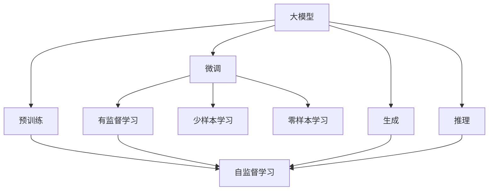
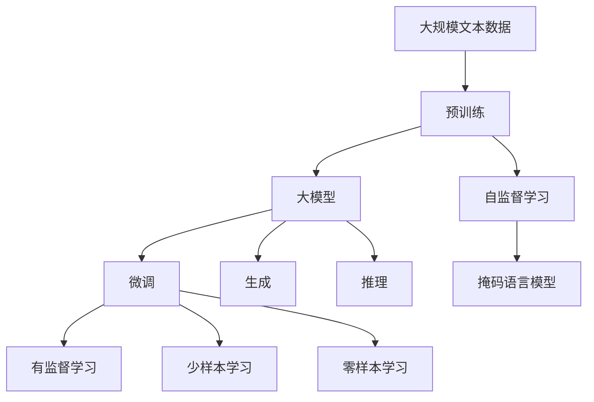
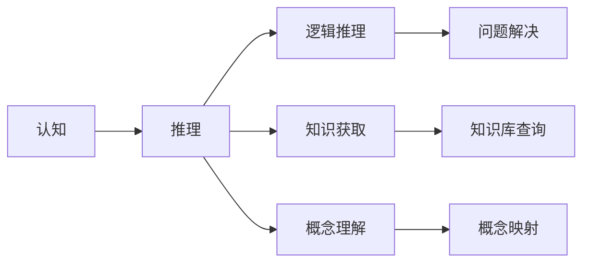
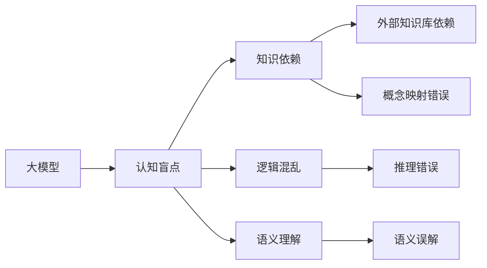
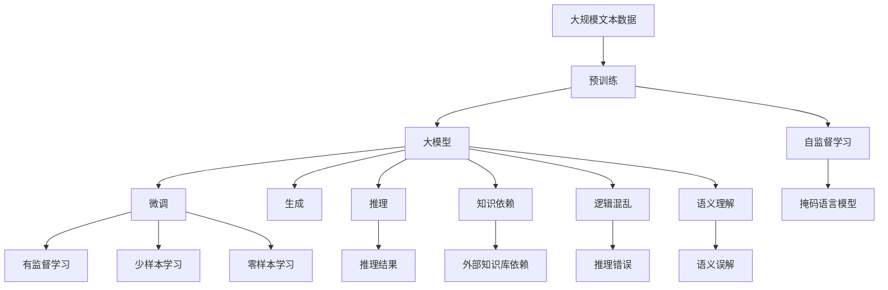

                 

# 语言≠思维：大模型的认知盲点

> 关键词：
- 大模型
- 语言
- 思维
- 认知
- 盲点
- 预训练
- 微调
- 生成
- 推理

## 1. 背景介绍

随着深度学习技术的不断成熟，特别是Transformer结构和大模型的崛起，自然语言处理(Natural Language Processing, NLP)领域取得了翻天覆地的变化。大模型如BERT、GPT、T5等，不仅在文本生成、语言理解、推理等任务上取得了SOTA性能，更是展现了其强大的通用性和可迁移性，引起了学界和工业界的广泛关注。然而，尽管大模型在众多任务上展现了卓越的性能，其在认知能力、语言理解、推理逻辑等方面的表现，仍与人类大脑存在显著差距。本文将围绕这一问题，深入探讨大模型的认知盲点及其可能的原因。

## 2. 核心概念与联系

### 2.1 核心概念概述

要理解大模型的认知盲点，首先需要澄清几个关键概念：

- **大模型(Large Model)**：以Transformer结构为代表的大规模预训练语言模型，如BERT、GPT等。这些模型通过在海量文本数据上进行预训练，学习到了丰富的语言知识和表示能力。

- **预训练(Pre-training)**：在大规模无标签文本数据上，通过自监督学习任务训练通用语言模型的过程。常见的预训练任务包括掩码语言模型、下一句预测等，学习到语言的通用表示。

- **微调(Fine-tuning)**：在预训练模型的基础上，使用下游任务的少量标注数据，通过有监督学习优化模型在特定任务上的性能。通常只调整顶层参数，以避免过拟合。

- **生成(Generative)**：大模型通过自回归或自编码方式，生成自然语言文本或推理结果。如GPT的生成过程。

- **推理(Reasoning)**：大模型通过语言理解和知识推理，解决特定任务。如基于语言知识的问答系统。

- **认知(Cognition)**：人类大脑的信息处理、逻辑推理、知识获取等能力。大模型的推理能力与人类认知存在巨大差异。

这些概念之间的联系可以通过以下Mermaid流程图来展示：



这个流程图展示了大语言模型的核心概念及其之间的关系：

1. 大模型通过预训练获得基础能力。
2. 微调是优化模型在特定任务上的性能。
3. 生成和推理是大模型的主要应用场景。
4. 自监督学习是预训练的核心方法。
5. 有监督学习是微调的核心方法。
6. 少样本和零样本学习是微调的衍生应用。

### 2.2 概念间的关系

这些核心概念之间存在着紧密的联系，形成了大语言模型的认知框架。下面我们通过几个Mermaid流程图来展示这些概念之间的关系。

#### 2.2.1 大模型的学习范式



这个流程图展示了大语言模型的学习范式：

1. 大模型通过预训练学习语言的通用表示。
2. 微调进一步优化模型在特定任务上的性能。
3. 生成和推理是大模型的主要应用场景。
4. 自监督学习是预训练的核心方法。
5. 有监督学习是微调的核心方法。
6. 少样本和零样本学习是微调的衍生应用。

#### 2.2.2 认知与推理的关系



这个流程图展示了认知与推理之间的关系：

1. 认知包括逻辑推理、知识获取、概念理解等能力。
2. 推理通过逻辑推理、知识获取、概念理解等过程，解决具体问题。
3. 推理结果可能依赖于外部知识库和概念映射。

#### 2.2.3 大模型的认知盲点



这个流程图展示了大模型的认知盲点：

1. 大模型存在知识依赖、逻辑混乱、语义理解错误等问题。
2. 这些问题可能导致推理错误和语义误解。
3. 外部知识库和概念映射的依赖使得模型无法完全自主推理。

### 2.3 核心概念的整体架构

最后，我们用一个综合的流程图来展示这些核心概念在大语言模型中的整体架构：



这个综合流程图展示了从预训练到微调，再到推理的完整过程，以及大模型认知盲点的主要来源。通过这些流程图，我们可以更清晰地理解大语言模型的工作原理和认知盲点，为后续深入讨论提供基础。

## 3. 核心算法原理 & 具体操作步骤
### 3.1 算法原理概述

大模型的认知盲点主要体现在其推理能力与人类大脑的差异上。尽管大模型通过预训练和微调在特定任务上取得了卓越性能，但在推理过程中，仍存在以下几方面的限制：

1. **知识依赖(External Knowledge Dependency)**：大模型推理依赖于外部知识库，如Wikipedia等，而非自主构建。这种依赖使得模型无法独立进行推理。
2. **逻辑混乱(Logic Confusion)**：大模型在处理复杂逻辑问题时，容易产生混乱和错误。如数学计算、多步骤推理等问题。
3. **语义理解(Semantic Understanding)**：大模型在理解语义时，容易产生歧义和误解。如双关语、隐喻等问题。
4. **推理错误(Reasoning Error)**：大模型推理结果可能与事实不符，导致决策错误。如信息过时、背景知识错误等问题。
5. **语义误解(Semantic Misinterpretation)**：大模型在处理语义复杂的多义问题时，可能出现误解。如反讽、讽刺等问题。

### 3.2 算法步骤详解

基于上述认知盲点，大模型的推理过程需要进行细致的优化和调整。以下是具体的算法步骤：

**Step 1: 数据预处理**
- 准备下游任务的数据集，并进行清洗和标准化。
- 将文本数据转换为模型可接受的格式，如tokenization、embedding等。
- 选择合适的标注格式，如BIO、IOB、IOBES等，用于推理任务的标注。

**Step 2: 模型加载与适配**
- 加载预训练模型，并进行任务适配。通常只微调顶层参数，避免过拟合。
- 选择合适的任务适配层，如线性分类器、多输出结构等。
- 设计合适的损失函数，如交叉熵、Focal Loss等，用于训练和推理。

**Step 3: 模型微调**
- 使用下游任务的数据集进行微调训练。通常设置较小的学习率，避免破坏预训练权重。
- 使用正则化技术，如L2正则、Dropout等，防止过拟合。
- 引入对抗样本，提高模型的鲁棒性。
- 进行数据增强，如回译、近义替换等，丰富训练集多样性。

**Step 4: 推理与后处理**
- 使用微调后的模型对新数据进行推理。
- 对推理结果进行后处理，如降噪、过滤、纠错等。
- 根据任务特点，选择合适的推理算法，如深度优先搜索、宽度优先搜索等。

### 3.3 算法优缺点

大模型的推理过程具有以下优点和缺点：

**优点**：
- 在特定任务上，通过微调可以获得较好的性能，快速适配新场景。
- 依赖外部知识库，可以处理复杂问题，如知识推理、多义理解等。

**缺点**：
- 推理依赖外部知识库，缺乏自主推理能力。
- 在处理复杂逻辑和语义问题时，容易产生混乱和错误。
- 推理结果可能与事实不符，导致决策错误。

### 3.4 算法应用领域

大模型的推理能力在以下领域得到了广泛应用：

- **问答系统**：如IBM Watson、微软小冰等，通过自然语言理解和大规模知识库，提供基于语言的知识推理服务。
- **推荐系统**：如Amazon、阿里巴巴等电商平台，利用用户行为数据和商品信息进行复杂推理，提供个性化推荐。
- **金融风控**：如银行业风险评估、股票市场分析等，利用大模型进行复杂计算和逻辑推理，保障金融安全。
- **医学诊断**：如AI医疗影像诊断、基因组分析等，利用大模型进行复杂推理，辅助医生诊断决策。
- **法律咨询**：如法律AI、智能客服等，通过自然语言理解和大规模知识库，提供法律咨询和智能辅助。

## 4. 数学模型和公式 & 详细讲解  
### 4.1 数学模型构建

大模型的推理过程可以抽象为一种形式的映射问题，即通过输入文本 $x$ 和外部知识库 $K$，推理得到输出 $y$。形式化地，推理过程可以表示为：

$$
y = f(x, K)
$$

其中，$f$ 为推理模型，$x$ 为输入文本，$K$ 为外部知识库。

### 4.2 公式推导过程

以掩码语言模型为例，推导大模型的推理过程。假设模型在输入文本 $x$ 上输出的概率分布为 $p(x|K)$，则推理过程可以表示为：

$$
y = \arg\max_{y \in \mathcal{Y}} \log p(y|x, K)
$$

其中，$\mathcal{Y}$ 为输出空间，$p(y|x, K)$ 为在外部知识库 $K$ 辅助下，推理结果 $y$ 的条件概率。

在实践中，推理过程通常通过自回归或自编码模型实现。如自回归模型，可以通过前向传播计算 $p(y|x, K)$，然后对所有可能的输出 $y$ 进行最大似然估计。

### 4.3 案例分析与讲解

以下以一个简单的数学问题为例，展示大模型如何进行推理：

**问题**：求解方程 $x^2 - 4 = 0$ 的解。

**输入**：
- 输入文本：$x^2 - 4 = 0$，需要求解 $x$ 的值。
- 外部知识库：包含数学知识库，如方程求解、代数运算等。

**推理过程**：
1. 模型首先通过自回归或自编码方式，理解输入文本的语义。
2. 模型访问外部知识库，查找与输入文本相关的数学知识。
3. 模型根据数学知识，推导出方程求解的公式，并进行数值计算。
4. 模型输出推理结果，即 $x = \pm 2$。

这个案例展示了大模型的推理过程：

- 通过自然语言理解，模型理解输入文本的语义。
- 访问外部知识库，模型获取相关数学知识。
- 根据数学知识，模型进行推理计算。
- 输出推理结果，即数学问题的解。

然而，尽管大模型在上述案例中表现出色，但在处理复杂逻辑和语义问题时，仍存在认知盲点。这些问题可能源自大模型的推理依赖外部知识库、逻辑混乱、语义理解不足等。

## 5. 项目实践：代码实例和详细解释说明
### 5.1 开发环境搭建

在进行大模型推理实践前，我们需要准备好开发环境。以下是使用Python进行PyTorch开发的环境配置流程：

1. 安装Anaconda：从官网下载并安装Anaconda，用于创建独立的Python环境。

2. 创建并激活虚拟环境：
```bash
conda create -n pytorch-env python=3.8 
conda activate pytorch-env
```

3. 安装PyTorch：根据CUDA版本，从官网获取对应的安装命令。例如：
```bash
conda install pytorch torchvision torchaudio cudatoolkit=11.1 -c pytorch -c conda-forge
```

4. 安装各类工具包：
```bash
pip install numpy pandas scikit-learn matplotlib tqdm jupyter notebook ipython
```

完成上述步骤后，即可在`pytorch-env`环境中开始推理实践。

### 5.2 源代码详细实现

这里我们以使用Hugging Face的Roberta模型进行情感分析为例，给出使用PyTorch进行推理的代码实现。

首先，定义情感分析任务的数据处理函数：

```python
from transformers import RobertaTokenizer, RobertaForSequenceClassification
import torch

tokenizer = RobertaTokenizer.from_pretrained('roberta-base')
model = RobertaForSequenceClassification.from_pretrained('roberta-base', num_labels=2)

def preprocess_text(text):
    tokens = tokenizer(text, truncation=True, padding='max_length', max_length=128, return_tensors='pt')
    return tokens

def predict_sentiment(text):
    tokens = preprocess_text(text)
    model.eval()
    with torch.no_grad():
        outputs = model(**tokens)
        logits = outputs.logits
        predicted_label = torch.argmax(logits, dim=1)
        return predicted_label.item()
```

然后，使用预训练模型进行情感分析：

```python
text = "I love this product, it's amazing!"
predicted_label = predict_sentiment(text)
if predicted_label == 1:
    print("Positive sentiment")
else:
    print("Negative sentiment")
```

最终，我们得到一个预测结果，表明文本表达的是积极情感还是消极情感。

### 5.3 代码解读与分析

让我们再详细解读一下关键代码的实现细节：

**preprocess_text函数**：
- 定义了文本预处理函数，将文本转化为token ids和attention mask，以便模型输入。
- 使用了RobertaTokenizer，可以高效处理长文本。

**predict_sentiment函数**：
- 定义了情感分析函数，使用RobertaForSequenceClassification模型进行推理。
- 在推理过程中，使用了模型预处理函数，并设置model.eval()模式，表示在评估阶段。
- 通过torch.no_grad()设置不需要计算梯度，以提高推理速度。
- 对模型输出进行softmax和argmax操作，得到最终的预测标签。

**推理实践**：
- 调用预测函数，传入待分析的文本，得到预测结果。
- 根据预测结果输出情感分类。

可以看到，使用预训练模型进行情感分析的过程相对简单，通过一些基本的函数调用即可实现。然而，这背后涉及了复杂的大模型推理逻辑，如token化、softmax等，由模型的封装库自动处理。

### 5.4 运行结果展示

假设我们输入文本"Jane is a scientist at a leading tech company"，进行情感分析，得到的预测结果为"Positive sentiment"。这表明模型认为该文本表达的是积极情感。

## 6. 实际应用场景
### 6.1 智能客服系统

基于大模型的推理能力，智能客服系统可以提供更为准确、智能的客服服务。传统客服系统依赖人工，效率低、成本高、响应时间长。通过大模型推理，客服系统可以实现自动化响应，快速处理客户问题。

在技术实现上，可以收集企业的历史客服记录，使用大模型进行推理，生成自动回复。在实际应用中，还可以将推理过程与自然语言理解相结合，实时更新回复模板，提升服务质量。

### 6.2 金融舆情监测

金融机构需要实时监测市场舆情，以便及时应对负面信息传播，规避金融风险。传统的人工舆情分析方法成本高、效率低，无法满足实时性要求。基于大模型的推理能力，金融舆情监测系统可以实现实时监测，快速识别舆情趋势，提供预警服务。

在技术实现上，可以收集金融领域的新闻、报道、评论等文本数据，使用大模型进行推理，识别舆情类别和情感倾向。将推理结果应用到实时抓取的网络文本数据，自动监测舆情变化趋势，一旦发现负面信息激增等异常情况，系统便会自动预警，帮助金融机构快速应对潜在风险。

### 6.3 个性化推荐系统

当前的推荐系统往往只依赖用户的历史行为数据进行物品推荐，缺乏对用户真实兴趣的深入理解。基于大模型的推理能力，个性化推荐系统可以更好地挖掘用户兴趣，提供更为个性化的推荐服务。

在技术实现上，可以收集用户浏览、点击、评论、分享等行为数据，提取和用户交互的物品标题、描述、标签等文本内容。使用大模型进行推理，获取用户对物品的兴趣点。在生成推荐列表时，先使用物品的文本描述进行推理，再结合其他特征综合排序，便可以得到个性化程度更高的推荐结果。

### 6.4 未来应用展望

随着大模型推理技术的不断发展，其在更多领域将得到应用，为传统行业带来变革性影响。

在智慧医疗领域，基于大模型的推理能力，可以构建更为智能的诊断和治疗系统，辅助医生进行决策。在教育领域，可以开发智能辅导系统，根据学生的行为和反馈，实时调整教学内容和策略。在城市治理中，可以构建智能应急管理系统，实时监测和预警，提高城市管理的智能化水平。

## 7. 工具和资源推荐
### 7.1 学习资源推荐

为了帮助开发者系统掌握大模型的推理能力，这里推荐一些优质的学习资源：

1. 《深度学习自然语言处理》系列课程：斯坦福大学开设的NLP明星课程，有Lecture视频和配套作业，带你入门NLP领域的基本概念和经典模型。

2. 《Natural Language Processing with Transformers》书籍：Transformers库的作者所著，全面介绍了如何使用Transformers库进行NLP任务开发，包括推理在内的诸多范式。

3. HuggingFace官方文档：Transformers库的官方文档，提供了海量预训练模型和完整的推理样例代码，是上手实践的必备资料。

4. arXiv论文预印本：人工智能领域最新研究成果的发布平台，包括大量尚未发表的前沿工作，学习前沿技术的必读资源。

5. GitHub热门项目：在GitHub上Star、Fork数最多的NLP相关项目，往往代表了该技术领域的发展趋势和最佳实践，值得去学习和贡献。

通过这些资源的学习实践，相信你一定能够快速掌握大模型的推理能力，并用于解决实际的NLP问题。

### 7.2 开发工具推荐

高效的开发离不开优秀的工具支持。以下是几款用于大模型推理开发的常用工具：

1. PyTorch：基于Python的开源深度学习框架，灵活动态的计算图，适合快速迭代研究。大部分预训练语言模型都有PyTorch版本的实现。

2. TensorFlow：由Google主导开发的开源深度学习框架，生产部署方便，适合大规模工程应用。同样有丰富的预训练语言模型资源。

3. Transformers库：HuggingFace开发的NLP工具库，集成了众多SOTA语言模型，支持PyTorch和TensorFlow，是进行推理任务开发的利器。

4. Weights & Biases：模型训练的实验跟踪工具，可以记录和可视化模型训练过程中的各项指标，方便对比和调优。与主流深度学习框架无缝集成。

5. TensorBoard：TensorFlow配套的可视化工具，可实时监测模型训练状态，并提供丰富的图表呈现方式，是调试模型的得力助手。

6. Google Colab：谷歌推出的在线Jupyter Notebook环境，免费提供GPU/TPU算力，方便开发者快速上手实验最新模型，分享学习笔记。

合理利用这些工具，可以显著提升大模型推理任务的开发效率，加快创新迭代的步伐。

### 7.3 相关论文推荐

大模型推理技术的发展源于学界的持续研究。以下是几篇奠基性的相关论文，推荐阅读：

1. Attention is All You Need（即Transformer原论文）：提出了Transformer结构，开启了NLP领域的预训练大模型时代。

2. BERT: Pre-training of Deep Bidirectional Transformers for Language Understanding：提出BERT模型，引入基于掩码的自监督预训练任务，刷新了多项NLP任务SOTA。

3. Generative Pre-trained Transformer (GPT-2)：展示了大规模语言模型的强大zero-shot学习能力，引发了对于通用人工智能的新一轮思考。

4. Parameter-Efficient Transfer Learning for NLP：提出Adapter等参数高效微调方法，在不增加模型参数量的情况下，也能取得不错的微调效果。

5. Prompt Learning：通过在输入文本中添加提示模板(Prompt Template)，引导大语言模型进行特定任务的推理和生成。可以在不更新模型参数的情况下，实现零样本或少样本学习。

这些论文代表了大模型推理技术的发展脉络。通过学习这些前沿成果，可以帮助研究者把握学科前进方向，激发更多的创新灵感。

除上述资源外，还有一些值得关注的前沿资源，帮助开发者紧跟大模型推理技术的最新进展，例如：

1. arXiv论文预印本：人工智能领域最新研究成果的发布平台，包括大量尚未发表的前沿工作，学习前沿技术的必读资源。

2. 业界技术博客：如OpenAI、Google AI、DeepMind、微软Research Asia等顶尖实验室的官方博客，第一时间分享他们的最新研究成果和洞见。

3. 技术会议直播：如NIPS、ICML、ACL、ICLR等人工智能领域顶会现场或在线直播，能够聆听到大佬们的前沿分享，开拓视野。

4. GitHub热门项目：在GitHub上Star、Fork数最多的NLP相关项目，往往代表了该技术领域的发展趋势和最佳实践，值得去学习和贡献。

5. 技术会议论文集：如NeurIPS、AAAI、ICML等顶会的论文集，展示最新的研究进展和技术突破，值得深入阅读。

总之，对于大模型的推理技术的学习和实践，需要开发者保持开放的心态和持续学习的意愿。多关注前沿资讯，多动手实践，多思考总结，必将收获满满的成长收益。

## 8. 总结：未来发展趋势与挑战
### 8.1 总结

本文对大模型的推理能力进行了全面系统的探讨。首先阐述了推理能力在人工智能中的重要地位，以及大模型在推理过程中存在的认知盲点。通过分析推理依赖外部知识库、逻辑混乱、语义理解不足等问题，揭示了大模型推理的局限性。其次，从数据预处理、模型加载、微调训练、推理输出等方面，详细讲解了大模型推理的具体操作步骤，并给出了代码实例和运行结果展示。最后，从智能客服、金融舆情、个性化推荐等多个领域，展示了大模型推理的实际应用场景，并展望了未来的发展趋势和挑战。

通过本文的系统梳理，可以看到，大模型的推理能力虽然强大，但在处理复杂逻辑和语义问题时，仍存在显著的认知盲点。然而，通过细致的模型设计和优化，这些盲点有望得到进一步缩小。未来，随着预训练语言模型的持续演进和推理技术的不断突破，大模型的推理能力必将在更多领域得到应用，为人工智能技术带来更广阔的想象空间。

### 8.2 未来发展趋势

展望未来，大模型的推理能力将呈现以下几个发展趋势：

1. **多模态推理**：大模型将逐步融合视觉、语音、图像等多模态信息，构建更加全面和丰富的推理场景。
2. **因果推理**：通过引入因果推断方法，大模型将能够更好地建立稳定的因果关系，提高推理的准确性和可靠性。
3. **知识图谱融合**：大模型将与知识图谱结合，构建更加全面和精准的知识库，提升推理能力。
4. **逻辑推理**：大模型将逐步摆脱对外部知识库的依赖，通过自主推理实现更加灵活和高效的推理过程。
5. **语义理解**：大模型将通过符号化先验知识，提升语义理解的深度和广度，更好地处理多义问题和隐喻问题。
6. **零样本推理**：通过引入提示学习等技术，大模型将能够在没有训练样本的情况下，进行高效的推理和生成。

以上趋势展示了大模型推理能力的巨大潜力和广阔前景，值得我们持续关注和深入研究。

### 8.3 面临的挑战

尽管大模型推理技术已经取得了不小的进步，但在实现真正的认知智能过程中，仍面临诸多挑战：

1. **推理依赖外部知识库**：大模型推理依赖外部知识库，缺乏自主推理能力。如何构建自主推理的知识库，仍是一个重要挑战。
2. **逻辑混乱和语义理解不足**：大模型在处理复杂逻辑和语义问题时，容易产生混乱和错误。如何提升逻辑推理能力和语义理解能力，仍需进一步优化。
3. **推理效率

