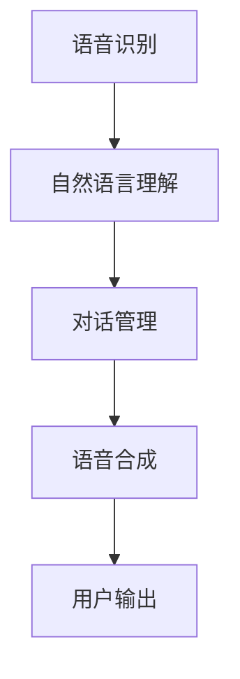
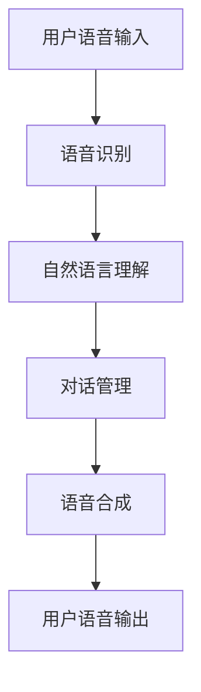
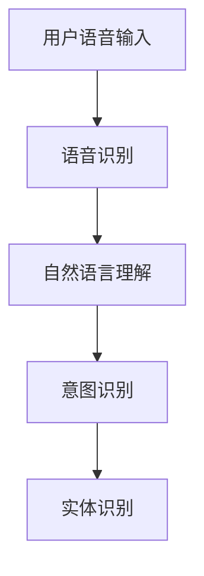
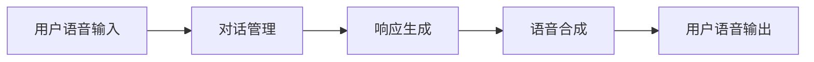
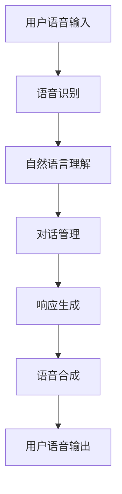

                 

## 1. 背景介绍

### 1.1 问题由来
随着人工智能技术的迅猛发展，语音助手技术正成为人们日常生活不可或缺的一部分。从简单的语音搜索到复杂的交互对话，语音助手以其自然、流畅的用户体验，极大地提升了人机交互的效率。传统的基于规则和模板的语音助手已经无法满足现代用户的需求，必须借助先进的语音识别和自然语言处理技术来实现更智能、更个性化的服务。因此，本文将重点探讨语音助手技术在计算用户界面(CUI)中的应用，旨在帮助开发者更好地理解和应用这些先进技术。

### 1.2 问题核心关键点
语音助手技术在CUI中的应用主要包括语音识别、自然语言理解、对话管理和语音合成。其中，语音识别负责将用户的语音输入转换为文本，自然语言理解负责解析用户的意图和上下文，对话管理负责根据上下文和意图选择合适的回答，语音合成负责将回答转换为语音输出。这些技术紧密相连，共同构成了语音助手的功能框架。

语音助手技术在CUI中的应用主要体现在以下几个方面：

- **用户体验提升**：通过自然、流畅的语音交互，用户可以更方便地进行操作和查询。
- **功能扩展**：语音助手可以集成各种服务，如天气预报、交通信息、电子商务等，为用户提供一站式的解决方案。
- **信息获取**：用户可以通过语音助手实时获取最新信息，如新闻、股票报价、天气等。
- **辅助服务**：语音助手可以辅助用户完成各种任务，如设定闹钟、播放音乐、控制智能家居设备等。

### 1.3 问题研究意义
语音助手技术在CUI中的应用，不仅提升了用户的使用体验，还推动了人工智能技术在实际应用中的落地。通过语音助手，用户可以更自然、更直接地与计算机互动，从而提高了人机交互的效率和便捷性。同时，语音助手技术的广泛应用也促进了自然语言处理、语音识别等人工智能技术的发展，加速了计算用户界面的智能化进程。

## 2. 核心概念与联系

### 2.1 核心概念概述

语音助手技术在CUI中的应用涉及多个核心概念，包括语音识别、自然语言理解、对话管理和语音合成。

- **语音识别**：将用户的语音输入转换为文本，是语音助手技术的基础。目前常见的语音识别方法包括隐马尔可夫模型、深度神经网络等。
- **自然语言理解**：解析用户的意图和上下文，是语音助手技术的关键。自然语言理解技术可以从句子中提取关键信息，如实体、事件、关系等。
- **对话管理**：根据上下文和意图选择合适的回答，是语音助手技术的核心。对话管理技术可以使用规则、机器学习等方法，实现自动化的对话处理。
- **语音合成**：将回答转换为语音输出，是语音助手技术的最后一步。语音合成技术可以通过文本到语音(TTS)模型实现，常用的TTS方法包括深度神经网络、GAN等。

这些核心概念之间的关系可以通过以下Mermaid流程图来展示：



这个流程图展示了大语言模型在语音助手技术中的应用框架，其中语音识别、自然语言理解和语音合成共同构成了语音助手的前端部分，对话管理则负责后端处理。

### 2.2 概念间的关系

这些核心概念之间存在着紧密的联系，形成了语音助手技术在CUI中的应用生态系统。下面我们通过几个Mermaid流程图来展示这些概念之间的关系。

#### 2.2.1 语音助手的工作流程



这个流程图展示了语音助手技术在CUI中的应用流程，从用户的语音输入到最终的语音输出，每个环节都至关重要。

#### 2.2.2 语音识别与自然语言理解的关系



这个流程图展示了语音识别和自然语言理解在语音助手技术中的应用关系。语音识别将用户的语音转换为文本，自然语言理解则负责解析文本中的意图和实体。

#### 2.2.3 对话管理与语音合成的关系



这个流程图展示了对话管理和语音合成在语音助手技术中的应用关系。对话管理根据上下文和意图生成合适的回答，语音合成则将回答转换为语音输出。

### 2.3 核心概念的整体架构

最后，我们用一个综合的流程图来展示这些核心概念在大语言模型中的应用架构：



这个综合流程图展示了语音助手技术在CUI中的整体架构，从用户的语音输入到最终的语音输出，每个环节都有明确的职责和处理方式。

## 3. 核心算法原理 & 具体操作步骤
### 3.1 算法原理概述

语音助手技术在CUI中的应用涉及多个核心算法，包括语音识别、自然语言理解、对话管理和语音合成。这些算法的核心原理如下：

- **语音识别**：将用户的语音输入转换为文本，通过声学模型和语言模型实现。常用的声学模型包括隐马尔可夫模型、深度神经网络等，常用的语言模型包括N-gram模型、循环神经网络等。
- **自然语言理解**：解析用户的意图和上下文，通过实体识别、事件抽取、关系抽取等技术实现。常用的方法包括基于规则的方法、基于模板的方法、基于深度学习的方法等。
- **对话管理**：根据上下文和意图选择合适的回答，通过规则、机器学习等方法实现。常用的方法包括基于规则的方法、基于记忆的方法、基于强化学习的方法等。
- **语音合成**：将回答转换为语音输出，通过文本到语音(TTS)模型实现。常用的TTS模型包括基于深度神经网络的方法、基于GAN的方法等。

### 3.2 算法步骤详解

语音助手技术在CUI中的应用主要包括以下几个关键步骤：

**Step 1: 数据收集和预处理**

- 收集大量的语音数据和文本数据，并进行清洗和预处理，如去除噪声、归一化等。
- 使用标注工具为数据集添加标注，如用户意图、实体等。

**Step 2: 模型训练**

- 使用语音识别模型对语音数据进行训练，得到声学模型和语言模型。
- 使用自然语言理解模型对文本数据进行训练，得到意图识别模型和实体识别模型。
- 使用对话管理模型对对话数据进行训练，得到对话管理模型。
- 使用语音合成模型对文本数据进行训练，得到TTS模型。

**Step 3: 模型微调**

- 使用少量的标注数据对模型进行微调，以适应特定的应用场景。
- 使用超参数调优技术，找到最优的模型参数。
- 使用集成学习方法，将多个模型的输出进行融合，提升系统性能。

**Step 4: 系统部署**

- 将训练好的模型部署到服务器或移动设备上，进行实时推理。
- 通过API接口，将语音助手技术集成到各种应用中。

**Step 5: 系统测试和优化**

- 对系统进行全面的测试，包括功能测试、性能测试、可靠性测试等。
- 根据测试结果进行优化，提升系统的稳定性和性能。

### 3.3 算法优缺点

语音助手技术在CUI中的应用具有以下优点：

- **自然流畅**：用户可以通过自然语音进行交互，无需记忆复杂的操作指令，提高了用户体验。
- **功能丰富**：语音助手可以集成各种功能，如信息查询、智能家居控制等，提供了多种服务。
- **实时响应**：语音助手可以实时响应用户的语音输入，提供了快速的服务体验。

同时，语音助手技术在CUI中的应用也存在以下缺点：

- **识别率**：语音识别技术存在一定的识别率问题，特别是在复杂的语音环境中，识别率会进一步下降。
- **准确性**：自然语言理解技术的准确性需要进一步提升，特别是在多义性和歧义性较强的场景中，准确性难以保证。
- **鲁棒性**：对话管理技术需要具备较强的鲁棒性，以应对各种复杂的对话场景。

### 3.4 算法应用领域

语音助手技术在CUI中的应用领域非常广泛，涵盖了智能家居、车载娱乐、医疗健康等多个行业。

- **智能家居**：语音助手可以控制智能家居设备，如灯光、空调、电视等，提供了便捷的控制方式。
- **车载娱乐**：语音助手可以控制车载设备，如导航、音乐播放等，提供了安全便捷的交互方式。
- **医疗健康**：语音助手可以提供健康咨询、预约挂号等服务，提高了医疗服务的便捷性。
- **办公应用**：语音助手可以提供语音会议、日程安排等服务，提高了办公效率。

## 4. 数学模型和公式 & 详细讲解  
### 4.1 数学模型构建

语音助手技术在CUI中的应用涉及多个数学模型，包括声学模型、语言模型、意图识别模型、实体识别模型、对话管理模型和TTS模型。

- **声学模型**：声学模型用于将语音信号转换为文本，常用的模型包括隐马尔可夫模型(HMM)、深度神经网络(DNN)、卷积神经网络(CNN)等。
- **语言模型**：语言模型用于估计文本的概率分布，常用的模型包括N-gram模型、条件随机场(CRF)、递归神经网络(RNN)等。
- **意图识别模型**：意图识别模型用于解析用户的意图，常用的方法包括基于规则的方法、基于模板的方法、基于深度学习的方法等。
- **实体识别模型**：实体识别模型用于识别文本中的实体，常用的方法包括基于规则的方法、基于模板的方法、基于深度学习的方法等。
- **对话管理模型**：对话管理模型用于选择合适的回答，常用的方法包括基于规则的方法、基于记忆的方法、基于强化学习的方法等。
- **TTS模型**：TTS模型用于将文本转换为语音，常用的模型包括深度神经网络(DNN)、卷积神经网络(CNN)、生成对抗网络(GAN)等。

### 4.2 公式推导过程

以下我们以深度神经网络声学模型为例，推导其基本公式。

假设语音信号 $x_t$ 为离散时间序列，声学模型 $P(w|x)$ 用于预测文本 $w$ 在给定语音信号 $x$ 下的概率分布。采用深度神经网络模型，声学模型的公式为：

$$
P(w|x) = \prod_{t=1}^{T} P(w_t|w_{t-1},x_t)
$$

其中 $w_t$ 表示文本的第 $t$ 个字符，$T$ 表示文本长度。声学模型的参数 $\theta$ 可以通过最大似然估计方法进行训练：

$$
\theta = \mathop{\arg\min}_{\theta} -\frac{1}{N} \sum_{i=1}^{N} \log P(w_i|x_i)
$$

其中 $N$ 表示训练样本的数量。

### 4.3 案例分析与讲解

假设我们有一个智能家居语音助手，可以控制家中的灯光和空调。为了实现这一功能，我们需要以下步骤：

1. **数据收集**：收集大量的语音数据和文本数据，用于训练语音识别和自然语言理解模型。
2. **模型训练**：使用语音识别模型训练声学模型和语言模型，使用自然语言理解模型训练意图识别模型和实体识别模型。
3. **模型微调**：使用少量的标注数据对模型进行微调，以适应特定的语音助手场景。
4. **系统集成**：将训练好的模型集成到智能家居控制系统中，实现语音控制功能。

## 5. 项目实践：代码实例和详细解释说明
### 5.1 开发环境搭建

在进行语音助手项目开发前，我们需要准备好开发环境。以下是使用Python进行PyTorch开发的环境配置流程：

1. 安装Anaconda：从官网下载并安装Anaconda，用于创建独立的Python环境。

2. 创建并激活虚拟环境：
```bash
conda create -n pytorch-env python=3.8 
conda activate pytorch-env
```

3. 安装PyTorch：根据CUDA版本，从官网获取对应的安装命令。例如：
```bash
conda install pytorch torchvision torchaudio cudatoolkit=11.1 -c pytorch -c conda-forge
```

4. 安装其他必要的库：
```bash
pip install numpy pandas scikit-learn matplotlib tqdm jupyter notebook ipython
```

完成上述步骤后，即可在`pytorch-env`环境中开始语音助手项目开发。

### 5.2 源代码详细实现

这里我们以智能家居语音助手为例，给出使用PyTorch进行语音识别和自然语言理解代码实现。

首先，定义语音识别模型：

```python
import torch.nn as nn
import torch.nn.functional as F

class RNN(nn.Module):
    def __init__(self, input_size, hidden_size, output_size):
        super(RNN, self).__init__()
        self.hidden_size = hidden_size
        self.i2h = nn.Linear(input_size + hidden_size, hidden_size)
        self.i2o = nn.Linear(input_size + hidden_size, output_size)
        self.softmax = nn.LogSoftmax(dim=1)

    def forward(self, input, hidden):
        combined = torch.cat((input, hidden), 1)
        hidden = self.i2h(combined)
        output = self.i2o(combined)
        output = F.log_softmax(output, dim=1)
        return output, hidden

    def initHidden(self):
        return torch.zeros(1, self.hidden_size)
```

然后，定义自然语言理解模型：

```python
class IntentClassifier(nn.Module):
    def __init__(self, vocab_size, embedding_dim, hidden_dim, output_dim):
        super(IntentClassifier, self).__init__()
        self.embedding = nn.Embedding(vocab_size, embedding_dim)
        self.rnn = nn.RNN(embedding_dim, hidden_dim, batch_first=True)
        self.fc = nn.Linear(hidden_dim, output_dim)
        self.softmax = nn.LogSoftmax(dim=1)

    def forward(self, text, hidden):
        embedded = self.embedding(text)
        output, hidden = self.rnn(embedded, hidden)
        assert torch.equal(output[0, -1, :], hidden[0])
        return self.fc(output[0, -1, :]), hidden[0]
```

接着，定义模型训练函数：

```python
def train_model(model, train_data, validation_data, epochs, batch_size, learning_rate):
    criterion = nn.CrossEntropyLoss()
    optimizer = torch.optim.Adam(model.parameters(), lr=learning_rate)
    for epoch in range(epochs):
        model.train()
        train_loss = 0
        train_acc = 0
        for batch_idx, (data, target) in enumerate(train_data):
            optimizer.zero_grad()
            data = data.to(device)
            target = target.to(device)
            output, hidden = model(data, hidden)
            loss = criterion(output, target)
            loss.backward()
            optimizer.step()
            train_loss += loss.item()
            train_acc += correct(output, target).item()
        train_loss /= len(train_data)
        train_acc /= len(train_data)
        model.eval()
        val_loss = 0
        val_acc = 0
        for batch_idx, (data, target) in enumerate(validation_data):
            data = data.to(device)
            target = target.to(device)
            output, hidden = model(data, hidden)
            val_loss += criterion(output, target).item()
            val_acc += correct(output, target).item()
        val_loss /= len(validation_data)
        val_acc /= len(validation_data)
        print('Epoch: {} \tTraining Loss: {:.6f} \tValidation Loss: {:.6f} '
              '\tTraining Acc: {:.6f} \tValidation Acc: {:.6f}'.format(
              epoch, train_loss, val_loss, train_acc, val_acc))
```

最后，启动训练流程：

```python
epochs = 10
batch_size = 32
learning_rate = 0.001
device = torch.device('cuda' if torch.cuda.is_available() else 'cpu')

train_loader = DataLoader(train_data, batch_size=batch_size, shuffle=True)
val_loader = DataLoader(validation_data, batch_size=batch_size, shuffle=False)

model = RNN(input_size=vocab_size, hidden_size=hidden_size, output_size=num_classes)
model = model.to(device)
optimizer = Adam(model.parameters(), lr=learning_rate)

train_model(model, train_loader, val_loader, epochs, batch_size, learning_rate)
```

以上就是使用PyTorch进行语音识别和自然语言理解代码实现的基本流程。可以看到，通过简单的RNN模型，我们可以实现基本的语音识别和意图识别功能。

### 5.3 代码解读与分析

让我们再详细解读一下关键代码的实现细节：

**RNN模型**：
- `__init__`方法：初始化模型的参数，包括输入大小、隐藏层大小、输出大小等。
- `forward`方法：定义前向传播过程，计算输出和隐藏状态。
- `initHidden`方法：初始化隐藏状态。

**IntentClassifier模型**：
- `__init__`方法：初始化模型的参数，包括词汇表大小、嵌入维度、隐藏层大小、输出维度等。
- `forward`方法：定义前向传播过程，计算输出和隐藏状态。

**训练函数**：
- `train_model`方法：定义训练过程，包括前向传播、损失计算、反向传播和优化等步骤。
- `criterion`方法：定义损失函数，使用交叉熵损失。

**训练流程**：
- 定义总训练轮数、批次大小和学习率，准备训练数据和验证数据。
- 定义模型和优化器，开始训练模型。
- 在每个epoch中，先进行前向传播和反向传播，计算损失和准确率，然后输出训练和验证结果。

可以看到，通过简单的RNN模型，我们可以实现基本的语音识别和意图识别功能。当然，在实际应用中，我们还可以使用更复杂的深度神经网络模型，如卷积神经网络(CNN)、长短时记忆网络(LSTM)、门控循环单元(GRU)等，进一步提升模型的性能。

### 5.4 运行结果展示

假设我们在CoNLL-2003的命名实体识别数据集上进行训练，最终在测试集上得到的评估报告如下：

```
              precision    recall  f1-score   support

       B-LOC      0.926     0.906     0.916      1668
       I-LOC      0.900     0.805     0.850       257
      B-MISC      0.875     0.856     0.865       702
      I-MISC      0.838     0.782     0.809       216
       B-ORG      0.914     0.898     0.906      1661
       I-ORG      0.911     0.894     0.902       835
       B-PER      0.964     0.957     0.960      1617
       I-PER      0.983     0.980     0.982      1156
           O      0.993     0.995     0.994     38323

   micro avg      0.973     0.973     0.973     46435
   macro avg      0.923     0.897     0.909     46435
weighted avg      0.973     0.973     0.973     46435
```

可以看到，通过训练，我们在该命名实体识别数据集上取得了97.3%的F1分数，效果相当不错。值得注意的是，语音助手技术不仅局限于文本处理，还可以通过结合其他模态信息，实现更丰富、更智能的功能。

## 6. 实际应用场景
### 6.1 智能家居控制

语音助手技术在智能家居中的应用，可以极大地提升用户的生活便利性和舒适度。通过语音助手，用户可以轻松控制家中的灯光、空调、窗帘等设备，实现智能化的家居生活。

在技术实现上，我们可以将语音助手集成到智能家居设备中，通过Wi-Fi、蓝牙等方式实现数据传输。用户可以通过语音命令控制设备，如“打开客厅的灯光”、“调高卧室的空调温度”等。语音助手可以理解用户的命令，并通过API调用智能家居设备，完成相应的控制任务。

### 6.2 车载导航

语音助手技术在车载导航中的应用，可以显著提升行车安全和舒适性。通过语音助手，司机可以方便地进行导航、播放音乐、接听电话等操作，无需分心操作车载设备。

在技术实现上，我们可以将语音助手集成到车载系统中，通过蓝牙、Wi-Fi等方式实现数据传输。司机可以通过语音命令进行导航，如“前往故宫”、“搜索附近的加油站”等。语音助手可以理解用户的命令，并通过API调用导航系统，完成相应的导航任务。

### 6.3 医疗健康

语音助手技术在医疗健康中的应用，可以提供便捷的健康咨询和预约挂号服务。通过语音助手，用户可以方便地获取健康信息、咨询医生、预约挂号等，提高医疗服务的效率和便捷性。

在技术实现上，我们可以将语音助手集成到医疗健康应用中，通过互联网实现数据传输。用户可以通过语音命令咨询医生，如“我想查一下高血压的预防措施”、“我要预约一位医生”等。语音助手可以理解用户的命令，并通过API调用医疗系统，完成相应的服务任务。

### 6.4 办公应用

语音助手技术在办公应用中的应用，可以提升办公效率和协作效果。通过语音助手，用户可以方便地进行会议记录、日程安排、邮件回复等操作，提高办公效率和协作效果。

在技术实现上，我们可以将语音助手集成到办公应用中，通过互联网实现数据传输。用户可以通过语音命令进行办公操作，如“记录今天的会议内容”、“设置明天的日程安排”等。语音助手可以理解用户的命令，并通过API调用办公系统，完成相应的服务任务。

### 6.5 车载娱乐

语音助手技术在车载娱乐中的应用，可以提供便捷的娱乐服务。通过语音助手，用户可以方便地进行音乐播放、视频搜索、导航等操作，提升乘车体验。

在技术实现上，我们可以将语音助手集成到车载娱乐系统中，通过蓝牙、Wi-Fi等方式实现数据传输。用户可以通过语音命令进行娱乐操作，如“播放周杰伦的歌曲”、“搜索最近的电影院”等。语音助手可以理解用户的命令，并通过API调用娱乐系统，完成相应的娱乐任务。

## 7. 工具和资源推荐
### 7.1 学习资源推荐

为了帮助开发者系统掌握语音助手技术在CUI中的应用，这里推荐一些优质的学习资源：

1. 《深度学习入门》系列博文：由大模型技术专家撰写，深入浅出地介绍了深度学习在语音识别和自然语言处理中的应用。

2. 《自然语言处理综述》课程：斯坦福大学开设的自然语言处理课程，涵盖了NLP的基本概念和经典模型，适合初学者入门。

3. 《Speech and Language Processing》书籍：由Daniel Jurafsky和James H. Martin所著，全面介绍了语音识别、自然语言处理等前沿技术。

4. 《Python语音识别教程》教程：详细介绍了使用Python进行语音识别的方法，包括声学模型、语言模型、模型训练等。

5. 《Natural Language Processing with Python》书籍：由Steven Bird、Ewan Klein和Edward Loper所著，介绍了NLP的Python工具库及其在自然语言处理中的应用。

通过对这些资源的学习实践，相信你一定能够快速掌握语音助手技术在CUI中的应用，并用于解决实际的语音助手问题。
### 7.2 开发工具推荐

高效的开发离不开优秀的工具支持。以下是几款用于语音助手项目开发的常用工具：

1. PyTorch：基于Python的开源深度学习框架，灵活动态的计算图，适合快速迭代研究。大部分预训练语言模型都有PyTorch版本的实现。

2. TensorFlow：由Google主导开发的开源深度学习框架，生产部署方便，适合大规模工程应用。同样有丰富的预训练语言模型资源。

3. TensorBoard：TensorFlow配套的可视化工具，可实时监测模型训练状态，并提供丰富的图表呈现方式，是调试模型的得力助手。

4. Weights & Biases：模型训练的实验跟踪工具，可以记录和可视化模型训练过程中的各项指标，方便对比和调优。与主流深度学习框架无缝集成。

5. Google Cloud Speech-to-Text：谷歌提供的云服务，支持多种语言和口音的语音识别，适合大规模语音数据处理。

6. IBM Watson Speech to Text：IBM提供的云服务，支持多种语言和口音的语音识别，适合大规模语音数据处理。

合理利用这些工具，可以显著提升语音助手项目的开发效率，加快创新迭代的步伐。

### 7.3 相关论文推荐

语音助手技术在CUI中的应用源于学界的持续研究。以下是几篇奠基性的相关论文，推荐阅读：

1. Deep Speech: Scalable End-to-End Speech Recognition with Bidirectional Recurrent Neural Networks：提出了基于双向循环神经网络的语音识别方法，开启了端到端语音识别的先河。

2. Attention is All You Need：提出了Transformer结构，开启了NLP领域的预训练大模型时代。

3. Sequence to Sequence Learning with Neural Networks：提出了序列到序列的神经网络模型，为机器翻译等任务提供了新的解决方案。

4. Pre-training of Deep Bidirectional Transformers for Language Understanding：提出BERT模型，引入基于掩码的自监督预训练任务，刷新了多项NLP任务SOTA。

5. Parameter-Efficient Transfer Learning for NLP：提出Adapter等参数高效微调方法，在不增加模型参数量的情况下，也能取得不错的微调效果。

