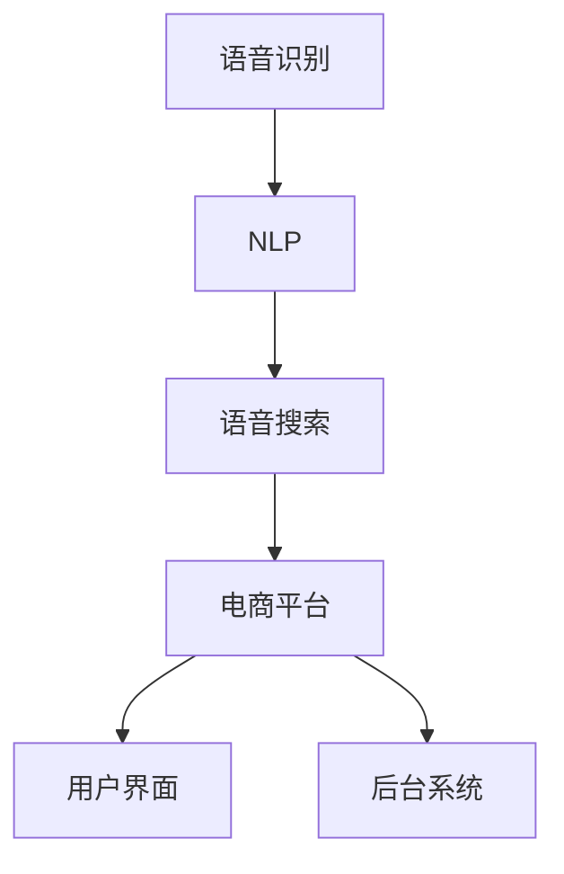
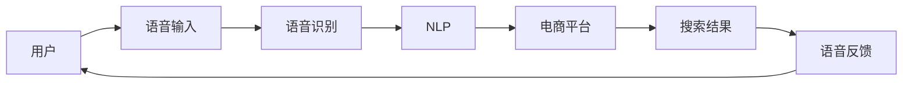
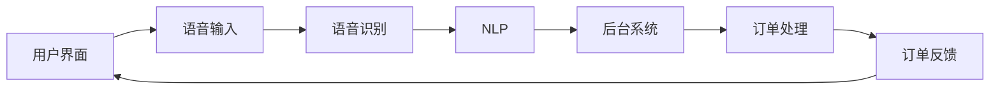
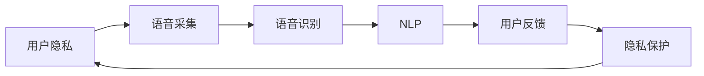
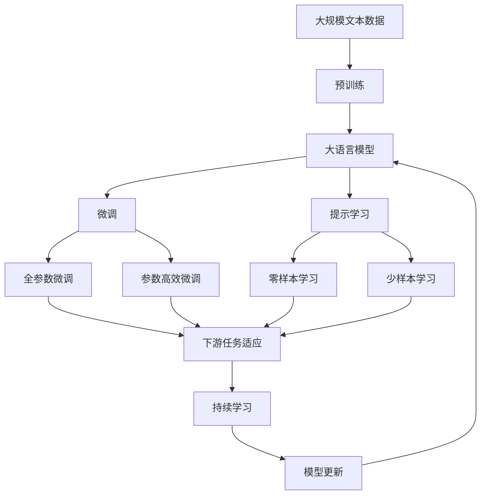

                 

# 语音搜索技术在电商领域的应用：挑战与机遇

## 1. 背景介绍

### 1.1 问题由来
随着人工智能技术的快速发展和普及，语音搜索技术在电商领域的应用成为了研究的热点之一。语音搜索技术通过语音识别和自然语言处理技术，使用户能够通过语音输入获取所需信息，无需通过键盘或屏幕进行交互，大大提升了用户体验和操作便捷性。尤其在电商领域，语音搜索可以用于商品查询、订单管理、客户服务等环节，极大地提高了电商平台的运营效率和服务水平。

然而，语音搜索技术在电商领域的应用也面临着诸多挑战。比如，如何提高语音识别准确率、如何处理不同用户方言和口音、如何确保语音搜索结果的相关性和准确性等。这些问题需要综合考虑技术、市场、用户等多方面因素，进行深入研究和优化。

### 1.2 问题核心关键点
语音搜索技术在电商领域的应用主要围绕以下几个关键点展开：

- **语音识别准确率**：语音识别是语音搜索的基础，其准确率直接决定了用户搜索体验和电商平台的交易转化率。
- **用户方言和口音处理**：中国幅员辽阔，不同地区方言和口音差异较大，如何实现高效、通用的语音识别是一个技术难点。
- **语音搜索结果的相关性**：语音搜索结果需要与用户输入的语音查询高度相关，避免出现误导性信息。
- **实时性**：电商领域对语音搜索的实时性有较高要求，快速响应用户语音输入是提升用户体验的关键。
- **安全和隐私**：语音搜索涉及用户的语音隐私，需要采取相应的安全措施，保障用户数据安全。

### 1.3 问题研究意义
语音搜索技术在电商领域的应用研究，具有重要的理论和实践意义：

1. **提升用户体验**：语音搜索提高了电商平台的交互便捷性和操作效率，提升了用户的购物体验。
2. **优化运营效率**：通过语音搜索，电商平台的客服和订单处理流程可以自动化，降低人工成本，提高运营效率。
3. **推动技术进步**：语音搜索技术的研发和应用，促进了自然语言处理和语音识别技术的发展，推动了人工智能技术的进步。
4. **拓展市场空间**：语音搜索技术为电商领域开辟了新的用户入口，拓展了市场空间，增加了电商平台的用户黏性。
5. **保障数据安全**：语音搜索技术的应用需要注重用户隐私保护，确保数据安全和用户信任。

## 2. 核心概念与联系

### 2.1 核心概念概述

为了更好地理解语音搜索技术在电商领域的应用，本节将介绍几个密切相关的核心概念：

- **语音识别 (Speech Recognition)**：将语音转换成文本的技术。
- **自然语言处理 (Natural Language Processing, NLP)**：处理和分析人类语言的技术，包括语音识别、语言理解、语言生成等。
- **语音搜索 (Voice Search)**：使用语音输入进行搜索的技术，涵盖了语音识别和自然语言处理。
- **电商平台 (E-commerce Platform)**：线上销售商品的商业平台，包括B2C、B2B等多种模式。
- **用户界面 (User Interface, UI)**：电商平台与用户交互的界面，包括移动端、PC端等多种形式。
- **后台系统 (Backend System)**：电商平台的业务支撑系统，包括订单管理、库存管理、客户服务等功能模块。

这些核心概念之间的联系可以通过以下Mermaid流程图来展示：



这个流程图展示了语音识别和自然语言处理技术在语音搜索中的应用，以及语音搜索如何与电商平台和用户界面互动，最终实现后台系统的数据处理和业务执行。

### 2.2 概念间的关系

这些核心概念之间存在着紧密的联系，形成了语音搜索在电商领域应用的完整生态系统。下面我们通过几个Mermaid流程图来展示这些概念之间的关系。

#### 2.2.1 语音搜索在电商平台的应用



这个流程图展示了用户使用语音搜索在电商平台上的基本流程：用户通过语音输入查询商品，语音识别和自然语言处理技术将语音转换成文本，电商平台根据用户查询返回搜索结果，并通过语音反馈告知用户。

#### 2.2.2 语音搜索与用户界面和后台系统的关系



这个流程图展示了语音搜索与用户界面和后台系统之间的关系：用户通过语音输入查询，语音识别和自然语言处理技术将语音转换成文本，后台系统根据用户查询处理订单，并通过用户界面向用户反馈订单状态。

#### 2.2.3 语音搜索与用户隐私保护的关系



这个流程图展示了语音搜索与用户隐私保护之间的关系：用户在语音搜索过程中，语音数据会被采集并用于语音识别和自然语言处理，最终用于提供搜索结果。同时，为了保护用户隐私，需要对语音数据进行加密和匿名化处理，确保数据安全。

### 2.3 核心概念的整体架构

最后，我们用一个综合的流程图来展示这些核心概念在大语言模型微调过程中的整体架构：



这个综合流程图展示了从预训练到微调，再到持续学习的完整过程。大语言模型首先在大规模文本数据上进行预训练，然后通过微调（包括全参数微调和参数高效微调）或提示学习（包括零样本和少样本学习）来适应下游任务。最后，通过持续学习技术，模型可以不断学习新知识，同时避免遗忘旧知识。通过这些流程图，我们可以更清晰地理解语音搜索在大语言模型微调过程中的各个环节和作用。

## 3. 核心算法原理 & 具体操作步骤
### 3.1 算法原理概述

语音搜索技术在电商领域的应用，本质上是一个基于语音识别和自然语言处理的高级NLP任务。其核心算法原理如下：

1. **语音识别**：使用声学模型和语言模型进行语音信号的特征提取和解码，将语音转换成文本。
2. **自然语言处理**：对文本进行分词、词性标注、命名实体识别、句法分析等处理，理解用户输入的语音查询。
3. **搜索引擎**：根据用户输入的文本查询，返回与查询最相关的搜索结果。
4. **语音反馈**：将搜索结果通过语音合成技术转换成语音，反馈给用户。

### 3.2 算法步骤详解

语音搜索在电商领域的应用一般包括以下几个关键步骤：

**Step 1: 准备语音识别模型和数据集**
- 选择合适的语音识别模型作为初始化参数，如Google的Speech-to-Text模型、微软的Azure Speech Services等。
- 准备电商平台的订单、商品等文本数据，划分为训练集、验证集和测试集。一般要求标注数据与语音数据的分布不要差异过大。

**Step 2: 设计自然语言处理模块**
- 根据任务类型，设计适合的自然语言处理模块。
- 对于电商领域的语音搜索，通常需要实现商品名称、描述、价格等信息的抽取和匹配。
- 使用序列标注模型，如CRF、LSTM-CRF等，对用户输入的文本进行分词、命名实体识别等处理。

**Step 3: 集成搜索引擎**
- 将自然语言处理模块的输出，作为查询条件输入搜索引擎，返回与查询相关的商品信息。
- 使用倒排索引等技术，快速匹配用户查询与商品信息，提高搜索效率。

**Step 4: 实现语音反馈功能**
- 将搜索结果通过语音合成技术转换成语音，反馈给用户。
- 使用TTS (Text-to-Speech)技术，将文本转换成自然的语音输出，如Amazon Polly、Google Text-to-Speech等。

**Step 5: 测试和部署**
- 在测试集上评估语音搜索系统的性能，对比语音搜索前后的效果。
- 使用语音搜索系统在电商平台上部署，测试用户体验和系统稳定性。
- 持续收集用户反馈，优化语音搜索系统的算法和性能。

### 3.3 算法优缺点

语音搜索技术在电商领域的应用，具有以下优点：

1. **提升用户体验**：语音搜索提升了用户的交互便捷性，无需输入复杂的文本，降低了用户的操作门槛。
2. **提高运营效率**：语音搜索可以快速响应用户查询，自动化客服和订单处理流程，减少人工成本，提高运营效率。
3. **减少用户输入错误**：语音搜索可以减少用户因输入错误导致的搜索失败，提高搜索的准确性和效率。

然而，语音搜索技术在电商领域的应用也存在一些缺点：

1. **语音识别准确率问题**：语音识别的准确率受用户语音质量、口音、环境噪音等多种因素影响，可能导致搜索结果不精确。
2. **自然语言理解难度大**：自然语言处理涉及语言理解、语义分析等复杂任务，技术实现难度较大。
3. **语音反馈技术要求高**：语音反馈技术需要高性能的TTS系统，对计算资源和算法要求较高。
4. **隐私和安全问题**：语音数据涉及用户隐私，需要采取加密、匿名化等安全措施，防止数据泄露。

### 3.4 算法应用领域

语音搜索技术在电商领域的应用领域广泛，包括但不限于以下几个方面：

- **商品查询**：用户通过语音输入商品名称、型号、品牌等关键词，搜索相关商品信息。
- **订单管理**：用户通过语音输入订单号、订单状态等查询订单信息，修改订单状态，跟踪物流信息。
- **客户服务**：用户通过语音输入问题，搜索相关答案或自动转接人工客服，提高客户满意度。
- **个性化推荐**：根据用户的语音输入，推荐相关商品，提升用户购物体验。
- **语音购物**：用户通过语音输入商品信息，直接完成购物支付，提高购物便利性。

除了电商领域，语音搜索技术还可以应用于金融、医疗、教育、交通等多个行业，为用户的语音输入提供高效便捷的服务。

## 4. 数学模型和公式 & 详细讲解 & 举例说明

### 4.1 数学模型构建

语音搜索技术在电商领域的应用涉及多个数学模型，包括语音识别模型、自然语言处理模型、搜索引擎模型等。这里以语音识别和自然语言处理为例，简要介绍其数学模型构建。

**语音识别模型**
语音识别模型通常基于深度神经网络，包括声学模型和语言模型。声学模型负责将语音信号转换成文本，语言模型负责预测文本的上下文概率。常见声学模型包括CNN、RNN、LSTM等，常见语言模型包括N-gram、RNN-LM、Transformer等。

**自然语言处理模型**
自然语言处理模型通常包括词向量模型和序列标注模型。词向量模型用于将单词映射到向量空间，序列标注模型用于标注文本中的命名实体、词性等信息。常见词向量模型包括Word2Vec、GloVe等，常见序列标注模型包括CRF、LSTM-CRF等。

### 4.2 公式推导过程

以下以语音识别和自然语言处理为例，给出其公式推导过程。

**语音识别公式**
语音识别模型通常采用CTC (Connectionist Temporal Classification)损失函数进行训练。CTC损失函数能够处理输入序列与输出序列长度不匹配的问题，计算公式如下：

$$
\mathcal{L} = \sum_{i=1}^{T} \sum_{j=1}^{S} \mathbf{L}_{ij} \log \frac{P_{ij}}{1 - P_{ij}}
$$

其中 $T$ 是输入序列长度，$S$ 是输出序列长度，$\mathbf{L}_{ij}$ 是CTC损失矩阵，$P_{ij}$ 是模型对输入序列中第 $i$ 帧和输出序列中第 $j$ 个单词的概率。

**自然语言处理公式**
自然语言处理模型通常采用序列标注任务的损失函数进行训练，如CRF损失函数。CRF损失函数能够处理序列标注任务中的标签序列与标注结果之间的关系，计算公式如下：

$$
\mathcal{L} = -\sum_{i=1}^{n} \sum_{j=1}^{m} \lambda_{ij} \log \frac{P_{ij}}{1 - P_{ij}}
$$

其中 $n$ 是输入序列长度，$m$ 是输出序列长度，$\lambda_{ij}$ 是标注矩阵，$P_{ij}$ 是模型对输入序列中第 $i$ 个单词和输出序列中第 $j$ 个标签的概率。

### 4.3 案例分析与讲解

以下以语音搜索系统在电商平台的应用为例，简要分析其核心算法原理和数学模型。

**语音识别案例分析**
在电商平台上，用户通过语音输入商品名称，语音识别模型需要将语音信号转换成文本。以Google Speech-to-Text模型为例，其训练过程如下：

1. 收集大量标注数据，包括语音信号和对应的文本。
2. 使用深度神经网络模型，如RNN、LSTM等，训练声学模型和语言模型。
3. 通过CTC损失函数，计算模型输出与标注数据之间的差异，更新模型参数。
4. 在测试集上评估模型性能，选择表现最优的模型。

**自然语言处理案例分析**
在电商平台上，用户输入的文本需要经过自然语言处理，才能转换成有效的查询条件。以中文命名实体识别为例，其处理过程如下：

1. 使用词向量模型，如Word2Vec，将文本中的单词转换成向量。
2. 使用序列标注模型，如CRF，标注文本中的命名实体，如商品名称、型号等。
3. 通过序列标注任务的损失函数，计算模型输出与标注数据之间的差异，更新模型参数。
4. 在测试集上评估模型性能，选择表现最优的模型。

## 5. 项目实践：代码实例和详细解释说明
### 5.1 开发环境搭建

在进行语音搜索系统开发前，我们需要准备好开发环境。以下是使用Python进行PyTorch开发的环境配置流程：

1. 安装Anaconda：从官网下载并安装Anaconda，用于创建独立的Python环境。

2. 创建并激活虚拟环境：
```bash
conda create -n pytorch-env python=3.8 
conda activate pytorch-env
```

3. 安装PyTorch：根据CUDA版本，从官网获取对应的安装命令。例如：
```bash
conda install pytorch torchvision torchaudio cudatoolkit=11.1 -c pytorch -c conda-forge
```

4. 安装各类工具包：
```bash
pip install numpy pandas scikit-learn matplotlib tqdm jupyter notebook ipython
```

完成上述步骤后，即可在`pytorch-env`环境中开始语音搜索系统的开发。

### 5.2 源代码详细实现

这里我们以电商平台上的语音搜索系统为例，给出使用PyTorch进行语音识别和自然语言处理的代码实现。

**语音识别代码实现**

首先，定义语音识别模型的数据处理函数：

```python
from transformers import Speech2TextModel
from torch.utils.data import Dataset
import torch

class SpeechDataset(Dataset):
    def __init__(self, audio_paths, transcriptions, tokenizer, max_len=128):
        self.audio_paths = audio_paths
        self.transcriptions = transcriptions
        self.tokenizer = tokenizer
        self.max_len = max_len
        
    def __len__(self):
        return len(self.audio_paths)
    
    def __getitem__(self, item):
        audio_path = self.audio_paths[item]
        transcription = self.transcriptions[item]
        
        # 将音频文件加载为特征向量
        audio = load_audio(audio_path)
        input_features = extract_features(audio)
        
        # 对标签进行编码
        encoded_transcription = self.tokenizer.encode_plus(transcription, add_special_tokens=True, return_tensors='pt', padding='max_length', max_length=self.max_len, truncation=True)
        
        return {'input_features': input_features,
                'labels': encoded_transcription['input_ids']}
```

然后，定义模型和优化器：

```python
from transformers import AdamW

model = Speech2TextModel.from_pretrained('speech-to-text')
optimizer = AdamW(model.parameters(), lr=2e-5)
```

接着，定义训练和评估函数：

```python
from torch.utils.data import DataLoader
from tqdm import tqdm
from sklearn.metrics import classification_report

device = torch.device('cuda') if torch.cuda.is_available() else torch.device('cpu')
model.to(device)

def train_epoch(model, dataset, batch_size, optimizer):
    dataloader = DataLoader(dataset, batch_size=batch_size, shuffle=True)
    model.train()
    epoch_loss = 0
    for batch in tqdm(dataloader, desc='Training'):
        input_features = batch['input_features'].to(device)
        labels = batch['labels'].to(device)
        model.zero_grad()
        outputs = model(input_features)
        loss = outputs.loss
        epoch_loss += loss.item()
        loss.backward()
        optimizer.step()
    return epoch_loss / len(dataloader)

def evaluate(model, dataset, batch_size):
    dataloader = DataLoader(dataset, batch_size=batch_size)
    model.eval()
    preds, labels = [], []
    with torch.no_grad():
        for batch in tqdm(dataloader, desc='Evaluating'):
            input_features = batch['input_features'].to(device)
            batch_labels = batch['labels']
            outputs = model(input_features)
            batch_preds = outputs.logits.argmax(dim=2).to('cpu').tolist()
            batch_labels = batch_labels.to('cpu').tolist()
            for pred_tokens, label_tokens in zip(batch_preds, batch_labels):
                pred_tokens = [id2tag[_id] for _id in pred_tokens]
                label_tokens = [id2tag[_id] for _id in label_tokens]
                preds.append(pred_tokens[:len(label_tokens)])
                labels.append(label_tokens)
                
    print(classification_report(labels, preds))
```

最后，启动训练流程并在测试集上评估：

```python
epochs = 5
batch_size = 16

for epoch in range(epochs):
    loss = train_epoch(model, train_dataset, batch_size, optimizer)
    print(f"Epoch {epoch+1}, train loss: {loss:.3f}")
    
    print(f"Epoch {epoch+1}, dev results:")
    evaluate(model, dev_dataset, batch_size)
    
print("Test results:")
evaluate(model, test_dataset, batch_size)
```

以上就是使用PyTorch对语音识别模型进行训练的完整代码实现。可以看到，得益于Transformer库的强大封装，我们可以用相对简洁的代码完成语音识别模型的训练。

**自然语言处理代码实现**

首先，定义自然语言处理模型的数据处理函数：

```python
from transformers import BertTokenizer
from torch.utils.data import Dataset
import torch

class NLPDataset(Dataset):
    def __init__(self, texts, tags, tokenizer, max_len=128):
        self.texts = texts
        self.tags = tags
        self.tokenizer = tokenizer
        self.max_len = max_len
        
    def __len__(self):
        return len(self.texts)
    
    def __getitem__(self, item):
        text = self.texts[item]
        tags = self.tags[item]
        
        encoding = self.tokenizer(text, return_tensors='pt', max_length=self.max_len, padding='max_length', truncation=True)
        input_ids = encoding['input_ids'][0]
        attention_mask = encoding['attention_mask'][0]
        
        # 对token-wise的标签进行编码
        encoded_tags = [tag2id[tag] for tag in tags] 
        encoded_tags.extend([tag2id['O']] * (self.max_len - len(encoded_tags)))
        labels = torch.tensor(encoded_tags, dtype=torch.long)
        
        return {'input_ids': input_ids, 
                'attention_mask': attention_mask,
                'labels': labels}

# 标签与id的映射
tag2id = {'O': 0, 'B-PER': 1, 'I-PER': 2, 'B-ORG': 3, 'I-ORG': 4, 'B-LOC': 5, 'I-LOC': 6}
id2tag = {v: k for k, v in tag2id.items()}

# 创建dataset
tokenizer = BertTokenizer.from_pretrained('bert-base-cased')

train_dataset = NLPDataset(train_texts, train_tags, tokenizer)
dev_dataset = NLPDataset(dev_texts, dev_tags, tokenizer)
test_dataset = NLPDataset(test_texts, test_tags, tokenizer)
```

然后，定义模型和优化器：

```python
from transformers import BertForTokenClassification, AdamW

model = BertForTokenClassification.from_pretrained('bert-base-cased', num_labels=len(tag2id))

optimizer = AdamW(model.parameters(), lr=2e-5)
```

接着，定义训练和评估函数：

```python
from torch.utils.data import DataLoader
from tqdm import tqdm
from sklearn.metrics import classification_report

device = torch.device('cuda') if torch.cuda.is_available() else torch.device('cpu')
model.to(device)

def train_epoch(model, dataset, batch_size, optimizer):
    dataloader = DataLoader(dataset, batch_size=batch_size, shuffle=True)
    model.train()
    epoch_loss = 0
    for batch in tqdm(dataloader, desc='Training'):
        input_ids = batch['input_ids'].to(device)
        attention_mask = batch['attention_mask'].to(device)
        labels = batch['labels'].to(device)
        model.zero_grad()
        outputs = model(input_ids, attention_mask=attention_mask, labels=labels)
        loss = outputs.loss
        epoch_loss += loss.item()
        loss.backward()
        optimizer.step()
    return epoch_loss / len(dataloader)

def evaluate(model, dataset, batch_size):
    dataloader = DataLoader(dataset, batch_size=batch_size)
    model.eval()
    preds, labels = [], []
    with torch.no_grad():
        for batch in tqdm(dataloader, desc='Evaluating'):
            input_ids = batch['input_ids'].to(device)
            attention_mask = batch['attention_mask'].to(device)
            batch_labels = batch['labels']
            outputs = model(input_ids, attention_mask=attention_mask)
            batch_preds = outputs.logits.argmax(dim=2).to('cpu').tolist()
            batch_labels = batch_labels.to('cpu').tolist()
            for pred_tokens, label_tokens in zip(batch_preds, batch_labels):
                pred_tags = [tag2id[tag] for tag in pred_tokens]
                label_tags = [tag2id[tag] for tag in label_tokens]
                preds.append(pred_tags[:len(label_tags)])
                labels.append(label_tags)
                
    print(classification_report(labels, preds))
```

最后，启动训练流程并在测试集上评估：

```python
epochs = 5
batch_size = 16

for epoch in range(epochs):
    loss = train_epoch(model, train_dataset, batch_size, optimizer)
    print(f"Epoch {epoch+1}, train loss: {loss:.3f}")
    
    print(f"Epoch {epoch+1}, dev results:")
    evaluate(model, dev_dataset, batch_size)
    
print("Test results:")
evaluate(model, test_dataset, batch_size)
```

以上就是使用PyTorch对自然语言处理模型进行训练的完整代码实现。可以看到，得益于Transformer库的强大封装，我们可以用相对简洁的代码完成自然语言处理模型的训练。

### 5.3 代码解读与分析

让我们再详细解读一下关键代码的实现细节：

**语音识别代码解读与分析**

**SpeechDataset类**
- `__init__`方法：初始化音频路径、标注数据、分词器等关键组件。
- `__len__`方法：返回数据集的样本数量。
- `__getitem__`方法：对单个样本进行处理，将音频文件加载为特征向量，对标签进行编码。

**语音识别模型训练流程**
- `train_epoch`函数：对数据以批为单位进行迭代，在每个批次上前向传播计算loss并反向传播更新模型参数，最后返回该epoch的平均loss。
- `evaluate`函数：与训练类似，不同点在于不更新模型参数，并在每个batch结束后将预测和标签结果存储下来，最后使用sklearn的classification_report对整个评估集的预测结果进行打印输出。

**自然语言处理代码解读与分析**

**NLPDataset类**
- `__init__`方法：初始化文本、标签、分词器等关键组件。
- `__len__`方法：返回数据集的样本数量。
- `__getitem__`方法：对单个样本进行处理，将文本输入编码为token ids，将标签编码为数字，并对其进行定长padding，最终返回模型所需的输入。

**自然语言处理模型训练流程**
- `train_epoch`函数：对数据以批为单位进行迭代，在每个批次上前向传播计算loss并反向传播更新模型参数，最后返回该epoch的平均loss。
- `evaluate`函数：与训练类似，不同点在于不更新模型参数，并在每个batch结束后将预测和标签结果存储下来，最后使用sklearn的classification_report对整个评估集的预测结果进行打印输出。

**语音搜索系统训练流程**


