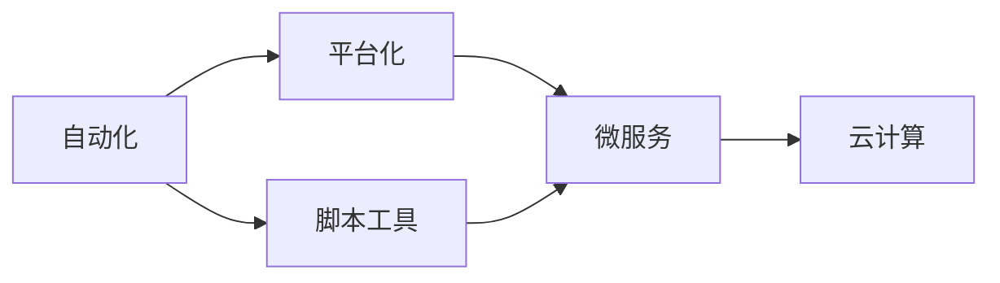
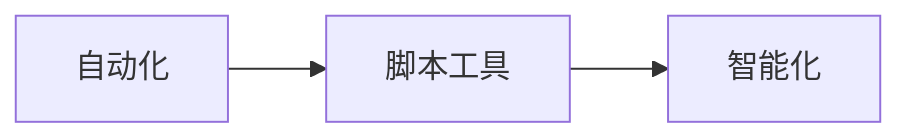
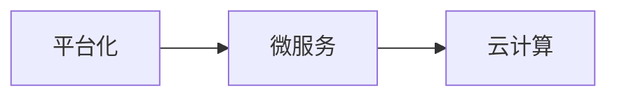
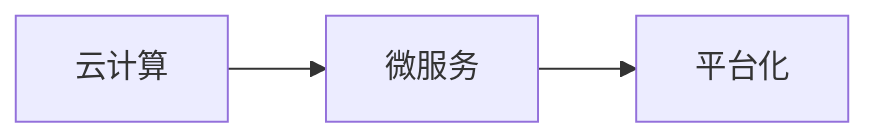
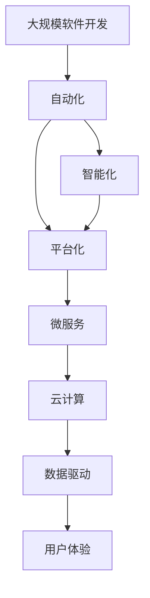

                 

# 软件 2.0 的价值：提升效率、创造价值

## 1. 背景介绍

### 1.1 问题由来

随着信息技术与互联网的蓬勃发展，软件已成为现代社会不可或缺的组成部分。无论是企业级应用，还是日常生活中的App，软件都扮演着至关重要的角色。然而，当前的软件开发模式面临诸多挑战：

- **低效和重复工作**：软件开发过程中存在大量低效和重复工作，如代码编写、测试、维护等，占用了大量的时间和人力资源。
- **技术栈壁垒**：不同技术栈之间的兼容性问题，导致跨栈开发效率低下，增加了项目复杂度。
- **数据孤岛**：企业内部数据分散，缺乏有效的整合和共享机制，导致数据价值难以充分发挥。
- **人工智能和自动化不足**：当前的软件系统普遍缺乏自动化和智能化的辅助，开发效率和质量有待提高。

针对这些问题，软件2.0应运而生。软件2.0通过引入先进的技术和理念，如自动化、智能化、平台化、微服务、云计算等，旨在提升软件开发效率，降低开发成本，同时创造更大的商业价值。

### 1.2 问题核心关键点

软件2.0的核心在于通过技术创新和理念变革，实现软件开发的全面优化。具体而言，它包括：

- **自动化**：通过脚本、工具、平台等方式，自动执行重复性任务，减少人为干预。
- **智能化**：利用AI和机器学习技术，辅助软件设计和开发，提升决策效率和准确性。
- **平台化**：通过构建统一的平台，实现跨栈、跨团队的无缝协作和资源共享。
- **微服务**：将软件拆分为小服务模块，实现灵活部署和快速迭代。
- **云计算**：通过云平台资源，按需使用，降低运维成本，提升系统可扩展性。

这些关键点共同构成了软件2.0的完整图景，旨在通过技术创新驱动软件开发模式的革命性变革。

### 1.3 问题研究意义

软件2.0的提出和实践，对于提升软件开发效率、降低开发成本、增强企业竞争力具有重要意义：

1. **提升开发效率**：自动化和智能化技术的应用，可以大幅度提升代码编写、测试、部署等环节的效率，缩短项目周期。
2. **降低开发成本**：通过平台化和微服务，减少冗余组件和重复工作，优化资源配置，降低开发和运维成本。
3. **增强企业竞争力**：快速迭代和灵活扩展，使得企业能够迅速应对市场变化，提高竞争力。
4. **提升用户体验**：通过数据驱动和智能化设计，提升软件应用的易用性和用户体验，增强用户粘性。
5. **推动产业升级**：软件2.0的理念和实践，加速了各行业的数字化转型，推动了产业升级和创新。

## 2. 核心概念与联系

### 2.1 核心概念概述

软件2.0涉及多个核心概念，这些概念共同构建了软件开发的未来图景：

- **自动化**：通过脚本、工具、平台等手段，自动执行软件开发过程中的重复性任务，提升开发效率。
- **智能化**：利用人工智能和机器学习技术，辅助软件设计和开发，提升决策效率和准确性。
- **平台化**：通过构建统一的平台，实现跨栈、跨团队的无缝协作和资源共享。
- **微服务**：将软件拆分为小服务模块，实现灵活部署和快速迭代。
- **云计算**：通过云平台资源，按需使用，降低运维成本，提升系统可扩展性。

这些概念之间存在着紧密的联系，形成了一个完整的软件2.0生态系统。以下通过Mermaid流程图展示它们之间的逻辑关系：



这个流程图展示了自动化、智能化、平台化、微服务、云计算等概念之间的联系：

1. 自动化主要通过脚本、工具、平台等手段，自动执行重复性任务。
2. 智能化主要利用AI和机器学习技术，提升决策效率和准确性。
3. 平台化主要通过构建统一的平台，实现跨栈、跨团队的无缝协作和资源共享。
4. 微服务主要将软件拆分为小服务模块，实现灵活部署和快速迭代。
5. 云计算主要通过云平台资源，降低运维成本，提升系统可扩展性。

这些概念共同构成了软件2.0的完整生态系统，推动软件开发模式向更加高效、智能、平台化的方向发展。

### 2.2 概念间的关系

这些核心概念之间存在着紧密的联系，形成了一个完整的软件2.0生态系统。以下通过几个Mermaid流程图展示它们之间的关系：

#### 2.2.1 自动化与智能化



这个流程图展示了自动化与智能化之间的联系：

1. 自动化主要通过脚本、工具等手段，自动执行重复性任务。
2. 智能化主要利用AI和机器学习技术，提升决策效率和准确性。

自动化是智能化的前提和基础，智能化则进一步提升了自动化的效率和效果。

#### 2.2.2 平台化与微服务



这个流程图展示了平台化与微服务之间的联系：

1. 平台化主要通过构建统一的平台，实现跨栈、跨团队的无缝协作和资源共享。
2. 微服务主要将软件拆分为小服务模块，实现灵活部署和快速迭代。

平台化是微服务的基础，微服务则在平台化的基础上，实现了更加灵活和高效的开发模式。

#### 2.2.3 云计算与微服务



这个流程图展示了云计算与微服务之间的联系：

1. 云计算主要通过云平台资源，降低运维成本，提升系统可扩展性。
2. 微服务主要将软件拆分为小服务模块，实现灵活部署和快速迭代。

云计算为微服务的部署和扩展提供了基础设施，微服务则通过按需使用，充分利用了云计算资源。

### 2.3 核心概念的整体架构

最后，我们用一个综合的流程图来展示这些核心概念在大规模软件开发中的整体架构：



这个综合流程图展示了从自动化到云计算，再到数据驱动和用户体验的完整过程：

1. 自动化主要通过脚本、工具等手段，自动执行重复性任务。
2. 智能化主要利用AI和机器学习技术，提升决策效率和准确性。
3. 平台化主要通过构建统一的平台，实现跨栈、跨团队的无缝协作和资源共享。
4. 微服务主要将软件拆分为小服务模块，实现灵活部署和快速迭代。
5. 云计算主要通过云平台资源，降低运维成本，提升系统可扩展性。
6. 数据驱动主要通过数据挖掘和分析，辅助决策和优化。
7. 用户体验主要通过用户反馈和行为分析，提升易用性和满意度。

通过这些流程图，我们可以更清晰地理解软件2.0生态系统中的各个概念及其关系，为后续深入讨论具体的实践技术奠定基础。

## 3. 核心算法原理 & 具体操作步骤
### 3.1 算法原理概述

软件2.0的实现主要依赖于先进的算法和技术，这些算法和技术共同构成了软件2.0的核心框架。以下详细介绍这些核心算法：

- **自动化算法**：通过脚本、工具、平台等方式，自动执行重复性任务。
- **智能化算法**：利用AI和机器学习技术，辅助软件设计和开发。
- **平台化算法**：通过构建统一的平台，实现跨栈、跨团队的无缝协作和资源共享。
- **微服务算法**：将软件拆分为小服务模块，实现灵活部署和快速迭代。
- **云计算算法**：通过云平台资源，按需使用，降低运维成本，提升系统可扩展性。

### 3.2 算法步骤详解

#### 3.2.1 自动化算法

自动化算法主要通过脚本、工具、平台等方式，自动执行重复性任务，提升开发效率。以下详细介绍自动化算法的主要步骤：

1. **脚本编写**：编写自动化脚本，用于执行常见的重复性任务，如代码生成、测试、部署等。
2. **工具集成**：将自动化脚本集成到开发环境中，如IDE、CI/CD系统等，实现自动化流程。
3. **平台构建**：构建统一的平台，支持跨团队、跨栈的无缝协作和资源共享，如DevOps平台、协作平台等。

#### 3.2.2 智能化算法

智能化算法主要利用AI和机器学习技术，辅助软件设计和开发，提升决策效率和准确性。以下详细介绍智能化算法的主要步骤：

1. **数据收集**：收集软件设计、开发、测试等环节的相关数据，构建数据集。
2. **模型训练**：使用机器学习算法，对数据集进行训练，构建预测模型，如代码质量预测、缺陷检测、测试用例生成等。
3. **模型应用**：将训练好的模型应用到软件开发流程中，辅助决策和优化，如代码编写建议、缺陷定位、测试优化等。

#### 3.2.3 平台化算法

平台化算法主要通过构建统一的平台，实现跨栈、跨团队的无缝协作和资源共享。以下详细介绍平台化算法的主要步骤：

1. **平台设计**：设计平台架构，包括基础设施、API接口、应用框架等，支持跨栈协作。
2. **平台部署**：将平台部署到云环境，提供基础设施和应用支持。
3. **平台集成**：将平台集成到开发流程中，如持续集成、持续部署、协同开发等，实现无缝协作。

#### 3.2.4 微服务算法

微服务算法主要将软件拆分为小服务模块，实现灵活部署和快速迭代。以下详细介绍微服务算法的主要步骤：

1. **服务拆分**：将大系统拆分为多个小服务模块，每个服务模块独立部署、更新。
2. **服务编排**：通过API网关、服务注册中心等工具，实现服务之间的编排和调用。
3. **服务管理**：提供服务注册、发现、负载均衡、故障恢复等管理功能，实现服务的高可用性和可扩展性。

#### 3.2.5 云计算算法

云计算算法主要通过云平台资源，按需使用，降低运维成本，提升系统可扩展性。以下详细介绍云计算算法的主要步骤：

1. **云资源管理**：管理云平台的资源，如虚拟机、存储、网络等，实现按需使用。
2. **云平台部署**：将应用部署到云平台，实现弹性伸缩和可扩展性。
3. **云平台优化**：优化云平台性能，如资源利用率、响应速度、安全等，提升用户体验。

### 3.3 算法优缺点

软件2.0的算法和技术具有以下优点：

- **提升效率**：自动化、智能化、平台化等技术的应用，大幅度提升了软件开发效率，缩短了项目周期。
- **降低成本**：通过平台化、微服务、云计算等技术，优化资源配置，降低了开发和运维成本。
- **增强灵活性**：微服务架构和云平台资源，提高了系统的灵活性和可扩展性，适应快速变化的市场需求。

同时，这些算法和技术也存在一些缺点：

- **技术门槛高**：自动化、智能化、平台化等技术需要较高的技术水平，难以快速普及。
- **复杂度增加**：微服务、平台化等技术增加了系统复杂度，对运维和维护提出了更高要求。
- **资源消耗大**：云计算等技术虽然降低了运维成本，但资源消耗较大，需要持续投入。

### 3.4 算法应用领域

软件2.0的算法和技术广泛应用在各个领域，以下详细介绍其主要应用领域：

#### 3.4.1 企业级应用

企业级应用是软件2.0的重要应用领域，包括ERP、CRM、HR等系统。通过平台化、微服务、云计算等技术，企业能够实现跨部门、跨团队的无缝协作，提升工作效率，降低开发和运维成本。

#### 3.4.2 互联网应用

互联网应用是软件2.0的典型应用场景，如电商、社交、新闻等网站。通过自动化、智能化、云计算等技术，互联网企业能够快速迭代产品功能，提升用户体验，增强市场竞争力。

#### 3.4.3 移动应用

移动应用是软件2.0的重要应用领域，如手机App、微信小程序等。通过平台化、微服务、自动化等技术，移动应用能够实现快速开发、快速部署，提升用户粘性和满意度。

#### 3.4.4 物联网应用

物联网应用是软件2.0的新兴应用领域，如智能家居、智能城市等。通过平台化、云计算等技术，物联网系统能够实现数据共享和协同，提升系统效率和可靠性。

#### 3.4.5 游戏应用

游戏应用是软件2.0的重要应用领域，如游戏引擎、游戏服务器等。通过自动化、智能化、平台化等技术，游戏应用能够实现高效开发、快速部署，提升游戏体验和市场竞争力。

## 4. 数学模型和公式 & 详细讲解 & 举例说明

### 4.1 数学模型构建

软件2.0的实现主要依赖于数学模型和技术算法，以下详细介绍几个核心数学模型：

- **自动化模型**：通过脚本、工具、平台等方式，自动执行重复性任务。
- **智能化模型**：利用AI和机器学习技术，辅助软件设计和开发。
- **平台化模型**：通过构建统一的平台，实现跨栈、跨团队的无缝协作和资源共享。
- **微服务模型**：将软件拆分为小服务模块，实现灵活部署和快速迭代。
- **云计算模型**：通过云平台资源，按需使用，降低运维成本，提升系统可扩展性。

### 4.2 公式推导过程

以下详细介绍几个核心数学模型的公式推导过程：

#### 4.2.1 自动化模型

自动化模型主要通过脚本、工具、平台等方式，自动执行重复性任务。以下详细介绍自动化模型的公式推导过程：

1. **脚本编写**：
   - 设自动化脚本为 $S(x)$，其中 $x$ 为输入任务。
   - 通过脚本自动化执行任务 $S(x)$，将重复性任务 $T(x)$ 转化为自动化任务 $A(x)$。
   - 自动化任务 $A(x)$ 的效率为 $e(x)$，即 $A(x) = S(x) / T(x)$。

2. **工具集成**：
   - 设自动化工具为 $T(x)$，其中 $x$ 为输入任务。
   - 将自动化脚本 $S(x)$ 集成到工具 $T(x)$ 中，提升自动化效率。
   - 集成后的自动化效率为 $e_T(x)$，即 $e_T(x) = S(x) / T(x) + \varepsilon_T(x)$，其中 $\varepsilon_T(x)$ 为工具的误差项。

3. **平台构建**：
   - 设平台为 $P(x)$，其中 $x$ 为输入任务。
   - 通过平台 $P(x)$ 实现跨栈、跨团队的无缝协作和资源共享。
   - 平台效率为 $e_P(x)$，即 $e_P(x) = e_T(x) / P(x)$。

#### 4.2.2 智能化模型

智能化模型主要利用AI和机器学习技术，辅助软件设计和开发，提升决策效率和准确性。以下详细介绍智能化模型的公式推导过程：

1. **数据收集**：
   - 设数据集为 $D(x)$，其中 $x$ 为输入任务。
   - 通过数据收集工具 $C(x)$，收集软件设计、开发、测试等环节的相关数据。
   - 数据集效率为 $e_C(x)$，即 $e_C(x) = D(x) / C(x)$。

2. **模型训练**：
   - 设模型为 $M(x)$，其中 $x$ 为输入任务。
   - 通过机器学习算法 $L(x)$，对数据集 $D(x)$ 进行训练，得到预测模型 $M(x)$。
   - 模型训练效率为 $e_L(x)$，即 $e_L(x) = M(x) / L(x)$。

3. **模型应用**：
   - 设模型应用效率为 $e_M(x)$，即 $e_M(x) = M(x) / A(x)$。

#### 4.2.3 平台化模型

平台化模型主要通过构建统一的平台，实现跨栈、跨团队的无缝协作和资源共享。以下详细介绍平台化模型的公式推导过程：

1. **平台设计**：
   - 设平台设计为 $P_D(x)$，其中 $x$ 为输入任务。
   - 通过平台设计工具 $P_T(x)$，实现平台架构设计和应用框架设计。
   - 平台设计效率为 $e_P_D(x)$，即 $e_P_D(x) = P_D(x) / P_T(x)$。

2. **平台部署**：
   - 设平台部署效率为 $e_P_D(x)$，即 $e_P_D(x) = P(x) / P_D(x)$。

3. **平台集成**：
   - 设平台集成效率为 $e_P_I(x)$，即 $e_P_I(x) = P(x) / P_D(x) + \varepsilon_P_I(x)$，其中 $\varepsilon_P_I(x)$ 为平台集成的误差项。

#### 4.2.4 微服务模型

微服务模型主要将软件拆分为小服务模块，实现灵活部署和快速迭代。以下详细介绍微服务模型的公式推导过程：

1. **服务拆分**：
   - 设服务为 $S(x)$，其中 $x$ 为输入任务。
   - 通过服务拆分工具 $S_T(x)$，将大系统拆分为多个小服务模块。
   - 服务拆分效率为 $e_S_T(x)$，即 $e_S_T(x) = S(x) / S_T(x)$。

2. **服务编排**：
   - 设服务编排效率为 $e_S_E(x)$，即 $e_S_E(x) = S(x) / S_E(x)$，其中 $S_E(x)$ 为服务编排工具。

3. **服务管理**：
   - 设服务管理效率为 $e_S_M(x)$，即 $e_S_M(x) = S(x) / S_E(x)$，其中 $S_E(x)$ 为服务管理工具。

#### 4.2.5 云计算模型

云计算模型主要通过云平台资源，按需使用，降低运维成本，提升系统可扩展性。以下详细介绍云计算模型的公式推导过程：

1. **云资源管理**：
   - 设云资源为 $C(x)$，其中 $x$ 为输入任务。
   - 通过云资源管理工具 $C_T(x)$，实现云平台资源的按需使用。
   - 云资源管理效率为 $e_C_T(x)$，即 $e_C_T(x) = C(x) / C_T(x)$。

2. **云平台部署**：
   - 设云平台部署效率为 $e_C_P(x)$，即 $e_C_P(x) = C(x) / C_D(x)$，其中 $C_D(x)$ 为云平台部署工具。

3. **云平台优化**：
   - 设云平台优化效率为 $e_C_O(x)$，即 $e_C_O(x) = C(x) / C_D(x)$，其中 $C_D(x)$ 为云平台优化工具。

### 4.3 案例分析与讲解

#### 4.3.1 自动化算法案例

假设某企业开发一款电商App，需要实现以下自动化任务：

1. **代码生成**：
   - 脚本编写：编写代码生成脚本 $S(x)$，其中 $x$ 为输入任务。
   - 工具集成：将脚本集成到IDE中，实现代码自动化生成。
   - 平台构建：构建统一的平台，实现跨团队的无缝协作。

2. **测试用例生成**：
   - 脚本编写：编写测试用例生成脚本 $S(x)$，其中 $x$ 为输入任务。
   - 工具集成：将脚本集成到测试框架中，实现自动化测试。
   - 平台构建：构建统一的平台，实现跨团队的无缝协作。

#### 4.3.2 智能化算法案例

假设某互联网公司开发一款新闻推荐系统，需要实现以下智能化任务：

1. **数据收集**：
   - 数据收集：收集用户行为数据 $D(x)$，其中 $x$ 为输入任务。
   - 数据清洗：使用数据清洗工具 $C(x)$，对数据进行清洗和预处理。
   - 数据训练：使用机器学习算法 $L(x)$，对数据进行训练，得到推荐模型 $M(x)$。

2. **推荐算法优化**：
   - 数据收集：收集用户反馈数据 $D(x)$，其中 $x$ 为输入任务。
   - 数据清洗：使用数据清洗工具 $C(x)$，对数据进行清洗和预处理。
   - 模型优化：使用机器学习算法 $L(x)$，对推荐模型进行优化，提升推荐效果。

## 5. 项目实践：代码实例和详细解释说明

### 5.1 开发环境搭建

在进行软件2.0实践前，我们需要准备好开发环境。以下是使用Python进行PyTorch开发的环境配置流程：

1. 安装Anaconda：从官网下载并安装Anaconda，用于创建独立的Python环境。

2. 创建并激活虚拟环境：
```bash
conda create -n pytorch-env python=3.8 
conda activate pytorch-env
```

3. 安装PyTorch：根据CUDA版本，从官网获取对应的安装命令。例如：
```bash
conda install pytorch torchvision torchaudio cudatoolkit=11.1 -c pytorch -c conda-forge
```

4. 安装Transformer库：
```bash
pip install transformers
```

5. 安装各类工具包：
```bash
pip install numpy pandas scikit-learn matplotlib tqdm jupyter notebook ipython
```

完成上述步骤后，即可在`pytorch-env`环境中开始实践。

### 5.2 源代码详细实现

下面我们以微服务架构为例，给出使用Docker和Kubernetes进行微服务部署的PyTorch代码实现。

首先，定义微服务的应用层：

```python
from flask import Flask, request
from transformers import BertTokenizer, BertForTokenClassification

app = Flask(__name__)

tokenizer = BertTokenizer.from_pretrained('bert-base-cased')
model = BertForTokenClassification.from_pretrained('bert-base-cased', num_labels=2)

@app.route('/predict', methods=['POST'])
def predict():
    data = request.get_json()
    input_ids = tokenizer.encode(data['input'], return_tensors='pt')
    outputs = model(input_ids)
    logits = outputs.logits
    return {'logits': logits.numpy().tolist()}
```

然后，定义Docker镜像文件：

```Dockerfile
# 使用官方Python镜像
FROM python:3.8

# 更新包索引
RUN apt-get update -y

# 安装依赖
RUN apt-get install -y python3-pip
RUN pip3 install flask transformers

# 设置工作目录
WORKDIR /app

# 复制应用文件
COPY . .

# 安装应用依赖
RUN pip3 install -r requirements.txt

# 暴露端口
EXPOSE 5000

# 启动应用
CMD ["python3", "app.py"]
```

接下来，定义Kubernetes配置文件：

```yaml
apiVersion: apps/v1
kind: Deployment
metadata:
  name: service-app
spec:
  replicas: 3
  selector:
    matchLabels:
      app: service-app
  template:
    metadata:
      labels:
        app: service-app
    spec:
      containers:
      - name: service-app
        image: my-docker-repo/service-app:latest
        ports:
        - containerPort: 5000
```

最后，使用Kubernetes部署微服务：

```bash
kubectl apply -f my-kubernetes.yaml
```

假设我们使用GCP的Kubernetes引擎，可以在Google Cloud Console上查看服务状态。

### 5.3 代码解读与分析

让我们再详细解读一下关键代码的实现细节：

**Flask应用层**：
- `Flask`是一个轻量级的Web框架，用于实现微服务的API接口。
- `BertTokenizer`和`BertForTokenClassification`分别用于分词和模型预测。
- `@app.route`装饰器用于定义API接口，接收POST请求，返回预测结果。

**Docker镜像文件**：
- 使用Python 3.8镜像，安装必要的依赖。
- 设置工作目录为`/app`，复制应用文件。
- 安装应用依赖，暴露端口5000，启动应用。

**Kubernetes配置文件**：
- 定义`Deployment`，指定容器镜像和端口。
- 使用`ReplicaSet`实现高可用性，指定容器数量和标签。
- 在Google Cloud Console上部署Kubernetes应用，查看服务状态。

通过以上代码实例，可以清晰地理解如何通过Docker和Kubernetes实现微服务架构，提升系统的

