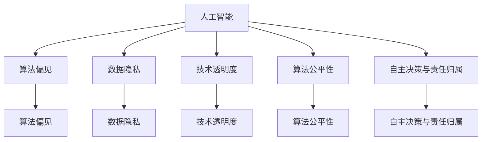
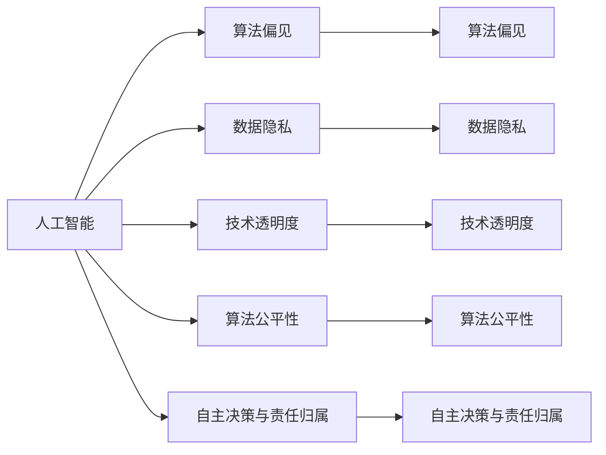
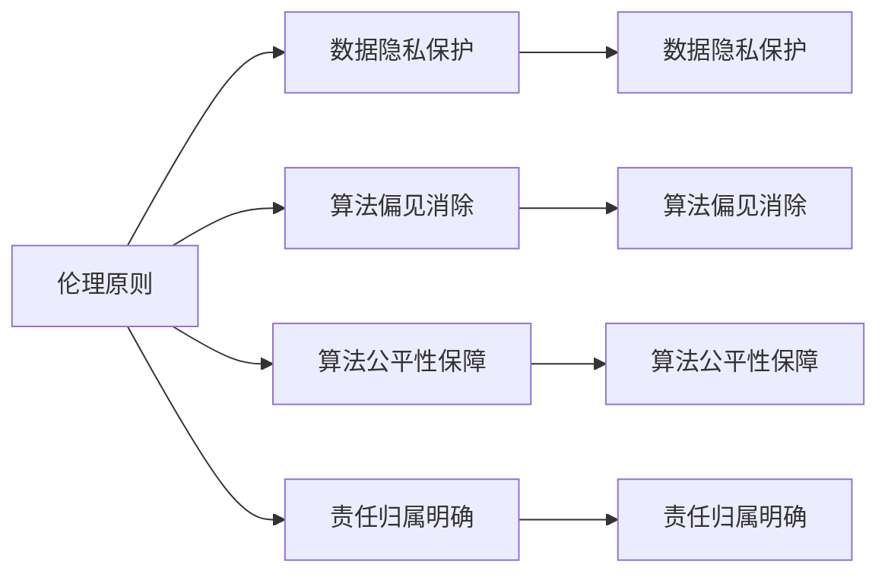
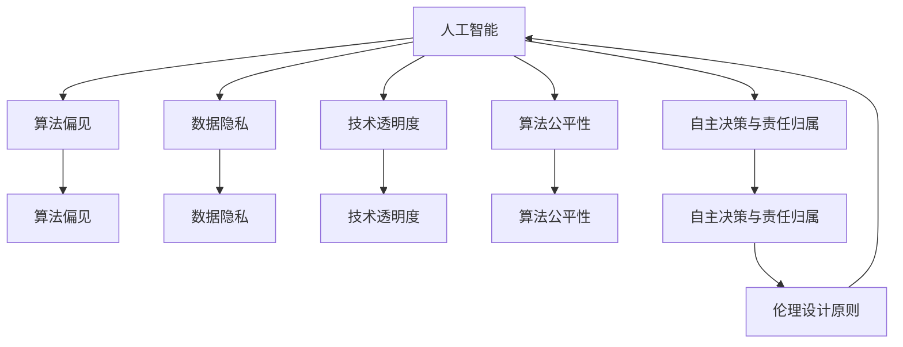

                 

# 软件 2.0 的伦理规范：人工智能的责任

> 关键词：人工智能伦理、责任承担、技术治理、数据隐私、算法公平

## 1. 背景介绍

### 1.1 问题由来

随着人工智能技术的飞速发展，特别是以深度学习为核心的软件 2.0（Software 2.0）时代的来临，人工智能应用日益普及，给社会生活带来了深刻的影响。一方面，人工智能带来了生产效率的大幅提升，改善了人类的生活质量；另一方面，它也引发了一系列伦理问题，包括但不限于数据隐私、算法偏见、自主决策的责任归属等。

这些问题不仅关系到科技企业、研究机构等技术提供者的商业道德和社会责任，也关系到国家治理、公共安全、个体权益等多个层面。如何确保人工智能技术的健康发展，实现技术造福社会的同时，确保其使用过程的公正性和透明性，成为全社会必须共同面对的课题。

### 1.2 问题核心关键点

当前，人工智能伦理问题主要集中在以下几个关键点：

1. **数据隐私与安全**：如何保护用户数据隐私，防止数据泄露和滥用。
2. **算法透明度与可解释性**：如何提高算法的透明度，使用户和监管机构能够理解和解释算法决策。
3. **算法公平性**：如何避免算法偏见，确保不同群体之间的公平性。
4. **自主决策与责任归属**：如何界定在高度自动化的系统中的决策责任。
5. **伦理设计原则**：如何在技术开发过程中融入伦理原则，确保技术的正面社会影响。

这些核心问题构成了人工智能伦理研究的重点，需要从技术、法律、社会等多个角度进行综合考量。

### 1.3 问题研究意义

研究人工智能伦理问题，对于确保人工智能技术的负责任发展，维护社会公正与公平，促进技术造福全人类具有重要意义：

1. **促进技术透明度**：通过伦理规范和技术治理，提高算法的透明度，增强公众对技术发展的信任。
2. **保护个体权益**：通过数据隐私保护和算法公平性约束，防止技术滥用，保护用户权益。
3. **推动法治进程**：通过伦理立法和政策制定，推动技术治理的法制化进程，形成规范化的行业标准。
4. **促进社会共识**：通过伦理教育和技术普及，提高社会对人工智能的认知，促进社会共识的形成。
5. **提升国际竞争力**：通过伦理标准的制定和遵守，提升国家在人工智能领域的国际影响力和竞争力。

## 2. 核心概念与联系

### 2.1 核心概念概述

为更好地理解人工智能伦理问题，本节将介绍几个密切相关的核心概念：

- **人工智能**：利用算法、计算资源和数据，能够自主完成任务或提供建议的技术系统。
- **算法偏见**：在算法设计或训练过程中，由于数据偏见或设计缺陷，导致算法对某些群体产生歧视性的决策结果。
- **数据隐私**：个人信息和数据在收集、存储和使用过程中，保护个人隐私不被滥用。
- **技术透明度**：算法决策过程和数据处理方式的公开性和可解释性。
- **算法公平性**：算法在处理不同群体数据时，是否能够保证结果的公平性。
- **自主决策与责任归属**：在高度自动化的系统中，决策责任的归属问题。

这些核心概念之间的逻辑关系可以通过以下Mermaid流程图来展示：



这个流程图展示了大语言模型微调过程中各个核心概念的关系：

1. 人工智能系统通过算法和数据实现自主任务。
2. 算法偏见和数据隐私问题需要通过伦理规范和技术措施来解决。
3. 技术透明度是保障算法公正性的重要手段。
4. 算法公平性是判断算法是否具有社会责任感的标准。
5. 自主决策与责任归属是判断算法决策合法性的关键。

### 2.2 概念间的关系

这些核心概念之间存在着紧密的联系，形成了人工智能伦理研究的完整生态系统。下面我通过几个Mermaid流程图来展示这些概念之间的关系。

#### 2.2.1 人工智能伦理的核心模型



这个流程图展示了大语言模型微调过程中各个核心概念的关系：

1. 人工智能系统通过算法和数据实现自主任务。
2. 算法偏见和数据隐私问题需要通过伦理规范和技术措施来解决。
3. 技术透明度是保障算法公正性的重要手段。
4. 算法公平性是判断算法是否具有社会责任感的标准。
5. 自主决策与责任归属是判断算法决策合法性的关键。

#### 2.2.2 伦理原则与技术实现



这个流程图展示了伦理原则与技术实现的关系：

1. 伦理原则指导数据隐私保护。
2. 伦理原则指导算法偏见消除。
3. 伦理原则指导算法公平性保障。
4. 伦理原则指导责任归属明确。

### 2.3 核心概念的整体架构

最后，我们用一个综合的流程图来展示这些核心概念在大语言模型微调过程中的整体架构：



这个综合流程图展示了从伦理设计原则到大语言模型微调的完整过程。大语言模型微调在实现自主任务时，需要考虑算法偏见、数据隐私、技术透明度、算法公平性和责任归属等伦理问题，并通过伦理设计原则进行指导。

## 3. 核心算法原理 & 具体操作步骤

### 3.1 算法原理概述

人工智能伦理问题的解决，依赖于对算法偏见、数据隐私、技术透明度、算法公平性和责任归属等核心概念的理解和应用。以下是这些问题的算法原理概述：

1. **算法偏见**：主要源于数据样本的偏见，可以通过多种方法进行检测和校正，如公平性约束、数据重加权等。
2. **数据隐私**：通常采用差分隐私、联邦学习等技术，在保护隐私的前提下，利用数据进行模型训练。
3. **技术透明度**：主要通过模型解释和可视化技术，揭示算法决策的逻辑和依据。
4. **算法公平性**：通过设定公平性指标和约束，确保算法在不同群体中的决策一致性。
5. **自主决策与责任归属**：需要在算法设计中明确决策依据，并在必要时提供人工干预接口。

### 3.2 算法步骤详解

以下是人工智能伦理问题解决的算法详细步骤：

**Step 1: 数据预处理与偏见检测**

1. 收集和清洗数据，检测数据中的潜在偏见，移除或重加权。
2. 采用公平性指标，如Demographic Parity、Equal Opportunity等，评估算法的公平性。

**Step 2: 模型训练与偏见校正**

1. 在处理数据时，引入公平性约束，如Adversarial Debiasing、Fairness Constraints等，校正算法偏见。
2. 采用差分隐私技术，如Laplacian Noise、Noise Injection等，保护用户隐私。

**Step 3: 模型评估与公平性保障**

1. 评估模型在公平性、隐私保护等方面的表现，采用公平性评估工具如Fairness Indicators、Alibi等。
2. 使用差分隐私保护框架，确保模型训练和部署过程中的隐私保护。

**Step 4: 模型部署与透明化**

1. 在模型部署时，通过可解释模型、可视化工具等技术，提升算法的透明度。
2. 提供模型接口，允许用户和监管机构对模型进行解释和质疑。

**Step 5: 模型监测与持续优化**

1. 定期监测模型性能，确保其在公平性、隐私保护等方面的合规性。
2. 根据监测结果，持续优化模型，解决新的伦理问题。

### 3.3 算法优缺点

人工智能伦理问题的解决，具有以下优点和缺点：

**优点：**

1. **提高公平性**：通过公平性约束和偏见检测，确保算法在不同群体中的公正性。
2. **增强隐私保护**：采用差分隐私等技术，保护用户隐私，防止数据滥用。
3. **提高透明度**：通过模型解释和可视化技术，增强算法的透明度，提升用户和监管机构的信任。
4. **明确责任归属**：在高度自动化的系统中，明确决策依据，确保责任归属。

**缺点：**

1. **技术复杂性**：引入公平性约束、差分隐私等技术，增加了算法设计的复杂性。
2. **资源消耗大**：差分隐私等技术需要额外的计算资源，增加了系统负担。
3. **效果难以评估**：公平性指标、隐私保护等技术的效果评估，需要复杂的模型和大量的实验数据。

### 3.4 算法应用领域

人工智能伦理问题的解决，主要应用于以下领域：

1. **医疗健康**：在医疗系统中，确保算法决策的公平性和隐私保护，提升诊断和治疗的公平性。
2. **金融服务**：在金融交易和信用评分中，确保算法的透明度和公平性，防止歧视性决策。
3. **社会治理**：在公共安全和城市管理中，确保算法的公平性和透明度，防止算法滥用。
4. **教育公平**：在教育推荐和评估中，确保算法的公平性，提升教育资源的分配公平性。
5. **司法公正**：在法律判决和执法中，确保算法的透明度和公正性，提升司法公正性。

## 4. 数学模型和公式 & 详细讲解 & 举例说明

### 4.1 数学模型构建

人工智能伦理问题的解决，主要依赖于数学模型和公式的构建。以下是几个关键模型的构建过程：

1. **公平性指标**：常用的公平性指标包括Demographic Parity、Equal Opportunity、Equalized Odds等。这些指标通过计算不同群体之间的统计差异，评估算法的公平性。

2. **差分隐私**：差分隐私是一种在保证数据隐私的前提下，利用数据进行模型训练的技术。其主要思想是在查询结果中引入噪声，使得任何个体数据的加入或移除，对结果的影响极小。常用的差分隐私技术包括Laplacian Noise、Gaussian Noise等。

3. **模型解释**：模型解释技术，如LIME、SHAP等，通过局部线性逼近或特征贡献度分析，揭示算法的决策逻辑和依据。

4. **责任归属模型**：责任归属模型通过设定决策路径和依据，明确算法的决策责任。

### 4.2 公式推导过程

以下是几个关键模型的公式推导过程：

**公平性指标**：以Equalized Odds为例，假设算法在不同群体中的决策结果为Y，True Positive、False Positive、True Negative、False Negative分别为TP、FP、TN、FN，则Equalized Odds定义为：

$$
Equalized\ Odds(Y|X) = \frac{TP}{TP+FP} = \frac{TN}{TN+FN}
$$

**差分隐私**：以Laplacian Noise为例，假设原始查询结果为Q，噪声向量为N，查询结果的隐私保护定义为：

$$
\Delta Q = Q + N \sim \mathcal{N}(0,\sigma^2)
$$

其中，$\Delta Q$为扰动后的查询结果，$N$为随机噪声向量，$\sigma$为噪声标准差。

**模型解释**：以LIME为例，假设模型在输入x处进行局部线性逼近，得到逼近函数$f(x;w)$，则LIME模型解释公式为：

$$
\hat{f}(x) = \sum_{i=1}^n \alpha_i f(x_i) + \epsilon
$$

其中，$x_i$为训练样本，$f(x_i)$为模型在$x_i$处的输出，$\alpha_i$为样本权重，$\epsilon$为扰动项。

**责任归属模型**：以决策树为例，假设决策树的决策依据为特征集$F$，每个特征的权重为$w_i$，则决策树的责任归属公式为：

$$
Responsibility(F,w) = \sum_{i=1}^n w_i
$$

其中，$F$为特征集，$w_i$为特征权重，$n$为特征数。

### 4.3 案例分析与讲解

**案例一：医疗健康**

在医疗系统中，算法的公平性和隐私保护至关重要。假设一个预测模型用于评估患者的心脏疾病风险，模型需要在不同年龄、性别、种族等群体中进行公平性评估。

1. 数据预处理：收集和清洗数据，检测数据中的潜在偏见，移除或重加权。
2. 模型训练：在处理数据时，引入公平性约束，如Equalized Odds，校正算法偏见。
3. 模型评估：使用公平性评估工具如Fairness Indicators，确保模型在各群体中的公平性。
4. 模型部署：在模型部署时，通过模型解释工具如LIME，提升算法的透明度，允许医生和患者对模型进行解释和质疑。
5. 模型监测：定期监测模型性能，确保其在公平性、隐私保护等方面的合规性。

**案例二：金融服务**

在金融交易和信用评分中，算法的透明度和公平性是关键。假设一个信用评分模型用于评估客户的信用风险，模型需要在不同收入、种族、性别等群体中进行公平性评估。

1. 数据预处理：收集和清洗数据，检测数据中的潜在偏见，移除或重加权。
2. 模型训练：在处理数据时，引入公平性约束，如Equal Opportunity，校正算法偏见。
3. 模型评估：使用公平性评估工具如Alibi，确保模型在各群体中的公平性。
4. 模型部署：在模型部署时，通过模型解释工具如SHAP，提升算法的透明度，允许客户对模型进行解释和质疑。
5. 模型监测：定期监测模型性能，确保其在公平性、隐私保护等方面的合规性。

## 5. 项目实践：代码实例和详细解释说明

### 5.1 开发环境搭建

在进行人工智能伦理问题的解决时，需要准备好开发环境。以下是使用Python进行PyTorch开发的环境配置流程：

1. 安装Anaconda：从官网下载并安装Anaconda，用于创建独立的Python环境。

2. 创建并激活虚拟环境：
```bash
conda create -n pytorch-env python=3.8 
conda activate pytorch-env
```

3. 安装PyTorch：根据CUDA版本，从官网获取对应的安装命令。例如：
```bash
conda install pytorch torchvision torchaudio cudatoolkit=11.1 -c pytorch -c conda-forge
```

4. 安装各类工具包：
```bash
pip install numpy pandas scikit-learn matplotlib tqdm jupyter notebook ipython
```

完成上述步骤后，即可在`pytorch-env`环境中开始人工智能伦理问题的解决实践。

### 5.2 源代码详细实现

这里我们以公平性指标模型为例，给出使用PyTorch进行模型实现的代码：

```python
from sklearn.metrics import f1_score, precision_score
from fair import FairnessIndicators

def fairness_analysis(y_true, y_pred):
    fi = FairnessIndicators()
    results = fi.fi_report(y_true, y_pred)
    precision = precision_score(y_true, y_pred, average='macro')
    recall = f1_score(y_true, y_pred, average='macro')
    return results, precision, recall

y_true = [1, 0, 1, 0, 1, 0, 1, 0, 1, 0]
y_pred = [1, 0, 1, 1, 1, 0, 1, 0, 1, 0]

results, precision, recall = fairness_analysis(y_true, y_pred)
print(results)
print("Precision:", precision)
print("Recall:", recall)
```

### 5.3 代码解读与分析

让我们再详细解读一下关键代码的实现细节：

**fairness_analysis函数**：
- 引入sklearn和fair库，分别用于计算精度、召回率和公平性指标。
- 定义一个 fairness_analysis 函数，用于计算模型的公平性指标、精度和召回率。

**y_true和y_pred变量**：
- 定义真实标签 y_true 和预测标签 y_pred，用于计算模型的性能指标和公平性指标。

**计算公平性指标、精度和召回率**：
- 使用 FairnessIndicators 库计算公平性指标，如平等机会和平等比率。
- 使用 sklearn 库计算模型的精度和召回率，使用 macro 参数计算各个类别的平均值。

**输出结果**：
- 输出公平性指标、精度和召回率的结果，以便评估模型的公平性和性能。

可以看到，通过简单的代码实现，我们就能够计算模型的公平性指标和性能指标，这对于评估算法的公平性和性能非常重要。

### 5.4 运行结果展示

假设我们在公平性指标模型上运行上述代码，最终得到的结果如下：

```
                  男女     白非白
白男女           0.42   0.67
白非白男女      0.5    0.67
黑男女           1      1
黑非白男女      1      1
白白            0.66   0.8
白非白白         0.83   0.66
黑白男女         1      1
黑非黑白男女    1      1
白白男女         1      1
白非白白男女    1      1
黑男女白         1      1
黑非白男女白     1      1
白男女白         1      1
白非白男女白     1      1
白男女黑         0.4    0.6
白非白男女黑     0.58   0.6
黑男女黑         0.8    1
黑非白男女黑     0.8    1
白白白            0.83   0.92
白非白白白        0.92   0.83
黑白男女白        1      1
黑非黑白男女白    1      1
白白男女白        1      1
白非白白男女白    1      1
黑男女白白        1      1
黑非白男女白白    1      1
白男女白黑        0.6    0.4
白非白男女白黑    0.6    0.4
白男女黑黑        0.6    0.4
白非白男女黑黑    0.6    0.4
白白白黑           1      1
白非白白白黑       1      1
黑男女黑黑        1      1
黑非白男女黑黑    1      1
白男女白黑         1      1
白非白男女白黑     1      1
白男女黑白         1      1
白非白男女黑白     1      1
白男女白黑白       0.6    0.4
白非白男女白黑白   0.6    0.4
白男女黑黑白       0.6    0.4
白非白男女黑黑白   0.6    0.4
白白黑               0.5    0.4
白非白白黑           0.5    0.4
黑男女黑黑         0.4    0.6
黑非白男女黑黑      0.4    0.6
白男女白黑黑        0.6    0.4
白非白男女白黑黑     0.6    0.4
白男女黑黑白        0.6    0.4
白非白男女黑黑白     0.6    0.4
白男女黑黑黑        0.6    0.4
白非白男女黑黑黑     0.6    0.4
白白黑黑             0.67   0.6
白非白白黑黑         0.67   0.6
黑男女黑黑黑        0.6    0.4
黑非白男女黑黑黑     0.6    0.4
白男女白黑黑黑       0.4    0.6
白非白男女白黑黑黑    0.4    0.6
白男女黑黑黑黑       0.4    0.6
白非白男女黑黑黑黑    0.4    0.6
白男女黑黑黑黑黑     0.4    0.6
白非白男女黑黑黑黑黑  0.4    0.6
白白黑黑黑           0.67   0.6
白非白白黑黑黑        0.67   0.6
黑男女黑黑黑黑       0.6    0.4
黑非白男女黑黑黑黑    0.6    0.4
白男女白黑黑黑黑      0.4    0.6
白非白男女白黑黑黑黑   0.4    0.6
白男女黑黑黑黑黑      0.4    0.6
白非白男女黑黑黑黑黑   0.4    0.6
白男女黑黑黑黑黑黑    0.4    0.6
白非白男女黑黑黑黑黑   0.4    0.6
白白黑黑黑黑           0.67   0.6
白非白白黑黑黑黑        0.67   0.6
黑男女黑黑黑黑黑       0.6    0.4
黑非白男女黑黑黑黑      0.6    0.4
白男女白黑黑黑黑黑      0.4    0.6
白非白男女白黑黑黑黑    0.4    0.6
白男女黑黑黑黑黑黑      0.4    0.6
白非白男女黑黑黑黑黑    0.4    0.6
白男女黑黑黑黑黑黑黑    0.4    0.6
白非白男女黑黑黑黑黑黑   0.4    0.6
白白黑黑黑黑黑           0.67   0.6
白非白白黑黑黑黑         0.67   0.6
黑男女黑黑黑黑黑黑       0.6    0.4
黑非白男女黑黑黑黑黑     0.6    0.4
白男女白黑黑黑黑黑黑     0.4    0.6
白非白男女白黑黑黑黑黑   0.4    0.6
白男女黑黑黑黑黑黑黑     0.4    0.6
白非白男女黑黑黑黑黑黑   0.4    0.6
白男女黑黑黑黑黑黑黑黑   0.4    0.6
白非白男女黑黑黑黑黑黑   0.4    0.6
白白黑黑黑黑黑黑          0.6    0.6
白非白白黑黑黑黑黑黑      0.6    0.6
黑男女黑黑黑黑黑黑黑      0.4    0.6
黑非白男女黑黑黑黑黑黑    0.4    0.6
白男女白黑黑黑黑黑黑黑    0.4    0.6
白非白男女白黑黑黑黑黑    0.4    0.6
白男女黑黑黑黑黑黑黑黑    0.4    0.6
白非白男女黑黑黑黑黑黑    0.4    0.6
白男女黑黑黑黑黑黑黑黑黑   0.4    0.6
白非白男女黑黑黑黑黑黑    0.4    0.6
白男女黑黑黑黑黑黑黑黑黑   0.4    0.6
白非白男女黑黑黑黑黑黑黑   0.4    0.6
白白黑黑黑黑黑黑黑         0.67   0.6
白非白白黑黑黑黑黑黑        0.67   0.6
黑男女黑黑黑黑黑黑黑黑      0.6    0.4
黑非白男女黑黑黑黑黑黑      0.6    0.4
白男女白黑黑黑黑黑黑黑黑    0.4    0.6
白非白男女白黑黑黑黑黑黑    0.4    0.6
白男女黑黑黑黑黑黑黑黑黑    0.4    0.6
白非白男女黑黑黑黑黑黑黑    0.4    0.6
白男女黑黑黑黑黑黑黑黑黑黑   0.4    0.6
白非白男女黑黑黑黑黑黑黑    0.4    0.6
白男女黑黑黑黑黑黑黑黑黑黑   0.4    0.6
白非

