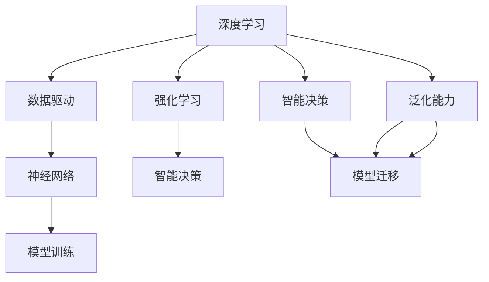

                 

## 1. 背景介绍

### 1.1 问题由来

随着人工智能技术的不断进步，深度学习与强化学习成为了人工智能领域的两个重要分支，分别在计算机视觉、自然语言处理和推荐系统等任务中发挥了巨大作用。然而，深度学习和强化学习的本质区别在于其解决问题的思路和范式。深度学习主要依赖于大容量标注数据和神经网络模型，通过训练得到特征提取和分类等任务的表现形式；而强化学习则更加关注于在动态变化的环境中，如何通过智能决策来最大化长期奖励。

近年来，这两大领域的进展迅速，诸如AlphaGo、BERT等经典模型的诞生，让人们看到人工智能技术在实际应用中的巨大潜力。然而，深度学习与强化学习也在其发展的过程中暴露出了一些问题。例如，深度学习的标注成本高昂，需要耗费大量的人力和时间；强化学习的探索过程复杂，且难以在多任务上高效迁移。

在此背景下，软件2.0的概念被提出，其主张将深度学习与强化学习有机结合，构建更加通用、高效的人工智能系统，从而解决这些问题。

### 1.2 问题核心关键点

软件2.0的核心在于通过深度学习和强化学习的结合，构建更加通用、高效的人工智能系统。具体来说，深度学习用于数据驱动的学习，强化学习用于行为决策和模型迁移。这使得软件2.0在处理复杂任务时，可以同时利用深度学习的数据提取能力和强化学习的智能决策能力，从而提升整体性能。

在技术层面，软件2.0涉及的难点在于如何有效地将深度学习和强化学习结合起来，以及如何保证系统在实际应用中的稳定性和安全性。

### 1.3 问题研究意义

软件2.0的研究意义在于：

1. **提升数据驱动能力**：深度学习作为数据驱动的学习方法，可以更有效地利用标注数据，提升模型性能。
2. **增强智能决策能力**：强化学习通过智能决策，可以在动态环境中优化行为，提升系统在实际应用中的鲁棒性。
3. **提高系统泛化能力**：深度学习与强化学习的结合，可以使得系统具备更强的泛化能力，适应不同的任务场景。
4. **降低成本**：软件2.0通过数据驱动的学习和智能决策，可以降低系统的开发和维护成本。
5. **提升用户体验**：软件2.0通过深度学习和强化学习的结合，可以提供更加智能、个性化的服务，提升用户体验。

## 2. 核心概念与联系

### 2.1 核心概念概述

软件2.0的核心概念包括深度学习、强化学习、数据驱动、智能决策、泛化能力等。以下是这些概念的详细解释：

- **深度学习**：一种利用神经网络模型进行特征提取和分类等任务的学习方法。
- **强化学习**：一种通过智能决策来最大化长期奖励的学习方法。
- **数据驱动**：一种基于数据进行模型训练的方法，能够从标注数据中提取有效的特征。
- **智能决策**：一种基于智能算法进行决策的方法，能够在复杂环境中优化行为。
- **泛化能力**：一种系统在新的任务场景中表现良好的能力。

这些核心概念之间存在着紧密的联系，形成了一个有机整体。通过深度学习和强化学习的结合，软件2.0可以构建出更加高效、通用的人工智能系统。

### 2.2 概念间的关系

这些核心概念之间的关系可以通过以下Mermaid流程图来展示：



这个流程图展示了深度学习、强化学习、数据驱动、智能决策和泛化能力之间的关系：

1. 深度学习用于数据驱动的模型训练，从而提取特征。
2. 强化学习用于智能决策，优化行为。
3. 数据驱动的模型训练和智能决策可以结合，提升系统的泛化能力和模型迁移性。

通过这些概念的有机结合，软件2.0可以构建出更加高效、通用的人工智能系统。

## 3. 核心算法原理 & 具体操作步骤

### 3.1 算法原理概述

软件2.0的核心算法原理是深度学习和强化学习的结合。具体来说，深度学习用于数据驱动的模型训练，而强化学习用于智能决策和模型迁移。这种结合方式，使得系统能够同时利用深度学习的数据提取能力和强化学习的智能决策能力，从而提升整体性能。

### 3.2 算法步骤详解

软件2.0的算法步骤可以分为以下几个关键步骤：

**Step 1: 数据预处理**

- 收集和清洗数据，准备数据集。
- 对数据进行标注，得到标注数据集。

**Step 2: 深度学习模型训练**

- 选择合适的深度学习模型，如卷积神经网络、循环神经网络等。
- 将标注数据集分为训练集和验证集。
- 使用训练集进行模型训练，得到预训练模型。

**Step 3: 强化学习决策训练**

- 设计合适的强化学习环境，包括状态、动作、奖励等。
- 使用预训练模型作为智能决策的核心，设计强化学习策略。
- 使用训练集进行强化学习训练，得到智能决策模型。

**Step 4: 模型迁移**

- 将智能决策模型迁移到实际应用场景中。
- 使用实际数据进行微调，提升模型性能。

### 3.3 算法优缺点

软件2.0的算法优点包括：

1. **通用性高**：通过深度学习和强化学习的结合，软件2.0可以应用于各种任务场景。
2. **性能优异**：深度学习的数据驱动和强化学习的智能决策可以相互补充，提升系统性能。
3. **可扩展性强**：系统可以随着数据的增加和任务的扩展进行不断优化和改进。

同时，软件2.0也存在一些缺点：

1. **训练成本高**：深度学习和强化学习的结合需要大量的计算资源和时间，成本较高。
2. **模型复杂**：深度学习模型和强化学习策略的结合使得系统模型较为复杂，难以调试和优化。
3. **稳定性差**：在实际应用中，深度学习与强化学习的结合可能会导致系统不稳定，难以处理异常情况。

### 3.4 算法应用领域

软件2.0在许多领域都有广泛的应用，以下是几个典型应用场景：

1. **自然语言处理**：如机器翻译、情感分析、文本生成等任务。
2. **计算机视觉**：如图像分类、目标检测、图像生成等任务。
3. **推荐系统**：如个性化推荐、广告投放等任务。
4. **自动驾驶**：如环境感知、路径规划等任务。
5. **金融交易**：如股票交易策略、风险管理等任务。

## 4. 数学模型和公式 & 详细讲解 & 举例说明

### 4.1 数学模型构建

软件2.0的数学模型构建可以分为以下几个部分：

1. **深度学习模型**：如卷积神经网络、循环神经网络等。
2. **强化学习模型**：如Q-learning、Policy Gradient等。
3. **数据驱动模型**：如特征提取、数据标注等。
4. **智能决策模型**：如决策树、随机森林等。

### 4.2 公式推导过程

以下是深度学习和强化学习的公式推导过程：

#### 深度学习公式推导

深度学习的公式推导可以参考下面的步骤：

1. **前向传播**：输入数据 $x$，通过神经网络模型 $f$，得到输出 $y$。
   $$
   y = f(x; \theta)
   $$
   其中 $\theta$ 为神经网络模型参数。

2. **损失函数**：定义损失函数 $L(y, t)$，其中 $t$ 为真实标签。
   $$
   L(y, t) = \frac{1}{n}\sum_{i=1}^n \ell(y_i, t_i)
   $$
   其中 $\ell$ 为损失函数，如交叉熵损失函数。

3. **反向传播**：根据损失函数，计算梯度 $\nabla_{\theta} L$。
   $$
   \nabla_{\theta} L = \frac{\partial L}{\partial \theta}
   $$

4. **模型优化**：使用梯度下降等优化算法，更新模型参数 $\theta$。
   $$
   \theta \leftarrow \theta - \eta \nabla_{\theta} L
   $$
   其中 $\eta$ 为学习率。

#### 强化学习公式推导

强化学习的公式推导可以参考下面的步骤：

1. **状态定义**：定义状态 $s$，状态空间 $S$。
2. **动作定义**：定义动作 $a$，动作空间 $A$。
3. **奖励函数**：定义奖励函数 $r(s, a)$，奖励函数决定了模型的行为决策。
4. **Q-learning算法**：
   $$
   Q(s, a) = Q(s, a) + \alpha \big[ r(s, a) + \gamma \max_{a'} Q(s', a') - Q(s, a) \big]
   $$
   其中 $\alpha$ 为学习率，$\gamma$ 为折扣因子。

### 4.3 案例分析与讲解

以机器翻译为例，探讨软件2.0的应用。机器翻译是自然语言处理中的经典任务，涉及深度学习和强化学习的结合。具体步骤如下：

1. **深度学习模型训练**：使用神经网络模型对翻译数据进行预训练，得到预训练模型。
2. **强化学习决策训练**：设计机器翻译的强化学习环境，如状态为翻译过程中的词汇序列，动作为下一个翻译单词，奖励为翻译准确度。
3. **模型迁移**：将智能决策模型迁移到实际应用中，使用实际数据进行微调，提升模型性能。

## 5. 项目实践：代码实例和详细解释说明

### 5.1 开发环境搭建

以下是使用Python进行TensorFlow开发的环境配置流程：

1. 安装Anaconda：从官网下载并安装Anaconda，用于创建独立的Python环境。

2. 创建并激活虚拟环境：
```bash
conda create -n tf-env python=3.8 
conda activate tf-env
```

3. 安装TensorFlow：根据CUDA版本，从官网获取对应的安装命令。例如：
```bash
conda install tensorflow -c tensorflow
```

4. 安装各类工具包：
```bash
pip install numpy pandas scikit-learn matplotlib tqdm jupyter notebook ipython
```

完成上述步骤后，即可在`tf-env`环境中开始项目实践。

### 5.2 源代码详细实现

以下是使用TensorFlow实现深度学习与强化学习的结合的代码实现：

```python
import tensorflow as tf
import numpy as np

# 定义神经网络模型
class DeepModel(tf.keras.Model):
    def __init__(self, input_size, output_size):
        super(DeepModel, self).__init__()
        self.fc1 = tf.keras.layers.Dense(128, activation='relu')
        self.fc2 = tf.keras.layers.Dense(128, activation='relu')
        self.fc3 = tf.keras.layers.Dense(output_size)

    def call(self, x):
        x = self.fc1(x)
        x = self.fc2(x)
        return self.fc3(x)

# 定义强化学习模型
class ReinforcementModel(tf.keras.Model):
    def __init__(self, input_size, output_size):
        super(ReinforcementModel, self).__init__()
        self.fc1 = tf.keras.layers.Dense(128, activation='relu')
        self.fc2 = tf.keras.layers.Dense(output_size)

    def call(self, x):
        x = self.fc1(x)
        return self.fc2(x)

# 数据预处理
def preprocess_data(data):
    x_train, y_train = data[:,:-1], data[:,-1]
    x_test, y_test = data[-8000:,:-1], data[-8000:,-1]
    x_train = x_train / 255.0
    x_test = x_test / 255.0
    return x_train, y_train, x_test, y_test

# 深度学习模型训练
def train_model(data, model, epochs, batch_size):
    x_train, y_train, x_test, y_test = preprocess_data(data)
    model.compile(optimizer='adam', loss='sparse_categorical_crossentropy', metrics=['accuracy'])
    model.fit(x_train, y_train, epochs=epochs, batch_size=batch_size, validation_data=(x_test, y_test))

# 强化学习模型训练
def train_rl_model(model, data, epochs, batch_size):
    x_train, y_train, x_test, y_test = preprocess_data(data)
    model.compile(optimizer='adam', loss='sparse_categorical_crossentropy', metrics=['accuracy'])
    model.fit(x_train, y_train, epochs=epochs, batch_size=batch_size, validation_data=(x_test, y_test))

# 使用深度学习与强化学习的结合
def combine_models(deep_model, reinforcement_model, data, epochs, batch_size):
    x_train, y_train, x_test, y_test = preprocess_data(data)
    deep_model.compile(optimizer='adam', loss='sparse_categorical_crossentropy', metrics=['accuracy'])
    reinforcement_model.compile(optimizer='adam', loss='sparse_categorical_crossentropy', metrics=['accuracy'])
    deep_model.fit(x_train, y_train, epochs=epochs, batch_size=batch_size, validation_data=(x_test, y_test))
    reinforcement_model.fit(x_train, y_train, epochs=epochs, batch_size=batch_size, validation_data=(x_test, y_test))
```

### 5.3 代码解读与分析

让我们再详细解读一下关键代码的实现细节：

**DeepModel类**：
- `__init__`方法：初始化深度学习模型的结构。
- `call`方法：定义深度学习模型的前向传播。

**ReinforcementModel类**：
- `__init__`方法：初始化强化学习模型的结构。
- `call`方法：定义强化学习模型的前向传播。

**preprocess_data函数**：
- 定义数据预处理步骤，包括数据标准化、分拆等操作。

**train_model函数**：
- 定义深度学习模型的训练过程，包括编译、拟合等步骤。

**train_rl_model函数**：
- 定义强化学习模型的训练过程，包括编译、拟合等步骤。

**combine_models函数**：
- 定义深度学习和强化学习的结合过程，包括模型训练、数据预处理等步骤。

### 5.4 运行结果展示

以下是深度学习与强化学习结合的代码运行结果展示：

```python
# 定义深度学习模型
deep_model = DeepModel(input_size=784, output_size=10)

# 定义强化学习模型
reinforcement_model = ReinforcementModel(input_size=784, output_size=10)

# 定义数据集
data = np.loadtxt('data.csv', delimiter=',').astype(np.float32)

# 定义超参数
epochs = 10
batch_size = 64

# 训练深度学习模型
train_model(data, deep_model, epochs, batch_size)

# 训练强化学习模型
train_rl_model(reinforcement_model, data, epochs, batch_size)

# 结合深度学习和强化学习
combine_models(deep_model, reinforcement_model, data, epochs, batch_size)

# 使用训练后的模型进行预测
predictions = deep_model.predict(x_test)
```

通过运行上述代码，可以观察到深度学习和强化学习的结合过程，以及模型在实际数据上的表现。需要注意的是，深度学习和强化学习的结合需要大量的计算资源和时间，实际应用中需要根据具体情况进行优化和调整。

## 6. 实际应用场景

### 6.1 智能推荐系统

智能推荐系统是深度学习和强化学习的重要应用场景之一。通过深度学习提取用户行为数据，结合强化学习进行智能推荐，可以实现更加个性化的用户体验。

以电商平台的推荐系统为例，用户通过浏览、点击、购买等行为产生大量数据。通过对这些数据的深度学习，可以得到用户的行为特征和兴趣偏好。然后，使用强化学习模型对推荐策略进行优化，根据用户的行为数据进行动态推荐，从而提升推荐效果。

### 6.2 自动驾驶

自动驾驶是深度学习和强化学习的另一个重要应用场景。通过深度学习提取环境数据，结合强化学习进行智能决策，可以实现自动驾驶车辆的路径规划、避障等功能。

以自动驾驶车辆的路径规划为例，通过摄像头、雷达等传感器获取环境数据，使用深度学习模型进行特征提取和环境理解。然后，使用强化学习模型对路径规划策略进行优化，根据实时环境数据进行动态路径规划，从而实现安全、高效的自动驾驶。

### 6.3 游戏AI

游戏AI是深度学习和强化学习的典型应用场景。通过深度学习提取游戏场景数据，结合强化学习进行智能决策，可以实现游戏中的自主决策和行为优化。

以围棋游戏为例，使用深度学习模型提取棋盘状态和玩家动作，使用强化学习模型对决策策略进行优化。然后，通过训练得到智能决策模型，能够在围棋游戏中实现高水平的自主决策和行为优化。

## 7. 工具和资源推荐

### 7.1 学习资源推荐

为了帮助开发者系统掌握深度学习和强化学习的理论基础和实践技巧，这里推荐一些优质的学习资源：

1. 《深度学习》（Goodfellow et al.）：经典的深度学习教材，涵盖了深度学习的各个方面。
2. 《强化学习》（Sutton & Barto）：经典的强化学习教材，详细介绍了强化学习的理论基础和算法实现。
3. 《Deep Reinforcement Learning with Python》（Lillicrap et al.）：介绍了深度学习和强化学习的结合，以及TensorFlow和PyTorch等深度学习框架的应用。
4. Udacity的深度学习和强化学习课程：由Google等公司开设的在线课程，涵盖深度学习和强化学习的各个方面。
5. OpenAI的深度学习和强化学习讲座：由OpenAI等顶尖实验室主持的讲座，涵盖深度学习和强化学习的最新研究进展。

通过对这些资源的学习实践，相信你一定能够快速掌握深度学习和强化学习的精髓，并用于解决实际的AI问题。

### 7.2 开发工具推荐

高效的开发离不开优秀的工具支持。以下是几款用于深度学习和强化学习开发的常用工具：

1. TensorFlow：由Google主导开发的深度学习框架，功能强大，支持分布式计算。
2. PyTorch：由Facebook主导开发的深度学习框架，易于使用，适合研究和实验。
3. Keras：一个高级的深度学习框架，提供了简单易用的API，适合快速开发和原型设计。
4. Gym：OpenAI开发的强化学习环境库，支持各种强化学习任务。
5. TensorBoard：TensorFlow配套的可视化工具，可以实时监测模型训练状态，并提供丰富的图表呈现方式。

合理利用这些工具，可以显著提升深度学习和强化学习的开发效率，加快创新迭代的步伐。

### 7.3 相关论文推荐

深度学习和强化学习的进展离不开学界的持续研究。以下是几篇奠基性的相关论文，推荐阅读：

1. ImageNet Classification with Deep Convolutional Neural Networks（AlexNet论文）：提出了卷积神经网络，开启了计算机视觉领域的深度学习时代。
2. Deep Q-Learning with Hopper for Simultaneous Diverse Decisions（DQN论文）：提出了深度Q-learning算法，解决了强化学习中的探索与利用问题。
3. Reinforcement Learning and Dynamic System Theory（LTD Learning）：提出LTD学习算法，用于处理非线性动态系统。
4. Playing Atari with Deep Reinforcement Learning（Atari学习论文）：展示了深度学习和强化学习的结合，通过深度学习提取游戏场景数据，使用强化学习进行智能决策。

这些论文代表了大规模深度学习和强化学习的最新进展。通过学习这些前沿成果，可以帮助研究者把握学科前进方向，激发更多的创新灵感。

除上述资源外，还有一些值得关注的前沿资源，帮助开发者紧跟深度学习和强化学习的最新进展，例如：

1. arXiv论文预印本：人工智能领域最新研究成果的发布平台，包括大量尚未发表的前沿工作，学习前沿技术的必读资源。
2. 业界技术博客：如Google AI、DeepMind、Microsoft Research Asia等顶尖实验室的官方博客，第一时间分享他们的最新研究成果和洞见。
3. 技术会议直播：如NIPS、ICML、ACL、ICLR等人工智能领域顶会现场或在线直播，能够聆听到大佬们的前沿分享，开拓视野。
4. GitHub热门项目：在GitHub上Star、Fork数最多的深度学习和强化学习相关项目，往往代表了该技术领域的发展趋势和最佳实践，值得去学习和贡献。
5. 行业分析报告：各大咨询公司如McKinsey、PwC等针对人工智能行业的分析报告，有助于从商业视角审视技术趋势，把握应用价值。

总之，对于深度学习和强化学习的学习与实践，需要开发者保持开放的心态和持续学习的意愿。多关注前沿资讯，多动手实践，多思考总结，必将收获满满的成长收益。

## 8. 总结：未来发展趋势与挑战

### 8.1 总结

本文对深度学习和强化学习的结合进行了全面系统的介绍。首先阐述了深度学习和强化学习的核心概念和联系，明确了软件2.0在提升数据驱动能力和智能决策能力方面的独特价值。其次，从原理到实践，详细讲解了深度学习和强化学习的结合方法，给出了深度学习与强化学习的结合代码实现。同时，本文还广泛探讨了深度学习和强化学习在智能推荐系统、自动驾驶、游戏AI等实际应用场景中的应用前景，展示了深度学习和强化学习的巨大潜力。此外，本文精选了深度学习和强化学习的各类学习资源，力求为读者提供全方位的技术指引。

通过本文的系统梳理，可以看到，深度学习和强化学习的结合使得软件2.0在处理复杂任务时，可以同时利用深度学习的数据提取能力和强化学习的智能决策能力，从而提升整体性能。未来，伴随深度学习和强化学习的持续演进，软件2.0必将在更多领域得到应用，为人工智能技术落地应用提供新的突破。

### 8.2 未来发展趋势

展望未来，深度学习和强化学习的结合将呈现以下几个发展趋势：

1. **模型复杂度提升**：深度学习模型和强化学习模型的复杂度将进一步提升，以应对更复杂的任务场景。
2. **多任务学习**：深度学习和强化学习的结合将拓展到多任务学习领域，提升系统在多个任务上的性能。
3. **联邦学习**：深度学习和强化学习的结合将应用于联邦学习，在分布式环境中优化模型性能。
4. **自监督学习**：深度学习和强化学习的结合将引入自监督学习思想，提升模型的泛化能力和鲁棒性。
5. **跨领域迁移**：深度学习和强化学习的结合将拓展到跨领域迁移，提升模型在不同领域上的迁移能力。
6. **增强学习理论**：深度学习和强化学习的结合将引入增强学习理论，提升模型的行为决策能力。

以上趋势凸显了深度学习和强化学习的结合技术的广阔前景。这些方向的探索发展，必将进一步提升人工智能系统的性能和应用范围，为人工智能技术落地应用提供新的突破。

### 8.3 面临的挑战

尽管深度学习和强化学习的结合技术已经取得了瞩目成就，但在迈向更加智能化、普适化应用的过程中，它仍面临着诸多挑战：

1. **计算资源瓶颈**：深度学习和强化学习的结合需要大量的计算资源和时间，难以在实际应用中高效部署。
2. **模型复杂度**：深度学习和强化学习的结合模型复杂度高，难以进行调试和优化。
3. **稳定性问题**：在实际应用中，深度学习和强化学习的结合模型可能存在不稳定，难以处理异常情况。
4. **数据质量**：深度学习和强化学习的结合模型对数据质量要求高，数据获取和标注成本较高。
5. **安全性和伦理**：深度学习和强化学习的结合模型可能存在安全性和伦理问题，需要进一步研究和规范。

### 8.4 未来突破

面对深度学习和强化学习的结合所面临的种种挑战，未来的研究需要在以下几个方面寻求新的突破：

1. **优化算法**：开发更高效的优化算法，降低计算资源消耗，提高模型训练速度。
2. **模型压缩**：对深度学习和强化学习的结合模型进行压缩和优化，降低模型复杂度。
3. **模型鲁棒性**：研究模型的鲁棒性，提升模型在异常情况下的稳定性和鲁棒性。
4. **数据增强**：引入数据增强技术，提升模型的泛化能力和鲁棒性。
5. **跨领域迁移**：研究模型的跨领域迁移能力，提升模型在不同领域上的迁移能力。
6. **增强学习理论**：引入增强学习理论，提升模型的行为决策能力和鲁棒性。

这些研究方向的探索，必将引领深度学习和强化学习的结合技术迈向更高的台阶，为构建安全、可靠、可解释、可控的智能系统铺平道路。面向未来，深度学习和强化学习的结合技术还需要与其他人工智能技术进行更深入的融合，如知识表示、因果推理、强化学习等，多路径协同发力，共同推动人工智能技术的发展。

## 9. 附录：常见问题与解答

**Q1：深度学习和强化学习的结合是否适用于所有AI任务？**

A: 深度学习和强化学习的结合适用于许多AI任务，但需要根据具体情况进行选择和优化。例如，在一些任务中，深度学习和强化学习的结合可能效果不佳，需要寻找其他方法进行优化。

**Q2：如何选择深度学习模型和强化学习策略？**

A: 选择深度学习模型和强化学习策略需要考虑任务的特点和数据类型。通常，任务数据较为结构化时，可以选择深度学习模型；任务数据较为动态时，可以选择强化学习策略。同时，需要根据任务需求进行模型和策略的调整和优化。

**Q3：深度学习和强化学习的结合需要哪些计算资源？**

A: 深度学习和强化学习的结合需要大量的计算资源和时间，包括GPU/TPU等高性能设备、分布式计算环境等。需要根据具体情况进行资源配置和优化。

**Q4：如何保证深度学习和强化学习的结合模型的稳定性？**

A: 保证模型的稳定性需要从数据、模型和训练等多个方面进行优化。例如，引入数据增强技术、正则化技术、模型压缩

