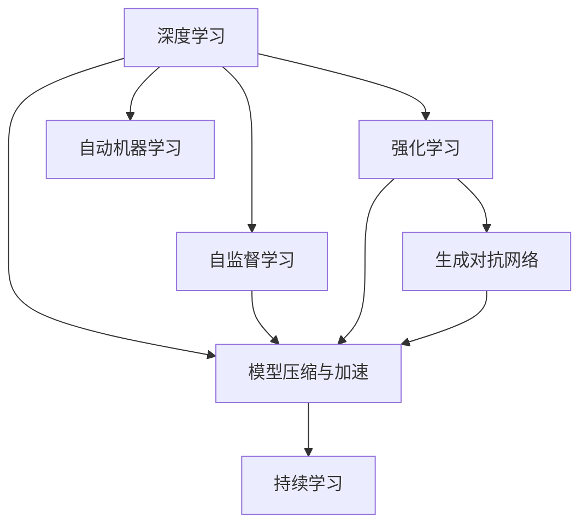
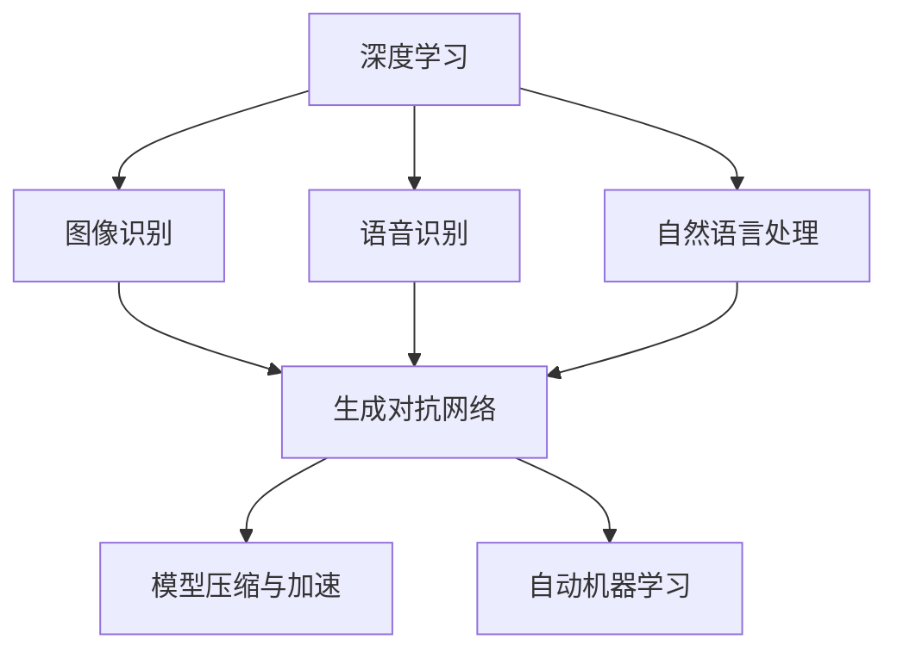
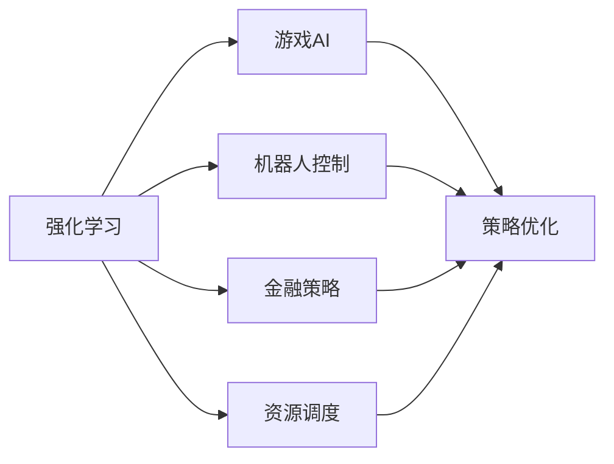
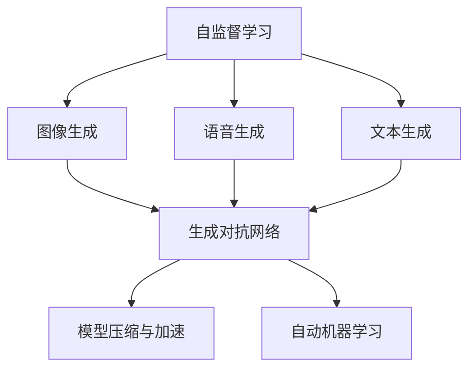
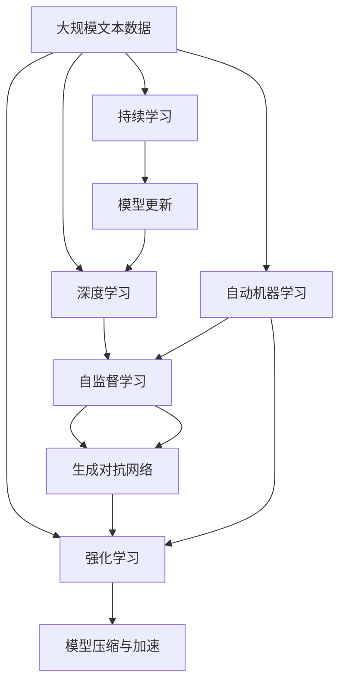

                 

# 软件 2.0 的发展趋势：深度学习、强化学习

> 关键词：
- 深度学习
- 强化学习
- 自监督学习
- 生成对抗网络(GANs)
- 模型压缩与加速
- 自动机器学习(AutoML)
- 持续学习
- 智能决策与优化
- 深度强化学习

## 1. 背景介绍

### 1.1 问题由来

随着计算机科技的迅速发展，软件行业正经历着前所未有的变革。早期的软件以规则和逻辑为导向，即所谓软件 1.0。这种软件依赖程序员的经验和知识，需要大量人工编码和调试，难以扩展和维护。而随着深度学习、强化学习等人工智能技术的兴起，软件 2.0 应运而生。软件 2.0 通过数据驱动和模型优化，实现软件的自适应和自进化，使得软件开发和部署变得更加高效、可靠和智能化。

### 1.2 问题核心关键点

软件 2.0 的核心在于深度学习、强化学习和自监督学习等人工智能技术的融合应用。这些技术通过自动化的模型训练和优化，使得软件能够从数据中学习知识，自动进行错误检测和修正，提升系统的性能和鲁棒性。此外，生成对抗网络（GANs）、模型压缩与加速、自动机器学习（AutoML）、持续学习等前沿技术也为软件 2.0 带来了更多可能性。

这些技术共同构成了软件 2.0 的技术框架，使得软件系统能够在不断变化的环境中，自动进行自我优化和迭代升级。

### 1.3 问题研究意义

研究软件 2.0 技术，对于提升软件开发效率、降低维护成本、增强软件鲁棒性和可靠性具有重要意义：

1. 提升软件开发效率：深度学习、强化学习等技术自动化了模型的训练和优化，使得软件开发周期大幅缩短，减少了人工干预的需求。
2. 降低维护成本：软件 2.0 系统通过自动化学习和优化，减少了人工调试和修复的工作量，降低了维护成本。
3. 增强软件鲁棒性：模型能够从大量数据中学习到通用的规律和模式，提升了系统的鲁棒性和泛化能力。
4. 支持智能决策与优化：强化学习等技术能够对系统进行智能决策，优化资源配置和运行效率。

## 2. 核心概念与联系

### 2.1 核心概念概述

为更好地理解软件 2.0 技术，本节将介绍几个密切相关的核心概念：

- 深度学习(Deep Learning)：一种通过多层神经网络自动学习和优化模型参数的机器学习方法。通过数据驱动的方式，深度学习模型能够自动进行特征提取和模式识别，广泛应用于图像识别、语音识别、自然语言处理等领域。
- 强化学习(Reinforcement Learning)：一种通过奖励和惩罚机制，指导智能体在环境中不断进行探索和决策的学习方法。强化学习模型能够自动优化策略，适应复杂多变的环境。
- 自监督学习(Self-supervised Learning)：一种无需标签数据，通过自动生成任务和标签，训练模型进行自我监督的学习方法。自监督学习能够从大量无标签数据中提取有用的特征和模式。
- 生成对抗网络(GANs)：一种通过生成器和判别器进行对抗训练的神经网络模型。GANs能够生成高质量的伪造数据，提高模型对数据多样性的建模能力。
- 模型压缩与加速：通过模型剪枝、量化、蒸馏等方法，减少模型参数量，提升推理速度和资源利用率。
- 自动机器学习(AutoML)：一种自动进行模型选择、调参和优化的方法，能够降低人工干预，提高模型性能。
- 持续学习(Continual Learning)：一种持续从新数据中学习，同时保持已学习的知识，避免灾难性遗忘的学习方法。持续学习能够适应数据分布的变化，保持模型的时效性。

这些核心概念之间的逻辑关系可以通过以下Mermaid流程图来展示：



这个流程图展示了大语言模型的核心概念及其之间的关系：

1. 深度学习通过数据驱动的方式，提取和建模数据中的特征和模式。
2. 自监督学习通过自动生成任务和标签，提高模型的泛化能力。
3. 强化学习通过奖励和惩罚机制，指导模型在复杂环境中进行决策和优化。
4. 生成对抗网络通过生成器和判别器的对抗训练，提升模型的生成和识别能力。
5. 模型压缩与加速通过减少模型参数和优化推理过程，提升模型效率。
6. 自动机器学习通过自动化调参和优化，降低人工干预，提高模型性能。
7. 持续学习通过不断学习新数据，保持模型的时效性。

这些概念共同构成了软件 2.0 的技术框架，使得软件系统能够在不断变化的环境中，自动进行自我优化和迭代升级。

### 2.2 概念间的关系

这些核心概念之间存在着紧密的联系，形成了软件 2.0 技术的完整生态系统。下面我通过几个Mermaid流程图来展示这些概念之间的关系。

#### 2.2.1 深度学习的应用范式



这个流程图展示了深度学习在不同应用场景中的应用范式。深度学习可以用于图像识别、语音识别、自然语言处理等领域，并通过GANs、模型压缩与加速、AutoML等技术提升性能。

#### 2.2.2 强化学习的应用场景



这个流程图展示了强化学习在不同应用场景中的应用。强化学习可以用于游戏AI、机器人控制、金融策略、资源调度等场景，并通过策略优化提升系统表现。

#### 2.2.3 自监督学习的应用领域



这个流程图展示了自监督学习在不同应用领域中的应用。自监督学习可以用于图像生成、语音生成、文本生成等场景，并通过GANs、模型压缩与加速、AutoML等技术提升性能。

### 2.3 核心概念的整体架构

最后，我们用一个综合的流程图来展示这些核心概念在大语言模型微调过程中的整体架构：



这个综合流程图展示了从深度学习到持续学习的完整过程。深度学习通过数据驱动的方式，提取和建模数据中的特征和模式。自监督学习通过自动生成任务和标签，提高模型的泛化能力。强化学习通过奖励和惩罚机制，指导模型在复杂环境中进行决策和优化。生成对抗网络通过生成器和判别器的对抗训练，提升模型的生成和识别能力。模型压缩与加速通过减少模型参数和优化推理过程，提升模型效率。自动机器学习通过自动化调参和优化，降低人工干预，提高模型性能。持续学习通过不断学习新数据，保持模型的时效性。

这些概念共同构成了软件 2.0 技术的完整框架，使得软件系统能够在不断变化的环境中，自动进行自我优化和迭代升级。

## 3. 核心算法原理 & 具体操作步骤
### 3.1 算法原理概述

软件 2.0 技术的核心算法包括深度学习、强化学习和自监督学习等。下面分别介绍这些算法的原理：

#### 3.1.1 深度学习原理

深度学习通过多层神经网络，自动学习和优化模型参数。其核心思想是利用神经网络的结构和权重，从输入数据中提取特征和模式，并通过反向传播算法更新参数，使得模型能够拟合训练数据。深度学习的核心组件包括输入层、隐藏层和输出层，其中隐藏层通过激活函数引入非线性关系，提高模型的表达能力。

#### 3.1.2 强化学习原理

强化学习通过智能体在环境中不断进行探索和决策，优化策略以最大化累积奖励。其核心思想是将学习任务定义为一个状态-动作-奖励系统，智能体通过与环境的交互，不断优化策略，以获得更高的累积奖励。强化学习的核心组件包括智能体、环境、奖励函数和策略函数，其中智能体通过策略函数选择动作，根据奖励函数的反馈进行决策优化。

#### 3.1.3 自监督学习原理

自监督学习通过自动生成任务和标签，训练模型进行自我监督。其核心思想是利用未标注数据，通过数据增强、无监督学习等方法，生成有意义的任务和标签，训练模型学习特征和模式。自监督学习的核心组件包括未标注数据、数据增强方法、生成任务和标签，其中生成任务和标签的过程需要通过预训练模型和自动编码器等技术实现。

### 3.2 算法步骤详解

软件 2.0 技术的应用流程包括以下几个关键步骤：

**Step 1: 数据准备**
- 收集相关领域的标注数据和无标签数据。标注数据用于训练和验证模型，无标签数据用于数据增强和自监督学习。
- 清洗和预处理数据，包括去除噪声、填补缺失值、标准化等操作。

**Step 2: 模型选择与初始化**
- 选择合适的深度学习、强化学习和自监督学习算法。
- 初始化模型参数，可以选择预训练模型或随机初始化。

**Step 3: 模型训练与优化**
- 在标注数据上，使用深度学习、强化学习和自监督学习算法进行模型训练和优化。
- 在无标签数据上，使用自监督学习算法进行数据增强和模型训练。

**Step 4: 模型评估与调参**
- 在验证集上，评估模型的性能和泛化能力。
- 根据评估结果，调整模型超参数和优化策略，继续模型训练和优化。

**Step 5: 模型部署与应用**
- 将训练好的模型部署到生产环境。
- 通过API接口或微服务形式，将模型应用于实际业务场景。
- 监控模型性能，根据数据变化和业务需求，进行持续学习和模型更新。

以上是软件 2.0 技术的完整应用流程。在实际应用中，还需要根据具体任务的特点，对流程的各个环节进行优化设计，如改进训练目标函数，引入更多的正则化技术，搜索最优的超参数组合等，以进一步提升模型性能。

### 3.3 算法优缺点

软件 2.0 技术具有以下优点：

1. 自动化程度高：软件 2.0 技术通过数据驱动和模型优化，实现了自动化的训练和优化过程，减少了人工干预的需求。
2. 灵活性高：软件 2.0 技术可以应用于各种类型的应用场景，包括图像识别、语音识别、自然语言处理、资源调度等。
3. 泛化能力强：深度学习、自监督学习等技术能够从大量数据中学习到通用的特征和模式，提高模型的泛化能力。
4. 性能提升明显：通过深度学习、自监督学习和强化学习等技术，软件 2.0 系统能够显著提升性能和鲁棒性。

然而，软件 2.0 技术也存在以下缺点：

1. 资源消耗大：深度学习等技术的参数量巨大，需要大量的计算资源和存储资源。
2. 可解释性不足：深度学习等技术是黑盒模型，难以解释其内部工作机制和决策逻辑。
3. 依赖数据质量：软件 2.0 技术的效果很大程度上取决于数据的质量和数量，数据获取和处理成本较高。
4. 模型维护复杂：软件 2.0 技术需要持续学习和模型更新，维护成本较高。

尽管存在这些缺点，但就目前而言，软件 2.0 技术仍是最先进、最有效的软件开发和部署手段。未来相关研究的重点在于如何进一步降低资源消耗，提高模型的可解释性和维护性，同时兼顾性能和鲁棒性等因素。

### 3.4 算法应用领域

软件 2.0 技术在多个领域得到了广泛应用，例如：

- 图像识别：如人脸识别、车辆识别、医疗影像分析等。通过深度学习模型，能够从图像中提取特征和模式，实现自动分类和识别。
- 语音识别：如智能语音助手、语音翻译、自动字幕等。通过深度学习模型，能够将语音信号转化为文本，实现自动语音识别和转录。
- 自然语言处理：如文本分类、情感分析、机器翻译等。通过深度学习模型，能够从文本中提取语义信息，实现自动分类和翻译。
- 资源调度：如交通流量优化、能源管理系统等。通过强化学习模型，能够自动优化资源配置和调度，提高系统效率。
- 智能决策：如金融投资、医疗诊断等。通过强化学习模型，能够自动进行决策优化，提高决策准确性和效率。

除了上述这些经典应用外，软件 2.0 技术还被创新性地应用于更多场景中，如智能制造、智能家居、智能交通等，为各行各业带来了全新的技术变革。随着深度学习、强化学习等技术的不断进步，相信软件 2.0 技术将在更广阔的应用领域大放异彩。

## 4. 数学模型和公式 & 详细讲解 & 举例说明

### 4.1 数学模型构建

本节将使用数学语言对深度学习和强化学习的核心模型进行更加严格的刻画。

#### 4.1.1 深度学习模型

深度学习模型通常由多层神经网络组成，每层包含多个神经元，并通过权重和偏置参数进行连接。其核心目标是最大化损失函数，使得模型能够准确拟合训练数据。常见的深度学习模型包括卷积神经网络（CNN）、循环神经网络（RNN）、长短期记忆网络（LSTM）和Transformer等。

深度学习模型的参数通常使用随机梯度下降（SGD）等优化算法进行训练。优化算法的目标是最小化损失函数，使得模型能够更好地拟合训练数据。

#### 4.1.2 强化学习模型

强化学习模型通常由智能体、环境、奖励函数和策略函数组成。智能体通过策略函数选择动作，根据奖励函数的反馈进行决策优化。其核心目标是最大化累积奖励，使得智能体能够在环境中获得更高的回报。

常见的强化学习算法包括Q-learning、策略梯度方法、深度Q网络（DQN）等。

#### 4.1.3 自监督学习模型

自监督学习模型通常由数据增强方法、生成任务和标签组成。其核心目标是最大化生成任务和标签的准确性，使得模型能够从无标签数据中学习到有用的特征和模式。

常见的自监督学习算法包括自编码器、掩码语言模型、协同训练等。

### 4.2 公式推导过程

以下我们以卷积神经网络（CNN）为例，推导其损失函数和梯度更新公式。

假设CNN模型由多个卷积层、池化层和全连接层组成。输入数据为$x\in\mathbb{R}^n$，输出为$y\in\mathbb{R}^m$。CNN模型的参数为$\theta$，包含卷积核、偏置和全连接层权重等。

定义CNN模型在输入数据$x$上的输出为$f(x;\theta)$，则在训练集$\mathcal{D}=\{(x_i,y_i)\}_{i=1}^N$上的损失函数为：

$$
\mathcal{L}(\theta) = \frac{1}{N}\sum_{i=1}^N \ell(f(x_i;\theta),y_i)
$$

其中$\ell$为损失函数，如均方误差（MSE）、交叉熵等。

根据链式法则，损失函数对参数$\theta_k$的梯度为：

$$
\frac{\partial \mathcal{L}(\theta)}{\partial \theta_k} = \frac{1}{N}\sum_{i=1}^N \frac{\partial \ell(f(x_i;\theta),y_i)}{\partial f(x_i;\theta)} \frac{\partial f(x_i;\theta)}{\partial \theta_k}
$$

其中$\frac{\partial f(x_i;\theta)}{\partial \theta_k}$为模型对输入数据$x_i$的梯度，可通过反向传播算法高效计算。

在得到损失函数的梯度后，即可带入优化算法公式，完成模型的迭代优化。重复上述过程直至收敛，最终得到适应下游任务的最优模型参数$\theta^*$。

### 4.3 案例分析与讲解

为了更好地理解深度学习和强化学习的应用，下面以图像识别和智能决策为例，给出具体的案例分析：

#### 4.3.1 图像识别案例

假设我们需要训练一个图像分类器，识别猫和狗的图像。我们首先收集一定量的标注数据，将每张图像标记为猫或狗。在训练集上，使用深度学习模型进行训练和优化。具体步骤如下：

1. 数据准备：收集并清洗标注数据，划分为训练集和验证集。
2. 模型选择：选择CNN模型作为图像分类器。
3. 模型训练：在训练集上，使用随机梯度下降等优化算法训练模型，最小化损失函数。
4. 模型评估：在验证集上评估模型性能，调整超参数。
5. 模型部署：将训练好的模型部署到生产环境，进行图像分类。

#### 4.3.2 智能决策案例

假设我们需要训练一个智能决策系统，优化某公司的生产线资源配置。我们首先收集一定量的生产数据，包括机器状态、订单信息、工人信息等。在训练集上，使用强化学习模型进行训练和优化。具体步骤如下：

1. 数据准备：收集并清洗生产数据，划分为训练集和验证集。
2. 模型选择：选择强化学习模型作为智能决策系统。
3. 模型训练：在训练集上，使用强化学习算法训练模型，最大化累积奖励。
4. 模型评估：在验证集上评估模型性能，调整超参数。
5. 模型部署：将训练好的模型部署到生产环境，进行资源优化。

通过这些案例，可以看出深度学习、强化学习和自监督学习等技术的强大应用能力，它们能够在不同的应用场景中，自动进行数据驱动和模型优化，提升系统的性能和鲁棒性。

## 5. 项目实践：代码实例和详细解释说明

### 5.1 开发环境搭建

在进行深度学习和强化学习开发前，我们需要准备好开发环境。以下是使用Python进行PyTorch和TensorFlow开发的环境配置流程：

1. 安装Anaconda：从官网下载并安装Anaconda，用于创建独立的Python环境。

2. 创建并激活虚拟环境：
```bash
conda create -n pytorch-env python=3.8 
conda activate pytorch-env
```

3. 安装PyTorch和TensorFlow：根据CUDA版本，从官网获取对应的安装命令。例如：
```bash
conda install pytorch torchvision torchaudio cudatoolkit=11.1 -c pytorch -c conda-forge
```

4. 安装TensorFlow：
```bash
pip install tensorflow
```

5. 安装TensorBoard：用于可视化模型训练过程和结果，方便调试和优化。
```bash
pip install tensorboard
```

6. 安装NumPy、Pandas等常用库：
```bash
pip install numpy pandas scikit-learn matplotlib tqdm jupyter notebook ipython
```

完成上述步骤后，即可在`pytorch-env`环境中开始深度学习和强化学习的开发。

### 5.2 源代码详细实现

下面我们以图像分类和智能决策为例，给出使用PyTorch和TensorFlow进行深度学习和强化学习的PyTorch代码实现。

首先，定义图像分类的数据处理函数：

```python
import torch
from torchvision import datasets, transforms
from torch.utils.data import DataLoader

def load_data(batch_size=64):
    transform = transforms.Compose([
        transforms.ToTensor(),
        transforms.Normalize(mean=[0.5, 0.5, 0.5], std=[0.5, 0.5, 0.5])
    ])

    train_dataset = datasets.CIFAR10(root='./data', train=True, transform=transform, download=True)
    test_dataset = datasets.CIFAR10(root='./data', train=False, transform=transform, download=True)

    train_loader = DataLoader(train_dataset, batch_size=batch_size, shuffle=True, drop_last=True)
    test_loader = DataLoader(test_dataset, batch_size=batch_size, shuffle=False, drop_last=False)

    return train_loader, test_loader
```

然后，定义模型和优化器：

```python
import torch.nn as nn
import torch.optim as optim

class CNN(nn.Module):
    def __init__(self):
        super(CNN, self).__init__()
        self.conv1 = nn.Conv2d(3, 64, 3, padding=1)
        self.pool = nn.MaxPool2d(2, 2)
        self.conv2 = nn.Conv2d(64, 128, 3, padding=1)
        self.fc1 = nn.Linear(128*8*8, 1024)
        self.fc2 = nn.Linear(1024, 10)

    def forward(self, x):
        x = torch.relu(self.conv1(x))
        x = self.pool(x)
        x = torch.relu(self.conv2(x))
        x = self.pool(x)
        x = x.view(-1, 128*8*8)
        x = torch.relu(self.fc1(x))
        x = self.fc2(x)
        return x

model = CNN()
optimizer = optim.SGD(model.parameters(), lr=0.01, momentum=0.9, weight_decay=0.0005)
```

接着，定义训练和评估函数：

```python
import torch.nn.functional as F

def train_epoch(model, train_loader, optimizer):
    model.train()
    loss = 0
    for data, target in train_loader:
        data, target = data.to(device), target.to(device)
        optimizer.zero_grad()
        output = model(data)
        loss += F.cross_entropy(output, target).item()
        loss.backward()
        optimizer.step()
    return loss / len(train_loader)

def evaluate(model, test_loader):
    model.eval()
    correct = 0
    total = 0
    with torch.no_grad():
        for data, target in test_loader:
            data, target = data.to(device), target.to(device)
            output = model(data)
            _, predicted = torch.max(output.data, 1)
            total += target.size(0)
            correct += (predicted == target).sum().item()
    print('Test Accuracy of the model on the 10000 test images: {} %'.format(100 * correct / total))
```

最后，启动训练流程并在测试集上评估：

```python
import torchvision.models as models

device = torch.device('cuda' if torch.cuda.is_available() else 'cpu')
model = CNN().to(device)

for epoch in range(10):
    train_loss = train_epoch(model, train_loader, optimizer)
    print('Epoch {}, Loss: {:.4f}'.format(epoch+1, train_loss))

    evaluate(model, test_loader)
```

以上就是一个基本的图像分类模型的实现。接下来，我们以智能决策为例，给出使用TensorFlow和TensorBoard进行强化学习的TensorFlow代码实现。

首先，定义智能决策系统的环境：

```python
import tensorflow as tf
from tensorflow.keras import layers

class Env(tf.keras.layers.Layer):
    def __init__(self, num_states, num_actions):
        super(Env, self).__init__()
        self.num_states = num_states
        self.num_actions = num_actions

    def call(self, state):
        return state

env = Env(5, 3)
```

然后，定义模型和优化器：

```python
class DQN(tf.keras.models.Model):
    def __init__(self, num_states, num_actions):
        super(DQN, self).__init__()
        self.num_states = num_states
        self.num_actions = num_actions

        self.fc1 = layers.Dense(64, activation='relu')
        self.fc2 = layers.Dense(64, activation='relu')
        self.fc3 = layers.Dense(1)

    def call(self, x):
        x = self.fc1(x)
        x = self.fc2(x)
        x = self.fc3(x)
        return x

model = DQN(5, 3)
optimizer = tf.keras.optimizers.Adam()

env = tf.keras.layers.Lambda(env)

model.compile(optimizer=optimizer, loss=tf.keras.losses.MeanSquaredError())
```

接着，定义训练和评估函数：

```python
def train_step(model, env, state, action, reward, next_state, done):
    with tf.GradientTape() as tape:
        Q = model(state)
        Q_next = model(next_state)
        Q_value = Q_next * (1 - done) + reward

    gradients = tape.gradient(Q_value, model.trainable_variables)
    optimizer.apply_gradients(zip(gradients, model.trainable_variables))
    return Q_value

def train(env, num_steps=10000):
    state = tf.convert_to_tensor

