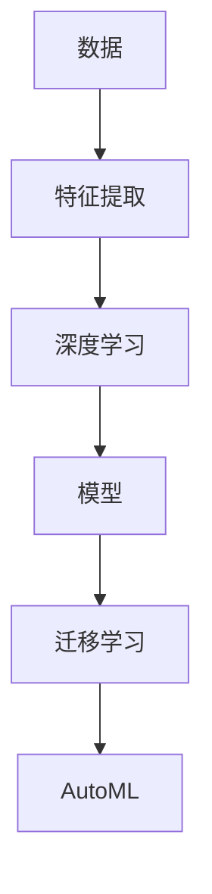

                 

# 软件 2.0 的哲学思考：人工智能的本质

软件 2.0 的提出，标志着软件开发进入了全新的阶段。它不仅是一种技术进步，更是一种思维方式的变革。在软件 2.0 的视角下，人工智能的本质得到了全新的阐释。本文将深入探讨这一领域的哲学思考，力求从更广阔的视角理解人工智能。

## 1. 背景介绍

### 1.1 软件 1.0 与软件 2.0

软件 1.0 时代，程序员通过编写代码，将需求转化为机器可执行的程序。这是一种“由内向外”的思维方式，即从已知的算法和数据结构出发，逐步实现功能。软件 1.0 强调的是编程技能和对技术的精通。

软件 2.0 则是一种“由外向内”的思维方式，它强调理解和建模现实世界。在软件 2.0 中，软件不是对现有技术的应用，而是对现实问题的解决方案。它通过数据驱动、机器学习等技术，自动构建出满足需求的模型，提供创新的解决方案。

### 1.2 人工智能的本质

人工智能的本质是什么？在软件 2.0 的视角下，人工智能不仅仅是算法和计算，而是基于数据的知识建模。它通过大量数据训练模型，自动获取数据中的模式和规律，生成可应用于新情境的输出。

在本文中，我们将深入探讨这一本质，并探讨其对软件开发的影响。

## 2. 核心概念与联系

### 2.1 核心概念概述

- **数据驱动**：人工智能的核心是数据驱动。模型通过大量数据学习，自动发现数据中的模式和规律，生成输出。

- **模型建模**：模型是知识建模的一种方式。它通过对数据进行抽象，提炼出有意义的特征和关系，生成可应用于新情境的预测或决策。

- **深度学习**：深度学习是一种基于神经网络的技术，通过多层次的特征提取和转换，自动发现数据中的复杂模式和规律。

- **迁移学习**：迁移学习通过在多个任务间共享知识，提升模型在新情境下的泛化能力。

- **自动机器学习（AutoML）**：AutoML 通过自动化寻找和优化模型，降低人工干预的复杂度，提高模型构建效率。

### 2.2 概念间的关系

数据驱动和模型建模是人工智能的两大核心。深度学习和迁移学习是实现模型建模的技术手段。AutoML 则进一步降低了模型建模的技术门槛，让更多的人可以参与其中。

这些概念之间的联系，可以通过以下 Mermaid 流程图来展示：



### 2.3 核心概念的整体架构

在人工智能的实践中，这些核心概念构成了完整的知识建模框架。数据通过特征提取，转化为可供模型学习的特征向量。深度学习模型通过多层次的特征提取和转换，自动发现数据中的模式和规律，生成可应用于新情境的输出。迁移学习通过在不同任务间共享知识，提升模型在新情境下的泛化能力。AutoML 则进一步降低了模型建模的技术门槛，让更多的人可以参与其中。

## 3. 核心算法原理 & 具体操作步骤

### 3.1 算法原理概述

人工智能的算法原理可以分为两大部分：前向传播和反向传播。前向传播是通过模型对输入数据进行特征提取和转换，生成输出；反向传播则是对输出结果进行误差评估，反向调整模型参数，以降低误差。

在深度学习中，前向传播和反向传播是通过神经网络实现的。神经网络由多个层次组成，每个层次包含多个神经元。每个神经元接收多个输入，通过激活函数计算输出。多个神经元组成一个神经层，多个神经层组成一个神经网络。

### 3.2 算法步骤详解

人工智能的算法步骤可以概括为以下几个步骤：

1. **数据准备**：收集和预处理数据，生成训练集和测试集。

2. **模型选择**：选择适当的模型，如神经网络、决策树、支持向量机等。

3. **模型训练**：使用训练集对模型进行训练，自动调整模型参数，以最小化误差。

4. **模型评估**：使用测试集对模型进行评估，验证其在新情境下的泛化能力。

5. **模型优化**：通过正则化、dropout、学习率衰减等技术，优化模型性能。

6. **模型部署**：将训练好的模型部署到生产环境中，实现自动化的输出。

### 3.3 算法优缺点

人工智能的算法具有以下优点：

- **自动化**：自动化模型训练和优化，降低了人工干预的复杂度。
- **泛化能力强**：通过迁移学习和AutoML，模型在新情境下的泛化能力更强。
- **高效性**：利用深度学习的多层次特征提取能力，模型能够自动发现数据中的复杂模式和规律。

同时，人工智能的算法也存在一些缺点：

- **数据依赖**：模型的性能高度依赖于训练数据的质量和数量。
- **模型黑盒**：深度学习模型通常是黑盒，难以解释其内部工作机制。
- **计算资源消耗大**：大规模深度学习模型的计算资源消耗较大，需要高性能硬件支持。

### 3.4 算法应用领域

人工智能的算法在多个领域得到了广泛应用，包括：

- **自然语言处理**：通过深度学习和迁移学习，自动生成文本、回答问题、进行翻译等。

- **计算机视觉**：通过深度学习和迁移学习，自动进行图像分类、目标检测、图像生成等。

- **推荐系统**：通过深度学习和AutoML，自动构建推荐模型，提高推荐效果。

- **金融风控**：通过深度学习和迁移学习，自动进行风险评估和预测，提高金融决策的准确性。

- **医疗诊断**：通过深度学习和迁移学习，自动进行疾病诊断和治疗方案推荐，提高医疗服务的质量和效率。

## 4. 数学模型和公式 & 详细讲解

### 4.1 数学模型构建

在人工智能中，常见的数学模型包括线性回归、逻辑回归、决策树、支持向量机、神经网络等。

以神经网络为例，其数学模型可以表示为：

$$
y = f(Wx + b)
$$

其中 $y$ 表示输出，$W$ 和 $b$ 表示模型参数，$x$ 表示输入。

### 4.2 公式推导过程

以神经网络为例，其前向传播过程可以表示为：

$$
h_1 = \sigma(W_1 x + b_1)
$$
$$
h_2 = \sigma(W_2 h_1 + b_2)
$$
$$
\ldots
$$
$$
h_k = \sigma(W_k h_{k-1} + b_k)
$$
$$
y = f(W_k h_{k-1} + b_k)
$$

其中 $\sigma$ 表示激活函数，$f$ 表示输出函数，$h_k$ 表示中间层输出。

### 4.3 案例分析与讲解

以手写数字识别为例，可以使用卷积神经网络（CNN）进行建模。CNN通过卷积层、池化层、全连接层等结构，自动提取图像中的特征，生成手写数字的输出。

## 5. 项目实践：代码实例和详细解释说明

### 5.1 开发环境搭建

在实践中，可以使用 TensorFlow 或 PyTorch 等深度学习框架进行模型构建和训练。以下以 TensorFlow 为例，介绍开发环境的搭建过程：

1. 安装 TensorFlow：
   ```
   pip install tensorflow
   ```

2. 创建 Python 环境：
   ```
   python -m venv tf_env
   source tf_env/bin/activate
   ```

3. 安装相关依赖：
   ```
   pip install numpy pandas scikit-learn
   ```

### 5.2 源代码详细实现

以下是一个简单的手写数字识别代码实现，展示了如何使用 TensorFlow 构建卷积神经网络进行图像分类：

```python
import tensorflow as tf

# 定义模型结构
model = tf.keras.models.Sequential([
  tf.keras.layers.Conv2D(32, (3, 3), activation='relu', input_shape=(28, 28, 1)),
  tf.keras.layers.MaxPooling2D((2, 2)),
  tf.keras.layers.Flatten(),
  tf.keras.layers.Dense(10, activation='softmax')
])

# 编译模型
model.compile(optimizer='adam',
              loss='sparse_categorical_crossentropy',
              metrics=['accuracy'])

# 加载数据集
mnist = tf.keras.datasets.mnist
(x_train, y_train), (x_test, y_test) = mnist.load_data()
x_train, x_test = x_train / 255.0, x_test / 255.0

# 训练模型
model.fit(x_train, y_train, epochs=5, validation_data=(x_test, y_test))

# 评估模型
model.evaluate(x_test, y_test)
```

### 5.3 代码解读与分析

上述代码展示了使用 TensorFlow 构建卷积神经网络进行手写数字识别的过程。

- `tf.keras.layers.Conv2D` 表示卷积层，用于提取图像特征。
- `tf.keras.layers.MaxPooling2D` 表示池化层，用于减小特征图尺寸。
- `tf.keras.layers.Flatten` 表示展平层，用于将特征图转换为向量。
- `tf.keras.layers.Dense` 表示全连接层，用于生成最终输出。

在训练模型时，使用 `model.compile` 方法进行模型编译，指定优化器、损失函数和评估指标。使用 `model.fit` 方法进行模型训练，指定训练集和验证集。最后使用 `model.evaluate` 方法评估模型性能。

## 6. 实际应用场景

### 6.1 医疗影像诊断

人工智能在医疗影像诊断中的应用非常广泛。通过深度学习模型，可以自动分析医疗影像，生成诊断结果。

例如，可以使用卷积神经网络（CNN）对医学影像进行分类。模型通过自动学习医学影像中的特征，生成相应的分类结果。

### 6.2 金融风控

人工智能在金融风控中的应用也非常广泛。通过深度学习模型，可以自动分析用户的交易记录和行为，生成信用评估结果。

例如，可以使用循环神经网络（RNN）对用户的交易记录进行分析，生成信用评分。模型通过自动学习用户的交易行为模式，生成相应的信用评估结果。

### 6.3 自然语言处理

人工智能在自然语言处理中的应用也非常广泛。通过深度学习模型，可以自动分析文本，生成文本分类、情感分析、问答等结果。

例如，可以使用循环神经网络（RNN）对文本进行情感分析。模型通过自动学习文本中的情感模式，生成相应的情感分析结果。

## 7. 工具和资源推荐

### 7.1 学习资源推荐

1. 《深度学习》：Ian Goodfellow 著，详细介绍了深度学习的基本概念和算法原理。

2. 《TensorFlow 实战》：Manning 著，介绍了 TensorFlow 的基本使用方法和常见应用场景。

3. 《PyTorch 实战》：Szagoruyko 著，介绍了 PyTorch 的基本使用方法和常见应用场景。

4. Coursera 深度学习课程：由斯坦福大学、吴恩达教授等名师主讲，系统介绍了深度学习的基本概念和算法原理。

5. GitHub 开源项目：GitHub 上有很多优秀的深度学习开源项目，值得学习和贡献。

### 7.2 开发工具推荐

1. TensorFlow：由 Google 开发，功能强大，支持多种深度学习模型。

2. PyTorch：由 Facebook 开发，易用性好，支持动态计算图。

3. Keras：基于 TensorFlow 和 PyTorch 开发，易用性好，适合快速开发和实验。

4. Jupyter Notebook：轻量级数据科学工作环境，支持 Python 代码的交互式执行。

5. GitHub：代码托管平台，支持版本控制和协作开发。

### 7.3 相关论文推荐

1. "Deep Residual Learning for Image Recognition"：He 等人，提出了残差网络，提高了深度神经网络的训练效率和性能。

2. "Attention is All You Need"：Vaswani 等人，提出了 Transformer 模型，提高了自然语言处理的性能。

3. "ImageNet Classification with Deep Convolutional Neural Networks"：Krizhevsky 等人，提出了深度卷积神经网络，提高了图像分类的性能。

4. "Human Image-Painting with Deep Neural Networks"：Razavian 等人，提出了基于深度学习的图像生成技术。

5. "Natural Language Processing (almost) from Scratch"：Jurafsky 等人，详细介绍了自然语言处理的基本概念和算法原理。

## 8. 总结：未来发展趋势与挑战

### 8.1 总结

本文系统介绍了软件 2.0 的哲学思考，探讨了人工智能的本质。在软件 2.0 的视角下，人工智能的本质是数据驱动的知识建模，通过深度学习和迁移学习，自动构建出满足需求的模型。这一理念不仅改变了软件开发的方式，也为人工智能技术的发展提供了新的方向。

### 8.2 未来发展趋势

未来，人工智能的发展趋势包括以下几个方面：

1. **自动化和智能化**：人工智能将进一步自动化，智能化的程度将更高。

2. **多模态融合**：人工智能将能够处理多模态数据，如图像、语音、文本等，实现多模态融合。

3. **自适应学习**：人工智能将具备自适应学习的能力，能够根据新数据和新任务动态调整模型参数。

4. **跨领域应用**：人工智能将广泛应用于多个领域，如医疗、金融、教育等。

5. **人机协同**：人工智能将与人机协同工作，提升人类的决策和创新能力。

### 8.3 面临的挑战

尽管人工智能取得了巨大的进展，但仍然面临许多挑战：

1. **数据隐私**：人工智能模型的训练需要大量的数据，如何保护数据隐私是一个重要问题。

2. **模型可解释性**：深度学习模型通常是黑盒，难以解释其内部工作机制，这对某些领域的应用是一个挑战。

3. **计算资源消耗**：大规模深度学习模型的计算资源消耗较大，如何降低计算成本是一个重要问题。

4. **模型泛化能力**：人工智能模型在新情境下的泛化能力有限，如何提升泛化能力是一个重要问题。

5. **伦理和法律**：人工智能的应用涉及伦理和法律问题，如何确保其应用符合伦理和法律要求是一个重要问题。

### 8.4 研究展望

未来，人工智能的研究展望包括以下几个方面：

1. **跨学科研究**：人工智能与多个学科的交叉融合，将带来更多的创新。

2. **人机协同研究**：研究人机协同的工作机制，提升人类的决策和创新能力。

3. **数据隐私保护**：研究如何保护数据隐私，确保人工智能的应用符合伦理和法律要求。

4. **模型可解释性**：研究如何提高模型的可解释性，让更多的人能够理解和应用人工智能。

5. **自动化和智能化**：研究如何自动化和智能化人工智能，提升其应用效率和效果。

## 9. 附录：常见问题与解答

### Q1: 什么是软件 2.0？

**A:** 软件 2.0 是一种基于数据的知识建模，通过深度学习和迁移学习，自动构建出满足需求的模型，实现智能化的解决方案。

### Q2: 如何理解人工智能的本质？

**A:** 人工智能的本质是数据驱动的知识建模，通过深度学习和迁移学习，自动发现数据中的模式和规律，生成可应用于新情境的输出。

### Q3: 如何选择合适的深度学习模型？

**A:** 选择合适的深度学习模型需要考虑任务的特性和数据的性质。例如，卷积神经网络（CNN）适合图像分类任务，循环神经网络（RNN）适合序列任务。

### Q4: 人工智能的优点和缺点是什么？

**A:** 人工智能的优点是自动化、泛化能力强、高效性；缺点是数据依赖、模型黑盒、计算资源消耗大。

### Q5: 人工智能的应用场景有哪些？

**A:** 人工智能在多个领域得到了广泛应用，如医疗影像诊断、金融风控、自然语言处理等。

---

作者：禅与计算机程序设计艺术 / Zen and the Art of Computer Programming

