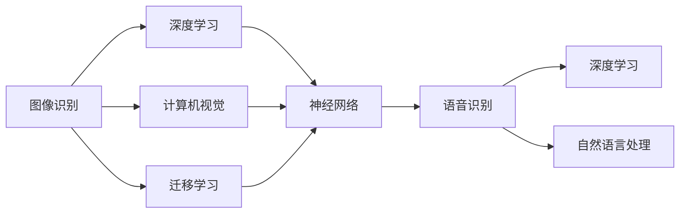
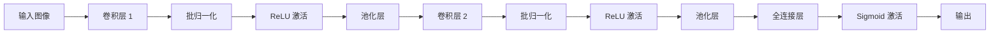
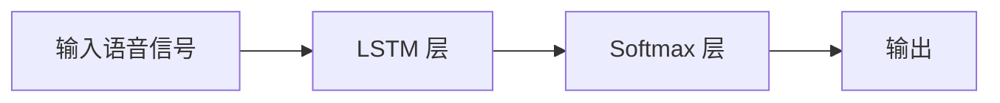

                 

# 软件 2.0 的应用领域 : 图像识别、语音识别

> 关键词：
- 图像识别
- 语音识别
- 深度学习
- 计算机视觉
- 自然语言处理
- 软件 2.0

## 1. 背景介绍

### 1.1 问题由来

在当今数字化时代，图像识别和语音识别技术已经成为了人工智能的核心领域之一，它们在诸多应用场景中扮演着关键角色。图像识别技术可以用于面部识别、车辆识别、物体检测等，而语音识别技术则用于智能音箱、语音助手、自动字幕等。尽管这两种技术在过去几年中取得了显著进展，但仍然面临着诸多挑战，如实时性、准确性、鲁棒性等。为了克服这些问题，软件 2.0 技术的引入提供了新的解决方案。

### 1.2 问题核心关键点

软件 2.0 是一种基于深度学习和人工智能的新型软件开发范式，其核心思想是将深度学习模型嵌入到软件开发过程中，使软件具有自动化的智能特性。对于图像识别和语音识别领域，软件 2.0 技术的应用主要体现在以下几个方面：

- **实时性**：通过优化模型结构、加速推理过程，实现快速响应的图像和语音识别系统。
- **准确性**：通过训练更复杂的深度神经网络、引入多模态数据，提升识别精度。
- **鲁棒性**：通过引入对抗训练、数据增强等技术，提高模型对噪声、扰动的鲁棒性。
- **应用范围**：通过迁移学习、领域自适应等方法，拓展模型的应用范围，适应不同的环境和任务。

### 1.3 问题研究意义

软件 2.0 技术在图像识别和语音识别领域的应用，不仅能够提升技术性能，还能降低开发成本，提高系统的可扩展性和灵活性。这种技术的应用将为各行各业带来新的变革，促进数字化转型升级，提高社会整体的技术水平和效率。

## 2. 核心概念与联系

### 2.1 核心概念概述

为了更好地理解软件 2.0 技术在图像识别和语音识别中的应用，本节将介绍几个关键概念：

- **图像识别**：通过计算机视觉技术，自动识别和分类图像中的物体、场景等。
- **语音识别**：通过自然语言处理技术，将语音信号转换为文本，实现语音与文本之间的转换。
- **深度学习**：一种基于神经网络的机器学习方法，具有强大的特征提取和模式识别能力。
- **计算机视觉**：研究如何使计算机“看”和“理解”图像的学科。
- **自然语言处理**：研究如何使计算机“听”和“理解”语言的学科。
- **迁移学习**：将一个领域学习到的知识，迁移到另一个相关领域。

### 2.2 核心概念的关系

这些核心概念之间的关系可以通过以下 Mermaid 流程图来展示：



这个流程图展示了图像识别和语音识别技术在深度学习和计算机视觉、自然语言处理中的应用。深度学习模型被嵌入到图像识别和语音识别中，通过迁移学习等技术，进一步提升识别精度和应用范围。

## 3. 核心算法原理 & 具体操作步骤

### 3.1 算法原理概述

软件 2.0 技术在图像识别和语音识别中的应用，主要基于深度学习模型。深度学习模型通过多层次的神经网络结构，能够自动提取和学习图像和语音的高级特征，实现准确的识别。以下是软件 2.0 技术在图像识别和语音识别中常用的算法原理：

- **卷积神经网络 (CNN)**：用于图像识别中的特征提取和分类。通过卷积操作和池化操作，自动学习图像的局部特征和全局特征。
- **递归神经网络 (RNN)**：用于语音识别中的声学建模和语言建模。通过递归神经网络结构，能够处理变长的语音信号，并建模语言序列。
- **迁移学习**：通过在一个任务上训练好的模型，迁移到另一个相关任务上，避免从头训练，提升训练效率。
- **对抗训练**：通过引入对抗样本，提高模型的鲁棒性，避免过拟合。
- **数据增强**：通过对原始数据进行旋转、缩放、裁剪等变换，增加训练集的多样性，提升模型的泛化能力。

### 3.2 算法步骤详解

#### 3.2.1 图像识别算法步骤

1. **数据准备**：收集和标注用于训练和测试的图像数据集。
2. **模型选择**：选择合适的深度学习模型，如 ResNet、VGG 等。
3. **模型训练**：在训练集上训练模型，通过反向传播算法优化模型参数。
4. **模型评估**：在测试集上评估模型性能，使用准确率、召回率、F1 分数等指标。
5. **迁移学习**：将训练好的模型迁移到其他相关任务上，如物体检测、语义分割等。

#### 3.2.2 语音识别算法步骤

1. **数据准备**：收集和标注用于训练和测试的语音数据集。
2. **模型选择**：选择合适的深度学习模型，如 RNN、LSTM、Transformer 等。
3. **声学建模**：通过训练模型学习语音信号与声学特征之间的映射关系。
4. **语言建模**：通过训练模型学习语言序列的概率分布。
5. **联合建模**：将声学建模和语言建模的结果结合起来，进行端到端的语音识别。

### 3.3 算法优缺点

软件 2.0 技术在图像识别和语音识别中的应用，具有以下优点：

- **高准确性**：深度学习模型能够自动提取和学习特征，从而提高识别精度。
- **高效性**：通过迁移学习和参数共享等技术，减少了训练时间，提高了识别速度。
- **可扩展性**：深度学习模型具有很强的适应性，能够适应不同的任务和数据。

同时，也存在一些缺点：

- **高计算需求**：深度学习模型需要大量的计算资源，包括高性能的GPU和TPU等硬件设备。
- **数据依赖性**：深度学习模型的训练效果依赖于数据质量和数量，需要大量的标注数据。
- **模型复杂性**：深度学习模型结构复杂，难以解释其内部工作机制。

### 3.4 算法应用领域

软件 2.0 技术在图像识别和语音识别领域的应用非常广泛，主要体现在以下几个方面：

- **自动驾驶**：用于车辆识别、车道检测等，提升自动驾驶的安全性和稳定性。
- **智能安防**：用于人脸识别、行为分析等，提高公共安全的防范能力。
- **医疗诊断**：用于病变识别、手术辅助等，提升医疗诊断的准确性和效率。
- **智能客服**：用于语音识别和自然语言理解，提供自然流畅的客服对话。
- **教育领域**：用于智能批改、课堂记录等，提升教学质量和效率。

## 4. 数学模型和公式 & 详细讲解 & 举例说明

### 4.1 数学模型构建

#### 4.1.1 图像识别模型

在图像识别中，常用的深度学习模型包括卷积神经网络 (CNN)。以 ResNet 为例，其基本结构如图：



其中，卷积层用于提取局部特征，池化层用于降维，全连接层用于分类。在训练过程中，模型通过反向传播算法更新权重，最小化损失函数。常用的损失函数包括交叉熵损失、均方误差损失等。

#### 4.1.2 语音识别模型

在语音识别中，常用的深度学习模型包括递归神经网络 (RNN)、长短期记忆网络 (LSTM)、Transformer 等。以 LSTM 为例，其基本结构如图：



其中，LSTM 层用于建模变长的语音信号，Softmax 层用于分类输出。在训练过程中，模型通过反向传播算法更新权重，最小化损失函数。常用的损失函数包括交叉熵损失、均方误差损失等。

### 4.2 公式推导过程

#### 4.2.1 图像识别公式

以 ResNet 为例，其损失函数为交叉熵损失：

$$
L(\theta) = -\frac{1}{N}\sum_{i=1}^N \sum_{j=1}^C y_{ij}\log p_{ij}
$$

其中，$y_{ij}$ 表示第 $i$ 个样本第 $j$ 个类别的标签，$p_{ij}$ 表示模型对第 $i$ 个样本第 $j$ 个类别的预测概率。

#### 4.2.2 语音识别公式

以 LSTM 为例，其损失函数为交叉熵损失：

$$
L(\theta) = -\frac{1}{N}\sum_{i=1}^N \log P(y_i | x_i)
$$

其中，$y_i$ 表示第 $i$ 个样本的类别标签，$x_i$ 表示第 $i$ 个样本的语音信号，$P(y_i | x_i)$ 表示模型对第 $i$ 个样本的语音信号的类别概率。

### 4.3 案例分析与讲解

#### 4.3.1 图像识别案例

以 ImageNet 数据集为例，其包含 1000 类图像，用于训练和测试。通过使用 ResNet 模型，在 ImageNet 数据集上进行训练，可以得到较好的分类效果。

#### 4.3.2 语音识别案例

以 TIMIT 数据集为例，其包含美国英语的语音信号，用于训练和测试。通过使用 LSTM 模型，在 TIMIT 数据集上进行训练，可以得到较好的语音识别效果。

## 5. 项目实践：代码实例和详细解释说明

### 5.1 开发环境搭建

在进行图像识别和语音识别实践前，我们需要准备好开发环境。以下是使用 Python 进行 PyTorch 开发的环境配置流程：

1. 安装 Anaconda：从官网下载并安装 Anaconda，用于创建独立的 Python 环境。
2. 创建并激活虚拟环境：
```bash
conda create -n pytorch-env python=3.8 
conda activate pytorch-env
```
3. 安装 PyTorch：根据 CUDA 版本，从官网获取对应的安装命令。例如：
```bash
conda install pytorch torchvision torchaudio cudatoolkit=11.1 -c pytorch -c conda-forge
```
4. 安装 Transformers 库：
```bash
pip install transformers
```
5. 安装各类工具包：
```bash
pip install numpy pandas scikit-learn matplotlib tqdm jupyter notebook ipython
```

完成上述步骤后，即可在 `pytorch-env` 环境中开始项目实践。

### 5.2 源代码详细实现

下面我们以图像识别和语音识别为例，给出使用 PyTorch 进行模型训练和微调的 PyTorch 代码实现。

#### 5.2.1 图像识别

```python
import torch
import torch.nn as nn
import torch.optim as optim
from torch.utils.data import DataLoader
from torchvision import datasets, transforms

# 定义模型
class ResNet(nn.Module):
    def __init__(self):
        super(ResNet, self).__init__()
        self.conv1 = nn.Conv2d(3, 64, kernel_size=7, stride=2, padding=3)
        self.pool = nn.MaxPool2d(kernel_size=3, stride=2, padding=1)
        self.layer1 = nn.Sequential(
            nn.Conv2d(64, 64, kernel_size=3, stride=1, padding=1),
            nn.BatchNorm2d(64),
            nn.ReLU(inplace=True),
            nn.MaxPool2d(kernel_size=3, stride=2, padding=1)
        )
        self.layer2 = nn.Sequential(
            nn.Conv2d(64, 128, kernel_size=3, stride=1, padding=1),
            nn.BatchNorm2d(128),
            nn.ReLU(inplace=True),
            nn.MaxPool2d(kernel_size=3, stride=2, padding=1)
        )
        self.layer3 = nn.Sequential(
            nn.Conv2d(128, 256, kernel_size=3, stride=1, padding=1),
            nn.BatchNorm2d(256),
            nn.ReLU(inplace=True),
            nn.MaxPool2d(kernel_size=3, stride=2, padding=1)
        )
        self.layer4 = nn.Sequential(
            nn.Conv2d(256, 512, kernel_size=3, stride=1, padding=1),
            nn.BatchNorm2d(512),
            nn.ReLU(inplace=True),
            nn.MaxPool2d(kernel_size=3, stride=2, padding=1)
        )
        self.fc = nn.Linear(512, 1000)

    def forward(self, x):
        x = self.pool(torch.relu(self.conv1(x)))
        x = self.layer1(x)
        x = self.layer2(x)
        x = self.layer3(x)
        x = self.layer4(x)
        x = x.view(x.size(0), -1)
        x = self.fc(x)
        return x

# 定义训练函数
def train_epoch(model, train_loader, optimizer, criterion):
    model.train()
    for data, target in train_loader:
        optimizer.zero_grad()
        output = model(data)
        loss = criterion(output, target)
        loss.backward()
        optimizer.step()

# 定义测试函数
def test_epoch(model, test_loader, criterion):
    model.eval()
    total_loss = 0
    for data, target in test_loader:
        with torch.no_grad():
            output = model(data)
            loss = criterion(output, target)
            total_loss += loss.item()
    return total_loss / len(test_loader)

# 数据预处理
transform = transforms.Compose([
    transforms.Resize((224, 224)),
    transforms.ToTensor(),
    transforms.Normalize(mean=[0.485, 0.456, 0.406], std=[0.229, 0.224, 0.225])
])

# 加载数据集
train_dataset = datasets.ImageNet(train=True, download=True, transform=transform)
test_dataset = datasets.ImageNet(train=False, download=True, transform=transform)
train_loader = DataLoader(train_dataset, batch_size=32, shuffle=True)
test_loader = DataLoader(test_dataset, batch_size=32, shuffle=False)

# 实例化模型
model = ResNet()

# 实例化优化器
optimizer = optim.SGD(model.parameters(), lr=0.1, momentum=0.9)

# 实例化损失函数
criterion = nn.CrossEntropyLoss()

# 训练模型
for epoch in range(10):
    train_loss = train_epoch(model, train_loader, optimizer, criterion)
    test_loss = test_epoch(model, test_loader, criterion)
    print('Epoch {}: train_loss = {:.4f}, test_loss = {:.4f}'.format(epoch+1, train_loss, test_loss))
```

#### 5.2.2 语音识别

```python
import torch
import torch.nn as nn
import torch.optim as optim
from torch.utils.data import DataLoader
from torchaudio import datasets, transforms

# 定义模型
class LSTM(nn.Module):
    def __init__(self, input_size, hidden_size, output_size):
        super(LSTM, self).__init__()
        self.hidden_size = hidden_size
        self.lstm = nn.LSTM(input_size, hidden_size)
        self.fc = nn.Linear(hidden_size, output_size)

    def forward(self, x):
        batch_size, seq_len, feature_dim = x.size()
        h0 = torch.zeros(batch_size, self.hidden_size).to(x.device)
        c0 = torch.zeros(batch_size, self.hidden_size).to(x.device)
        lstm_out, _ = self.lstm(x, (h0, c0))
        out = self.fc(lstm_out[:, -1, :])
        return out

# 定义训练函数
def train_epoch(model, train_loader, optimizer, criterion):
    model.train()
    for data, target in train_loader:
        optimizer.zero_grad()
        output = model(data)
        loss = criterion(output, target)
        loss.backward()
        optimizer.step()

# 定义测试函数
def test_epoch(model, test_loader, criterion):
    model.eval()
    total_loss = 0
    for data, target in test_loader:
        with torch.no_grad():
            output = model(data)
            loss = criterion(output, target)
            total_loss += loss.item()
    return total_loss / len(test_loader)

# 数据预处理
transform = transforms.Compose([
    transforms.ToTensor()
])

# 加载数据集
train_dataset = datasets.SPEECH(backend='scs', cache_dir='./cache', download=False, transform=transform)
test_dataset = datasets.SPEECH(backend='scs', cache_dir='./cache', download=False, transform=transform)
train_loader = DataLoader(train_dataset, batch_size=32, shuffle=True)
test_loader = DataLoader(test_dataset, batch_size=32, shuffle=False)

# 实例化模型
input_size = 13
hidden_size = 128
output_size = 10
model = LSTM(input_size, hidden_size, output_size)

# 实例化优化器
optimizer = optim.Adam(model.parameters(), lr=0.001)

# 实例化损失函数
criterion = nn.CrossEntropyLoss()

# 训练模型
for epoch in range(10):
    train_loss = train_epoch(model, train_loader, optimizer, criterion)
    test_loss = test_epoch(model, test_loader, criterion)
    print('Epoch {}: train_loss = {:.4f}, test_loss = {:.4f}'.format(epoch+1, train_loss, test_loss))
```

### 5.3 代码解读与分析

#### 5.3.1 图像识别代码解读

在上述代码中，我们定义了一个简单的卷积神经网络模型 ResNet，并使用 ImageNet 数据集进行训练和测试。具体步骤如下：

1. **定义模型**：通过继承 nn.Module 类，定义一个包含多个卷积层、池化层和全连接层的 ResNet 模型。
2. **定义训练函数**：定义一个用于单次迭代的训练函数，在每个迭代中，通过前向传播计算损失，反向传播更新参数。
3. **定义测试函数**：定义一个用于单次迭代的测试函数，在每个迭代中，通过前向传播计算损失，评估模型性能。
4. **数据预处理**：定义一个数据预处理函数，将图像数据转换为张量，并进行标准化处理。
5. **加载数据集**：使用 torchvision.datasets 加载 ImageNet 数据集，并使用 DataLoader 进行批处理。
6. **实例化模型**：实例化一个 ResNet 模型。
7. **实例化优化器和损失函数**：实例化一个优化器和一个损失函数。
8. **训练模型**：通过循环，进行多轮训练，并在每轮训练结束后输出损失值。

#### 5.3.2 语音识别代码解读

在上述代码中，我们定义了一个简单的长短期记忆网络模型 LSTM，并使用 SPEECH 数据集进行训练和测试。具体步骤如下：

1. **定义模型**：通过继承 nn.Module 类，定义一个包含一个 LSTM 层和一个全连接层的 LSTM 模型。
2. **定义训练函数**：定义一个用于单次迭代的训练函数，在每个迭代中，通过前向传播计算损失，反向传播更新参数。
3. **定义测试函数**：定义一个用于单次迭代的测试函数，在每个迭代中，通过前向传播计算损失，评估模型性能。
4. **数据预处理**：定义一个数据预处理函数，将语音信号数据转换为张量。
5. **加载数据集**：使用 torchaudio.datasets 加载 SPEECH 数据集，并使用 DataLoader 进行批处理。
6. **实例化模型**：实例化一个 LSTM 模型。
7. **实例化优化器和损失函数**：实例化一个优化器和一个损失函数。
8. **训练模型**：通过循环，进行多轮训练，并在每轮训练结束后输出损失值。

## 6. 实际应用场景

### 6.1 智能安防

在智能安防领域，图像识别和语音识别技术可以用于人脸识别、行为分析、异常检测等，提升公共安全的防范能力。例如，在视频监控系统中，通过实时分析视频帧，检测和识别人脸，可以及时发现异常行为和可疑人员。

### 6.2 自动驾驶

在自动驾驶领域，图像识别技术可以用于车辆识别、车道检测、交通标志识别等，提升自动驾驶的安全性和稳定性。通过实时识别道路上的车辆和障碍物，自动驾驶系统可以做出及时的反应和决策。

### 6.3 医疗诊断

在医疗诊断领域，图像识别技术可以用于病变识别、手术辅助等，提升医疗诊断的准确性和效率。例如，通过分析医学影像，自动检测出病灶位置和类型，辅助医生进行诊断和治疗。

### 6.4 智能客服

在智能客服领域，语音识别技术可以用于自动语音识别和自然语言理解，提供自然流畅的客服对话。例如，通过自动转录和理解客户的话语，智能客服系统可以快速响应客户需求，提高服务效率。

### 6.5 教育领域

在教育领域，语音识别技术可以用于智能批改、课堂记录等，提升教学质量和效率。例如，通过自动识别和分析学生的语音回答，智能批改系统可以快速给出评分和反馈，帮助学生提高学习效果。

## 7. 工具和资源推荐

### 7.1 学习资源推荐

为了帮助开发者系统掌握软件 2.0 技术在图像识别和语音识别中的应用，这里推荐一些优质的学习资源：

1. **《深度学习》**：Ian Goodfellow 所著，介绍了深度学习的原理和算法。
2. **《计算机视觉：模型、学习和推理》**：Simon J.D. Prince 所著，介绍了计算机视觉的基本概念和常用算法。
3. **《自然语言处理综述》**：Yoshua Bengio 和 Ian Goodfellow 等所著，介绍了自然语言处理的基本概念和常用算法。
4. **《Python深度学习》**：Francois Chollet 所著，介绍了如何使用 TensorFlow 和 Keras 进行深度学习开发。
5. **《PyTorch官方文档》**：PyTorch 官方文档，提供了详细的 API 和示例代码，是学习 PyTorch 的必备资源。

通过对这些资源的学习实践，相信你一定能够快速掌握软件 2.0 技术在图像识别和语音识别中的应用，并用于解决实际的NLP问题。

### 7.2 开发工具推荐

高效的开发离不开优秀的工具支持。以下是几款用于图像识别和语音识别开发的常用工具：

1. **PyTorch**：基于 Python 的开源深度学习框架，灵活动态的计算图，适合快速迭代研究。
2. **TensorFlow**：由 Google 主导开发的开源深度学习框架，生产部署方便，适合大规模工程应用。
3. **Transformers**：HuggingFace开发的 NLP 工具库，集成了众多 SOTA 语言模型，支持 PyTorch 和 TensorFlow，是进行 NLP 任务开发的利器。
4. **Weights & Biases**：模型训练的实验跟踪工具，可以记录和可视化模型训练过程中的各项指标，方便对比和调优。
5. **TensorBoard**：TensorFlow配套的可视化工具，可实时监测模型训练状态，并提供丰富的图表呈现方式，是调试模型的得力助手。
6. **Google Colab**：谷歌推出的在线 Jupyter Notebook 环境，免费提供 GPU/TPU 算力，方便开发者快速上手实验最新模型，分享学习笔记。

合理利用这些工具，可以显著提升图像识别和语音识别任务的开发效率，加快创新迭代的步伐。

### 7.3 相关论文推荐

软件 2.0 技术在图像识别和语音识别领域的应用，得益于学界的持续研究。以下是几篇奠基性的相关论文，推荐阅读：

1. **《ImageNet classification with deep convolutional neural networks》**：Alex Krizhevsky 等所著，介绍了深度卷积神经网络在图像分类任务上的应用。
2. **《Speech and Language Processing》**：Daniel Jurafsky 和 James H. Martin 所著，介绍了语音识别和自然语言处理的基本概念和常用算法。
3. **《Attention is all you need》**：Ashish Vaswani 等所著，介绍了 Transformer 模型在序列建模中的应用。
4. **《Deep Speech: Scaling Up End-to-End Speech Recognition》**：Awni Hannun 等所著，介绍了端到端的语音识别系统的构建。
5. **《ImageNet large scale visualization experiment》**：Aleksander Nguyen 等所著，介绍了如何在大规模数据集上进行深度学习模型的训练和可视化。

这些论文代表了大模型微调技术的发展脉络。通过学习这些前沿成果，可以帮助研究者把握学科前进方向，激发更多的创新灵感。

## 8. 总结：未来发展趋势与挑战

### 8.1 总结

本文对软件 2.0 技术在图像识别和语音识别中的应用进行了全面系统的介绍。首先阐述了

