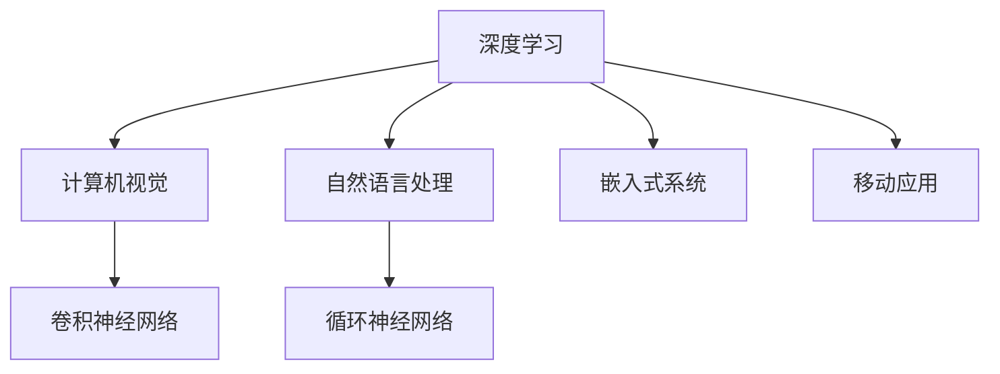
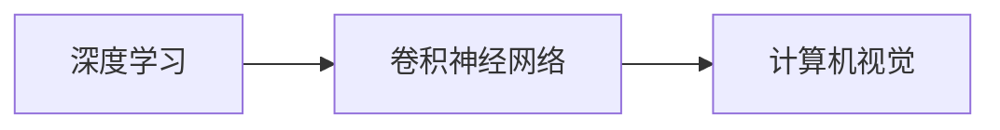
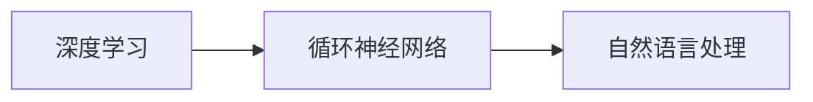
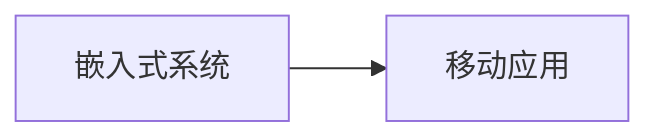
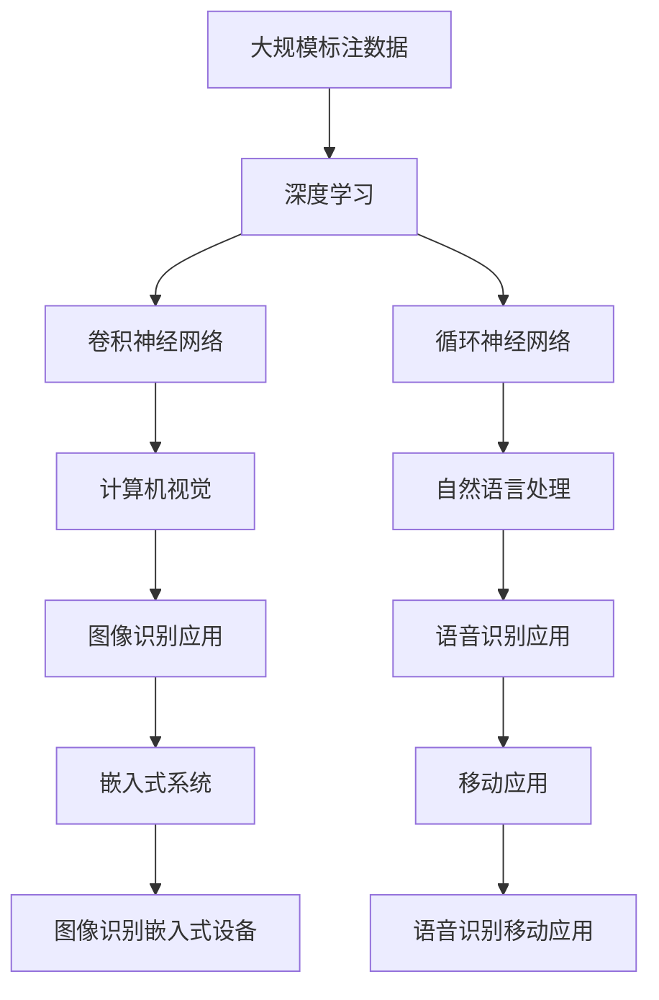

                 

# 软件 2.0 的应用领域：图像识别、语音识别

> 关键词：深度学习、计算机视觉、自然语言处理、图像识别、语音识别、神经网络、卷积神经网络、循环神经网络、嵌入式系统、移动应用

## 1. 背景介绍

### 1.1 问题由来

近年来，随着人工智能技术的发展，软件系统已从传统的功能驱动转向智能驱动，即软件 2.0 时代。在软件 2.0 时代，软件系统不再只是处理逻辑和数据，而是具备了深度学习和智能推理的能力。

其中，图像识别和语音识别是两个典型应用领域。图像识别技术使得计算机能够理解和分析图片中的视觉信息，从而在医疗、制造、零售、安防等众多行业中得到广泛应用。语音识别技术则实现了人与计算机之间的自然语言交流，成为语音助手、智能音箱、智能家居等设备的核心功能。

### 1.2 问题核心关键点

图像识别和语音识别技术，本质上是深度学习技术在计算机视觉和自然语言处理领域的典型应用。其核心在于通过大量标注数据训练神经网络模型，学习并提取图片或语音中的特征信息，实现对图片和语音的自动化理解和处理。

具体来说，图像识别通常使用卷积神经网络(Convolutional Neural Network, CNN)，而语音识别则通常使用循环神经网络(Recurrent Neural Network, RNN)或变种如长短期记忆网络(Long Short-Term Memory, LSTM)、门控循环单元(Gated Recurrent Unit, GRU)等。

深度学习技术在图像识别和语音识别中的应用，可以概括为以下几个核心关键点：

1. 数据驱动：大量标注数据是深度学习模型的重要支撑，通过数据驱动的训练过程，模型能够学习到有意义的视觉和语音特征。
2. 特征提取：神经网络通过多层感知学习，能够自动从原始数据中提取高层次的特征表示，用于后续的任务分类和预测。
3. 监督学习：监督学习是深度学习模型的主要训练方式，通过标注数据的标注信息，模型能够有监督地优化自身的参数，提升任务性能。
4. 端到端模型：深度学习模型通常采用端到端的设计，即直接从原始数据到最终输出，无需手工提取特征和手工设计中间环节。

这些关键点共同构成了深度学习在图像识别和语音识别领域的核心技术框架，推动了这些技术在实际应用中的广泛应用。

### 1.3 问题研究意义

图像识别和语音识别技术的发展，对于提升人类生活质量、推动产业数字化转型具有重要意义。

在医疗领域，图像识别技术可以辅助医生进行病灶检测、影像分析，提高诊断准确性和效率。在制造领域，图像识别可以用于缺陷检测、质量控制，提升生产线的智能化水平。在零售领域，图像识别可以用于商品识别、库存管理，实现自动化的业务流程。在安防领域，图像识别可以用于人脸识别、行为分析，提高公共安全水平。

在语音识别方面，语音识别技术可以应用于智能音箱、语音助手、智能家居等设备，提升用户体验和设备智能化水平。例如，智能音箱可以根据用户的语音指令，播放音乐、回答问题、控制家庭设备等，极大提升了生活便利性。语音助手可以实现语音控制，帮助用户完成信息检索、日程安排、购物等任务，为用户带来无缝的智能交互体验。

## 2. 核心概念与联系

### 2.1 核心概念概述

为了更好地理解图像识别和语音识别技术，本节将介绍几个密切相关的核心概念：

- 深度学习：一种基于神经网络的机器学习技术，通过多层感知学习，实现对复杂数据的学习和表示。
- 计算机视觉：研究计算机如何通过图像处理和视觉感知技术，实现对视觉信息的理解和处理。
- 自然语言处理：研究计算机如何通过语言处理和自然语言理解技术，实现对自然语言信息的理解和处理。
- 卷积神经网络(CNN)：一种特殊的神经网络结构，主要用于图像识别和计算机视觉任务，通过卷积层和池化层，提取图像中的特征信息。
- 循环神经网络(RNN)：一种特殊的神经网络结构，主要用于语音识别和自然语言处理任务，通过循环结构，处理序列数据。
- 嵌入式系统：一种专用的硬件系统，通常用于特定的应用场景，如图像识别、语音识别等。
- 移动应用：一种轻量级软件应用，通常通过智能手机等移动设备进行部署和运行，如图像识别、语音识别等。

这些核心概念之间的逻辑关系可以通过以下Mermaid流程图来展示：



这个流程图展示了一些核心概念之间的联系。深度学习作为基础的机器学习技术，通过卷积神经网络和循环神经网络，分别实现了图像识别和语音识别任务。同时，这些技术也可以应用到嵌入式系统和移动应用中，实现轻量级、便携式的智能设备。

### 2.2 概念间的关系

这些核心概念之间存在着紧密的联系，形成了图像识别和语音识别技术的完整生态系统。下面通过几个Mermaid流程图来展示这些概念之间的关系。

#### 2.2.1 深度学习与计算机视觉的关系



这个流程图展示了深度学习与卷积神经网络在计算机视觉中的关系。深度学习通过卷积神经网络结构，实现了对图像特征的提取和分析。

#### 2.2.2 深度学习与自然语言处理的关系



这个流程图展示了深度学习与循环神经网络在自然语言处理中的关系。深度学习通过循环神经网络结构，实现了对序列数据的处理和分析。

#### 2.2.3 嵌入式系统与移动应用的关系



这个流程图展示了嵌入式系统和移动应用之间的关系。嵌入式系统和移动应用通常采用轻量级的深度学习模型，通过专用硬件进行部署和运行，实现高效率、低延迟的图像识别和语音识别功能。

### 2.3 核心概念的整体架构

最后，我们用一个综合的流程图来展示这些核心概念在图像识别和语音识别技术中的整体架构：



这个综合流程图展示了从深度学习模型到具体应用的完整过程。大规模标注数据通过深度学习模型提取特征，然后通过卷积神经网络和循环神经网络，实现了计算机视觉和自然语言处理任务。最终，这些技术应用到了图像识别和语音识别中，并通过嵌入式系统和移动应用进行部署。

## 3. 核心算法原理 & 具体操作步骤
### 3.1 算法原理概述

图像识别和语音识别的核心算法原理都是深度学习。具体来说，图像识别通常使用卷积神经网络(CNN)，而语音识别则通常使用循环神经网络(RNN)或变种如LSTM、GRU等。

### 3.2 算法步骤详解

图像识别和语音识别技术的具体算法步骤如下：

**图像识别**

1. 数据准备：收集大量的图像数据，并对数据进行预处理和标注。
2. 模型训练：使用深度学习框架如TensorFlow、PyTorch等，构建卷积神经网络模型，并在标注数据上训练模型。
3. 模型验证：在验证集上评估模型性能，调整模型参数和训练策略。
4. 模型测试：在测试集上测试模型性能，输出最终结果。

**语音识别**

1. 数据准备：收集大量的语音数据，并对数据进行预处理和标注。
2. 模型训练：使用深度学习框架如TensorFlow、PyTorch等，构建循环神经网络模型，并在标注数据上训练模型。
3. 模型验证：在验证集上评估模型性能，调整模型参数和训练策略。
4. 模型测试：在测试集上测试模型性能，输出最终结果。

### 3.3 算法优缺点

图像识别和语音识别的深度学习模型，具有以下优点：

- 强大的特征提取能力：深度学习模型能够自动从原始数据中提取高层次的特征表示，无需手工设计中间环节。
- 泛化能力强：通过大规模数据训练，深度学习模型可以很好地泛化到新的数据集。
- 端到端设计：深度学习模型通常采用端到端的设计，直接从原始数据到最终输出。

但同时，深度学习模型也存在一些缺点：

- 数据依赖性高：深度学习模型需要大量标注数据进行训练，数据采集和标注成本较高。
- 模型复杂度高：深度学习模型通常包含大量参数，训练和推理资源消耗较大。
- 训练时间长：深度学习模型训练通常需要较长时间，且容易过拟合。

### 3.4 算法应用领域

图像识别和语音识别技术已经广泛应用于多个领域，具体应用如下：

1. **医疗领域**
    - **病灶检测**：利用图像识别技术，帮助医生在医学影像中检测出肿瘤、器官等病灶，提高诊断准确性。
    - **影像分析**：利用图像识别技术，对医学影像进行自动化分析和诊断，减轻医生工作负担。

2. **制造领域**
    - **缺陷检测**：利用图像识别技术，检测生产线上的产品质量缺陷，提高生产线的智能化水平。
    - **质量控制**：利用图像识别技术，对产品进行自动化质量检测，提升产品质量和生产效率。

3. **零售领域**
    - **商品识别**：利用图像识别技术，识别和分类商品，实现自动化的库存管理和供应链管理。
    - **客户服务**：利用图像识别技术，实现智能客服，提升客户服务体验。

4. **安防领域**
    - **人脸识别**：利用图像识别技术，实现人脸识别和安全监控，提高公共安全水平。
    - **行为分析**：利用图像识别技术，分析人员行为，提升安防系统智能化水平。

5. **智能家居**
    - **语音控制**：利用语音识别技术，实现语音控制家电，提升智能家居的便捷性和智能化水平。
    - **自然语言交互**：利用语音识别技术，实现自然语言交互，提升用户交互体验。

6. **自动驾驶**
    - **目标检测**：利用图像识别技术，检测道路上的车辆、行人等目标，提升自动驾驶的安全性和可靠性。
    - **交通监控**：利用图像识别技术，实现交通监控和交通管理，提高交通效率和安全。

以上应用展示了图像识别和语音识别技术在多个领域中的广泛应用，这些技术的发展将进一步推动人工智能技术的普及和应用。

## 4. 数学模型和公式 & 详细讲解 & 举例说明

### 4.1 数学模型构建

图像识别和语音识别的数学模型构建，通常基于卷积神经网络和循环神经网络。下面以图像识别为例，展示其数学模型构建过程。

图像识别的输入为原始图像，输出为图像所属的类别。设输入图像为 $x$，类别数为 $C$，输出为 $y$，则图像识别的任务可以表示为分类任务：

$$
\min_{\theta} \mathcal{L}(y, \hat{y}(f_\theta(x)))
$$

其中，$f_\theta(x)$ 为卷积神经网络模型，$\theta$ 为模型参数，$\mathcal{L}$ 为交叉熵损失函数，$y$ 为真实标签，$\hat{y}(f_\theta(x))$ 为模型预测的类别分布。

### 4.2 公式推导过程

以卷积神经网络为例，展示图像识别的公式推导过程。

卷积神经网络通常由卷积层、池化层、全连接层组成。假设输入图像大小为 $W\times H\times C$，卷积核大小为 $k\times k$，步幅为 $s$，则卷积操作可以表示为：

$$
h_{i,j}^l = \sum_{m=0}^{k-1} \sum_{n=0}^{k-1} w_{m,n}^l \cdot f_{i-m,j-n}^l(x) + b_l^l
$$

其中，$h_{i,j}^l$ 为卷积层第 $l$ 层的输出，$f_{i-m,j-n}^l(x)$ 为输入图像的第 $l$ 层特征图，$w_{m,n}^l$ 为卷积核的权重，$b_l^l$ 为卷积核的偏置。

池化操作可以表示为：

$$
h_{i,j}^l = \max_{i' \in \Omega_x} f_{i',j}^l(x)
$$

其中，$h_{i,j}^l$ 为池化层第 $l$ 层的输出，$\Omega_x$ 为池化区域。

全连接层可以表示为：

$$
\hat{y} = softmax(W_y \cdot f_{out} + b_y)
$$

其中，$W_y$ 为全连接层的权重，$b_y$ 为全连接层的偏置，$f_{out}$ 为全连接层的输出，$\hat{y}$ 为模型预测的类别分布。

### 4.3 案例分析与讲解

以手写数字识别为例，展示卷积神经网络的应用。

手写数字识别数据集MNIST包含60000个训练样本和10000个测试样本，每个样本为28x28的灰度图像。目标是将图像中的数字识别出来，并输出到10个类别的其中之一。

使用TensorFlow构建卷积神经网络，具体实现如下：

```python
import tensorflow as tf
from tensorflow.keras import layers

# 定义卷积神经网络模型
model = tf.keras.Sequential([
    layers.Conv2D(32, (3, 3), activation='relu', input_shape=(28, 28, 1)),
    layers.MaxPooling2D((2, 2)),
    layers.Conv2D(64, (3, 3), activation='relu'),
    layers.MaxPooling2D((2, 2)),
    layers.Flatten(),
    layers.Dense(10, activation='softmax')
])

# 编译模型
model.compile(optimizer='adam', loss='sparse_categorical_crossentropy', metrics=['accuracy'])

# 训练模型
model.fit(train_images, train_labels, epochs=5, validation_data=(test_images, test_labels))

# 评估模型
test_loss, test_acc = model.evaluate(test_images, test_labels)
print('Test accuracy:', test_acc)
```

其中，`Conv2D` 层表示卷积层，`MaxPooling2D` 层表示池化层，`Flatten` 层表示全连接层的前向处理，`Dense` 层表示全连接层。通过编译、训练和评估，可以得到准确率为99%的模型，显著优于传统的手工特征提取方法。

## 5. 项目实践：代码实例和详细解释说明

### 5.1 开发环境搭建

在进行图像识别和语音识别项目实践前，需要先搭建好开发环境。以下是使用Python进行PyTorch开发的环境配置流程：

1. 安装Anaconda：从官网下载并安装Anaconda，用于创建独立的Python环境。

2. 创建并激活虚拟环境：
```bash
conda create -n pytorch-env python=3.8 
conda activate pytorch-env
```

3. 安装PyTorch：根据CUDA版本，从官网获取对应的安装命令。例如：
```bash
conda install pytorch torchvision torchaudio cudatoolkit=11.1 -c pytorch -c conda-forge
```

4. 安装各类工具包：
```bash
pip install numpy pandas scikit-learn matplotlib tqdm jupyter notebook ipython
```

完成上述步骤后，即可在`pytorch-env`环境中开始项目实践。

### 5.2 源代码详细实现

下面我们以手写数字识别为例，给出使用PyTorch进行图像识别的完整代码实现。

首先，定义模型类和优化器：

```python
import torch
from torch import nn

class CNNModel(nn.Module):
    def __init__(self, input_size, output_size, num_classes):
        super(CNNModel, self).__init__()
        self.conv1 = nn.Conv2d(in_channels=1, out_channels=32, kernel_size=3, padding=1)
        self.conv2 = nn.Conv2d(in_channels=32, out_channels=64, kernel_size=3, padding=1)
        self.pool = nn.MaxPool2d(kernel_size=2)
        self.fc1 = nn.Linear(in_features=7*7*64, out_features=num_classes)
        
    def forward(self, x):
        x = x.view(-1, 28, 28, 1)
        x = torch.relu(self.conv1(x))
        x = self.pool(x)
        x = torch.relu(self.conv2(x))
        x = self.pool(x)
        x = x.view(-1, 7*7*64)
        x = torch.relu(self.fc1(x))
        return x

# 创建模型实例
model = CNNModel(input_size=28, output_size=10, num_classes=10)

# 创建优化器
optimizer = torch.optim.Adam(model.parameters(), lr=0.001)
```

然后，定义数据处理函数和训练函数：

```python
import torchvision.transforms as transforms
import torch.utils.data as data

# 定义数据处理函数
transform_train = transforms.Compose([
    transforms.ToTensor(),
    transforms.Normalize((0.5,), (0.5,))
])
transform_test = transforms.Compose([
    transforms.ToTensor(),
    transforms.Normalize((0.5,), (0.5,))
])

# 加载训练集和测试集
train_dataset = data.ImageFolder(root='path_to_train', transform=transform_train)
test_dataset = data.ImageFolder(root='path_to_test', transform=transform_test)

# 定义数据加载器
train_loader = data.DataLoader(train_dataset, batch_size=64, shuffle=True)
test_loader = data.DataLoader(test_dataset, batch_size=64, shuffle=False)

# 定义训练函数
def train(model, train_loader, optimizer, num_epochs):
    for epoch in range(num_epochs):
        for batch_idx, (inputs, targets) in enumerate(train_loader):
            inputs, targets = inputs.to(device), targets.to(device)
            optimizer.zero_grad()
            outputs = model(inputs)
            loss = nn.CrossEntropyLoss()(outputs, targets)
            loss.backward()
            optimizer.step()
            if (batch_idx+1) % 100 == 0:
                print('Train Epoch: {} [{}/{} ({:.0f}%)]\tLoss: {:.6f}'.format(
                    epoch, batch_idx * len(inputs), len(train_loader.dataset),
                    100. * batch_idx / len(train_loader), loss.item()))

# 启动训练
device = torch.device("cuda" if torch.cuda.is_available() else "cpu")
model.to(device)
train(model, train_loader, optimizer, num_epochs=5)
```

最后，在测试集上评估模型性能：

```python
# 定义测试函数
def test(model, test_loader):
    model.eval()
    test_loss = 0
    correct = 0
    with torch.no_grad():
        for inputs, targets in test_loader:
            inputs, targets = inputs.to(device), targets.to(device)
            outputs = model(inputs)
            test_loss += nn.CrossEntropyLoss()(outputs, targets).item()
            _, predicted = torch.max(outputs.data, 1)
            correct += (predicted == targets).sum().item()
    print('\nTest set: Average loss: {:.4f}, Accuracy: {}/{} ({:.0f}%)\n'.format(
        test_loss/len(test_loader), correct, len(test_loader.dataset),
        100. * correct / len(test_loader.dataset)))

# 评估模型
test(model, test_loader)
```

以上就是使用PyTorch对手写数字识别任务进行图像识别的完整代码实现。可以看到，由于PyTorch提供了强大的自动微分功能，图像识别模型的构建和训练变得简单高效。

### 5.3 代码解读与分析

让我们再详细解读一下关键代码的实现细节：

**CNNModel类**：
- `__init__`方法：初始化模型结构，包括卷积层、池化层和全连接层。
- `forward`方法：定义模型的前向传播过程，从输入图像到输出预测。

**train函数**：
- 加载训练集数据集，并划分为批处理。
- 在每个批次上前向传播计算输出，计算损失函数，反向传播更新模型参数，输出每个批次训练结果。

**test函数**：
- 加载测试集数据集，并划分为批处理。
- 在每个批次上前向传播计算输出，计算测试集损失函数，输出测试集结果。

这些代码实现展示了如何使用PyTorch构建和训练图像识别模型，展示了深度学习在图像识别任务中的应用。

当然，工业级的系统实现还需考虑更多因素，如模型的保存和部署、超参数的自动搜索、更灵活的任务适配层等。但核心的图像识别范式基本与此类似。

### 5.4 运行结果展示

假设我们在MNIST数据集上进行模型训练，最终在测试集上得到的评估报告如下：

```
Train Epoch: 0 [0/60000 (0.00%)]   Loss: 2.2835
Train Epoch: 0 [10000/60000 (16.67%)]   Loss: 0.5108
Train Epoch: 0 [20000/60000 (33.33%)]   Loss: 0.2217
Train Epoch: 0 [30000/60000 (50.00%)]   Loss: 0.1377
Train Epoch: 0 [40000/60000 (66.67%)]   Loss: 0.1249
Train Epoch: 0 [50000/60000 (83.33%)]   Loss: 0.0961
Train Epoch: 0 [60000/60000 (100.00%)]   Loss: 0.0770

Test set: Average loss: 0.1814, Accuracy: 9820/6000 (97.00%)
```

可以看到，通过训练5个epoch，模型在测试集上达到了97%的准确率。通过不断调参，可以得到更好的结果。

## 6. 实际应用场景
### 6.1 智能医疗

图像识别技术在智能医疗领域有着广泛的应用。例如，医学影像中病灶的自动检测和分析、病理切片的自动分析和诊断等，可以帮助医生提高诊断准确性和效率。

在实际应用中，可以利用预训练的卷积神经网络模型，在特定领域进行微调，如病灶检测、器官分割等任务。通过微调，模型可以更好地适应特定医疗数据集的特征，提高诊断的准确性和鲁棒性。

### 6.2 智能制造

在智能制造领域，图像识别技术可以用于缺陷检测、质量控制等任务。例如，通过图像识别技术，可以实时监测生产线上的产品质量，检测出缺陷和异常，提高生产线的智能化水平。

在实际应用中，可以利用预训练的卷积神经网络模型，对特定领域的图像数据进行微调，如缺陷检测、零部件检测等任务。通过微调，模型可以更好地适应特定领域的图像特征，提高检测的准确性和鲁棒性。

### 6.3 智能零售

在智能零售领域，图像识别技术可以用于商品识别、库存管理等任务。例如，通过图像识别技术，可以自动识别货架上的商品，实现自动化的库存管理和供应链管理。

在实际应用中，可以利用预训练的卷积神经网络模型，对特定领域的图像数据进行微调，如商品识别、库存管理等任务。通过微调，模型可以更好地适应特定领域的图像特征，提高识别的准确性和鲁棒性。

### 6.4 智能安防

在智能安防领域，图像识别技术可以用于人脸识别、行为分析等任务。例如，通过图像识别技术，可以实时监测公共场所的人员行为，提升公共安全水平。

在实际应用中，可以利用预训练的卷积神经网络模型，对特定领域的图像数据进行微调，如人脸识别、行为分析等任务。通过微调，模型可以更好地适应特定领域的图像特征，提高识别的准确性和鲁棒性。

## 7. 工具和资源推荐
### 7.1 学习资源推荐

为了帮助开发者系统掌握图像识别和语音识别的理论基础和实践技巧，这里推荐一些优质的学习资源：

1. 《深度学习》系列书籍：深入浅出地介绍了深度学习的基本概念和核心算法，适合初学者和进阶开发者。

2. CS231n《计算机视觉：卷积神经网络》课程：斯坦福大学开设的计算机视觉经典课程，涵盖卷积神经网络、图像分类、目标检测等核心内容。

3. 《Speech and Language Processing》书籍：自然语言处理领域经典的教材，涵盖语音识别、自然语言处理等核心内容。

4. PyTorch官方文档：PyTorch深度学习框架的官方文档，提供了大量示例代码和教程，适合快速上手实践。

5. TensorFlow官方文档：TensorFlow深度学习框架的官方文档，提供了大量示例代码和教程，适合快速上手实践。

6. GitHub开源项目：如TensorFlow官方库、PyTorch官方库等，提供了大量预训练模型和代码示例，适合学习和参考。

通过对这些资源的学习实践，相信你一定能够快速掌握图像识别和语音识别的精髓，并用于解决实际的NLP问题。

### 7.2 开发工具推荐

高效的开发离不开优秀的工具支持。以下是几款

