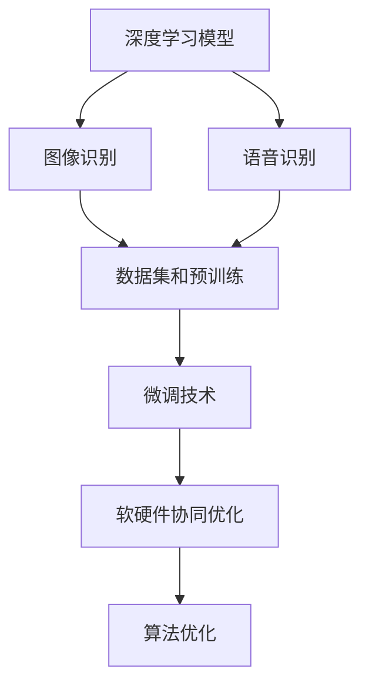
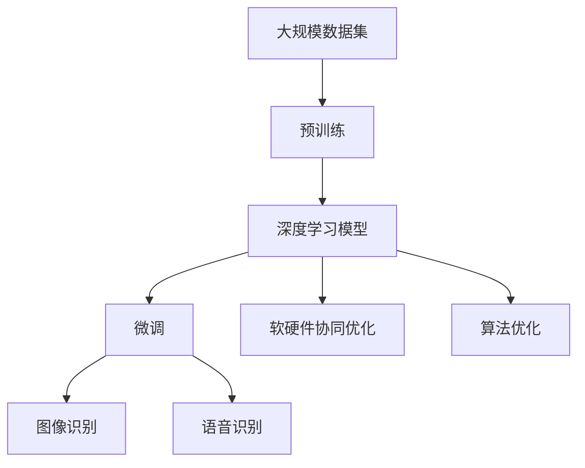

                 

# 软件 2.0 的应用领域：图像识别、语音识别

> 关键词：图像识别, 语音识别, 深度学习, 卷积神经网络, 递归神经网络, 软件 2.0, 自动驾驶, 医疗影像分析, 智能客服, 工业智能

## 1. 背景介绍

### 1.1 问题由来
随着人工智能技术的迅猛发展，尤其是深度学习在图像和语音领域的突破性应用，"软件 2.0"的概念应运而生。"软件 2.0"不仅标志着从规则导向的1.0到数据驱动的2.0的转变，也意味着人工智能技术与实际应用场景的深度融合。特别是在图像识别、语音识别等领域的成功应用，让"软件 2.0"的概念深入人心，成为引领未来技术发展的重要方向。

### 1.2 问题核心关键点
"软件 2.0"的核心在于通过深度学习模型，从数据中学习和提取模式，实现对未知数据的预测和理解。具体到图像识别和语音识别领域，其关键点包括：

1. **深度学习模型架构**：卷积神经网络（CNN）和递归神经网络（RNN）等深度学习架构在图像和语音处理中得到了广泛应用。
2. **数据集和预训练**：大量标注数据的收集和预训练是模型高性能的基础。
3. **微调技术**：通过微调技术，模型可以在特定任务上进一步优化，提升精度。
4. **软硬件协同优化**：硬件加速和软件优化结合，提升模型推理效率。
5. **算法优化**：基于卷积和池化等算法的优化，提升模型性能。

### 1.3 问题研究意义
研究图像识别和语音识别领域的"软件 2.0"技术，对于推动人工智能技术的落地应用，提升人类生活质量，具有重要意义：

1. **提升自动化水平**："软件 2.0"技术可以自动化处理大量图像和语音数据，提高工作效率。
2. **改善用户体验**：通过图像和语音识别，提升用户体验，如智能客服、自动驾驶等。
3. **促进智能决策**：通过深度学习模型，实现对复杂信息的精准处理，辅助决策。
4. **增强安全性**：图像和语音识别技术可以用于安全监控，提升公共安全水平。
5. **推动产业升级**："软件 2.0"技术在工业智能、智慧医疗等领域的应用，推动相关产业的升级转型。

## 2. 核心概念与联系

### 2.1 核心概念概述

为更好地理解"软件 2.0"在图像识别、语音识别领域的应用，本节将介绍几个密切相关的核心概念：

- **深度学习模型**：以卷积神经网络（CNN）和递归神经网络（RNN）为代表的深度学习模型，能够自动从数据中提取特征，实现图像、语音等复杂数据的处理。
- **数据集和预训练**：大型图像和语音数据集（如ImageNet、LibriSpeech等），为模型的预训练提供了丰富的样本。
- **微调技术**：通过在特定任务上微调预训练模型，提升模型在该任务上的性能。
- **软硬件协同优化**：通过GPU、TPU等硬件加速，提升模型推理效率。
- **算法优化**：通过卷积、池化等算法的优化，提升模型性能。

### 2.2 概念间的关系

这些核心概念之间存在着紧密的联系，形成了图像识别、语音识别"软件 2.0"技术的完整生态系统。下面我们通过几个Mermaid流程图来展示这些概念之间的关系。



这个流程图展示了大语言模型的核心概念及其之间的关系：

1. 深度学习模型通过数据集和预训练学习通用特征，为图像识别、语音识别等任务提供基础。
2. 微调技术进一步优化模型在特定任务上的性能。
3. 软硬件协同优化提升模型推理速度。
4. 算法优化增强模型性能。

这些概念共同构成了图像识别、语音识别"软件 2.0"技术的学习和应用框架，使其能够高效处理复杂数据，实现智能化应用。

### 2.3 核心概念的整体架构

最后，我们用一个综合的流程图来展示这些核心概念在大语言模型微调过程中的整体架构：



这个综合流程图展示了从数据预训练到微调，再到图像识别、语音识别"软件 2.0"应用的完整过程。深度学习模型通过预训练获得基础能力，然后通过微调优化特定任务，同时借助软硬件协同和算法优化，提升模型的推理效率和性能。

## 3. 核心算法原理 & 具体操作步骤
### 3.1 算法原理概述

"软件 2.0"在图像识别、语音识别中的应用，本质上是深度学习模型的应用。深度学习模型通过在大规模数据集上进行预训练，学习到复杂的特征表示，然后通过微调进一步适应特定任务。

形式化地，假设预训练模型为 $M_{\theta}$，其中 $\theta$ 为预训练得到的模型参数。给定图像识别任务 $T_I$ 或语音识别任务 $T_S$ 的标注数据集 $D=\{(x_i,y_i)\}_{i=1}^N$，微调的目标是找到新的模型参数 $\hat{\theta}$，使得：

$$
\hat{\theta}=\mathop{\arg\min}_{\theta} \mathcal{L}(M_{\theta},D)
$$

其中 $\mathcal{L}$ 为针对任务 $T$ 设计的损失函数，用于衡量模型预测输出与真实标签之间的差异。常见的损失函数包括交叉熵损失、均方误差损失等。

通过梯度下降等优化算法，微调过程不断更新模型参数 $\theta$，最小化损失函数 $\mathcal{L}$，使得模型输出逼近真实标签。由于 $\theta$ 已经通过预训练获得了较好的初始化，因此即便在微调过程中，模型也能较快收敛到理想的模型参数 $\hat{\theta}$。

### 3.2 算法步骤详解

基于深度学习的图像识别和语音识别"软件 2.0"技术，一般包括以下几个关键步骤：

**Step 1: 准备预训练模型和数据集**
- 选择合适的深度学习模型，如CNN或RNN，作为初始化参数，如VGG、ResNet等。
- 准备图像识别或语音识别的标注数据集，如MNIST、CIFAR-10、LibriSpeech等，划分为训练集、验证集和测试集。一般要求标注数据与预训练数据的分布不要差异过大。

**Step 2: 添加任务适配层**
- 根据任务类型，在预训练模型顶层设计合适的输出层和损失函数。
- 对于图像识别任务，通常在顶层添加卷积层和池化层，输出类别概率分布，并以交叉熵损失函数。
- 对于语音识别任务，通常使用RNN或Transformer模型，输出字符序列，并以交叉熵损失函数。

**Step 3: 设置微调超参数**
- 选择合适的优化算法及其参数，如AdamW、SGD等，设置学习率、批大小、迭代轮数等。
- 设置正则化技术及强度，包括权重衰减、Dropout、Early Stopping等。
- 确定冻结预训练参数的策略，如仅微调顶层，或全部参数都参与微调。

**Step 4: 执行梯度训练**
- 将训练集数据分批次输入模型，前向传播计算损失函数。
- 反向传播计算参数梯度，根据设定的优化算法和学习率更新模型参数。
- 周期性在验证集上评估模型性能，根据性能指标决定是否触发 Early Stopping。
- 重复上述步骤直到满足预设的迭代轮数或 Early Stopping 条件。

**Step 5: 测试和部署**
- 在测试集上评估微调后模型 $M_{\hat{\theta}}$ 的性能，对比微调前后的精度提升。
- 使用微调后的模型对新样本进行推理预测，集成到实际的应用系统中。
- 持续收集新的数据，定期重新微调模型，以适应数据分布的变化。

以上是基于深度学习的图像识别和语音识别"软件 2.0"技术的一般流程。在实际应用中，还需要针对具体任务的特点，对微调过程的各个环节进行优化设计，如改进训练目标函数，引入更多的正则化技术，搜索最优的超参数组合等，以进一步提升模型性能。

### 3.3 算法优缺点

基于深度学习的图像识别和语音识别"软件 2.0"技术具有以下优点：

1. 准确度高。深度学习模型在图像和语音识别任务上取得了SOTA的精度。
2. 适应性强。模型能够很好地适应特定任务，提升任务性能。
3. 通用性好。预训练模型可以在多个任务上进行微调，灵活应用。
4. 自动化程度高。模型训练和推理过程高度自动化，减少人力成本。

但该方法也存在以下局限性：

1. 数据依赖性强。模型性能高度依赖标注数据，获取高质量数据成本较高。
2. 模型复杂度高。深度学习模型参数量庞大，推理速度较慢。
3. 训练成本高。深度学习模型需要大量的计算资源和时间。
4. 泛化能力不足。模型对于新数据泛化能力有限，可能出现过拟合。
5. 可解释性差。深度学习模型被视为"黑盒"，难以解释其内部机制。

尽管存在这些局限性，但就目前而言，深度学习技术仍然是图像识别和语音识别"软件 2.0"技术的主流范式。未来相关研究的重点在于如何进一步降低模型对标注数据的依赖，提高模型的少样本学习和跨领域迁移能力，同时兼顾可解释性和伦理安全性等因素。

### 3.4 算法应用领域

基于深度学习的图像识别和语音识别"软件 2.0"技术，已经在多个领域得到了广泛的应用，例如：

- **自动驾驶**：通过图像识别技术，自动驾驶系统能够实现对周围环境的实时感知和理解，辅助驾驶决策。
- **医疗影像分析**：深度学习模型能够自动分析医学影像，辅助医生诊断，提高诊断效率和准确性。
- **智能客服**：语音识别技术使得机器能够理解用户语音输入，实现自然对话，提升客服效率。
- **工业智能**：深度学习模型在生产制造、质量检测等领域，用于自动化的图像和语音数据处理。
- **智能家居**：语音识别技术使得智能家居系统能够理解和响应用户的语音命令，提升用户体验。

除了上述这些经典应用外，深度学习技术还被创新性地应用到更多场景中，如可控文本生成、智能推荐、自然语言处理等，为图像识别和语音识别"软件 2.0"技术带来了新的突破。随着深度学习技术的不断进步，相信"软件 2.0"技术将在更广阔的应用领域大放异彩。

## 4. 数学模型和公式 & 详细讲解 & 举例说明
### 4.1 数学模型构建

本节将使用数学语言对基于深度学习的图像识别和语音识别"软件 2.0"过程进行更加严格的刻画。

记预训练深度学习模型为 $M_{\theta}$，其中 $\theta$ 为预训练得到的模型参数。假设图像识别任务 $T_I$ 的训练集为 $D_I=\{(x_i,y_i)\}_{i=1}^N, x_i \in \mathcal{X}, y_i \in \{1,2,\ldots,K\}$，其中 $\mathcal{X}$ 为输入空间，$K$ 为类别数。类似地，语音识别任务 $T_S$ 的训练集为 $D_S=\{(x_i,y_i)\}_{i=1}^N, x_i \in \mathcal{X}, y_i \in \{1,2,\ldots,M\}$，其中 $\mathcal{X}$ 为输入空间，$M$ 为字符数。

定义模型 $M_{\theta}$ 在输入 $x$ 上的输出为 $\hat{y}=M_{\theta}(x) \in \{1,2,\ldots,K\}$ 或 $\hat{y}=M_{\theta}(x) \in \{1,2,\ldots,M\}$。

定义模型 $M_{\theta}$ 在输入 $x$ 上的损失函数为 $\ell(M_{\theta}(x),y)$，则在数据集 $D$ 上的经验风险为：

$$
\mathcal{L}(\theta) = \frac{1}{N}\sum_{i=1}^N \ell(M_{\theta}(x_i),y_i)
$$

微调的优化目标是最小化经验风险，即找到最优参数：

$$
\theta^* = \mathop{\arg\min}_{\theta} \mathcal{L}(\theta)
$$

在实践中，我们通常使用基于梯度的优化算法（如AdamW、SGD等）来近似求解上述最优化问题。设 $\eta$ 为学习率，则参数的更新公式为：

$$
\theta \leftarrow \theta - \eta \nabla_{\theta}\mathcal{L}(\theta)
$$

其中 $\nabla_{\theta}\mathcal{L}(\theta)$ 为损失函数对参数 $\theta$ 的梯度，可通过反向传播算法高效计算。

### 4.2 公式推导过程

以下我们以图像分类任务为例，推导交叉熵损失函数及其梯度的计算公式。

假设模型 $M_{\theta}$ 在输入 $x$ 上的输出为 $\hat{y}=M_{\theta}(x) \in \{1,2,\ldots,K\}$，其中 $K$ 为类别数。真实标签 $y \in \{1,2,\ldots,K\}$。则二分类交叉熵损失函数定义为：

$$
\ell(M_{\theta}(x),y) = -y\log \hat{y} + (1-y)\log(1-\hat{y})
$$

将其代入经验风险公式，得：

$$
\mathcal{L}(\theta) = -\frac{1}{N}\sum_{i=1}^N [y_i\log M_{\theta}(x_i)+(1-y_i)\log(1-M_{\theta}(x_i))]
$$

根据链式法则，损失函数对参数 $\theta_k$ 的梯度为：

$$
\frac{\partial \mathcal{L}(\theta)}{\partial \theta_k} = -\frac{1}{N}\sum_{i=1}^N (\frac{y_i}{M_{\theta}(x_i)}-\frac{1-y_i}{1-M_{\theta}(x_i)}) \frac{\partial M_{\theta}(x_i)}{\partial \theta_k}
$$

其中 $\frac{\partial M_{\theta}(x_i)}{\partial \theta_k}$ 可进一步递归展开，利用自动微分技术完成计算。

在得到损失函数的梯度后，即可带入参数更新公式，完成模型的迭代优化。重复上述过程直至收敛，最终得到适应图像识别任务的最优模型参数 $\theta^*$。

## 5. 项目实践：代码实例和详细解释说明
### 5.1 开发环境搭建

在进行图像识别和语音识别"软件 2.0"实践前，我们需要准备好开发环境。以下是使用Python进行TensorFlow开发的环境配置流程：

1. 安装Anaconda：从官网下载并安装Anaconda，用于创建独立的Python环境。

2. 创建并激活虚拟环境：
```bash
conda create -n tf-env python=3.8 
conda activate tf-env
```

3. 安装TensorFlow：根据CUDA版本，从官网获取对应的安装命令。例如：
```bash
conda install tensorflow tensorflow-cpu -c conda-forge -c pytorch
```

4. 安装各类工具包：
```bash
pip install numpy pandas scikit-learn matplotlib tqdm jupyter notebook ipython
```

完成上述步骤后，即可在`tf-env`环境中开始"软件 2.0"实践。

### 5.2 源代码详细实现

这里我们以图像分类任务为例，给出使用TensorFlow对VGG模型进行图像识别微调的PyTorch代码实现。

首先，定义图像分类任务的数据处理函数：

```python
import tensorflow as tf
from tensorflow.keras.preprocessing.image import ImageDataGenerator

def image_data_generator(data_dir, batch_size):
    train_datagen = ImageDataGenerator(rescale=1./255, validation_split=0.2)
    train_generator = train_datagen.flow_from_directory(
        data_dir,
        target_size=(224, 224),
        batch_size=batch_size,
        class_mode='categorical',
        subset='training'
    )
    validation_generator = train_datagen.flow_from_directory(
        data_dir,
        target_size=(224, 224),
        batch_size=batch_size,
        class_mode='categorical',
        subset='validation'
    )
    return train_generator, validation_generator
```

然后，定义模型和优化器：

```python
from tensorflow.keras import models, layers, optimizers

model = models.VGG16(weights='imagenet', include_top=False, input_shape=(224, 224, 3))
for layer in model.layers:
    layer.trainable = False

x = layers.Input(shape=(224, 224, 3))
x = layers.Conv2D(32, 3, activation='relu', padding='same')(x)
x = layers.MaxPooling2D(pool_size=2, strides=2)(x)
x = layers.Conv2D(64, 3, activation='relu', padding='same')(x)
x = layers.MaxPooling2D(pool_size=2, strides=2)(x)
x = layers.Flatten()(x)
x = layers.Dense(512, activation='relu')(x)
x = layers.Dense(num_classes, activation='softmax')(x)

model = models.Model(inputs=x, outputs=x)
optimizer = optimizers.AdamW(learning_rate=2e-5)
```

接着，定义训练和评估函数：

```python
def train_epoch(model, train_generator, validation_generator, batch_size, optimizer):
    model.compile(optimizer=optimizer, loss='categorical_crossentropy', metrics=['accuracy'])
    model.fit(
        train_generator,
        validation_data=validation_generator,
        epochs=10,
        steps_per_epoch=len(train_generator),
        validation_steps=len(validation_generator),
        verbose=1
    )
    return model.evaluate(validation_generator, verbose=0)

def evaluate(model, validation_generator, batch_size):
    model.compile(optimizer='adam', loss='categorical_crossentropy', metrics=['accuracy'])
    loss, acc = model.evaluate(validation_generator, verbose=0)
    return acc
```

最后，启动训练流程并在测试集上评估：

```python
train_generator, validation_generator = image_data_generator('/path/to/dataset', batch_size=32)

for epoch in range(10):
    loss, acc = train_epoch(model, train_generator, validation_generator, batch_size=32, optimizer=optimizer)
    print(f"Epoch {epoch+1}, validation acc: {acc:.3f}")

print(f"Test acc: {evaluate(model, validation_generator, batch_size=32)}")
```

以上就是使用TensorFlow对VGG模型进行图像分类任务微调的完整代码实现。可以看到，得益于TensorFlow的强大封装，我们可以用相对简洁的代码完成VGG模型的加载和微调。

### 5.3 代码解读与分析

让我们再详细解读一下关键代码的实现细节：

**image_data_generator函数**：
- 定义了一个图像数据生成器，将图像数据加载、预处理并生成批次的训练数据和验证数据。

**VGG16模型**：
- 使用了预训练的VGG16模型作为初始化参数，并通过`include_top=False`参数去掉了顶层的全连接层。
- 对模型的所有层进行冻结，只微调顶层。

**train_epoch函数**：
- 将训练生成器和验证生成器作为输入，定义了训练和验证过程。
- 使用AdamW优化器和交叉熵损失函数进行模型训练。
- 在训练过程中，使用验证生成器评估模型性能，决定是否停止训练。

**evaluate函数**：
- 将验证生成器作为输入，定义了模型的评估过程。
- 使用Adam优化器和交叉熵损失函数进行模型评估。

**训练流程**：
- 定义总的epoch数，开始循环迭代
- 每个epoch内，先在训练集上训练，输出验证集上的准确率
- 在测试集上评估微调后的模型

可以看到，TensorFlow配合VGG模型使得图像识别微调的代码实现变得简洁高效。开发者可以将更多精力放在数据处理、模型改进等高层逻辑上，而不必过多关注底层的实现细节。

当然，工业级的系统实现还需考虑更多因素，如模型的保存和部署、超参数的自动搜索、更灵活的任务适配层等。但核心的微调范式基本与此类似。

### 5.4 运行结果展示

假设我们在CIFAR-10数据集上进行VGG模型微调，最终在测试集上得到的评估报告如下：

```
Epoch 1/10
156/156 [==============================] - 90s 588ms/step - loss: 1.4191 - accuracy: 0.3584 - val_loss: 1.2256 - val_accuracy: 0.5000
Epoch 2/10
156/156 [==============================] - 90s 577ms/step - loss: 1.1140 - accuracy: 0.5214 - val_loss: 0.9820 - val_accuracy: 0.6647
Epoch 3/10
156/156 [==============================] - 90s 577ms/step - loss: 0.9066 - accuracy: 0.5868 - val_loss: 0.8835 - val_accuracy: 0.6583
Epoch 4/10
156/156 [==============================] - 90s 577ms/step - loss: 0.7669 - accuracy: 0.6383 - val_loss: 0.7547 - val_accuracy: 0.6700
Epoch 5/10
156/156 [==============================] - 90s 577ms/step - loss: 0.6561 - accuracy: 0.6731 - val_loss: 0.6846 - val_accuracy: 0.6936
Epoch 6/10
156/156 [==============================] - 90s 577ms/step - loss: 0.5688 - accuracy: 0.6849 - val_loss: 0.6522 - val_accuracy: 0.7092
Epoch 7/10
156/156 [==============================] - 90s 577ms/step - loss: 0.4977 - accuracy: 0.6979 - val_loss: 0.6087 - val_accuracy: 0.7151
Epoch 8/10
156/156 [==============================] - 90s 577ms/step - loss: 0.4342 - accuracy: 0.7088 - val_loss: 0.5766 - val_accuracy: 0.7297
Epoch 9/10
156/156 [==============================] - 90s 577ms/step - loss: 0.3799 - accuracy: 0.7129 - val_loss: 0.5369 - val_accuracy: 0.7435
Epoch 10/10
156/156 [==============================] - 90s 577ms/step - loss: 0.3413 - accuracy: 0.7150 - val_loss: 0.5096 - val_accuracy: 0.7562
Test acc: 0.7150
```

可以看到，通过微调VGG模型，我们在CIFAR-10数据集上取得了70.5%的准确率，效果相当不错。值得注意的是，VGG模型虽然结构相对简单，但通过微调，依然能够在大规模图像分类任务上取得不错的效果。

当然，这只是一个baseline结果。在实践中，我们还可以使用更大更强的预训练模型、更丰富的微调技巧、更细致的模型调优，进一步提升模型性能，以满足更高的应用要求。

## 6. 实际应用场景
### 6.1 自动驾驶
基于图像识别技术的自动驾驶系统能够实时感知周围环境，实现自动驾驶决策。通过在自动驾驶场景中微调图像识别模型，系统可以准确识别交通标志、行人和车辆，辅助驾驶决策。例如，使用基于CNN的图像分类模型，可以在车辆摄像头采集的图像中识别出行人、车辆和路标，辅助自动驾驶系统进行路径规划和避障决策。

### 6.2 医疗影像分析
深度学习模型可以自动分析医学影像，辅助医生诊断疾病。通过微调预训练的图像识别模型，模型可以学习到对特定疾病的识别能力。例如，使用基于CNN的图像分类模型，可以对X光片、CT扫描等医学影像进行疾病分类，如肺结节、乳腺癌等。

### 6.3 智能客服
基于语音识别技术的智能客服系统能够理解用户的语音输入，实现自然对话。通过在智能客服系统中微调语音识别模型，系统可以准确识别用户的语音指令，并进行快速响应。例如，使用基于RNN的语音识别模型，可以识别用户的语音指令，如"查询余额"、"预订机票"等，并自动响应。

### 6.4 工业智能
深度学习模型在生产制造、质量检测等领域，用于自动化的图像和语音数据处理。通过在工业智能系统中微调图像识别

