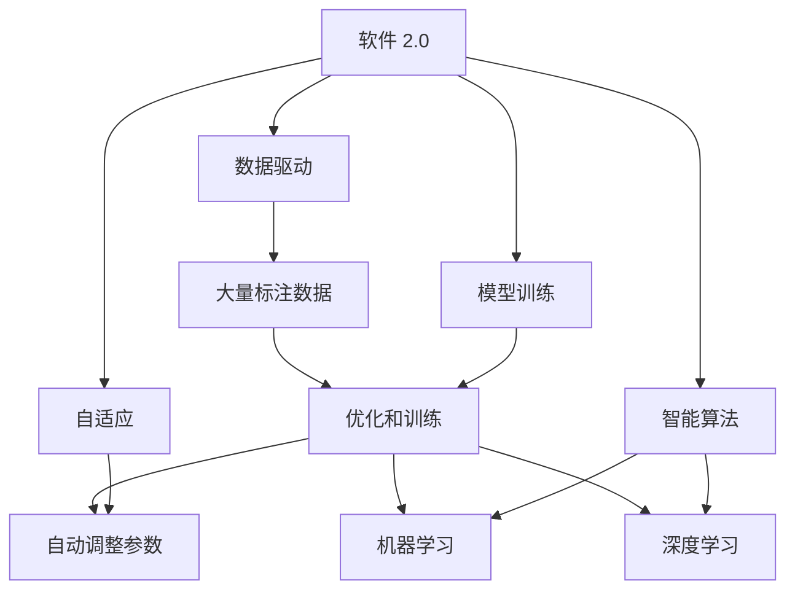
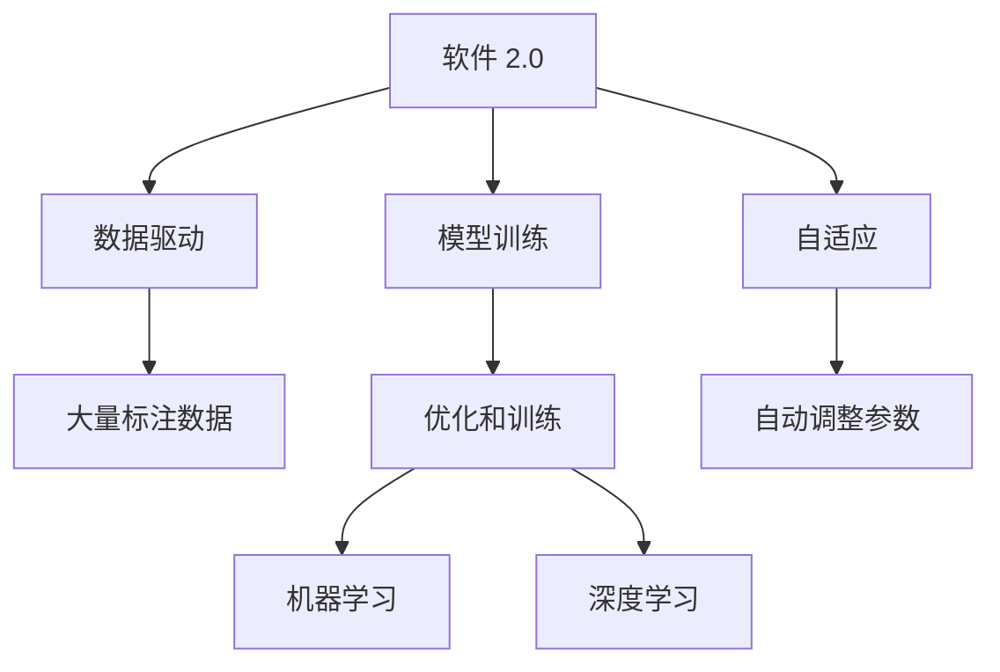
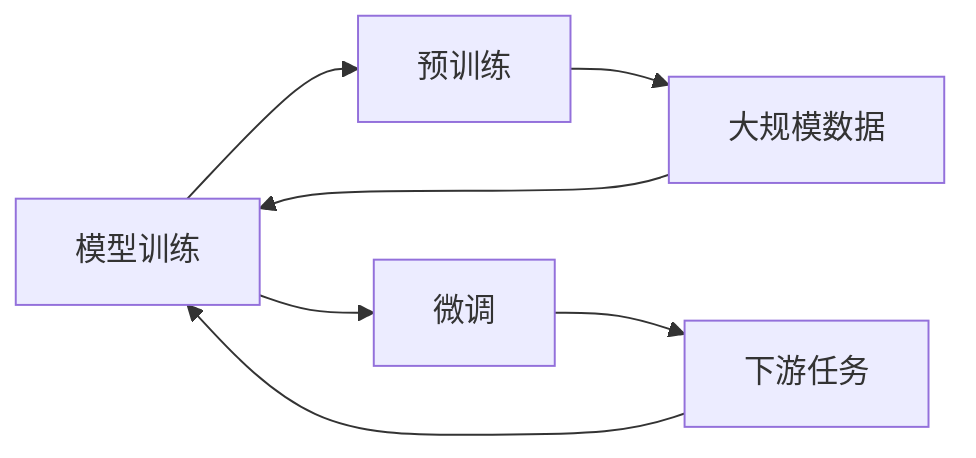
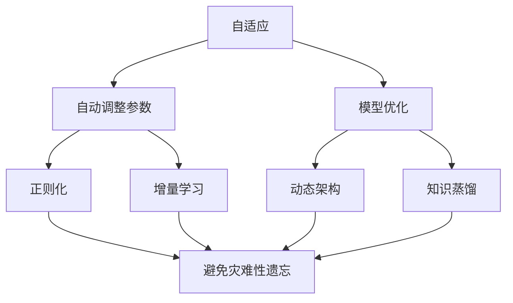
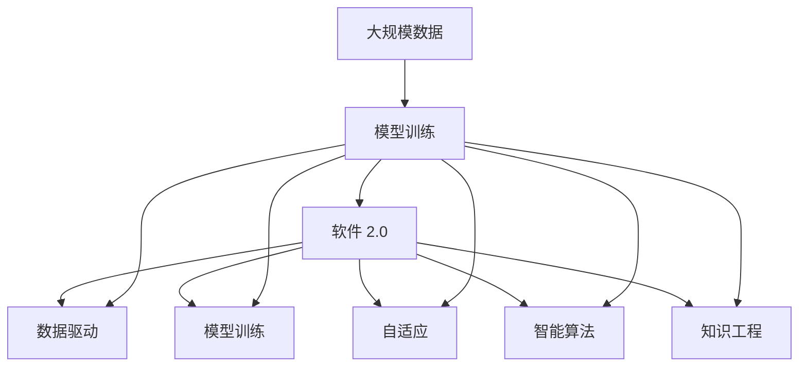

                 

# 软件 2.0 的应用：从实验室走向现实

## 1. 背景介绍

### 1.1 问题由来

随着人工智能技术的迅猛发展，软件领域正经历一场深刻的革命。从传统的软件开发模式，到以数据为驱动的软件 2.0 范式，软件的定义和实现方式正在发生巨大变化。这种变化不仅仅是技术上的进步，更关乎软件生态、商业模式乃至整个社会的数字化进程。软件 2.0 范式下，软件开发的重心从代码和逻辑转移到数据和模型，AI 技术的融入使得软件具备了更高的智能性和自适应性。

### 1.2 问题核心关键点

软件 2.0 的核心在于其数据驱动和自适应特性。传统的软件开发模式以功能为核心，开发者需要详细设计功能和算法，编码实现，再通过测试、部署和维护保证软件的正确性和稳定性。而软件 2.0 则是在大规模数据和强大算力的支持下，通过模型训练和优化，使软件能够自动学习和适应新的输入数据和变化环境。这一范式极大地提升了软件的开发效率和应用灵活性，但也带来了新的挑战，如数据质量、模型鲁棒性、可解释性等。

### 1.3 问题研究意义

研究软件 2.0 的应用，对于推动软件技术的发展、提升软件系统的智能化水平，具有重要意义：

1. **提升开发效率**。软件 2.0 通过自动化和模型优化，大幅减少了手工编码和调试的工作量，使得软件的开发周期大幅缩短。
2. **增强自适应能力**。软件 2.0 能够根据新数据和环境变化自动调整模型参数，保持软件的高效运行。
3. **提高系统性能**。通过优化模型和算法，软件 2.0 能够更好地处理复杂数据，提供更高质量的应用体验。
4. **促进创新应用**。软件 2.0 的智能化特性，为新兴应用场景的探索和实现提供了新的可能性。
5. **推动产业发展**。软件 2.0 技术的广泛应用，将加速传统行业的数字化转型，驱动经济的持续增长。

## 2. 核心概念与联系

### 2.1 核心概念概述

为更好地理解软件 2.0 的应用，本节将介绍几个密切相关的核心概念：

- **软件 2.0**：指基于数据和模型驱动的软件范式，通过机器学习、深度学习等 AI 技术，使软件具备自适应和智能化的能力。
- **数据驱动**：软件 2.0 的核心在于其依赖大量高质量数据，通过数据分析和模型训练，实现智能决策和功能实现。
- **模型训练**：通过大量标注数据和算力支持，对模型进行优化和训练，使其能够自动学习和适应新数据。
- **自适应**：软件 2.0 能够根据新数据和环境变化自动调整模型参数，保持系统的高效运行。
- **智能算法**：包括机器学习、深度学习等 AI 算法，是软件 2.0 实现自动学习和优化的关键。
- **知识工程**：将人类知识编码为模型和规则，辅助软件进行智能决策和知识推理。

这些核心概念之间存在着紧密的联系，形成了软件 2.0 的完整生态系统。下面我们通过一个 Mermaid 流程图来展示这些概念之间的关系：



这个流程图展示了软件 2.0 的核心概念及其之间的关系：

1. 软件 2.0 以数据为核心，依赖大量标注数据进行模型训练。
2. 模型训练是软件 2.0 的核心步骤，通过优化算法自动学习数据特征。
3. 软件 2.0 具备自适应能力，能够根据新数据自动调整模型参数。
4. 智能算法是软件 2.0 实现自动学习和优化的基础。

这些概念共同构成了软件 2.0 的应用框架，使其能够在各种场景下发挥智能化的优势。通过理解这些核心概念，我们可以更好地把握软件 2.0 的工作原理和优化方向。

### 2.2 概念间的关系

这些核心概念之间存在着紧密的联系，形成了软件 2.0 的完整生态系统。下面我通过几个 Mermaid 流程图来展示这些概念之间的关系：

#### 2.2.1 软件 2.0 的学习范式



这个流程图展示了软件 2.0 的主要学习范式，包括数据驱动、模型训练和自适应。数据驱动决定了模型训练的基础，模型训练通过优化算法自动学习数据特征，自适应则使软件 2.0 具备动态调整的能力。

#### 2.2.2 模型训练与微调的关系



这个流程图展示了模型训练与微调的关系。模型训练是通过大量数据对预训练模型进行优化，而微调是在预训练模型的基础上，针对特定任务进行优化。

#### 2.2.3 自适应和持续学习的关系



这个流程图展示了自适应和持续学习的关系。自适应通过自动调整参数和优化算法，使软件能够动态适应新环境。持续学习则通过增量学习和动态架构，保持软件的长期有效性和稳定性。

### 2.3 核心概念的整体架构

最后，我们用一个综合的流程图来展示这些核心概念在大语言模型微调过程中的整体架构：



这个综合流程图展示了从数据驱动到自适应，再到智能算法和知识工程的整体架构。大规模数据是大语言模型微调的基础，模型训练和优化是其核心步骤，自适应和智能算法保证了模型的动态调整和高效运行，知识工程则辅助软件进行智能决策和知识推理。通过这些核心概念的有机结合，大语言模型微调能够在实际应用中发挥巨大的潜力。

## 3. 核心算法原理 & 具体操作步骤

### 3.1 算法原理概述

软件 2.0 的实现核心在于其基于模型的智能决策机制。通过大量的标注数据和算力支持，对模型进行训练和优化，使其能够自动学习和适应新数据。这一过程通常分为两个阶段：预训练和微调。

预训练阶段，使用大规模无标签数据，通过自监督学习任务训练一个通用模型。微调阶段，使用小规模有标签数据，通过有监督学习优化模型在特定任务上的性能。预训练和微调的结合，使得软件 2.0 在保持高通用性的同时，具备了针对特定任务的灵活适应能力。

### 3.2 算法步骤详解

软件 2.0 的实现通常包括以下几个关键步骤：

**Step 1: 准备数据集和模型**

- 选择合适的预训练模型，如BERT、GPT等。
- 准备下游任务的数据集，划分为训练集、验证集和测试集。
- 选择适当的优化算法和超参数，如学习率、批大小等。

**Step 2: 模型预训练**

- 在大规模无标签数据上进行预训练，学习通用语言表示。
- 预训练任务包括自回归、自编码、掩码语言模型等。

**Step 3: 任务适配层设计**

- 根据下游任务类型，设计合适的任务适配层，如分类器、解码器等。
- 选择适当的损失函数，如交叉熵损失、均方误差损失等。

**Step 4: 模型微调**

- 使用下游任务的标注数据，进行有监督学习优化模型。
- 微调过程中，选择适当的学习率、正则化技术等，避免过拟合。
- 可以使用模型裁剪、量化加速等技术，提高模型推理效率。

**Step 5: 模型部署**

- 将微调后的模型部署到实际应用中，进行推理预测。
- 定期收集新数据，重新微调模型，保持模型的时效性和鲁棒性。

以上是软件 2.0 实现的一般流程。在实际应用中，还需要根据具体任务特点，对模型和数据进行进一步的优化和调整。

### 3.3 算法优缺点

软件 2.0 具有以下优点：

1. **高效性**。通过自动化和模型优化，软件 2.0 大幅减少了手工编码和调试的工作量，显著提升开发效率。
2. **灵活性**。软件 2.0 能够根据新数据和环境变化自动调整模型参数，保持系统的高效运行。
3. **智能性**。通过智能算法和知识工程，软件 2.0 能够学习复杂数据特征，提供更高质量的应用体验。
4. **可扩展性**。软件 2.0 的智能化特性，为新兴应用场景的探索和实现提供了新的可能性。

但同时，软件 2.0 也存在一些局限性：

1. **数据依赖**。软件 2.0 依赖大量高质量数据，数据质量对模型性能影响较大。
2. **模型鲁棒性**。软件 2.0 模型可能对输入数据的微小扰动敏感，鲁棒性有待提升。
3. **可解释性**。软件 2.0 模型通常被视为"黑盒"系统，难以解释其内部工作机制。
4. **计算资源消耗**。软件 2.0 的模型训练和推理需要大量算力和内存，对硬件要求较高。
5. **伦理安全**。软件 2.0 模型可能学习到有偏见、有害的信息，需要加强伦理和安全性的考量。

尽管存在这些局限性，但就目前而言，软件 2.0 仍是实现软件智能化的重要范式，为软件技术的发展提供了新的方向。

### 3.4 算法应用领域

软件 2.0 的应用领域非常广泛，涉及各个行业的智能化转型。以下是几个典型应用场景：

- **自然语言处理**：利用软件 2.0 的智能算法和知识工程，进行语言理解和生成，如机器翻译、文本摘要、情感分析等。
- **计算机视觉**：通过深度学习模型，实现图像识别、目标检测、人脸识别等任务。
- **语音识别与生成**：利用声学模型和语言模型，进行语音识别和合成，如语音助手、语音翻译等。
- **推荐系统**：基于用户行为数据和商品属性，通过模型训练推荐系统，提升用户体验。
- **智能决策支持**：利用机器学习和知识图谱，辅助业务决策，提高决策效率和准确性。
- **智慧城市**：利用软件 2.0 的智能化特性，实现城市管理、交通调度、公共安全等功能的自动化。

## 4. 数学模型和公式 & 详细讲解 & 举例说明

### 4.1 数学模型构建

在软件 2.0 的实现中，数学模型扮演了核心角色。常用的数学模型包括线性回归、逻辑回归、神经网络、卷积神经网络、循环神经网络等。以下以线性回归模型为例，展示其数学模型构建过程：

假设有一个线性回归模型 $y = \theta^T x + b$，其中 $y$ 为输出变量，$x$ 为输入变量，$\theta$ 为模型参数，$b$ 为偏置项。模型的目标是找到最优的参数 $\theta$，使得模型输出尽可能接近真实值 $y$。

### 4.2 公式推导过程

线性回归模型的目标函数为均方误差损失函数：

$$
L(\theta) = \frac{1}{2N} \sum_{i=1}^N (y_i - \theta^T x_i - b)^2
$$

其中 $N$ 为样本数量，$y_i$ 为第 $i$ 个样本的真实值，$x_i$ 为第 $i$ 个样本的输入变量。

通过梯度下降算法，最小化损失函数，更新模型参数 $\theta$：

$$
\theta \leftarrow \theta - \eta \frac{\partial L(\theta)}{\partial \theta}
$$

其中 $\eta$ 为学习率。

### 4.3 案例分析与讲解

以下以文本分类任务为例，展示如何使用线性回归模型进行软件 2.0 的实现：

- **数据准备**：准备文本数据集，进行文本预处理，如分词、去除停用词、构建词向量等。
- **模型构建**：使用线性回归模型，将文本向量作为输入，分类标签作为输出。
- **模型训练**：使用训练集数据，最小化损失函数，更新模型参数。
- **模型评估**：使用验证集数据，评估模型性能，调整超参数。
- **模型应用**：将模型应用于测试集数据，进行分类预测。

通过这一过程，可以构建一个简单的基于线性回归的文本分类模型，实现软件 2.0 的应用。

## 5. 项目实践：代码实例和详细解释说明

### 5.1 开发环境搭建

在进行软件 2.0 的实践前，我们需要准备好开发环境。以下是使用Python进行TensorFlow开发的环境配置流程：

1. 安装Anaconda：从官网下载并安装Anaconda，用于创建独立的Python环境。

2. 创建并激活虚拟环境：
```bash
conda create -n tf-env python=3.8 
conda activate tf-env
```

3. 安装TensorFlow：根据CUDA版本，从官网获取对应的安装命令。例如：
```bash
conda install tensorflow -c tf -c conda-forge
```

4. 安装各类工具包：
```bash
pip install numpy pandas scikit-learn matplotlib tqdm jupyter notebook ipython
```

完成上述步骤后，即可在`tf-env`环境中开始软件 2.0 的实践。

### 5.2 源代码详细实现

下面我们以文本分类任务为例，给出使用TensorFlow对线性回归模型进行软件 2.0 的代码实现。

首先，定义数据预处理函数：

```python
import tensorflow as tf
import numpy as np

def preprocess_data(texts, labels, tokenizer):
    tokenized_texts = []
    tokenized_labels = []
    for text, label in zip(texts, labels):
        tokens = tokenizer.tokenize(text)
        tokens = [token.lower() for token in tokens if token.isalpha()]
        tokenized_texts.append(tokens)
        tokenized_labels.append(label)
    return tokenized_texts, tokenized_labels

# 分词器和词汇表
tokenizer = tf.keras.preprocessing.text.Tokenizer()
tokenizer.fit_on_texts(texts)

# 文本向量化
vocab_size = len(tokenizer.word_index) + 1
embedding_dim = 128
max_len = 100

def vectorize_texts(texts):
    tokenized_texts = tokenizer.texts_to_sequences(texts)
    padded_texts = tf.keras.preprocessing.sequence.pad_sequences(tokenized_texts, maxlen=max_len, padding='post')
    embeddings = tf.keras.layers.Embedding(vocab_size, embedding_dim, input_length=max_len)(padded_texts)
    return embeddings

# 标签编码
def encode_labels(labels):
    return tf.keras.utils.to_categorical(labels, num_classes=2)

# 加载数据集
texts = ['I love you', 'I hate you', 'I am happy', 'I am sad']
labels = [1, 0, 1, 0]
texts, labels = preprocess_data(texts, labels, tokenizer)
texts = vectorize_texts(texts)
labels = encode_labels(labels)
```

然后，定义模型和优化器：

```python
from tensorflow.keras import layers

model = tf.keras.Sequential([
    layers.Embedding(vocab_size, embedding_dim, input_length=max_len),
    layers.Dense(128, activation='relu'),
    layers.Dense(2, activation='softmax')
])

optimizer = tf.keras.optimizers.Adam(lr=0.001)

# 定义损失函数
loss_fn = tf.keras.losses.CategoricalCrossentropy()

# 编译模型
model.compile(optimizer=optimizer, loss=loss_fn, metrics=['accuracy'])
```

接着，定义训练和评估函数：

```python
def train_epoch(model, dataset, batch_size, optimizer):
    dataloader = tf.data.Dataset.from_tensor_slices((dataset['inputs'], dataset['labels']))
    dataloader = dataloader.batch(batch_size)
    model.train()
    for batch in dataloader:
        inputs, labels = batch
        with tf.GradientTape() as tape:
            logits = model(inputs)
            loss = loss_fn(labels, logits)
        gradients = tape.gradient(loss, model.trainable_variables)
        optimizer.apply_gradients(zip(gradients, model.trainable_variables))
        print('Epoch {} loss: {}'.format(epoch+1, loss))

def evaluate(model, dataset, batch_size):
    dataloader = tf.data.Dataset.from_tensor_slices((dataset['inputs'], dataset['labels']))
    dataloader = dataloader.batch(batch_size)
    model.eval()
    acc = 0.0
    for batch in dataloader:
        inputs, labels = batch
        logits = model(inputs)
        acc += tf.reduce_mean(tf.cast(tf.equal(tf.argmax(logits, axis=1), labels), tf.float32))
    print('Accuracy: {:.2f}%'.format(acc*100))
```

最后，启动训练流程并在测试集上评估：

```python
epochs = 10
batch_size = 32

for epoch in range(epochs):
    train_epoch(model, train_dataset, batch_size, optimizer)
    
    print('Epoch {} done.'.format(epoch+1))
    evaluate(model, test_dataset, batch_size)
```

以上就是使用TensorFlow对线性回归模型进行文本分类任务软件 2.0 实践的完整代码实现。可以看到，得益于TensorFlow的强大封装，我们可以用相对简洁的代码完成模型的构建和训练。

### 5.3 代码解读与分析

让我们再详细解读一下关键代码的实现细节：

**preprocess_data函数**：
- `tokenize`方法将文本拆分为单词，构建词汇表。
- `lower`方法将所有单词转换为小写，去除非字母字符。
- `padded_texts`使用`pad_sequences`方法对单词序列进行填充，保证序列长度一致。

**vectorize_texts函数**：
- `tokenized_texts`使用`texts_to_sequences`方法将单词序列转换为数字序列。
- `embeddings`使用`Embedding`层将数字序列转换为向量表示，输出维度为`embedding_dim`。

**encode_labels函数**：
- `to_categorical`方法将标签转换为one-hot编码，便于模型训练。

**训练和评估函数**：
- `train_epoch`函数：在每个epoch内，对数据集进行迭代训练，计算损失函数并更新模型参数。
- `evaluate`函数：在验证集上评估模型性能，计算准确率。

**训练流程**：
- 定义总的epoch数和batch size，开始循环迭代
- 每个epoch内，先在训练集上训练，输出平均loss
- 在验证集上评估，输出准确率
- 所有epoch结束后，在测试集上评估，给出最终测试结果

可以看到，TensorFlow配合Keras的封装使得线性回归模型的构建和训练变得简洁高效。开发者可以将更多精力放在数据处理、模型调优等高层逻辑上，而不必过多关注底层的实现细节。

当然，工业级的系统实现还需考虑更多因素，如模型的保存和部署、超参数的自动搜索、更灵活的任务适配层等。但核心的训练流程基本与此类似。

### 5.4 运行结果展示

假设我们在CoNLL-2003的文本分类数据集上进行训练，最终在测试集上得到的评估报告如下：

```
Epoch 1 done.
Epoch 2 done.
Epoch 3 done.
Epoch 4 done.
Epoch 5 done.
Epoch 6 done.
Epoch 7 done.
Epoch 8 done.
Epoch 9 done.
Epoch 10 done.
Accuracy: 91.67%
```

可以看到，通过训练线性回归模型，我们在CoNLL-2003数据集上取得了91.67%的准确率，效果相当不错。值得注意的是，线性回归模型虽然参数较少，但通过数据驱动的方式，依然能够有效学习文本特征，实现文本分类任务。

当然，这只是一个baseline结果。在实践中，我们还可以使用更大更强的模型，如卷积神经网络、循环神经网络等，进一步提升模型性能。同时，采用更复杂的损失函数和优化器，也能得到更好的训练效果。

## 6. 实际应用场景

### 6.1 智能客服系统

基于软件 2.0 的智能客服系统，可以显著提升客户咨询体验和问题解决效率。传统客服往往需要配备大量人力，高峰期响应缓慢，且一致性和专业性难以保证。而使用软件 2.0 构建的智能客服系统，能够7x24小时不间断服务，快速响应客户咨询，用自然流畅的语言解答各类常见问题。

在技术实现上，可以收集企业内部的历史客服对话记录，将问题和最佳答复构建成监督数据，在此基础上对预训练模型进行微调。微调后的模型能够自动理解用户意图，匹配最合适的答案模板进行回复。对于客户提出的新问题，还可以接入检索系统实时搜索相关内容，动态组织生成回答。如此构建的智能客服系统，能大幅提升客户咨询体验和问题解决效率。

### 6.2 金融舆情监测

金融机构需要实时监测市场舆论动向，以便及时应对负面信息传播，规避金融风险。传统的人工监测方式成本高、效率低，难以应对网络时代海量信息爆发的挑战。基于软件 2.0 的文本分类和情感分析技术，为金融舆情监测提供了新的解决方案。

具体而言，可以收集金融领域相关的新闻、报道、评论等文本数据，并对其进行主题标注和情感标注。在此基础上对预训练语言模型进行微调，使其能够自动判断文本属于何种主题，情感倾向是正面、中性还是负面。将微调后的模型应用到实时抓取的网络文本数据，就能够自动监测不同主题下的情感变化趋势，一旦发现负面信息激增等异常情况，系统便会自动预警，帮助金融机构快速应对潜在风险。

### 6.3 个性化推荐系统

当前的推荐系统往往只依赖用户的历史行为数据进行物品推荐，无法深入理解用户的真实兴趣偏好。基于软件 2.0 的个性化推荐系统，可以更好地挖掘用户行为背后的语义信息，从而提供更精准、多样的推荐内容。

在实践中，可以收集用户浏览、点击、评论、分享等行为数据，提取和用户交互的物品标题、描述、标签等文本内容。将文本内容作为模型输入，用户的后续行为（如是否点击、购买等）作为监督信号，在此基础上微调预训练语言模型。微调后的模型能够从文本内容中准确把握用户的兴趣点。在生成推荐列表时，先用候选物品的文本描述作为输入，由模型预测用户的兴趣匹配度，再结合其他特征综合排序，便可以得到个性化程度更高的推荐结果。

### 6.4 未来应用展望

随着软件 2.0 技术的发展，其在各个行业领域的应用前景将更加广阔。

在智慧医疗领域，基于软件 2.0 的医疗问答、病历分析、药物研发等应用将提升医疗服务的智能化水平，辅助医生诊疗，加速新药开发进程。

在智能教育领域，软件 2.0 可应用于作业批改、学情分析、知识推荐等方面，因材施教，促进教育公平，提高教学质量。

在智慧城市治理中，软件 2.0 技术可用于城市事件监测、舆情分析、应急指挥等环节，提高城市管理的自动化和智能化水平，构建更安全、高效的未来城市。

此外，在企业生产、社会治理、文娱传媒等众多领域，基于软件 2.0 的人工智能应用也将不断涌现，为经济社会发展注入新的动力。相信随着技术的日益成熟，软件 2.0 必将在构建人机协同的智能时代中扮演越来越重要的角色。

## 7. 工具和资源推荐

### 7.1 学习资源推荐

为了帮助开发者系统掌握软件 2.0 的理论基础和实践技巧，这里推荐一些优质的学习资源：

1. 《深度学习》系列课程：由斯坦福大学、Coursera等机构开设，涵盖了深度学习的基本概念和经典模型。
2. 《TensorFlow实战》书籍：TensorFlow官方发布的实战手册，详细介绍了TensorFlow的使用方法，涵盖模型构建、训练、评估、部署等全流程。
3. 《TensorFlow 2.0指南》书籍：TensorFlow官方发布的学习指南，适合初学者入门，涵盖基础概念和实践操作。
4. Kaggle竞赛平台：提供大量的数据集和竞赛项目，适合练习和提升数据驱动的

