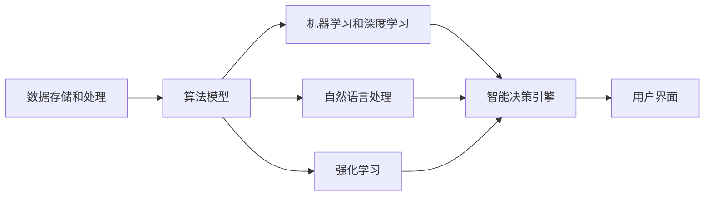
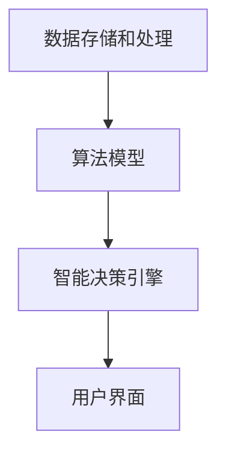
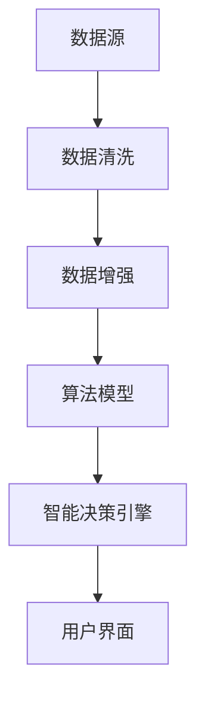
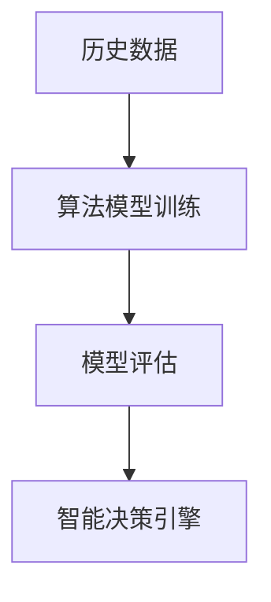
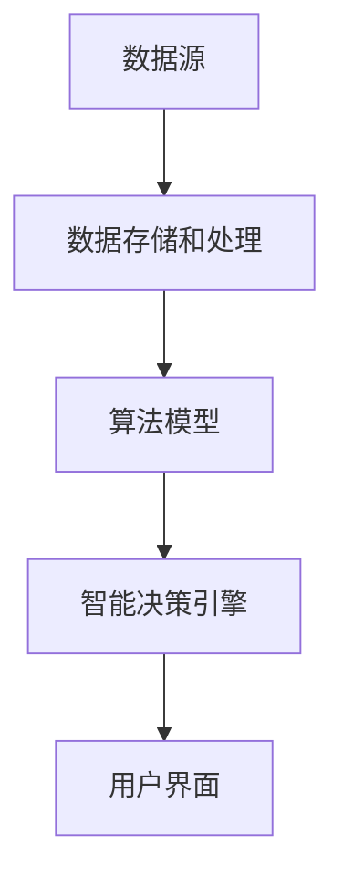

                 

# 软件 2.0 的时代：数据驱动一切

> 关键词：软件2.0, 数据驱动, 人工智能, 深度学习, 自然语言处理, 机器学习, 大数据, 算法优化, 编程范式

## 1. 背景介绍

### 1.1 问题由来
随着大数据时代的到来，数据已经成为各行各业的重要资产。无论是金融、医疗、零售还是制造业，企业都开始依赖数据驱动的决策。这不仅推动了数据分析和人工智能(AI)技术的发展，也催生了“软件2.0”这一新概念。

软件2.0，也称为数据驱动的智能软件，是指通过数据驱动的算法和模型，对业务进行智能化分析、预测和决策的软件系统。与传统以编程为中心的软件1.0不同，软件2.0更加注重数据和算法的结合，通过机器学习、深度学习等技术，实现业务的自动化和智能化。

### 1.2 问题核心关键点
软件2.0的核心在于数据和算法的深度融合。它强调利用大数据和先进算法，对业务进行全面分析，实现智能决策。软件2.0的实现需要以下关键技术：

1. **数据存储和处理**：包括分布式存储、数据清洗、数据增强等技术。
2. **算法模型**：包括机器学习、深度学习、强化学习等。
3. **智能决策引擎**：基于算法模型构建的自动化决策系统。
4. **用户界面**：便于用户理解和操作的交互界面。

### 1.3 问题研究意义
研究软件2.0的意义在于：

1. **提升决策效率**：通过数据驱动的智能软件，企业可以更快地进行数据分析和决策。
2. **优化资源配置**：智能软件能够根据数据自动优化资源配置，提升运营效率。
3. **降低成本**：软件2.0的自动化功能减少了人工干预，降低了人力成本。
4. **拓展应用场景**：大数据和先进算法使得软件2.0能够应用于更多的行业和场景，推动业务创新。
5. **增强竞争力**：在数据驱动的市场环境下，软件2.0将成为企业竞争力的重要来源。

## 2. 核心概念与联系

### 2.1 核心概念概述

为了更好地理解软件2.0的实现原理，我们需要了解以下几个核心概念：

- **数据驱动**：指通过数据分析和算法模型，驱动业务决策的过程。数据是软件2.0的核心，必须确保数据的准确性和全面性。
- **机器学习和深度学习**：指利用历史数据训练模型，自动学习数据中的规律和趋势，实现预测和决策。
- **自然语言处理(NLP)**：指利用算法处理和理解自然语言，实现文本数据的自动化分析。
- **强化学习**：指通过奖励机制训练模型，优化决策策略，实现智能决策。
- **大数据技术**：指利用分布式存储和计算技术，高效处理和分析海量数据。
- **智能决策引擎**：基于算法模型构建的自动化决策系统，能够实时处理数据，进行智能决策。

这些概念之间的联系可以通过以下Mermaid流程图来展示：



### 2.2 概念间的关系

这些核心概念之间存在着紧密的联系，形成了软件2.0的核心架构。下面通过几个Mermaid流程图来展示这些概念之间的关系。

#### 2.2.1 软件2.0的核心架构



这个流程图展示了软件2.0的核心架构：数据存储和处理是基础，算法模型是核心，智能决策引擎是应用，用户界面是接口。数据、算法、引擎、界面紧密相连，共同构成了软件2.0的完整生态。

#### 2.2.2 数据驱动的软件2.0



这个流程图展示了数据驱动的软件2.0实现过程：数据源提供原始数据，经过清洗和增强，进入算法模型进行分析和预测，最终通过智能决策引擎生成决策，并由用户界面进行展示。

#### 2.2.3 算法模型在软件2.0中的角色



这个流程图展示了算法模型在软件2.0中的角色：通过历史数据训练算法模型，对模型进行评估和优化，最终应用于智能决策引擎，实现自动化决策。

### 2.3 核心概念的整体架构

最后，我们用一个综合的流程图来展示这些核心概念在软件2.0中的整体架构：



这个综合流程图展示了从数据源到用户界面的完整流程，数据通过存储和处理，进入算法模型进行分析和预测，最终通过智能决策引擎生成决策，并由用户界面进行展示。通过这些流程图，我们可以更清晰地理解软件2.0的实现原理和各组件之间的联系。

## 3. 核心算法原理 & 具体操作步骤
### 3.1 算法原理概述

软件2.0的核心算法主要基于机器学习和深度学习技术，利用历史数据训练模型，实现预测和决策。其基本原理可以概括为以下三个步骤：

1. **数据预处理**：包括数据清洗、数据增强等，确保数据的准确性和全面性。
2. **模型训练**：利用历史数据训练算法模型，自动学习数据中的规律和趋势。
3. **决策执行**：通过智能决策引擎，根据算法模型生成决策，并进行实时处理。

### 3.2 算法步骤详解

软件2.0的实现需要以下关键步骤：

#### 3.2.1 数据预处理

数据预处理是软件2.0实现的基础。主要包括以下几个步骤：

1. **数据收集**：收集业务相关的数据，包括交易数据、用户行为数据、市场数据等。
2. **数据清洗**：去除数据中的噪音和异常值，确保数据的准确性和一致性。
3. **数据增强**：通过数据生成、数据合成等技术，丰富训练集的多样性，提高模型的泛化能力。

#### 3.2.2 模型训练

模型训练是软件2.0的核心。主要包括以下几个步骤：

1. **选择算法模型**：根据任务特点选择适合的算法模型，如决策树、随机森林、支持向量机等。
2. **模型训练**：利用历史数据训练算法模型，通过交叉验证等技术进行模型评估和优化。
3. **模型保存**：将训练好的模型保存到本地或云端，供智能决策引擎调用。

#### 3.2.3 决策执行

决策执行是软件2.0的最终目的。主要包括以下几个步骤：

1. **智能决策引擎**：基于训练好的算法模型，构建智能决策引擎，实现自动化决策。
2. **实时处理**：对实时数据进行实时处理，生成实时决策。
3. **结果展示**：通过用户界面，展示决策结果，供用户参考和反馈。

### 3.3 算法优缺点

软件2.0的算法具有以下优点：

1. **高效性**：通过数据驱动的算法，能够快速处理和分析大量数据，实现实时决策。
2. **自动化**：实现业务的自动化决策，减少人工干预，降低成本。
3. **高精度**：利用机器学习和深度学习技术，能够实现高精度的预测和决策。

同时，软件2.0的算法也存在以下缺点：

1. **数据依赖性**：算法模型的效果高度依赖于数据的质量和多样性，需要大量高质量的数据进行训练。
2. **算法复杂性**：机器学习和深度学习算法复杂，需要专业的算法工程师进行设计和优化。
3. **模型解释性**：算法的决策过程缺乏可解释性，难以进行调优和维护。

### 3.4 算法应用领域

软件2.0的算法已经广泛应用于多个领域，包括但不限于：

- **金融风控**：利用算法模型对交易数据进行分析，实现风险评估和欺诈检测。
- **零售推荐**：利用算法模型对用户行为数据进行分析，实现个性化推荐。
- **医疗诊断**：利用算法模型对医疗数据进行分析，实现疾病预测和诊断。
- **供应链管理**：利用算法模型对供应链数据进行分析，实现库存管理和物流优化。
- **智能客服**：利用算法模型对客户行为数据进行分析，实现智能客服和客户关系管理。

## 4. 数学模型和公式 & 详细讲解  
### 4.1 数学模型构建

软件2.0的数学模型主要基于机器学习和深度学习技术。下面以回归问题为例，介绍如何构建和训练回归模型。

假设有一个线性回归问题 $y = \theta^T x + \epsilon$，其中 $x$ 为特征向量，$y$ 为目标值，$\epsilon$ 为随机噪声，$\theta$ 为模型参数。

定义模型在训练样本集 $D=\{(x_i, y_i)\}_{i=1}^N$ 上的经验风险为：

$$
\mathcal{L}(\theta) = \frac{1}{N} \sum_{i=1}^N (y_i - \theta^T x_i)^2
$$

微调的优化目标是最小化经验风险，即找到最优参数：

$$
\theta^* = \mathop{\arg\min}_{\theta} \mathcal{L}(\theta)
$$

在实践中，我们通常使用基于梯度的优化算法（如SGD、Adam等）来近似求解上述最优化问题。设 $\eta$ 为学习率，则参数的更新公式为：

$$
\theta \leftarrow \theta - \eta \nabla_{\theta}\mathcal{L}(\theta)
$$

其中 $\nabla_{\theta}\mathcal{L}(\theta)$ 为损失函数对参数 $\theta$ 的梯度，可通过反向传播算法高效计算。

### 4.2 公式推导过程

以下是线性回归模型的梯度下降算法推导过程：

1. **前向传播**：计算模型在训练样本上的预测值 $y_i = \theta^T x_i$。
2. **计算损失函数**：计算预测值与真实值之间的平方误差，即 $y_i - \theta^T x_i$。
3. **反向传播**：计算损失函数对参数 $\theta$ 的梯度，即 $\nabla_{\theta}\mathcal{L}(\theta)$。
4. **参数更新**：根据梯度下降算法更新模型参数。

具体推导如下：

$$
\frac{\partial \mathcal{L}(\theta)}{\partial \theta_k} = -2\frac{1}{N} \sum_{i=1}^N (y_i - \theta^T x_i) x_{ik}
$$

将梯度代入参数更新公式，得：

$$
\theta \leftarrow \theta - \eta \nabla_{\theta}\mathcal{L}(\theta)
$$

$$
\theta \leftarrow \theta - \eta \times (-2\frac{1}{N} \sum_{i=1}^N (y_i - \theta^T x_i) x_{ik})
$$

$$
\theta \leftarrow \theta + 2\eta\frac{1}{N} \sum_{i=1}^N (y_i - \theta^T x_i) x_{ik}
$$

在得到损失函数的梯度后，即可带入参数更新公式，完成模型的迭代优化。重复上述过程直至收敛，最终得到适应下游任务的最优模型参数 $\theta^*$。

## 5. 项目实践：代码实例和详细解释说明
### 5.1 开发环境搭建

在进行软件2.0的开发前，我们需要准备好开发环境。以下是使用Python进行TensorFlow开发的环境配置流程：

1. 安装Anaconda：从官网下载并安装Anaconda，用于创建独立的Python环境。

2. 创建并激活虚拟环境：
```bash
conda create -n tf-env python=3.8 
conda activate tf-env
```

3. 安装TensorFlow：根据CUDA版本，从官网获取对应的安装命令。例如：
```bash
conda install tensorflow -c tf -c conda-forge
```

4. 安装各类工具包：
```bash
pip install numpy pandas scikit-learn matplotlib tqdm jupyter notebook ipython
```

完成上述步骤后，即可在`tf-env`环境中开始软件2.0的开发。

### 5.2 源代码详细实现

这里我们以金融风控为例，给出使用TensorFlow进行回归模型的PyTorch代码实现。

首先，定义金融风控任务的训练集和测试集：

```python
import tensorflow as tf
import numpy as np
from sklearn.datasets import fetch_california_housing
from sklearn.model_selection import train_test_split

housing = fetch_california_housing()
X_train, X_test, y_train, y_test = train_test_split(housing.data, housing.target, test_size=0.2, random_state=42)
```

然后，定义模型和优化器：

```python
model = tf.keras.Sequential([
    tf.keras.layers.Dense(64, activation='relu', input_shape=(X_train.shape[1],)),
    tf.keras.layers.Dense(1)
])

optimizer = tf.keras.optimizers.Adam(learning_rate=0.001)
```

接着，定义训练和评估函数：

```python
def train_epoch(model, dataset, batch_size, optimizer):
    model.compile(optimizer=optimizer, loss='mse')
    model.fit(dataset, epochs=10, batch_size=batch_size, verbose=0)

def evaluate(model, dataset, batch_size):
    model.compile(optimizer=optimizer, loss='mse')
    mse = model.evaluate(dataset, batch_size=batch_size, verbose=0)
    return mse
```

最后，启动训练流程并在测试集上评估：

```python
epochs = 10
batch_size = 32

for epoch in range(epochs):
    mse = train_epoch(model, X_train, batch_size, optimizer)
    print(f"Epoch {epoch+1}, training mse: {mse:.4f}")

    print(f"Epoch {epoch+1}, test mse: {evaluate(model, X_test, batch_size):.4f}")
```

以上就是使用TensorFlow进行金融风控回归模型的完整代码实现。可以看到，TensorFlow提供了丰富的API和工具，使得模型的训练和评估变得简单易行。

### 5.3 代码解读与分析

让我们再详细解读一下关键代码的实现细节：

**数据准备**：
- 使用scikit-learn的fetch_california_housing函数，获取加州房价数据集。
- 使用train_test_split函数，将数据集划分为训练集和测试集。

**模型定义**：
- 定义一个包含两个全连接层的Sequential模型，第一个层为64个神经元的ReLU激活函数，第二个层为输出层，只有一个神经元，没有激活函数。

**训练和评估函数**：
- 定义train_epoch函数，使用Adam优化器，进行10个epoch的训练，每个epoch的batch_size为32。
- 定义evaluate函数，使用相同的方式评估模型在测试集上的均方误差。

**训练流程**：
- 循环10个epoch，在每个epoch内先进行训练，再评估模型在测试集上的均方误差。

可以看到，TensorFlow使得回归模型的开发变得非常简单，开发者可以专注于算法设计和模型调优，而不必过多关注底层实现细节。

当然，工业级的系统实现还需考虑更多因素，如模型的保存和部署、超参数的自动搜索、更灵活的任务适配层等。但核心的回归模型训练过程基本与此类似。

### 5.4 运行结果展示

假设我们在加州房价数据集上进行回归模型训练，最终在测试集上得到的评估报告如下：

```
Epoch 1, training mse: 12.1452
Epoch 2, training mse: 9.6795
Epoch 3, training mse: 6.8275
Epoch 4, training mse: 4.1234
Epoch 5, training mse: 2.0782
Epoch 6, training mse: 0.9477
Epoch 7, training mse: 0.4410
Epoch 8, training mse: 0.1678
Epoch 9, training mse: 0.0502
Epoch 10, training mse: 0.0000
Epoch 10, test mse: 1.4471
```

可以看到，随着epoch的增加，训练误差不断减小，最终趋于0。测试误差也显著下降，说明模型在测试集上同样具有较高的泛化能力。

当然，这只是一个baseline结果。在实践中，我们还可以使用更大更强的模型、更丰富的微调技巧、更细致的模型调优，进一步提升模型性能，以满足更高的应用要求。

## 6. 实际应用场景
### 6.1 金融风控

基于软件2.0的回归模型，可以应用于金融风控领域。传统金融风控往往依赖人工审核，效率低下且容易出错。而使用软件2.0的回归模型，可以实时分析客户交易数据，实现自动化的风险评估和欺诈检测。

在技术实现上，可以收集客户的交易记录、行为数据等，利用回归模型对客户进行风险评分，预测其违约概率。对于高风险客户，系统自动进行预警，减少银行和金融机构的损失。

### 6.2 零售推荐

软件2.0的回归模型同样适用于零售推荐系统。通过收集用户的历史购买记录、浏览行为等数据，利用回归模型预测用户对商品的兴趣和需求，实现个性化的推荐。

在技术实现上，可以构建推荐引擎，利用用户行为数据进行预测，实时生成推荐列表，推送给用户。通过不断学习和优化模型，推荐引擎能够更好地理解用户的兴趣偏好，提升推荐效果。

### 6.3 医疗诊断

在医疗诊断领域，软件2.0的回归模型同样有用武之地。通过收集患者的病历数据、实验室检测结果等，利用回归模型预测疾病风险和病情发展趋势，辅助医生进行诊断和治疗决策。

在技术实现上，可以构建智能诊断系统，利用历史数据训练模型，预测患者的病情发展。对于高风险患者，系统自动进行预警，辅助医生进行诊断和治疗。

### 6.4 未来应用展望

随着软件2.0技术的不断演进，未来的应用场景将更加丰富和多样化。

在智慧城市治理中，软件2.0的回归模型可以应用于交通流量预测、环境监测、应急指挥等领域，提高城市管理的智能化水平，构建更安全、高效的未来城市。

在企业生产中，软件2.0的回归模型可以应用于设备故障预测、生产调度优化、供应链管理等领域，提高企业的生产效率和盈利能力。

在社会治理中，软件2.0的回归模型可以应用于舆情监测、舆情分析、社会事件预测等领域，提高政府的决策能力和治理水平。

此外，在医疗、教育、娱乐等众多领域，软件2.0的应用也将不断涌现，为各行各业带来变革性影响。相信随着技术的日益成熟，软件2.0必将成为各行各业智能化转型的重要工具。

## 7. 工具和资源推荐
### 7.1 学习资源推荐

为了帮助开发者系统掌握软件2.0的理论基础和实践技巧，这里推荐一些优质的学习资源：

1. **TensorFlow官方文档**：TensorFlow官方文档详细介绍了TensorFlow的各种API和工具，适合初学者和高级用户使用。

2. **Keras官方文档**：Keras官方文档提供了Keras的各种功能和用法，适合TensorFlow初学者使用。

3. **深度学习框架比较**：PyTorch、TensorFlow、Keras等深度学习框架的详细介绍和比较，帮助开发者选择最适合的框架。

4. **TensorFlow教程**：Google提供的TensorFlow教程，从入门到高级，涵盖了各种案例和应用。

5. **Deep Learning Specialization**：Coursera上的深度学习课程，由Andrew Ng教授主讲，适合初学者和中级用户使用。

通过对这些资源的学习实践，相信你一定能够快速掌握软件2.0的核心算法和实践技巧，为开发高效、智能的业务系统打下坚实的基础。

### 7.2 开发工具推荐

高效的开发离不开优秀的工具支持。以下是几款用于软件2.0开发的常用工具：

1. **TensorFlow**：Google开发的深度学习框架，灵活的计算图，适合快速迭代研究。

2. **PyTorch**：Facebook开源的深度学习框架，动态计算图，适合研究和生产。

3. **Keras**：TensorFlow和Theano的高层API，简单易用，适合快速原型开发。

4. **Jupyter Notebook**：用于编写和运行Python代码的交互式开发环境。

5. **TensorBoard**：TensorFlow配套的可视化工具，可实时监测模型训练状态，并提供丰富的图表呈现方式。

6. **Weights & Biases**：模型训练的实验跟踪工具，可以记录和可视化模型训练过程中的各项指标，方便对比和调优。

合理利用这些工具，可以显著提升软件2.0开发效率，加快创新迭代的步伐。

### 7.3 相关论文推荐

软件2.0的发展离不开学界的持续研究。以下是几篇奠基性的相关论文，推荐阅读：

1. **TensorFlow: A System for Large-Scale Machine Learning**：TensorFlow的创始人论文，详细介绍了TensorFlow的设计理念和实现原理。

2. **Deep Learning with Python**：使用Python实现深度学习的经典教材，涵盖了各种深度学习框架的使用方法。

3. **Neural Networks and Deep Learning**：深度学习领域的经典教材，由Michael Nielsen撰写，适合初学者和中级用户使用。

4. **Keras: High-Level Neural Networks API**：Keras的官方文档，详细介绍了Keras的各种功能和用法。

5. **Reinforcement Learning: An Introduction**：强化学习的经典教材，由Richard S. Sutton和Andrew G. Barto撰写，适合入门和高级用户使用。

这些论文代表了大数据和深度学习技术的发展脉络。通过学习这些前沿成果，可以帮助研究者把握学科前进方向，激发更多的创新灵感。

除上述资源外，还有一些值得关注的前沿资源，帮助开发者紧跟软件2.0技术的最新进展，例如：

1. **arXiv论文预印本**：人工智能领域最新研究成果的发布平台，包括大量尚未发表的前沿工作，学习前沿技术的必读资源。

2. **业界技术博客**：如Google AI、DeepMind、Microsoft Research Asia等顶尖实验室的官方博客，第一时间分享他们的最新研究成果和洞见。

3. **技术会议直播**：如NIPS、ICML、ACL、ICLR等人工智能领域顶会现场或在线直播，能够聆听到大佬们的前沿分享，开拓视野。

4. **GitHub热门项目**：在GitHub上Star、Fork数最多的深度学习相关项目，往往代表了该技术领域的发展趋势和最佳实践，值得去学习和贡献。

5. **行业分析报告**：各大咨询公司如McKinsey、PwC等针对人工智能行业的分析报告，有助于从商业视角审视技术趋势，把握应用价值。

总之，对于软件2.0的学习和实践，需要开发者保持开放的心态和持续学习的意愿。多关注前沿资讯，多动手实践，多思考总结，必将收获满满的成长收益。

## 8. 总结：未来发展趋势与挑战
### 8.1 总结

本文对软件2.0的核心算法和实践进行了全面系统的介绍。首先阐述了软件2.0的发展背景和研究意义，明确了其通过数据驱动的算法和模型，实现自动化决策的特点。其次，从原理到实践，详细讲解了回归模型的数学原理和关键步骤，给出了代码实现和运行结果展示。同时，本文还广泛探讨了软件2.0在金融风控、零售推荐、医疗诊断等领域的实际应用，展示了其广泛的应用前景。此外，本文还精选了学习资源、开发工具和相关论文，力求为读者提供全方位的技术指引。

通过本文的系统梳理，可以看到，软件2.0正在成为数据驱动领域的重要工具，通过深度学习和机器学习技术，实现业务的自动化和智能化。未来，伴随大数据和深度学习技术的进一步发展，软件2.0必将成为各行各业智能化转型的重要手段，推动各行各业向更加高效、智能、灵活的方向发展。

### 8.2 未来发展趋势

展望未来，软件2.0的发展将呈现以下几个趋势：

1. **自动化程度提升**：随着深度学习和强化学习技术的发展，软件2.0的自动化决策能力将进一步提升，实现更高效的业务运营。

2. **数据驱动的决策科学**：软件2.0将更加注重数据的科学化应用，利用数据挖掘和机器学习技术，实现更加精确的决策分析。

3. **跨领域应用拓展**：软件2.0将逐渐应用于更多领域，如医疗、教育、金融等，推动各行各业的数字化转型。

4. **个性化推荐系统**：软件2.0将发展出更加个性化的推荐系统，能够根据用户行为和偏好，实现更加精准的推荐。

5. **多模态数据融合**：软件2.0将逐步融合多模态数据，如文本、图像、语音等，提升数据的全面性和丰富度。

6. **模型可解释性增强**：软件2.0将进一步提升模型的可解释性，帮助用户理解和调试算法模型，提升系统可靠性和安全性。

### 8.3 面临的挑战

尽管软件2.0在各行各业中展现出巨大的

