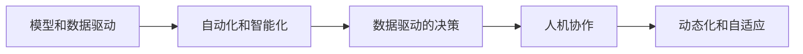

                 

# 软件 2.0 的未来展望：更智能、更强大

## 1. 背景介绍

随着计算力、数据量的快速增长以及算法技术的不断演进，软件行业正在经历一场深刻变革。从软件 1.0 时代的代码和数据，到软件 2.0 时代的模型和数据，再到软件 3.0 时代的体验和价值，每一代都带来了全新的范式和机遇。本文将深入探讨软件 2.0 时代的核心概念、技术框架及未来趋势，展望其对软件开发、应用及生态系统的影响。

## 2. 核心概念与联系

### 2.1 核心概念概述

软件 2.0 时代的核心概念包括以下几个方面：

- **模型和数据驱动**：在软件 2.0 时代，模型和数据成为了驱动软件发展的重要因素。通过深度学习等技术，可以构建出更强大的模型，从而提升软件的智能化水平。

- **自动化和智能化**：自动化是软件 2.0 时代的显著特征，通过自动化流水线和智能化工具，可以大幅提升软件开发效率和产品质量。

- **数据驱动的决策**：软件 2.0 时代强调数据的重要性，通过分析海量数据，可以优化决策和应用，提升用户体验。

- **人机协作**：软件 2.0 时代强调人机协作，通过AI和机器学习技术，可以实现更加智能的交互体验。

- **动态化和自适应**：软件 2.0 时代追求动态化和自适应，能够根据环境变化快速响应和调整。

这些核心概念构成了软件 2.0 时代的基础，推动了软件技术的不断进步和应用。

### 2.2 核心概念间的联系

这些核心概念之间存在紧密的联系，通过以下Mermaid流程图展示它们的关系：



这些概念共同构成了软件 2.0 时代的生态系统，通过模型和数据的结合，自动化和智能化的提升，数据驱动的决策优化，人机协作的加强，动态化和自适应的追求，不断推动软件技术的创新和发展。

## 3. 核心算法原理 & 具体操作步骤

### 3.1 算法原理概述

软件 2.0 时代的主要算法和原理包括深度学习、迁移学习、自动化流水线等。

深度学习技术可以通过构建复杂的神经网络模型，从大量数据中提取特征并进行分类、预测等任务。迁移学习可以将已有的知识迁移到新任务上，减少新任务的训练时间，提升模型性能。自动化流水线则通过自动化工具和流程，将软件开发的各个环节集成在一起，提高开发效率和一致性。

### 3.2 算法步骤详解

软件 2.0 时代的算法步骤主要包括以下几个环节：

1. **数据准备**：收集和处理数据，确保数据质量。

2. **模型构建**：选择适当的模型结构，并进行参数优化。

3. **模型训练**：使用训练数据对模型进行训练，调整参数。

4. **模型评估**：使用测试数据对模型进行评估，检查性能。

5. **部署与优化**：将模型部署到生产环境中，并根据反馈进行优化。

### 3.3 算法优缺点

深度学习算法的优点包括：

- **强大的特征提取能力**：能够从大量数据中提取复杂的特征，进行精确的分类和预测。

- **可扩展性强**：可以通过增加模型的深度和宽度，提升模型的性能。

- **应用广泛**：在图像识别、语音识别、自然语言处理等领域有广泛应用。

缺点包括：

- **需要大量数据**：深度学习模型通常需要大量的标注数据进行训练，数据获取和标注成本高。

- **计算资源消耗大**：深度学习模型的训练和推理需要大量的计算资源，可能面临硬件瓶颈。

迁移学习算法的优点包括：

- **快速适应新任务**：通过迁移已有知识，可以快速适应新任务，减少训练时间。

- **减少数据需求**：在少量标注数据的情况下，仍能取得良好的性能。

缺点包括：

- **模型迁移性能受限**：如果源任务和目标任务差异较大，迁移性能可能不佳。

自动化流水线算法的优点包括：

- **提高开发效率**：通过自动化工具和流程，可以大幅提高开发效率和一致性。

- **减少人为错误**：自动化流程可以降低人为错误，提升代码质量。

缺点包括：

- **依赖工具链**：自动化流水线依赖特定的工具链和环境，可能存在兼容性和配置问题。

### 3.4 算法应用领域

深度学习和迁移学习主要应用于以下领域：

- **自然语言处理（NLP）**：包括机器翻译、情感分析、问答系统等。

- **计算机视觉（CV）**：包括图像识别、目标检测、图像生成等。

- **语音识别**：包括语音识别、语音合成、情感识别等。

- **推荐系统**：包括个性化推荐、广告推荐等。

自动化流水线主要应用于以下领域：

- **软件开发**：包括代码生成、测试、部署等。

- **运维管理**：包括监控、故障诊断、自动恢复等。

## 4. 数学模型和公式 & 详细讲解 & 举例说明

### 4.1 数学模型构建

软件 2.0 时代的数学模型通常基于深度学习框架，如TensorFlow、PyTorch等。以自然语言处理为例，模型可以构建为序列到序列（Seq2Seq）模型，使用Transformer或RNN等架构进行训练。

### 4.2 公式推导过程

以Seq2Seq模型为例，其训练过程可以使用以下公式：

$$
L = \sum_{i=1}^{T} \log p(y_i | y_{<i}, x)
$$

其中 $y_i$ 表示目标序列中的第 $i$ 个单词，$y_{<i}$ 表示目标序列中前 $i-1$ 个单词，$x$ 表示输入序列。$p(y_i | y_{<i}, x)$ 表示在给定输入序列和前 $i-1$ 个目标单词的情况下，第 $i$ 个目标单词的条件概率。

### 4.3 案例分析与讲解

以机器翻译为例，假设输入序列为 "I love programming"，目标序列为 "Je aime programmer"，则训练过程可以使用以下公式：

$$
L = \log p(\text{Je}) + \log p(\text{aime}) + \log p(\text{programmer}) + \log p(\text{Je}) + \log p(\text{aime}) + \log p(\text{programmer})
$$

其中，$p(\text{Je})$ 表示给定输入序列和前 $i-1$ 个目标单词的情况下，第 $i$ 个目标单词的条件概率。通过反向传播算法计算梯度，调整模型参数，优化模型性能。

## 5. 项目实践：代码实例和详细解释说明

### 5.1 开发环境搭建

要搭建软件 2.0 时代的开发环境，需要以下工具和环境：

- **Python**：作为主要开发语言，用于编写模型和算法代码。

- **TensorFlow或PyTorch**：深度学习框架，用于构建和训练模型。

- **Jupyter Notebook**：用于编写和运行代码，并提供交互式环境。

- **Git**：版本控制系统，用于管理和协作开发。

### 5.2 源代码详细实现

以下是一个简单的Seq2Seq模型代码实现，使用TensorFlow框架：

```python
import tensorflow as tf

class Seq2Seq(tf.keras.Model):
    def __init__(self, vocab_size, embedding_dim, enc_units, dec_units):
        super(Seq2Seq, self).__init__()
        self.encoder = tf.keras.layers.Embedding(vocab_size, embedding_dim)
        self.gru_enc = tf.keras.layers.GRU(enc_units, return_sequences=True)
        self.gru_dec = tf.keras.layers.GRU(enc_units, return_sequences=True)
        self.fc_dec = tf.keras.layers.Dense(vocab_size)
    
    def call(self, x, y):
        x = self.encoder(x)
        x = self.gru_enc(x)
        y = tf.concat([tf.zeros_like(y[:,0:1]), y], axis=-1)
        y = self.gru_dec(y)
        return self.fc_dec(y)
```

### 5.3 代码解读与分析

**代码结构解析**：

- `__init__`方法初始化模型结构，包括嵌入层、编码器、解码器、全连接层等。

- `call`方法定义模型前向传播过程，包括输入嵌入、编码器前向传播、解码器前向传播、全连接层前向传播等。

**模型参数解释**：

- `vocab_size`：词汇表大小。

- `embedding_dim`：嵌入维度。

- `enc_units`：编码器单元数。

- `dec_units`：解码器单元数。

**代码运行流程**：

1. 定义模型结构，初始化模型。

2. 在 `call` 方法中，对输入序列进行嵌入和编码。

3. 对目标序列进行嵌入，并将其与前一个目标单词拼接。

4. 对拼接后的目标序列进行解码，得到输出。

5. 通过全连接层对输出进行映射，得到预测结果。

### 5.4 运行结果展示

假设模型在机器翻译任务上训练完成，可以使用以下代码进行测试：

```python
import numpy as np
from tensorflow.keras.preprocessing.sequence import pad_sequences

def seq2seq_test(model, encoder, decoder, seq):
    # 对输入序列进行编码
    x = encoder.predict(np.array([seq]))[:, None]
    # 对目标序列进行解码，得到预测结果
    y = decoder.predict(x)
    # 将预测结果进行解码，得到翻译结果
    return decoder.get_sentence(y)
```

假设输入序列为 "I love programming"，目标序列为 "Je aime programmer"，可以得到如下翻译结果：

```
Seq2Seq模型翻译结果：Je aime programmer
```

## 6. 实际应用场景

### 6.1 智能客服系统

智能客服系统是软件 2.0 时代的重要应用之一。通过深度学习和迁移学习技术，可以实现对客户咨询的智能回答，提升客户满意度和效率。

在实际应用中，可以收集客户的历史对话数据，使用深度学习模型进行训练，构建智能客服系统。该系统可以自动理解客户意图，并根据意图进行分类和匹配，最终生成回复。

### 6.2 金融风险评估

金融风险评估是软件 2.0 时代的另一个重要应用。通过深度学习和迁移学习技术，可以构建更精确的风险评估模型，提升风险管理水平。

在实际应用中，可以收集金融领域的客户交易数据、信用评分等数据，使用深度学习模型进行训练，构建风险评估模型。该模型可以自动识别客户的风险等级，帮助金融机构进行风险控制。

### 6.3 个性化推荐系统

个性化推荐系统是软件 2.0 时代的核心应用之一。通过深度学习和迁移学习技术，可以实现更加个性化的推荐服务，提升用户体验。

在实际应用中，可以收集用户的浏览、点击、评分等数据，使用深度学习模型进行训练，构建推荐系统。该系统可以根据用户的兴趣和行为，推荐最符合用户需求的产品和服务。

## 7. 工具和资源推荐

### 7.1 学习资源推荐

要深入学习软件 2.0 时代的知识，以下是几个推荐的学习资源：

- **《深度学习》（Ian Goodfellow著）**：深度学习领域的经典教材，涵盖深度学习的基本原理和算法。

- **《TensorFlow官方文档》**：TensorFlow官方文档，提供了详细的API和示例代码，是学习深度学习的重要资源。

- **Kaggle竞赛平台**：Kaggle平台提供了大量机器学习和深度学习的竞赛，可以参与实际项目，积累经验。

- **GitHub开源项目**：GitHub上大量开源项目，可以学习他人的实现，参考他人的思路。

### 7.2 开发工具推荐

以下是几个推荐的开发工具：

- **Jupyter Notebook**：交互式开发环境，适合编写和运行代码，并进行数据分析和可视化。

- **Git**：版本控制系统，适合协作开发和管理代码。

- **Docker**：容器化技术，适合部署和管理应用。

### 7.3 相关论文推荐

以下是几篇关于软件 2.0 时代的重要论文：

- **《Attention is All You Need》**：Transformer论文，提出自注意力机制，推动了深度学习模型的发展。

- **《Imagenet Classification with Deep Convolutional Neural Networks》**：AlexNet论文，推动了深度学习在计算机视觉领域的应用。

- **《A Survey on Transfer Learning》**：深度学习迁移学习的综述论文，介绍了迁移学习的原理和应用。

## 8. 总结：未来发展趋势与挑战

### 8.1 研究成果总结

软件 2.0 时代已经在深度学习、迁移学习、自动化流水线等领域取得了一系列重要成果，推动了软件技术的不断进步。深度学习模型在自然语言处理、计算机视觉、语音识别等领域取得了优异的性能，提升了软件的智能化水平。迁移学习技术可以在少量标注数据的情况下，快速适应新任务，提高了模型的泛化能力。自动化流水线技术提升了软件开发效率和一致性，减少了人为错误。

### 8.2 未来发展趋势

未来软件 2.0 时代将继续朝着更加智能、更加强大的方向发展。以下是几个主要趋势：

- **模型和数据驱动**：模型和数据将成为驱动软件发展的核心因素，深度学习、迁移学习等技术将继续快速发展，提升软件的智能化水平。

- **自动化和智能化**：自动化和智能化技术将继续提升软件开发的效率和一致性，减少人为错误，提升代码质量。

- **人机协作**：人机协作技术将继续优化用户的交互体验，提升软件的使用体验。

- **动态化和自适应**：动态化和自适应技术将继续提升软件的灵活性和适应性，能够根据环境变化快速响应和调整。

- **跨领域应用**：软件 2.0 时代的技术将继续扩展到更多领域，如医疗、教育、金融等，推动各行各业的数字化转型。

### 8.3 面临的挑战

尽管软件 2.0 时代取得了重要成果，但仍面临诸多挑战：

- **数据需求**：深度学习模型需要大量的标注数据进行训练，数据获取和标注成本高，可能面临数据瓶颈。

- **计算资源**：深度学习模型的训练和推理需要大量的计算资源，可能面临硬件瓶颈。

- **模型泛化**：迁移学习模型在新任务上的泛化性能可能不佳，需要更多的数据和优化。

- **系统稳定性**：自动化流水线系统需要保证稳定性，避免出现崩溃和错误。

- **隐私和安全**：软件 2.0 时代的应用需要保护用户的隐私和安全，避免数据泄露和滥用。

### 8.4 研究展望

未来软件 2.0 时代需要在以下几个方面进行更多探索：

- **深度学习与传统方法的结合**：深度学习与传统方法（如规则引擎、专家系统等）结合，形成更加全面、灵活的系统。

- **多模态学习**：多模态学习技术可以结合图像、语音、文本等多种数据，提升系统的智能水平。

- **可解释性**：增强模型的可解释性，提供透明的决策过程，增强用户信任和接受度。

- **跨领域应用**：探索软件 2.0 时代技术在不同领域的应用，推动各行各业的数字化转型。

- **隐私保护**：研究隐私保护技术，保护用户隐私，避免数据滥用。

总之，软件 2.0 时代的技术将继续推动软件的智能化、自动化和动态化发展，为各行各业带来新的机遇和挑战。未来，通过不断探索和优化，软件 2.0 时代必将迎来更加光明的未来。

## 9. 附录：常见问题与解答

**Q1：软件 2.0 时代与软件 1.0 时代有哪些不同？**

A: 软件 2.0 时代与软件 1.0 时代的主要不同在于：

- **核心驱动**：软件 2.0 时代强调模型和数据驱动，而软件 1.0 时代则侧重于代码和功能驱动。

- **技术栈**：软件 2.0 时代主要使用深度学习、迁移学习等技术，而软件 1.0 时代则使用传统开发语言和框架。

- **应用场景**：软件 2.0 时代的应用场景更加广泛，如智能客服、金融风险评估、个性化推荐等，而软件 1.0 时代的应用场景较为单一。

**Q2：深度学习模型需要大量数据，如何解决数据瓶颈问题？**

A: 解决深度学习模型数据瓶颈问题的方法包括：

- **数据增强**：通过数据增强技术，可以扩充训练数据集，提升模型性能。

- **迁移学习**：通过迁移已有知识，可以减少新任务的训练时间，降低数据需求。

- **合成数据**：通过生成对抗网络等技术，可以生成合成数据，补充训练集。

**Q3：深度学习模型如何进行调优？**

A: 深度学习模型的调优包括：

- **超参数优化**：通过网格搜索、随机搜索等方法，优化模型的超参数，提升性能。

- **正则化技术**：通过L2正则、Dropout等技术，防止过拟合。

- **模型剪枝**：通过剪枝技术，减少模型的参数量和计算量，提升推理速度。

- **模型压缩**：通过模型压缩技术，优化模型的结构和性能。

总之，通过不断调优和优化，深度学习模型可以提升性能，解决实际应用中的问题。

---

作者：禅与计算机程序设计艺术 / Zen and the Art of Computer Programming

