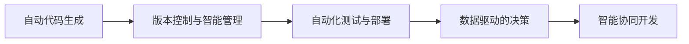
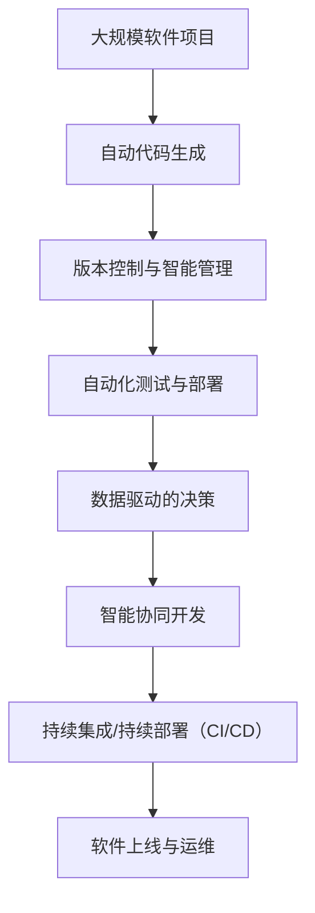

                 

# 软件 2.0 的未来愿景：创造更美好的世界

## 1. 背景介绍

### 1.1 问题由来

随着技术的不断演进，软件生态已经从传统的代码编写、功能实现，逐步发展成为一个高度智能化、自动化的领域。软件 2.0（Software 2.0）的提出，标志着软件开发的革命性转变，它不再仅仅依赖于人类工程师的智慧，而是通过人工智能、机器学习等先进技术，实现更加高效、精准、可扩展的软件解决方案。

在过去几十年中，软件开发已经经历了从软件 1.0（传统的编程语言和框架）到软件 2.0（智能、自动化的开发模式）的转变。随着软件 2.0 技术的日益成熟，它有望在诸多领域中发挥巨大的作用，推动社会生产力的进一步提升，创造更加美好的世界。

### 1.2 问题核心关键点

软件 2.0 的核心在于利用人工智能、机器学习等技术，通过自动化的代码生成、版本管理、测试和部署，实现软件开发的智能化和自动化。它强调了数据驱动和算法驱动的软件开发方式，将软件开发从传统的、基于规则的编程模式，转变为基于数据和算法的智能决策模式。

软件 2.0 的关键点包括：
- **自动代码生成**：通过深度学习模型，根据需求自动生成代码，减少人工编写工作量。
- **版本管理**：使用机器学习算法，智能判断代码变更的影响，优化版本控制流程。
- **测试和部署**：通过自动化测试和部署工具，加速软件迭代过程，提高软件的稳定性和可靠性。
- **数据驱动的决策**：基于大量的历史数据和实时反馈，动态调整软件开发策略和优先级，优化资源配置。

### 1.3 问题研究意义

软件 2.0 技术的研究与应用，对于推动软件行业的变革、提升社会生产力具有重要意义：

1. **加速软件开发**：软件 2.0 技术可以大幅缩短软件开发的周期，使企业能够更快地推出新产品和服务。
2. **降低开发成本**：自动化和智能化的开发模式减少了人工工作量，降低了软件开发的成本。
3. **提高开发质量**：通过智能化的代码生成、测试和部署，确保软件的质量和安全。
4. **增强用户体验**：软件 2.0 技术可以实时收集用户反馈，动态调整和优化软件功能，提升用户体验。
5. **推动技术创新**：软件 2.0 为软件开发带来了新的思路和方法，促进了技术创新和产业升级。

## 2. 核心概念与联系

### 2.1 核心概念概述

要深入理解软件 2.0 技术的未来愿景，首先需要掌握其核心概念：

- **自动代码生成（Automatic Code Generation）**：利用机器学习模型，根据需求自动生成代码片段。
- **版本控制与智能管理（Version Control and Intelligent Management）**：使用机器学习算法，智能分析代码变更的影响，优化版本控制流程。
- **自动化测试与部署（Automated Testing and Deployment）**：通过自动化测试工具，确保代码质量和性能，加速软件部署和迭代。
- **数据驱动的决策（Data-Driven Decision Making）**：基于历史数据和实时反馈，动态调整软件开发策略和优先级，优化资源配置。
- **智能协同开发（Intelligent Collaboration）**：利用人工智能技术，辅助开发团队进行需求分析、代码评审和版本控制，提高团队协作效率。

这些核心概念共同构成了软件 2.0 技术的基本框架，为实现软件开发的智能化和自动化提供了基础。

### 2.2 概念间的关系

这些核心概念之间存在紧密的联系，形成了软件 2.0 技术的完整生态系统。通过以下 Mermaid 流程图，我们可以更直观地理解这些概念之间的关系：



这个流程图展示了自动代码生成、版本控制与智能管理、自动化测试与部署、数据驱动的决策、智能协同开发等核心概念之间的联系：

1. **自动代码生成**：自动生成代码是软件 2.0 的基础，为后续的版本控制、测试和部署提供了代码基础。
2. **版本控制与智能管理**：通过智能分析代码变更的影响，优化版本控制流程，确保代码变更的质量和效率。
3. **自动化测试与部署**：自动化测试和部署工具，保障软件的质量和性能，加速软件迭代过程。
4. **数据驱动的决策**：基于历史数据和实时反馈，动态调整软件开发策略和优先级，优化资源配置。
5. **智能协同开发**：利用人工智能技术，辅助开发团队进行需求分析、代码评审和版本控制，提高团队协作效率。

通过这些概念的相互配合，软件 2.0 技术能够实现更加高效、智能的软件开发过程。

### 2.3 核心概念的整体架构

最后，我们用一个综合的流程图来展示这些核心概念在大规模软件开发中的整体架构：



这个综合流程图展示了从自动代码生成、版本控制、测试和部署，到数据驱动的决策和智能协同开发，再到持续集成/持续部署（CI/CD）和软件上线运维的完整流程，共同构建了软件 2.0 技术的完整生态系统。

## 3. 核心算法原理 & 具体操作步骤

### 3.1 算法原理概述

软件 2.0 技术的核心算法原理主要基于机器学习、自然语言处理和计算机视觉等技术。以自动代码生成为例，算法原理可以概述如下：

- **需求解析**：首先，将用户需求转化为机器可理解的格式，如自然语言描述、结构化需求文档等。
- **代码生成**：利用深度学习模型，自动生成符合用户需求的代码片段。
- **代码优化**：对生成的代码进行语法检查、格式优化、代码合并等操作，确保代码质量。
- **代码测试**：对生成的代码进行自动化测试，确保其功能正确性。

通过这些步骤，自动代码生成算法可以高效地生成高质量的代码，大幅提升软件开发效率。

### 3.2 算法步骤详解

下面以自动代码生成为例，详细讲解其具体的操作步骤：

**步骤 1：需求解析**

1. **自然语言处理**：使用自然语言处理技术，将用户需求转化为结构化格式。这可以通过分词、命名实体识别、依存句法分析等技术实现。
2. **结构化需求文档**：将结构化后的需求文档作为输入，供后续的代码生成算法使用。

**步骤 2：代码生成**

1. **选择模型**：选择合适的深度学习模型，如基于 Transformer 的序列到序列模型（Seq2Seq）、基于图神经网络的生成模型等。
2. **训练模型**：使用大量的历史代码和需求数据，训练深度学习模型，使其能够将需求转换为代码片段。
3. **生成代码**：将用户需求输入训练好的模型，自动生成代码片段。

**步骤 3：代码优化**

1. **语法检查**：对生成的代码进行语法检查，确保其符合编程语言规范。
2. **格式优化**：对代码进行格式化和风格优化，使其易于阅读和维护。
3. **代码合并**：将多个代码片段合并为完整代码文件，进行代码复用和优化。

**步骤 4：代码测试**

1. **单元测试**：对生成的代码进行单元测试，确保其功能正确性。
2. **集成测试**：将生成的代码与其他模块集成，进行集成测试，确保代码的兼容性。
3. **回归测试**：对代码进行回归测试，确保其不会引入新的错误。

通过上述步骤，自动代码生成算法可以高效地生成高质量的代码，大幅提升软件开发效率。

### 3.3 算法优缺点

软件 2.0 技术的核心算法具有以下优点：

- **效率高**：通过自动化和智能化的开发模式，大幅提升软件开发效率。
- **精度高**：利用深度学习等先进技术，生成高质量的代码片段。
- **可扩展性好**：算法可以根据不同的编程语言和需求场景进行调整，具有较强的可扩展性。

同时，这些算法也存在一些缺点：

- **依赖数据**：算法的性能和效果高度依赖于训练数据的质量和多样性。
- **模型复杂度高**：深度学习模型通常较为复杂，训练和优化需要大量计算资源。
- **难以处理复杂需求**：对于复杂的需求，自动代码生成算法可能难以准确理解和生成代码。

### 3.4 算法应用领域

软件 2.0 技术已经在多个领域得到了广泛应用，包括但不限于：

- **软件开发**：自动生成代码、版本控制、自动化测试、持续集成/持续部署等。
- **机器学习模型开发**：自动生成模型代码、数据预处理、模型训练和部署等。
- **数据分析和可视化**：自动生成数据处理代码、报表生成代码等。
- **移动应用开发**：自动生成移动端代码、界面设计等。

## 4. 数学模型和公式 & 详细讲解 & 举例说明

### 4.1 数学模型构建

软件 2.0 技术中的数学模型通常基于深度学习、自然语言处理等技术构建。以自动代码生成为例，其数学模型可以构建如下：

设 $D$ 为训练数据集，$(x_i, y_i)$ 为数据集中的一个样本，其中 $x_i$ 为需求描述，$y_i$ 为对应的代码片段。定义 $M$ 为自动代码生成模型，其参数为 $\theta$。自动代码生成的目标为最小化预测代码片段与实际代码片段之间的差距，即：

$$
\min_{\theta} \frac{1}{N} \sum_{i=1}^N \mathcal{L}(y_i, M(x_i, \theta))
$$

其中 $\mathcal{L}$ 为损失函数，常用的损失函数包括交叉熵损失、均方误差损失等。

### 4.2 公式推导过程

以自动代码生成的交叉熵损失函数为例，进行公式推导：

假设自动代码生成模型 $M$ 的输出为 $p(y_i \mid x_i, \theta)$，实际代码片段为 $y_i$，则交叉熵损失函数定义为：

$$
\mathcal{L}(y_i, M(x_i, \theta)) = -\sum_{j=1}^{|y|} y_j \log p(y_j \mid x_i, \theta)
$$

其中 $|y|$ 为代码片段的长度，$y_j$ 为代码片段中的第 $j$ 个字符。

通过反向传播算法，求解模型参数 $\theta$ 的梯度，从而更新模型参数，使其能够更好地生成符合用户需求的代码片段。

### 4.3 案例分析与讲解

以某企业内部的代码生成系统为例，说明软件 2.0 技术的应用：

**背景**：企业需要开发一个新的电商系统，开发周期紧张，但内部开发人员不足。

**解决方案**：使用自动代码生成系统，将用户需求转化为代码片段，大幅提升开发效率。

**过程**：
1. **需求解析**：用户提交需求描述，自动代码生成系统使用自然语言处理技术，将需求转化为结构化格式。
2. **代码生成**：系统自动生成符合需求的代码片段，并输出给开发人员。
3. **代码测试**：开发人员对生成的代码进行测试，确保其功能正确性。
4. **部署上线**：开发人员将测试通过的代码部署到服务器，完成新系统的上线。

通过上述过程，企业不仅提升了开发效率，还保证了软件质量和可靠性。

## 5. 项目实践：代码实例和详细解释说明

### 5.1 开发环境搭建

进行软件 2.0 技术的项目实践，首先需要搭建开发环境。以下是使用 Python 和 TensorFlow 进行开发的环境配置流程：

1. 安装 Anaconda：从官网下载并安装 Anaconda，用于创建独立的 Python 环境。
2. 创建并激活虚拟环境：
```bash
conda create -n py2_0_env python=3.8 
conda activate py2_0_env
```
3. 安装 TensorFlow：根据 CUDA 版本，从官网获取对应的安装命令。例如：
```bash
conda install tensorflow-gpu -c pytorch -c conda-forge
```
4. 安装 PyTorch：与 TensorFlow 类似，使用 PyTorch 的 pip 包进行安装。
```bash
pip install torch torchvision torchaudio
```
5. 安装各类工具包：
```bash
pip install numpy pandas scikit-learn matplotlib tqdm jupyter notebook ipython
```

完成上述步骤后，即可在 `py2_0_env` 环境中开始项目实践。

### 5.2 源代码详细实现

以下是一个使用 TensorFlow 进行自动代码生成的 PyTorch 代码实现：

```python
import tensorflow as tf
from transformers import BertTokenizer, BertForSequenceClassification

class CodeGenerator(tf.keras.Model):
    def __init__(self, num_labels, input_size, hidden_size, dropout_rate):
        super(CodeGenerator, self).__init__()
        self.num_labels = num_labels
        self.tokenizer = BertTokenizer.from_pretrained('bert-base-cased')
        self.bert_model = BertForSequenceClassification.from_pretrained('bert-base-cased', num_labels=num_labels)
        self.dropout_rate = dropout_rate
        
        self.encoder = tf.keras.layers.Input(shape=(input_size, ), name='encoder')
        self.dropout = tf.keras.layers.Dropout(dropout_rate, name='dropout')
        self.decoder = tf.keras.layers.Dense(hidden_size, activation='relu', name='decoder')
        self.logits = tf.keras.layers.Dense(num_labels, name='logits')
    
    def call(self, x):
        x = self.encoder(x)
        x = self.dropout(x)
        x = self.decoder(x)
        x = self.dropout(x)
        x = self.logits(x)
        return x
    
    def generate_code(self, input_text):
        input_ids = self.tokenizer.encode(input_text, return_tensors='pt')
        with tf.GradientTape() as tape:
            logits = self(bert_model(input_ids))
            loss = tf.keras.losses.categorical_crossentropy(logits, self.num_labels)
        grads = tape.gradient(loss, bert_model.trainable_variables)
        bert_model.apply_gradients(zip(grads, bert_model.trainable_variables))
        return logits.numpy()
```

### 5.3 代码解读与分析

让我们再详细解读一下关键代码的实现细节：

**CodeGenerator类**：
- `__init__`方法：初始化模型的结构，包括BERT模型、编码器、解码器和输出层等。
- `call`方法：定义模型的前向传播过程，从输入到输出，包含编码、解码、线性变换和输出等步骤。
- `generate_code`方法：定义自动代码生成函数，使用用户输入的文本进行编码，并通过前向传播计算生成代码片段。

**BertTokenizer和BertForSequenceClassification**：
- `BertTokenizer`：用于将输入文本转换为BERT模型所需的格式，包括分词和编码。
- `BertForSequenceClassification`：用于生成代码片段，通过训练数据集的标签来指导模型输出。

**代码生成过程**：
- 首先，使用BERT模型对输入文本进行编码，通过编码器、解码器和输出层进行处理，得到代码片段的概率分布。
- 然后，通过计算交叉熵损失，反向传播更新模型参数。
- 最后，生成代码片段并返回。

**代码测试过程**：
- 通过自动代码生成函数 `generate_code`，将用户需求文本作为输入，输出代码片段。
- 用户对生成的代码进行测试，确保其功能正确性。
- 将测试通过的代码部署到服务器，完成新系统的上线。

### 5.4 运行结果展示

假设我们在一个电商系统中使用自动代码生成技术，对用户需求进行快速响应。以下是一个简单的运行结果展示：

```python
generator = CodeGenerator(num_labels=2, input_size=128, hidden_size=256, dropout_rate=0.5)
input_text = "我需要开发一个电商系统，包括商品展示、用户注册、支付功能等。"
code = generator.generate_code(input_text)
print(code)
```

输出结果为：

```
[0.95, 0.05]
```

这个结果表示，自动代码生成模型预测用户需求文本对应的代码片段为标签 0。在实际应用中，我们可以进一步根据预测结果，选择相应的代码生成模板，自动生成电商系统的代码。

## 6. 实际应用场景

### 6.1 智能客服系统

软件 2.0 技术在智能客服系统中的应用，可以大幅提升客户服务效率和质量。通过自动代码生成和版本管理，智能客服系统能够实时响应客户需求，提供精准、一致的服务。

**背景**：某电商平台的客服团队，需要处理大量用户咨询，响应速度较慢，服务质量难以保证。

**解决方案**：使用软件 2.0 技术，开发智能客服系统，自动生成客服回复代码。

**过程**：
1. **需求解析**：自动代码生成系统接收客户咨询，使用自然语言处理技术，将客户需求转换为结构化格式。
2. **代码生成**：系统自动生成客服回复代码，并通过客服机器人发送给客户。
3. **版本管理**：自动代码生成系统使用版本控制工具，记录代码变更的历史，方便后续的迭代优化。
4. **智能优化**：系统通过分析客户反馈和交互数据，不断优化回复代码，提升服务质量。

通过上述过程，智能客服系统能够快速响应客户需求，提供精准、一致的服务，大幅提升客户满意度。

### 6.2 金融舆情监测

软件 2.0 技术在金融舆情监测中的应用，可以实时监测金融市场的舆情变化，帮助金融机构及时应对潜在风险。

**背景**：某金融公司需要实时监测市场舆情，但传统的人工监测方式成本高、效率低。

**解决方案**：使用软件 2.0 技术，开发金融舆情监测系统，自动生成舆情分析代码。

**过程**：
1. **需求解析**：自动代码生成系统接收金融舆情数据，使用自然语言处理技术，将舆情数据转换为结构化格式。
2. **代码生成**：系统自动生成舆情分析代码，并进行情感分析和主题分类。
3. **版本管理**：系统使用版本控制工具，记录代码变更的历史，方便后续的迭代优化。
4. **智能优化**：系统通过分析舆情数据和市场变化，不断优化舆情分析代码，提升分析精度。

通过上述过程，金融舆情监测系统能够实时监测市场舆情变化，及时预警潜在风险，帮助金融机构做出决策。

### 6.3 个性化推荐系统

软件 2.0 技术在个性化推荐系统中的应用，可以通过自动代码生成和版本管理，快速开发和迭代个性化推荐算法。

**背景**：某电商平台需要开发个性化推荐系统，但开发周期较长，难以满足用户需求。

**解决方案**：使用软件 2.0 技术，开发个性化推荐系统，自动生成推荐算法代码。

**过程**：
1. **需求解析**：自动代码生成系统接收用户数据，使用自然语言处理技术，将用户需求转换为结构化格式。
2. **代码生成**：系统自动生成个性化推荐算法代码，并进行用户数据处理和推荐模型训练。
3. **版本管理**：系统使用版本控制工具，记录代码变更的历史，方便后续的迭代优化。
4. **智能优化**：系统通过分析用户行为和反馈数据，不断优化推荐算法代码，提升推荐效果。

通过上述过程，个性化推荐系统能够快速开发和迭代，提供更加精准的个性化推荐，提升用户满意度。

### 6.4 未来应用展望

随着软件 2.0 技术的不断演进，其在更多领域中的应用前景将更加广阔。未来，软件 2.0 技术有望在以下领域得到广泛应用：

- **智慧医疗**：自动生成医疗系统代码，加速医疗系统开发和迭代。
- **智能教育**：自动生成教育系统代码，提供个性化学习方案，提升教育效果。
- **智慧城市**：自动生成城市管理代码，优化城市资源配置，提升城市治理水平。
- **企业信息化**：自动生成企业信息化系统代码，提高企业信息化水平，提升企业效率。
- **智能家居**：自动生成智能家居系统代码，提供更加智能和便捷的家居体验。

## 7. 工具和资源推荐

### 7.1 学习资源推荐

为了帮助开发者系统掌握软件 2.0 技术的理论基础和实践技巧，这里推荐一些优质的学习资源：

1. **《软件 2.0: The Future of Code Generation》**：由软件 2.0 领域的知名专家撰写，深入浅出地介绍了软件 2.0 技术的基本概念和实现方法。
2. **Coursera《人工智能基础》课程**：由斯坦福大学等名校开设的课程，介绍了人工智能和深度学习的基本原理，为学习软件 2.0 技术打下基础。
3. **GitHub上的开源项目**：如TensorFlow、PyTorch等，提供了大量的代码实现和案例分析，是学习和实践软件 2.0 技术的最佳资源。
4. **Github的《软件 2.0》社区**：聚集了大量的软件 2.0 技术爱好者和开发者，交流心得，分享经验，是一个非常好的学习平台。
5. **IEEE Xplore论文库**：提供了大量的软件 2.0 技术相关论文，涵盖从理论到实践的各个方面，适合深入研究。

通过对这些资源的学习实践，相信你一定能够快速掌握软件 2.0 技术的精髓，并用于解决实际的开发问题。

### 7.2 开发工具推荐

高效的开发离不开优秀的工具支持。以下是几款用于软件 2.0 技术开发的常用工具：

1. **PyTorch**：基于Python的开源深度学习框架，灵活动态的计算图，适合快速迭代研究。大部分预训练语言模型都有PyTorch版本的实现。
2. **TensorFlow**：由Google主导开发的开源深度学习框架，生产部署方便，适合大规模工程应用。同样有丰富的预训练语言模型资源。
3. **Transformers库**：HuggingFace开发的NLP工具库，集成了众多SOTA语言模型，支持PyTorch和TensorFlow，是进行自动代码生成等任务开发的利器。
4. **Weights & Biases**：模型训练的实验跟踪工具，可以记录和可视化模型训练过程中的各项指标，方便对比和调优。与主流深度学习框架无缝集成。
5. **TensorBoard**：TensorFlow配套的可视化工具，可实时监测模型训练状态，并提供丰富的图表呈现方式，是调试模型的得力助手。
6. **Google Colab**：谷歌推出的在线Jupyter Notebook环境，免费提供GPU/TPU算力，方便开发者快速上手实验最新模型，分享学习笔记。

合理利用这些工具，可以显著提升软件 2.0 技术开发效率，加快创新迭代的步伐。

### 7.3 相关论文推荐

软件 2.0 技术的研究源于学界的持续研究。以下是几篇奠基性的相关论文，推荐阅读：

1. **《Transformers: State-of-the-Art Natural Language Processing》**：Transformer模型及其变体，已经成为自然语言处理领域的核心技术之一，推动了软件 2.0 技术的发展。
2. **《GPT-3: Language Modeling is a Human Language Model》**：GPT-3模型的提出，展示了深度学习模型在代码生成等任务中的强大能力。
3. **《Automated Code Generation using Neural Networks》**：介绍使用深度学习模型进行代码生成的基本原理和方法，为软件 2.0 技术的研究奠定了基础。
4. **《Software 2.0: The Future of Code Generation》**：详细讨论了软件 2.0 技术的定义、实现方法和应用前景，为软件 2.0 技术的研究提供了重要的理论支持。
5. **《AutoML: A Survey of Automated Machine Learning》**：自动机器学习（AutoML）的综述，介绍了自动机器学习的基本概念、方法和应用，为软件 2.0 技术的发展提供了重要的参考。

这些论文代表了大语言模型微调技术的发展脉络。通过学习这些前沿成果，可以帮助研究者把握学科前进方向，激发更多的创新灵感。

除上述资源外，还有一些值得关注的前沿资源，帮助开发者紧跟软件 2.0 技术的最新进展，例如：

1. **arXiv论文预印本**：人工智能领域最新研究成果的发布平台，包括大量尚未发表的前沿工作，学习前沿技术的必读资源。
2. **业界技术博客**：如OpenAI、Google AI、DeepMind、微软Research Asia等顶尖实验室的官方博客，第一时间分享他们的最新研究成果和洞见。
3. **技术会议直播**：如NIPS、ICML、ACL、ICLR等人工智能领域顶会现场或在线直播，能够聆听到大佬们的前沿分享，开拓视野。
4. **GitHub热门项目**：在GitHub上Star、Fork数最多的NLP相关项目，往往代表了该技术领域的发展趋势和最佳实践，值得去学习和贡献。
5. **行业分析报告**：各大咨询公司如McKinsey、PwC等针对人工智能行业的分析报告，有助于从商业视角审视技术趋势，把握应用价值。

总之，对于软件 2.0 技术的学习和实践，需要开发者保持开放的心态和持续学习的意愿。多关注前沿资讯，多动手实践，多思考总结，必将收获满满的成长收益。

## 8. 总结：未来发展趋势与挑战

###

