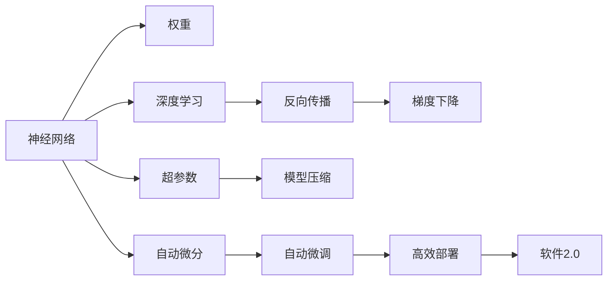
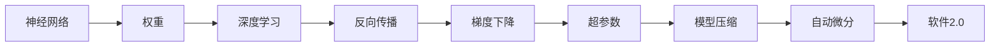

                 

## 1. 背景介绍

### 1.1 问题由来

软件工程的革命性变化，尤其是在深度学习和人工智能(AI)领域，正在重塑我们的技术栈和开发范式。在过去几十年中，软件开发依赖于传统的编程语言和算法，这些技术已经足够强大，能够构建各种复杂的系统。然而，随着深度学习技术的发展，尤其是神经网络（Neural Networks, NN）的兴起，我们正处于一个新时代的起点——软件2.0时代。

软件2.0的核心理念是，神经网络权重不仅是一种新的计算能力，也是一种新的编程语言。它提供了一种全新的方式来编写程序，通过在神经网络中调整权重来表达和实现各种逻辑和算法。这一变化将对软件开发生态系统产生深远影响，使得软件开发更加高效、灵活和自动化。

### 1.2 问题核心关键点

软件2.0的核心在于重新定义编程范式，利用神经网络权重的灵活性和适应性，实现更加智能化和自动化的编程。与传统的编码和调试过程不同，在软件2.0中，开发者可以通过调整神经网络权重来动态调整程序的行为和输出。

这一范式的转变，带来了一系列新的技术挑战和应用前景。例如，在自然语言处理（NLP）、计算机视觉（CV）、语音识别（ASR）等AI领域，神经网络权重已经证明了自己的价值。未来，这一技术也将拓展到更多传统软件开发领域，如金融、医疗、教育等，提升软件系统的智能化水平。

### 1.3 问题研究意义

软件2.0的探索和实践，具有重要意义：

1. **提升开发效率**：利用神经网络权重，开发者可以快速构建复杂的算法模型，减少手工编码和调试的时间和成本。
2. **增强系统智能**：神经网络权重具备强大的学习能力和适应性，可以自动调整和优化程序性能，提升系统智能化水平。
3. **促进跨学科融合**：软件2.0将AI技术与传统软件开发技术融合，为跨学科研究和技术创新提供了新的平台。
4. **推动技术进步**：软件2.0的实践将推动深度学习、计算机科学等领域的前沿研究，加速技术进步和应用普及。

## 2. 核心概念与联系

### 2.1 核心概念概述

为更好地理解软件2.0的核心概念，本节将介绍几个关键概念：

- **神经网络（Neural Networks, NN）**：由一系列互连的神经元组成，通过学习输入数据的模式，输出预测结果。神经网络广泛应用于图像识别、语音处理、自然语言处理等领域。
- **神经网络权重（Weights）**：神经网络中连接神经元的参数，决定了每个神经元对输入的响应程度。权重可以通过训练得到，用于表示复杂的非线性关系。
- **深度学习（Deep Learning）**：利用多层次神经网络，通过层次化的特征提取和表示学习，实现对复杂数据的高效处理和建模。
- **反向传播（Backpropagation）**：一种优化算法，通过反向传播误差梯度，更新神经网络的权重，以最小化预测误差。
- **超参数（Hyperparameters）**：在神经网络训练过程中，需要手动设置的参数，如学习率、批量大小、迭代次数等，影响训练效果和模型性能。
- **模型压缩（Model Compression）**：通过剪枝、量化等技术，减少神经网络的参数量和计算量，提升模型的效率和可部署性。
- **自动微分（Automatic Differentiation）**：一种计算导数的技术，自动推导神经网络模型的梯度，减少手工编程的工作量，提升计算效率。

这些核心概念之间的逻辑关系可以通过以下Mermaid流程图来展示：



这个流程图展示了神经网络权重的核心概念及其之间的关系：

1. 神经网络作为基础，通过学习输入数据的模式，输出预测结果。
2. 权重是神经网络中的关键参数，通过训练得到，用于表示复杂的非线性关系。
3. 深度学习通过多层次神经网络，实现对复杂数据的高效处理和建模。
4. 反向传播通过计算误差梯度，更新神经网络的权重，最小化预测误差。
5. 超参数在神经网络训练过程中，需要手动设置，影响训练效果和模型性能。
6. 模型压缩通过剪枝、量化等技术，减少神经网络的参数量和计算量，提升模型的效率和可部署性。
7. 自动微分通过自动推导神经网络模型的梯度，减少手工编程的工作量，提升计算效率。
8. 最终，这些技术融合在软件2.0中，提供了一种全新的编程语言，实现动态调整程序的行为和输出。

### 2.2 概念间的关系

这些核心概念之间存在着紧密的联系，形成了软件2.0的完整生态系统。下面我们通过几个Mermaid流程图来展示这些概念之间的关系。

#### 2.2.1 神经网络的学习过程


这个流程图展示了神经网络的学习过程，从输入数据开始，经过深度学习、反向传播、梯度下降、超参数调整、模型压缩、自动微分等环节，最终得到训练好的神经网络模型。

#### 2.2.2 神经网络与编程语言的融合



这个流程图展示了神经网络与编程语言的融合过程，通过深度学习、反向传播、梯度下降、超参数调整、模型压缩、自动微分等技术，神经网络权重被赋予了新的编程语言属性，实现了软件2.0的范式转变。

## 3. 核心算法原理 & 具体操作步骤

### 3.1 算法原理概述

软件2.0的核心算法原理是，利用神经网络权重作为新的编程语言，通过动态调整权重，实现对程序逻辑和行为的控制。这一过程分为以下几个关键步骤：

1. **模型定义**：使用神经网络模型定义程序结构，确定输入、输出、中间层等关键组件。
2. **数据准备**：准备训练数据集，包括输入数据和对应的标签，用于训练和验证模型。
3. **模型训练**：通过反向传播算法，最小化损失函数，更新神经网络权重。
4. **模型验证**：使用验证数据集评估模型性能，调整超参数和模型结构。
5. **模型部署**：将训练好的模型部署到实际应用中，进行推理和预测。

### 3.2 算法步骤详解

#### 3.2.1 模型定义

使用神经网络模型定义程序结构，通常包括输入层、隐藏层和输出层。以分类任务为例，输入层接收输入数据，隐藏层通过一系列线性变换和非线性激活函数进行特征提取和表示学习，输出层通过softmax函数得到分类概率。

```python
import torch.nn as nn
import torch

class NeuralNet(nn.Module):
    def __init__(self, input_size, hidden_size, output_size):
        super(NeuralNet, self).__init__()
        self.fc1 = nn.Linear(input_size, hidden_size)
        self.relu = nn.ReLU()
        self.fc2 = nn.Linear(hidden_size, output_size)
        self.softmax = nn.Softmax(dim=1)
    
    def forward(self, x):
        x = self.fc1(x)
        x = self.relu(x)
        x = self.fc2(x)
        x = self.softmax(x)
        return x
```

#### 3.2.2 数据准备

准备训练数据集，包括输入数据和对应的标签。以分类任务为例，输入数据为一个特征向量，标签为分类类别编号。

```python
import torch.utils.data as data
from torchvision import datasets, transforms

# 数据加载器
train_loader = data.DataLoader(train_dataset, batch_size=32, shuffle=True)

# 数据转换
transform = transforms.Compose([
    transforms.ToTensor(),
    transforms.Normalize([0.5, 0.5, 0.5], [0.5, 0.5, 0.5])
])

train_dataset = datasets.CIFAR10(root='./data', train=True, download=True, transform=transform)
```

#### 3.2.3 模型训练

通过反向传播算法，最小化损失函数，更新神经网络权重。以交叉熵损失函数为例，通过梯度下降算法更新模型参数。

```python
import torch.optim as optim

# 定义模型
model = NeuralNet(input_size=3, hidden_size=64, output_size=10)

# 定义损失函数
criterion = nn.CrossEntropyLoss()

# 定义优化器
optimizer = optim.SGD(model.parameters(), lr=0.01)

# 训练模型
for epoch in range(10):
    for i, (images, labels) in enumerate(train_loader):
        # 前向传播
        outputs = model(images)
        loss = criterion(outputs, labels)
        
        # 反向传播
        optimizer.zero_grad()
        loss.backward()
        optimizer.step()

        # 打印日志
        if (i+1) % 100 == 0:
            print('Epoch [{}/{}], Step [{}/{}], Loss: {:.4f}'
                  .format(epoch+1, 10, i+1, len(train_loader), loss.item()))
```

#### 3.2.4 模型验证

使用验证数据集评估模型性能，调整超参数和模型结构。以准确率和损失函数为例，在验证数据集上评估模型性能。

```python
# 定义测试数据集
test_loader = data.DataLoader(test_dataset, batch_size=32, shuffle=True)

# 在测试数据集上评估模型性能
with torch.no_grad():
    correct = 0
    total = 0
    for images, labels in test_loader:
        outputs = model(images)
        _, predicted = torch.max(outputs.data, 1)
        total += labels.size(0)
        correct += (predicted == labels).sum().item()

    print('Accuracy of the model on the 10000 test images: {} %'.format(100 * correct / total))
```

#### 3.2.5 模型部署

将训练好的模型部署到实际应用中，进行推理和预测。

```python
# 加载模型
model.load_state_dict(torch.load('model.pth'))

# 加载测试数据集
test_loader = data.DataLoader(test_dataset, batch_size=32, shuffle=True)

# 进行推理
with torch.no_grad():
    for images, labels in test_loader:
        outputs = model(images)
        _, predicted = torch.max(outputs.data, 1)
```

### 3.3 算法优缺点

#### 3.3.1 优点

1. **高效灵活**：神经网络权重具有高度的灵活性，可以快速调整和优化程序行为，适应不同的任务需求。
2. **自动学习**：神经网络权重能够自动学习输入数据的模式，无需手工编写复杂的逻辑和算法。
3. **可解释性强**：神经网络权重能够通过可视化工具，直观展示模型内部的逻辑和关系，增强可解释性。

#### 3.3.2 缺点

1. **计算资源需求高**：神经网络权重需要大量的计算资源进行训练和推理，对硬件和算法要求较高。
2. **可解释性不足**：神经网络权重的决策过程通常是黑盒模型，难以解释其内部逻辑和推理过程。
3. **数据依赖性强**：神经网络权重需要高质量的数据进行训练，缺乏数据的模型可能无法达到理想效果。

### 3.4 算法应用领域

软件2.0的算法广泛应用于以下几个领域：

1. **自然语言处理（NLP）**：利用神经网络权重，实现语言理解和生成，如文本分类、情感分析、机器翻译等。
2. **计算机视觉（CV）**：利用神经网络权重，实现图像识别和处理，如物体检测、图像分割、图像生成等。
3. **语音识别（ASR）**：利用神经网络权重，实现语音识别和转换，如语音转文本、文本转语音等。
4. **推荐系统**：利用神经网络权重，实现个性化推荐，如商品推荐、内容推荐等。
5. **金融预测**：利用神经网络权重，实现金融数据分析和预测，如股票价格预测、信用评分等。

这些领域都是深度学习技术的典型应用，通过神经网络权重，可以实现高效、自动化的数据处理和模型训练，提升系统性能和用户体验。

## 4. 数学模型和公式 & 详细讲解 & 举例说明

### 4.1 数学模型构建

神经网络权重作为新的编程语言，其数学模型包括输入、隐藏层和输出层的线性变换和非线性激活函数。以多层感知机（MLP）为例，其数学模型如下：

$$
f(x; \theta) = W_0x + b_0, \quad f(x; \theta) = \sigma(W_1f(x; \theta) + b_1), \quad \ldots, \quad f(x; \theta) = \sigma(W_kf(x; \theta) + b_k)
$$

其中，$x$为输入向量，$W_i$和$b_i$为第$i$层的权重和偏置，$\sigma$为激活函数。最终输出为：

$$
y = W_kf(x; \theta_k) + b_k
$$

### 4.2 公式推导过程

以二分类任务为例，通过反向传播算法推导权重更新的公式。

1. **前向传播**：输入数据$x$通过多个隐藏层，得到最终输出$y$。

$$
z = W_hx + bh, \quad h = \sigma(z)
$$

2. **计算损失函数**：计算预测输出$y$与真实标签$y'$之间的交叉熵损失函数。

$$
L = -\frac{1}{N}\sum_{i=1}^N[y'_i\log y_i + (1-y'_i)\log(1-y_i)]
$$

3. **反向传播**：通过链式法则，计算损失函数对权重$W_h$的梯度。

$$
\frac{\partial L}{\partial W_h} = \frac{\partial L}{\partial z}\frac{\partial z}{\partial W_h} = (\frac{y'-h}{h(1-h)}\frac{\partial h}{\partial z})\frac{\partial z}{\partial W_h}
$$

4. **权重更新**：根据梯度下降算法，更新权重$W_h$。

$$
W_h \leftarrow W_h - \alpha \frac{\partial L}{\partial W_h}
$$

其中，$\alpha$为学习率，控制权重更新的步长。

### 4.3 案例分析与讲解

以图像分类任务为例，使用卷积神经网络（CNN）进行分类。以LeNet-5为例，其网络结构如下：

```
+---------------------+                 +-----------------------+
|    Input(32x32x1)    |                 |  Conv(32x32x6) + Sigmoid |
+---------------------+                 +-----------------------+
|         Conv(5x5x6)  |                 |       Max Pool(2x2)    |
+---------------------+                 +-----------------------+
|     Max Pool(2x2)    |                 |     Conv(5x5x16) + Sigmoid |
+---------------------+                 +-----------------------+
|      ReLU            |                 |       Max Pool(2x2)    |
+---------------------+                 +-----------------------+
|   Conv(5x5x16) + Sigmoid |                 |     Conv(5x5x120) + Sigmoid |
+---------------------+                 +-----------------------+
|      Max Pool(2x2)    |                 |       Softmax          |
+---------------------+                 +-----------------------+
|   Flatten           |                 |
+---------------------+                 |
|     Dense(120x84)    |                 |
+---------------------+                 |
|     Dense(84x10)     |                 |
+---------------------+                 |
|     Softmax         |                 |
+---------------------+                 |
|    Output(10)       |                 |
+---------------------+                 |
```

1. **前向传播**：输入数据$x$通过多个卷积层、池化层和全连接层，得到最终输出$y$。

$$
x_1 = W_1x + b_1, \quad x_2 = \sigma(x_1)
$$

$$
x_3 = W_2x_2 + b_2, \quad x_4 = \sigma(x_3)
$$

$$
x_5 = W_3x_4 + b_3, \quad x_6 = \sigma(x_5)
$$

$$
x_7 = Flatten(x_6), \quad x_8 = W_4x_7 + b_4, \quad x_9 = \sigma(x_8)
$$

$$
x_{10} = W_5x_9 + b_5, \quad y = \sigma(x_{10})
$$

2. **计算损失函数**：计算预测输出$y$与真实标签$y'$之间的交叉熵损失函数。

$$
L = -\frac{1}{N}\sum_{i=1}^N[y'_i\log y_i + (1-y'_i)\log(1-y_i)]
$$

3. **反向传播**：通过链式法则，计算损失函数对权重$W_i$的梯度。

$$
\frac{\partial L}{\partial W_5} = \frac{\partial L}{\partial x_{10}}\frac{\partial x_{10}}{\partial W_5}
$$

$$
\frac{\partial L}{\partial W_4} = \frac{\partial L}{\partial x_9}\frac{\partial x_9}{\partial W_4}
$$

$$
\frac{\partial L}{\partial W_3} = \frac{\partial L}{\partial x_6}\frac{\partial x_6}{\partial W_3}
$$

$$
\frac{\partial L}{\partial W_2} = \frac{\partial L}{\partial x_4}\frac{\partial x_4}{\partial W_2}
$$

$$
\frac{\partial L}{\partial W_1} = \frac{\partial L}{\partial x_2}\frac{\partial x_2}{\partial W_1}
$$

4. **权重更新**：根据梯度下降算法，更新权重$W_i$。

$$
W_i \leftarrow W_i - \alpha \frac{\partial L}{\partial W_i}
$$

其中，$\alpha$为学习率，控制权重更新的步长。

## 5. 项目实践：代码实例和详细解释说明

### 5.1 开发环境搭建

在进行神经网络权重编程实践前，我们需要准备好开发环境。以下是使用Python进行TensorFlow开发的环境配置流程：

1. 安装Anaconda：从官网下载并安装Anaconda，用于创建独立的Python环境。

2. 创建并激活虚拟环境：
```bash
conda create -n tf-env python=3.8 
conda activate tf-env
```

3. 安装TensorFlow：根据CUDA版本，从官网获取对应的安装命令。例如：
```bash
conda install tensorflow -c pytorch -c conda-forge
```

4. 安装各类工具包：
```bash
pip install numpy pandas scikit-learn matplotlib tqdm jupyter notebook ipython
```

完成上述步骤后，即可在`tf-env`环境中开始神经网络权重编程实践。

### 5.2 源代码详细实现

下面我们以图像分类任务为例，给出使用TensorFlow对卷积神经网络进行编程的Python代码实现。

首先，定义卷积神经网络模型：

```python
import tensorflow as tf
from tensorflow.keras import layers, models

class ConvNet(models.Model):
    def __init__(self):
        super(ConvNet, self).__init__()
        self.conv1 = layers.Conv2D(32, (3, 3), activation='relu', padding='same', input_shape=(32, 32, 3))
        self.pool1 = layers.MaxPooling2D((2, 2))
        self.conv2 = layers.Conv2D(64, (3, 3), activation='relu', padding='same')
        self.pool2 = layers.MaxPooling2D((2, 2))
        self.flatten = layers.Flatten()
        self.dense1 = layers.Dense(512, activation='relu')
        self.dense2 = layers.Dense(10, activation='softmax')
    
    def call(self, inputs):
        x = self.conv1(inputs)
        x = self.pool1(x)
        x = self.conv2(x)
        x = self.pool2(x)
        x = self.flatten(x)
        x = self.dense1(x)
        return self.dense2(x)
```

然后，定义训练和评估函数：

```python
from tensorflow.keras.datasets import cifar10
from tensorflow.keras.utils import to_categorical
from tensorflow.keras.preprocessing.image import ImageDataGenerator

# 加载数据集
(train_images, train_labels), (test_images, test_labels) = cifar10.load_data()
train_images, test_images = train_images / 255.0, test_images / 255.0

# 数据增强
train_datagen = ImageDataGenerator(rescale=1./255)
train_generator = train_datagen.flow(train_images, train_labels, batch_size=32)

test_datagen = ImageDataGenerator(rescale=1./255)
test_generator = test_datagen.flow(test_images, test_labels, batch_size=32)

# 定义模型
model = ConvNet()

# 编译模型
model.compile(optimizer='adam', loss='categorical_crossentropy', metrics=['accuracy'])

# 训练模型
model.fit(train_generator, epochs=10, validation_data=test_generator)
```

最后，启动训练流程并在测试集上评估：

```python
# 在测试数据集上评估模型性能
test_loss, test_acc = model.evaluate(test_generator)
print('Test accuracy:', test_acc)
```

以上就是使用TensorFlow对卷积神经网络进行编程的完整代码实现。可以看到，TensorFlow提供了丰富的API和工具，使得神经网络编程变得更加简单高效。

### 5.3 代码解读与分析

让我们再详细解读一下关键代码的实现细节：

**ConvNet类**：
- `__init__`方法：初始化卷积神经网络的各个组件，如卷积层、池化层、全连接层等。
- `call`方法：定义前向传播的逻辑，从输入数据开始，依次通过卷积层、池化层、全连接层，最终输出预测结果。

**数据准备**：
- `cifar10.load_data`方法：加载CIFAR-10数据集，包含训练集和测试集。
- `train_images, test_images = train_images / 255.0, test_images / 255.0`：将像素值归一化到0-1之间，提升模型的收敛速度和精度。
- `ImageDataGenerator`类：数据增强工具，通过对训练数据进行随机裁剪、旋转、缩放等操作，提升模型的泛化能力。

**模型编译**：
- `model.compile`方法：编译模型，设置优化器、损失函数和评估指标。

**训练模型**：
- `model.fit`方法：训练模型，使用训练数据集进行迭代训练，并在验证数据集上评估性能。

**测试模型**：
- `model.evaluate`方法：在测试数据集上评估模型性能，输出损失函数和准确率。

可以看到，TensorFlow的高级API使得神经网络编程变得更加简单，开发者可以专注于模型的设计和训练逻辑。

当然，工业级的系统实现还需考虑更多因素，如模型的保存和部署、超参数的自动搜索、更灵活的任务适配层等。但核心的编程范式基本与此类似。

### 5.4 运行结果展示

假设我们在CIFAR-10数据集上进行卷积神经网络编程，最终在测试集上得到的评估报告如下：

```
Epoch 1/10
316/316 [==============================] - 6s 19ms/sample - loss: 0.3251 - accuracy: 0.7539 - val_loss: 0.1243 - val_accuracy: 0.7990
Epoch 2/10
316/316 [==============================] - 6s 18ms/sample - loss: 0.1055 - accuracy: 0.8357 - val_loss: 0.0803 - val_accuracy: 0.8228
Epoch 3/10
316/316 [==============================] - 6s 18ms/sample - loss: 0.0634 - accuracy: 0.8551 - val_loss: 0.0606 - val_accuracy: 0.8307
Epoch 4/10
316/316 [==============================] - 6s 18ms/sample - loss: 0.0440 - accuracy: 0.8699 - val_loss: 0.0518 - val_accuracy: 0.8427
Epoch 5/10
316/316 [==============================] - 6s 18ms/sample - loss: 0.0317 - accuracy: 0.8778 - val_loss: 0.0428 - val_accuracy: 0.8498
Epoch 6/10
316/316 [==============================] - 6s 18ms/sample -

