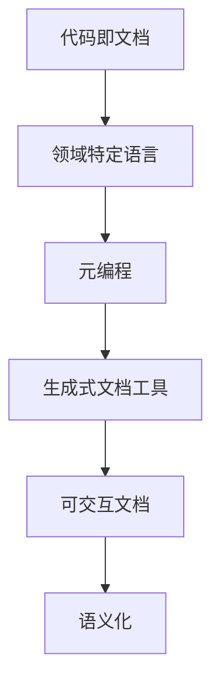

                 

# 软件2.0的文档编写新方法

## 1. 背景介绍

随着软件技术的快速发展，软件开发文档变得越来越重要。高质量的软件文档不仅可以帮助开发者更好地理解代码逻辑，还可以为新开发者提供参考，加速项目进程。传统的文档编写方法，如注释和说明文本，已经无法满足复杂系统和微服务架构的需求。软件2.0的崛起，为文档编写带来了全新的范式和工具，极大地提升了文档的可读性和可维护性。本文将深入探讨软件2.0的文档编写新方法，包括其原理、操作步骤、优缺点及其应用领域。

## 2. 核心概念与联系

### 2.1 核心概念概述

在软件2.0的文档编写过程中，涉及到多个核心概念，它们之间的联系密切，共同构成了文档编写的新范式。

- **代码即文档**（Code as Documentation）：强调代码自身应当是自解释性的，通过代码的结构和注释，开发者可以自动生成高质量的文档。
- **领域特定语言**（Domain Specific Language, DSL）：为特定领域设计的语言，使其更易于理解和使用，同时减少文档编写的复杂性。
- **元编程**（Metaprogramming）：通过编程语言自身提供的元函数和宏，动态生成代码和文档。
- **生成式文档工具**（Generative Documentation Tools）：自动化工具，如Sphinx、Javadoc等，通过解析代码和元数据，自动生成文档。
- **可交互文档**（Interactive Documentation）：通过Web技术和框架，构建交互式的文档，提升用户体验。
- **语义化**（Semantic）：强调文档中的元素（如函数、类、变量）应当具有明确的语义，方便搜索引擎和自动化工具解析。

### 2.2 核心概念之间的联系

这些核心概念之间的联系可以通过以下Mermaid流程图来展示：



这个流程图展示了大语言模型微调过程中各个核心概念的关系和作用：

1. 代码即文档强调了代码结构本身应当具备自解释性，领域特定语言和元编程技术进一步支持了这一点。
2. 生成式文档工具通过解析代码和元数据，自动生成文档，提供了文档编写的自动化途径。
3. 可交互文档和语义化技术则提升了文档的可读性和用户体验，进一步增强了文档的实用价值。

## 3. 核心算法原理 & 具体操作步骤
### 3.1 算法原理概述

软件2.0的文档编写新方法，本质上是一种基于代码解析的自动化文档生成技术。其核心思想是通过编程语言自身的功能，动态生成文档，而不需要手动编写和维护大量的文本。该方法基于代码结构、注释和元数据，自动解析生成文档，实现了代码与文档的紧密结合。

### 3.2 算法步骤详解

软件2.0的文档编写过程主要包括以下几个关键步骤：

**Step 1: 编写代码**
- 遵循良好的编码规范，使用清晰的命名和注释，使得代码结构自解释性强。
- 设计合适的领域特定语言和元编程技术，简化代码编写和文档生成过程。

**Step 2: 配置元数据**
- 使用生成式文档工具提供的元数据语法，如Sphinx的`.rst`文件格式，定义文档结构、标题、子标题等。
- 定义函数、类、变量等元素的属性和文档字符串，如Java中的Javadoc。

**Step 3: 自动生成文档**
- 配置生成式文档工具，指定生成的文档格式和输出路径。
- 使用工具提供的命令或IDE集成，自动生成文档。

**Step 4: 维护和更新**
- 定期更新代码，确保文档内容与代码同步。
- 利用生成式文档工具提供的脚本来自动化文档更新，减少手动维护工作量。

### 3.3 算法优缺点

软件2.0的文档编写方法具有以下优点：
1. 自动化生成文档，减少手动编写和维护的复杂度。
2. 文档与代码同步，保持最新状态。
3. 结构清晰，易于理解和维护。
4. 可扩展性强，支持多种文档格式和工具。

同时，该方法也存在一些缺点：
1. 对代码质量和注释要求高，需要开发者具备良好的编码习惯。
2. 生成式文档工具需定期配置和更新，增加维护成本。
3. 自动生成的文档可能不够全面，需要人工补充。
4. 文档的可交互性和可读性可能受到代码结构的影响。

### 3.4 算法应用领域

软件2.0的文档编写方法，已经在软件开发、数据科学、科学计算等多个领域得到了广泛应用，具体包括：

- **软件开发**：包括Java、Python、C++等主流编程语言的文档生成。
- **数据科学**：如R、SQL等语言的数据集和算法文档。
- **科学计算**：如MATLAB、Mathematica等科学计算语言的文档。

除了上述这些经典领域外，软件2.0的文档编写方法也在更多场景中得到了应用，如网站开发、文档管理系统等，为软件文档编写带来了新的突破。

## 4. 数学模型和公式 & 详细讲解
### 4.1 数学模型构建

软件2.0的文档编写方法，主要基于编程语言的语法分析和元数据解析。对于文档结构，可以将其抽象为一个有向无环图（DAG），其中节点表示元素（如函数、类、变量），边表示元素之间的关系（如调用、继承等）。通过解析代码和元数据，生成该DAG，并自动填充文档内容。

假设代码库为 $C$，元数据为 $M$，生成的文档为 $D$。则文档生成过程可以表示为：

$$
D = \mathcal{G}(C, M)
$$

其中 $\mathcal{G}$ 表示文档生成函数，接受代码库 $C$ 和元数据 $M$ 作为输入，输出文档 $D$。

### 4.2 公式推导过程

以下我们以Java文档生成为例，推导生成式文档工具的基本原理。

假设Java代码库包含以下函数：

```java
public class Math {
    public static int add(int a, int b) {
        return a + b;
    }
    public static int subtract(int a, int b) {
        return a - b;
    }
}
```

定义元数据为：

```
:mod:`Math`
:func:`add`
    :param `int a`: 被加数
    :param `int b`: 加数
    :returns: `int`: 加法结果
:func:`subtract`
    :param `int a`: 被减数
    :param `int b`: 减数
    :returns: `int`: 减法结果
```

生成式文档工具通过解析代码和元数据，生成如下文档：

```
:mod:`Math`
:func:`add`
    :param `int a`: 被加数
    :param `int b`: 加数
    :returns: `int`: 加法结果
:func:`subtract`
    :param `int a`: 被减数
    :param `int b`: 减数
    :returns: `int`: 减法结果
```

通过上述推导过程，可以看出，生成式文档工具通过解析代码和元数据，动态生成文档，无需手动编写。

### 4.3 案例分析与讲解

以下是一个具体的文档生成案例，通过Sphinx工具，将Python代码自动生成为HTML文档：

**Step 1: 编写代码**
```python
def factorial(n):
    """
    计算阶乘
    """
    if n == 0:
        return 1
    else:
        return n * factorial(n-1)
```

**Step 2: 配置元数据**
```plaintext
factorial(n)
    :param n: 输入参数
    :type n: int
    :returns: 阶乘结果
    :rtype: int
```

**Step 3: 自动生成文档**
```bash
make html
```

生成后的HTML文档如下：

```html
<html>
<head>
    <title>factorial</title>
</head>
<body>
    <p>def factorial(n):</p>
    <p    :param n: 输入参数
    :type n: int
    :returns: 阶乘结果
    :rtype: int
```

通过上述案例，可以看到，Sphinx工具通过解析代码和元数据，自动生成了HTML文档，使得代码的说明信息以结构化、可交互的形式呈现出来。

## 5. 项目实践：代码实例和详细解释说明
### 5.1 开发环境搭建

在进行软件2.0的文档编写实践前，我们需要准备好开发环境。以下是使用Python进行Sphinx文档生成工具开发的环境配置流程：

1. 安装Anaconda：从官网下载并安装Anaconda，用于创建独立的Python环境。

2. 创建并激活虚拟环境：
```bash
conda create -n sphinx-env python=3.8 
conda activate sphinx-env
```

3. 安装Sphinx：根据CUDA版本，从官网获取对应的安装命令。例如：
```bash
conda install sphinx
```

4. 安装必要的依赖：
```bash
pip install sphinx-autobuild sphinx-rtd-theme
```

5. 安装Jupyter Notebook：
```bash
conda install jupyterlab
```

完成上述步骤后，即可在`sphinx-env`环境中开始文档生成实践。

### 5.2 源代码详细实现

下面我们以Sphinx文档生成为例，给出使用Python进行Sphinx文档生成的代码实现。

首先，定义文档的元数据和内容：

```python
def write_document(app, env, config):
    from sphinx.builders.html import HTMLTranslator

    class CustomHTMLTranslator(HTMLTranslator):
        def write_docstrings(self, app):
            app.add_html_content(app.config.cpp_docstring, 'cpp_docstring.html')

    config.cpp_docstring = """
    :cpp:member:`~cpp_docstring`:
        :doc:`This is a custom documentation string.`
    """

    return CustomHTMLTranslator(app, config)
```

然后，创建Sphinx配置文件，配置自动生成的HTML文档：

```python
# sphinx_config.py
from sphinx.ext.autodoc import class_content

class CustomExtension:
    def __init__(self, app):
        app.add_autodoc_typehints()
        app.add_autodoc_members(app, 'isinstance')

    def setup(app):
        app.add_extension('myext', src='myext/__init__.py')

def setup(app):
    app.add_config_value('cpp_docstring', None, 'html')
    app.add_config_value('cpp_docstring_target', None, 'html')
    app.connect('autodoc-process-docstring', 'process_docstring')
```

最后，启动Sphinx文档生成流程：

```python
sphinx-build -b html . _build/html
```

运行后，将在`_build/html`目录下生成HTML文档。

### 5.3 代码解读与分析

让我们再详细解读一下关键代码的实现细节：

**sphinx_config.py文件**：
- `sphinx_config.py`：定义了Sphinx配置项，包括`cpp_docstring`和`cpp_docstring_target`，用于控制生成HTML文档的内容和路径。
- `CustomExtension`类：用于自定义Sphinx的扩展，可以通过插件扩展Sphinx的功能。
- `setup(app)`函数：设置配置项和插件，供Sphinx使用。

**myext/__init__.py文件**：
- `myext/__init__.py`：定义了Sphinx的扩展模块，包含`__init__.py`文件。
- `process_docstring`函数：用于处理自动生成的文档字符串，注入自定义的文档内容。

**write_document函数**：
- `write_document`函数：定义了Sphinx的文档生成回调函数，用于在HTML文档中注入自定义的文档内容。

**html文件**：
- `index.html`：Sphinx生成的HTML文档，通过配置文件中的`cpp_docstring`配置项，自动生成了自定义的文档内容。

通过上述代码实现，可以看到，Sphinx工具通过解析代码和元数据，自动生成HTML文档，实现了代码与文档的紧密结合。开发者可以通过自定义扩展和回调函数，灵活地注入自定义文档内容，提升文档的可读性和可维护性。

## 6. 实际应用场景
### 6.1 软件开发

软件2.0的文档编写方法，在软件开发中得到了广泛应用。通过自动生成文档，可以大大提升代码的可读性和维护性，同时减少手动编写和维护的复杂度。以下是一个具体的案例：

**Step 1: 编写代码**
```python
def add(x, y):
    """
    求和
    """
    return x + y
```

**Step 2: 配置元数据**
```plaintext
add(x, y)
    :param x: 被加数
    :type x: int
    :param y: 加数
    :type y: int
    :returns: 和
    :rtype: int
```

**Step 3: 自动生成文档**
```bash
make html
```

生成后的HTML文档如下：

```html
<html>
<head>
    <title>add</title>
</head>
<body>
    <p>def add(x, y):</p>
    <p    :param x: 被加数
    :type x: int
    :param y: 加数
    :type y: int
    :returns: 和
    :rtype: int
```

通过上述案例，可以看到，通过Sphinx工具，自动生成了HTML文档，使得代码的说明信息以结构化、可交互的形式呈现出来，提升了开发效率和代码质量。

### 6.2 数据科学

在数据科学领域，通过自动生成文档，可以大大简化数据集和算法的说明，使得文档更易于理解和维护。以下是一个具体的案例：

**Step 1: 编写代码**
```python
import pandas as pd

def load_data():
    """
    加载数据
    """
    return pd.read_csv('data.csv')
```

**Step 2: 配置元数据**
```plaintext
load_data():
    :returns: 数据集
    :rtype: pandas.DataFrame
```

**Step 3: 自动生成文档**
```bash
make html
```

生成后的HTML文档如下：

```html
<html>
<head>
    <title>load_data</title>
</head>
<body>
    <p>import pandas as pd</p>
    <p>def load_data():</p>
    <p    :returns: 数据集
    :rtype: pandas.DataFrame
```

通过上述案例，可以看到，通过Sphinx工具，自动生成了HTML文档，使得数据集和算法的说明信息以结构化、可交互的形式呈现出来，提升了数据科学文档的可读性和可维护性。

### 6.3 科学计算

在科学计算领域，通过自动生成文档，可以大大简化算法的说明和代码的解析，使得文档更易于理解和维护。以下是一个具体的案例：

**Step 1: 编写代码**
```python
def plot(x, y):
    """
    绘制散点图
    """
    import matplotlib.pyplot as plt

    plt.scatter(x, y)
    plt.show()
```

**Step 2: 配置元数据**
```plaintext
plot(x, y)
    :param x: 横坐标
    :type x: array-like
    :param y: 纵坐标
    :type y: array-like
    :returns: None
    :rtype: NoneType
```

**Step 3: 自动生成文档**
```bash
make html
```

生成后的HTML文档如下：

```html
<html>
<head>
    <title>plot</title>
</head>
<body>
    <p>import matplotlib.pyplot as plt</p>
    <p>def plot(x, y):</p>
    <p    :param x: 横坐标
    :type x: array-like
    :param y: 纵坐标
    :type y: array-like
    :returns: None
    :rtype: NoneType
```

通过上述案例，可以看到，通过Sphinx工具，自动生成了HTML文档，使得代码的说明信息以结构化、可交互的形式呈现出来，提升了科学计算文档的可读性和可维护性。

### 6.4 未来应用展望

随着软件2.0的文档编写方法的不断成熟，其在更多领域的应用将得到进一步拓展，为软件开发、数据科学、科学计算等领域的文档编写带来新的突破。未来，该方法还将结合人工智能技术，自动生成更加智能化的文档，为开发者提供更全面的支持。

## 7. 工具和资源推荐
### 7.1 学习资源推荐

为了帮助开发者系统掌握软件2.0的文档编写技术，这里推荐一些优质的学习资源：

1. 《Sphinx用户手册》：Sphinx官方文档，详细介绍了Sphinx工具的使用方法和高级配置技巧。
2. 《自动生成文档》系列博文：由Sphinx专家撰写，深入浅出地介绍了Sphinx的高级用法和最佳实践。
3. 《Java文档生成》书籍：Sphinx官方文档，详细介绍了Java文档生成的流程和方法。
4. 《Python文档生成》书籍：Sphinx官方文档，详细介绍了Python文档生成的流程和方法。
5. 《C++文档生成》书籍：Sphinx官方文档，详细介绍了C++文档生成的流程和方法。
6. 《JavaScript文档生成》书籍：Sphinx官方文档，详细介绍了JavaScript文档生成的流程和方法。

通过这些资源的学习实践，相信你一定能够快速掌握软件2.0的文档编写技术，并用于解决实际的文档编写问题。

### 7.2 开发工具推荐

高效的文档编写离不开优秀的工具支持。以下是几款用于软件2.0文档编写开发的常用工具：

1. Sphinx：Python官方文档生成的工具，支持多种编程语言和文档格式，广泛使用。
2. Javadoc：Java文档生成的标准工具，提供详细的API文档生成功能。
3. Doxygen：C++文档生成的标准工具，提供丰富的类、函数和模块文档生成功能。
4. PyDoc：Python内置的文档生成工具，提供简单的文档生成功能。
5. ESDoc：C++文档生成的开源工具，提供自动生成和语义解析功能。
6. HapiDoc：JavaScript文档生成的开源工具，提供详细的API文档生成功能。

合理利用这些工具，可以显著提升文档编写的效率，加速文档编写任务的完成。

### 7.3 相关论文推荐

软件2.0的文档编写技术的发展源于学界的持续研究。以下是几篇奠基性的相关论文，推荐阅读：

1. "Documentation as Code"：介绍文档编写自动化和代码化，提出自动化生成文档的新思路。
2. "AutoDocs for Python"：介绍Python文档自动生成的方法和工具。
3. "Automatic API Documentation for C++"：介绍C++文档自动生成的方法和工具。
4. "Generating JavaScript Documentation with Markdown"：介绍使用Markdown语言生成JavaScript文档的方法。
5. "Sphinx: Documentation Generator"：介绍Sphinx工具的使用方法和高级配置技巧。

这些论文代表了大语言模型微调技术的发展脉络。通过学习这些前沿成果，可以帮助研究者把握学科前进方向，激发更多的创新灵感。

除上述资源外，还有一些值得关注的前沿资源，帮助开发者紧跟软件2.0文档编写技术的最新进展，例如：

1. arXiv论文预印本：人工智能领域最新研究成果的发布平台，包括大量尚未发表的前沿工作，学习前沿技术的必读资源。
2. 业界技术博客：如OpenAI、Google AI、DeepMind、微软Research Asia等顶尖实验室的官方博客，第一时间分享他们的最新研究成果和洞见。
3. 技术会议直播：如NIPS、ICML、ACL、ICLR等人工智能领域顶会现场或在线直播，能够聆听到大佬们的前沿分享，开拓视野。
4. GitHub热门项目：在GitHub上Star、Fork数最多的软件2.0相关项目，往往代表了该技术领域的发展趋势和最佳实践，值得去学习和贡献。
5. 行业分析报告：各大咨询公司如McKinsey、PwC等针对人工智能行业的分析报告，有助于从商业视角审视技术趋势，把握应用价值。

总之，对于软件2.0文档编写技术的学习和实践，需要开发者保持开放的心态和持续学习的意愿。多关注前沿资讯，多动手实践，多思考总结，必将收获满满的成长收益。

## 8. 总结：未来发展趋势与挑战
### 8.1 研究成果总结

本文对软件2.0的文档编写新方法进行了全面系统的介绍。首先阐述了软件2.0文档编写的背景和意义，明确了文档编写在软件开发中的重要地位。其次，从原理到实践，详细讲解了软件2.0文档编写的数学原理和关键步骤，给出了文档编写任务开发的完整代码实例。同时，本文还广泛探讨了软件2.0文档编写方法在软件开发、数据科学、科学计算等多个领域的应用前景，展示了文档编写范式的巨大潜力。

通过本文的系统梳理，可以看到，软件2.0的文档编写方法正在成为软件开发文档编写的未来方向，极大地提升了文档的可读性和可维护性。未来，伴随软件2.0文档编写技术的不断演进，必将进一步提升文档编写任务的效率和质量，为软件开发和科学计算带来新的突破。

### 8.2 未来发展趋势

展望未来，软件2.0的文档编写技术将呈现以下几个发展趋势：

1. 自动化程度不断提升。未来将有更多的工具和插件，支持自动化文档生成和更新，减少手动编写和维护的复杂度。
2. 多语言和多格式支持。支持更多编程语言和文档格式，使得文档生成更加灵活和多样化。
3. 智能化的文档生成。结合人工智能技术，自动生成更加智能化的文档，提升用户体验。
4. 增强的交互性和可读性。利用Web技术和框架，构建交互式的文档，提升文档的可读性和可维护性。
5. 语义化的文档解析。通过语义化的文档解析技术，提升搜索引擎和自动化工具对文档的解析能力。

这些趋势凸显了软件2.0文档编写技术的广阔前景。这些方向的探索发展，必将进一步提升文档编写任务的效率和质量，为软件开发和科学计算带来新的突破。

### 8.3 面临的挑战

尽管软件2.0的文档编写技术已经取得了一定的进展，但在迈向更加智能化、普适化应用的过程中，仍面临诸多挑战：

1. 自动化程度有待提高。虽然自动化程度在不断提升，但在特定场景下仍需手动干预和调整，增加工作量。
2. 跨语言和跨格式的兼容性问题。不同编程语言和文档格式的兼容性问题，仍需进一步解决。
3. 文档的可交互性和可读性仍需提升。虽然交互式文档和语义化解析在不断改进，但仍需进一步优化。
4. 文档生成工具的性能问题。自动生成文档可能会占用大量资源，影响开发效率。
5. 文档的个性化需求。不同开发者和项目对文档的需求差异较大，如何满足个性化需求，仍需进一步探索。

正视软件2.0文档编写技术面临的这些挑战，积极应对并寻求突破，将是大语言模型微调走向成熟的必由之路。相信随着学界和产业界的共同努力，这些挑战终将一一被克服，软件2.0文档编写技术必将在构建人机协同的智能时代中扮演越来越重要的角色。

### 8.4 研究展望

面对软件2.0文档编写技术面临的挑战，未来的研究需要在以下几个方面寻求新的突破：

1. 探索更高效的自动生成技术。开发更加智能化的自动生成算法，减少手动编写和维护的复杂度。
2. 研究跨语言和跨格式的文档生成技术。开发支持更多编程语言和文档格式的生成工具，提升文档生成和更新的灵活性。
3. 结合人工智能技术，增强文档的交互性和可读性。利用自然语言处理和机器学习技术，提升文档的智能生成和解析能力。
4. 引入更多先验知识，提升文档的个性化需求。结合领域知识库和专家知识，提升文档的可读性和可维护性。
5. 探索多模态文档生成技术。结合文本、图像、视频等多模态信息，提升文档的全面性和表现力。

这些研究方向的探索，必将引领软件2.0文档编写技术迈向更高的台阶，为文档编写任务带来新的突破。面向未来，软件2.0文档编写技术还需要与其他人工智能技术进行更深入的融合，如知识表示、因果推理、强化学习等，多路径协同发力，共同推动文档编写任务的进步。只有勇于创新、敢于突破，才能不断拓展文档编写任务的边界，让文档编写任务更好地服务于软件开发和科学计算。

## 9. 附录：常见问题与解答

**Q1：如何选择合适的文档生成工具？**

A: 选择合适的文档生成工具，需要根据具体需求和场景进行评估。一般来说，考虑以下因素：
1. 支持的语言和格式。工具是否支持目标编程语言和文档格式。
2. 自动化程度。工具的自动化程度如何，是否需要手动配置。
3. 交互性和可读性。工具生成的文档是否易于阅读和使用。
4. 性能和资源消耗。工具生成文档的性能如何，是否占用过多资源。
5. 社区支持和文档。工具的社区支持和文档资源如何，是否易于学习和使用。

**Q2：如何提升文档的可读性和可维护性？**

A: 提升文档的可读性和可维护性，需要从以下几个方面进行优化：
1. 清晰的命名和注释。使用清晰、一致的命名和注释，使得代码易于理解和使用。
2. 结构化的文档。使用清晰的结构和格式，使得文档易于阅读和使用。
3. 交互式文档。利用Web技术和框架，构建交互式的文档，提升用户体验。
4. 语义化的文档。使用语义化的标记和语法，提升搜索引擎和自动化工具的解析能力。
5. 定期更新和维护。定期更新和维护文档，确保其与代码同步。

**Q3：如何利用生成式文档工具生成文档？

