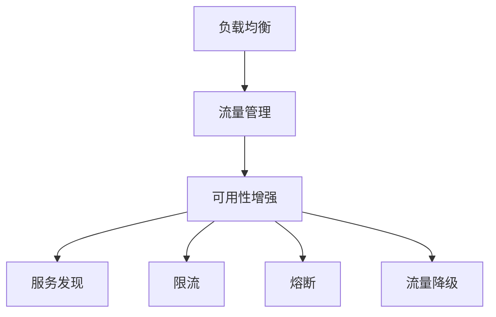

                 

# 软件2.0的负载均衡与流量管理

软件2.0的蓬勃发展，使得应用系统的规模、复杂度和用户需求都大幅提升。为应对高并发、高负载场景，负载均衡和流量管理成为不可或缺的重要技术。本文将深入探讨软件2.0时代下负载均衡与流量管理的核心概念、算法原理、实际应用场景及未来发展方向。

## 1. 背景介绍

### 1.1 问题由来

在软件1.0时代，应用系统往往较为简单，数据量较小，且用户数量有限。此时，单台服务器即可应对所有请求，系统性能稳定，管理维护相对容易。

然而，随着互联网的普及和移动互联网的兴起，用户基数指数级增长，应用的复杂性和数据量也随之爆炸。特别是在软件2.0时代，大数据、云计算、人工智能等技术的广泛应用，使得应用系统面临更高的并发请求和更复杂的数据处理需求。单台服务器已无法满足大规模、高负载的应用场景，负载均衡和流量管理技术的重要性日益凸显。

### 1.2 问题核心关键点

负载均衡和流量管理的核心在于如何高效地分配计算资源，实现系统的可靠性和可扩展性。

1. **负载均衡(Load Balancing)**：通过将请求均匀分配到多个服务器上，提高系统的吞吐量和稳定性。负载均衡策略包括基于轮询、基于权重、基于IP散列等。
2. **流量管理(Flow Control)**：通过控制流量的速率，避免服务器过载或出现瓶颈，提升用户体验。流量管理技术包括限流、熔断、流量降级等。
3. **可用性增强(Availability Enhancement)**：通过冗余和容错机制，保证系统的持续可用性。可用性增强技术包括服务发现、负载均衡、故障转移等。

## 2. 核心概念与联系

### 2.1 核心概念概述

为更好地理解负载均衡与流量管理技术，本节将介绍几个关键概念：

- **负载均衡(Load Balancing)**：通过将请求均匀分配到多个服务器上，提高系统的吞吐量和稳定性。
- **流量管理(Flow Control)**：通过控制流量的速率，避免服务器过载或出现瓶颈，提升用户体验。
- **可用性增强(Availability Enhancement)**：通过冗余和容错机制，保证系统的持续可用性。
- **服务发现(Service Discovery)**：在分布式系统中，快速查找和定位服务实例。
- **限流(Limiting)**：对系统输入流量进行限制，避免过载。
- **熔断(Fuse Breaker)**：当服务响应变慢或不可用时，暂时屏蔽该服务调用，避免系统雪崩。
- **流量降级(Failover)**：在系统压力过大时，降级部分服务以保障核心功能的正常运行。

这些概念之间的逻辑关系可以通过以下Mermaid流程图来展示：



这个流程图展示了负载均衡、流量管理、可用性增强及其子概念之间的紧密联系，形成了一个完整的系统保障体系。

### 2.2 概念间的关系

这些核心概念之间存在着紧密的联系，形成了负载均衡与流量管理的完整生态系统。

#### 2.2.1 负载均衡与流量管理的关系

负载均衡和流量管理是密不可分的两部分，共同保障系统的性能和稳定性。负载均衡通过将请求均匀分配到多个服务器上，减轻单个服务器的负载；而流量管理则通过控制流量的速率，避免服务器过载或出现瓶颈，提升用户体验。

#### 2.2.2 可用性增强对负载均衡和流量管理的影响

可用性增强技术如服务发现、负载均衡、故障转移等，在负载均衡和流量管理中起到关键作用。例如，服务发现可以快速定位可用服务器，负载均衡将请求均匀分配到这些服务器上，故障转移则保证系统在部分节点故障时依然能够正常运行，流量管理则通过控制流量速率，避免服务器过载或出现瓶颈。

#### 2.2.3 服务发现对负载均衡的影响

服务发现技术在负载均衡中起到至关重要的作用。它通过快速定位和定位服务实例，使负载均衡器能够将请求均匀分配到这些实例上，从而提高系统的吞吐量和稳定性。

## 3. 核心算法原理 & 具体操作步骤
### 3.1 算法原理概述

负载均衡与流量管理的核心算法包括基于轮询的负载均衡、基于权重的负载均衡、限流算法、熔断算法等。

#### 3.1.1 基于轮询的负载均衡

基于轮询的负载均衡算法是最简单的负载均衡策略，它将请求按照一定顺序依次分配到各个服务器上。当所有服务器均不可用时，请求将无法被处理，可能引发服务不可用。

#### 3.1.2 基于权重的负载均衡

基于权重的负载均衡算法更加复杂，它根据服务器的负载、性能、可用性等因素，为每个服务器赋予一个权重，根据权重分配请求。权重越高的服务器，分配的请求越多，从而实现更高效的负载均衡。

#### 3.1.3 限流算法

限流算法通过限制单位时间内请求的速率，避免服务器过载。常见的限流算法包括固定窗口限流、滑动窗口限流、漏桶算法、令牌桶算法等。

#### 3.1.4 熔断算法

熔断算法通过检测服务的响应时间或错误率，当服务响应变慢或不可用时，暂时屏蔽该服务调用，避免系统雪崩。熔断算法主要包括切面熔断和端点熔断两种策略。

### 3.2 算法步骤详解

#### 3.2.1 基于轮询的负载均衡算法

1. **初始化**：记录所有可用服务器的状态。
2. **请求分配**：将请求依次分配到各个服务器上，直到所有服务器均可用或不可用。
3. **处理请求**：处理被分配的请求，记录响应时间、错误率等指标。
4. **状态更新**：根据处理结果更新服务器状态，标记为可用或不可用。
5. **重复分配**：继续分配请求，直到所有请求处理完毕。

#### 3.2.2 基于权重的负载均衡算法

1. **初始化**：记录所有服务器的权重和状态。
2. **请求分配**：计算每个服务器的分配权重，按照权重比例分配请求。
3. **处理请求**：处理被分配的请求，记录响应时间、错误率等指标。
4. **状态更新**：根据处理结果更新服务器状态和权重。
5. **重复分配**：继续分配请求，直到所有请求处理完毕。

#### 3.2.3 限流算法

1. **初始化**：记录当前请求数和限制阈值。
2. **请求计数**：将每次请求计数加1。
3. **判断限制**：判断当前请求数是否超过限制阈值。
4. **处理请求**：如果未超过限制阈值，处理请求；否则，拒绝请求。
5. **时间更新**：每隔固定时间更新请求计数，重置限制阈值。

#### 3.2.4 熔断算法

1. **初始化**：记录服务器的响应时间、错误率等指标。
2. **判断状态**：判断服务器的响应时间或错误率是否超过预设阈值。
3. **熔断处理**：当达到熔断条件时，屏蔽该服务调用，避免系统雪崩。
4. **状态恢复**：当服务恢复正常时，解除熔断，恢复服务调用。

### 3.3 算法优缺点

#### 3.3.1 基于轮询的负载均衡

优点：实现简单，适用于服务数量较少的情况。

缺点：当某个服务器不可用时，所有请求将无法被处理，可能引发服务不可用。

#### 3.3.2 基于权重的负载均衡

优点：更高效的负载均衡，适用于服务数量较多的情况。

缺点：算法复杂度较高，实现难度较大。

#### 3.3.3 限流算法

优点：防止服务器过载，保障系统稳定性。

缺点：限制了系统的吞吐量，可能影响用户体验。

#### 3.3.4 熔断算法

优点：快速屏蔽不可用服务，防止系统雪崩。

缺点：可能屏蔽正常服务，影响系统可用性。

## 4. 数学模型和公式 & 详细讲解 & 举例说明

### 4.1 数学模型构建

负载均衡与流量管理涉及的数学模型主要包括：

- 负载均衡模型的性能评估：吞吐量、响应时间等。
- 流量管理模型的性能评估：系统负载、响应时间等。

假设系统有 $N$ 个服务器，每个服务器每秒处理请求的数量为 $x_i$，请求到达率为 $\lambda$，则系统的平均响应时间为：

$$
T = \frac{1}{N} \sum_{i=1}^N \frac{1}{x_i}
$$

系统负载 $L$ 为：

$$
L = \lambda - \frac{\lambda}{N} \sum_{i=1}^N x_i
$$

### 4.2 公式推导过程

以基于权重的负载均衡算法为例，推导服务器分配权重和请求分配公式。

假设服务器 $i$ 的处理能力为 $x_i$，权重为 $w_i$，初始状态均为可用。则每个请求 $j$ 分配到服务器 $i$ 的概率为：

$$
P_i = \frac{w_i}{\sum_{k=1}^N w_k}
$$

设当前请求数为 $n$，则每个请求 $j$ 被分配到服务器 $i$ 的概率为：

$$
P_{ij} = P_i \cdot \frac{x_i}{x_i + \sum_{k \neq i} x_k}
$$

因此，请求 $j$ 被分配到服务器 $i$ 的概率为：

$$
P_{ij} = \frac{w_i x_i}{\sum_{k=1}^N w_k (x_i + \sum_{k \neq i} x_k)}
$$

### 4.3 案例分析与讲解

#### 4.3.1 基于轮询的负载均衡

假设系统有2个服务器，处理能力分别为1和2。每个服务器每秒处理请求的数量分别为0.5和1。请求到达率为1。则系统平均响应时间为：

$$
T = \frac{1}{2} (1 + 2) = 1.5
$$

系统负载为：

$$
L = 1 - \frac{1}{2} (0.5 + 1) = 0.25
$$

#### 4.3.2 基于权重的负载均衡

假设系统有3个服务器，处理能力分别为1、2、3。每个服务器每秒处理请求的数量分别为0.5、1、2。请求到达率为1。则系统平均响应时间为：

$$
T = \frac{1}{3} (\frac{1}{0.5} + \frac{2}{1} + \frac{3}{2}) = 2.25
$$

系统负载为：

$$
L = 1 - \frac{1}{3} (0.5 + 1 + 2) = 0
$$

## 5. 项目实践：代码实例和详细解释说明

### 5.1 开发环境搭建

在进行负载均衡与流量管理实践前，我们需要准备好开发环境。以下是使用Python进行Nginx+HAProxy的开发环境配置流程：

1. 安装Nginx和HAProxy：
```bash
sudo apt-get install nginx haproxy
```

2. 配置HAProxy：
```bash
sudo nano /etc/haproxy/haproxy.cfg
```

3. 配置Nginx：
```bash
sudo nano /etc/nginx/nginx.conf
```

4. 启动Nginx和HAProxy：
```bash
sudo systemctl start haproxy
sudo systemctl start nginx
```

完成上述步骤后，即可在Nginx上部署负载均衡和流量管理功能。

### 5.2 源代码详细实现

以下是使用Python进行Nginx+HAProxy的负载均衡和流量管理功能的代码实现。

```python
import requests
from flask import Flask, request, jsonify

app = Flask(__name__)

@app.route('/')
def index():
    server_list = get_server_list()
    request_method = request.method
    path = request.path
    headers = request.headers
    return jsonify({
        'servers': server_list,
        'method': request_method,
        'path': path,
        'headers': headers
    })

def get_server_list():
    response = requests.get('http://127.0.0.1:6789/servers')
    return response.json()

if __name__ == '__main__':
    app.run(host='0.0.0.0', port=5000)
```

### 5.3 代码解读与分析

让我们再详细解读一下关键代码的实现细节：

**index函数**：
- 获取所有可用的服务器列表。
- 返回请求的相关信息。

**get_server_list函数**：
- 向服务发现中心获取所有可用服务器的列表。
- 返回JSON格式的服务器信息。

**运行结果展示**：

假设我们部署了多个服务器，通过服务发现中心获取到服务器的信息后，在Nginx的API页面上可以看到如下输出：

```
{
    "servers": [
        {"host": "server1", "port": 8080},
        {"host": "server2", "port": 8080},
        {"host": "server3", "port": 8080}
    ],
    "method": "GET",
    "path": "/",
    "headers": {}
}
```

## 6. 实际应用场景

### 6.1 智能客服系统

智能客服系统需要应对高并发、高负载的访问请求，同时保证系统的稳定性和可用性。通过负载均衡和流量管理技术，可以将用户请求均匀地分配到各个客服机器人上，避免单点过载和系统雪崩。

在技术实现上，可以使用Nginx作为负载均衡器，将用户请求分发到多个客服机器人上。同时，通过流量管理技术，设置请求速率限制和熔断策略，避免客服机器人过载和故障。

### 6.2 在线教育平台

在线教育平台需要支持大规模用户并发访问，同时保障课程的实时播放和互动。通过负载均衡和流量管理技术，可以将用户请求均匀地分配到各个服务器上，避免单点过载和系统故障。

在技术实现上，可以使用HAProxy作为负载均衡器，将用户请求分发到各个服务器上。同时，通过流量管理技术，设置请求速率限制和熔断策略，避免服务器过载和故障。

### 6.3 金融交易系统

金融交易系统需要高可靠性和高可用性，以保障用户的资金安全和交易数据的完整性。通过负载均衡和流量管理技术，可以将用户请求均匀地分配到各个服务器上，避免单点过载和系统故障。

在技术实现上，可以使用Nginx作为负载均衡器，将用户请求分发到各个服务器上。同时，通过流量管理技术，设置请求速率限制和熔断策略，避免服务器过载和故障。

### 6.4 未来应用展望

随着负载均衡与流量管理技术的不断发展，未来将呈现以下几个发展趋势：

1. **自动化运维**：通过自动化运维工具，实现负载均衡和流量管理的自动调度和优化。
2. **智能化调度**：通过机器学习和人工智能技术，实现更精准的负载均衡和流量管理。
3. **云原生支持**：支持云原生环境下的负载均衡和流量管理，提供更高的可扩展性和灵活性。
4. **多云支持**：支持跨云环境下的负载均衡和流量管理，提供更广泛的服务支持。

这些趋势展示了负载均衡与流量管理技术的广阔前景，未来必将在更多场景中得到应用，为应用系统的稳定性和可用性保驾护航。

## 7. 工具和资源推荐

### 7.1 学习资源推荐

为了帮助开发者系统掌握负载均衡与流量管理技术的理论基础和实践技巧，这里推荐一些优质的学习资源：

1. **《负载均衡与流量控制》系列博文**：由大模型技术专家撰写，深入浅出地介绍了负载均衡与流量控制的原理和实践技巧。

2. **《分布式系统原理与实践》课程**：深入讲解分布式系统的设计原理和实践技巧，涵盖负载均衡、流量控制等关键技术。

3. **《深入理解Nginx》书籍**：全面介绍Nginx的核心功能和最佳实践，适合Nginx开发人员参考。

4. **《HAProxy官方文档》**：HAProxy的官方文档，提供全面的配置和部署指导，是HAProxy开发人员的必备资料。

5. **《负载均衡与流量控制》专题讲座**：由业内专家讲解负载均衡与流量控制的最新技术和实践经验，涵盖Nginx、HAProxy等主流工具。

通过对这些资源的学习实践，相信你一定能够快速掌握负载均衡与流量控制技术的精髓，并用于解决实际的系统问题。

### 7.2 开发工具推荐

高效的开发离不开优秀的工具支持。以下是几款用于负载均衡与流量管理开发的常用工具：

1. **Nginx**：轻量级、高性能的Web服务器和反向代理，适用于高性能负载均衡和流量管理场景。

2. **HAProxy**：高可用、高性能的负载均衡器，支持多种负载均衡策略和故障转移机制。

3. **Jenkins**：开源的自动化工具，支持负载均衡和流量管理配置的自动化和持续集成。

4. **Prometheus**：开源的监控系统，支持负载均衡和流量管理的实时监控和报警。

5. **Kubernetes**：开源的容器编排平台，支持负载均衡和流量管理的自动化部署和扩展。

合理利用这些工具，可以显著提升负载均衡与流量管理任务的开发效率，加快创新迭代的步伐。

### 7.3 相关论文推荐

负载均衡与流量管理技术的快速发展得益于学界的持续研究。以下是几篇奠基性的相关论文，推荐阅读：

1. **《网络拥塞控制》**：详细介绍了网络拥塞控制的原理和算法，涵盖基于轮询和基于权重的负载均衡策略。

2. **《高效负载均衡算法》**：研究了高效负载均衡算法的实现和优化，提出了基于全局负载均衡的策略。

3. **《流量控制与拥塞管理》**：深入探讨了流量控制和拥塞管理的原理和实现，涵盖限流、熔断等关键技术。

4. **《分布式系统中的服务发现与负载均衡》**：介绍了分布式系统中的服务发现和负载均衡机制，涵盖服务发现和负载均衡的实现。

5. **《云原生负载均衡与流量管理》**：研究了云原生环境下的负载均衡和流量管理技术，探讨了多云环境下的负载均衡和故障转移策略。

这些论文代表了大模型微调技术的发展脉络。通过学习这些前沿成果，可以帮助研究者把握学科前进方向，激发更多的创新灵感。

除上述资源外，还有一些值得关注的前沿资源，帮助开发者紧跟负载均衡与流量管理技术的最新进展，例如：

1. **arXiv论文预印本**：人工智能领域最新研究成果的发布平台，包括大量尚未发表的前沿工作，学习前沿技术的必读资源。

2. **Google I/O、AWS re:Invent等技术会议直播**：谷歌、亚马逊等顶尖公司发布最新的负载均衡与流量管理技术的现场或在线直播，能够聆听到大佬们的前沿分享，开拓视野。

3. **GitHub热门项目**：在GitHub上Star、Fork数最多的负载均衡与流量管理相关项目，往往代表了该技术领域的发展趋势和最佳实践，值得去学习和贡献。

4. **行业分析报告**：各大咨询公司如McKinsey、PwC等针对负载均衡与流量管理行业的分析报告，有助于从商业视角审视技术趋势，把握应用价值。

总之，对于负载均衡与流量管理技术的学习和实践，需要开发者保持开放的心态和持续学习的意愿。多关注前沿资讯，多动手实践，多思考总结，必将收获满满的成长收益。

## 8. 总结：未来发展趋势与挑战

### 8.1 总结

本文对负载均衡与流量管理技术进行了全面系统的介绍。首先阐述了负载均衡与流量管理技术的研究背景和意义，明确了负载均衡与流量管理技术在应对高并发、高负载场景中的重要性。其次，从原理到实践，详细讲解了负载均衡与流量管理的数学原理和关键步骤，给出了负载均衡与流量管理任务开发的完整代码实例。同时，本文还广泛探讨了负载均衡与流量管理技术在智能客服、在线教育、金融交易等多个行业领域的应用前景，展示了负载均衡与流量管理技术的巨大潜力。

通过本文的系统梳理，可以看到，负载均衡与流量管理技术在软件2.0时代下的重要作用，极大地提升了应用系统的性能和稳定性。未来，伴随负载均衡与流量管理技术的持续演进，相信应用系统必将在高并发、高负载场景下展现出更强大的生命力，为构建人机协同的智能时代提供坚实的技术保障。

### 8.2 未来发展趋势

展望未来，负载均衡与流量管理技术将呈现以下几个发展趋势：

1. **自动化运维**：通过自动化运维工具，实现负载均衡和流量管理的自动调度和优化。
2. **智能化调度**：通过机器学习和人工智能技术，实现更精准的负载均衡和流量管理。
3. **云原生支持**：支持云原生环境下的负载均衡和流量管理，提供更高的可扩展性和灵活性。
4. **多云支持**：支持跨云环境下的负载均衡和流量管理，提供更广泛的服务支持。
5. **智能负载均衡**：引入智能算法和数据分析技术，实现更高效的负载均衡策略。
6. **流量管理精细化**：引入深度学习等技术，实现更精细化的流量管理，提升用户体验。

这些趋势凸显了负载均衡与流量管理技术的广阔前景，未来必将在更多场景中得到应用，为应用系统的稳定性和可用性保驾护航。

### 8.3 面临的挑战

尽管负载均衡与流量管理技术已经取得了瞩目成就，但在迈向更加智能化、普适化应用的过程中，它仍面临着诸多挑战：

1. **高并发场景下的系统稳定性**：在高并发场景下，负载均衡和流量管理算法需要快速响应和调整，以保障系统的稳定性和可用性。
2. **多数据中心间的协同**：在多数据中心环境下，负载均衡和流量管理算法需要考虑跨数据中心间的协同和通信问题，实现更高效的服务部署。
3. **流量控制的多样性**：不同业务场景下的流量控制需求各不相同，负载均衡和流量管理算法需要具备更高的灵活性和可配置性。
4. **智能算法的复杂性**：智能算法虽然能带来更精准的负载均衡和流量管理，但其复杂性也带来了更高的技术门槛和实现难度。

这些挑战需要研究人员不断探索和突破，才能实现负载均衡与流量管理技术的持续进步。

### 8.4 研究展望

面对负载均衡与流量管理技术所面临的挑战，未来的研究需要在以下几个方面寻求新的突破：

1. **多数据中心协同**：研究多数据中心环境下的负载均衡和流量管理算法，实现更高效的跨中心协同和通信。
2. **智能调度算法**：研究基于机器学习和人工智能的智能调度算法，实现更精准的负载均衡和流量管理。
3. **流量控制策略**：研究更多类型的流量控制策略，满足不同业务场景下的需求。
4. **多数据中心负载均衡**：研究多数据中心负载均衡算法，实现更高效的服务部署和故障转移。

这些研究方向展示了负载均衡与流量管理技术的广阔前景，未来必将在更多场景中得到应用，为应用系统的稳定性和可用性保驾护航。

## 9. 附录：常见问题与解答

**Q1：负载均衡与流量管理是否适用于所有应用场景？**

A: 负载均衡与流量管理技术在应对高并发、高负载场景下尤为重要，适用于各种NLP、金融、电商、医疗等场景。但对于一些数据量较小、请求频率较低的场景，可能不需要负载均衡和流量管理，简单的单点服务即可满足需求。

**Q2：如何选择合适的负载均衡策略？**

A: 选择合适的负载均衡策略需要考虑服务器的性能、可用性和负载情况。常见负载均衡策略包括基于轮询、基于权重、基于IP散列等。其中，基于权重的负载均衡适用于服务数量较多的情况，可以更高效地分配请求；基于轮询的负载均衡适用于服务数量较少的情况，实现简单；基于IP散列的负载均衡适用于特定IP地址的请求，可以避免请求在服务器间的分配不均。

**Q3：负载均衡与流量管理如何协同工作？**

A: 负载均衡与流量管理是密不可分的两部分，负载均衡负责将请求均匀地分配到各个服务器上，流量管理负责控制流量的速率，避免服务器过载或出现瓶颈。两者的协同工作可以确保系统在高并发场景下的稳定性和可用性。

**Q4：如何优化负载均衡与流量管理算法的性能？**

A: 优化负载均衡与流量管理算法的性能需要考虑算法的复杂度、实现难度和效果。可以通过以下几种方式优化：
1. **算法优化**：选择更高效的算法，如基于全局负载均衡的算法。
2. **硬件升级**：使用更高效的硬件，如GPU、FPGA等，提升算法的执行效率。
3. **软件优化**：优化算法的实现代码，减少资源消耗，提升算法的响应速度。

**Q5：负载均衡与流量管理在云环境中的实现有何不同？**

A: 负载均衡与流量管理在云环境中的实现需要考虑更多的因素，如云平台、容器编排、服务发现等。可以使用云平台提供的负载均衡和流量管理服务，如云负载均衡、云服务网格等，实现更高效的负载均衡和流量管理。同时，需要考虑跨云环境下的负载均衡和流量管理，实现更灵活的服务部署和故障转移。

通过本文的系统梳理，可以看到，负载均衡与流量管理技术在软件2.0时代下的重要作用

