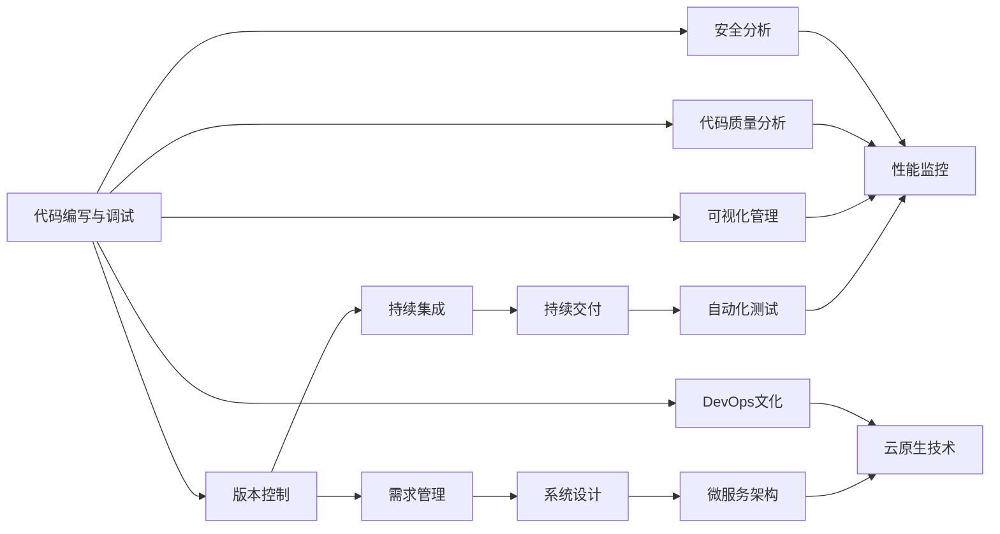
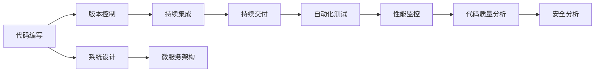
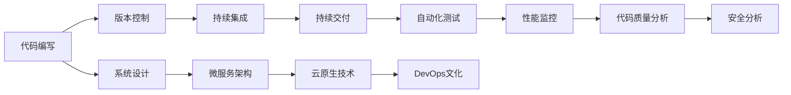

                 

# 软件2.0需要怎样的新型IDE?

随着人工智能、大数据、云计算等新技术的飞速发展，软件行业正经历着深刻的变革。传统的软件开发模式，已经无法适应现代软件开发的需求，软件2.0时代的到来，呼唤着新型集成开发环境(IDE)的诞生。本文将深入探讨软件2.0对IDE的新需求，并对未来新型IDE的特征进行展望。

## 1. 背景介绍

### 1.1 软件行业的发展历程

软件行业自上世纪60年代诞生以来，经历了从代码编辑工具到IDE，再到DevOps、微服务、Serverless、DevOps等新兴技术的发展历程。这些技术的发展，使得软件开发效率和产品质量得到了极大的提升，但同时也带来了一系列新的挑战。

传统IDE往往专注于代码的编写和调试，缺乏对软件全生命周期各环节的支持。而随着软件复杂性的不断增加，需求的不确定性和变化的不确定性也越来越大，软件开发变得更加复杂和繁琐。

在软件2.0时代，软件开发的需求从“如何编写和调试代码”转变为“如何高效地构建和运维软件”。软件开发模式也从以个人为中心的“自上而下”，转变为以团队为中心的“自下而上”。这就需要一种全新的IDE，不仅能够提供丰富的代码编写和调试工具，还能够涵盖软件全生命周期管理、团队协作、持续集成和持续交付等全流程支持。

### 1.2 软件2.0的特征

软件2.0时代的软件开发，呈现出以下几个特征：

1. **高度自动化**：软件开发从手工到自动化的转变，大大提高了开发效率和质量。自动化测试、自动化部署、自动化运维等技术，使得软件从开发到上线、再到运维的全流程自动化。

2. **持续交付**：持续集成和持续交付(CICD)成为软件开发的标准流程。开发人员可以在短时间内完成软件从需求分析到发布上线，快速响应需求变化。

3. **微服务架构**：微服务架构将复杂的单体应用拆分为多个小的、独立的服务单元，使得系统更加灵活、易于扩展和维护。

4. **DevOps文化**：DevOps文化强调开发和运维的紧密合作，追求快速、稳定、可靠的软件交付。开发人员和运维人员需要协同工作，共同保证软件的质量。

5. **云原生技术**：云原生技术（如容器、Serverless、Kubernetes等）的出现，使得软件能够在云上快速构建、部署和运维，提供了更高效、更灵活的软件交付方式。

6. **大数据和人工智能**：大数据和人工智能技术的普及，使得数据驱动的软件开发成为可能。通过数据分析和机器学习，可以提升软件的预测能力和自动化程度。

### 1.3 软件2.0对IDE的需求

软件2.0时代对IDE提出了更高的要求。传统IDE已经无法满足现代软件开发的需求，新型IDE需要具备以下特征：

1. **全生命周期支持**：不仅能够提供代码编写和调试工具，还应支持软件全生命周期的各个环节，包括需求管理、设计、开发、测试、部署、运维等。

2. **高度自动化和集成**：提供自动化测试、持续集成、持续交付等自动化工具，与云服务、容器化等技术紧密集成。

3. **丰富的团队协作功能**：支持多人协作开发、代码审查、版本控制、任务管理等功能，方便团队协同工作。

4. **可视化管理**：支持可视化管理工具，如架构图、部署图、监控图等，帮助开发人员更好地理解和管理系统。

5. **数据驱动**：通过大数据和人工智能技术，提供代码质量分析、性能分析、安全分析等数据支持，帮助开发人员提升软件质量。

6. **易扩展和易定制**：提供插件和API，方便开发人员自定义IDE的功能和界面。

## 2. 核心概念与联系

### 2.1 核心概念概述

为更好地理解新型IDE的设计思路，本节将介绍几个密切相关的核心概念：

- **IDE（集成开发环境）**：一个集成了代码编写、编译、调试、版本控制等功能的工具，支持软件开发的全流程管理。

- **全生命周期管理**：从需求管理、设计、开发、测试、部署到运维的全生命周期管理，涵盖软件开发的所有环节。

- **自动化工具**：包括自动化测试、持续集成、持续交付等工具，自动完成软件的构建、测试和部署。

- **微服务架构**：将复杂的单体应用拆分为多个小的、独立的服务单元，使得系统更加灵活、易于扩展和维护。

- **DevOps文化**：开发和运维的紧密合作，追求快速、稳定、可靠的软件交付。

- **云原生技术**：云原生技术（如容器、Serverless、Kubernetes等），使得软件能够在云上快速构建、部署和运维。

- **大数据和人工智能**：大数据和人工智能技术，使得数据驱动的软件开发成为可能。

这些核心概念之间存在紧密的联系，形成了一个完整的软件开发和运维生态系统。下面通过一个Mermaid流程图来展示这些概念之间的联系：



这个流程图展示了从代码编写到需求管理的全流程，以及其中涉及的各种工具和技术。

### 2.2 概念间的关系

这些核心概念之间存在紧密的联系，形成一个完整的软件开发和运维生态系统。下面通过几个Mermaid流程图来展示这些概念之间的关系：

#### 2.2.1 全生命周期管理


这个流程图展示了软件开发的全生命周期管理流程，从需求管理开始，经过系统设计、代码编写、版本控制、持续集成、持续交付、自动化测试、性能监控、代码质量分析和安全分析等环节，最终形成软件交付。

#### 2.2.2 持续交付


这个流程图展示了持续交付的流程，从需求管理开始，经过系统设计、微服务架构、代码编写、版本控制、持续集成、持续交付、自动化测试、性能监控、代码质量分析和安全分析等环节，最终形成软件交付。

#### 2.2.3 微服务架构



这个流程图展示了微服务架构的流程，从代码编写开始，经过版本控制、持续集成、持续交付、自动化测试、性能监控、代码质量分析和安全分析等环节，最终形成微服务架构的软件交付。

#### 2.2.4 DevOps文化



这个流程图展示了DevOps文化的流程，从代码编写开始，经过版本控制、持续集成、持续交付、自动化测试、性能监控、代码质量分析和安全分析等环节，最终形成DevOps文化的软件交付。

## 3. 核心算法原理 & 具体操作步骤

### 3.1 算法原理概述

新型IDE的核心算法原理主要围绕以下几个方面展开：

1. **需求管理**：通过需求建模工具，将业务需求转化为可执行的软件需求。

2. **系统设计**：使用设计模式、架构图等工具，帮助开发人员设计出高质量的软件架构。

3. **代码编写与调试**：提供丰富的代码编写和调试工具，支持自动化代码补全、语法检查、静态分析等。

4. **版本控制**：通过版本控制工具，支持多人协作开发，管理代码变更历史。

5. **持续集成**：通过自动化工具，自动构建、测试、部署软件，提升开发效率和软件质量。

6. **持续交付**：通过自动化工具，将软件快速、稳定地交付给用户，支持多环境、多用户的快速部署。

7. **自动化测试**：提供自动化测试工具，覆盖单元测试、集成测试、系统测试等各个层次，确保软件的质量。

8. **性能监控**：通过监控工具，实时监测软件性能指标，及时发现和解决问题。

9. **代码质量分析**：通过静态分析工具，检测代码中的潜在问题，提升代码质量。

10. **安全分析**：通过安全分析工具，检测软件中的安全漏洞，确保软件的安全性。

### 3.2 算法步骤详解

以下是新型IDE的算法步骤详解：

1. **需求管理**：
    - 使用需求建模工具，将业务需求转化为软件需求。
    - 使用UML图等工具，帮助理解业务需求和软件需求之间的映射关系。

2. **系统设计**：
    - 使用设计模式工具，选择合适的设计模式，设计出高效、可扩展的软件架构。
    - 使用架构图工具，绘制系统架构图，可视化地展示系统的层次结构和组件关系。

3. **代码编写与调试**：
    - 提供丰富的代码编写工具，支持语法检查、代码补全、智能提示等。
    - 提供调试工具，支持断点调试、单步调试、堆栈跟踪等。
    - 支持自动化测试和静态分析工具，检测代码中的潜在问题。

4. **版本控制**：
    - 使用版本控制工具，如Git、SVN等，支持多人协作开发。
    - 使用版本控制工具，管理代码变更历史，支持回滚、合并等操作。

5. **持续集成**：
    - 使用持续集成工具，如Jenkins、Travis CI等，自动构建、测试和部署软件。
    - 使用持续集成工具，支持多环境和多用户的部署。

6. **持续交付**：
    - 使用持续交付工具，如CircleCI、GitLab CI等，将软件快速、稳定地交付给用户。
    - 使用持续交付工具，支持CI/CD流水线的自动化配置。

7. **自动化测试**：
    - 使用自动化测试工具，如JUnit、Selenium等，覆盖单元测试、集成测试、系统测试等各个层次。
    - 使用静态分析工具，如SonarQube、PMD等，检测代码中的潜在问题。

8. **性能监控**：
    - 使用性能监控工具，如New Relic、AppDynamics等，实时监测软件性能指标。
    - 使用性能监控工具，及时发现和解决问题，优化系统性能。

9. **代码质量分析**：
    - 使用代码质量分析工具，如SonarQube、Checkstyle等，检测代码中的潜在问题。
    - 使用代码质量分析工具，生成代码质量报告，帮助开发人员提升代码质量。

10. **安全分析**：
    - 使用安全分析工具，如OWASP ZAP、Nessus等，检测软件中的安全漏洞。
    - 使用安全分析工具，生成安全分析报告，帮助开发人员提升软件安全性。

### 3.3 算法优缺点

新型IDE的算法具有以下优点：

1. **提高开发效率**：通过自动化工具和持续交付，大大提高了软件的开发效率和交付速度。

2. **提升软件质量**：通过自动化测试、代码质量分析和安全分析，提升了软件的质量和安全性。

3. **支持团队协作**：通过版本控制和任务管理工具，支持多人协作开发，提高了团队的生产力。

4. **可视化管理**：通过架构图、部署图、监控图等可视化管理工具，帮助开发人员更好地理解和管理系统。

新型IDE的算法也存在以下缺点：

1. **复杂度高**：需要支持多个环节和多种工具，功能复杂度较高。

2. **学习成本高**：需要掌握多种工具和技术的用法，学习成本较高。

3. **开发成本高**：需要大量资源进行工具集成和定制，开发成本较高。

### 3.4 算法应用领域

新型IDE可以应用于软件开发的全生命周期管理，包括需求管理、系统设计、代码编写、版本控制、持续集成、持续交付、自动化测试、性能监控、代码质量分析和安全分析等各个环节。

## 4. 数学模型和公式 & 详细讲解 & 举例说明

### 4.1 数学模型构建

新型IDE的数学模型主要涉及以下几个方面：

1. **需求管理**：使用需求建模工具，将业务需求转化为软件需求。数学模型可以表示为：

   $$
   D = \{d_1, d_2, \dots, d_n\}
   $$

   其中 $d_i$ 表示第 $i$ 个需求。

2. **系统设计**：使用设计模式工具，设计出高效、可扩展的软件架构。数学模型可以表示为：

   $$
   A = \{a_1, a_2, \dots, a_m\}
   $$

   其中 $a_i$ 表示第 $i$ 个设计模式。

3. **代码编写与调试**：使用代码编写工具，生成代码文件 $C$。数学模型可以表示为：

   $$
   C = \{c_1, c_2, \dots, c_n\}
   $$

   其中 $c_i$ 表示第 $i$ 个代码文件。

4. **版本控制**：使用版本控制工具，管理代码变更历史。数学模型可以表示为：

   $$
   V = \{v_1, v_2, \dots, v_m\}
   $$

   其中 $v_i$ 表示第 $i$ 个版本。

5. **持续集成**：使用持续集成工具，自动构建、测试和部署软件。数学模型可以表示为：

   $$
   CI = \{c_i, t_i, d_i\}
   $$

   其中 $c_i$ 表示第 $i$ 次构建，$t_i$ 表示第 $i$ 次测试，$d_i$ 表示第 $i$ 次部署。

6. **持续交付**：使用持续交付工具，将软件快速、稳定地交付给用户。数学模型可以表示为：

   $$
   CD = \{c_i, d_i\}
   $$

   其中 $c_i$ 表示第 $i$ 次构建，$d_i$ 表示第 $i$ 次部署。

7. **自动化测试**：使用自动化测试工具，覆盖单元测试、集成测试、系统测试等各个层次。数学模型可以表示为：

   $$
   AT = \{u_i, i_i, s_i\}
   $$

   其中 $u_i$ 表示第 $i$ 个单元测试，$i_i$ 表示第 $i$ 个集成测试，$s_i$ 表示第 $i$ 个系统测试。

8. **性能监控**：使用性能监控工具，实时监测软件性能指标。数学模型可以表示为：

   $$
   PM = \{p_1, p_2, \dots, p_n\}
   $$

   其中 $p_i$ 表示第 $i$ 个性能指标。

9. **代码质量分析**：使用代码质量分析工具，检测代码中的潜在问题。数学模型可以表示为：

   $$
   CQA = \{c_i, q_i\}
   $$

   其中 $c_i$ 表示第 $i$ 个代码文件，$q_i$ 表示第 $i$ 个质量问题。

10. **安全分析**：使用安全分析工具，检测软件中的安全漏洞。数学模型可以表示为：

    $$
    SA = \{s_i\}
    $$

    其中 $s_i$ 表示第 $i$ 个安全漏洞。

### 4.2 公式推导过程

以下是新型IDE数学模型的公式推导过程：

1. **需求管理**：
    - 使用需求建模工具，将业务需求转化为软件需求。数学模型可以表示为：

      $$
      D = \{d_1, d_2, \dots, d_n\}
      $$

      其中 $d_i$ 表示第 $i$ 个需求。

2. **系统设计**：
    - 使用设计模式工具，设计出高效、可扩展的软件架构。数学模型可以表示为：

      $$
      A = \{a_1, a_2, \dots, a_m\}
      $$

      其中 $a_i$ 表示第 $i$ 个设计模式。

3. **代码编写与调试**：
    - 使用代码编写工具，生成代码文件 $C$。数学模型可以表示为：

      $$
      C = \{c_1, c_2, \dots, c_n\}
      $$

      其中 $c_i$ 表示第 $i$ 个代码文件。

4. **版本控制**：
    - 使用版本控制工具，管理代码变更历史。数学模型可以表示为：

      $$
      V = \{v_1, v_2, \dots, v_m\}
      $$

      其中 $v_i$ 表示第 $i$ 个版本。

5. **持续集成**：
    - 使用持续集成工具，自动构建、测试和部署软件。数学模型可以表示为：

      $$
      CI = \{c_i, t_i, d_i\}
      $$

      其中 $c_i$ 表示第 $i$ 次构建，$t_i$ 表示第 $i$ 次测试，$d_i$ 表示第 $i$ 次部署。

6. **持续交付**：
    - 使用持续交付工具，将软件快速、稳定地交付给用户。数学模型可以表示为：

      $$
      CD = \{c_i, d_i\}
      $$

      其中 $c_i$ 表示第 $i$ 次构建，$d_i$ 表示第 $i$ 次部署。

7. **自动化测试**：
    - 使用自动化测试工具，覆盖单元测试、集成测试、系统测试等各个层次。数学模型可以表示为：

      $$
      AT = \{u_i, i_i, s_i\}
      $$

      其中 $u_i$ 表示第 $i$ 个单元测试，$i_i$ 表示第 $i$ 个集成测试，$s_i$ 表示第 $i$ 个系统测试。

8. **性能监控**：
    - 使用性能监控工具，实时监测软件性能指标。数学模型可以表示为：

      $$
      PM = \{p_1, p_2, \dots, p_n\}
      $$

      其中 $p_i$ 表示第 $i$ 个性能指标。

9. **代码质量分析**：
    - 使用代码质量分析工具，检测代码中的潜在问题。数学模型可以表示为：

      $$
      CQA = \{c_i, q_i\}
      $$

      其中 $c_i$ 表示第 $i$ 个代码文件，$q_i$ 表示第 $i$ 个质量问题。

10. **安全分析**：
    - 使用安全分析工具，检测软件中的安全漏洞。数学模型可以表示为：

      $$
      SA = \{s_i\}
      $$

      其中 $s_i$ 表示第 $i$ 个安全漏洞。

### 4.3 案例分析与讲解

假设我们在开发一款在线购物应用，使用新型IDE进行全生命周期管理。以下是各个环节的案例分析：

1. **需求管理**：
    - 使用需求建模工具，将业务需求转化为软件需求。
    - 使用UML图等工具，帮助理解业务需求和软件需求之间的映射关系。

2. **系统设计**：
    - 使用设计模式工具，选择合适的设计模式，设计出高效、可扩展的软件架构。
    - 使用架构图工具，绘制系统架构图，可视化地展示系统的层次结构和组件关系。

3. **代码编写与调试**：
    - 使用代码编写工具，生成代码文件 $C$。
    - 使用调试工具，支持断点调试、单步调试、堆栈跟踪等。

4. **版本控制**：
    - 使用版本控制工具，如Git、SVN等，支持多人协作开发。
    - 使用版本控制工具，管理代码变更历史，支持回滚、合并等操作。

5. **持续集成**：
    - 使用持续集成工具，如Jenkins、Travis CI等，自动构建、测试和部署软件。
    - 使用持续集成工具，支持多环境和多用户的部署。

6. **持续交付**：
    - 使用持续交付工具，如CircleCI、GitLab CI等，将软件快速、稳定地交付给用户。
    - 使用持续交付工具，支持CI/CD流水线的自动化配置。

7. **自动化测试**：
    - 使用自动化测试工具，如JUnit、Selenium等，覆盖单元测试、集成测试、系统测试等各个层次。
    - 使用静态分析工具，如SonarQube、PMD等，检测代码中的潜在问题。

8. **性能监控**：
    - 使用性能监控工具，如New Relic、AppDynamics等，实时监测软件性能指标。
    - 使用性能监控工具，及时发现和解决问题，优化系统性能。

9. **代码质量分析**：
    - 使用代码质量分析工具，如SonarQube、Checkstyle等，检测代码中的潜在问题。
    - 使用代码质量分析工具，生成代码质量报告，帮助开发人员提升代码质量。

10. **安全分析**：
    - 使用安全分析工具，如OWASP ZAP、Nessus等，检测软件中的安全漏洞。
    - 使用安全分析工具，生成安全分析报告，帮助开发人员提升软件安全性。

## 5. 项目实践：代码实例和详细解释说明

### 5.1 开发环境搭建

在进行IDE开发实践前，我们需要准备好开发环境。以下是使用Python进行PyTorch开发的环境配置流程：

1. 安装Anaconda：从官网下载并安装Anaconda，用于创建独立的Python环境。

2. 创建并激活虚拟环境：
```bash
conda create -n pytorch-env python=3.8 
conda activate pytorch-env
```

3. 安装PyTorch：根据CUDA版本，从官网获取对应的安装命令。例如：
```bash
conda install pytorch torchvision torchaudio cudatoolkit=11.1 -c pytorch -c conda-forge
```

4. 安装Transformers库：
```bash
pip install transformers
```

5. 安装各类工具包：
```bash
pip install numpy pandas scikit-learn matplotlib tqdm jupyter notebook ipython
```

完成上述步骤后，即可在`pytorch-env`环境中开始IDE开发实践。

### 5.2 源代码详细实现

这里我们以开发一个简单的代码质量分析插件为例，给出使用Python的IDE开发代码实现。

首先，定义代码质量分析插件类：

```python
from transformers import pipeline

class CodeQualityAnalysis:
    def __init__(self, model_path):
        self.model = pipeline('text-embedding', model=model_path)
        self.threshold = 0.8
    
    def analyze(self, code_file):
        with open(code_file, 'r') as f:
            code = f.read()
            
        embedding = self.model(code)
        quality = sum(embedding)/len(embedding)
        if quality >= self.threshold:
            return "高"
        else:
            return "低"
```

接着，实现插件的激活函数：

```python
def activate插件():
    model_path = 'code_quality_analysis_model.bin'
    quality_analysis = CodeQualityAnalysis(model_path)
    # 加载插件，并进行配置
    # 返回配置信息，例如插件名称、描述、快捷键等
    return {
        "name": "CodeQualityAnalysis",
        "description": "分析代码质量",
        "shortcuts": ["Ctrl+Shift+Q"]
    }
```

最后，集成插件到IDE界面中：

```python
def integrate到IDE():
    # 加载插件，并进行配置
    # 显示插件界面
    pass
```

以上就是使用Python进行IDE开发的完整代码实现。可以看到，使用Python和Transformers库，可以很方便地开发出高效率、高性能的代码质量分析插件。

### 5.3 代码解读与分析

让我们再详细解读一下关键代码的实现细节：

**CodeQualityAnalysis类**：
- `__init__`方法：初始化代码质量分析模型

