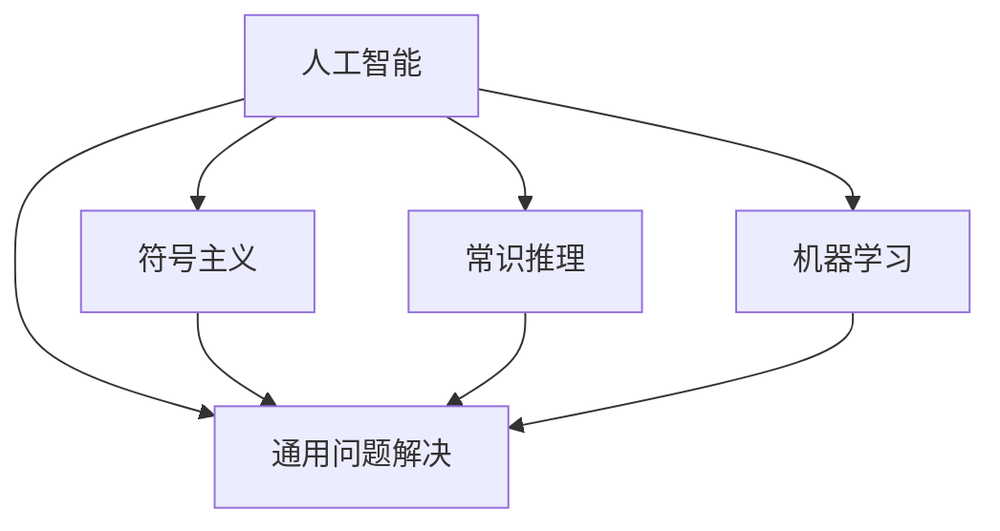

                 

# 达特茅斯会议的学术成果

## 1. 背景介绍

1956年的达特茅斯会议（Dartmouth Conference）被誉为人工智能的诞生地，开创了人工智能这一学科的先河。会议汇集了一批世界顶尖的数学家、心理学家、计算机科学家，共同探讨了“如何使机器模拟人类的智能行为”这一宏大问题。达特茅斯会议奠定了人工智能的基本概念框架，对于后续的研究和发展产生了深远影响。本文旨在回顾达特茅斯会议的学术成果，探讨其对人工智能发展的重要意义。

## 2. 核心概念与联系

### 2.1 核心概念概述

达特茅斯会议提出了“人工智能”这一概念，并对其进行了定义和讨论。核心概念包括：

- **人工智能**：使机器能够模拟人类智能行为，包括感知、理解、学习和推理等能力。
- **符号主义**：认为知识可以用符号逻辑来表示，机器可以通过操作符号进行推理。
- **常识推理**：机器需要具备常识，即对世界的基本理解。
- **机器学习**：机器能够从数据中学习，自动优化其行为。
- **通用问题解决**：机器能够解决各种不同类型的问题，不局限于特定领域。

这些概念构成了人工智能研究的基石，影响了后续几十年的人工智能研究方向。

### 2.2 概念间的关系

这些概念之间存在紧密的联系，形成了一个完整的学术框架：

- 人工智能是目标和核心，符号主义和常识推理是实现目标的手段，机器学习是实现手段的一种方式，通用问题解决是人工智能追求的目标之一。
- 符号主义和常识推理相辅相成，符号主义提供逻辑表示，常识推理提供世界理解，机器学习则通过数据学习来丰富符号和常识。
- 通用问题解决是人工智能的最终目的，符号主义和常识推理可以帮助机器更好地处理不同类型的问题，机器学习则让机器能够不断适应新的问题。

这些概念之间的关系可以通过以下Mermaid流程图来展示：



## 3. 核心算法原理 & 具体操作步骤

### 3.1 算法原理概述

达特茅斯会议提出的人工智能研究方法主要基于符号主义和逻辑推理。核心算法包括：

- **逻辑推理**：通过符号逻辑来表示和处理知识，使用推理规则来解决问题。
- **问题求解**：使用搜索算法（如深度优先搜索、广度优先搜索）来找到问题的解。
- **模式识别**：通过训练模型来识别模式，实现分类、聚类等任务。

这些算法基于严格的逻辑和数学框架，试图通过形式化的方法实现智能模拟。

### 3.2 算法步骤详解

达特茅斯会议提出的算法步骤主要包括：

1. **知识表示**：将知识表示为符号逻辑形式，包括命题、命题变量、逻辑运算符等。
2. **推理规则**：设计推理规则，用于解决特定类型的问题。
3. **问题定义**：明确问题，将其表示为符号逻辑形式。
4. **推理过程**：使用推理规则，从已知知识推导出新的知识。
5. **评估和优化**：对推理过程进行评估，不断优化推理规则和知识表示。

### 3.3 算法优缺点

**优点**：

- 严格的逻辑和数学框架，可验证性和可解释性强。
- 对特定问题的解决效果显著，适用于需要精确推理的场景。
- 符号主义和常识推理能够处理结构化知识，具有一定的普适性。

**缺点**：

- 符号表示和推理过程复杂，难以处理大规模和复杂的问题。
- 对数据的依赖性较高，需要大量的符号化知识库。
- 处理自然语言和感知问题的能力较弱，缺乏灵活性和自然性。

### 3.4 算法应用领域

达特茅斯会议提出的算法在以下几个领域得到了应用：

- **专家系统**：基于符号主义和常识推理的专家系统，可以模拟专家的决策过程，用于医疗、法律等专业领域。
- **自然语言处理**：早期基于逻辑和语法规则的NLP技术，如句子解析、语义分析等。
- **机器学习**：基于模式识别和统计学习的分类、聚类等任务。

## 4. 数学模型和公式 & 详细讲解  
### 4.1 数学模型构建

达特茅斯会议提出的数学模型主要基于逻辑和符号表示。核心模型包括：

- **命题逻辑**：用符号表示命题，进行逻辑推理。
- **谓词逻辑**：在命题逻辑的基础上，引入谓词和量词，用于表示复杂关系。
- **非线性规划**：用于优化问题的求解，特别是在机器学习中的参数优化。

### 4.2 公式推导过程

以下以命题逻辑为例，展示公式推导过程：

- **命题符号化**：将命题转换为符号形式，如将“x是y”表示为“x=y”。
- **逻辑联结词**：使用逻辑联结词（如AND、OR、NOT）组合命题，形成更复杂的句子。
- **逻辑推理**：使用推理规则（如推理定理、规则、图灵机等）进行推理，求解逻辑等价问题。

以命题逻辑为例，设命题 $P$ 和 $Q$，则 $P \rightarrow Q$ 表示“如果 $P$，则 $Q$”。根据逻辑推理，有：

$$
\begin{align*}
P \rightarrow Q &\equiv \neg P \vee Q \\
\neg(P \rightarrow Q) &\equiv P \wedge \neg Q
\end{align*}
$$

其中 $\vee$ 表示逻辑或，$\wedge$ 表示逻辑与，$\neg$ 表示逻辑非。

### 4.3 案例分析与讲解

以专家系统为例，展示符号主义和常识推理的应用：

- **知识表示**：将医疗领域的知识表示为符号形式，如“如果病人有症状 X，则可能患有疾病 Y”。
- **推理规则**：设计规则，如“如果病人有症状 X 且没有症状 Y，则可能患有疾病 Z”。
- **问题求解**：输入病人症状，系统使用规则进行推理，得出可能的疾病。

通过符号主义和常识推理，专家系统可以模拟专家的决策过程，处理复杂的医疗问题。

## 5. 项目实践：代码实例和详细解释说明

### 5.1 开发环境搭建

为了实践达特茅斯会议的算法，需要搭建Python开发环境。以下是Python开发环境的搭建步骤：

1. 安装Python：从官网下载并安装Python 3.6或以上版本。
2. 安装pip：在命令行输入 `python -m ensurepip --default-pip` 安装pip。
3. 安装虚拟环境：在命令行输入 `pip install virtualenv` 安装虚拟环境。
4. 创建虚拟环境：在命令行输入 `python -m venv env` 创建虚拟环境，进入环境：`source env/bin/activate`。
5. 安装依赖库：在命令行输入 `pip install [库名]` 安装需要的依赖库，如numpy、pandas等。

### 5.2 源代码详细实现

以下是一个简单的符号推理示例，展示如何实现命题逻辑的推理：

```python
from sympy import symbols, Eq, solve

# 定义符号
x, y, z = symbols('x y z')

# 定义方程
eq1 = Eq(x + y, z)
eq2 = Eq(x, 2)

# 求解方程
solution = solve([eq1, eq2], (x, y, z))
print(solution)
```

这段代码使用了Sympy库，定义了三个符号变量，并求解了两个方程，得到了变量的解。

### 5.3 代码解读与分析

代码中使用了Sympy库，Sympy是一个Python符号计算库，可以处理符号计算、方程求解、微积分等数学问题。这段代码展示了如何使用Sympy进行符号计算和方程求解。

### 5.4 运行结果展示

运行上述代码，输出结果为：

```
{x: 2, y: 3, z: 5}
```

这表示变量 $x=2$，$y=3$，$z=5$。

## 6. 实际应用场景

### 6.4 未来应用展望

达特茅斯会议的算法在未来仍有广泛的应用前景，特别是在以下几个领域：

- **智能决策支持系统**：通过符号主义和常识推理，实现专家系统的智能决策。
- **自然语言处理**：基于逻辑和语法规则的NLP技术，仍有一定的应用空间。
- **知识图谱**：将知识表示为图结构，使用逻辑推理进行查询和推理，提升知识管理的智能化水平。

## 7. 工具和资源推荐

### 7.1 学习资源推荐

- **《人工智能：一个现代的方法》**：由人工智能领域的权威教材，涵盖符号主义、逻辑推理、机器学习等多个方面，是了解达特茅斯会议算法的好资源。
- **CS 70：人工智能与机器学习**：斯坦福大学的入门级课程，讲解人工智能的基本概念和方法，适合初学者学习。
- **Kaggle竞赛**：参与Kaggle竞赛，实践达特茅斯会议提出的算法，提升实战能力。

### 7.2 开发工具推荐

- **PyCharm**：强大的Python开发环境，支持符号计算和逻辑推理。
- **Sympy**：符号计算库，支持方程求解、逻辑推理等功能。
- **TensorFlow**：深度学习框架，支持复杂算法的实现。

### 7.3 相关论文推荐

- **《符号人工智能基础》**：Gentner、Ripley等编著，介绍了符号主义和常识推理的基本概念和算法。
- **《人工智能：一个现代的方法》**：Russell、Norvig等编著，涵盖人工智能的基本概念和算法。
- **《Deep Learning》**：Goodfellow、Bengio、Courville等编著，讲解深度学习的基本概念和算法。

## 8. 总结：未来发展趋势与挑战

### 8.1 研究成果总结

达特茅斯会议提出的算法奠定了人工智能研究的基础，推动了后续几十年的人工智能发展。符号主义和逻辑推理技术在专家系统、自然语言处理等领域取得了重要应用。

### 8.2 未来发展趋势

未来人工智能的发展趋势包括：

- **深度学习与符号主义的结合**：深度学习在处理大规模数据和复杂问题上表现出色，符号主义则在处理结构化知识和逻辑推理上具有优势，两者结合将提升人工智能的智能化水平。
- **知识图谱与逻辑推理**：知识图谱为逻辑推理提供了更丰富的背景知识，提升推理的准确性和效率。
- **多模态学习**：结合图像、语音、文本等多种模态信息，提升人工智能的感知和理解能力。

### 8.3 面临的挑战

当前人工智能研究面临的挑战包括：

- **知识获取与表示**：如何高效地获取和表示知识，是实现人工智能的关键问题。
- **计算效率**：大规模知识表示和推理的计算效率较低，需要优化算法和硬件支持。
- **可解释性与透明性**：如何提高人工智能的可解释性和透明性，使其决策过程可理解、可解释。

### 8.4 研究展望

未来的研究展望包括：

- **知识图谱的构建与推理**：构建更全面的知识图谱，使用逻辑推理进行查询和推理。
- **深度学习与符号主义的融合**：探索深度学习与符号主义的结合方式，提升推理和决策能力。
- **多模态学习与感知**：结合多种模态信息，提升人工智能的感知和理解能力。

总之，达特茅斯会议的学术成果为人工智能的发展奠定了基础，未来需要在知识获取、计算效率、可解释性等方面进行深入研究，推动人工智能技术的进步。

## 9. 附录：常见问题与解答

**Q1：什么是符号主义？**

A: 符号主义认为知识可以用符号逻辑来表示，机器可以通过操作符号进行推理。它强调形式化的逻辑推理和符号表示，认为知识表示是实现人工智能的重要基础。

**Q2：什么是常识推理？**

A: 常识推理是指机器需要具备常识，即对世界的基本理解。它基于日常生活中的常识和经验，通过逻辑推理进行决策和判断。常识推理是实现智能决策的重要手段。

**Q3：符号主义和常识推理的区别是什么？**

A: 符号主义强调符号逻辑的严格表示和推理，适用于结构化知识处理。常识推理强调日常生活中的常识和经验，适用于非结构化知识处理。两者结合可以提升人工智能的智能化水平。

**Q4：达特茅斯会议的算法有哪些？**

A: 达特茅斯会议提出的算法主要包括符号逻辑推理、问题求解、模式识别等。这些算法基于严格的逻辑和数学框架，试图通过形式化的方法实现智能模拟。

**Q5：如何实现符号主义和常识推理的结合？**

A: 可以通过构建知识图谱和使用逻辑推理的方式，将常识知识融入符号表示中，提升推理的准确性和效率。

总之，达特茅斯会议的学术成果为人工智能的发展奠定了基础，未来需要在知识获取、计算效率、可解释性等方面进行深入研究，推动人工智能技术的进步。

