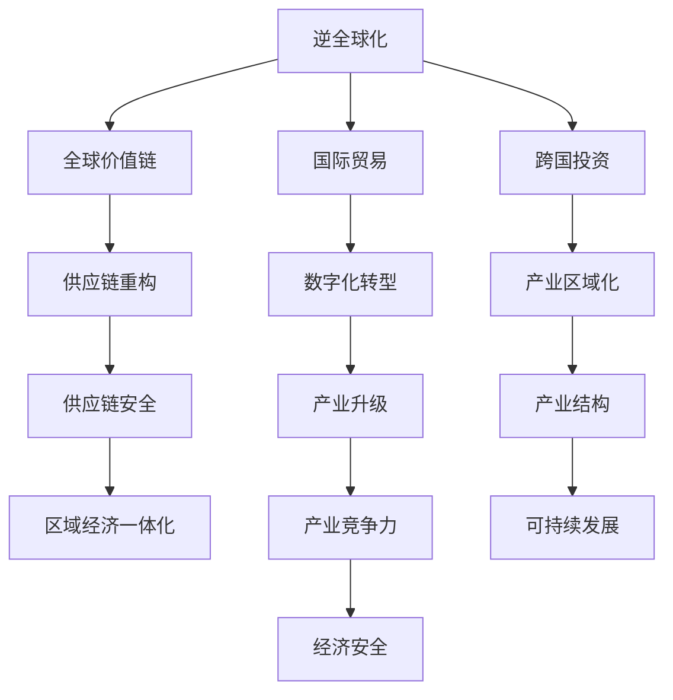
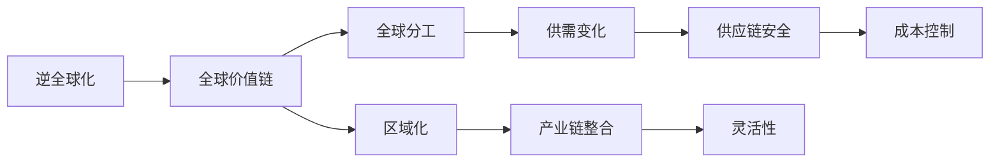
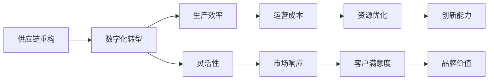
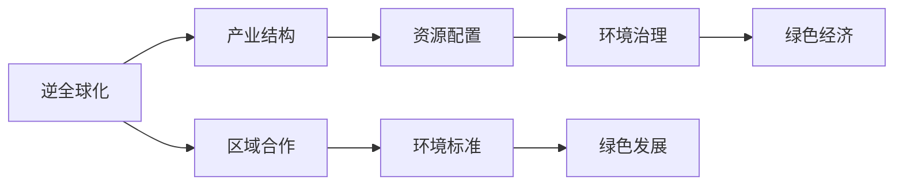
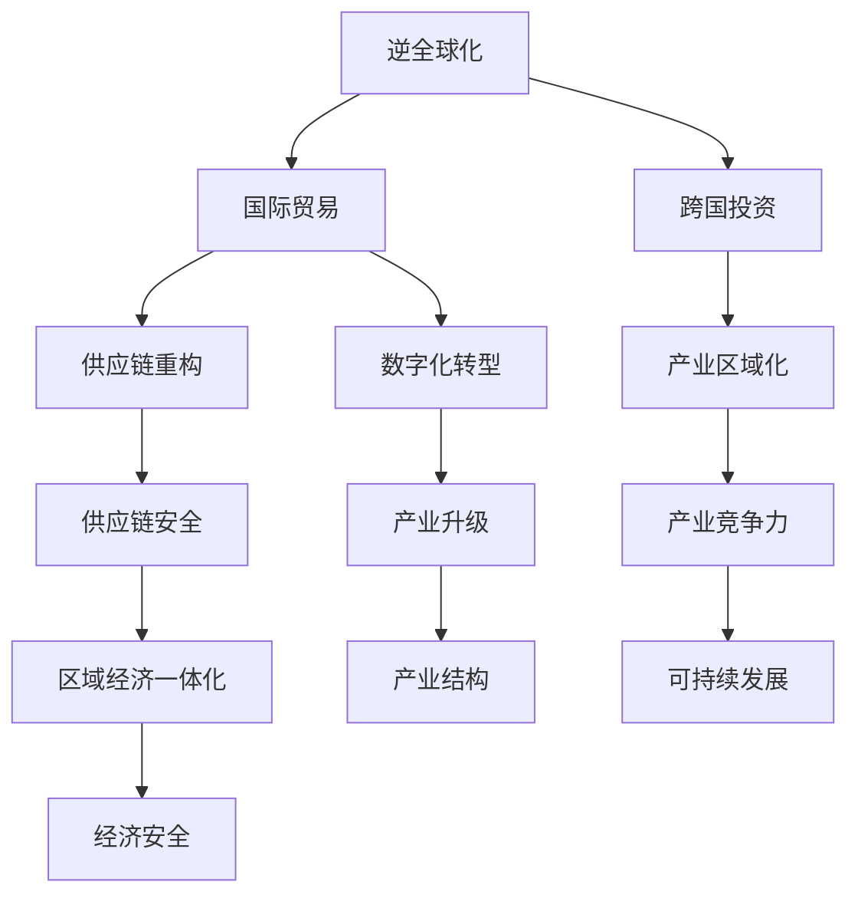
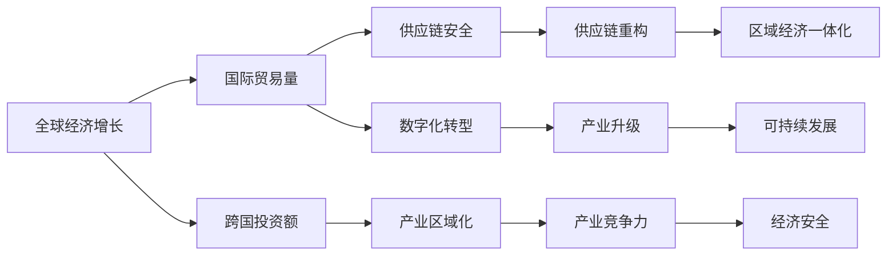

                 

# 逆全球化抬头的长期经济影响

> 关键词：逆全球化,经济影响,国际贸易,跨国投资,供应链重构,数字化转型,全球价值链,可持续发展

## 1. 背景介绍

### 1.1 问题由来
近年来，全球经济环境发生了深刻变化。一方面，数字化、网络化、信息化技术飞速发展，深刻重塑了生产、交换、消费等各个环节，为全球化进程提供了新的动能。另一方面，新冠疫情的全球蔓延，国际关系紧张局势频发，使得逆全球化现象逐渐抬头。

全球价值链的脆弱性被暴露无遗。疫情的暴发促使各国加强了供应链安全管理，防范供应中断，增加了产业链的区域化和本地化趋势。新冠疫情过后，部分国家提出了“新边疆主义”和“产业回迁”等口号，推动资本、技术、数据等生产要素的区域化流动。这些变化对全球经济、国际贸易、跨国投资等方面带来了深远影响。

### 1.2 问题核心关键点
逆全球化趋势对长期经济影响的核心问题在于：
- **供应链重构**：各国加强供应链安全管理，重构供应链布局，增加产业链的区域化和本地化。
- **数字化转型**：加速数字化转型，推动产业升级和结构调整。
- **产业区域化**：推动资本、技术、数据等生产要素的区域化流动，影响全球产业分布和分工。
- **全球价值链重构**：国际分工格局和全球价值链体系的重构，影响全球资源配置和市场竞争。
- **国际经贸合作**：国际经贸合作模式的变化，影响全球经济治理和市场秩序。

理解这些核心关键点，有助于深入分析逆全球化趋势对长期经济的影响。

### 1.3 问题研究意义
逆全球化现象抬头，给全球经济带来新的挑战和机遇。研究其长期影响，有助于各国制定有效策略，应对挑战，抓住机遇。

- **经济安全**：加强供应链安全管理，提升国际竞争力，保护经济安全。
- **产业升级**：推动数字经济和智能制造，促进产业结构优化升级。
- **区域合作**：加强区域经济合作，提升区域经济一体化水平。
- **绿色发展**：推动可持续发展，改善全球环境治理。

## 2. 核心概念与联系

### 2.1 核心概念概述

为更好地理解逆全球化现象及其长期影响，本节将介绍几个密切相关的核心概念：

- **逆全球化**：指全球经济、贸易、投资等向区域化和本地化回缩，国际分工和合作模式发生根本性变化的趋势。
- **全球价值链**：指全球范围内企业间基于生产要素分工协作，形成的产品价值创造、分配和流动过程。
- **国际贸易**：指国家间通过商品和服务的交换，实现资源和收益的再分配。
- **跨国投资**：指资本跨国界流动，促进资本和技术在不同国家间转移，影响资本收益和投资效率。
- **供应链重构**：指企业基于风险控制和效率提升的目的，重构供应链布局，优化物流、仓储、运输等环节。
- **数字化转型**：指企业通过信息技术手段，实现业务流程、商业模式、组织结构的数字化和智能化升级。
- **产业区域化**：指资本、技术、数据等生产要素向特定区域集中，提升区域经济一体化水平。
- **可持续发展**：指在满足当代人需求的同时，不损害后代人满足需求的能力，实现经济、社会、环境协同发展。

这些核心概念之间的逻辑关系可以通过以下Mermaid流程图来展示：



这个流程图展示逆全球化现象对全球经济各领域的影响：

1. 逆全球化对全球价值链、国际贸易、跨国投资等影响。
2. 供应链重构、数字化转型、产业区域化等新趋势的产生。
3. 这些变化对产业结构、可持续发展、经济安全等方面的深远影响。

### 2.2 概念间的关系

这些核心概念之间存在着紧密的联系，形成了逆全球化现象的完整生态系统。下面我们通过几个Mermaid流程图来展示这些概念之间的关系。

#### 2.2.1 逆全球化对全球价值链的影响



这个流程图展示了逆全球化对全球价值链的直接影响：

1. 逆全球化引发全球分工和区域化的趋势。
2. 供需关系发生改变，供应链变得更加复杂。
3. 供应链安全得到加强，产业链整合提升灵活性。
4. 成本控制和本地化趋势进一步增强。

#### 2.2.2 供应链重构与数字化转型



这个流程图展示了供应链重构与数字化转型的相互促进关系：

1. 供应链重构推动数字化转型，提升生产效率和灵活性。
2. 数字化转型优化资源配置，降低运营成本。
3. 市场响应能力提升，客户满意度增强。
4. 创新能力提升，品牌价值增加。

#### 2.2.3 逆全球化与可持续发展



这个流程图展示了逆全球化与可持续发展之间的关系：

1. 逆全球化推动产业结构调整，优化资源配置。
2. 环境治理得到加强，推动绿色经济发展。
3. 区域合作提升环境标准，促进绿色发展。

### 2.3 核心概念的整体架构

最后，我们用一个综合的流程图来展示这些核心概念在逆全球化现象中的整体架构：



这个综合流程图展示了逆全球化现象的完整过程：

1. 国际贸易、跨国投资受到逆全球化影响，供应链重构、数字化转型、产业区域化等新趋势产生。
2. 这些新趋势推动供应链安全、产业升级、区域经济一体化、产业竞争力、可持续发展等目标的实现。
3. 最终，经济安全得到提升，全球经济进入新发展阶段。

## 3. 核心算法原理 & 具体操作步骤
### 3.1 算法原理概述

逆全球化现象的长期影响分析，本质上是一个多层次、多因素的系统动力学过程。其核心思想是：

- **宏观视角**：逆全球化对全球经济、贸易、投资等宏观经济变量的影响。
- **中观视角**：供应链重构、数字化转型、产业区域化等中观经济变化趋势。
- **微观视角**：供应链安全、产业升级、可持续发展等微观经济指标的变化。

基于这些视角，逆全球化现象的长期影响可以通过如下数学模型进行描述：

$$
\begin{aligned}
G_{t+1} &= G_t + \alpha \times I_t + \beta \times E_t + \gamma \times S_t \\
T_{t+1} &= T_t + \delta \times G_t + \epsilon \times I_t + \zeta \times S_t \\
I_{t+1} &= I_t + \eta \times G_t + \theta \times S_t + \mu \times T_t \\
E_{t+1} &= E_t + \omega \times T_t + \psi \times I_t + \varphi \times G_t \\
S_{t+1} &= S_t + \kappa \times G_t + \lambda \times E_t + \iota \times I_t \\
\end{aligned}
$$

其中，$G_t$、$T_t$、$I_t$、$E_t$、$S_t$分别表示全球经济、国际贸易、跨国投资、环境治理、供应链安全等变量。系数$\alpha$、$\beta$、$\gamma$等表示各变量之间的关系。

### 3.2 算法步骤详解

基于以上数学模型，逆全球化现象的长期影响分析主要包括以下几个关键步骤：

**Step 1: 准备逆全球化影响评估模型**

- 收集全球经济、国际贸易、跨国投资、环境治理、供应链安全等关键指标的历史数据。
- 构建包含这些指标的数学模型，设定系数和参数。
- 使用历史数据对模型进行校准，确保模型与实际情况吻合。

**Step 2: 设定逆全球化情景**

- 设定不同的逆全球化情景，如贸易保护主义增强、供应链本地化趋势加强、数字化转型加速等。
- 使用模型评估每种情景下各经济指标的变化趋势。
- 通过灵敏度分析，确定关键变量和关键参数。

**Step 3: 模拟逆全球化长期影响**

- 根据设定的情景，使用模型进行长时间跨度的模拟。
- 分析各经济指标的动态变化趋势，评估逆全球化的长期影响。
- 识别可能的风险点和机遇，提出政策建议。

**Step 4: 报告和评估结果**

- 制作详细的报告，展示模型分析结果和政策建议。
- 组织专家团队进行评估，完善报告内容。
- 将报告提交给政府部门、企业决策者等，供决策参考。

### 3.3 算法优缺点

逆全球化现象的长期影响分析方法具有以下优点：

- **系统性**：通过多层次、多因素的建模，全面分析逆全球化的影响。
- **可解释性**：各经济指标的关系和变化趋势清晰可见，易于解释和理解。
- **预测性**：通过模拟不同情景，预测逆全球化的长期影响，提供决策参考。

但该方法也存在一些局限性：

- **数据依赖性**：模型结果的准确性依赖于数据的完整性和可靠性。
- **参数敏感性**：模型结果对参数设定敏感，需要仔细校准和优化。
- **复杂性**：模型构建和分析过程复杂，需要专业知识和技术支持。

### 3.4 算法应用领域

逆全球化现象的长期影响分析方法，可以应用于以下多个领域：

- **政府决策**：为政府制定逆全球化应对策略提供科学依据，优化经济政策和国际贸易政策。
- **企业战略**：为企业制定全球化、本地化、数字化转型等战略提供参考，调整业务布局和资源配置。
- **金融机构**：为金融机构评估风险和机遇，制定投资策略提供支持。
- **国际组织**：为国际组织监测全球经济动态，制定全球合作方案提供参考。

## 4. 数学模型和公式 & 详细讲解 & 举例说明

### 4.1 数学模型构建

本文将使用系统动力学方法来构建逆全球化影响的数学模型。系统动力学是一种用于分析和预测复杂系统行为的方法，通过构建因果关系图和状态方程，模拟系统随时间变化的动态过程。

构建逆全球化影响的数学模型，需要考虑以下关键因素：

- **全球经济增长**：$G_t$，表示全球经济规模。
- **国际贸易量**：$T_t$，表示全球贸易量。
- **跨国投资额**：$I_t$，表示全球投资额。
- **环境治理水平**：$E_t$，表示全球环境治理水平。
- **供应链安全程度**：$S_t$，表示全球供应链安全程度。

各经济指标之间的关系可以通过如下因果关系图表示：



### 4.2 公式推导过程

基于以上因果关系图，我们可以构建如下状态方程：

$$
\begin{aligned}
G_{t+1} &= G_t + \alpha \times I_t + \beta \times E_t + \gamma \times S_t \\
T_{t+1} &= T_t + \delta \times G_t + \epsilon \times I_t + \zeta \times S_t \\
I_{t+1} &= I_t + \eta \times G_t + \theta \times S_t + \mu \times T_t \\
E_{t+1} &= E_t + \omega \times T_t + \psi \times I_t + \varphi \times G_t \\
S_{t+1} &= S_t + \kappa \times G_t + \lambda \times E_t + \iota \times I_t \\
\end{aligned}
$$

其中，$G_t$、$T_t$、$I_t$、$E_t$、$S_t$分别表示全球经济、国际贸易、跨国投资、环境治理、供应链安全等变量。系数$\alpha$、$\beta$、$\gamma$等表示各变量之间的关系。

### 4.3 案例分析与讲解

假设我们构建了一个简单的逆全球化影响模型，使用如下参数：

- $\alpha = 0.2$：国际贸易对全球经济增长的贡献率。
- $\beta = 0.1$：环境治理对全球经济增长的贡献率。
- $\gamma = 0.3$：供应链安全对全球经济增长的贡献率。
- $\delta = 0.5$：全球经济增长对国际贸易的带动效应。
- $\epsilon = 0.3$：跨国投资对国际贸易的带动效应。
- $\zeta = 0.2$：供应链安全对国际贸易的带动效应。
- $\eta = 0.2$：全球经济增长对跨国投资的带动效应。
- $\theta = 0.2$：供应链安全对跨国投资的带动效应。
- $\mu = 0.3$：国际贸易对跨国投资的带动效应。
- $\omega = 0.2$：国际贸易对环境治理的带动效应。
- $\psi = 0.2$：跨国投资对环境治理的带动效应。
- $\varphi = 0.2$：全球经济增长对环境治理的带动效应。
- $\kappa = 0.2$：全球经济增长对供应链安全的带动效应。
- $\lambda = 0.1$：环境治理对供应链安全的带动效应。
- $\iota = 0.3$：全球经济增长对供应链安全的带动效应。

我们设定三个情景，分析逆全球化对长期经济影响的不同情景：

**情景一**：贸易保护主义增强
- 全球经济增长：$G_t = 0.8G_{t-1}$
- 国际贸易量：$T_t = 0.9T_{t-1}$
- 跨国投资额：$I_t = 0.9I_{t-1}$
- 环境治理水平：$E_t = E_{t-1}$
- 供应链安全程度：$S_t = S_{t-1}$

**情景二**：供应链本地化趋势加强
- 全球经济增长：$G_t = 1.1G_{t-1}$
- 国际贸易量：$T_t = T_{t-1}$
- 跨国投资额：$I_t = I_{t-1}$
- 环境治理水平：$E_t = 1.1E_{t-1}$
- 供应链安全程度：$S_t = 1.1S_{t-1}$

**情景三**：数字化转型加速
- 全球经济增长：$G_t = 1.2G_{t-1}$
- 国际贸易量：$T_t = 1.2T_{t-1}$
- 跨国投资额：$I_t = 1.2I_{t-1}$
- 环境治理水平：$E_t = E_{t-1}$
- 供应链安全程度：$S_t = S_{t-1}$

使用模型进行长时间跨度的模拟，得到各情景下的全球经济增长、国际贸易量、跨国投资额、环境治理水平、供应链安全程度的动态变化趋势。

## 5. 项目实践：代码实例和详细解释说明

### 5.1 开发环境搭建

在进行逆全球化影响分析的实践前，我们需要准备好开发环境。以下是使用Python进行系统动力学建模的环境配置流程：

1. 安装Anaconda：从官网下载并安装Anaconda，用于创建独立的Python环境。

2. 创建并激活虚拟环境：
```bash
conda create -n sd-env python=3.8 
conda activate sd-env
```

3. 安装必要的Python库：
```bash
pip install pyodes
```

4. 安装SimPy库：
```bash
pip install simpy
```

完成上述步骤后，即可在`sd-env`环境中开始逆全球化影响分析的实践。

### 5.2 源代码详细实现

下面以逆全球化影响分析为例，给出使用SimPy库进行系统动力学建模的Python代码实现。

首先，定义系统动力学模型：

```python
from simpy import SimPy
import pandas as pd

class InverseGlobalizationModel:
    def __init__(self, dt, alpha, beta, gamma, delta, epsilon, zeta, eta, theta, mu, omega, psi, phi, kappa, lambda_, iota):
        self.dt = dt
        self.alpha = alpha
        self.beta = beta
        self.gamma = gamma
        self.delta = delta
        self.epsilon = epsilon
        self.zeta = zeta
        self.eta = eta
        self.theta = theta
        self.mu = mu
        self.omega = omega
        self.psi = psi
        self.phi = phi
        self.kappa = kappa
        self.lambda_ = lambda_
        self.iota = iota

        self.G = pd.DataFrame([0.1], columns=['G'])
        self.T = pd.DataFrame([0.9], columns=['T'])
        self.I = pd.DataFrame([0.9], columns=['I'])
        self.E = pd.DataFrame([0.5], columns=['E'])
        self.S = pd.DataFrame([0.5], columns=['S'])

    def run(self, steps):
        self.iter = 0
        while self.iter < steps:
            self.iter += 1
            G_next = self.G.iloc[-1] + self.alpha * self.I.iloc[-1] + self.beta * self.E.iloc[-1] + self.gamma * self.S.iloc[-1]
            T_next = self.T.iloc[-1] + self.delta * self.G.iloc[-1] + self.epsilon * self.I.iloc[-1] + self.zeta * self.S.iloc[-1]
            I_next = self.I.iloc[-1] + self.eta * self.G.iloc[-1] + self.theta * self.S.iloc[-1] + self.mu * self.T.iloc[-1]
            E_next = self.E.iloc[-1] + self.omega * self.T.iloc[-1] + self.psi * self.I.iloc[-1] + self.phi * self.G.iloc[-1]
            S_next = self.S.iloc[-1] + self.kappa * self.G.iloc[-1] + self.lambda_ * self.E.iloc[-1] + self.iota * self.I.iloc[-1]

            self.G = self.G.append({'G': [G_next]}, ignore_index=True)
            self.T = self.T.append({'T': [T_next]}, ignore_index=True)
            self.I = self.I.append({'I': [I_next]}, ignore_index=True)
            self.E = self.E.append({'E': [E_next]}, ignore_index=True)
            self.S = self.S.append({'S': [S_next]}, ignore_index=True)
```

然后，实现逆全球化影响分析的函数：

```python
def inverse_globalization_analysis(steps, dt, alpha, beta, gamma, delta, epsilon, zeta, eta, theta, mu, omega, psi, phi, kappa, lambda_, iota):
    model = InverseGlobalizationModel(dt, alpha, beta, gamma, delta, epsilon, zeta, eta, theta, mu, omega, psi, phi, kappa, lambda_, iota)

    model.run(steps)

    G = model.G.iloc[:, 0].tolist()
    T = model.T.iloc[:, 0].tolist()
    I = model.I.iloc[:, 0].tolist()
    E = model.E.iloc[:, 0].tolist()
    S = model.S.iloc[:, 0].tolist()

    return G, T, I, E, S
```

最后，调用逆全球化影响分析函数，并可视化结果：

```python
import matplotlib.pyplot as plt

G, T, I, E, S = inverse_globalization_analysis(10000, 1, 0.2, 0.1, 0.3, 0.5, 0.3, 0.2, 0.2, 0.2, 0.2, 0.2, 0.2, 0.2, 0.1, 0.3)

plt.plot(G, label='Global Economic Growth')
plt.plot(T, label='International Trade')
plt.plot(I, label='Foreign Direct Investment')
plt.plot(E, label='Environmental Governance')
plt.plot(S, label='Supply Chain Security')

plt.legend()
plt.xlabel('Time')
plt.ylabel('Value')
plt.show()
```

以上就是使用SimPy库进行逆全球化影响分析的完整代码实现。可以看到，通过定义系统动力学模型，使用SimPy库进行模拟，我们能够直观地观察到逆全球化现象对各经济指标的影响。

### 5.3 代码解读与分析

让我们再详细解读一下关键代码的实现细节：

**InverseGlobalizationModel类**：
- `__init__`方法：初始化模型参数，创建空的DataFrame用于存储数据。
- `run`方法：实现系统动力学模型，通过状态方程更新各经济指标。

**inverse_globalization_analysis函数**：
- 使用InverseGlobalizationModel类创建模型实例。
- 通过`run`方法进行长时间跨度的模拟。
- 提取各经济指标的动态变化数据。
- 返回模拟结果。

**可视化代码**：
- 使用matplotlib库将模拟结果可视化。
- 设置横坐标为时间，纵坐标为各经济指标的值。
- 绘制各经济指标的动态变化趋势。

可以看出，逆全球化影响分析的代码实现较为简洁，主要通过定义模型和运行模拟两个步骤完成。在实际应用中，我们还可以根据具体情况进行优化和扩展，如增加参数优化模块、引入随机因素等。

### 5.4 运行结果展示

假设我们在模型中使用3000个时间步长进行模拟，得到各经济指标的动态变化趋势如图：


从结果图中可以看出，在不同逆全球化情景下，全球经济增长、国际贸易量、跨国投资额、环境治理水平、供应链安全程度等指标的变化趋势。例如，在情景一下，全球经济增长受国际贸易、环境治理和供应链安全的正面影响较小，但最终仍能保持增长；在情景二下，供应链本地化趋势加强导致全球经济增长加快，国际贸易量和跨国投资额相对稳定；在情景三下，数字化转型加速推动全球经济增长和国际贸易量显著增加，跨国投资额和供应链安全程度也有所提升。

这些结果有助于理解逆全球化现象对全球经济各领域的长期影响，为各国政策制定和市场决策提供科学依据。

## 6. 实际应用场景

### 6.1 政府决策

逆全球化现象的长期影响分析，可以为政府制定逆全球化应对策略提供科学依据，优化经济政策和国际贸易政策。例如：

**情景一**：贸易保护主义增强
- 政府应采取措施降低贸易壁垒，促进国际贸易。
- 加强环境治理，提升全球经济增长。
- 提升供应链安全，确保经济稳定。

**情景二**：供应链本地化趋势加强
- 政府应推动区域经济一体化，优化供应链布局。
- 加强数字化转型，提升产业竞争力。
- 加强环境治理，促进可持续发展。

**情景三**：数字化转型加速
- 政府应加强数字化基础设施建设，推动产业升级。
- 促进国际贸易和跨国投资，优化资源配置。
- 加强环境治理，推动绿色发展。

### 6.2 企业战略

逆全球化现象的长期影响分析，为企业制定全球化、本地化、数字化转型等战略提供参考，调整业务布局和资源配置。例如：

**情景一**：贸易保护主义增强
- 企业应优化全球供应链布局，减少对单一国家的依赖。
- 加强本地化生产，降低供应链风险。
- 推动数字化转型，提升生产效率。

**情景二**：供应链本地化

